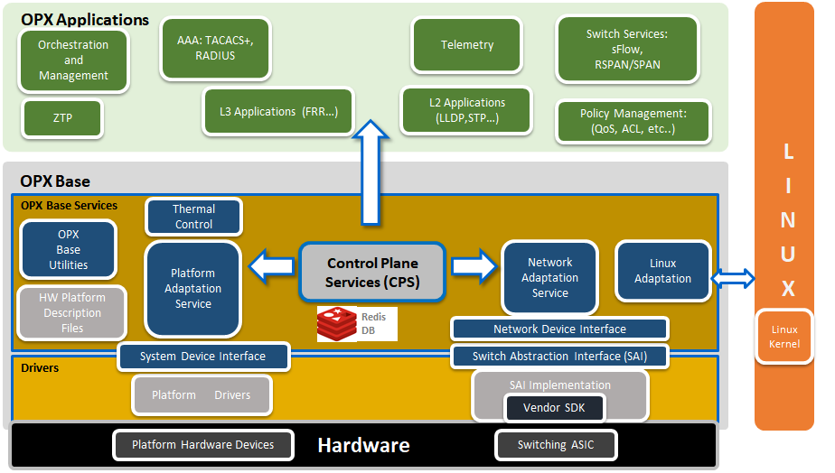

# Adding Hashing to OpenSwitch
This is the first problem: https://github.com/open-switch/opx-tools/issues/27

He says the code should be somewhere here: https://github.com/open-switch/opx-base-model/blob/master/yang-models/dell-base-hash.yang

[Helpful docs on how yang is processed](https://github.com/open-switch/opx-base-model)

[Helpful forum communication about header files](https://lists.openswitch.net/g/dev/topic/24228194?p=Created,,,20,2,0,0::recentpostdate%2Fsticky,,,20,2,0,24228194)

## Installing header files for OPX base

Run `apt install -y libopx-base-model-dev`. The headers will be in `/usr/include/opx`. The metadata files are in `ls /usr/lib/x86_64-linux-gnu/`

## Adding Space / Remote Desktop

I wanted more space on my installation so I added a usb drive. Do the following
to clear the USB driver and then add space:

### Configure USB

    fdisk /dev/sdb
    d
    d
    d
    w

### Extend Partition

    pvcreate /deb/sdb
    vgextend OPX /dev/sdb
    lvextend -l +100%FREE /dev/OPX/SYSROOT1
    resize2fs /dev/mapper/OPX-SYSROOT1

### Remote Desktop

    sudo apt update
    sudo apt install xfce4 xfce4-goodies xorg dbus-x11 x11-xserver-utils
    sudo apt install xrdp
    sudo adduser xrdp ssl-cert 
    xfce4-session-logout --halt

#### On CentOS 7

    yum install -y epel-release
    yum groupinstall -y "Xfce"
    echo "xfce4-session" > ~/.Xclients
    chmod a+x ~/.Xclients

## Set Up VM

### Failed, but should have worked

wget http://archive.openswitch.net/vm-tools/lvm
chmod +x lvm
wget https://dell-networking.bintray.com/opx-images/opx-onie-installer_1.1_amd64.bin
wget https://dell-networking.bintray.com/opx-images/onie-kvm_x86_64-r0.iso
wget https://archive.openswitch.net/installers/3.2.1/Dell-EMC/PKGS_OPX-3.2.1-installer-x86_64.bin
./lvm create openswitch --iso onie-kvm_x86_64-r0.iso --bin PKGS_OPX-3.2.1-installer-x86_64.bin

### Building from source

[Docs](https://github.com/opencomputeproject/onie/tree/master/contrib/build-env)

    git clone https://github.com/opencomputeproject/onie.git
    cd onie/contrib/build-env/
    docker build -t debian:build-env .
    mkdir --mode=0777 -p opt/src
    docker run -it -v /opt/src:/home/build/src --privileged --name onie debian:build-env

In the container:

./clone-onie
cd src/onie/build-config
make -j4 MACHINE=kvm_x86_64 all

## Build an installer

See available distrubitions: `opx-build/scripts/opx_run opx_rel_pkgasm.py --help`

After running a build you can run `opx-build/scripts/opx_run opx_rel_pkgasm.py --dist unstable -b opx-onie-installer/release_bp/OPX_dell_base.xml` to build an installer

This looks like it should be the docker build command `docker run --rm --name root_root_32994 --privileged -e LOCAL_UID=0 -e LOCAL_GID=0 -v /root:/mnt -v /root/.gitconfig:/home/opx/.gitconfig -v /etc/localtime:/etc/localtime:ro -e ARCH -e DIST -e OPX_RELEASE -e OPX_GIT_TAG -e CUSTOM_SOURCES opxhub/build:latest`

## Investigation into the opx-config-global-switch problem

- cps_get_oid.py -qua target base-switch/switching-entities/switching-entity
- The question to ask is - what is the server application for the CPS object?
- The problem is that in `opx-config-global-switch` the value `lag-hash-fields` isn't present in target_attrs  on line 214 of opx-config-global-switch
  - The question is what would populate that?
- I don't think any of what I care about is in NAS L2.
  - NAS L2 handles This repository contains the Layer 2 (L2) component of the network abstraction service (NAS). This handles media access control (MAC) learning, programming spanning-tree protocol (STP) state, mirroring, sFlow, and other switch configurations.
- I think what I care about is in opx-nas-interface because the operating system is handling the LAG. Description is
  - This repository contains the interface portion of the network abstraction service (NAS). This creates interfaces in the Linux kernel corresponding to the network processor unit (NPU) front panel ports, manages VLAN and LAG configurations, statistics management and control packet handling.
- Logically there are three components including the LAG: LAG DS, NAS LAG, NDI LAG. See picture.
- NAS Daemon: The NAS daemon integrates standard Linux network APIs with NPU hardware functionality, and registers and listens to networking (netlink) events.
- What enum values in the model of dell-base-hash align with what's in opx-config-global-switch in hash fields map.
  - What are all these actions in opx-config-global-switch?
  - Ok - so now we know the thing I want is in base-traffic-hash/entry, but `opx-config-global-switch` is looking at `base-switch/switching-entities/switching-entity`. The next question is what populates that? Why are the hashes not in it?
    - The definition for switching-entity is at: https://github.com/open-switch/opx-base-model/blob/abdf66f813b48a3c8e7682361cdacccd0271866d/yang-models/dell-base-switch-element.yang
    - Say what? `hash-fields` is also defined in `base-switch/switching-entities/switching-entity`
- The next question to ask is who has ownership of base-traffic-hash? What about base-switch/switching-entities/switching-entity? The problem seems like it should be there? Why? 
  - base-traffic-hash is owned by opx_nas_daemon
  - base-switch/switching-entities/switching-entity is also owned by opx_nas_daemon
- CPS has a REST service according to: https://github.com/open-switch/opx-cps
- The connection between YANG and the applications seems to be the CPS API? 
  - Applications define objects through (optionally YANG-based) object models. These object models are converted into binary (C accessible) object keys and object attributes that can be used in conjunction with the C-based CPS APIs.
- Description of cps_model_info: This tool is useful to get all information about CPS objects on the target. It is used to get the attributes of a specific CPS object, or first-level contents of a given YANG path of the CPS object (as defined in the YANG model).
  - IT GIVES THE PROCESS OWNER!
- Investigating ops-nas-daemon
  - There is a file called base_nas_default_init which defines the mirror port and the flow behaviors. I haven't found anything about other stuff yet.
    - `opx-config-global-switch --lag-hash-alg crc` works and is owned by opx_nas_daemon - there must be other things it owns beside this.
    - There is a file called `hald_init.c`. I think what is happening is all the other services fall under the NAS daemon. The code I'm looking for is somewhere else.
      - After following that around for a while it looks like the file I'm really interested in is here `https://github.com/open-switch/opx-nas-l2/blob/7e80d3952786f219b8072f1666ff1f16ba353d86/src/switch/nas_hash_cps.cpp`. This bubbles up to the L2 init function, which bubbles back up to `hald_init.c`.
        - `dell-base-hash.h` gets included in this thing.
- The YANG for the regular hash algorithm is at https://github.com/open-switch/opx-base-model/blob/abdf66f813b48a3c8e7682361cdacccd0271866d/yang-models/dell-base-switch-element.yang
- Initial investigation finished opened: https://github.com/open-switch/opx-nas-l2/issues/34

## Investigation 2 - Compilation problems

- https://android.googlesource.com/platform/hardware/broadcom/wlan/+/master/bcmdhd/config/config-bcm.mk - examlpe config-bcm file. Seems to have something to do with broadcom's config.
  - Better example configuration from Broadcom: http://broadcom-switch.github.io/OpenNSL/doc/html/OPENNSL_CUSTOMIZING_OPENNSL.html#OPENNSL_CONFIG_EXAMPLE
  - Configuration properties: http://broadcom-switch.github.io/OpenNSL/doc/html/OPENNSL_CUSTOMIZING_OPENNSL.html#OPENNSL_CONFIG_PROPERTIES
- More info on config.bcm https://docs.broadcom.com/doc/12378910

## Investigation 3 - post compilation value still missing

- The hash variables seem to be passed by pointer from nas_hash_cps.cpp to nas_ndi_hash.c in line 222.
  - The SAI portion of the hash creation seems to be here which could prove helpful later.
- In the bug at https://github.com/open-switch/opx-tools/issues/27 where he says `obj-type` that is referring to the YANG model. There is a leaf called `obj-type`.
  - Traffic refers to:

        typedef traffic {
            type enumeration {
                enum "ECMP_NON_IP" {
                    value 1;
            description "ECMP routing: flow of non-IP ethernet frames";
                }
                enum "LAG_NON_IP" {
                    value 2;
            description "LAG routing: flow of non-IP ethernet frames";
                }
                enum "ECMP_IPV4" {
                    value 3;
            description "ECMP routing: flow of IPv4 packets";
                }
                enum "ECMP_IPV4_IN_IPV4" {
                    value 4;
            description "ECMP routing: flow of IPv4 packets with
                                    IPv4 packets tunnelled inside them";
                }
                enum "ECMP_IPV6" {
                    value 5;
            description "ECMP routing: flow of IPv6 packets";
                }
                enum "LAG_IPV4" {
                    value 6;
            description "LAG routing: flow of IPv4 packets";
                }
                enum "LAG_IPV4_IN_IPV4" {
                    value 7;
            description "ECMP routing: flow of IPv4 packets with
                                    IPv4 packets tunnelled inside them";
                }
                enum "LAG_IPV6" {
                    value 8;
            description "LAG routing: traffic flow is identified as IPv6 packets";
                }
            }
            description "Enumeration of different types of traffic routing categories";
        }
  - `std-hash-field` is a leaf-list with a type of `field`. `field` is defined as:

        typedef field {
            type enumeration {
                enum "src-ip" {
                    value 1;
                    description "Traffic flow is identified by the source IP";
                }
                enum "dest-ip" {
                    value 2;
                    description "Traffic flow is identified by the destination IP";
                }
                enum "inner-src-ip" {
                    value 3;
                    description "Traffic flow is identified by the source IP of the tunnelled packet";
                }
                enum "inner-dst-ip" {
                    value 4;
                    description "Traffic flow is identified by the destination IP of the tunnelled packet";
                }
                enum "vlan-id" {
                    value 5;
                    description "Traffic flow is identified by the VLAN ID in the packet";
                }
                enum "ip-protocol" {
                    value 6;
                    description "Traffic flow is identified by the IP protocol type(v4/v6)";
                }
                enum "ethertype" {
                    value 7;
                    description "Traffic flow is identified by the IP protocol ether-type";
                }
                enum "l4-src-port" {
                    value 8;
                    description "Traffic flow is identified by the source port in the packet";
                }
                enum "l4-dest-port" {
                    value 9;
                    description "Traffic flow is identified by the destination port in the packet";
                }
                enum "src-mac" {
                    value 10;
                    description "Traffic flow is identified by the source MAC address";
                }
                enum "dest-mac" {
                    value 11;
                    description "Traffic flow is identified by the destination MAC address";
                }
                enum "in-port" {
                    value 12;
                    description "Traffic flow is identified by the front-panel port the packet is received at";
                }
            }
            description "Enumeration of different types of packet fields to check for routing";
        }
- `cps_get` definition:

    def cps_get(q, obj, attrs={}):
        resp = []
        return resp if cps.get([cps_object.CPSObject(obj,
                                                    qual=q,
                                                    data=attrs
                                                ).get()
                            ], resp
        ) else None

    def cps_set(obj, qual, data):
    return (cps_utils.CPSTransaction([('set',
                cps_object.CPSObject(obj, qual=qual, data=data).get())]).commit()
            )
- `cps_set('base-pas/led', 'target', {'entity-type': 3, 'slot': 1, 'name': 'Beacon', 'on': args.state})`
- Set syntax: `root@OPX:~# cps_set_oid.py -qua target -oper set -attr base-switch/entry/std-hash-field=1,2,8,9,6,5 base-switch/entry base-switch/entry/obj-type=6`
- cps_get python syntax: `cps_get('target', 'base-traffic-hash/entry', {'base-traffic-hash/entry/obj-type': '2'})`. That would get the object `target` from qualifier  `base-switch/entry` which has attribute of `base-switch/entry/obj-type` (which is the key in entry) and we specifically want key 1 which is a type of traffic correspeonding to `ECMP_NON_IP`

  >> pp.pprint(cps_get('target', 'base-traffic-hash/entry', {'base-traffic-hash/entry/obj-type': '6'}))
  [   {   'data': {   'base-traffic-hash/entry/std-hash-field': [   bytearray(b'\x01\x00\x00\x00'),
                                                                    bytearray(b'\x02\x00\x00\x00'),
                                                                    bytearray(b'\x08\x00\x00\x00'),
                                                                    bytearray(b'\t\x00\x00\x00'),
                                                                    bytearray(b'\x06\x00\x00\x00')]},
          'key': '1.257.16842755.16842753.16842754.'}]

- CORRECT SYNTAX FOR CPS_SET: `cps_set('base-traffic-hash/entry', 'target', {'base-traffic-hash/entry/obj-type': '6', 'base-traffic-hash/entry/std-hash-field': [1,2,8,9,6,5]})`

## Investigation 4 - Where are the hash values?

- Part of the hash seems to be set in [nas_ndi_switch.cpp](https://github.com/open-switch/opx-nas-ndi/blob/1ba4c72309ef33d8600b18dedabc8aed2a8665ac/src/nas_ndi_switch.cpp)
- There is also a unit test for it in [sai_hash_unit_test.cpp](https://github.com/open-switch/opx-sai-common/blob/9939160482f331a0770fade523c94d607e5a70dc/src/unit_test/hash/sai_hash_unit_test.cpp)
- This code seems to imply that the hashes themselves are implemented in the SAI:

        static _enum_map _algo_stoy  = {
            {SAI_HASH_ALGORITHM_XOR, BASE_SWITCH_HASH_ALGORITHM_XOR },
            {SAI_HASH_ALGORITHM_CRC, BASE_SWITCH_HASH_ALGORITHM_CRC },
            {SAI_HASH_ALGORITHM_RANDOM, BASE_SWITCH_HASH_ALGORITHM_RANDOM },
            {SAI_HASH_ALGORITHM_CRC_CCITT, BASE_SWITCH_HASH_ALGORITHM_CRC16CC },
            {SAI_HASH_ALGORITHM_CRC_32LO, BASE_SWITCH_HASH_ALGORITHM_CRC32LSB },
            {SAI_HASH_ALGORITHM_CRC_32HI, BASE_SWITCH_HASH_ALGORITHM_CRC32MSB },
            {SAI_HASH_ALGORITHM_CRC_XOR8, BASE_SWITCH_HASH_ALGORITHM_XOR8 },
            {SAI_HASH_ALGORITHM_CRC_XOR4, BASE_SWITCH_HASH_ALGORITHM_XOR4 },
            {SAI_HASH_ALGORITHM_CRC_XOR2, BASE_SWITCH_HASH_ALGORITHM_XOR2 },
            {SAI_HASH_ALGORITHM_CRC_XOR1, BASE_SWITCH_HASH_ALGORITHM_XOR1 },
        };

        static bool to_sai_type_hash_algo(sai_attribute_t *param ) {
            return to_sai_type(_algo_stoy,param);
        }

        static bool from_sai_type_hash_algo(sai_attribute_t *param ) {
            return from_sai_type(_algo_stoy,param);
        }

  - There is a reference to each of these hash algorithms in `https://github.com/open-switch/opx-base-model/blob/abdf66f813b48a3c8e7682361cdacccd0271866d/history/dell-base-switch-element.yhist`
  - From the SAI unit test I found:

            set_attr.value.s32 = SAI_HASH_ALGORITHM_XOR;
            status = switch_api_tbl_get()->set_switch_attribute (switch_id,&set_attr);
            EXPECT_EQ (SAI_STATUS_SUCCESS, status);

  - This must be where they are setting the hash algorithm and how to set it. But where is this API? How do I find out what the options are? Is symmetric hashing exposed?
  - The definition for the function is (it happens inside one of the unit tests):

        static inline sai_switch_api_t* switch_api_tbl_get (void)
        {
            return p_sai_switch_api_tbl;
        }

    - This is a pointer to a table. I'm guessing it's a struct. `sai_switch_api_t` is short for SAI switch API table. It is a pointer to the table with all the API calls.
      - From [this](https://github.com/opencomputeproject/SAI/blob/master/stub/inc/stub_sai.h) I got a hint - it looks like there is a thing called switch_api - the same name is used in OpenSwitch.
    - Based on the inputs from [nas_ndi_hash.c](https://github.com/open-switch/opx-nas-ndi/blob/1ba4c72309ef33d8600b18dedabc8aed2a8665ac/src/nas_ndi_hash.c) there must be a series of SAI files with the functionality I want.

            #include "std_error_codes.h"
            #include "std_assert.h"
            #include "nas_ndi_event_logs.h"
            #include "nas_ndi_utils.h"
            #include "dell-base-hash.h"

            #include "sai.h"
            #include "saiswitch.h"
            #include "saihash.h"

            #include <stdio.h>
            #include <stdlib.h>
            #include <string.h>

            #include <inttypes.h>

    - 
### Some related resources
- [ECMP Hashing explained](https://docs.cumulusnetworks.com/cumulus-linux-41/Layer-3/Equal-Cost-Multipath-Load-Sharing-Hardware-ECMP/#:~:text=setting%20symmetric_hash_enable%20%3D%20FALSE%20.-,Resilient%20Hashing,this%20can%20create%20session%20failures.)
- [Broadcom Paper on Hashing](https://docs.broadcom.com/doc/12358326)
- [Can I do this with openvswitch](http://docs.openvswitch.org/en/latest/tutorials/ovs-conntrack/)
  - This didn't pan out.
- [Broadcom docs](http://broadcom-switch.github.io/OpenNSL/doc/html/pages.html)

## Descriptions

### NAS

The NAS manages the high-level NPU abstraction and adaptation, and abstracts and aggregates the core functionality required for networking access at Layer 1 (physical), Layer 2 (VLAN, link aggregation), Layer 3 (routing), ACL, QoS, and network monitoring.

The NAS provides adaptation of the low-level switch abstraction provided by the SAI for standard Linux networking APIs and interfaces, and CPS API functionality. The NAS is also responsible for providing packet I/O services using the Linux kernel IP stack (see Network adaptation service for complete information).