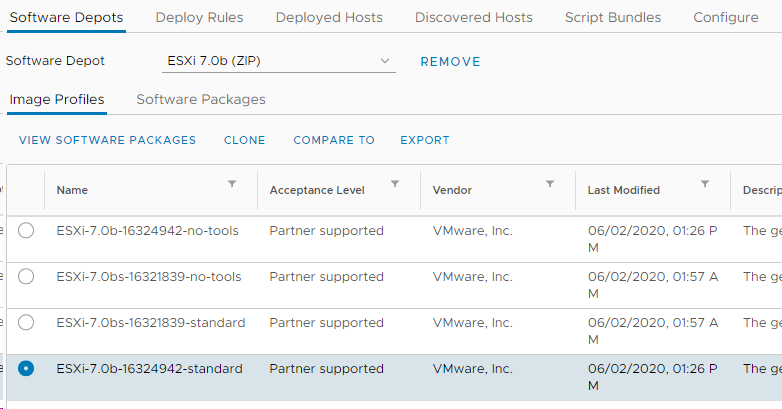

# Adding Intel I219-LM (8086.0d4c) Driver to ESXi

1. Download the following:
   1. [ne1000 VIB (offline bundle)](https://download3.vmware.com/software/vmw-tools/Intel-NUC-ne1000_0.8.4-3vmw.670.0.0.8169922-offline_bundle-16654787.zip)
   2. [ESXi 7.0 GA Offline Bundle (VMware-ESXi-7.0.0-15843807-depot.zip](https://my.vmware.com/group/vmware/downloads/details?downloadGroup=ESXI700&productId=974&rPId=47905)
   3. [ESXi 7.0b patch Offline Bundle](https://my.vmware.com/group/vmware/patch)
2. Open vCenter and go to Menu->Auto Deploy->Image Builder
3. Import all three offline bundles with the following names which will be referenced: ESXi 7.0 GA, ESXi 7.0b and Intel Driver
   1. I originally received `"Your software depot "Intel Driver" failed to import. Try importing it again or choose another software depot to import."`. Fix action: Leave the page, come back, delete the name of the failed import, and then reimport with the same name. I had to do it three times total and the third it worked.
4. Select the ESXi 7.0b Software Depot and make a note of the build number for the specific Image Profile you wish to use. In this case, we will be using 16324942 which is the "full" image which includes both bug fix + security fix along with VMware Tools. If you only want the security fix, use 16321839.

5. In the right hand corner, click New to create a new Custom Depot called I219-8086.0d4c and then create new Image Profile and provide a name, vendor and description of your choosing.
6. On the Depot column, filter by ESXi 7.0b initially and select the following 13 packages as shown in the screenshot below. I used the version `7.0.0-1.25.16324942`. I just sorted by version as well and then grabbed nvme-pcie and vmkusb separately.
   1. cpu-microcode
   2. crx
   3. esx-base
   4. esx-dvfilter-generic-fastpath
   5. esx-update
   6. esx-xserver
   7. loadesx
   8. native-misc-drvers
   9. nvme-pcie
   10. vdfs
   11. vmkusb
   12. vsan
   13. vsanhealth
7. On the Depot column, filter by Intel Driver and select the ne1000-intelnuc package
8. On the Depot column, filter by ESXi 7.0 GA and select everything, EXCEPT for the 13 packages we had already selected from Step 6.
9. At the end I had 73 packages.
10. You can now export and either download the Image Profile either as a bootable ISO which can then be used for fresh installation and/or upgrade as well as using vSphere Update Manager. You can also download the Image Profile which can be used to update via ESXCLI on the ESXi Shell.

## Resources

[How to make your unsupported NIC work with ESXi 5.x or 6.0](https://www.v-front.de/2014/12/how-to-make-your-unsupported-nic-work.html?fbclid=IwAR3VaW1OyibYhe8GX13SJhNIn0_UJmGoW1wR1x-bXBH8vtjdBVZrpnBgkwo)

[https://www.virtuallyghetto.com/2020/01/esxi-on-10th-gen-intel-nuc-frost-canyon.html](https://www.virtuallyghetto.com/2020/01/esxi-on-10th-gen-intel-nuc-frost-canyon.html)

[Enhancements to the community ne1000 VIB for Intel NUC 10](https://www.virtuallyghetto.com/2020/08/enhancements-to-the-community-ne1000-vib-for-intel-nuc-10.html)