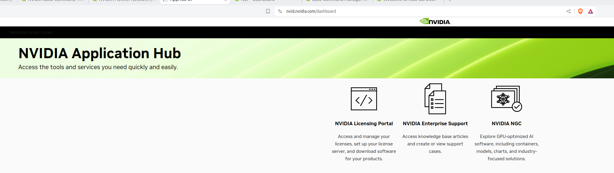
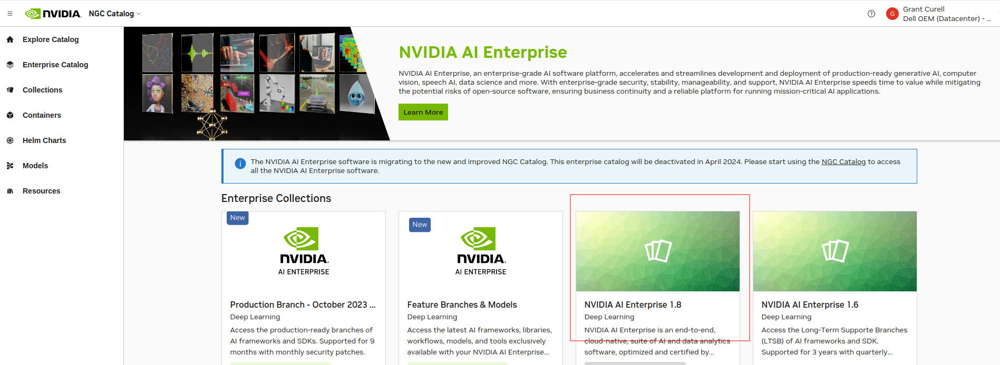
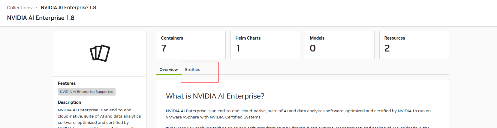
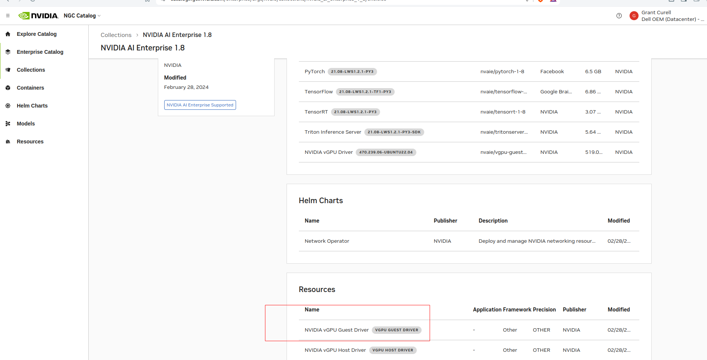
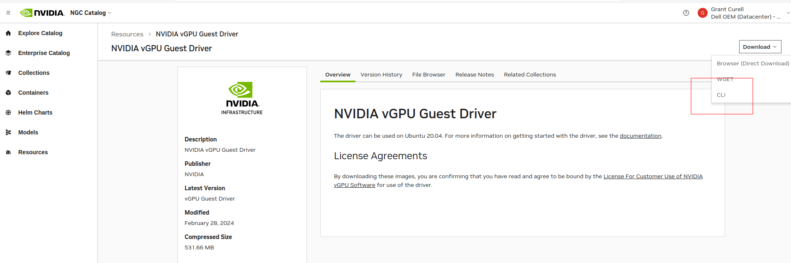
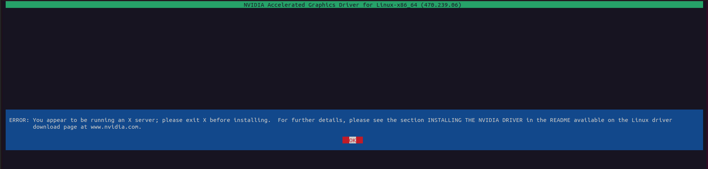

- [NVIDIA Base Command](#nvidia-base-command)
  - [Download](#download)
- [Setup NVIDIA AI Enterprise](#setup-nvidia-ai-enterprise)
  - [NGC Catalog CLI](#ngc-catalog-cli)
  - [Disable Nouveau](#disable-nouveau)
- [Install Nvidia Driver](#install-nvidia-driver)
  - [Licensing Stuff](#licensing-stuff)
- [Setup Nvidia Container](#setup-nvidia-container)


## NVIDIA Base Command

### Download

- To download you have to log into the partner portal and then go to NVIDIA NGC



- Link: https://catalog.ngc.nvidia.com/orgs/nvidia/teams/bcme/resources/bcme/version

## Setup NVIDIA AI Enterprise

- The deployment guide is located [here](https://docs.nvidia.com/ai-enterprise/deployment-guide-bare-metal/0.1.0/overview.html)
- Supported platforms is located [here](https://docs.nvidia.com/ai-enterprise/latest/product-support-matrix/)

### NGC Catalog CLI

[Instructions](https://docs.nvidia.com/ai-enterprise/deployment-guide-bare-metal/0.1.0/software.html)

- To work with most of this stuff you download the NVIDIA NGC CLI here: https://docs.ngc.nvidia.com/cli/cmd.html
- When you get to the bit about the API key go here https://org.ngc.nvidia.com/setup/api-key
- You can use `ngc config set` to refresh the choices you pick for the install
- Note: The environment will be setup for whoever installs this - not everyone. So if you try to run `ngc` as root it won't work.

### Disable Nouveau

- Run `sudo vim /etc/default/grub`
- Change the Linux command line to this:

```
GRUB_TIMEOUT=5
GRUB_DISTRIBUTOR="$(sed 's, release .*$,,g' /etc/system-release)"
GRUB_DEFAULT=saved
GRUB_DISABLE_SUBMENU=true
GRUB_TERMINAL_OUTPUT="console"
GRUB_CMDLINE_LINUX="crashkernel=auto resume=/dev/mapper/rhel-swap rd.lvm.lv=rhel/root rd.lvm.lv=rhel/swap rhgb quiet modprobe.blacklist=nouveau"
GRUB_DISABLE_RECOVERY="true"
GRUB_ENABLE_BLSCFG=true
```

- As root run the following (I noticed you had to be root - sudo didn't work):

```bash
echo "blacklist nouveau" > /etc/modprobe.d/denylist.conf
echo "options nouveau modeset=0" >> /etc/modprobe.d/denylist.conf
sudo dracut --force
grub2-mkconfig -o /boot/efi/EFI/rocky/grub.cfg
dnf update -y # I just added this in so that you don't have to do it later
```

- Reboot and then make sure nouveau isn't loaded with `lsmod | grep nouveau`

## Install Nvidia Driver

- If you haven't already make sure everything is up to date with `sudo dnf update -y && reboot`
- `dnf install -y kernel-devel-$(uname -r) kernel-headers-$(uname -r)`
- Install dependencies

```bash
dnf install elfutils-libelf-devel.x86_64
dnf install -y tar bzip2 make automake gcc gcc-c++ pciutils libglvnd-devel
```

- The instructions online for this are not currently up to date. Go to [https://catalog.ngc.nvidia.com/enterprise](https://catalog.ngc.nvidia.com/enterprise) and figure out what the current version of NVIDIA AI Enterprise is. For me it is 1.8. The instructions tell you to look for the driver version manually, but this is not necessary. See below:

Find the latest version of AI Enterprise:



Then go to Entities:



At the bottom of entities will be resources. You want the guest driver. Click on it.



Click Download in the top right and then select CLI.



That should put something like this in your clipboard: `ngc registry resource download-version "nvaie/vgpu_guest_driver_1_8:vGPU Guest Driver"`. Paste to your command line and run.

- Change to the directory and `chmod +x NVIDIA-Linux-x86_64-470.239.06-grid.run`
- You will probably still get if you have a GUI of any sort running:



- You need to run `sudo systemctl isolate multi-user.target` to kill the GUI and along with it, X.
- Reboot the system

### Licensing Stuff

- The instructions for the driver will mention DLS and CLS, but that difference isn't explained on those pages. [This is the difference](https://docs.nvidia.com/license-system/latest/nvidia-license-system-user-guide/index.html):
  - Cloud License Service (CLS) instance. A CLS instance is hosted on the NVIDIA Licensing Portal.
  - Delegated License Service (DLS) instance. A DLS instance is hosted on-premises at a location that is accessible from your private network, such as inside your data center.

What we'll have to do onsite is DLS:

> A Delegated License Service (DLS) instance is hosted on-premises at a location that is accessible from your private network, such as inside your data center.
> 
> Because a DLS instance is fully disconnected from the NVIDIA Licensing Portal, you must download licenses from the NVIDIA Licensing Portal and upload them to the instance manually.

However, I'm going to do this with CLS so I don't have to setup my own license server. The instructions for generated the license are [here](https://docs.nvidia.com/license-system/latest/nvidia-license-system-user-guide/index.html#generating-client-configuration-token-for-cls-instance).

- Go to the [NVIDIA Application Hub](https://nvid.nvidia.com/dashboard) and then pick the NVIDIA Licensing Portal
- Pick a CLS server instance and then generate a client configuration token.
- On your Linux box run `sudo vim /etc/nvidia/gridd.conf
- TODO - not really sure what I'm supposed to pick here https://docs.nvidia.com/license-system/latest/nvidia-license-system-user-guide/index.html#configuring-nls-licensed-client-on-linux

## Setup Nvidia Container

```bash
sudo yum install -y yum-utils
sudo yum-config-manager --add-repo https://download.docker.com/linux/centos/docker-ce.repo
sudo yum install docker-ce docker-ce-cli containerd.io docker-buildx-plugin docker-compose-plugin
systemctl enable --now docker
```