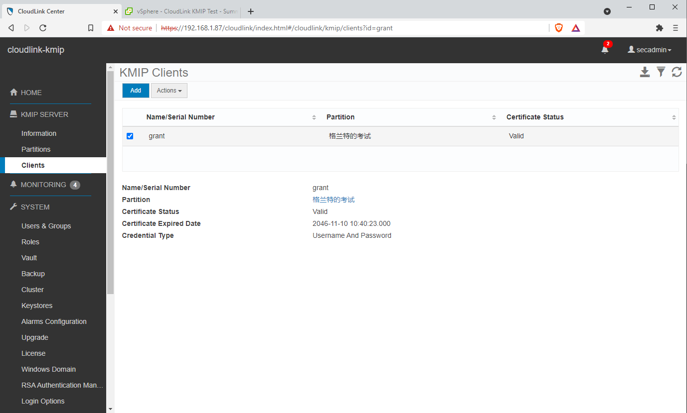
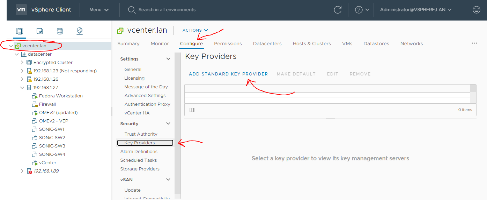
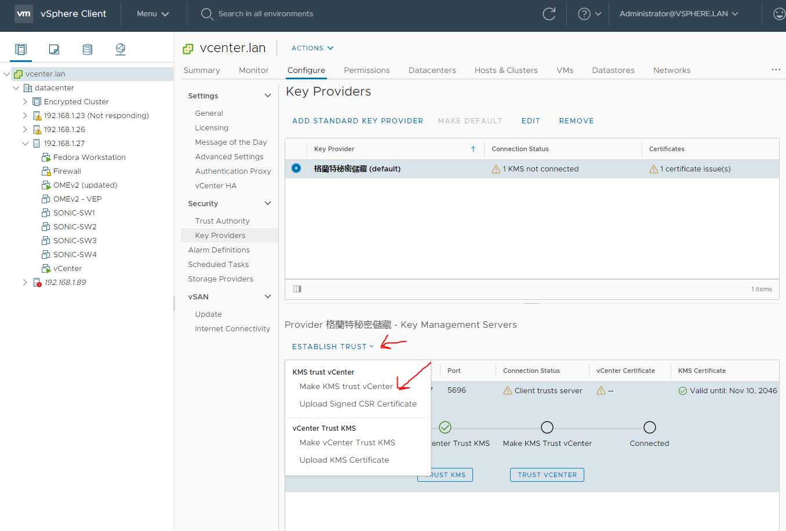
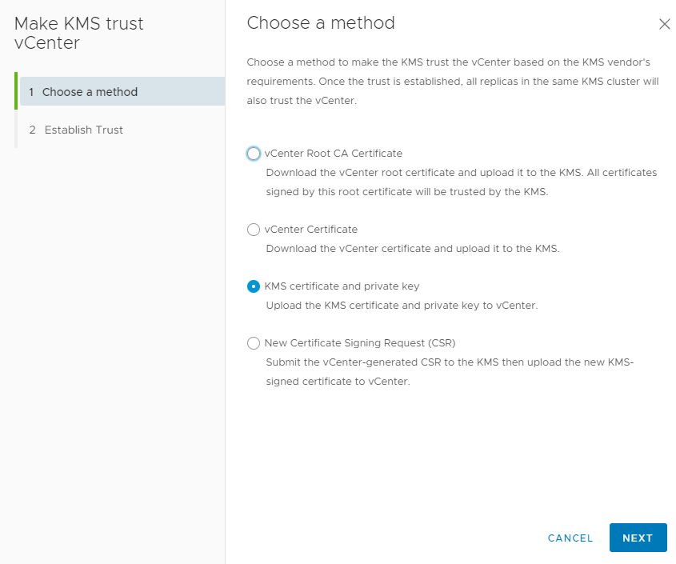
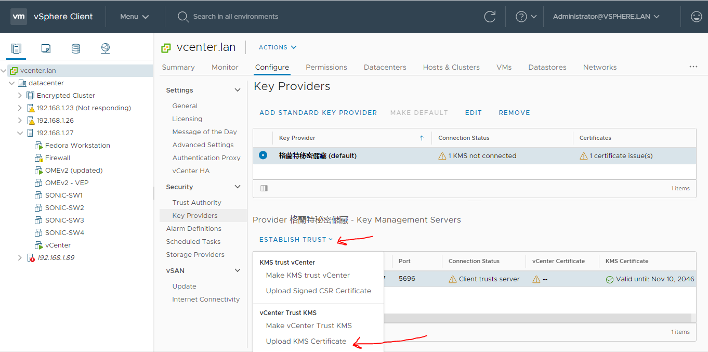
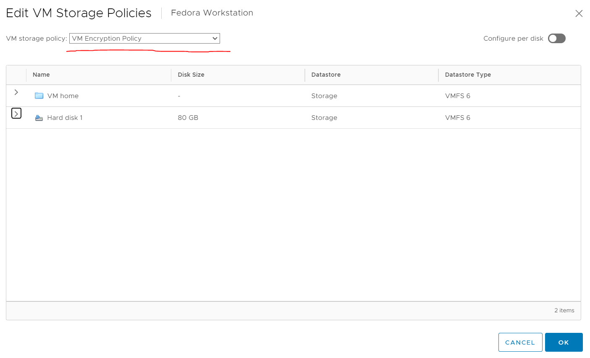
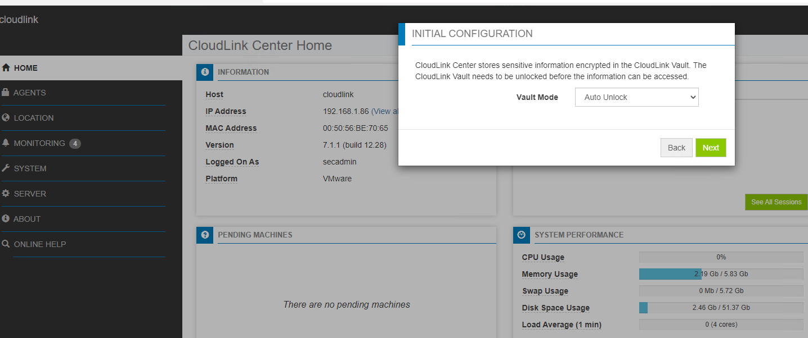
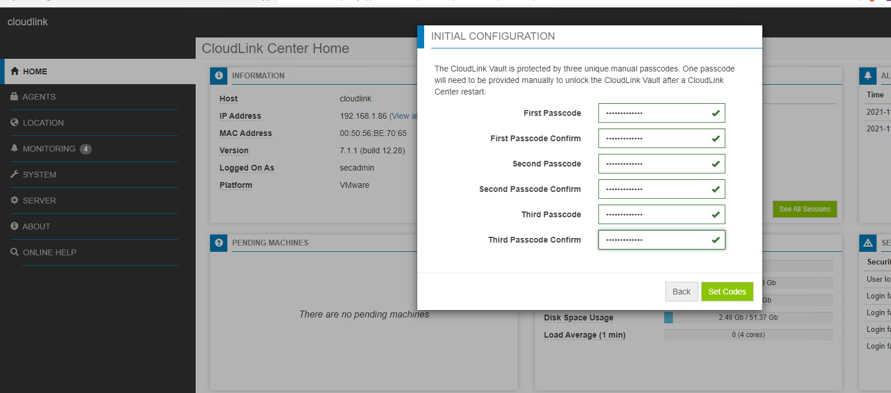

# CloudLink

- [How Does CloudLink Work](#how-does-cloudlink-work)
  - [General Functioning](#general-functioning)
  - [Components](#components)
  - [Licensing](#licensing)
    - [General Licenses](#general-licenses)
    - [License Types](#license-types)
  - [Installation Notes](#installation-notes)
  - [Connecting VMWare to CloudLink](#connecting-vmware-to-cloudlink)
    - [Set Up CloudLink](#set-up-cloudlink)
    - [Configure vCenter](#configure-vcenter)
    - [Enabling Encryption](#enabling-encryption)
      - [vSAN](#vsan)
  - [My Outstanding Questions](#my-outstanding-questions)

## General Functioning

CloudLink provides encryption by using Microsoft BitLocker and dm-crypt ([How does dm-crypt work](https://www.linux.com/training-tutorials/how-encrypt-linux-file-system-dm-crypt/))for Linux to provide encryption.

CloudLink's VM encryption functionality enables you to use native OS encryption features to encrypt a machine's boot and data volumes in a multi tenant cloud environment. This encryption enables you to protect the integrity of the machine itself against unauthorized modifications.

CloudLink encrypts the machine boot and data volumes with unique keys that enterprise security administrators control. Neither cloud administrators nor other tenants in the cloud have access to the keys. By securing machines, you can define the security policy that must be met before passing the prestartup authorization, including verifying the integrity of the machine’s boot chain. This offers protection against tampering.

## Components

- CloudLink Center—The web-based interface for CloudLink that is used to manage machines that belong to the CloudLink environment (those machines on which CloudLink Agent has been installed). CloudLink Center:
  - Communicates with machines over Transport Layer Security (TLS)
  - Manages the encryption keys that are used to secure the boot volumes, data volumes, and devices for the machines
  - Configures the security policies
  - Monitors the security and operation events
  - Collects log data
- CloudLink Agent - The agent that runs on individual machines. It communicates with CloudLink Center for pre-startup authorization and decryption of BitLocker or dm-crypt encryption keys.

For Enterprise and PowerFlex—CloudLink Center is packaged as a virtual appliance that can be deployed in the enterprise on VMware ESXi or Microsoft Hyper-V. Download CloudLink Agent from CloudLink Center.

For Microsoft Azure or Azure Stack—CloudLink Center can be deployed from the Azure Gallery in a simple-to-deploy, self-contained image file that enables you to quickly start your business-critical operations by using CloudLink. Search the Azure Gallery for CloudLink to locate the image. Download CloudLink Agent from CloudLink Center

## Licensing

### General Licenses

- Evaluation license—This is a free trial license to test the CloudLink features. This license has an expiry date and is not allowed to be used in production. Use a subscription or a perpetual license that is purchased through Dell EMC for production purposes.
- Subscription license—This license expires on a predefined date and time. The subscription license period is for one, two, or three years only. Repurchase the subscription licenses at the end of their term.
- Perpetual license—This license never expires.

### License Types

- Encryption for Machines license—Licensed per machine for volume encryption. This license defines the number of machines, virtual, or bare metal, that can be protected using CloudLink Center.
- Encryption for Containers license—Enables data encryption for containers. A single Container license supports any number of Kubernetes clusters.
- Encryption for PowerFlex license—Encrypted capacity for PowerFlex
This license defines the total storage that can be encrypted using CloudLink Center.
- Key Management over [KMIP](https://wiki.openstack.org/wiki/KMIPclient) license—Licensed KMIP clients This license defines the number of KMIP clients that can be managed using CloudLink Center. With one Key Management over KMIP license you can create:
  - One KMIP Client
  - One CloudLink Center cluster
  - NOTE: To create additional KMIP Clients or CloudLink Center clusters, purchase additional Key Management over KMIP licenses.
- Key Management for SED license—Number of physical machines with SEDs. A single Key Management for SED license is used per physical machine regardless of the number of SEDs connected to that machine

## Installation Notes

- I followed the guide here for VMWare https://docs.delltechnologies.com/bundle/P_DG_CL_701/page/GUID-1EDFBE27-3218-43AD-9449-24374D5FE1F6.html
- The default user for the webui is secadmin
- Before I added VMs to my cluster I created a [machine group](https://docs.delltechnologies.com/bundle/P_DG_CL_701/page/GUID-516FA105-44B6-409B-918B-008006B19466.html) to put them in
- Make sure you add approved networks with IP ranges before installation or adding machines will fail with `IP address (192.168.1.95) not in group's approved networks`
  - Alternatively you will have to go to machines and accept the machine
- To install in standard mode on Linux run `sudo ./clagent.sh -S 192.168.1.86 -G cf41-f71e` where -S specifies the server and -G is the group key

## Connecting VMWare to CloudLink
 
**WARNING** This option requires you to use the KMIP license. If you use another license the below indicated options will not be present.

Connection to vSphere / VMWare works through a protocol called KMIP. KMIP is a protocol for communicating key information between key management servers and key management clients. Broadly speaking there are two ways which CloudLink can function in a VMWare environment:

1. You can set up the CloudLink Center server and it can encrypt the virtual hard disks used by the various VMs. This is accomplished by running the CloudLink Agent on the individual VMs themselves.
2. You can connect Cloudlink Center directly to vSphere and vSphere will instead use it to encrypt the VMs themselves.

You can verify that CloudLink is compatible with the version of VMWare you are going to use [here](https://www.vmware.com/resources/compatibility/search.php?deviceCategory=kms&details=1&releases=577&page=1&display_interval=10&sortColumn=Partner&sortOrder=Asc).

See [Dell EMC CloudLink Key Management for VMware vCenter Server Configuration Guide](https://docs.delltechnologies.com/bundle/P_KEY_CL/page/GUID-86A006AF-A553-4EEE-9F7A-B0DAFAC5C9B9.html) for an overview of configuring VMWare vCenter with CloudLink.

### Set Up CloudLink

**Note** The use of Chinese characters is deliberate. I do this to ensure that software I test correctly handles character encodings other than ASCII. It is surprising how many modern software applications fail to handle UTF8 and other character encodings properly which is frequently an indicator of poor design quality.

A KMIP partition is a container for the keys and certificates that are created by some KMIP client. Multiple clients can use the same partition but then keep in mind they will also be mutually accessible. See https://docs.delltechnologies.com/bundle/P_AG_CL/page/GUID-3A10CBF2-07DA-4951-96F3-2A7008390F55.html

After that I added a KMIP client:

### Configure vCenter

First we have to establish trust with the KMS server by make the KMS trust vCenter. After clicking the above select KMS certificate and private key as shown below.

In KMS certificate upload cert.pem (which you got from setting up the client in CloudLink) and in KMS private key upload key.pem.

Upload the certificate you downloaded earlier here (it should be called ca.pem). I didn't have to do this in my setup.

### Enabling Encryption

Encryption is controlled by storage policy so you can set it as you would on any other object. 

1. Right click on a VM
2. Click Edit Storage Policies
3. Now you can change it to VM Encryption Policy

#### vSAN

To enable encryption on vSAN do this: https://docs.vmware.com/en/VMware-vSphere/6.7/com.vmware.vsphere.virtualsan.doc/GUID-E7CA36B7-D7EB-423A-ADD1-7E410E36F5A7.html

## My Outstanding Questions

- What is vault mode?

- What are these three unique manual passcodes?

- Can it encrypt data in motion?
- How does the licensing work if you have multiple clusters?