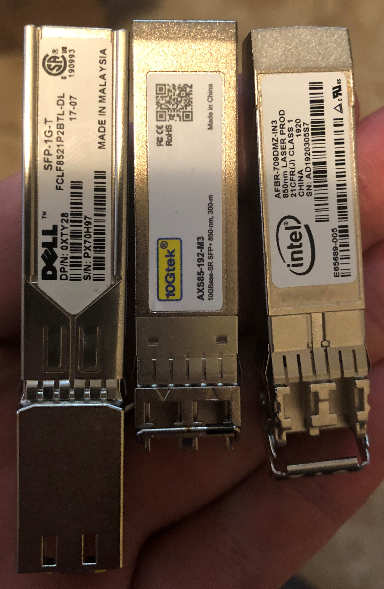
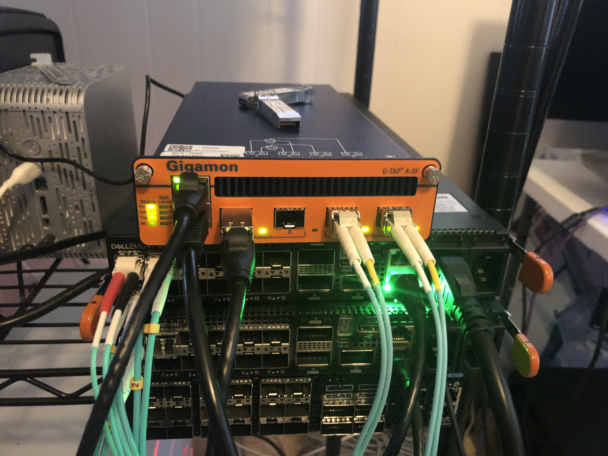
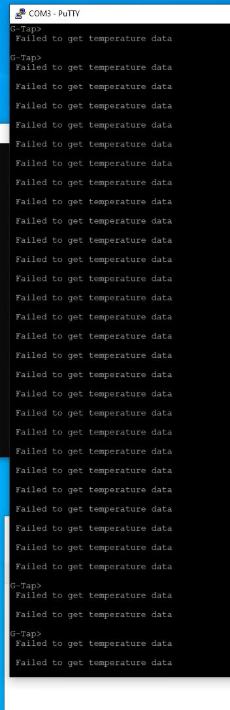
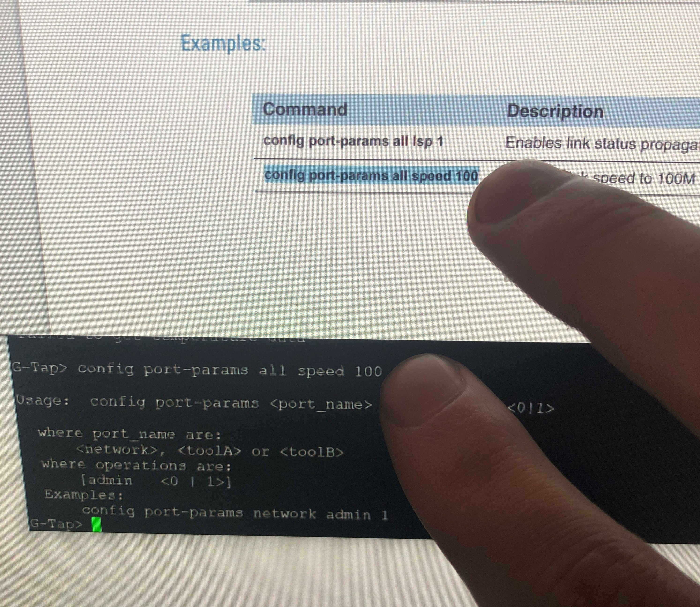
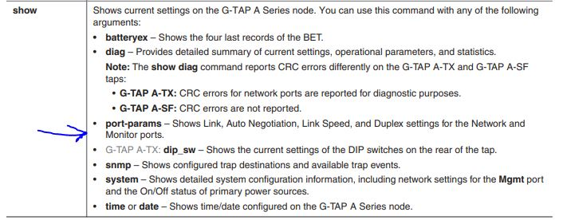
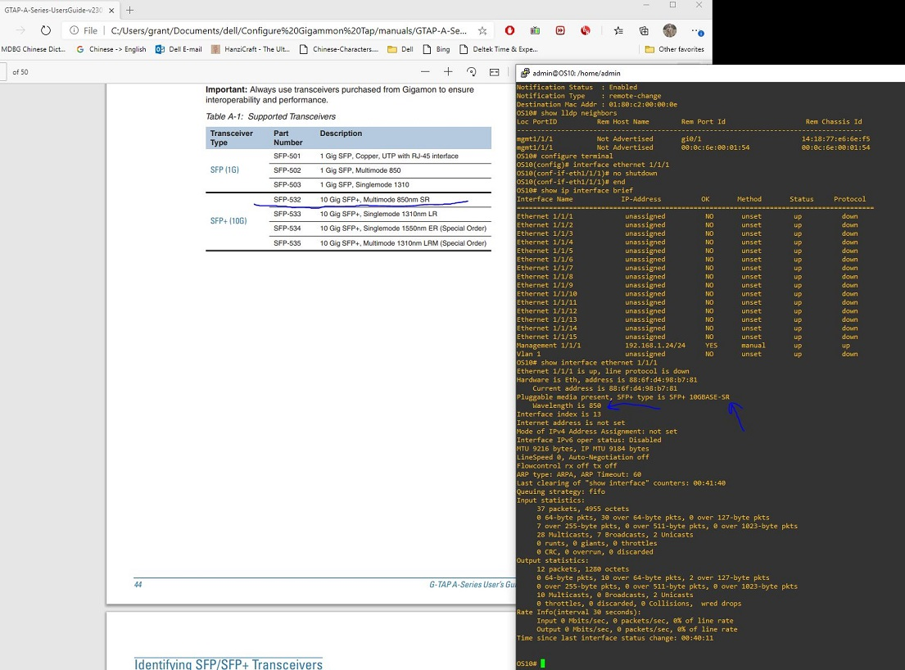

# Configure Gigamon Tap

## Getting Help

You have to register with a valid serial number [on Gigamon's support site](https://community.gigamon.com/gigamoncp/s/login/SelfRegister). For it to work your name either has to be attached to the account
or you have to have a valid `.mil` address.

## My Setup

### Gigamon Model Number / Version

GTP-ASF01

Hardware Revision: G-TAP A2/SF

    G-Tap> show version
    SW Version      : 2.3.03     Filename=gtb_ASF_IMAGE_2.3.03_20161118.bin

### SFPs Tested

### Front Panel Configuration

### Traffic Generation

Traffic was generated on a laptop going into port *network 1* and load balanced
across ports *toolA* and *toolB*

## Configuring the Device

### Console Settings

I used the following console settings:

- On Windows with Putty my serial line was COM3
- Speed: 115200
- Data bits: 8
- Stop bits: 1
- Parity: None
- Flow Control: None

### Logging In

Default password is `root123`. There is no username.

### Configure Management

`config ipaddr 192.168.1.105 subnetmask 255.255.255.0`

**WARNING For reasons unknown, telnet is enabled by default on the management interface. If you are using this outside a lab you'll probably want to disable it with** `telnet 0`.

At this juncture, you can telnet to the management IP if you want to.

If you want to change the default password this can be done with `passwd`.

If you need to set the date or time you can do so with the commands `time <hh:mm:ss>`
or `date <mm-dd-yy>` respectively.

### Configure TAP Capability

According to the instructions no configuration is required.

## Test Results

### Run 1 - Pass

Scenario: Get nominal load balancing working. For testing I added a second Dell
1Gb/s copper SFP. Distant end was a USB 1Gb/s copper adapter on a laptop.

Result: Worked as expected. Input went into the *network* port and load balanced
out the *toolA* port.

### Run 2 - Fail

Scenario: Test to see if the Intel 10Gb/s NIC will run. Distant end was another
Intel 10Gb/s SFP in an Intel x710 attached to ESXi.

Result: Failure. The tap detected the insert and removal of the SFP:

    Monitor Port B: "SFP" Module Removed
    Monitor Port B: NOTE: I2C device respond successfully!
    "SFP+ SR" Inserted

However, the distant end, which I confirmed to be working using a Dell 4112F-ON,
would not come up. Note: As long as the SFP was seated in the Gigamon the green
light remained on. There was no correlation between plugging in the cable and
the green light.

### Run 3 - Fail

Scenario: Same as 2 except I used the 3rd part Gtek SFP+.

Results: Same as Run 2.

### Run 4 - Fail

Scenario: Same as 2 except with a 10Gb/s Dell adapter.

Results: Same as Run 2.

### Run 5 - Fail

Scenario: I tried with the 10Gb/s Dell SFP again - this time I made the distant
end a RHEL box.

Results: RHEL saw nothing. `ethtool` showed both the duplex and speed as unknown.
Nothing came up.

### Run 6 - Fail

Scenario: I tried with the 10Gb/s Dell SFP again - this time I made the distant
end a Dell 4112F-ON.

Results: Even after manually setting speed, duplex, autonegotiation, and double
checking the interface types it still didn't come up.

## Other Helpful Commands

- If you need to close or open the tap you can do so using `taptx <active|passive>` where active pushes traffic to the tool ports and passive only pushes traffic through the network ports.
- `show system` gives you a nice overview of the status of the tap and what is plugged in where.

        G-Tap> show system
        ========================================================================
                            System Information
        ========================================================================
        System Name     : GTP-A2/SF  S/N=*******, rev=A1, HW Built=10/24/2019
        SW Version      : 2.3.03     Filename=gtb_ASF_IMAGE_2.3.03_20161118.bin
        App Loader Ver  : 2.04
        Current         : Mon  Jun 22, 2020   20:50:26
        System Boot     : Mon  Jun 22, 2020   17:02:39
        ------------------------------------------------------------------------
        Eth Mgmt Port   : DHCP=DISABLE,   MAC=00:1D:AC:1B:09:DE
                        : 192.168.1.105/255.255.255.0   gateway=255.255.255.255
                        : Autoneg=ON,  Link=Up  Speed=100  Duplex=Full
        ------------------------------------------------------------------------
        Telnet Access   : Enabled, Timeout=300 seconds
        Console baud    : 115200 bps
        ------------------------------------------------------------------------
        Power Supply    : AC adapter=[ON]   DC -48V=[OFF]   PoE=[OFF]
        ------------------------------------------------------------------------
        Battery fuel gauge busy. Please Try again...
        ------------------------------------------------------------------------
        Temperatures    : Board 38 C, Battery 2 C
        Fan             : OFF
        ------------------------------------------------------------------------

## Weird Behaviors

### Temperature

I continuously saw a warning for temperature:

### Battery

I saw a warning for the battery:

    NOTE: Battery fuel gauge busy! Will try again later

It looks like you can buy a battery separately so I believe this to be expected.

### Where is SSH?

I was unable to figure out how to configure SSH. In the manual they only had
telnet and console listed. I feel like I must be missing something.

### Telnet Console Didn't Display Correctly

When I typed in the telnet console with Putty the text would only appear after I
hit enter.

### Commands Straight from the Manual Do Not Work

### Using the arrow keys in the command line deletes text instead of moving cursor

Why?

### Manual is incorrect about display output

Ex:

    G-Tap> show port-params

                                NETWORK                 MONITOR
            Parameter     Port A      Port B      Port A      Port B
    =================   ==========  ==========  ==========  ==========
                Admin:            1           1           1           1
        Signal Detect:            1           0           1           1
        Tx Power(dBm):          n/a         n/a         n/a       -2.36
        Rx Power(dBm):          n/a         n/a         n/a       -2.50
        SFP Module Type:   SFP Copper          --  SFP Copper     SFP+ SR
        Cable Length(m):          n/a         n/a         n/a         n/a

The speed, duplex and autonegotiation settings are not listed anywhere in the output.

### Bizzare Compatibility Errors with SFPs

Even after confirming all setting, fixing the speed at 10Gb/s, duplex at full,
and turning off autonegation, the fiber interface still didn't come up. I went
and cross referenced the manual to see what type of SFPs they support and confirmed
that the wavelength and type matched.

