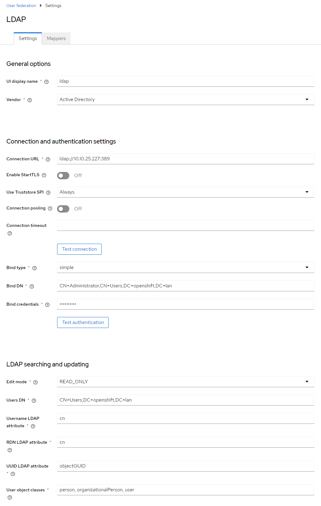
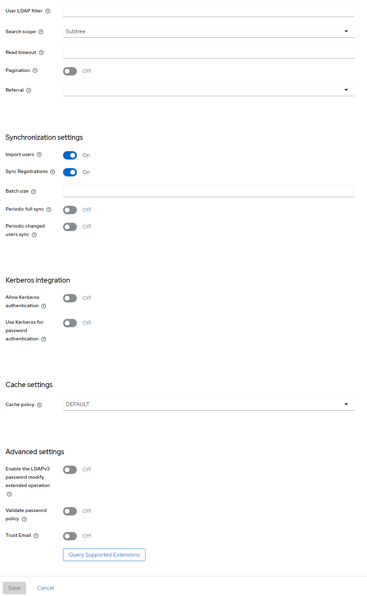
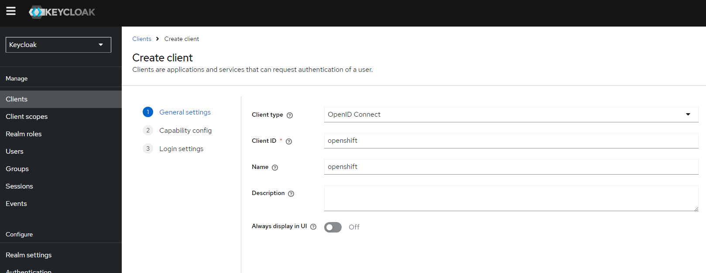
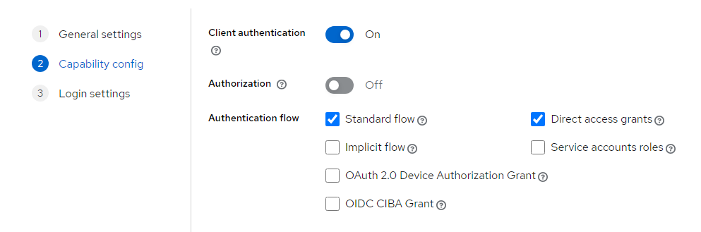
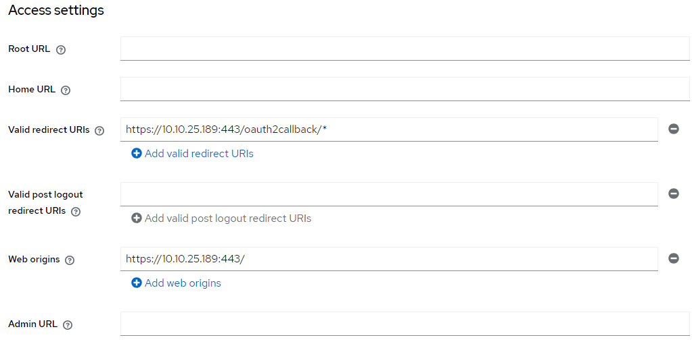
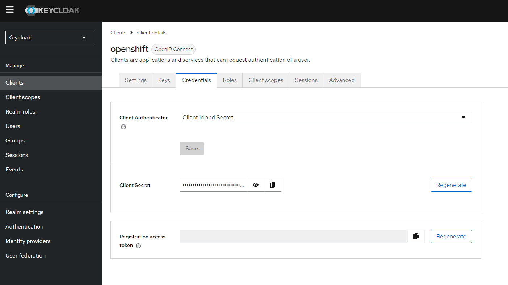

# Testing Keycloak

- [Testing Keycloak](#testing-keycloak)
  - [Concepts](#concepts)
    - [Overview](#overview)
    - [Components Involved](#components-involved)
    - [Detailed Steps](#detailed-steps)
      - [Step 1: Set Up Keycloak](#step-1-set-up-keycloak)
      - [Step 2: Set Up OpenShift](#step-2-set-up-openshift)
    - [How It Works Together](#how-it-works-together)
    - [Summary](#summary)
  - [Keycloak Setup](#keycloak-setup)
    - [Integrate with Active Directory](#integrate-with-active-directory)
    - [Configure the Client](#configure-the-client)
    - [Configure OpenShift](#configure-openshift)
  - [How to Setup Keycloak in Docker](#how-to-setup-keycloak-in-docker)
    - [Access Keycloak](#access-keycloak)


## Concepts

### Overview

**Keycloak:** An open-source Identity and Access Management solution. It supports standard protocols like OIDC and SAML for authentication and authorization.

**OpenID Connect (OIDC):** A simple identity layer on top of the OAuth 2.0 protocol, allowing clients to verify the identity of end-users based on the authentication performed by an Authorization Server.

**OpenShift:** A Kubernetes distribution by Red Hat that includes a suite of developer and operational tools for containerized applications.

**Active Directory (AD):** A directory service by Microsoft for Windows domain networks.

### Components Involved

1. **Keycloak Server:**
   - Acts as the Identity Provider (IdP).
   - Connects to Active Directory to authenticate users.
   - Issues tokens (ID token, access token) using OIDC protocol.

2. **OpenShift Cluster:**
   - Acts as the Service Provider (SP).
   - Uses Keycloak for authenticating users who want to access the OpenShift console.
   - Configured to use OIDC with Keycloak as the IdP.

3. **Active Directory (AD):**
   - Acts as the user store.
   - Keycloak uses AD to verify user credentials.

### Detailed Steps

#### Step 1: Set Up Keycloak

1. **Install and Configure Keycloak:**
   - Ensure Keycloak is installed and running on your server (`http://10.10.25.199:8080`).

2. **Create a Realm:**
   - A realm in Keycloak is equivalent to a tenant. It allows you to manage a set of users, credentials, roles, and groups.
   - For simplicity, use the `master` realm or create a new one if needed.

3. **Create a Client in Keycloak:**
   - A client represents an application that will use Keycloak for authentication.
   - **Client ID:** `openshift`
   - **Client Protocol:** `openid-connect`
   - **Access Type:** `confidential`
   - **Root URL:** `https://10.10.25.189` (OpenShift URL)
   - **Valid Redirect URIs:** `https://10.10.25.189/*`
   - **Web Origins:** `https://10.10.25.189`

4. **Set Up Client Credentials:**
   - Go to the `Credentials` tab and note the `Client Secret`. This secret will be used by OpenShift to authenticate against Keycloak.

5. **Configure User Federation (Optional):**
   - If you need Keycloak to use Active Directory for user authentication, configure the LDAP provider under `User Federation`.

#### Step 2: Set Up OpenShift

1. **Create a Secret in OpenShift for Keycloak Client Secret:**
   - Use the OpenShift CLI to store the Keycloak client secret securely.
   ```bash
   oc create secret generic keycloak-client-secret \
     --from-literal=clientSecret=<your-keycloak-client-secret> \
     -n openshift-config
   ```

2. **Configure OpenShift OAuth to Use Keycloak:**
   - Create an OAuth configuration file (`oauth.yaml`) with the following content:
   ```yaml
   apiVersion: config.openshift.io/v1
   kind: OAuth
   metadata:
     name: cluster
   spec:
     identityProviders:
     - name: keycloak
       mappingMethod: claim
       type: OpenID
       openID:
         clientID: openshift
         clientSecret:
           name: keycloak-client-secret
         issuer: https://10.10.25.199/auth/realms/master
         claims:
           preferredUsername:
           - preferred_username
           name:
           - name
           email:
           - email
         extraScopes: []
         extraAuthorizeParameters: {}
         userInfoURL: https://10.10.25.199/auth/realms/master/protocol/openid-connect/userinfo
   ```

3. **Apply the OAuth Configuration:**
   - Use the OpenShift CLI to apply the configuration.
   ```bash
   oc apply -f oauth.yaml
   ```

### How It Works Together

1. **User Initiates Login:**
   - When a user attempts to log in to the OpenShift console (`https://10.10.25.189`), they are redirected to the Keycloak login page.

2. **Authentication with Keycloak:**
   - The user enters their credentials on the Keycloak login page.
   - Keycloak authenticates the user against its internal user store or Active Directory if configured.

3. **Token Issuance:**
   - Upon successful authentication, Keycloak issues an ID token and access token to the user.

4. **Redirect Back to OpenShift:**
   - Keycloak redirects the user back to the OpenShift console with the tokens.

5. **Token Validation:**
   - OpenShift validates the tokens with Keycloak.
   - If the tokens are valid, the user is granted access to the OpenShift console.

6. **Access Granted:**
   - The user is now logged in and can use OpenShift based on their assigned roles and permissions.

### Summary

- **Keycloak** manages user authentication and issues tokens.
- **OpenShift** uses Keycloak tokens to authenticate users.
- **Active Directory** (if configured) serves as the backend user store for Keycloak.

This setup allows centralized authentication using Keycloak, leveraging existing user directories like Active Directory, and providing Single Sign-On (SSO) capabilities for accessing OpenShift.

Feel free to ask if you have any specific questions or need further clarification on any of these steps!

## Keycloak Setup

### Integrate with Active Directory

- I built out active directory apart from this tutorial. Just remember to not add certificate services. You only want active directory then I added a user.
- In Keycloak under user federation, add an LDAP provider with the following:
  - Warning, don't make the mistake I did with AD. If you see `Network response was not ok` you probably misconfigured the DN. See [this post](https://serverfault.com/questions/1162573/keycloak-throws-network-response-was-not-ok)






### Configure the Client

- After you run the test to make sure everything works, you'll need to set up an OpenShift client



- In capability config make sure you enable `Client authentication`. You'll need that to obtain credentials later for OpenShift.



- I used the following access settings:



### Configure OpenShift

- Get your client secret from the OpenShift client you created
  - If the credentials tab is missing it is because you didn't set `Client authentication` to on.



- Configure the secret in OpenShift

```bash
oc create secret generic keycloak-client-secret \
  --from-literal=clientSecret=j2gcpig9Wd1bfH3nZXon56NYKDhTbV0o \
  -n openshift-config
```

- Next create the following file `oauth.yaml` and then run `oc apply -f oauth.yaml`

```yaml
apiVersion: config.openshift.io/v1
kind: OAuth
metadata:
  name: cluster
spec:
  identityProviders:
  - name: keycloak
    mappingMethod: claim
    type: OpenID
    openID:
      clientID: openshift
      clientSecret:
        name: keycloak-client-secret
      issuer: https://10.10.25.199/auth/realms/master
      claims:
        preferredUsername:
        - preferred_username
        name:
        - name
        email:
        - email
```

## How to Setup Keycloak in Docker

Note: I was ultra lazy about permissions for the lab. I ran into a problem where despite 443 being whitelisted in firewalld in all zones, firewalld would block the port anyway. I didn't spend extra time troubleshooting - I just turned off firewalld.

1. **Remove Existing Containers:**

   ```bash
   docker rm -f keycloak postgres
   ```

2. **Create a Docker Network:**

   ```bash
   docker network create keycloak-network
   ```

3. **Ensure Correct Directory Permissions:**

   ```bash
   sudo mkdir -p /opt/postgres /opt/keycloak/data/transaction-logs/ShadowNoFileLockStore/defaultStore
   sudo chown -R $(whoami):$(whoami) /opt/postgres /opt/keycloak
   sudo chmod -R 755 /opt/postgres /opt/keycloak
   ```

4. **Run PostgreSQL Container:**

   ```bash
   docker run -d --name postgres \
     --network keycloak-network \
     -v /opt/postgres/:/var/lib/postgresql/data \
     -e POSTGRES_DB=keycloak \
     -e POSTGRES_USER=keycloak \
     -e POSTGRES_PASSWORD=password \
     -p 5432:5432 \
     postgres:latest
   ```

5. **Run Keycloak Container as Root:**

   ```bash
   docker run -d --name keycloak \
   --network keycloak-network \
   --user root \
   -v /opt/keycloak/data:/opt/keycloak/data \
   -e KEYCLOAK_ADMIN=admin \
   -e KEYCLOAK_ADMIN_PASSWORD=admin \
   -e KC_DB=postgres \
   -e KC_DB_URL=jdbc:postgresql://postgres:5432/keycloak \
   -e KC_DB_USERNAME=keycloak \
   -e KC_DB_PASSWORD=password \
   -p 8080:8080 \
   -p 443:8443 \
   quay.io/keycloak/keycloak:25.0.1 start-dev
   ```

After running these commands, you can check the status of the containers to ensure everything is running properly:

```bash
docker ps
docker logs keycloak
```

### Access Keycloak

Keycloak should now be accessible at `http://localhost:8080`. You can log in using the admin credentials you specified (`admin`/`admin`).

By ensuring both containers are on the same network, Keycloak will be able to communicate with PostgreSQL correctly.