# Configure Multi-Protocol PowerStore with LDAP

- [Configure Multi-Protocol PowerStore with LDAP](#configure-multi-protocol-powerstore-with-ldap)
  - [Overview](#overview)
  - [How This Works](#how-this-works)
    - [Some Gotchas](#some-gotchas)
  - [Configure Your Active Directory User](#configure-your-active-directory-user)
  - [Configure a NAS Server](#configure-a-nas-server)
  - [Configure Your Filesystem](#configure-your-filesystem)
  - [Update the LDAP Schema](#update-the-ldap-schema)
  - [Mount the Share and NFS Export](#mount-the-share-and-nfs-export)
  - [Finishing Touches - gidNumbers for Other Groups](#finishing-touches---gidnumbers-for-other-groups)
  - [Troubleshooting](#troubleshooting)
    - [How to Connect to PowerStore Over SSH](#how-to-connect-to-powerstore-over-ssh)
    - [Problems with secmap](#problems-with-secmap)
    - [How to Check a User](#how-to-check-a-user)
    - [Check Domain Health](#check-domain-health)

## Overview

This article describes how to configure multi-protocol PowerStore for both SMB and NFS using LDAP.

## How This Works

You can skip this if you want, but I found it helpful to get an academic understanding of what to expect is going to happen.

1. PowerStore receives the UID/GID from the NFS client in the request.
2. It checks its Secure Mapping Cache (secmap) to see if it already knows how to map that UID to a Windows SID.
3. If there's no cached mapping, PowerStore attempts to resolve the UID to a username using the configured UDS (Unix Directory Service).
    - UDS is backed by LDAP (e.g., Active Directory with RFC2307 or IDMU schema).
    - It looks for an entry where `uidNumber = <UID>` and `gidNumber = <GID>` in the directory.
4. If it finds a user in LDAP with that UID/GID:
    - It extracts the UNIX username
    - Then matches the UNIX username to a Windows username (same name or using `ntxmap` if they're different)
    - Finally, it maps that to a Windows SID
5. Access is granted or denied based on the resolved user’s permissions.

### Some Gotchas

- You **must** have an LDAP server configured on the SMB filesystem. It is not enough to just configure UDS.
- PowerStore checks the field `uid` for your user and in this case that **must** match the field  samaccountname or the system won't work. I'll explain how to map this later.

## Configure Your Active Directory User

Here I demo on Microsoft Active Directory but the same logic will apply for OpenLDAP. It will just be harder to setup because it is OpenLDAP and OpenLDAP's purpose is to cause pain and suffering.

NFS uses UID / GID to authenticate. The problem is, if you are using Windows users, they natively have neither a UID or a GID. They have a SID. This means if you try to authenticate with a Windows user with NFS, it doesn't actually have a UID or GID for you to use. You can solve this problem in one of three ways:

1. You can enable automatic mapping and PowerStore will just make up a UID/GID for your Windows users
2. You can enable a default account for unmapped users
3. You can do either 1, 2, or neither **and** set a UID or GID for your users. If you don't enable either it will automatically default to enabling a default account. This is what I did. I prefer this because if you do automatic mapping and then change a user's UID/GID later you lose access to all the things they had aside from root because those things will have been created with a random UID/GID.

Whether you use 1 or 2 is controlled under the **Naming Services** tab for your NAS server:

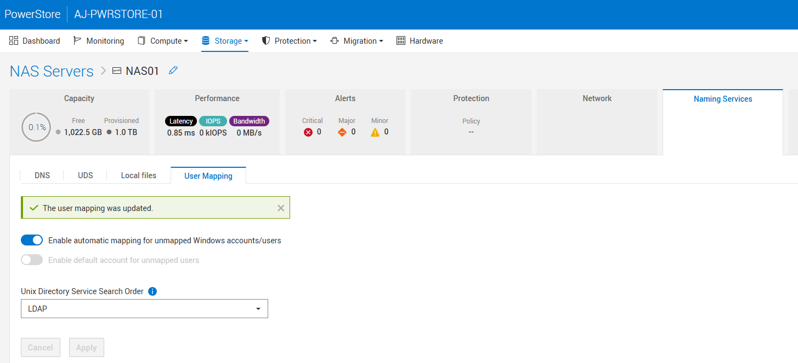

I set up a user called `gcurell-adm` and then assigned UID/GID 10001 in active directory:

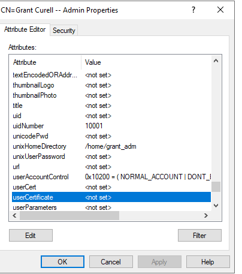

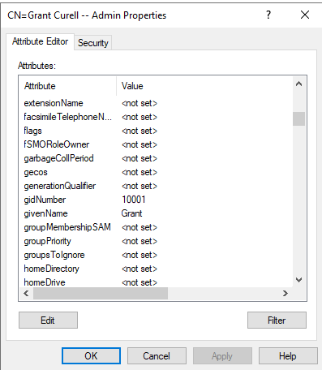

After that, I had a Rocky test box from which I wanted to test all the creds.

```bash
sudo dnf install -y openldap-clients
```

We can confirm from our Rocky box that the UID/GID are correct:

```bash
[root@rocky ~]# ldapsearch -x -H ldap://domaincontroller.grantlab.local \
  -D "gcurell_adm@grantlab.local" -W \
  -b "dc=grantlab,dc=local" \
  "(sAMAccountName=gcurell_adm)" \
  uidNumber gidNumber unixHomeDirectory loginShell
Enter LDAP Password:
# extended LDIF
#
# LDAPv3
# base <dc=grantlab,dc=local> with scope subtree
# filter: (sAMAccountName=gcurell_adm)
# requesting: uidNumber gidNumber unixHomeDirectory loginShell
#

# Grant Curell -- Admin, Grant_Sales_Team, grantlab.local
dn: CN=Grant Curell -- Admin,OU=Grant_Sales_Team,DC=grantlab,DC=local
uidNumber: 10001
gidNumber: 10001
unixHomeDirectory: /home/grant_adm
loginShell: /bin/bash

# search reference
ref: ldap://DomainDnsZones.grantlab.local/DC=DomainDnsZones,DC=grantlab,DC=local

# search reference
ref: ldap://ForestDnsZones.grantlab.local/DC=ForestDnsZones,DC=grantlab,DC=local

# search reference
ref: ldap://grantlab.local/CN=Configuration,DC=grantlab,DC=local

# search result
search: 2
result: 0 Success

# numResponses: 5
# numEntries: 1
# numReferences: 3
```

There is one key piece of information you need from this - the **dn**. You will need that later. Notice that my UID and GID number are accurately reflected. If those don't show up you need to fix that first.

## Configure a NAS Server

The first thing you will have to do is configure the NAS server itself. This part is fairly straightforward so below I simply show the screenshots without much explanation.

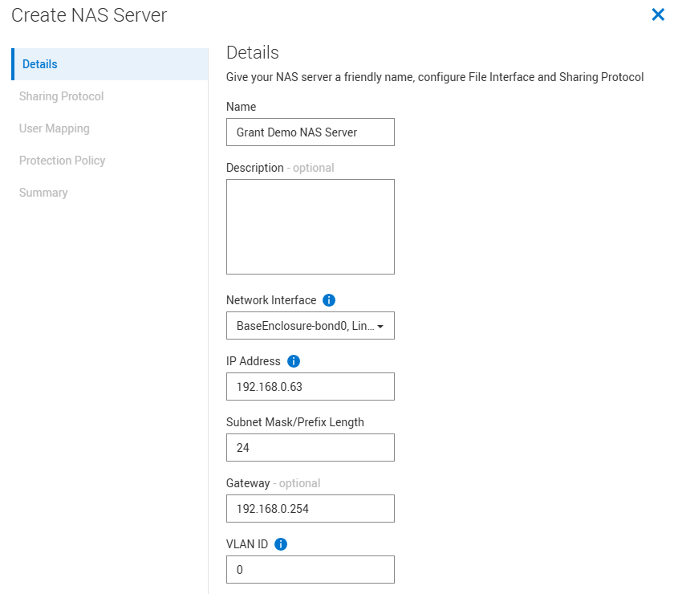

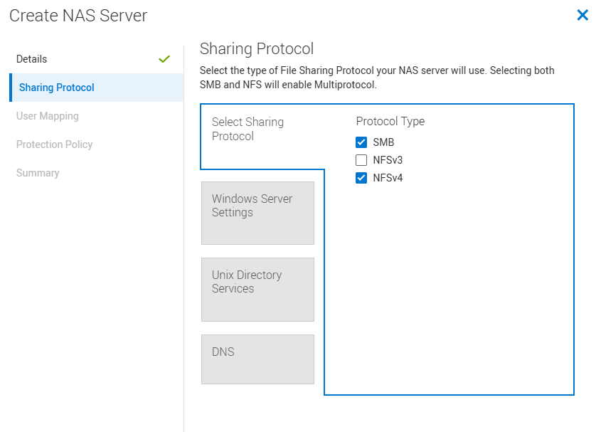

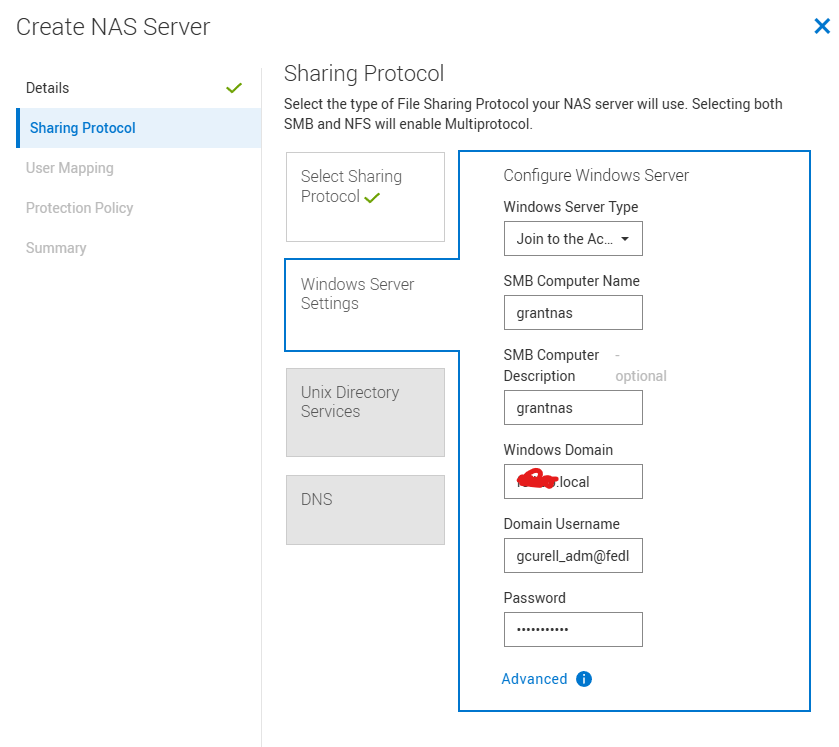

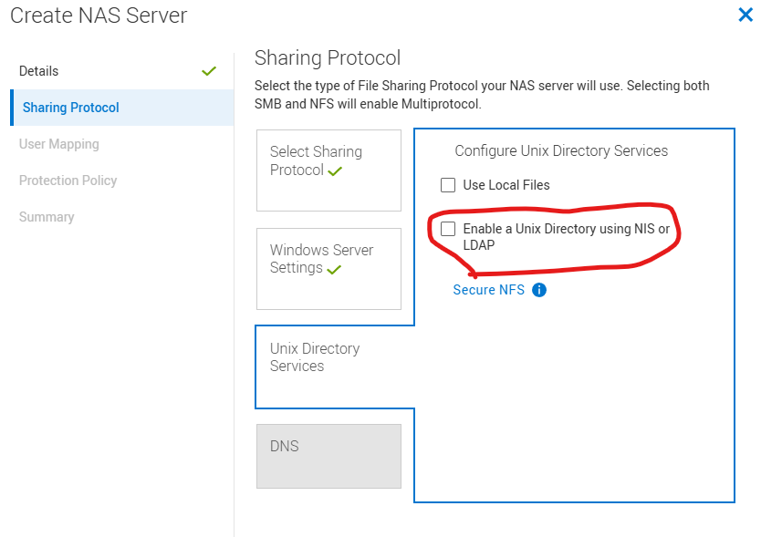

For this next step you will need the **dn** you got at the end of [Configure Your Active Directory User](#configure-your-active-directory-user). In the example I have above it is `CN=Grant Curell -- Admin,OU=Grant_Sales_Team,DC=grantlab,DC=local`. Unix Directory Services (UDS) is the thing that will resolve a UID/GID to a Windows username and subsequently a SID.

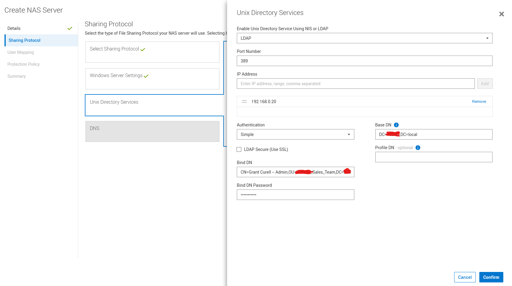

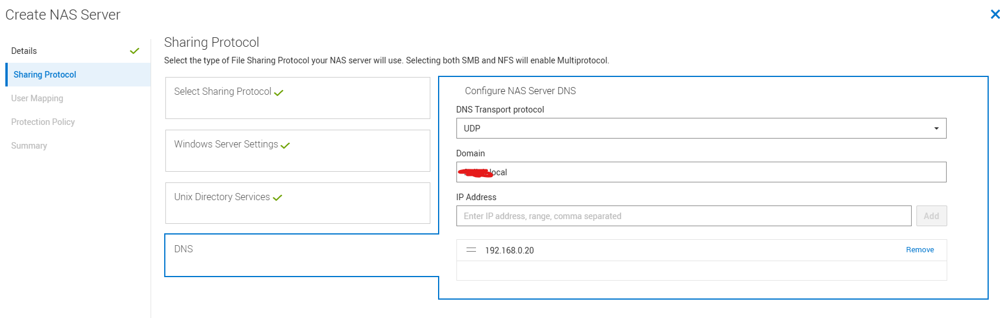

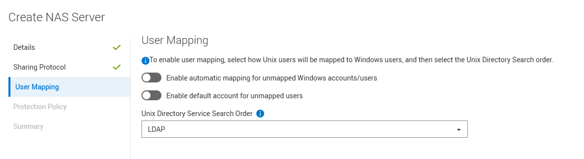

The rest I just clicked next to finish. I didn't add a protection policy.

## Configure Your Filesystem

I assume you are already familiar with how to do this. There isn't anything unique for multiprotocol in the initial setup. See [the manual](https://www.dell.com/support/manuals/en-us/powerstore-1000/pwrstr-cfg-smb/create-file-systems-and-smb-shares?guid=guid-de8c3203-3da8-4205-8680-3868acb9f03a&lang=en-us) for details.

After your filesystem is created, there is one special thing you have to do. Under the properties for your filesystem is a setting called access policy:

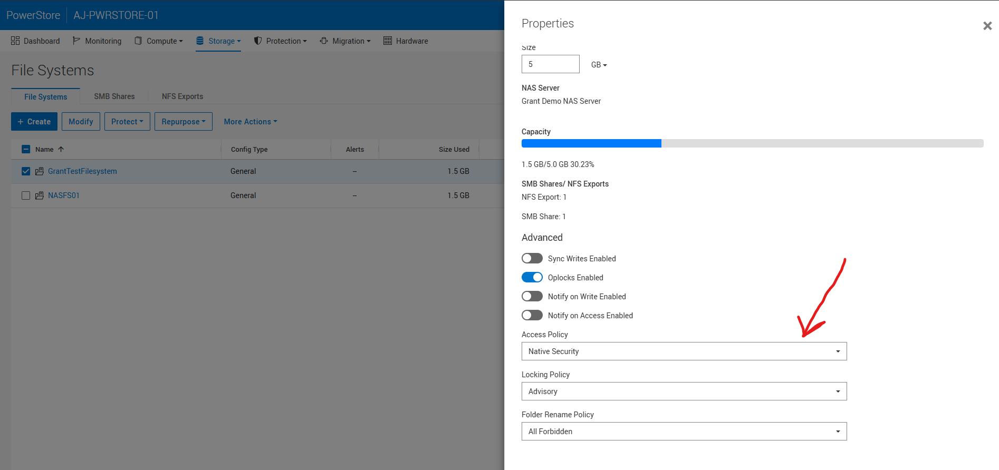

When set to native security, NFS and SMB permissions are completely separated. In my case, I wanted the mapper to rely on the Windows SID so I changed this to Windows Security.

## Update the LDAP Schema

The final step stems from some legacy behavior. Back in the day when unix services were separate in Microsoft, installing them would automatically populate the uid field for a user with the SamAccountName. This no longer happens but the RFC still expects the uid field to be populated. Subsequently, we need to add a mapping in our LDAP configuration to do this automatically. Go to your NAS server, click the naming service tile, and then click UDS.

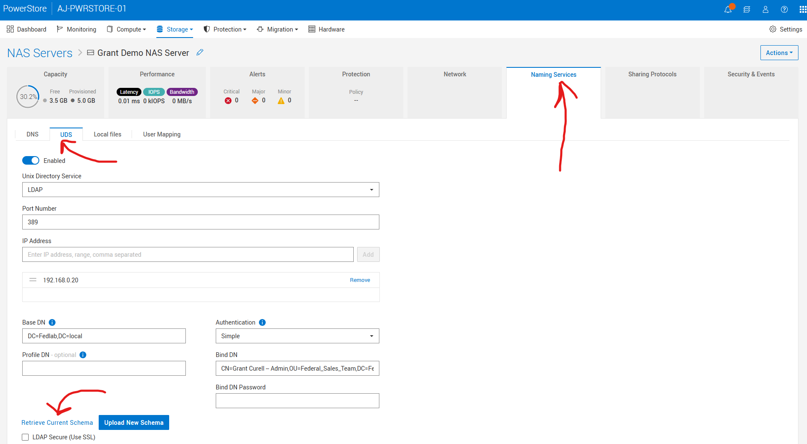

Under the UDS tab, click retrieve current schema and download your LDAP schema. This is what mine looks like by default:

```bash
# -----------------------------------------------------------------------------
# This template was automatically generated by the EMC Nas server
# - Adjustments could be required to fit your specific LDAP configuration.

# - The following setup fits the MS IdMU schema
#   used by Windows Server 2003 R2 or newer (like Windows Server 2008).

# Containers

nss_base_passwd    cn=Users,DC=grantlab,DC=local?one
nss_base_group     cn=Users,DC=grantlab,DC=local?one
nss_base_hosts     cn=Computers,DC=grantlab,DC=local?one
nss_base_netgroup  cn=netgroup,cn=grantlab,cn=DefaultMigrationContainer30,DC=grantlab,DC=local?one
# Objects
nss_map_objectclass  posixAccount    User
nss_map_objectclass  posixGroup      Group
nss_map_objectclass  ipHost          Computer
# Attributes
nss_map_attribute    userPassword    unixUserPassword
nss_map_attribute    homeDirectory   unixHomeDirectory

# The group members are defined in Active Directory by the "member" attribute,
# whose value is a DN, while IDMU expects a "memberUid" attribute whose value
# is an UID (login name).
# If "memberUid" attributes aren't present in the group objects, then you can
# simply remap "memberUid" to "member", and the Data Mover will issue additional
# LDAP queries to get the members UID from the members DN.
# This remapping may impact performances due to the additional LDAP queries it
# involves.

nss_map_attribute memberUid member

# - The parameter fast_search allows fast search encoding to boost performances with big LDAP repositories.
#   The parameter is set to 0 by default on this configuration,#   Some issue could occurs on Microsoft Active Directory server.
#   If you encounter some issue on LDAP lookup, set the value of the parameter to 0
fast_search 0
```

You need to add the line `nss_map_attribute uid SamAccountName` and update `nss_base_passwd` and `nss_base_group` to end with sub instead of one. So the end result is like this:

```bash
# -----------------------------------------------------------------------------
# This template was automatically generated by the EMC Nas server
# - Adjustments could be required to fit your specific LDAP configuration.

# - The following setup fits the MS IdMU schema
#   used by Windows Server 2003 R2 or newer (like Windows Server 2008).

# Containers

nss_base_passwd    DC=grantlab,DC=local?sub
nss_base_group     DC=grantlab,DC=local?sub
nss_base_hosts     cn=Computers,DC=grantlab,DC=local?one
nss_base_netgroup  cn=netgroup,cn=grantlab,cn=DefaultMigrationContainer30,DC=grantlab,DC=local?one

# Objects
nss_map_objectclass  posixAccount    User
nss_map_objectclass  posixGroup      Group
nss_map_objectclass  ipHost          Computer

# Attributes
nss_map_attribute    uid             SamAccountName
nss_map_attribute    userPassword    unixUserPassword
nss_map_attribute    homeDirectory   unixHomeDirectory

# The group members are defined in Active Directory by the "member" attribute,
# whose value is a DN, while IDMU expects a "memberUid" attribute whose value
# is an UID (login name).
# If "memberUid" attributes aren't present in the group objects, then you can
# simply remap "memberUid" to "member", and the Data Mover will issue additional
# LDAP queries to get the members UID from the members DN.
# This remapping may impact performances due to the additional LDAP queries it
# involves.

nss_map_attribute memberUid member

# - The parameter fast_search allows fast search encoding to boost performances with big LDAP repositories.
#   The parameter is set to 0 by default on this configuration.
#   If you encounter some issue on LDAP lookup, set the value of the parameter to 0
fast_search 0
```

**GOTCHA**: PowerStore defaults to assuming your users exist under `cn=Users`. If your users **ARE NOT** under Users, you will need to change this. Notice I also did that for my `nss_base_passwd` and `nss_base_group`. The `sub` keyword makes it so that LDAP will search the entire subdirectory instead of just one level down.

## Mount the Share and NFS Export

Next I hopped back on my Rocky box to test all this out. First we need to create a user that matches what we did in active directory:

```bash
sudo groupadd -g 10001 gcurell_adm
sudo useradd -u 10001 -g 10001 -d /home/gcurell_adm -s /bin/bash gcurell_adm
sudo mkdir -p /mnt/nfs_test
mount -t nfs4 192.168.0.63:/grantexport /mnt/nfs_test
sudo -u gcurell_adm touch /mnt/nfs_test/test.txt
cd nfs_test/
ls -al
total 16
drwxr-xr-x. 5 root        root        8192 Mar 25 14:24 .
drwxr-xr-x. 5 root        root          52 Mar 24 09:33 ..
dr-xr-xr-x. 2 root        bin          152 Mar 25 13:58 .etc
drwxr-xr-x. 2 root        root        8192 Mar 25 13:58 lost+found
-rw-r--r--. 1 gcurell_adm gcurell_adm    0 Mar 25 14:24 test.txt
```

Now you can see that I'm able to write to the share with my active directory user. Moreover, we see that the active directory user correctly owns the files. You can then open that share on SMB and edit or create new files:

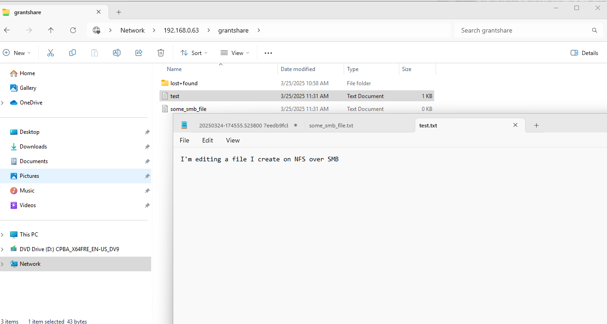

## Finishing Touches - gidNumbers for Other Groups

If you drop to the command line and run `svc_nas_cifssupport --server 'Grant Demo NAS Server' --args="-checkup -full` you may see some of the below warnings. This occurs when your user is part of groups that do not have `gidNumber` set.

```bash
svc_nas_cifssupport --server 'Grant Demo NAS Server' --args="-checkup -full"
Grant Demo NAS Server :

------------------------------------Checks--------------------------------------


Component SMB :

ACL       : Checking the number of ACLs per file system. ........................ Pass
Connection: Checking the load of SMB TCP connections. ........................... Pass
Credential: Checking the validity of credentials. ............................... FAILURE
DC        : Checking the connectivity and configuration of Domain Controllers. .. Pass
DFS       : DFS check in svc_nas service script is deprecated. .................. Pass
DNS       : Checking the DNS configuration and connectivity to DNS servers. ..... FAILURE
EventLog  : Checking the configuration of Windows Event Logs. ................... FAILURE
GPO       : Checking the GPO configuration. ..................................... Pass
HomeDir   : Checking the configuration of home directory shares. ................ Pass
I18N      : Checking the I18N mode and the Unicode/UTF8 translation tables. ..... Pass
Kerberos  : Checking password updates and AES for Kerberos. ..................... Pass
LDAP      : Checking the LDAP configuration. .................................... Pass
LocalGrp  : Checking the database configuration of local groups. ................ Pass
NIS       : Checking the connectivity to the NIS servers. ....................... Pass
Ntxmap    : Checking the ntxmap configuration file. ............................. Pass
Secmap    : Checking the SECMAP database. ....................................... Pass
Security  : Checking the SMB security settings. ................................. Pass
Server    : Checking the SMB file servers configuration. ........................ Pass
Share     : Checking the network shares database. ............................... Pass
SmbList   : Checking the range availability of SMB IDs. ......................... FAILURE
Threads   : Checking for SMB blocked threads. ................................... Pass
UnsupOS   : Checking for unsupported client network operating systems. .......... Pass
UnsupProto: Checking for unsupported client network protocols. .................. Pass
VC        : Checking the configuration of Virus Checker servers. ................ Pass
VDM       : Checking the NAS server configuration. .............................. Pass
WINS      : Checking the connectivity to WINS servers. .......................... Pass
--------------------------------------------------------------------------------

----------------------------SMB : Credential Warnings---------------------------

Warning 17456169011: Grant Demo NAS Server :  The user 'GRANTLAB\\\\\\\\gcurell_adm' has some unmapped SIDs, indicating that the NAS server has not found a Unix user/group associated with the SID for this user credential. This might cause permission issues in an environment that is not purely SMB.
--> Check the mapping of the users/groups. You can set up the mapping by using a local passwd/group file, NIS, or Active Directory, depending on the mapping model you choose. Use the 'svc_nas_cifssupport -cred' command to check the credential.

-------------------------------SMB : DNS Warnings-------------------------------

Warning 17456037931: Grant Demo NAS Server :  The DNS domain 'GRANTLAB.local' is defined with only one DNS server. High availability is compromised.
--> Add another DNS server using the REST API dnsService object. The recommendation is to configure DNS with DNS servers accessible from different subnets.

-----------------------------SMB : EventLog Warnings----------------------------

Warning 17456169068: Grant Demo NAS Server :  A new value for the maximum size of the 'application' event log of the NAS server has been defined. This value is not yet effective.
--> On the Windows host, start the Microsoft event viewer. Connect to a SMB server of this NAS server and clear the corresponding event logs.

-----------------------------SMB : SmbList Warnings-----------------------------

Warning 17456169011: Grant Demo NAS Server :  The user 'GRANTLAB\\\\\\\\gcurell_adm' has some unmapped SIDs, indicating that the NAS server has not found a Unix user/group associated with the SID for this user credential. This might cause permission issues in an environment that is not purely SMB.
--> Check the mapping of the users/groups. You can set up the mapping by using a local passwd/group file, NIS, or Active Directory, depending on the mapping model you choose. Use the 'svc_nas_cifssupport -cred' command to check the credential.
```

In my case I was part of the following groups:

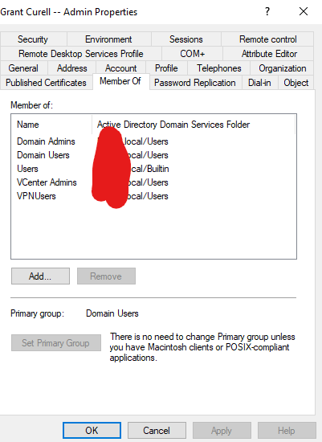

Since those groups don't have gidNumbers you see this warning. If you want to clear those warnings, each group will need to have a `gidNumber` defined.

## Troubleshooting

### How to Connect to PowerStore Over SSH

See [these instructions](https://www.dell.com/support/kbdoc/en-us/000131579/powerstore-how-to-connect-to-service-console-over-ssh) for how to connect to PowerStore over SSH.

### Problems with secmap

The biggest problem that can occur is if somewhere along the way your mapping fails and dynamic mapping kicks in. Here's what that looks like:

You go to your Rocky box and do something like:

```bash
sudo groupadd -g 10002 somerandomuser
sudo useradd -u 10002 -g 10002 -d /home/somerandomuser -s /bin/bash somerandomuser
[root@rocky nfs_test]# sudo -u somerandomuser touch /mnt/nfs_test/random.txt
touch: cannot touch '/mnt/nfs_test/random.txt': Permission denied
```

So there are two problems that are going to occur with this:

1. This user doesn't exist in active directory so there is no mapping
2. Even if we did create the user, if we don't give it a UID/GID it is going to get a dynamic mapping.

Here is what our current secmap looks ilke:

```bash
[SVC:service@AAAAAA-A user]$ svc_nas_cifssupport --server "Grant Demo NAS Server" --args="-secmap -list"
Grant Demo NAS Server :done

SECMAP MAPPING TABLE

Type      UID         Origin      Date of creation           Name                            SID
User      10001       ldap        Tue Mar 25 18:24:05 2025   GRANTLAB\\gcurell_adm              S-1-5-15-c68e4ef2-864be32f-a76ce7d9-87a
```

So first I create that user in active directory:

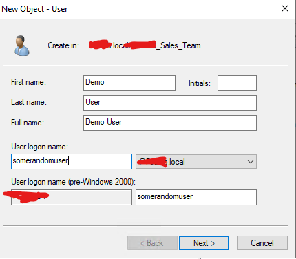

I went ahead and logged in to my SMB share.

```bash
[SVC:service@AAAAAA-A user]$ svc_nas_cifssupport --server "Grant Demo NAS Server" --args="-secmap -list"
Grant Demo NAS Server :done

SECMAP MAPPING TABLE

Type      UID         Origin      Date of creation           Name                            SID
User      10001       ldap        Tue Mar 25 18:24:05 2025   GRANTLAB\\gcurell_adm              S-1-5-15-c68e4ef2-864be32f-a76ce7d9-87a
User      2147483650  secmap      Wed Mar 26 20:42:56 2025   GRANTLAB\\somerandomuser           S-1-5-15-c68e4ef2-864be32f-a76ce7d9-87c
User      2147483649  secmap      Tue Mar 25 19:09:32 2025   GRANTLAB\\Administrator            S-1-5-15-c68e4ef2-864be32f-a76ce7d9-1f4
```

You can see the origin is secmap and it has a randomly generated UID. This is reflected when you login and create files as that user:

```bash
[root@rocky nfs_test]# ls -al
total 56
drwxr-xr-x. 5 root        root        8192 Mar 26 17:00 .
drwxr-xr-x. 5 root        root          52 Mar 24 09:33 ..
dr-xr-xr-x. 2 root        bin          152 Mar 25 13:58 .etc
-rw-r--r--. 1 gcurell_adm gcurell_adm    6 Mar 26 10:55 file_created_on_smb.txt
drwxr-xr-x. 2 root        root        8192 Mar 25 13:58 lost+found
-rw-r--r--. 1  2147483650  2147483650    5 Mar 26 17:02 somefile.txt
-rw-r--r--. 1 gcurell_adm gcurell_adm   18 Mar 26 16:59 some_smb_file.txt
-rw-r--r--. 1 gcurell_adm gcurell_adm    9 Mar 26 16:59 test2.txt
-rw-r--r--. 1 gcurell_adm gcurell_adm   43 Mar 26 16:57 test.txt
```

You can see `somefile.txt` has a random `UID`. You need to go in, make sure `uidNumber` and `gidNumber` are set in your user's AD attributes, and then clear any old secmap mappings as shown below:

```bash
[SVC:service@AAAAAA-A user]$ svc_nas_cifssupport --server "Grant Demo NAS Server" --args="-secmap -delete -name somerandomuser -domain GRANTLAB"
Grant Demo NAS Server :done
```

You can see secmap updates:

```bash
[SVC:service@AAAAAA-A user]$ svc_nas_cifssupport --server "Grant Demo NAS Server" --args="-secmap -list"
Grant Demo NAS Server :done

SECMAP MAPPING TABLE

Type      UID         Origin      Date of creation           Name                            SID
User      10001       ldap        Wed Mar 26 20:57:50 2025   GRANTLAB\\gcurell_adm              S-1-5-15-c68e4ef2-864be32f-a76ce7d9-87a
User      10002       ldap        Wed Mar 26 21:21:46 2025   GRANTLAB\\somerandomuser           S-1-5-15-c68e4ef2-864be32f-a76ce7d9-87c
User      2147483649  secmap      Tue Mar 25 19:09:32 2025   GRANTLAB\\Administrator            S-1-5-15-c68e4ef2-864be32f-a76ce7d9-1f4
```

You can once again test and you see that a file created with `somerandomuser` correctly maps to that user:

```bash
[root@rocky nfs_test]# sudo -u somerandomuser touch /mnt/nfs_test/somerandomuser_file
[root@rocky nfs_test]# ls -al
total 56
drwxr-xr-x. 5 root           root           8192 Mar 26 17:54 .
drwxr-xr-x. 5 root           root             52 Mar 24 09:33 ..
dr-xr-xr-x. 2 root           bin             152 Mar 25 13:58 .etc
-rw-r--r--. 1 gcurell_adm    gcurell_adm       6 Mar 26 10:55 file_created_on_smb.txt
drwxr-xr-x. 2 root           root           8192 Mar 25 13:58 lost+found
-rw-r--r--. 1     2147483650     2147483650    5 Mar 26 17:02 somefile.txt
-rw-r--r--. 1 somerandomuser somerandomuser    0 Mar 26 17:54 somerandomuser_file
-rw-r--r--. 1 gcurell_adm    gcurell_adm      18 Mar 26 16:59 some_smb_file.txt
-rw-r--r--. 1 gcurell_adm    gcurell_adm       9 Mar 26 16:59 test2.txt
-rw-r--r--. 1 gcurell_adm    gcurell_adm      43 Mar 26 16:57 test.txt
```

### How to Check a User

If you need to check that a user is valid and that you can see the `uid` and `gid`, you can run the below.

```bash
[SVC:service@AAAAAA-A user]$ svc_nas_tools --server "Grant Demo NAS Server" --args="-ldap -lookup -user gcurell_adm"

Grant Demo NAS Server : commands processed: 1
1742930087: LDAP:10: LdapCache::getUserByName [DC=grantlab,DC=local]: User gcurell_adm, password x, uid 10001, gid 10001 (expired)
1742930087: LDAP:10: LdapDomainClient::checkDomain: this=0x7f1f04f6c598: LdapDomain  0x7f1e497ff018/0x204
1742930087: LDAP:10: LdapDomain::initThreadsServicesObjects()
1742930087: LDAP:10: LdapCache::restampEntry [DC=grantlab,DC=local]: Name "gcurell_adm": Entry restamped
1742930087: LDAP: 6: user: gcurell_adm, uid: 10001, gid: 10001, homeDir: /home/grant_adm
```

### Check Domain Health

If you need to check the domain connection health, run the below.

```bash
[SVC:root@AAAAAA-A user]$ svc_nas_cifssupport --server NAS01 --args="-checkup -full"

NAS01 :

------------------------------------Checks--------------------------------------


Component SMB :

ACL       : Checking the number of ACLs per file system. ........................ Pass
Connection: Checking the load of SMB TCP connections. ........................... Pass
Credential: Checking the validity of credentials. ............................... Pass
DC        : Checking the connectivity and configuration of Domain Controllers. .. Pass
DFS       : DFS check in svc_nas service script is deprecated. .................. Pass
DNS       : Checking the DNS configuration and connectivity to DNS servers. ..... Pass
EventLog  : Checking the configuration of Windows Event Logs. ................... FAILURE
GPO       : Checking the GPO configuration. ..................................... Pass
HomeDir   : Checking the configuration of home directory shares. ................ Pass
I18N      : Checking the I18N mode and the Unicode/UTF8 translation tables. ..... Pass
Kerberos  : Checking password updates and AES for Kerberos. ..................... Pass
LDAP      : Checking the LDAP configuration. .................................... Pass
LocalGrp  : Checking the database configuration of local groups. ................ Pass
NIS       : Checking the connectivity to the NIS servers. ....................... Pass
Ntxmap    : Checking the ntxmap configuration file. ............................. Pass
Secmap    : Checking the SECMAP database. ....................................... Pass
Security  : Checking the SMB security settings. ................................. Pass
Server    : Checking the SMB file servers configuration. ........................ Pass
Share     : Checking the network shares database. ............................... Pass
SmbList   : Checking the range availability of SMB IDs. ......................... Pass
Threads   : Checking for SMB blocked threads. ................................... Pass
UnsupOS   : Checking for unsupported client network operating systems. .......... Pass
UnsupProto: Checking for unsupported client network protocols. .................. Pass
VC        : Checking the configuration of Virus Checker servers. ................ Pass
VDM       : Checking the NAS server configuration. .............................. Pass
WINS      : Checking the connectivity to WINS servers. .......................... FAILURE
--------------------------------------------------------------------------------

-----------------------------SMB : EventLog Warnings----------------------------

Warning 17456169068: NAS01 :  A new value for the maximum size of the 'application' event log of the NAS server has been defined. This value is not yet effective.
--> On the Windows host, start the Microsoft event viewer. Connect to a SMB server of this NAS server and clear the corresponding event logs.

-------------------------------SMB : WINS Warnings------------------------------

Warning 17451974758: NAS01 :  The NetBIOS server 'AJPS01' does not have any WINS server in its configuration. The SMB clients might not be able to access the SMB server.
--> WINS not supported by NAS.

--------------------------------------------------------------------------------

Total :   2 warnings
```

