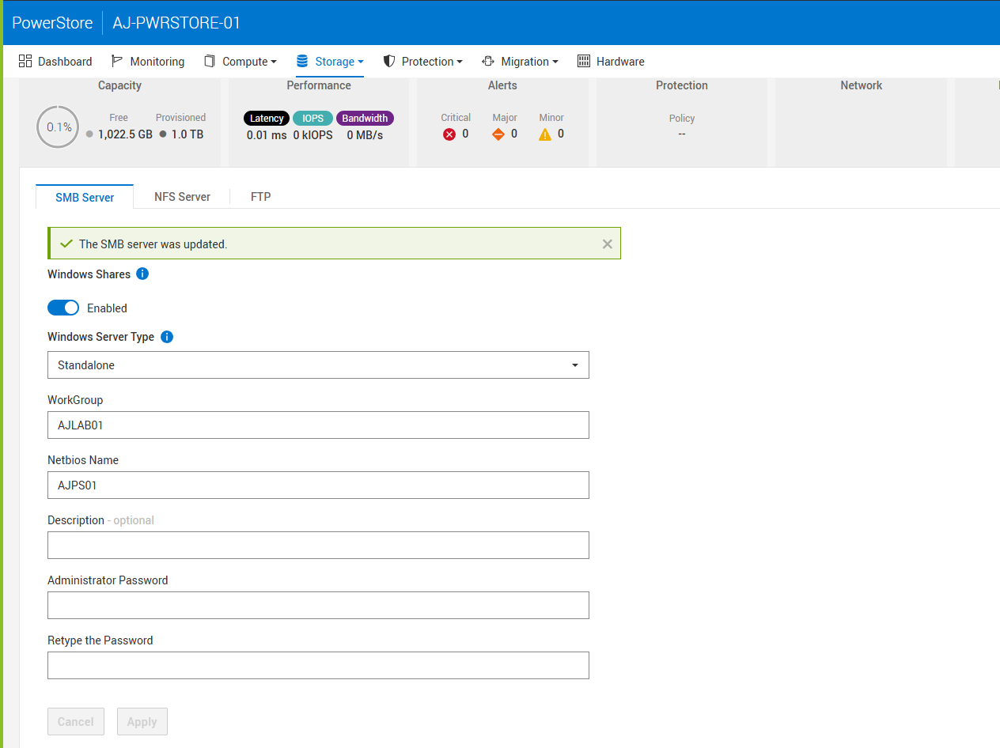

# Configure PowerStore SMB User

- [Configure PowerStore SMB User](#configure-powerstore-smb-user)
  - [Troubleshooting](#troubleshooting)
    - [Mapping](#mapping)
    - [Checking All NAS Servers](#checking-all-nas-servers)
    - [Run a Health Check Against a NAS Server](#run-a-health-check-against-a-nas-server)
    - [Display a Specific NAS Server](#display-a-specific-nas-server)


To configure PowerStore for SMB you will need to both enable SMB on the PowerStore and then setup a user. Start by going to the SMB panel under `Storage -> SMB Server`.



Go ahead and configure SMB if you haven't already and then set an administrator password in the fields shown below. As described in [this KB article](https://www.dell.com/support/kbdoc/en-us/000021482) you will need to then use the Microsoft MMC console to connect to the server and configure a Windows user. To do this, open up PowerShell as an administrator and run:

```powershell
`runas /netonly /user:<SMB_SERVER_IP>\administrator "mmc compmgmt.msc -a /computer=<SMB_SERVER_IP>"`
```

This will connect you to the MMC console after which you will need to navigate to `Local Users and Groups -> Users`. From there, create a new user.


From there you can mount the share as normal.


## Troubleshooting

### Mapping

If you are running NFS, make sure you have enabled

> Enable automatic mapping for unmapped Windows accounts/users

When automatic mapping is enabled, unmapped Windows users (users not explicitly mapped to UNIX identities) are automatically mapped to a default UNIX user (typically nobody or a custom one you define).


### Checking All NAS Servers

`svc_nas run nas_svc_nas ALL -list`

```
Last login: Fri Feb 28 15:15:30 2025 from 10.20.8.96
[SVC:service@4XZBTZ3-B user]$ svc_nas run nas_svc_nas ALL -list
         NAS server ID                lid   type     state      nodes  SVDM_IP        Name
 66d1d9b1-cc8f-214d-2191-f640a503ca57    3  user     CREATED      1 2  fdeb:9b7d:5928:0:201:4470:d467:ba1e NAS01
 00000000-0000-0000-0200-000000000000    2  system   CREATED      1 -  fdeb:9b7d:5928:0:201:4470:d467:ba1e SVDM_A_Node1
 00000000-0000-0000-0200-000000000000    2  system   CREATED      2 -  fdeb:9b7d:5928:0:201:4400:8591:deb2 SVDM_A_Node2
 00000000-0000-0000-0100-000000000000    1  system   CREATED      2 -  fdeb:9b7d:5928:0:201:4400:8591:deb2 SVDM_B

 Total number of running NAS servers: 4
```

### Run a Health Check Against a NAS Server

`svc_nas run nas_svc_nas NAS01 -checkup`

### Display a Specific NAS Server

`svc_nas run nas_svc_nas NAS01 -ds`
