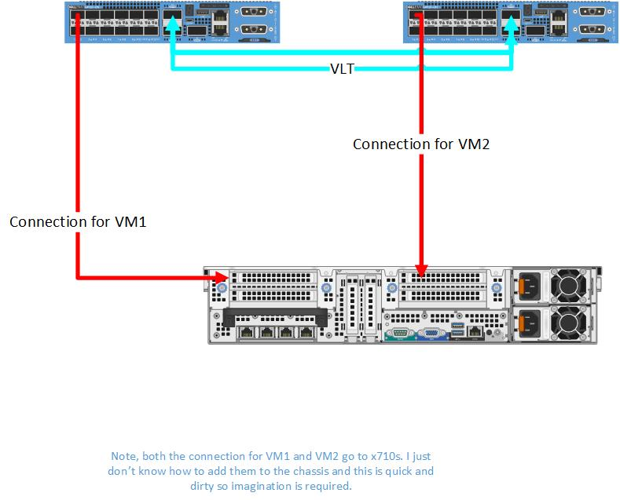
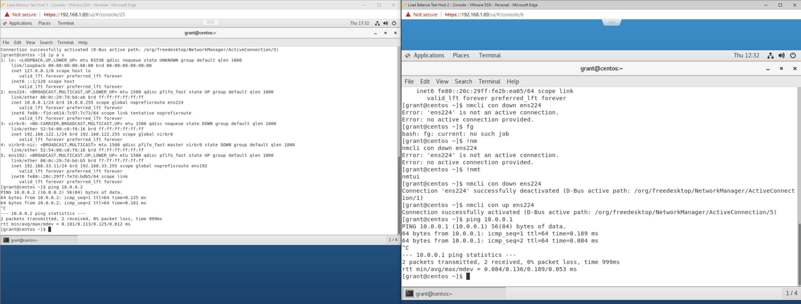
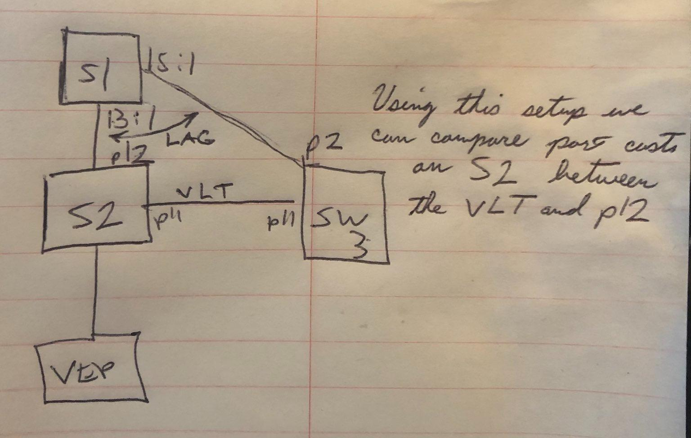
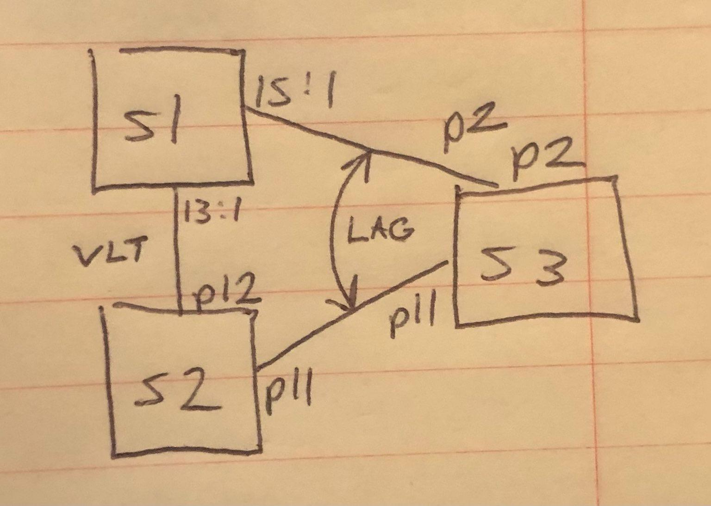

# Configuring VLT on OS10

- [Configuring VLT on OS10](#configuring-vlt-on-os10)
  - [My Test Platform](#my-test-platform)
  - [Configuration of VLT](#configuration-of-vlt)
    - [Device 1](#device-1)
    - [Device 2](#device-2)
  - [Configuration of VLANs for Test](#configuration-of-vlans-for-test)
  - [Test Scenario](#test-scenario)
    - [Objective](#objective)
  - [Useful Commands](#useful-commands)
  - [Spanning Tree and VLT](#spanning-tree-and-vlt)

## My Test Platform

    OS10# show version
    Dell EMC Networking OS10 Enterprise
    Copyright (c) 1999-2020 by Dell Inc. All Rights Reserved.
    OS Version: 10.5.1.3
    Build Version: 10.5.1.3.190
    Build Time: 2020-06-19T21:48:07+0000
    System Type: S4112F-ON
    Architecture: x86_64
    Up Time: 00:19:57

    
## Configuration of VLT

### Device 1

    # Configure management
    configure terminal
    interface mgmt 1/1/1
    no ip address dhcp
    ip address 192.168.1.24/24
    exit
    # Configure spanning tree
    spanning-tree mode rstp
    interface range ethernet 1/1/13-1/1/14
    # Create a VLT Domain and Configure the VLT interconnect (VLTi)
    no switchport
    exit
    vlt-domain 1
    discovery-interface ethernet 1/1/13
    discovery-interface ethernet 1/1/14
    # Configure the VLT Priority, VLT MAC Address, and VLT Backup Link
    primary-priority 4096
    vlt-mac 00:11:22:33:44:55
    backup destination 192.168.1.25
    end

### Device 2

    # Configure management
    configure terminal
    interface mgmt 1/1/1
    no ip address dhcp
    ip address 192.168.1.25/24
    exit
    # Configure spanning tree
    spanning-tree mode rstp
    interface range ethernet 1/1/13-1/1/14
    # Create a VLT Domain and Configure the VLT interconnect (VLTi)
    no switchport
    exit
    vlt-domain 1
    discovery-interface ethernet 1/1/13
    discovery-interface ethernet 1/1/14
    # Configure the VLT Priority, VLT MAC Address, and VLT Backup Link
    primary-priority 8192
    vlt-mac 00:11:22:33:44:55
    backup destination 192.168.1.24
    end

## Configuration of VLANs for Test

(On both devices)

    configure terminal
    interface vlan 9
    no shut
    exit
    interface ethernet 1/1/1
    switchport mode trunk
    switchport trunk allowed vlan 9
    end

On ESXi I used two separate virtual switches each with a port group. Each port group was assigned VLAN 9.

## Test Scenario

### Objective

Ping from VM1 to VM2 to show that communication will flow over the VLT and vice versa.

Works as expected.

## Useful Commands

- `show vlt 1`
- `show vlt 1 mismatch`
- `show running-configuration vlt`

## Spanning Tree and VLT

I created the below scenario to see what would happen if you created a situation where RSTP can forward from S2 across both port 11 and port 12 to get to interface VLAN 1 on switch 3. In this scenario I gave the VLAN 1 SVI on S2 10.0.0.2 and on S# 10.0.0.3. 

The first thing I investigated were the effects on STP on S2.

Under the hood you can drop to the Linux command line and inspect the bridge associated with the VLT setup to see its root path cost (here my VLT interface is `bo1000`). It is worth noting that VLT interfaces are represented as bonds to the Linux kernel. Furthermore I also noticed the updated values, if updated from the OS10 shell, are not reflected here:

    root@OS10:~# brctl showstp br1
    br1
    bridge id              8000.886fd498b7b1
    designated root        8000.886fd498b7b1
    root port                 0                    path cost                  0
    max age                  20.00                 bridge max age            20.00
    hello time                2.00                 bridge hello time          2.00
    forward delay            15.00                 bridge forward delay      15.00
    ageing time            5400.00
    hello timer               0.00                 tcn timer                  0.00
    topology change timer     0.00                 gc timer                 910.24
    flags

    bo1000 (16)
    port id                8010                    state                forwarding
    designated root        8000.886fd498b7b1       path cost                100
    designated bridge      8000.886fd498b7b1       message age timer          0.00
    designated port        8010                    forward delay timer        0.00
    designated cost           0                    hold timer                 0.00
    flags

    ...

    e101-012-0 (13)
    port id                800d                    state                forwarding
    designated root        8000.886fd498b7b1       path cost                100
    designated bridge      8000.886fd498b7b1       message age timer          0.00
    designated port        800d                    forward delay timer        0.00
    designated cost           0                    hold timer                 0.00
    flags

You can see which interfaces are in the VLT bond with `ip a s | grep <the interface use used for vlt>`. In my case I only used interface 11 so I did:

    root@OS10:~# ip a s | grep e101-011-0
    23: e101-011-0: <BROADCAST,MULTICAST,ALLMULTI,SLAVE,UP,LOWER_UP> mtu 9184 qdisc multiq master bo1000 state UP group default qlen 1000

so we can see here that the VLT bond is bo1000. I then performed a `ping 10.0.0.3` from S2 and checked the MAC address table.

    OS10(conf-if-vl-1)# do show mac address-table
    VlanId  Mac Address             Type            Interface
    ...
    1       88:6f:d4:98:a7:b1       static          port-channel1000

We can see that the switch learned the MAC address for switch 3 over the VLT interface.

I had a sneaky suspicion that the switch was biasing the VLT link so I reset the experiment except instead of having the VLT between S2 and S3 I put the VLT between S1 and S2. This has the effect of making it so that instead of a single hop across a port channel to get to S3 it would have two hops using the VLT:

I then repeated my VLAN 1 ping test from S2 to S3 and as expected - S2 learned S3's mac address of `88:6f:d4:98:a7:b1` on the VLT port *not* the port channel:

On S2:

    OS10# show mac address-table
    VlanId  Mac Address             Type            Interface
    ...
    1       88:6f:d4:98:a7:b1       dynamic         port-channel1000

What's going on here is that under the covers it looks like, all things being equal, spanning tree will favor the VLT link. However, if you go into the interface and set the port priority and cost with `spanning-tree rstp cost 1` and `spanning-tree rstp priority 0`, you can force it to use the port channel instead. I repeated my ping test and then checked the mac address table on S2 and as expected got:

    OS10(config)# show mac address-table
    VlanId  Mac Address             Type            Interface
    ...
    1       88:6f:d4:98:a7:b1       dynamic         ethernet1/1/11

Then to confirm my results, on S2, I went back and deprioritized port 11 with:

    OS10(config)# interface ethernet 1/1/11
    OS10(conf-if-eth1/1/11)# spanning-tree rstp cost 200000000
    OS10(conf-if-eth1/1/11)# spanning-tree rstp priority 240

and then redid my ping and as expected got:

    OS10(config)# ping 10.0.0.3
    PING 10.0.0.3 (10.0.0.3) 56(84) bytes of data.
    64 bytes from 10.0.0.3: icmp_seq=1 ttl=64 time=1.16 ms
    64 bytes from 10.0.0.3: icmp_seq=2 ttl=64 time=1.04 ms
    ^C
    --- 10.0.0.3 ping statistics ---
    2 packets transmitted, 2 received, 0% packet loss, time 1001ms
    rtt min/avg/max/mdev = 1.047/1.106/1.166/0.068 ms
    OS10(config)# show mac address-table
    VlanId  Mac Address             Type            Interface
    ...
    1       88:6f:d4:98:a7:b1       dynamic         port-channel1000