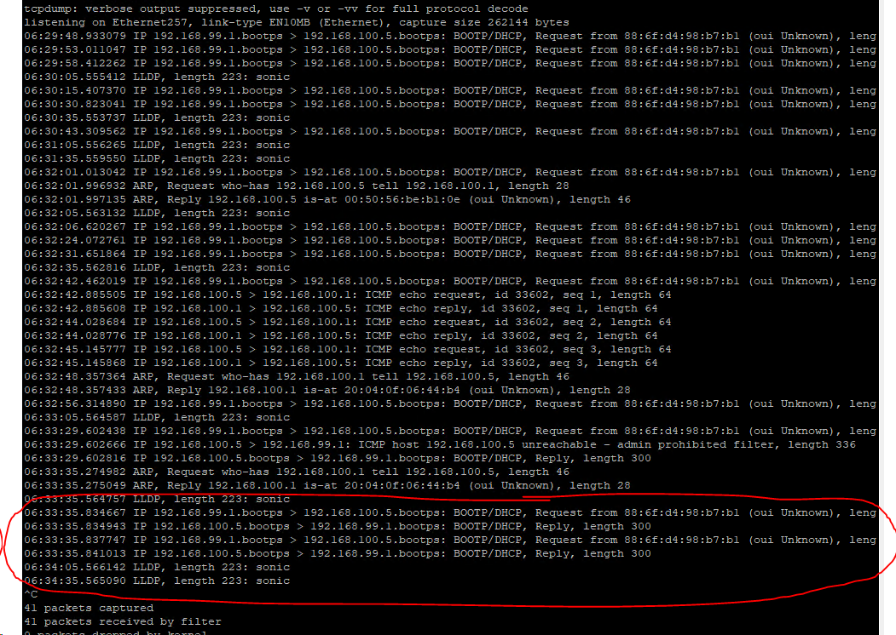

# DHCP Relay on SONiC

- [Configuring a Cross VLAN DHCP Relay on SONiC OS](#configuring-a-cross-vlan-dhcp-relay-on-sonic-os)
  - [My Configuration](#my-configuration)
    - [IP Addresses](#ip-addresses)
    - [Test Concept](#test-concept)
    - [4112F-ON OS 10 Version](#4112f-on-os-10-version)
    - [Z9264 SONiC Version](#z9264-sonic-version)
    - [RHEL Version](#rhel-version)
  - [Configuration of Devices](#configuration-of-devices)
    - [Configuration of RHEL DHCP Server](#configuration-of-rhel-dhcp-server)
    - [OS10 on 4112F-ON](#os10-on-4112f-on)
    - [SONiC OS on Z9264](#sonic-os-on-z9264)
      - [Helpful Commands](#helpful-commands)
    - [Configuration on ESXi](#configuration-on-esxi)
  - [Running the Test](#running-the-test)
    - [Lease Record on RHEL](#lease-record-on-rhel)
    - [tcpdump from SONiC](#tcpdump-from-sonic)
    - [Address Info From OS10](#address-info-from-os10)

## My Configuration

```
Dell 4112F-ON running OS 10 (interface eth1/1/13 to interface ethernet 0 [all VLAN 99])
            |
Dell Z9264 running SONiC OS (interface ethernet 257 to interface vmnic7 [all vlan 100])
            |
Dell R840 running ESXi (virtual switch with portgroup on vlan 100 going to VM's virtual NIC)
            |
RHEL Virtual Machine with DHCP server
```

### IP Addresses

- RHEL VM: 192.168.100.5/24
- Z9264 SVI interface on VLAN 99: 192.168.99.1/24
- Z9264 SVI interface on VLAN 100: 192.168.100.1/24
- 4112F-ON SVI interface on VLAN 99 - DHCP

### Test Concept

DHCP request will go from SVI interface on 4112F-ON residing on VLAN 99 through the Z9264, to ESXi, and onto the DHCP server running on the RHEL virtual machine on VLAN 100 running dhcpd.

### 4112F-ON OS 10 Version

```
Dell EMC Networking OS10 Enterprise
Copyright (c) 1999-2020 by Dell Inc. All Rights Reserved.
OS Version: 10.5.1.3
Build Version: 10.5.1.3.190
Build Time: 2020-06-19T21:48:07+0000
System Type: S4112F-ON
Architecture: x86_64
Up Time: 1 day 01:29:03
```

### Z9264 SONiC Version

```
Software Version  : '3.4.0-Enterprise_Base'
Product           : Enterprise SONiC Distribution by Dell Technologies
Distribution      : '9.13'
Kernel            : '4.9.0-11-2-amd64'
Config DB Version : version_3_3_1
Build Commit      : 'e2f258af7'
Build Date        : Wed Jul 28 23:54:33 UTC 2021
Built By          : sonicbld@sonic-lvn-csg-005
Platform          : x86_64-dellemc_z9264f_c3538-r0
HwSKU             : DellEMC-Z9264f-C64
ASIC              : broadcom
Hardware Version  : A00
Serial Number     : TW0XXP63DNT008970001
Uptime            : 04:53:36 up 2:05, 1 user, load average: 1.04, 0.94, 0.95
Mfg               : Dell EMC
```

### RHEL Version

```
[root@freeipa ~]# cat /etc/*-release
NAME="Red Hat Enterprise Linux"
VERSION="8.2 (Ootpa)"
ID="rhel"
ID_LIKE="fedora"
VERSION_ID="8.2"
PLATFORM_ID="platform:el8"
PRETTY_NAME="Red Hat Enterprise Linux 8.2 (Ootpa)"
ANSI_COLOR="0;31"
CPE_NAME="cpe:/o:redhat:enterprise_linux:8.2:GA"
HOME_URL="https://www.redhat.com/"
BUG_REPORT_URL="https://bugzilla.redhat.com/"

REDHAT_BUGZILLA_PRODUCT="Red Hat Enterprise Linux 8"
REDHAT_BUGZILLA_PRODUCT_VERSION=8.2
REDHAT_SUPPORT_PRODUCT="Red Hat Enterprise Linux"
REDHAT_SUPPORT_PRODUCT_VERSION="8.2"
Red Hat Enterprise Linux release 8.2 (Ootpa)
Red Hat Enterprise Linux release 8.2 (Ootpa)
```

## Configuration of Devices

### Configuration of RHEL DHCP Server

See: [Configuring RHEL DHCP Server](https://access.redhat.com/documentation/en-us/red_hat_enterprise_linux/8/html/configuring_and_managing_networking/providing-dhcp-services_configuring-and-managing-networking#setting-up-the-dhcp-service-for-subnets-that-are-not-directly-connected-to-the-dhcp-server_providing-dhcp-services_ipv4)

```bash
sudo dnf install -y dhcp-server
ip route add 192.168.99.0/24 via 192.168.100.1 dev ens224
vim /etc/dhcp/dhcpd.conf
```

I used configuration:

```
#
# DHCP Server Configuration file.
#   see /usr/share/doc/dhcp-server/dhcpd.conf.example
#   see dhcpd.conf(5) man page
#

option domain-name "lan";
default-lease-time 86400;
authoritative;

shared-network lan {

  subnet 192.168.99.0 netmask 255.255.255.0 {
    range 192.168.99.100 192.168.99.200;
    option routers 192.168.99.1;
  }
}

subnet 192.168.100.0 netmask 255.255.255.0 {}
```


### OS10 on 4112F-ON

[Full Configuration](./os10.conf)

```
configure terminal
interface ethernet 1/1/13
switchport mode trunk
switchport trunk allowed vlan 99
exit
interface vlan 99
ip address dhcp
```

### SONiC OS on Z9264

[Full Configuration](./sonic.conf)

```
sonic-cli
configure terminal
interface ethernet 0
no shutdown
fec rs
speed 100000
switchport trunk allowed Vlan 99
exit
interface ethernet 257
no shutdown
switchport trunk allowed Vlan 100
exit
interface Vlan 99
ip address 192.168.99.1/24
ip dhcp-relay 192.168.100.5
exit
interface Vlan 100
ip address 192.168.100.1/24
exit
```

**NOTE**: I had to manually configure FEC on the 100Gb/s interface to bring it up.

#### Helpful Commands

`show interface transceiver`

**NOTE**: Unlike OS10 all interfaces start in shutdown mode so you will need to bring them up.

### Configuration on ESXi


## Running the Test

### Lease Record on RHEL

```
[root@freeipa ~]# cat /var/lib/dhcpd/dhcpd.leases
# The format of this file is documented in the dhcpd.leases(5) manual page.
# This lease file was written by isc-dhcp-4.3.6

# authoring-byte-order entry is generated, DO NOT DELETE
authoring-byte-order little-endian;

server-duid "\000\001\000\001)A@\255\000PV\276\261\016";

lease 192.168.99.100 {
  starts 1 2021/12/06 21:50:25;
  ends 2 2021/12/07 21:50:25;
  cltt 1 2021/12/06 21:50:25;
  binding state active;
  next binding state free;
  rewind binding state free;
  hardware ethernet 88:6f:d4:98:b7:b1;
  option agent.circuit-id "Vlan99";
  option agent.remote-id "20:04:0f:06:44:b4";
  client-hostname "OS10";
}
```

### tcpdump from SONiC

Shows DHCP transiting the relay.



### Address Info From OS10

```
OS10(conf-if-vl-99)# do show ip interface brief
Interface Name            IP-Address          OK       Method       Status     Protocol
=========================================================================================
Ethernet 1/1/1             unassigned          NO       unset        up          down
Ethernet 1/1/2             unassigned          NO       unset        up          down
Ethernet 1/1/3             unassigned          NO       unset        up          down
Ethernet 1/1/4             unassigned          NO       unset        up          down
Ethernet 1/1/5             unassigned          NO       unset        up          down
Ethernet 1/1/6             unassigned          NO       unset        up          down
Ethernet 1/1/7             unassigned          NO       unset        up          down
Ethernet 1/1/8             unassigned          NO       unset        up          down
Ethernet 1/1/9             unassigned          NO       unset        up          down
Ethernet 1/1/10            unassigned          NO       unset        up          down
Ethernet 1/1/11            unassigned          NO       unset        up          down
Ethernet 1/1/12            unassigned          NO       unset        up          down
Ethernet 1/1/13            unassigned          YES      unset        up          up
Ethernet 1/1/14            unassigned          NO       unset        up          down
Ethernet 1/1/15            unassigned          NO       unset        up          down
Management 1/1/1           192.168.1.24/24     YES      manual       up          up
Vlan 1                     unassigned          NO       unset        up          down
Vlan 99                    192.168.99.100/24   YES      DHCP         up          up
```