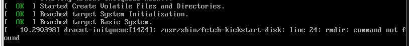

# Dell Ansible Testing

## Install Ansible Modules

1. Install Dell Ansible modules from [here](https://github.com/dell/dellemc-openmanage-ansible-modules)
   1. `git clone -b devel --single-branch https://github.com/dell/dellemc-openmanage-ansible-modules.git`
   2. `cd dellemc-openmanage-ansible-modules`
   3. `python install.py`
2. Create a CIFs/NFS share from which to share files. I used Samba with [this tutorial](https://linuxize.com/post/how-to-install-and-configure-samba-on-centos-7/)
   1. Note: If you get weird errors in the logs when starting SMB, you probably have a type-o in your smb.conf.
   2. I saw different things in different tutorials, but to get firewalld running I used `firewall-cmd --permanent --add-service=samba && firewall-cmd --reload`
3. 

## Deploy Operating System (Incomplete)

1. Next you will need to create a "Kickstartable" ISO. I chose to use RHEL8.
   1. I used the [free developer license of RHEL 8](https://developers.redhat.com/rhel8/)
   2. I used [this post](https://serverfault.com/questions/517908/how-to-create-a-custom-iso-image-in-centos) to create the ISO. 
   3. I used [this site](https://access.redhat.com/labs/kickstartconfig/) to generate my Kickstart config.
   4. *Update* I was going to use RHEL 8. However it looks like [there is a bug](https://bugzilla.redhat.com/show_bug.cgi?id=1680595) that is a hard stop for RHEL 8 Kickstart so I'm swapping to CentOS.

        

   5. 
