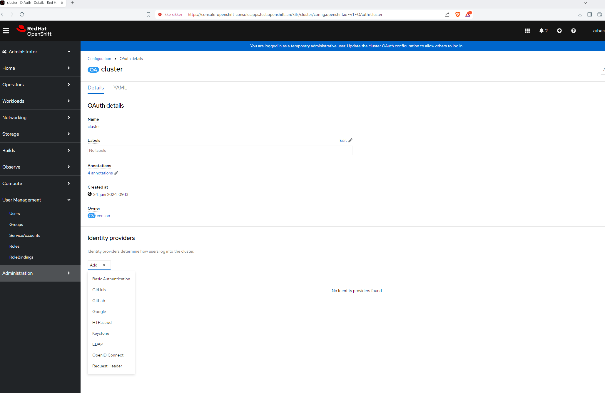

- Logging in

```bash
[rosa@bastion ~]$ oc login --username cluster-admin --password VEQnI-EBKuH-PHxpY-IPIPE https://api.rosa-mqzmw.r0s7.p3.openshiftapps.com:443
Login successful.

You have access to 78 projects, the list has been suppressed. You can list all projects with 'oc projects'

Using project "default".
Welcome! See 'oc help' to get started.
[rosa@bastion ~]$ oc whoami
cluster-admin
[rosa@bastion ~]$ oc whoami --show-console
https://console-openshift-console.apps.rosa.rosa-mqzmw.r0s7.p3.openshiftapps.com
[rosa@bastion ~]$ 
```

### Identity Providers

- The first time you login you use a temporary admin and then you can add an identity provider:



- I just wanted to do a username/password so I did the below and uploaded the file for htpasswd.

```bash
sudo dnf install -y httpd-tools 
htpasswd -c /home/grant/password grant
```

