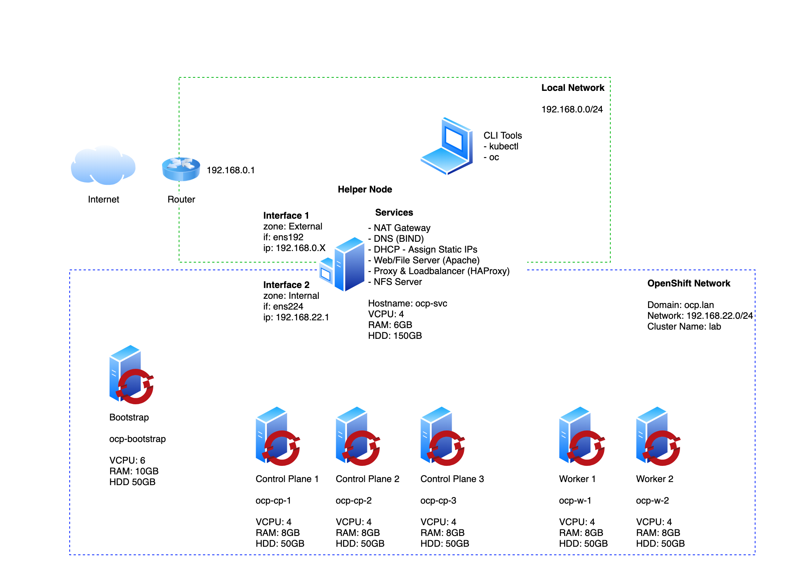

# User Provisioned Infrastructure (UPI) Install

**The bootstrap host only applies to versions 4.12 and older!**

- [User Provisioned Infrastructure (UPI) Install](#user-provisioned-infrastructure-upi-install)
  - [Some Notes on How Bootstrap Works](#some-notes-on-how-bootstrap-works)
  - [Example Architecture](#example-architecture)
  - [Setting Up Your Helper Machine](#setting-up-your-helper-machine)

## Some Notes on How Bootstrap Works

- The bootstrap machine will host resources the control plane servers will use
- During the bootstrap process the control plane nodes will stand up a temporary control plane which will be used to stand up the permanent control plane
- After the temporary control plane has completed its job the bootstrap host will shut down the temporary control plane machines, which will then reboot with the actual control plane. At this time the worker machines will boot up. We will join them into the cluster with certificate signing requests.

## Example Architecture



[Source](https://github.com/ryanhay/ocp4-metal-install)

1. You must build a bootstrap VM or physical machine running RHCOS with the following specs:
   1. 4 CPUs
   2. 16GB RAM
   3. 100 GB storage

## Setting Up Your Helper Machine

- The helper machine is separate from bootstrap. This is wherever you have DNS and all your services. In my case, I also made my quay registry the same machine as my helper machine so that was all co-located.
- Update the file [dnsmasq.conf](./dnsmasq.conf) with your values and move it to `/etc/dnsmasq.conf`
- Add the following to your `/etc/hosts` file and update the IPs for your scheme

```bash
10.10.25.132 mfdt-staging.openshift.lan
10.10.25.160 ocp-cp-1.vmware-cluster.openshift.lan
10.10.25.161 ocp-cp-2.vmware-cluster.openshift.lan
10.10.25.162 ocp-cp-3.vmware-cluster.openshift.lan
10.10.25.163 ocp-w-1.vmware-cluster.openshift.lan
10.10.25.168 oauth-openshift.apps.vmware-cluster.openshift.lan
10.10.25.168 console-openshift-console.apps.vmware-cluster.openshift.lan
10.10.25.168 api-int.vmware-cluster.openshift.lan
10.10.25.168 api.vmware-cluster.openshift.lan
10.10.25.169 ocp-bootstrap.openshift.lan
```

- Update [dhcpd.conf](dhcpd.conf) with your values and move it to `/etc/dhcp/dhcpd.conf`
- Update [haproxy.cfg](./haproxy.cfg) with your values and move it to `/etc/haproxy/haproxy.cfg`
- Run the below to set everything up

```bash
# Install required software
sudo dnf update -y
sudo dnf install -y httpd haproxy nfs-utils dhcp-server

# Change the listening port for httpd
sudo sed -i 's/Listen 80/Listen 0.0.0.0:8080/' /etc/httpd/conf/httpd.conf

# Configure the firewall
sudo firewall-cmd --add-service=http --zone=public --permanent  # web services hosted on worker nodes
sudo firewall-cmd --add-service=https --zone=public --permanent # web services hosted on worker nodes
sudo firewall-cmd --add-port=8080/tcp --zone=public --permanent # our web server
sudo firewall-cmd --add-port=6443/tcp --zone=public --permanent # kube-api-server on control plane nodes
sudo firewall-cmd --add-port=22623/tcp --zone=public --permanent # machine-config server
sudo firewall-cmd --add-port=9000/tcp --zone=public --permanent # HAProxy stats
sudo firewall-cmd --add-service=mountd --zone=public --permanent # for nfs
sudo firewall-cmd --add-service=rpc-bind --zone=public --permanent # for nfs
sudo firewall-cmd --add-service=nfs --zone=public --permanent # for nfs
sudo firewall-cmd --add-service=dhcp --zone=public --permanent # for dhcp
sudo firewall-cmd --reload
sudo firewall-cmd --list-all

# Start services
sudo setsebool -P haproxy_connect_any 1 # SELinux name_bind access
sudo systemctl enable --now dnsmasq
sudo systemctl enable haproxy
sudo systemctl start haproxy
sudo systemctl status haproxy

# Configure NFS share
sudo mkdir -p /shares/registry
sudo chown -R nobody:nobody /shares/registry
sudo chmod -R 777 /shares/registry

##############################################
# REPLACE WITH YOUR IP RANGE                 #
##############################################
# Note: this may not run if you do this as user. You may have to VIM it.
sudo echo "/shares/registry  10.10.25.0/24(rw,sync,root_squash,no_subtree_check,no_wdelay)" > /etc/exports
##############################################
# REPLACE WITH YOUR IP RANGE                 #
##############################################

# Export the NFS share
sudo exportfs -rv

# Start NFS
sudo systemctl enable nfs-server rpcbind
sudo systemctl start nfs-server rpcbind nfs-mountd

# Generate SSH key
ssh-keygen
```

- Update [install-config.yaml](./install-config.yaml) with your values and move it to `~/openshift-configs`
  - TODO: Need to add stuff about additional trust bundle and the mirrors
- Run `openshift-install create manifests --dir ./ && openshift-install create ignition-configs --dir ./` in the `openshift-configs` directory to create the manifests for the install
  - NOTE: If you need to change the MTU, you must first generate the manifests, then edit `cluster-network-02-config.yml`. Change it to the below and then afterwards generate the ignition files.

```yaml
apiVersion: config.openshift.io/v1
kind: Network
metadata:
  creationTimestamp: null
  name: cluster
spec:
  clusterNetwork:
  - cidr: 10.128.0.0/14
    hostPrefix: 23
  externalIP:
    policy: {}
  networkType: OpenShiftSDN
  serviceNetwork:
  - 172.30.0.0/16
  defaultNetwork:
    type: OpenShiftSDN
    openshiftSDNConfig:
      mode: NetworkPolicy
      mtu: 8900  # YOUR MTU HERE
status: {}
```

- Move everything in your config directory to the webserver directory at `/var/www/html/ocp4`
- Run `openshift-install coreos print-stream-json | grep '\.iso[^.]'` to get the URL link to the version of RHCOS you need then get it with `wget`.
  - If you are running on VMWare you can pull an OVA from [here](https://mirror.openshift.com/pub/openshift-v4/x86_64/dependencies/rhcos/4.12/latest/)
- Run the following to fix the permissions in the directory

```bash
sudo chcon -R -t httpd_sys_content_t /var/www/html/ocp4
sudo chown -R apache: /var/www/html/ocp4
sudo chmod 755 /var/www/html/ocp4
```

- Now it is time to deploy the hosts. Mount the RHCOS ISO on each host, boot it, and once the command prompt run the following for each machine:

```bash
# Bootstrap
sudo coreos-installer install /dev/sda -u http://192.168.22.1:8080/ocp4/rhcos -I http://192.168.22.1:8080/ocp4/bootstrap.ign --insecure --insecure-ignition


# Or if you waited for it boot, use the following command then just reboot after it finishes and make sure you remove the attached .iso
sudo coreos-installer install /dev/sda -u http://192.168.22.1:8080/ocp4/rhcos -I http://192.168.22.1:8080/ocp4/master.ign --insecure --insecure-ignition
```