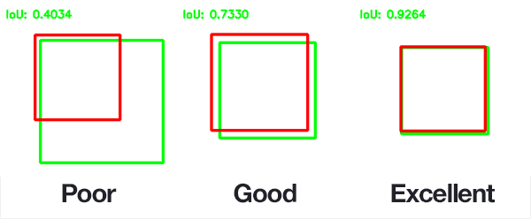
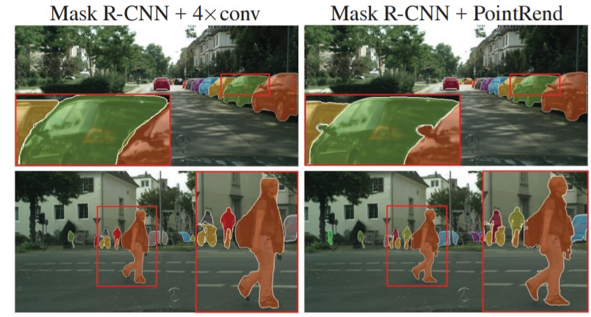

# Estimating Compute Requirements for Machine Learning

- [System Performance Analysis](#system-performance-analysis)
  - [Executive Summary](#executive-summary)
    - [Training Benchmarks](#training-benchmarks)
    - [Inference Benchmarks](#inference-benchmarks)
    - [Extrapolating Performance](#extrapolating-performance)
    - [Caveats](#caveats)
  - [Inference Benchmarking](#inference-benchmarking)
    - [Retinanet Benchmark](#retinanet-benchmark)
      - [What is the retinanet benchmark?](#what-is-the-retinanet-benchmark)
      - [The Results](#the-results)
      - [Understanding the Results](#understanding-the-results)
        - [Constraints of the Benchmark:](#constraints-of-the-benchmark)
        - [Benchmark Results:](#benchmark-results)
      - [Executive Brief Interpretation](#executive-brief-interpretation)
    - [System Description](#system-description)
  - [Training Benchmarking](#training-benchmarking)
    - [MLPerf Benchmark Rules](#mlperf-benchmark-rules)
    - [Accuracy Targets for Mask R-CNN and SSD (RetinaNet)](#accuracy-targets-for-mask-r-cnn-and-ssd-retinanet)
      - [Mask R-CNN (Object Detection - Heavy Weight)](#mask-r-cnn-object-detection---heavy-weight)
      - [SSD (RetinaNet) (Object Detection - Light Weight)](#ssd-retinanet-object-detection---light-weight)
      - [What is mean Average Precision (mAP)](#what-is-mean-average-precision-map)
    - [Single Shot MultiBox Detector (SSD)](#single-shot-multibox-detector-ssd)
      - [What is SSD](#what-is-ssd)
      - [Hyperparameters](#hyperparameters)
      - [Results](#results)
        - [Intersection over Union (IoU)](#intersection-over-union-iou)
    - [Mask Region-based Convolutional Neural Network (Mask R-CNN)](#mask-region-based-convolutional-neural-network-mask-r-cnn)
      - [What is Mask R-CNN](#what-is-mask-r-cnn)
      - [Hyperparameters](#hyperparameters-1)
      - [Results](#results-1)
    - [System Description](#system-description-1)

## Executive Summary

The focus of this analysis is on object detection in images with three algorithms; two for training and one for inference where training is the process of creating a model which can identify objects and inference is using that model to identify the objects.

The subject of the analysis is the MLPerf (Machine Learning Performance) benchmark which is the industry standard for judging performance. We specifically examine the results for the Dell XE8960, a GPU-focused server with eight Nvidia H100 GPUs.

### Training Benchmarks

- It takes the XE9680 with 8 H100s 37 minutes 21 seconds to pass the [Single Shot Multibox Detector (SSD) object detection benchmark](#single-shot-multibox-detector-ssd) where the input data came from OpenImages dataset
  - SSD is generally used for live object detection. Think a Tesla recognizing a stop sign on the fly.
  - The MLPerf benchmark specifies an overall mAP (mean Average Precision) score of 34%. mAP is a measurement is defined as both accurately identifying the existence of objects and correctly drawing a box around the object. Ex:

[Source](https://b2633864.smushcdn.com/2633864/wp-content/uploads/2016/09/iou_examples.png?lossy=2&strip=1&webp=1)

- The above image demonstrates precision. The other metric fed into the 34% value is correctly identifying all objects. Ex: The model could perfectly draw a box around one object but not notice that there were another 5 objects in the model.
- This is saying it takes 37 minutes to create a model that is correct 34% of the time. There is some nuance to this, but this is the high level.
- It takes the XE9680 19 minutes 50 seconds to pass the [Mask Region-based Convolutional Neural Networ (Mask R-CNN) benchmark](#mask-region-based-convolutional-neural-network-mask-r-cnn) where the training data came from the COCO dataset
  - Mask R-CNN is used for recognizing objects and classifying the parts of objects. It is typically less realtime focused than something like SSD.
  - The MLPerf benchmark specifies that the model must reach Minimum Box mAP (mean Average Precision): 0.377 and Minimum Mask mAP (mean Average Precision): 0.339. The box mAP is described above for SSD and remains unchanged. That is to say, correctly drawing a box around an object. Mask R-CNN also requires the model to draw a mask as pictured below:

[Source](https://developers.arcgis.com/python/guide/images/pointrend_maskrcnn.jpg)

### Inference Benchmarks

- A detailed analysis of all the rules governing the inference benchmark is too complex to place here. The high level is that for the benchmark everyone's model must perform to a certain standard. The key stat is that the model must perform to at least a level of mAP=37.55% where mAP is as described above.
- The benchmark used for object detection is retinanet
- The XE9680 with 8 H100s is able to process 12484.05 images per second with a mean latency of 12199791 nanoseconds.

### Extrapolating Performance

The case described above is for a single XE9680 with 8 H100s. In the ideal case, performance scales linearly. However, in the real world performance will scale linearly...ish. The factors affecting this are myriad and complex, but your main bottleneck will be software inefficiencies which prevent the hardware from being fully utilized.

### Caveats

- The viability of these numbers and using them to estimate performance hinge on your data being similar to the benchmark data. I have selected these algorithms because they are most relevant to our use case. The training data is an unknown.
- How many objects you want to detect, how different they are, how well the data is preprocessed, etc all play a massive role in performance. Hundreds of orders of magnitude easily. For example, if the data is preprocessed perfectly then you can expect stunningly accurate results. The opposite is also true.
- In all of these benchmarks the data has already been labeled by experts. One can easily spend months or years just prepping the data for consumption by a model.

## Inference Benchmarking

### Retinanet Benchmark

See [here](https://github.com/mlcommons/inference_results_v3.1/tree/main/closed/Dell/results/XE9680_H100_SXM_80GBx8_TRT/retinanet/Server/performance/run_1) for the original results.

#### What is the retinanet benchmark?

RetinaNet is a computer program designed to automatically find and identify objects in pictures or videos. Imagine you have a security camera that needs to recognize people, cars, and other objects. RetinaNet is the brain behind that camera.

How it works:

1. **Object Detection**: When you show RetinaNet an image or video frame, it looks for objects in it. Objects could be people, cars, animals, or anything you want it to find.
2. **Efficient and Fast**: RetinaNet is really good at finding objects quickly. It doesn't waste time by looking at every tiny part of the image. It's like finding a needle in a haystack without checking every straw.
3. **Smart Learning**: It learns from examples. You show it lots of pictures with objects marked, and it figures out how to recognize those objects in new pictures.
4. **Handles Different Sizes**: RetinaNet can find both big and small objects. For example, it can spot a person standing far away or a small item up close.
5. **Works in Many Fields**: People use RetinaNet in all sorts of places. In factories, it checks for defects in products. In self-driving cars, it helps them see other cars and pedestrians. It's even used in security cameras to identify intruders.

#### The Results

| Metric                                 | Value                   | Description                                | Layman's Description                                     |
|----------------------------------------|-------------------------|--------------------------------------------|----------------------------------------------------------|
| SUT name                               | LWIS_Server             | System Under Test name.                   | The name of the hardware and software configuration used for the benchmark. |
| Scenario                               | Server                  | Benchmark scenario.                       | Indicates the scenario under which the test was conducted, in this case, a server-side inference scenario. |
| Mode                                   | PerformanceOnly         | Benchmarking mode.                        | Focus on achieving high throughput and efficiency. |
| Scheduled samples per second            | 12484.77                | Scheduled rate of inference samples per second. | The planned rate at which inference samples are processed per second. |
| Result is                              | VALID                   | Overall benchmark result.                 | Indicates that the benchmark run meets the defined criteria and constraints. |
| Performance constraints satisfied      | Yes                     | Whether performance constraints are satisfied. | Confirms that performance constraints have been met. |
| Min duration satisfied                 | Yes                     | Whether the minimum duration requirement is met. | The benchmark ran for at least the required minimum duration. |
| Min queries satisfied                 | Yes                     | Whether the minimum query count requirement is met. | The benchmark processed at least the required minimum number of queries. |
| Early stopping satisfied               | Yes                     | Whether early stopping criteria are met.   | Successful early stopping. |
| Completed samples per second            | 12484.05                | Actual rate of completed inference samples per second. | The achieved rate of processing inference samples per second. |
| Min latency (ns)                      | 8611423                 | Minimum observed latency in nanoseconds. | The shortest time taken for inference. |
| Max latency (ns)                      | 34852012                | Maximum observed latency in nanoseconds. | The longest time taken for inference. |
| Mean latency (ns)                     | 12199791                | Average observed latency in nanoseconds. | The typical time taken for inference. |
| 50.00 percentile latency (ns)         | 12137988                | Median latency at the 50th percentile.    | The middle value of latency observations. |
| 90.00 percentile latency (ns)         | 14458213                | Latency at the 90th percentile.           | The latency below which 90% of measurements fall. |
| 95.00 percentile latency (ns)         | 15073964                | Latency at the 95th percentile.           | The latency below which 95% of measurements fall. |
| 97.00 percentile latency (ns)         | 15527007                | Latency at the 97th percentile.           | The latency below which 97% of measurements fall. |
| 99.00 percentile latency (ns)         | 16502552                | Latency at the 99th percentile.           | The latency below which 99% of measurements fall. |
| 99.90 percentile latency (ns)         | 18403063                | Latency at the 99.90th percentile.        | A high percentile latency value. |
| samples_per_query                      | 1                       | Number of data samples processed per inference query. | Each inference query processes one data sample. |
| target_qps                             | 12480                   | Target queries per second (throughput) for the benchmark. | The desired rate of processing inference queries per second. |
| target_latency (ns)                   | 100000000               | Target latency in nanoseconds.            | The desired maximum time allowed for inference. |
| max_async_queries                      | 0                       | Maximum number of asynchronous queries allowed. | No asynchronous queries are allowed. |
| min_duration (ms)                     | 600000                  | Minimum duration of the benchmark run in milliseconds. | The shortest time for the benchmark run. |
| max_duration (ms)                     | 0                       | Maximum duration of the benchmark run in milliseconds. | No maximum duration is set. |
| min_query_count                        | 100                     | Minimum number of queries to be processed. | At least 100 queries must be processed. |
| max_query_count                        | 0                       | Maximum number of queries to be processed. | No maximum query count is set. |
| qsl_rng_seed                           | 148687905518835231      | RNG seed for query set list.              | Seed value for randomizing the query set list. |
| sample_index_rng_seed                 | 520418551913322573      | RNG seed for sample index.                | Seed value for randomizing sample indices. |
| schedule_rng_seed                      | 811580660758947900      | RNG seed for scheduling.                  | Seed value for scheduling-related randomization. |
| accuracy_log_rng_seed                  | 0                       | RNG seed for accuracy log entries.        | Seed value for generating accuracy log entries. |
| accuracy_log_probability                | 0                       | Probability of logging accuracy information. | The likelihood of logging accuracy information. |
| accuracy_log_sampling_target            | 0                       | Target for accuracy log sampling.         | The desired level of sampling accuracy information. |
| print_timestamps                        | 0                       | Whether timestamps were printed.          | Indicates if timestamps were included in the output. |
| performance_issue_unique                | 0                       | Flag for unique performance issue.        | Indicates the presence of a unique performance issue. |
| performance_issue_same                  | 0                       | Flag for the same performance issue.      | Indicates the presence of the same performance issue. |
| performance_issue_same_index            | 0                       | Index of a performance issue.             | Identifies the specific index of a performance issue. |
| performance_sample_count                | 64                      | Specific value not provided.              | The count of performance samples. |

#### Understanding the Results

##### Constraints of the Benchmark:

1. **Performance Constraints:** The benchmark sets certain performance expectations that the AI system needs to meet. In this case, the AI system was able to meet these performance standards. It performed efficiently and met the required speed and accuracy criteria.
2. **Minimum Duration:** The benchmark specifies a minimum duration for the test, ensuring that the AI system runs for a specific amount of time to collect meaningful data. In this test, the AI system ran for at least 600,000 milliseconds (10 minutes).
3. **Minimum Query Count:** To ensure thorough testing, the benchmark requires that a minimum number of queries (inquiries or requests) be processed. In this case, at least 100 queries needed to be processed to evaluate the system's performance.
4. **Early Stopping:** The benchmark has a mechanism for early stopping, which means if the AI system performs exceptionally well before completing the full test, it can stop early. In this test, early stopping criteria were met successfully.

##### Benchmark Results:

1. **Overall Result:** The overall result of the benchmark is labeled as "VALID," indicating that the AI system performed well and met the defined criteria and constraints. Essentially, it passed the test.
2. **Latency:** Latency refers to the time it takes for the AI system to process a request or query. The benchmark measured various aspects of latency, including the fastest (8,611,423 nanoseconds) and slowest (34,852,012 nanoseconds) response times. On average, the AI system took approximately 12,199,791 nanoseconds to process a request.
3. **Throughput:** Throughput measures how fast the AI system can handle requests. In this case, the system processed around 12,484 requests per second, indicating its ability to handle a high volume of requests efficiently.
4. **Additional Stats:** The benchmark also provided additional statistics about the AI system's performance across different scenarios, such as different object sizes in object detection tasks. These statistics help assess how well the system can detect objects of various sizes in images.

In summary, this benchmark rigorously tested the AI system's performance, ensuring it met speed and accuracy requirements, ran for a sufficient duration, and processed a minimum number of queries. The AI system successfully passed the test, demonstrating its efficiency in handling requests with varying levels of complexity and object sizes in image recognition tasks.

#### Executive Brief Interpretation

The benchmark results for the XE9680 with eight H100s system indicate outstanding performance in processing image-related tasks. The system achieved a remarkable rate of approximately 12,484.77 image tasks per second, demonstrating its efficiency in handling image-based workloads.

When assessing response times, the system consistently delivered rapid results. The minimum response time observed during testing was 8,611,423 nanoseconds (ns), highlighting the system's ability to swiftly process image tasks. Even at higher percentiles, response times remained impressive, with the 99.90th percentile response time at approximately 18,403,063 ns.

Importantly, the system met all specified requirements and criteria, including performance constraints, minimum duration, and query count. It also successfully met early stopping criteria, indicating a high level of performance reliability.

The benchmark employed settings that align with the system's focus on efficiently handling image tasks. It aimed for a throughput of 12,480 image tasks per second with a target response time of 100,000,000 ns.

In summary, the system showcased exceptional performance in processing image-related tasks, making it well-suited for demanding applications that require fast and efficient image processing capabilities.

### System Description

| Field                                | Value                                             |
|--------------------------------------|---------------------------------------------------|
| accelerator_frequency                |                                                   |
| accelerator_host_interconnect        | PCIe Gen5 x16                                     |
| accelerator_interconnect             | TBD                                               |
| accelerator_interconnect_topology    |                                                   |
| accelerator_memory_capacity          | 80 GB                                             |
| accelerator_memory_configuration     | HBM3                                              |
| accelerator_model_name               | NVIDIA H100-SXM-80GB                              |
| accelerator_on-chip_memories         |                                                   |
| accelerators_per_node                | 8                                                 |
| boot_firmware_version                |                                                   |
| cooling                              | air-cooled                                        |
| disk_controllers                      |                                                   |
| disk_drives                           |                                                   |
| division                             | closed                                            |
| filesystem                           |                                                   |
| framework                            | TensorRT 9.0.0, CUDA 12.2                         |
| host_memory_capacity                  | 2 TB                                              |
| host_memory_configuration             | TBD                                               |
| host_networking                       | Infiniband                                        |
| host_networking_topology              | N/A                                               |
| host_network_card_count               | 8x 400Gb Infiniband                               |
| system_type_detail                    | TBD                                               |
| host_processor_caches                 |                                                   |
| host_processor_core_count             | 52                                                |
| host_processor_frequency              |                                                   |
| host_processor_interconnect           |                                                   |
| host_processor_model_name             | Intel(R) Xeon(R) Platinum 8470                    |
| host_processors_per_node              | 2                                                 |
| host_storage_capacity                 | 3 TB                                              |
| host_storage_type                     | NVMe SSD                                          |
| hw_notes                              |                                                   |
| management_firmware_version           |                                                   |
| network_speed_mbit                    |                                                   |
| nics_enabled_connected                |                                                   |
| nics_enabled_firmware                 |                                                   |
| nics_enabled_os                       |                                                   |
| number_of_nodes                       | 1                                                 |
| number_of_type_nics_installed         |                                                   |
| operating_system                      | Ubuntu 22.04                                      |
| other_hardware                        |                                                   |
| other_software_stack                  | TensorRT 9.0.0, CUDA 12.2, cuDNN 8.8.0, Driver 525.85.12, DALI 1.28.0 |
| power_management                      |                                                   |
| power_supply_details                  |                                                   |
| power_supply_quantity_and_rating_watts |                                                   |
| status                               | available                                         |
| submitter                            | Dell                                              |
| sw_notes                             |                                                   |
| system_name                          | Dell PowerEdge XE9680 (8x H100-SXM-80GB, TensorRT) |
| system_type                          | datacenter                                        |

## Training Benchmarking

### MLPerf Benchmark Rules

The rules for the training models are available [here](https://github.com/mlcommons/training_policies/blob/master/training_rules.adoc#data-state-at-start-of-run).

### Accuracy Targets for Mask R-CNN and SSD (RetinaNet)

#### Mask R-CNN (Object Detection - Heavy Weight)
- Minimum Box mAP (mean Average Precision): 0.377
- Minimum Mask mAP (mean Average Precision): 0.339

**Description**: For Mask R-CNN, these accuracy targets represent the model's ability to identify and outline objects in images. The "Box mAP" target of 0.377 means that it should correctly draw bounding boxes around objects in images about 38% of the time. The "Mask mAP" target of 0.339 means that it should accurately outline the shapes of these objects about 34% of the time.

#### SSD (RetinaNet) (Object Detection - Light Weight)
- Minimum mAP (mean Average Precision): 34.0%

**Description**: In the case of SSD (RetinaNet), these accuracy targets signify the model's capability to detect objects in images. The mAP target of 34.0% means that it should correctly identify objects in images with an accuracy of at least 34%. For instance, when shown 100 images with objects, it should accurately locate those objects in about 34 of those images.

#### What is mean Average Precision (mAP)

A great description of mAP is available [here](https://blog.roboflow.com/mean-average-precision/)

The bottom line is it is a measurement of both how correctly the model draws a box around a known target object and how well does it identify all objects in an image. For example, a precise model with poor recall might accurately identify a single object in an image but not realize that there were ten objects total. However, for that single object, it did precisely draw a box around the object. An imprecise model with high recall might identify all ten objects but the boxes it draws are incorrect. If the model is both precise and has good recall then its map score should be closer to one.

The goal of the training benchmark is to see how fast you can train a model to have the specified accuracy as defined my mAP.

### Single Shot MultiBox Detector (SSD)

#### What is SSD

The Single Shot MultiBox Detector (SSD) is a computer vision algorithm designed to facilitate object detection within images or video frames. It is engineered as a sophisticated visual analysis tool with the following key characteristics:

1. **Enhanced Visual Perception:** SSD equips computational systems with the capability to comprehend and locate objects within visual content.
2. **Multi-Faceted Analysis:** This algorithm performs multi-scale analysis, simultaneously examining both the comprehensive context and fine-grained details within an image. It then generates predictions regarding the potential locations of objects.
3. **Object Identification:** For each prediction, SSD attempts to recognize the nature of the object present (e.g., labeling it as a "car" or "dog") and precisely determine its spatial coordinates within the image.
4. **Refined Predictions:** SSD employs a sophisticated filtering process to refine and retain the most accurate predictions while discarding less reliable ones. This is akin to selecting the best answers from a pool of possibilities.
5. **Final Output:** Upon completion of its analysis, SSD presents a detailed report of identified objects, accompanied by bounding boxes delineating their exact positions within the image.

Key Advantages of SSD:
- **Rapid Processing:** SSD is distinguished by its speed and efficiency in detecting objects within visual data.
- **Versatility:** It is proficient at detecting objects of varying sizes within a single analysis.
- **Prudent Filtering:** SSD employs intelligent filtering techniques to minimize false identifications.

In essence, SSD empowers computer systems to comprehend visual content and efficiently discern objects within images, making it a valuable tool for a wide range of applications in business and technology.

#### Hyperparameters

These are defined by MLCommons [here](https://github.com/mlcommons/training_policies/blob/master/training_rules.adoc#91-hyperparameters)

| Model | Optimizer | Name                             | Constraint    | Definition                                                              |
|-------|-----------|----------------------------------|---------------|------------------------------------------------------------------------|
| SSD   | Adam      | Global Batch Size                | Arbitrary constant | Total number of input examples processed in a training batch.       |
|       |           | Optimal Learning Rate Warm-up Epochs | Integer (>= 0) | Number of epochs for learning rate to warm up.                     |
|       |           | Optimal Learning Rate Warm-up Factor | Unconstrained  | Constant factor applied during learning rate warm-up.              |
|       |           | Optimal Base Learning Rate        | Unconstrained  | Base learning rate after warm-up and before decay.                 |
|       |           | Optimal Weight Decay              | 0             | L2 weight decay.                                                      |

#### Results

These results taken from [here](https://github.com/mlcommons/training_results_v3.0/blob/main/Dell/results/XE9680x8H100-SXM-80GB/ssd/result_4.txt)

| Metric                                 | Value                   | Description                                | Layman's Description                                     |
|----------------------------------------|-------------------------|--------------------------------------------|----------------------------------------------------------|
| Average Precision (AP) @ IoU=0.50:0.95 | 0.34562                 | Average precision over various IoU thresholds for all object sizes, with a limit of 100 detections per image. This measures the accuracy of object detection. | This measures how well the model finds objects in images. A higher value is better. |
| Average Precision (AP) @ IoU=0.50       | 0.49204                 | Average precision at IoU=0.50 for all object sizes, with a limit of 100 detections per image. | This measures the accuracy of object detection when objects overlap by 50%. A higher value is better. |
| Average Precision (AP) @ IoU=0.75       | 0.36934                 | Average precision at IoU=0.75 for all object sizes, with a limit of 100 detections per image. | This measures the accuracy of object detection when objects overlap by 75%. A higher value is better. |
| Average Precision (AP) @ IoU=0.50:0.95 | 0.00922                 | Average precision over various IoU thresholds for small objects, with a limit of 100 detections per image. | This measures how well the model finds small objects in images. A higher value is better. |
| Average Precision (AP) @ IoU=0.50:0.95 | 0.10076                 | Average precision over various IoU thresholds for medium-sized objects, with a limit of 100 detections per image. | This measures how well the model finds medium-sized objects in images. A higher value is better. |
| Average Precision (AP) @ IoU=0.50:0.95 | 0.38291                 | Average precision over various IoU thresholds for large objects, with a limit of 100 detections per image. | This measures how well the model finds large objects in images. A higher value is better. |
| Average Recall (AR) @ IoU=0.50:0.95    | 0.40965 (maxDets=1)     | Average recall over various IoU thresholds for all object sizes, with a limit of 1 detection per image. | This measures how well the model recalls objects when considering only the most confident detection. A higher value is better. |
| Average Recall (AR) @ IoU=0.50:0.95    | 0.58156 (maxDets=10)    | Average recall over various IoU thresholds for all object sizes, with a limit of 10 detections per image. | This measures how well the model recalls objects when considering up to 10 detections per image. A higher value is better. |
| Average Recall (AR) @ IoU=0.50:0.95    | 0.60825 (maxDets=100)   | Average recall over various IoU thresholds for all object sizes, with a limit of 100 detections per image. | This measures how well the model recalls objects when considering up to 100 detections per image. A higher value is better. |
| Average Recall (AR) @ IoU=0.50:0.95    | 0.03928 (maxDets=100)   | Average recall over various IoU thresholds for small objects, with a limit of 100 detections per image. | This measures how well the model recalls small objects when considering up to 100 detections per image. A higher value is better. |
| Average Recall (AR) @ IoU=0.50:0.95    | 0.24963 (maxDets=100)   | Average recall over various IoU thresholds for medium-sized objects, with a limit of 100 detections per image. | This measures how well the model recalls medium-sized objects when considering up to 100 detections per image. A higher value is better. |
| Average Recall (AR) @ IoU=0.50:0.95    | 0.66018 (maxDets=100)   | Average recall over various IoU thresholds for large objects, with a limit of 100 detections per image. | This measures how well the model recalls large objects when considering up to 100 detections per image. A higher value is better. |
| Training Duration                       | 37 minutes 21 seconds  | Total time taken for training.            | The time it took to train the model. |
| Throughput                              | 287.7233 samples/s     | The number of samples processed per second during training. | How fast the model can process images during training. |
| MLPerf Metric Time                      | 1322.8699 seconds      | The total time taken for the MLPerf benchmark. | The overall time it took to run the benchmark. |

##### Intersection over Union (IoU)

**Intersection over Union (IoU)** is a metric commonly used in object detection and image segmentation tasks to evaluate the accuracy of predicted object boundaries or masks. It quantifies the degree of overlap between the predicted region and the ground truth (actual) region of an object within an image. IoU is calculated as the ratio of the area of intersection between the predicted and ground truth regions to the area of their union.

In simpler terms, IoU measures how well a predicted object's location aligns with the actual object's location. It provides a value between 0 and 1, where:

- IoU = 0 indicates no overlap, meaning the prediction and ground truth have completely different locations.
- IoU = 1 signifies a perfect match, where the predicted and ground truth regions are identical.

IoU is particularly valuable in tasks where precise object localization is crucial, such as object detection and image segmentation, as it helps assess the quality of the predictions and the model's accuracy in delineating objects within images.

### Mask Region-based Convolutional Neural Network (Mask R-CNN)

#### What is Mask R-CNN

Mask R-CNN is a computer vision algorithm designed for advanced object detection and instance segmentation tasks in images or video frames. It is engineered to provide precise and detailed analysis of visual content with the following key characteristics:

1. **Object Detection and Segmentation:** Mask R-CNN is capable of not only detecting objects within images but also precisely segmenting each object's pixels, providing a mask that outlines its exact shape.
2. **Multi-Task Approach:** This algorithm simultaneously tackles multiple tasks, including object detection, object classification, and instance segmentation. It excels in providing a comprehensive understanding of visual scenes.
3. **Accurate Object Localization:** For each detected object, Mask R-CNN not only identifies the object's class (e.g., "car" or "dog") but also delineates its precise boundaries with pixel-level accuracy.
4. **Semantic Segmentation:** In addition to instance segmentation, Mask R-CNN can perform semantic segmentation by assigning each pixel in the image to a specific object class.
5. **Real-Time Capabilities:** Mask R-CNN is designed for real-time or near-real-time performance, making it suitable for applications that require fast and accurate object detection and segmentation.

Key Advantages of Mask R-CNN:
- **High Precision:** It provides exceptionally precise object masks and localization, making it suitable for tasks that demand pixel-level accuracy.
- **Rich Information:** The algorithm not only identifies objects but also provides detailed information about each object's shape and class.
- **Versatility:** Mask R-CNN can handle a wide range of object classes and varying object sizes within a single image.

In summary, Mask R-CNN is a powerful tool for computer vision tasks that involve object detection, instance segmentation, and semantic segmentation. Its ability to provide detailed and accurate information about objects within images makes it valuable for applications in diverse industries.
#### Hyperparameters

These are defined by MLCommons [here](https://github.com/mlcommons/training_policies/blob/master/training_rules.adoc#91-hyperparameters)

| Model   | Optimizer | Name                              | Constraint                    | Definition                                      |
| ------- | --------- | --------------------------------- | ----------------------------- | ----------------------------------------------- |
| Mask R-CNN | SGD       | Max Image Size*                   | Fixed to Reference            | Maximum size of the longer side                 |
|         |           | Min Image Size*                   | Fixed to Reference            | Maximum size of the shorter side                |
|         |           | Num Image Candidates*              | 1000 or 1000 * Batches per Chip | Tunable number of region proposals for given batch size |
|         |           | Optimal Learning Rate Warm-up Factor | Unconstrained               | Constant factor applied during learning rate warm-up |
|         |           | Optimal Learning Rate Warm-up Steps  | Unconstrained               | Number of steps for learning rate to warm up     |

#### Results

Pulled from [these results](https://github.com/mlcommons/training_results_v3.0/blob/main/Dell/results/XE9680x8H100-SXM-80GB/maskrcnn/result_4.txt)

| Metric                                 | Value                   | Description                                | Layman's Description                                     |
|----------------------------------------|-------------------------|--------------------------------------------|----------------------------------------------------------|
| Average Precision (AP) @ IoU=0.50:0.95 | 0.34411                 | Average precision over various IoU thresholds for all object sizes, with a limit of 100 detections per image. This measures the accuracy of object detection. | This measures how well the model finds objects in images. A higher value is better. |
| Average Precision (AP) @ IoU=0.50       | 0.56214                 | Average precision at IoU=0.50 for all object sizes, with a limit of 100 detections per image. | This measures the accuracy of object detection when objects overlap by 50%. A higher value is better. |
| Average Precision (AP) @ IoU=0.75       | 0.36660                 | Average precision at IoU=0.75 for all object sizes, with a limit of 100 detections per image. | This measures the accuracy of object detection when objects overlap by 75%. A higher value is better. |
| Average Precision (AP) @ IoU=0.50:0.95 | 0.15656                 | Average precision over various IoU thresholds for small objects, with a limit of 100 detections per image. | This measures how well the model finds small objects in images. A higher value is better. |
| Average Precision (AP) @ IoU=0.50:0.95 | 0.36903                 | Average precision over various IoU thresholds for medium-sized objects, with a limit of 100 detections per image. | This measures how well the model finds medium-sized objects in images. A higher value is better. |
| Average Precision (AP) @ IoU=0.50:0.95 | 0.50665                 | Average precision over various IoU thresholds for large objects, with a limit of 100 detections per image. | This measures how well the model finds large objects in images. A higher value is better. |
| Average Recall (AR) @ IoU=0.50:0.95    | 0.29223 (maxDets=1)     | Average recall over various IoU thresholds for all object sizes, with a limit of 1 detection per image. | This measures how well the model recalls objects when considering only the most confident detection. A higher value is better. |
| Average Recall (AR) @ IoU=0.50:0.95    | 0.44859 (maxDets=10)    | Average recall over various IoU thresholds for all object sizes, with a limit of 10 detections per image. | This measures how well the model recalls objects when considering up to 10 detections per image. A higher value is better. |
| Average Recall (AR) @ IoU=0.50:0.95    | 0.46795 (maxDets=100)   | Average recall over various IoU thresholds for all object sizes, with a limit of 100 detections per image. | This measures how well the model recalls objects when considering up to 100 detections per image. A higher value is better. |
| Average Recall (AR) @ IoU=0.50:0.95    | 0.27618 (maxDets=100)   | Average recall over various IoU thresholds for small objects, with a limit of 100 detections per image. | This measures how well the model recalls small objects when considering up to 100 detections per image. A higher value is better. |
| Average Recall (AR) @ IoU=0.50:0.95    | 0.50280 (maxDets=100)   | Average recall over various IoU thresholds for medium-sized objects, with a limit of 100 detections per image. | This measures how well the model recalls medium-sized objects when considering up to 100 detections per image. A higher value is better. |
| Average Recall (AR) @ IoU=0.50:0.95    | 0.61762 (maxDets=100)   | Average recall over various IoU thresholds for large objects, with a limit of 100 detections per image. | This measures how well the model recalls large objects when considering up to 100 detections per image. A higher value is better. |
| Training Duration                       | 19 minutes 50 seconds  | Total time taken for training.            | The time it took to train the model. |
| Throughput                              | 1388.8244 samples/s    | The number of samples processed per second during training. | How fast the model can process images during training. |
| MLPerf Metric Time                      | 1322.8699 seconds      | The total time taken for the MLPerf benchmark. | The overall time it took to run the benchmark. |

### System Description

| Field                                | Value                                     |
|--------------------------------------|-------------------------------------------|
| submitter                            | Dell                                      |
| division                             | closed                                    |
| status                               | onprem                                    |
| system_name                          | XE9680x8H100-SXM-80GB                     |
| number_of_nodes                      | 1                                         |
| host_processors_per_node             | 2                                         |
| host_processor_model_name            | Intel(R) Xeon(R) Platinum 8470           |
| host_processor_core_count            | 52                                        |
| host_processor_vcpu_count            | 208                                       |
| host_processor_frequency              |                                           |
| host_processor_caches                | N/A                                       |
| host_processor_interconnect           |                                           |
| host_memory_capacity                 | 1.024 TB                                 |
| host_storage_type                    | NVMe                                      |
| host_storage_capacity                 | 4x6.4TB NVMe                             |
| host_networking                       |                                           |
| host_networking_topology              | N/A                                       |
| host_memory_configuration             | 32x 32GB DDR5                            |
| accelerators_per_node                | 8                                         |
| accelerator_model_name               | NVIDIA H100-SXM5-80GB                    |
| accelerator_host_interconnect         | PCIe 5.0x16                               |
| accelerator_frequency                 | 1980MHz                                  |
| accelerator_on-chip_memories          |                                           |
| accelerator_memory_configuration      | HBM3                                      |
| accelerator_memory_capacity           | 80 GB                                    |
| accelerator_interconnect              | 18xNVLink 25GB/s + 4xNVSwitch            |
| accelerator_interconnect_topology     |                                           |
| cooling                              |                                           |
| hw_notes                             | GPU TDP:700W                             |
| framework                            | NGC MXNet 23.04, NGC Pytorch 23.04, NGC HugeCTR 23.04 |
| other_software_stack                 | cuda_version: 12.0, cuda_driver_version: 530.30.02, cublas_version: 12.1.3, cudnn_version: 8.9.0, trt_version: 8.6.1, dali_version: 1.23.0, nccl_version: 2.17.1, openmpi_version: 4.1.4+, mofed_version: 5.4-rdmacore36.0 |
| operating_system                     | Red Hat Enterprise Linux 9.1             |
| sw_notes                             | N/A                                       |
