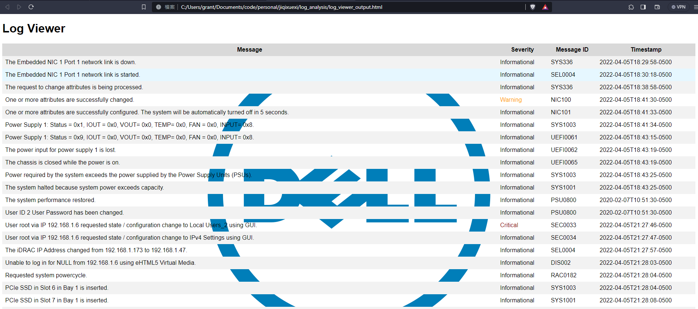
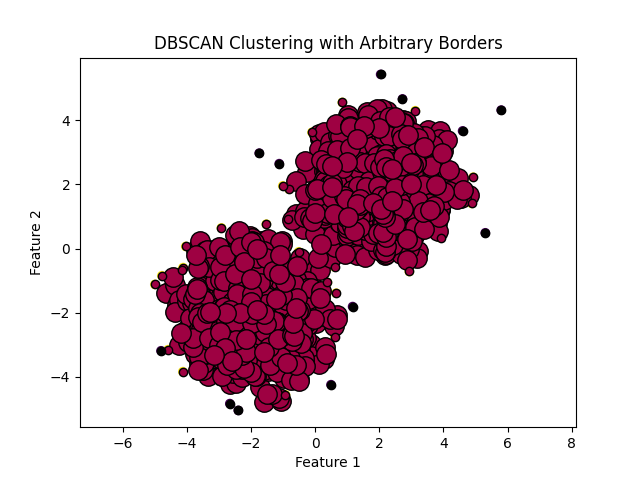
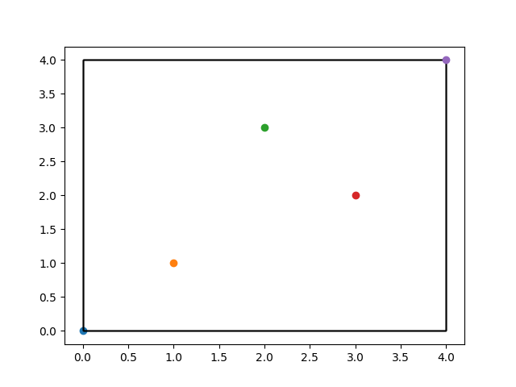
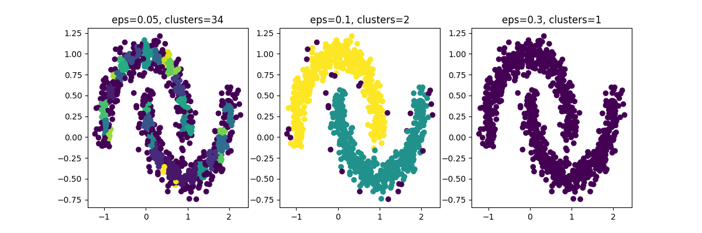
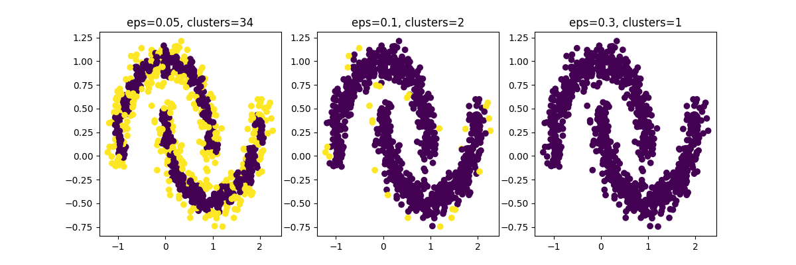
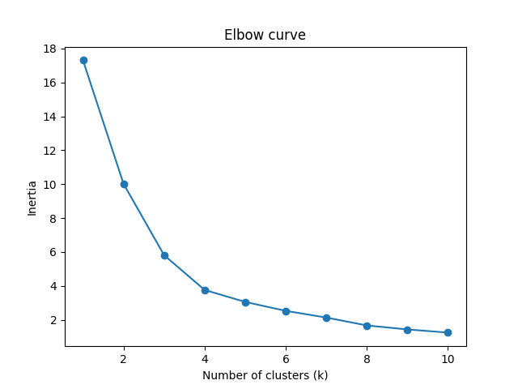
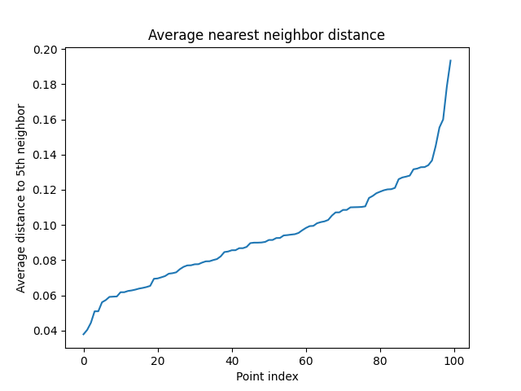
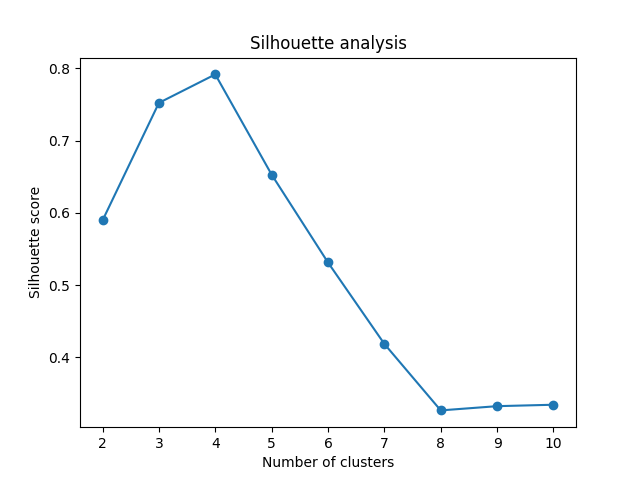
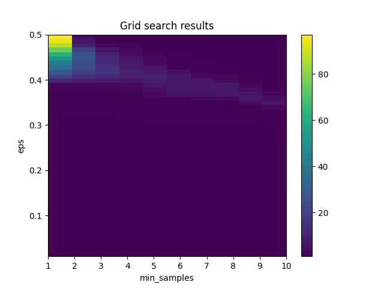
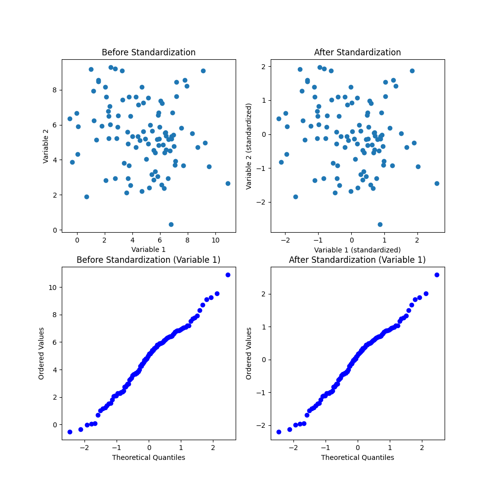

# Finding Rare Logs with DBSCAN

- [Finding Rare Logs with DBSCAN](#finding-rare-logs-with-dbscan)
  - [Prototype](#prototype)
  - [What is Density-Based Clustering?](#what-is-density-based-clustering)
    - [Density Drop Around Cluster Borders Visualized](#density-drop-around-cluster-borders-visualized)
    - [What is Parametric / Non-Parametric](#what-is-parametric--non-parametric)
    - [What is an R-Tree](#what-is-an-r-tree)
    - [R-Tree Visualized](#r-tree-visualized)
    - [What is mean shift?](#what-is-mean-shift)
  - [Synopsis of DBSCAN](#synopsis-of-dbscan)
  - [Synopsis of DBSCAN w/Text](#synopsis-of-dbscan-wtext)
  - [DBSCAN for Rare Logs Visualized](#dbscan-for-rare-logs-visualized)
      - [Why would rare logs be clustered?](#why-would-rare-logs-be-clustered)
      - [Example](#example)
  - [What is a hyperparameter?](#what-is-a-hyperparameter)
  - [What is Term Frequency-Inverse Document Frequency (TF-IDF)](#what-is-term-frequency-inverse-document-frequency-tf-idf)
    - [Why Logarithm](#why-logarithm)
    - [Key Points](#key-points)
    - [Example](#example-1)
    - [Visualize TF-IDF](#visualize-tf-idf)
  - [What is a core point?](#what-is-a-core-point)
    - [How are core points selected?](#how-are-core-points-selected)
  - [What is Epsilon?](#what-is-epsilon)
    - [Rare Logs w/Good Epsilon Visualized](#rare-logs-wgood-epsilon-visualized)
  - [How to Pick a Good Epsilon](#how-to-pick-a-good-epsilon)
    - [Elbow Method](#elbow-method)
      - [Elbow Method Visualized](#elbow-method-visualized)
      - [Why the Sum of Squared Distances](#why-the-sum-of-squared-distances)
      - [How to use the elbow curve](#how-to-use-the-elbow-curve)
      - [Problems with Elbow Method in DBSCAN](#problems-with-elbow-method-in-dbscan)
      - [How to Use the Elbow Curve for DBSCAN](#how-to-use-the-elbow-curve-for-dbscan)
      - [Example of Sum of Squared Distances](#example-of-sum-of-squared-distances)
    - [Average nearest neighbors](#average-nearest-neighbors)
      - [Average nearest neighbors visualized](#average-nearest-neighbors-visualized)
    - [Silhouette Score](#silhouette-score)
      - [Silhouette Score Math](#silhouette-score-math)
      - [Example](#example-2)
      - [Silhouette Score Visualized](#silhouette-score-visualized)
    - [Grid Search](#grid-search)
      - [Grid Search Visualized](#grid-search-visualized)
  - [How is the distance from a core point calculated?](#how-is-the-distance-from-a-core-point-calculated)
    - [Example](#example-3)
  - [How to Include Log Attributes that Aren't Message](#how-to-include-log-attributes-that-arent-message)
    - [Example of One Hot Encoding for Severity](#example-of-one-hot-encoding-for-severity)
  - [The Problem of New Documents](#the-problem-of-new-documents)
  - [Normalizing Data](#normalizing-data)
    - [How to Interpret a Q-Q Plot](#how-to-interpret-a-q-q-plot)
  - [General Approach w/Decision Tree](#general-approach-wdecision-tree)
    - [General Approach](#general-approach)
    - [Rare Log Detection](#rare-log-detection)


## Prototype

Output produced appears as below:



Code is available at [rare_log_finder.py](./rare_log_finder.py)

The report template is available at [report_template.html](./report_template.html)

## What is Density-Based Clustering?

In density-based clustering, clusters are defined as areas of higher density than the remainder of the data set. Objects in sparse areas – that are required to separate clusters – are usually considered to be noise and border points.

The most popular density based clustering method is DBSCAN. In contrast to many newer methods, it features a well-defined cluster model called "density-reachability". Similar to linkage based clustering, it is based on connecting points within certain distance thresholds. However, it only connects points that satisfy a density criterion, in the original variant defined as a minimum number of other objects within this radius. A cluster consists of all density-connected objects (which can form a cluster of an arbitrary shape, in contrast to many other methods) plus all objects that are within these objects' range. Another interesting property of DBSCAN is that its complexity is fairly low – it requires a linear number of range queries on the database – and that it will discover essentially the same results (it is deterministic for core and noise points, but not for border points) in each run, therefore there is no need to run it multiple times. OPTICS is a generalization of DBSCAN that removes the need to choose an appropriate value for the range parameter ε, and produces a hierarchical result related to that of linkage clustering. DeLi-Clu, Density-Link-Clustering combines ideas from single-linkage clustering and OPTICS, eliminating the ε parameter entirely and offering performance improvements over OPTICS by using an R-tree index.

The key drawback of DBSCAN and OPTICS is that they expect some kind of density drop to detect cluster borders. On data sets with, for example, overlapping Gaussian distributions – a common use case in artificial data – the cluster borders produced by these algorithms will often look arbitrary, because the cluster density decreases continuously. On a data set consisting of mixtures of Gaussians, these algorithms are nearly always outperformed by methods such as EM clustering that are able to precisely model this kind of data.

Mean-shift is a clustering approach where each object is moved to the densest area in its vicinity, based on kernel density estimation. Eventually, objects converge to local maxima of density. Similar to k-means clustering, these "density attractors" can serve as representatives for the data set, but mean-shift can detect arbitrary-shaped clusters similar to DBSCAN. Due to the expensive iterative procedure and density estimation, mean-shift is usually slower than DBSCAN or k-Means. Besides that, the applicability of the mean-shift algorithm to multidimensional data is hindered by the unsmooth behaviour of the kernel density estimate, which results in over-fragmentation of cluster tails.

### Density Drop Around Cluster Borders Visualized

See [this code](./DBSCAN_Visualization/arbitrary_borders.py)



### What is Parametric / Non-Parametric

Non-parametric refers to a type of statistical analysis or machine learning algorithm that does not assume a particular probability distribution for the data being analyzed. In contrast, parametric methods assume a specific distribution, such as a normal distribution or a Poisson distribution, for the underlying population. Non-parametric methods can be useful when the data do not follow a known distribution or when there is not enough information to assume a particular distribution. These methods include techniques such as rank-based tests, kernel density estimation, and decision trees.

### What is an R-Tree

An R-tree is a spatial index structure that is commonly used in spatial databases and geographic information systems (GIS). It is a tree data structure where each node represents a bounding box of a set of objects in the spatial domain, and the child nodes represent subdivisions of the bounding box. The R-tree is optimized for efficient search and retrieval of spatial objects, by organizing them hierarchically based on their spatial relationships. The R-tree is particularly useful for performing spatial queries such as nearest neighbor search, range search, and spatial join. It is commonly used in applications such as location-based services, geographic information systems, and image retrieval.

### R-Tree Visualized



In the code I provided for R-tree visualization, the 5 points represent the objects that are inserted into the R-tree index. These objects are represented as rectangles in the final visualization, with the position and size of each rectangle determined by the R-tree index structure. The points are randomly generated in this example, but in practice they could represent any spatial data such as geographic locations or sensor readings.

### What is mean shift?

Mean shift is a non-parametric clustering algorithm that seeks to find the modes or high-density areas in a dataset. In the context of clustering, a mode can be thought of as a cluster center or a representative of a group of similar data points. The algorithm works by iteratively shifting a window or kernel towards the highest density region in the dataset, thereby merging nearby data points until convergence is reached. The final position of each kernel represents the cluster centers, and each data point is assigned to the nearest kernel. Mean shift can be applied to datasets of any dimensionality and is particularly effective at identifying clusters with arbitrary shapes.

## Synopsis of DBSCAN

Here are the basic steps to get started with DBSCAN:

1. Choose the distance metric: DBSCAN requires a distance metric to measure the similarity between data points. For text data, you might consider using a cosine similarity metric, which measures the cosine of the angle between two vectors in high-dimensional space. This metric is often used for text data because it is based on the frequency of words in each document and can handle high-dimensional data well.

2. Choose the neighborhood radius and minimum points: DBSCAN requires two parameters: the neighborhood radius (epsilon) and the minimum number of points required to form a dense region (minPts). The neighborhood radius determines the size of the neighborhood around each point, and minPts determines how many points must be in the neighborhood for a point to be considered part of a dense region.

3. Compute the distance matrix: Use the chosen distance metric to compute a distance matrix between all pairs of data points.

4. Identify core points: A core point is a data point that has at least minPts other points within its neighborhood. Identify all core points in the data.

5. Identify non-core points: A non-core point is a point that is not a core point, but is within the neighborhood of a core point. Identify all non-core points in the data.

6. Form clusters: For each core point, form a cluster by including all other core points and non-core points that are within its neighborhood. Repeat this process for all core points until all points are assigned to a cluster.

7. Identify noise points: Any points that are not assigned to a cluster are considered noise points.

8. Determine optimal parameters: Experiment with different values for epsilon and minPts to find the optimal parameters for your data.

Overall, DBSCAN is a relatively simple algorithm to implement, but choosing the right distance metric and setting the optimal parameters can be challenging. Experimentation and iteration are key to finding the best parameters for your particular dataset.

## Synopsis of DBSCAN w/Text

Step 1: Import the dataset and preprocess the data
Assuming that the dataset is a collection of text documents, we will import the dataset into our code and preprocess the data to prepare it for clustering. This may involve removing stop words, stemming or lemmatizing the text, and converting the text to numerical vectors using techniques such as TF-IDF. For this example, let's assume that the data has already been preprocessed and is stored in a Pandas DataFrame called documents_df.

Step 2: Choose the epsilon and min_samples hyperparameters
As before, we need to choose the epsilon and min_samples hyperparameters. The choice of hyperparameters will depend on the specific dataset and the desired level of granularity in the clusters. Let's say we choose epsilon = 0.3 and min_samples = 5 for this example.

Step 3: Calculate the distance matrix
We will now calculate the distance matrix between all pairs of documents in the dataset. We will use a cosine distance as the distance metric since we are dealing with text data. The distance matrix is a square matrix where each element (i,j) is the distance between document i and document j.

Let's assume that we have already calculated the distance matrix and stored it in a NumPy array called dist_matrix.

Step 4: Identify core points
Next, we will identify the core points in the dataset. A point is a core point if it has at least min_samples other points within a distance of epsilon. We can identify core points by counting the number of points within epsilon distance of each point and checking if it is greater than or equal to min_samples.

Let's store the indices of the core points in a list called core_indices.

Step 5: Identify border points and noise points
We will now identify the border points and noise points. A border point is a point that is not a core point but is within epsilon distance of at least one core point. A noise point is a point that is not a core point and is not within epsilon distance of any core point.

We can identify border points and noise points by iterating over all points and checking if they are in core_indices. If a point is not a core point, we can then check if it is within epsilon distance of any core point. If it is, it is a border point; if not, it is a noise point.

Let's store the indices of the border points in a list called border_indices and the indices of the noise points in a list called noise_indices.

Step 6: Create clusters
We will now create the clusters. We will start with an empty list of clusters and iterate over the core points. For each core point, we will check if it has not already been assigned to a cluster. If it has not, we will create a new cluster and add the core point to it. We will then add all border points that are within epsilon distance of the core point to the cluster. We will then repeat this process for all new core points added to the cluster until there are no more points to add.

Let's store the clusters in a list called clusters.

Step 7: Visualize the clusters
Finally, we can visualize the clusters by examining the documents in each cluster and identifying common themes or topics. We can also use techniques such as word clouds or topic modeling to gain insights into the clusters.

Let's assume that we have already performed some exploratory analysis on the clusters and identified common themes or topics in each cluster. We can then present these findings in a report or dashboard for further analysis or action.

## DBSCAN for Rare Logs Visualized


#### Why would rare logs be clustered?

**NOTE** They don't have to be clustered together. See [Rare Logs w/Good Epsilon Visualized](#rare-logs-wgood-epsilon-visualized) for an example of what non-clustered rare logs look like.

DBSCAN identifies clusters by finding regions of high point density in the feature space. Rare points can be clustered together if they are located in regions of low point density, and if the distance metric used by DBSCAN captures the similarity between these points.

For example, if the rare points share certain characteristics or patterns in the feature space that distinguish them from other points, then DBSCAN may identify these points as a separate cluster. Additionally, rare points may be clustered together if they are located in a region of the feature space that is otherwise sparsely populated, and DBSCAN identifies this region as a cluster due to its low point density.

In both cases, it is important to carefully choose the distance metric and parameter values for DBSCAN in order to identify clusters that correspond to rare events. Additionally, further analysis may be needed to understand the properties and potential causes of the identified rare events.

#### Example

An example of rare log features that could distinguish them from regular logs but cause the rare logs themselves to be similar could be a sudden increase or decrease in the magnitude of certain log features such as network traffic, user activity, or system performance. For instance, in the case of network traffic logs, a rare event could be a sudden spike in the number of failed connection attempts, which would cause the affected logs to have similar patterns of failed connection attempts. However, these rare logs would still be distinguishable from regular logs due to their significantly higher frequency of failed connection attempts.

## What is a hyperparameter?

In machine learning, a hyperparameter is a configuration parameter that is set before training a model and affects the behavior and performance of the model. Hyperparameters are different from the model parameters, which are learned during training.

Hyperparameters are set by the user or a tuning algorithm before the training process begins. Examples of hyperparameters include learning rate, regularization strength, batch size, number of hidden layers, and number of neurons per layer in a neural network.

The values of hyperparameters can have a significant impact on the performance of a model. Therefore, selecting appropriate hyperparameters is an important step in building a successful machine learning model. Typically, hyperparameters are chosen based on a combination of domain expertise, intuition, and empirical experimentation.

## What is Term Frequency-Inverse Document Frequency (TF-IDF)

TF-IDF stands for "Term Frequency-Inverse Document Frequency". It is a technique used to convert a collection of text documents into a numerical vector representation that can be used for machine learning algorithms such as clustering, classification, or recommendation systems.

The basic idea behind TF-IDF is to weigh the importance of each word in a document by considering how often it appears in the document (term frequency) and how common or rare the word is across all documents in the dataset (inverse document frequency).

The term frequency (TF) of a word in a document is simply the number of times the word appears in the document. However, this does not take into account the fact that some words may be more important than others even if they appear frequently. For example, in a document about cats, the word "cat" may appear frequently but the word "whiskers" may be more informative or distinctive.

The inverse document frequency (IDF) of a word is a measure of how rare or common the word is across all documents in the dataset. It is calculated as the logarithm of the total number of documents in the dataset divided by the number of documents that contain the word.

The TF-IDF score for a word in a document is simply the product of its term frequency and inverse document frequency. Words that appear frequently in a document but are rare across all documents in the dataset will have a high TF-IDF score and are likely to be more informative or distinctive.

After calculating the TF-IDF scores for all words in all documents, we can represent each document as a numerical vector where each element of the vector represents the TF-IDF score of a particular word in the document. These vectors can then be used as input to machine learning algorithms for tasks such as clustering, classification, or recommendation systems.

### Why Logarithm

We use logarithm in the IDF calculation of TF-IDF because the frequency distribution of words in a corpus typically follows a power law or Zipf's law, where a few words occur very frequently and most words occur rarely.

For example, in a large corpus of English text, the word "the" is likely to occur very frequently while the word "zygote" may occur very rarely. Without logarithm, the IDF value for common words like "the" may become very small or even zero, which would lead to a distortion of the TF-IDF weights.

Taking the logarithm of the IDF value helps to dampen the effect of the high frequency of common words and amplify the effect of the low frequency of rare words. It also helps to reduce the range of IDF values and make them more comparable across words.

By using logarithm, we can obtain a more accurate and meaningful measure of the rarity or commonality of each word across the entire corpus, which can be used to weight the importance of each word in a document.

Logarithm dampens the effect of common words because it compresses the range of IDF values. As the number of documents containing a given word increases, the IDF value decreases, and the rate of decrease slows down. By taking the logarithm of the IDF value, we can reduce the magnitude of this effect, effectively "flattening" the curve and reducing the range of IDF values.

For example, let's say we have a corpus of 1000 documents and the word "the" appears in all 1000 documents. The IDF value for "the" would be log(1000/1000) = log(1) = 0. Now let's consider a less common word like "zygote" that appears in only 1 document. The IDF value for "zygote" would be log(1000/1) = log(1000) = 3. By taking the logarithm, we have compressed the range of IDF values from 3 orders of magnitude to just 1.

This compression of the IDF values has the effect of reducing the weight of common words like "the" and increasing the weight of rare words like "zygote". This is desirable because common words tend to be less informative than rare words and may not be as useful for distinguishing between different documents or topics. By dampening the effect of common words, we can focus more attention on the rare words that are more likely to be distinctive or informative.

### Key Points

- In the context of IDF calculation, the log is used to scale down the importance of words that appear in many documents in the corpus. When a word appears in all documents, the IDF score will be 0 because log of 1 is 0. This reflects the idea that a word that appears in all documents is not very informative or useful for distinguishing between documents, and therefore should not be given a high weighting in a text analysis. The IDF term is 

$$IDF(t) = log \frac{N}{n_t}$$

### Example

**This is the general idea but ChatGPT's math was off**

Let $D_1$ to $D_{10}$ be a corpus of 10 documents and let $TF(d, t)$ be the term frequency of term $t$ in document $d$. The inverse document frequency of term $t$, $IDF(t)$, is defined as:

$$IDF(t) = log \frac{N}{n_t}$$

where $N$ is the total number of documents in the corpus and $n_t$ is the number of documents that contain term $t$. The TF-IDF score of term $t$ in document $d$, $TFIDF(d, t)$, is defined as:

$$TFIDF(d, t) = TF(d, t) \times IDF(t)$$

Let's say we want to calculate the TF-IDF score for the word "cat" in each document. Here are the 10 documents in our corpus:

- Document 1: "The cat in the hat."
- Document 2: "The cat and the dog."
- Document 3: "The dog chased the cat."
- Document 4: "The cat sat on the mat."
- Document 5: "The dog and the cat played."
- Document 6: "The cat and the mouse."
- Document 7: "The cat was hungry."
- Document 8: "The cat slept all day."
- Document 9: "The cat and the bird."
- Document 10: "The cat is black."

We can calculate the TF-IDF score for "cat" in each document as follows:

- TF("cat", $D_1$) = 1/5 = 0.2
- TF("cat", $D_2$) = 1/5 = 0.2
- TF("cat", $D_3$) = 1/5 = 0.2
- TF("cat", $D_4$) = 1/6 = 0.1667
- TF("cat", $D_5$) = 1/5 = 0.2
- TF("cat", $D_6$) = 1/4 = 0.25
- TF("cat", $D_7$) = 1/4 = 0.25
- TF("cat", $D_8$) = 1/4 = 0.25
- TF("cat", $D_9$) = 1/4 = 0.25
- TF("cat", $D_{10}$) = 1/4 = 0.25

Number of documents containing "cat": 9

IDF("cat") = log(10/9) = 0.1054

- TFIDF($D_1$, "cat") = 0.2 * 0.1054 = 0.0211
- TFIDF($D_2$, "cat") = 0.2 * 0.1054 = 0.0211
- TFIDF($D_3$, "cat") = 0.2 * 0.1054 = 0.0211
- TFIDF($D_4$, "cat") = 0.1667 * 0.1054 = 0.0175
- TFIDF($D_5$, "cat") = 0.2 * 0.1054 = 0.0211
- TFIDF($D_6$, "cat") = 0.25 * 0.1054 = 0.0264
- TFIDF($D_7$, "cat") = 0.25 * 0.1054 = 0.0264
- TFIDF($D_8$, "cat") = 0.25 * 0.1054 = 0.0264
- TFIDF($D_9$, "cat") = 0.25 * 0.1054 = 0.0264
- TFIDF($D_{10}$, "cat") = 0.25 * 0.1054 = 0.0264

So, the TF-IDF score of "cat" in each document is as follows:

- Document 1: 0.0211
- Document 2: 0.0211
- Document 3: 0.0211
- Document 4: 0.0175
- Document 5: 0.0211
- Document 6: 0.0264
- Document 7: 0.0264
- Document 8: 0.0264
- Document 9: 0.0264
- Document 10: 0.0264

### Visualize TF-IDF


The heatmap chart shows the TF-IDF score for each word in each document in the corpus. The color of each cell indicates the relative TF-IDF score of the corresponding word in the corresponding document.

The darker red cells represent words that have higher TF-IDF scores, which means they are more important in the corresponding documents. Conversely, the lighter blue cells represent words that have lower TF-IDF scores, which means they are less important in the corresponding documents.

For example, in document 1 ("The cat in the hat."), the word "cat" has a relatively high TF-IDF score, which is why its cell is darker red compared to other cells in the same row. In contrast, the word "the" has a relatively low TF-IDF score in most documents, which is why its cells are lighter blue compared to other cells in the same column.

Overall, the heatmap can give you a sense of the most important words in each document and across the corpus as a whole.

## What is a core point?

In DBSCAN, a core point is a data point that has at least min_samples other data points within a distance of eps. In other words, a core point is a point that is at the center of a dense region of the dataset.

More formally, a data point p is a core point if and only if there exist at least min_samples data points (including p itself) within a distance of eps of p. This means that a core point has at least min_samples neighboring data points within a radius of eps.

Core points are important in the DBSCAN algorithm because they define the centers of clusters. Any data points that are not core points themselves but are within a distance of eps of a core point are considered to be part of the same cluster as that core point. This means that the clusters in the dataset are defined by the core points and the density of the data around them.

### How are core points selected?

Core points are selected based on the value of the hyperparameters epsilon and min_samples.

A core point is defined as a data point that has at least min_samples other data points within a distance of epsilon (i.e., the distance between any pair of core points must be less than or equal to epsilon).

In other words, if a data point has at least min_samples other data points within a distance of epsilon, then it is a core point. Otherwise, it is not a core point.

Note that the hyperparameters epsilon and min_samples are typically set based on domain knowledge or by using trial and error to determine the best values for a given dataset. The choice of hyperparameters will depend on the specific dataset and the desired level of granularity in the clusters.

## What is Epsilon?

In the context of the DBSCAN algorithm, epsilon is a hyperparameter that defines the maximum distance between two data points in order for them to be considered part of the same cluster. Specifically, a data point is considered a core point if it has at least min_samples data points within a distance of epsilon from it. If a data point is not a core point but is within epsilon distance of a core point, it is considered a border point. Data points that are not core points or border points are considered noise points and are not part of any cluster.

Choosing an appropriate value for epsilon depends on the density of the data and the desired level of granularity in the clusters. A small epsilon will result in dense clusters with more noise points, while a large epsilon will result in fewer, more spread-out clusters with fewer noise points. The choice of epsilon should be guided by domain knowledge and empirical experimentation.



See [this code](DBSCAN_Visualization/visualize_epsilon.py)

### Rare Logs w/Good Epsilon Visualized



You can see in chart 2 how only a few points are highlighted - these would be our rare logs.

## How to Pick a Good Epsilon

There are several approaches you can use to determine a good epsilon for your data:
- Visual inspection: Plot a k-distance graph and visually inspect it to find the elbow point, which represents a good estimate of epsilon.
- Average nearest neighbors: Plot the average distance to the k-nearest neighbors for each point and select the point with the highest change in distance as the estimate of epsilon.
- Silhouette score: Calculate the silhouette score for different values of epsilon and select the value that maximizes the silhouette score.
  - Also often used as a tool for comparing different clustering algorithms or parameter settings to determine which produces the most well-defined clusters.
- Grid search: Use a grid search approach to test different values of epsilon and select the value that results in the best clustering performance.

### Elbow Method

#### Elbow Method Visualized



**Why is it called inertia?**: In the elbow method, we are interested in minimizing the within-cluster sum of squares (also called the cluster inertia or simply inertia) as the number of clusters increases. This is because as the number of clusters increases, we can expect the inertia to decrease since the data is being divided into more and more smaller subsets. The y-axis was labeled as "inertia" since it represents the within-cluster sum of squares, which we are trying to minimize.

See [this code](DBSCAN_Visualization/elbow_method_kmeans.py)

**NOTE** This code shows the elbow method for k means rather than DBSCAN see the problem with that in [Problems with Elbow Method in DBSCAN](#problems-with-elbow-method-in-dbscan)

The elbow method helps to determine the optimal number of clusters for a given dataset. The graph typically shows the number of clusters on the x-axis and the sum of squared distances (SSE) on the y-axis.

The SSE measures how far the points within a cluster are from the center of the cluster. The goal is to minimize the SSE, which indicates that the points within each cluster are close together and well-separated from points in other clusters.

In the graph, you want to look for the "elbow" point, which is the point of inflection where the SSE starts to level off or decrease at a slower rate. This point represents the optimal number of clusters for the given dataset.

In the example graph above, the elbow point appears to be around 3 or 4 clusters, since adding more clusters beyond this point doesn't result in significant reduction of the SSE. However, the choice of the optimal number of clusters ultimately depends on the specific problem and the context of the data.

#### Why the Sum of Squared Distances

The sum of squared distances is helpful in clustering because it provides a way to measure how similar or dissimilar the points within a cluster are. If the sum of squared distances within a cluster is small, it suggests that the points in that cluster are tightly grouped together and similar to one another. On the other hand, if the sum of squared distances within a cluster is large, it suggests that the points in that cluster are more spread out and dissimilar to one another. Therefore, the sum of squared distances can help us to identify the optimal number of clusters by evaluating how well the data fits the given number of clusters. The goal is to find the smallest number of clusters that results in a low sum of squared distances within each cluster, while also avoiding overfitting the data.

#### How to use the elbow curve

The optimal number of clusters can be determined by looking at the elbow point on the curve. The elbow point is the point where the inertia starts to decrease at a slower rate. This point represents the trade-off between minimizing the sum of squared distances within each cluster and maximizing the number of clusters. In general, the elbow point represents the optimal number of clusters to use for the given data set. However, sometimes the elbow point may not be clearly defined or there may be multiple elbow points, in which case other methods such as silhouette analysis may be used to determine the optimal number of clusters.

#### Problems with Elbow Method in DBSCAN

One thing to note is that unlike KMeans, DBSCAN doesn't have a fixed number of clusters. So the elbow curve for DBSCAN may not have a clear "elbow" point like in the KMeans case. Instead, you may have to manually examine the plot and choose a reasonable value of eps based on the trade-off between the number of clusters and the amount of data within each cluster.

#### How to Use the Elbow Curve for DBSCAN


See [this code](DBSCAN_Visualization/elbow_method_dbscan.py)

So in the chart above we can see the inertia jumps up until right before .1. Which means we probably want to aim for something like 6 clusters with an epsilon of like .7 and an inertia of ~7.5.

#### Example of Sum of Squared Distances

- (1, 2)
- (3, 4)
- (5, 6)

We want to calculate the sum of squared distances for a cluster of two points. We randomly assign the first two points to the cluster and calculate the distance between each point and the centroid:

Cluster 1:
- (1, 2) -> distance to centroid (2, 3) = sqrt((1-2)^2 + (2-3)^2) = sqrt(2)
- (3, 4) -> distance to centroid (2, 3) = sqrt((3-2)^2 + (4-3)^2) = sqrt(2)
- Sum of squared distances = (sqrt(2))^2 + (sqrt(2))^2 = 4

Next, we calculate the sum of squared distances for a cluster of the other two points:

Cluster 2:
- (3, 4) -> distance to centroid (3, 5) = sqrt((3-3)^2 + (4-5)^2) = 1
- (5, 6) -> distance to centroid (3, 5) = sqrt((5-3)^2 + (6-5)^2) = sqrt(5)
- Sum of squared distances = 1^2 + (sqrt(5))^2 = 6

We can see that the sum of squared distances for cluster 1 is 4, and the sum of squared distances for cluster 2 is 6. In this case, cluster 1 is the better choice since it has a lower sum of squared distances.

### Average nearest neighbors

The average nearest neighbors (ANN) algorithm is a method for estimating the optimal value of the epsilon parameter in DBSCAN clustering.

The idea behind ANN is to plot the distances between each data point and its kth nearest neighbor. The plot is then sorted in increasing order of distances, and the elbow point is identified as the point where the curve starts to level off, indicating a natural break in the distances.

To use ANN to estimate the optimal epsilon value, one needs to choose a value for k, which is typically set to 4 or 5. The kth nearest neighbor can be found using a k-d tree or brute force search, and the distances can be sorted using a quicksort or similar algorithm.

Once the distances are sorted, the elbow point can be identified by visual inspection or by fitting a curve to the data using a regression algorithm. The value of epsilon corresponding to the elbow point is then used as the input to the DBSCAN algorithm.

The advantage of the ANN algorithm is that it can be applied to high-dimensional data and is relatively insensitive to the choice of k. However, it requires additional computation to find the kth nearest neighbor for each data point, which can be time-consuming for large datasets.

#### Average nearest neighbors visualized



See [this code](DBSCAN_Visualization/average_nearest_neighbor.py)

This code generates 100 random points and computes the distances to the 5th nearest neighbor for each point. It then sorts the average distances and plots them against the point index (just the index of the point in an array of 100). The resulting plot shows how the average nearest neighbor distance varies across the points.

We would want a value around .14 right before the average distance rapidly ascends.

### Silhouette Score

The Silhouette score is a measure of how well a data point fits into its assigned cluster in unsupervised learning algorithms such as clustering. It is calculated using the mean intra-cluster distance (a) and the mean nearest-cluster distance (b) for each data point, and ranges from -1 to 1.

A Silhouette score of 1 indicates that the data point is well-matched to its own cluster and poorly-matched to neighboring clusters, while a score of -1 indicates the opposite. A score of 0 indicates that the data point is on the boundary between two clusters.

The Silhouette score can be used to evaluate the quality of a clustering algorithm and to determine the optimal number of clusters. A higher Silhouette score indicates better clustering, and the optimal number of clusters can be determined by selecting the number of clusters that maximizes the Silhouette score.

#### Silhouette Score Math

The silhouette score measures how similar an object is to its own cluster (cohesion) compared to other clusters (separation).

The formula for silhouette score is as follows:

$s(i) = \frac{b(i) - a(i)}{\max{a(i), b(i)}}$

where $i$ is an individual data point, $a(i)$ is the average distance between $i$ and all other data points in the same cluster, and $b(i)$ is the minimum average distance between $i$ and all data points in any other cluster.

The silhouette score ranges from -1 to 1, with a score of 1 indicating that the point is well-matched to its own cluster and poorly-matched to neighboring clusters, a score of 0 indicating that the point is equally similar to its own cluster and neighboring clusters, and a score of -1 indicating that the point is poorly-matched to its own cluster and well-matched to neighboring clusters.

#### Example

Sure, let's say we have a dataset with four data points, labeled A, B, C, and D. We have performed clustering using some clustering algorithm, and let's say that points A and B belong to cluster 1, while points C and D belong to cluster 2. We can calculate the silhouette score for each point as follows:

**For point A:**

- Compute the average distance from point A to all other points in cluster 1. Let's call this value a = 0.4.
- Compute the average distance from point A to all points in the closest other cluster, cluster 2. Let's call this value b = 0.6.
- The silhouette score for point A is then $(b - a) / max(a, b) = (0.6 - 0.4) / 0.6 = 0.33$.

**For point B:**

- Compute the average distance from point B to all other points in cluster 1. Let's call this value a = 0.2.
- Compute the average distance from point B to all points in the closest other cluster, cluster 2. Let's call this value b = 0.8.
- The silhouette score for point B is then $(b - a) / max(a, b) = (0.8 - 0.2) / 0.8 = 0.75$.

**For point C:**

- Compute the average distance from point C to all other points in cluster 2. Let's call this value a = 0.3.
- Compute the average distance from point C to all points in the closest other cluster, cluster 1. Let's call this value b = 0.9.
- The silhouette score for point C is then $(b - a) / max(a, b) = (0.9 - 0.3) / 0.9 = 0.67$.

**For point D:**

- Compute the average distance from point D to all other points in cluster 2. Let's call this value a = 0.5.
- Compute the average distance from point D to all points in the closest other cluster, cluster 1. Let's call this value b = 0.7.
- The silhouette score for point D is then $(b - a) / max(a, b) = (0.7 - 0.5) / 0.7 = 0.29$.

The overall silhouette score for this clustering is the average of the silhouette scores for all points, which in this case is $(0.33 + 0.75 + 0.67 + 0.29) / 4 = 0.51$.

#### Silhouette Score Visualized



See [this code](DBSCAN_Visualization/silhouette_score.py)

### Grid Search

Grid search is a hyperparameter tuning technique in machine learning where a model is trained on various combinations of hyperparameters to find the optimal set of hyperparameters that yields the best performance for a specific evaluation metric.

In grid search, the model is trained and evaluated on all possible combinations of hyperparameters within a predefined range or grid. This is done by creating a grid of hyperparameters, where each hyperparameter is assigned a set of values to try. The model is then trained and evaluated using each combination of hyperparameters in the grid. The combination of hyperparameters that yields the best evaluation metric is then chosen as the optimal set of hyperparameters for the model.

Grid search is often used when there are a limited number of hyperparameters to tune, as it can be computationally expensive when the number of hyperparameters or the range of values for each hyperparameter is large.

#### Grid Search Visualized



See [this code](DBSCAN_Visualization/grid_search_visualization.py)

The chart shows the results of a grid search over a range of values for two hyperparameters of the DBSCAN clustering algorithm: eps (which controls the maximum distance between points in the same cluster) and min_samples (which controls the minimum number of points required to form a dense region).

The x-axis of the chart shows the values of min_samples tested in the grid search, and the y-axis shows the values of eps tested in the grid search. The color of each cell in the chart represents the number of clusters found by DBSCAN for that combination of eps and min_samples. Darker colors indicate a higher number of clusters, while lighter colors indicate fewer clusters.

The chart can be used to identify the combination of eps and min_samples that yields the best clustering results for the particular dataset being analyzed. For example, if the goal is to find a small number of well-defined clusters, the optimal combination of eps and min_samples might be found in a region of the chart with light colors. Conversely, if the goal is to find a larger number of clusters, a region of the chart with darker colors might be more suitable.

## How is the distance from a core point calculated?

The distance between two data points in DBSCAN is typically calculated using a distance metric such as Euclidean distance or Manhattan distance. These distance metrics measure the distance between two points in n-dimensional space, where n is the number of features or dimensions in the dataset.

For example, if we have a dataset with two features (i.e., two-dimensional data), the Euclidean distance between two data points p and q is calculated as:

$$distance(p, q) = \sqrt{(p_1 - q_1)^2 + (p_2 - q_2)^2}$$

where $p_1$ and $q_1$ are the values of the first feature in $p$ and $q$, and $p_2$ and $q_2$ are the values of the second feature in $p$ and $q$.

Manhattan distance is another common distance metric used in DBSCAN. Manhattan distance measures the distance between two points by summing the absolute differences of their coordinates. For example, the Manhattan distance between two data points p and q with two features is calculated as:

$$distance(p, q) = |p_1 - q_1| + |p_2 - q_2|$$

where $p_1$ and $q_1$ are the values of the first feature in $p$ and $q$, and $p_2$ and $q_2$ are the values of the second feature in $p$ and $q$.

DBSCAN is flexible enough to allow different distance metrics to be used depending on the nature of the data and the problem being solved.

### Example

Certainly! Let's say we have a dataset with two features, "age" and "income", and we want to calculate the distance between two data points, $p$ and $q$. Here are the values of these two features for $p$ and $q$:

$p = (30, 50000)$

$q = (35, 60000)$

We can calculate the Euclidean distance between $p$ and $q$ as follows:

$$distance(p, q) = \sqrt{(p_1 - q_1)^2 + (p_2 - q_2)^2}$$ 

(based on Pythagoreans Theorem)

where $p_1$ and $q_1$ are the values of the "age" feature in $p$ and $q$, and $p_2$ and $q_2$ are the values of the "income" feature in $p$ and $q$.

Substituting the values of $p$ and $q$, we get:

$$distance(p, q) = \sqrt{(30 - 35)^2 + (50000 - 60000)^2} = \sqrt{25^2 + 10000^2} \approx 10000.25$$

So the Euclidean distance between $p$ and $q$ is approximately 10000.25.

**Why $$distance(p, q) = \sqrt{(p_1 - q_1)^2 + (p_2 - q_2)^2}$$**

The distance formula is derived from the Pythagorean theorem, which states that the square of the hypotenuse of a right triangle is equal to the sum of the squares of the other two sides. In this case, the sides of the triangle are the horizontal and vertical distances between the two points, and the hypotenuse is the straight line distance between them. The formula uses the square root of the sum of the squares of the horizontal and vertical distances to find the length of the hypotenuse, which is the Euclidean distance between the two points. This formula can be extended to higher dimensions by adding the squares of the differences in each dimension and taking the square root of the sum.

## How to Include Log Attributes that Aren't Message

The problem with the above is that TF-IDF accounts for the message field but not how to combine it with other log attributes. To combine additional fields with the text data represented by TF-IDF, you can concatenate the TF-IDF vectors with vectors representing the additional fields. These additional fields can be transformed into numerical representations that are appropriate for clustering using methods such as one-hot encoding or normalization. Then, the resulting vectors can be used as input to the clustering algorithm, allowing you to perform rare log detection based on multiple features.

For example, let's say you have a set of log messages and two additional fields: "source" and "severity". To combine these fields with the text data, you could create a new vector for each log message that contains the TF-IDF representation of the message text, the one-hot encoded representation of the source field, and the normalized representation of the severity field. These vectors could then be used as input to DBSCAN or other clustering algorithms to identify clusters of logs with low point density, which may correspond to rare events.

### Example of One Hot Encoding for Severity

Suppose we have a log entry with the following fields:

```json
{
    "timestamp": "2022-04-12T10:15:30",
    "severity": "warning",
    "message": "Disk usage is high on /dev/sda1"
}
```

To encode this log entry using a combination of one-hot encoding and TF-IDF, we can follow these steps:

One-hot encode the severity field. Suppose we have three possible values for the severity field: "informational", "warning", and "error". We can create a one-hot encoding vector for the severity field as follows:

```json
{
    "informational": [1, 0, 0],
    "warning": [0, 1, 0],
    "error": [0, 0, 1]
}
```

For this log entry, the one-hot encoding vector for the severity field would be $[0, 1, 0]$, since the severity is "warning".

Apply TF-IDF encoding to the message field. Suppose we have a vocabulary of 10,000 unique words that appear in our log messages. We can create a TF-IDF vector for the message field as follows:

1. Tokenize the message field into a list of words. In this case, the message field would be tokenized into the list ["disk", "usage", "is", "high", "on", "/dev/sda1"].

2. Calculate the TF-IDF score for each word in the message field using the following formula:

$tf-idf(w, d, D) = tf(w, d) * idf(w, D)$

where $tf(w, d)$ is the frequency of the word $w$ in the document $d$, and $idf(w, D)$ is the inverse document frequency of the word $w$ in the set of all documents $D$. The inverse document frequency can be calculated as follows:

$idf(w, D) = log(N / (1 + df(w, D)))$

where $N$ is the total number of documents in the corpus, and $df(w, D)$ is the number of documents in the corpus that contain the word $w$.

3. For each word in the message field, multiply its TF-IDF score by the one-hot encoding vector for the severity field to create a combined feature vector. For example, suppose the TF-IDF scores for the words in the message field are as follows:

```json
{
    "disk": 0.1,
    "usage": 0.05,
    "is": 0.02,
    "high": 0.15,
    "on": 0.03,
    "/dev/sda1": 0.08
}
```

The combined feature vector for this log entry would be (in a real case it would be as long as the corpus of words in all documents):

```csharp
[0, 1, 0, 0.01, 0.005, 0.002, 0.015, 0.03, 0.008]
```

The first three elements of the vector represent the one-hot encoding for the severity field, and the remaining elements represent the TF-IDF scores for the words in the message field.

By using one-hot encoding for categorical fields and TF-IDF encoding for text fields, we can create a single feature vector that captures information from multiple fields in a log entry.

## The Problem of New Documents

If a new document is added to the corpus that contains words not seen in the original vocabulary, then the TF-IDF vectors for all other documents in the corpus would need to be recomputed to include the new term in their vector representations. This can be computationally expensive, especially for large corpora with many documents. One way to mitigate this issue is to use incremental learning algorithms that can update the existing vector representations with new data without recomputing everything from scratch. Another approach is to periodically retrain the model on the entire corpus, which can be time-consuming but ensures that the vector representations are up-to-date.

To incrementally update the feature vectors when new documents are added to the corpus, you would need to update the inverse document frequency (idf) values for each word in the vocabulary.

Suppose you have a current corpus of N documents, and you add a new document to the corpus. You would first update the idf values for each word in the vocabulary using the new document. Then, for each existing document in the corpus, you would update the tf-idf scores for any words in the new document that also appear in the existing document.

This incremental update can be more efficient than recalculating the tf-idf scores for all documents in the corpus every time a new document is added, especially if the corpus is large.

## Normalizing Data

The problem is that some of the data is going to have very large magnitude and we have to normalize it before feeding it into the algorithm. Ex: the time epoch is very large relative to everything else.



1. Scatter plot of data before standardization: This plot shows the distribution of the data in its original scale. The two variables have different means and variances, and the scale of the variables are not the same. There is a clear positive correlation between the two variables, indicating that when one variable is high, the other variable is likely to be high as well.

2. Scatter plot of data after standardization: This plot shows the same data as the first plot, but after applying standardization using StandardScaler. The data is now centered around the origin (0, 0), and the scale of the two variables are now the same. The correlation between the two variables is still present.

3. Q-Q plot of variable 1 before standardization: This plot shows the distribution of the first variable before standardization. The blue points represent the ordered values of the variable, and the red line represents the theoretical quantiles of a normal distribution. If the distribution of the variable was perfectly normal, the points would lie on the red line. However, we can see that the distribution deviates from normality, as indicated by the non-linear shape of the Q-Q plot.

4. Q-Q plot of variable 1 after standardization: This plot shows the same variable as in the third plot, but after applying standardization. The data is now distributed closer to normal, as indicated by the straight line in the Q-Q plot. This means that the standardization process has reduced the deviation from normality in the distribution of this variable.

Overall, the scatter plots show the relationship between the two variables and how standardization can bring them onto the same scale. The Q-Q plots show how standardization can improve the normality of the distribution of a variable.

### How to Interpret a Q-Q Plot

A Q-Q plot (quantile-quantile plot) is a graphical technique used to compare the distribution of a sample of data to a theoretical probability distribution. It is a commonly used diagnostic tool in statistics to assess whether a sample of data comes from a certain distribution, such as a normal distribution, and to identify any departures from this distribution.

Here's how to interpret a Q-Q plot:

1. Theoretical quantiles: The x-axis of the Q-Q plot represents the theoretical quantiles of the theoretical distribution being compared to the observed data.
2. Ordered values: The y-axis of the Q-Q plot represents the ordered values of the sample data.
3. Perfect fit: If the sample data follows the theoretical distribution perfectly, the Q-Q plot will show a straight line that passes through the origin.
4. Departures from the theoretical distribution: Any departures from a straight line indicate departures from the theoretical distribution.
5. Outliers: Outliers in the sample data may appear as points that are far away from the straight line in the Q-Q plot.

Overall, a Q-Q plot is a useful tool for assessing whether a sample of data follows a certain distribution and identifying any departures from that distribution. It can also be used to identify outliers and other features of the data that may require further investigation.


## General Approach w/Decision Tree

**I decided not to go this way**

### General Approach

Collect and preprocess the log data: Before you can apply decision trees to log files, you need to collect and preprocess the data. This may involve extracting the relevant log files from different sources, aggregating them into a single data set, and cleaning the data to remove any noise or inconsistencies.

Define the problem and the variables: The next step is to define the problem you want to solve using decision trees and identify the variables you will use to build the decision tree. For example, you might want to detect anomalies in system log files, in which case the variables might include the timestamp, the type of log event, the source IP address, and other relevant attributes.

Choose the decision tree algorithm and parameters: Once you have defined the problem and variables, you need to choose the decision tree algorithm you will use and set the parameters. There are several decision tree algorithms available, including ID3, C4.5, CART, and Random Forest. The choice of algorithm will depend on the specific problem you are trying to solve and the characteristics of the log data.

Train the decision tree: The next step is to train the decision tree using the log data. This involves splitting the data into a training set and a test set, and using the training set to build the decision tree. The algorithm will recursively partition the data into subsets based on the values of the variables, and choose the best variable to split the data at each internal node.

Test and evaluate the decision tree: Once the decision tree has been trained, you need to test it on the test set and evaluate its performance. This involves measuring metrics such as accuracy, precision, recall, and F1 score, and tuning the algorithm parameters as needed to improve performance.

Deploy and monitor the decision tree: Finally, you need to deploy the decision tree in a production environment and monitor its performance over time. This may involve setting up alerts or notifications to notify you when anomalies are detected, or integrating the decision tree with other systems or applications.

Keep in mind that this is a high-level overview, and there may be additional steps or considerations depending on the specific problem you are trying to solve and the characteristics of the log data. It's also important to have a good understanding of machine learning concepts and techniques, as well as the tools and technologies used to preprocess, analyze, and visualize log data.

### Rare Log Detection

If your goal is to identify rare logs or events in your log data using decision trees, you can approach the problem as an anomaly detection problem. In this case, you would define the variables you will use to build the decision tree, and then train the decision tree on a dataset of logs that are representative of normal behavior. The decision tree will learn to recognize patterns that are typical of normal logs, and any logs that deviate from these patterns will be flagged as anomalous or rare.

Here are some steps you can take to get started with this approach:

1. Define the problem: Determine what types of rare or anomalous logs you want to identify, and why they are important. For example, you might want to identify logs that indicate potential security threats, system failures, or other unusual behavior.

2. Identify the variables: Choose the variables that you will use to build the decision tree. These may include the timestamp, the type of log event, the source IP address, the destination IP address, the user ID, and other relevant attributes.

3. Collect and preprocess the data: Collect a representative dataset of logs and preprocess the data to remove any noise or inconsistencies. This may involve filtering out irrelevant logs, removing duplicates, and transforming the data into a suitable format.

4. Split the data: Split the data into a training set and a test set. The training set should include logs that are representative of normal behavior, while the test set should include logs that may contain rare or anomalous events.

5. Train the decision tree: Train the decision tree on the training set of logs. The algorithm will recursively partition the data into subsets based on the values of the variables, and choose the best variable to split the data at each internal node.

6. Test the decision tree: Test the decision tree on the test set of logs. The decision tree will flag any logs that deviate from the patterns learned during training as anomalous or rare.

7. Evaluate and refine the decision tree: Evaluate the performance of the decision tree using metrics such as precision, recall, and F1 score. Refine the decision tree by adjusting the algorithm parameters or adding new variables as needed to improve performance.

By following these steps, you can build a decision tree that can identify rare or anomalous logs in your data. Keep in mind that the performance of the decision tree may depend on the characteristics of the log data, and you may need to experiment with different algorithms and parameters to achieve the best results.
