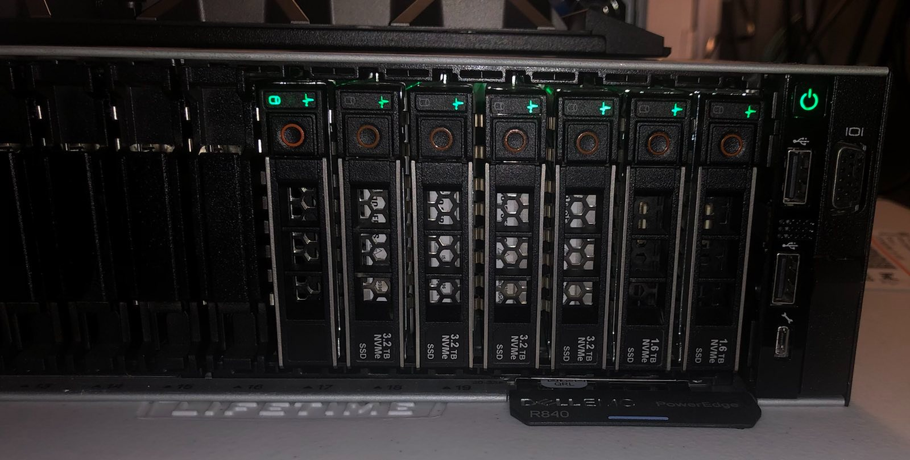
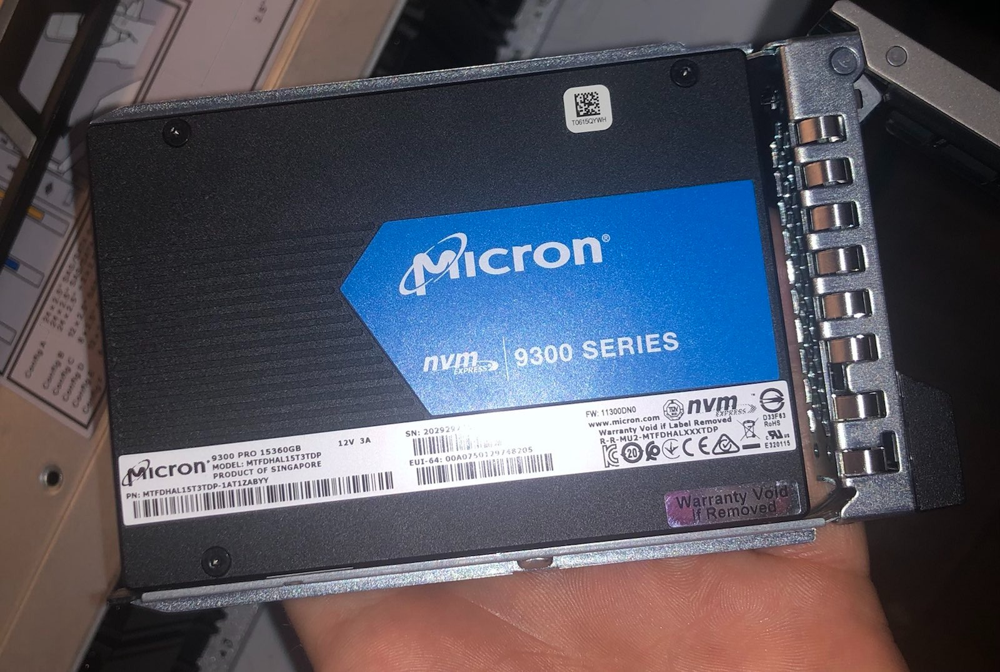
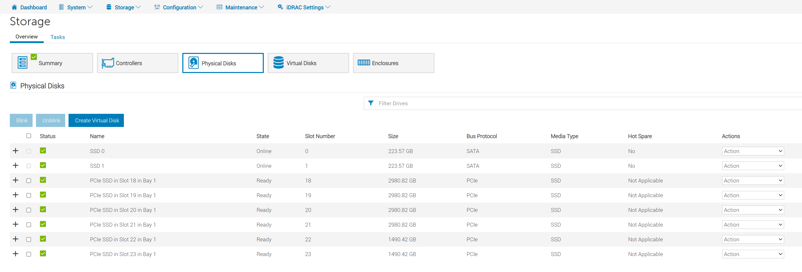

# Get NVMe Drives from iDRAC Redfish

- [Get NVMe Drives from iDRAC Redfish](#get-nvme-drives-from-idrac-redfish)
  - [Exploring iDRAC Detected Storage](#exploring-idrac-detected-storage)
  - [Understand the Behavior of Unqualified Drives](#understand-the-behavior-of-unqualified-drives)
  - [Getting a Drive's Stats](#getting-a-drives-stats)

## Exploring iDRAC Detected Storage

I used the [Storage API endpoint](https://developer.dell.com/apis/2978/versions/5.xx/openapi.yaml/paths/~1redfish~1v1~1Systems~1%7BComputerSystemId%7D~1Storage~1%7BStorageId%7D/get) to accomplish this.

From my host I received:

```json
{"@odata.context":"/redfish/v1/$metadata#StorageCollection.StorageCollection","@odata.id":"/redfish/v1/Systems/System.Embedded.1/Storage/","@odata.type":"#StorageCollection.StorageCollection","Description":"Collection Of Storage entities","Members":[{"@odata.id":"/redfish/v1/Systems/System.Embedded.1/Storage/RAID.Slot.4-1"},{"@odata.id":"/redfish/v1/Systems/System.Embedded.1/Storage/RAID.Embedded.1-1"},{"@odata.id":"/redfish/v1/Systems/System.Embedded.1/Storage/CPU.1"},{"@odata.id":"/redfish/v1/Systems/System.Embedded.1/Storage/AHCI.Slot.2-1"}],"Members@odata.count":4,"Name":"Storage Collection"}
```

I'm running an R840 which is Dell 14G which I know does not have NVMe RAID controllers as an option so I know my NVMe drives must be hanging off the CPU. IE: `/redfish/v1/Systems/System.Embedded.1/Storage/CPU.1`. I can expect that the BOSS card is hanging off of AHCI and that any SAS/SATA drives are likely on the RAID controller. The results above also imply that the host above runs a mixed backplane given the presence of RAID and CPU.1. Checking CPU.1 gets me:

```json
{
    "@odata.context": "/redfish/v1/$metadata#Storage.Storage",
    "@odata.id": "/redfish/v1/Systems/System.Embedded.1/Storage/CPU.1",
    "@odata.type": "#Storage.v1_8_0.Storage",
    "Description": "CPU.1",
    "Drives": [
        {
            "@odata.id": "/redfish/v1/Systems/System.Embedded.1/Storage/CPU.1/Drives/Disk.Bay.21:Enclosure.Internal.0-1"
        },
        {
            "@odata.id": "/redfish/v1/Systems/System.Embedded.1/Storage/CPU.1/Drives/Disk.Bay.19:Enclosure.Internal.0-1"
        },
        {
            "@odata.id": "/redfish/v1/Systems/System.Embedded.1/Storage/CPU.1/Drives/Disk.Bay.20:Enclosure.Internal.0-1"
        },
        {
            "@odata.id": "/redfish/v1/Systems/System.Embedded.1/Storage/CPU.1/Drives/Disk.Bay.23:Enclosure.Internal.0-1"
        },
        {
            "@odata.id": "/redfish/v1/Systems/System.Embedded.1/Storage/CPU.1/Drives/Disk.Bay.18:Enclosure.Internal.0-1"
        },
        {
            "@odata.id": "/redfish/v1/Systems/System.Embedded.1/Storage/CPU.1/Drives/Disk.Bay.22:Enclosure.Internal.0-1"
        }
    ],
    "Drives@odata.count": 6,
    "Id": "CPU.1",
    "Links": {
        "Enclosures": [
            {
                "@odata.id": "/redfish/v1/Chassis/Enclosure.Internal.0-1"
            },
            {
                "@odata.id": "/redfish/v1/Chassis/System.Embedded.1"
            }
        ],
        "Enclosures@odata.count": 2
    },
    "Name": "CPU.1",
    "Status": {
        "Health": "OK",
        "HealthRollup": "OK",
        "State": "Enabled"
    },
    "Volumes": {
        "@odata.id": "/redfish/v1/Systems/System.Embedded.1/Storage/CPU.1/Volumes"
    }
}
```

From the above I can deduce that CPU 1 has six drives attached to it. Or does it? 

## Understand the Behavior of Unqualified Drives

Here is a picture of the front of my server:



Here is the front of my server. You might say, "Wait, there are 7 drives!?" The problem is this 7th drive isn't qualified by Dell. It will still work just fine however, iDRAC won't know how to talk to it so it won't show up:



You can confirm this is the case by checking the Storage->Physical Disks tab inside the iDRAC itself:



Here you can see that I only have the 6 NVMe drives plus two SATA SSDs. While the iDRAC's personality module won't be able to properly sort the drive into Storage it will detect it as a PCIe device and accurately read the vendor information:


## Getting a Drive's Stats

We can select one of them with `/redfish/v1/Systems/System.Embedded.1/Storage/CPU.1/Drives/Disk.Bay.21:Enclosure.Internal.0-1`.

This achieves the desired result and gets a dump of that drive's data. The size is available under the field CapacityBytes.

```json
{
    "@odata.context": "/redfish/v1/$metadata#Drive.Drive",
    "@odata.id": "/redfish/v1/Systems/System.Embedded.1/Storage/CPU.1/Drives/Disk.Bay.21:Enclosure.Internal.0-1",
    "@odata.type": "#Drive.v1_9_0.Drive",
    "Actions": {
        "#Drive.SecureErase": {
            "@Redfish.OperationApplyTimeSupport": {
                "@odata.type": "#Settings.v1_3_0.OperationApplyTimeSupport",
                "SupportedValues": [
                    "Immediate",
                    "OnReset"
                ]
            },
            "target": "/redfish/v1/Systems/System.Embedded.1/Storage/CPU.1/Drives/Disk.Bay.21:Enclosure.Internal.0-1/Actions/Drive.SecureErase"
        }
    },
    "Assembly": {
        "@odata.id": "/redfish/v1/Chassis/System.Embedded.1/Assembly"
    },
    "BlockSizeBytes": 0,
    "CapableSpeedGbs": 7.876923076923077,
    "CapacityBytes": 3200631791616,
    "Description": "PCIe SSD in Slot 21 in Bay 1",
    "EncryptionAbility": "None",
    "EncryptionStatus": "Unencrypted",
    "FailurePredicted": false,
    "HotspareType": "None",
    "Id": "Disk.Bay.21:Enclosure.Internal.0-1",
    "Identifiers": [
        {
            "DurableName": null,
            "DurableNameFormat": null
        }
    ],
    "Identifiers@odata.count": 1,
    "Links": {
        "Chassis": {
            "@odata.id": "/redfish/v1/Chassis/Enclosure.Internal.0-1"
        },
        "PCIeFunctions": [],
        "PCIeFunctions@odata.count": 0,
        "Volumes": [
            {
                "@odata.id": "/redfish/v1/Systems/System.Embedded.1/Storage/CPU.1/Volumes/Disk.Bay.21:Enclosure.Internal.0-1"
            }
        ],
        "Volumes@odata.count": 1
    },
    "Location": [],
    "Manufacturer": "Intel Corporation ",
    "MediaType": "SSD",
    "Model": "Dell Express Flash NVMe P4610 3.2TB SFF",
    "Name": "PCIe SSD in Slot 21 in Bay 1",
    "NegotiatedSpeedGbs": 7.876923076923077,
    "Oem": {
        "Dell": {
            "@odata.type": "#DellOem.v1_1_0.DellOemResources",
            "DellDriveSMARTAttributes": null,
            "DellNVMeSMARTAttributes": {
                "@odata.id": "/redfish/v1/Systems/System.Embedded.1/Storage/CPU.1/Drives/Disk.Bay.21:Enclosure.Internal.0-1/Oem/Dell/DellNVMeSMARTAttributes"
            },
            "DellPCIeSSD": {
                "@odata.context": "/redfish/v1/$metadata#DellPCIeSSD.DellPCIeSSD",
                "@odata.id": "/redfish/v1/Systems/System.Embedded.1/Storage/CPU.1/Drives/Disk.Bay.21:Enclosure.Internal.0-1/Oem/Dell/DellPCIeSSDs/Disk.Bay.21:Enclosure.Internal.0-1",
                "@odata.type": "#DellPCIeSSD.v1_4_0.DellPCIeSSD",
                "Bus": "CA",
                "BusProtocol": "PCIE",
                "Description": "An instance of DellPCIeSSD will have PCIe Solid State Drive specific data.",
                "Device": "0",
                "DeviceProtocol": "NVMe-MI1.0",
                "DriveFormFactor": "2.5Inch",
                "FreeSizeInBytes": null,
                "Function": "0",
                "HotSpareStatus": null,
                "Id": "Disk.Bay.21:Enclosure.Internal.0-1",
                "MediaType": "SolidStateDrive",
                "Name": "DellPCIeSSD",
                "PCIeCapableLinkWidth": "x4",
                "PCIeNegotiatedLinkWidth": "x4",
                "ProductID": "a54",
                "RAIDType": "Unknown",
                "RaidStatus": null,
                "Slot": 21,
                "SystemEraseCapability": "CryptographicErasePD",
                "UsedSizeInBytes": 0
            },
            "DellPhysicalDisk": {
                "@odata.context": "/redfish/v1/$metadata#DellPhysicalDisk.DellPhysicalDisk",
                "@odata.id": "/redfish/v1/Systems/System.Embedded.1/Storage/CPU.1/Drives/Disk.Bay.21:Enclosure.Internal.0-1/Oem/Dell/DellDrives/Disk.Bay.21:Enclosure.Internal.0-1",
                "@odata.type": "#DellPhysicalDisk.v1_3_0.DellPhysicalDisk",
                "Certified": null,
                "Connector": null,
                "Description": "An instance of DellPhysicalDisk will have Physical Disk specific data.",
                "DeviceProtocol": "NVMe-MI1.0",
                "DriveFormFactor": "2.5Inch",
                "EncryptionProtocol": null,
                "ForeignKeyIdentifier": null,
                "FreeSizeInBytes": null,
                "Id": "Disk.Bay.21:Enclosure.Internal.0-1",
                "LastSystemInventoryTime": null,
                "LastUpdateTime": null,
                "ManufacturingDay": null,
                "ManufacturingWeek": null,
                "ManufacturingYear": null,
                "Name": "DellPhysicalDisk",
                "NonRAIDDiskCachePolicy": null,
                "OperationName": null,
                "OperationPercentCompletePercent": null,
                "PCIeCapableLinkWidth": "x4",
                "PCIeNegotiatedLinkWidth": "x4",
                "PPID": null,
                "PowerStatus": null,
                "PredictiveFailureState": null,
                "ProductID": "a54",
                "RAIDType": "Unknown",
                "RaidStatus": null,
                "SASAddress": null,
                "Slot": 21,
                "SystemEraseCapability": "CryptographicErasePD",
                "T10PICapability": null,
                "UsedSizeInBytes": 0,
                "WWN": null
            }
        }
    },
    "Operations": [],
    "Operations@odata.count": 0,
    "PartNumber": "TW02CN1TPIHIT9A9013TA02",
    "PhysicalLocation": {
        "PartLocation": {
            "LocationOrdinalValue": 21,
            "LocationType": "Slot"
        }
    },
    "PredictedMediaLifeLeftPercent": 100,
    "Protocol": "PCIe",
    "Revision": "VDV1DP23",
    "RotationSpeedRPM": null,
    "SerialNumber": "PHLN9396002Q3P2BGN",
    "Status": {
        "Health": "OK",
        "HealthRollup": "OK",
        "State": "Enabled"
    },
    "WriteCacheEnabled": false
}
```

