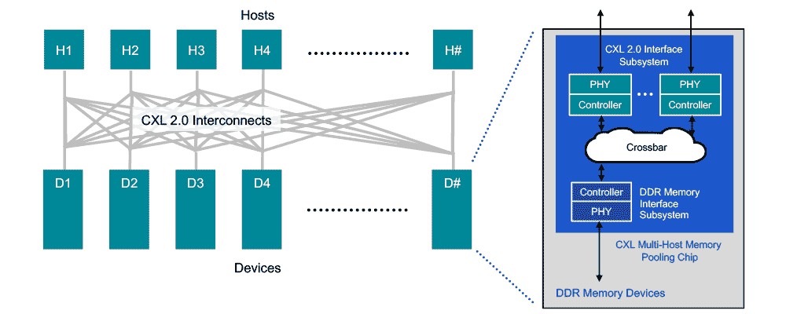

# HPC Memory

**KEY TAKEAWAY** Economics will drive the pooling of main memory, and whether or not customers choose the CXL way or the Gen-Z way. Considering that memory can account for half of the cost of a server at a hyperscaler, anything that allows a machine to have a minimal amount of capacity on the node and then share the rest in the rack — with all of it being transparent to the operating system and all of it looking local — will be adopted. There is just no question about that. Memory area networks, in one fashion or another, are going to be common in datacenters before too long, and this will be driven by economics.

## Load Store Architecture

https://www.sciencedirect.com/topics/computer-science/load-store-architecture
https://en.wikipedia.org/wiki/Load%E2%80%93store_architecture

## Fabric Attached Memory

Broad overview: https://itigic.com/fabric-attached-memory-is-not-ram-or-cache-in-cpu/

The Machine background information: https://github.com/FabricAttachedMemory/Emulation/wiki

How the emulation for the Machine works: https://github.com/FabricAttachedMemory/Emulation/wiki/Emulation-via-Virtual-Machines

## CXL

Interesting article on roadmap: https://www.nextplatform.com/2021/09/07/the-cxl-roadmap-opens-up-the-memory-hierarchy/
Deep Dive: https://www.nextplatform.com/2019/09/18/eating-the-interconnect-alphabet-soup-with-intels-cxl/

### Devices

**High Level**
- Type 1 Device - Coherently access host memory. Ex: PGAS NIC / NIC atomics
- Type 2 Device - Can coherently access host memory and allow the host to access device memory. Ex: An accelerator with attached memory and optional coherent cache. GPU/dense computation
- Type 3 Device - Can access and manage attached device memory. Ex: memory expanders or buffers
- 

**Detailed**
- Type 1 Devices: Accelerators such as smart NICs typically lack local memory. However, they can leverage the CXL.io protocol and CXL.cache to communicate with the host processor’s DDR memory.
- Type 2 Devices: GPUs, ASICs, and FPGAs are all equipped with DDR or HBM memory and can use the CXL.memory protocol, along with the CXL.io and CXL.cache, to make the host processor’s memory locally available to the accelerator—and the accelerator’s memory locally available to the CPU. They are also co-located in the same cache coherent domain and help boost heterogeneous workloads.
- Type 3 Devices: The CXL.io and CXL.memory protocols can be leveraged for memory expansion and pooling. For example, a buffer attached to the CXL bus could be used to enable DRAM capacity expansion, augmenting memory bandwidth, or adding persistent memory without the loss of DRAM slots. In real world terms, this means the high-speed, low-latency storage devices that would have previously displaced DRAM can instead complement it with CXL-enabled devices. These could include non-volatile technologies in various form factors such as add-in cards, U.2, and EDSFF.

### Protocols

- CXL.io: This protocol is functionally equivalent to the PCIe 5.0 protocol—and utilizes the broad industry adoption and familiarity of PCIe. As the foundational communication protocol, CXL.io is versatile and addresses a wide range of use cases.
- CXL.cache: This protocol, which is designed for more specific applications, enables accelerators to efficiently access and cache host memory for optimized performance.
- CXL.memory: This protocol enables a host, such as a processor, to access device-attached memory using load/store commands.

### Memory Pooling

CXL 2.0 supports switching to enable memory pooling. With a CXL 2.0 switch, a host can access one or more devices from the pool. Although the hosts must be CXL 2.0-enabled to leverage this capability, the memory devices can be a mix of CXL 1.0, 1.1, and 2.0-enabled hardware. At 1.0/1.1, a device is limited to behaving as a single logical device accessible by only one host at a time. However, a 2.0 level device can be partitioned as multiple logical devices, allowing up to 16 hosts to simultaneously access different portions of the memory.

As an example, a host 1 (H1) can use half the memory in device 1 (D1) and a quarter of the memory in device 2 (D2) to finely match the memory requirements of its workload to the available capacity in the memory pool. The remaining capacity in devices D1 and D2 can be used by one or more of the other hosts up to a maximum of 16. Devices D3 and D4, CXL 1.0 and 1.1-enabled respectively, can be used by only one host at a time.

### Switching

By moving to a CXL 2.0 direct-connect architecture, data centers can achieve the performance benefits of main memory expansion—and the efficiency and total cost of ownership (TCO) benefits of pooled memory. Assuming all hosts and devices are CXL 2.0-enabled, “switching” is incorporated into the memory devices via a crossbar in the CXL memory pooling chip. This keeps latency low but requires a more powerful chip since it is now responsible for the control plane functionality performed by the switch. With low-latency direct connections, attached memory devices can employ DDR DRAM to provide expansion of host main memory. This can be done on a very flexible basis, as a host is able to access all—or portions of—the capacity of as many devices as needed to tackle a specific workload.

## Radix

https://github.com/HewlettPackard/meadowlark
https://ieeexplore.ieee.org/document/6307777

## SmartNICs