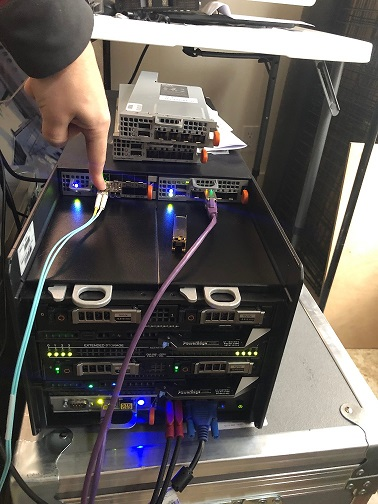

# How to Get DPDK with pdump Running

The purpose of this experiment is to get Intel's DPDK framework up and running on
a server.

# Useful Materials

[How to Compile DPDK](https://doc.dpdk.org/guides/linux_gsg/build_dpdk.html#install-the-dpdk-and-browse-sources)

[Info on Linux Drivers for DPDK](https://doc.dpdk.org/guides/linux_gsg/linux_drivers.html)

[Description of the TestPMD Program](https://software.intel.com/en-us/articles/testing-dpdk-performance-and-features-with-testpmd)

# My Environment

I am running a Dell FC640 on a TFX2HE chassis.

## Red Hat Release Info

        NAME="Red Hat Enterprise Linux"
        VERSION="8.1 (Ootpa)"
        ID="rhel"
        ID_LIKE="fedora"
        VERSION_ID="8.1"
        PLATFORM_ID="platform:el8"
        PRETTY_NAME="Red Hat Enterprise Linux 8.1 (Ootpa)"
        ANSI_COLOR="0;31"
        CPE_NAME="cpe:/o:redhat:enterprise_linux:8.1:GA"
        HOME_URL="https://www.redhat.com/"
        BUG_REPORT_URL="https://bugzilla.redhat.com/"

        REDHAT_BUGZILLA_PRODUCT="Red Hat Enterprise Linux 8"
        REDHAT_BUGZILLA_PRODUCT_VERSION=8.1
        REDHAT_SUPPORT_PRODUCT="Red Hat Enterprise Linux"
        REDHAT_SUPPORT_PRODUCT_VERSION="8.1"
        Red Hat Enterprise Linux release 8.1 (Ootpa)
        Red Hat Enterprise Linux release 8.1 (Ootpa)

## Kernel Info

    Linux dpdkdemo.lan 4.18.0-147.el8.x86_64 #1 SMP Thu Sep 26 15:52:44 UTC 2019 x86_64 x86_64 x86_64 GNU/Linux

## Physical Setup

I ran the traffic generator to port 5 of the passthrough module which maps to port
1 my internal x710 card.

# Installation

## Enable Red Hat Repos

Run `subscription-manager list --available | less` and find the subscription which
provides CodeReady for x86. Note the pool number associated with the subscription.

Run `subscription-manager attach --pool=<POOL_NUMBER>` to enable the subscription.

Then run: `subscription-manager repos --enable=codeready-builder-for-rhel-8-x86_64-rpms` to enable the repo.

## Install DPDK

1. Download from [https://core.dpdk.org/download/](https://core.dpdk.org/download/)
2. Edit the security limits with `vim /etc/security/limits.conf`
   1. Add the following lines at the end of the file. This assumes you are running as root:

                root    hard   memlock           unlimited
                root    soft   memlock           unlimited

3. Make sure your kernel is up to date with `dnf update -y && reboot`.
4. Run `dnf install -y gcc numactl-devel kernel-devel pciutils elfutils-libelf-devel make libpcap python3 tar vim wget tmux vim mlocate hwloc`
5. Extract dpdk and cd into its directory
6. set the environment variable RTE_SDK. It is the directory in which you extracted all the DPDK files. `export RTE_SDK=<YOUR_DIR>`
7. Run `make install T=x86_64-native-linux-gcc CONFIG_RTE_LIBRTE_PMD_PCAP=y CONFIG_RTE_LIBRTE_PDUMP=y DESTDIR=<INSTALL_DIR>` to build dpdk. Ensure your install directory exists.

**NOTE**: The option CONFIG_RTE_LIBRTE_PMD_PCAP=y enabled libpcap support in DPDK.
This is required for pdump to work.

Once an DPDK target environment directory has been created (such as x86_64-native-linux-gcc), 
it contains all libraries and header files required to build an application. When 
compiling an application in the Linux* environment on the DPDK, the following variables 
must be exported:

- RTE_TARGET - Points to the DPDK target environment directory.
 

        export RTE_TARGET=/opt/dpdk-19.08/x86_64-native-linux-gcc

You may want to add this variable and RTE_SDK to *~/.bash_profile*

## Install ELF Tools

Run the following:

        dnf install -y python36-devel
        pip3 install numpy
        pip3 install elftools
        pip3 install pyelftools

# Configuration

TODO: Need to update the instructions with this. Why can't the setup tool find it?

I had to run `modprobe uio && insmod /opt/dpdk-19.08/install/lib/modules/4.18.0-147.el8.x86_64/extra/dpdk/igb_uio.ko`
to get this to load. The `modprobe uio` is necessary because the uio module is a
depency of igb_uio.

## Configure vfio-pci to Load on Boot (TODO REMOVE)

1. Go to /etc/modules-load.d/

        cd /etc/modules-load.d

2. Run `echo vfio-pci > vfio-pci.conf`
3. If you don't reboot you will need to run `modprobe vfio-pci`

## Configure Ports

1. Move to your dpdk dir and run `./install/share/dpdk/usertools/dpdk-setup.sh`. This should give you a menu with all available DPDK options. The menu is setup in such a way that you must perform each step listed in the menu. If things have gone correctly to this point your Step 1 should look like the following:

        ----------------------------------------------------------
        Step 1: Select the DPDK environment to build
        ----------------------------------------------------------
        [1] *

2. My menu looks like this:

        ----------------------------------------------------------
        Step 1: Select the DPDK environment to build
        ----------------------------------------------------------
        [1] *

        ----------------------------------------------------------
        Step 2: Setup linux environment
        ----------------------------------------------------------
        [2] Insert IGB UIO module
        [3] Insert VFIO module
        [4] Insert KNI module
        [5] Setup hugepage mappings for non-NUMA systems
        [6] Setup hugepage mappings for NUMA systems
        [7] Display current Ethernet/Baseband/Crypto device settings
        [8] Bind Ethernet/Baseband/Crypto device to IGB UIO module
        [9] Bind Ethernet/Baseband/Crypto device to VFIO module
        [10] Setup VFIO permissions

        ----------------------------------------------------------
        Step 3: Run test application for linux environment
        ----------------------------------------------------------
        [11] Run test application ($RTE_TARGET/app/test)
        [12] Run testpmd application in interactive mode ($RTE_TARGET/app/testpmd)

        ----------------------------------------------------------
        Step 4: Other tools
        ----------------------------------------------------------
        [13] List hugepage info from /proc/meminfo

        ----------------------------------------------------------
        Step 5: Uninstall and system cleanup
        ----------------------------------------------------------
        [14] Unbind devices from IGB UIO or VFIO driver
        [15] Remove IGB UIO module
        [16] Remove VFIO module
        [17] Remove KNI module
        [18] Remove hugepage mappings

        [19] Exit Script

3. Next run option 6 to instert huge pages for NUMA systems. Notice you will be prompted to select an amount of memory on a per processor basis. This is because there are pages associated with each individual processor to increase performance via locality.
4. Run option 7 and make sure you receive output and that network devices are listed. My output looks like this:

        Network devices using kernel driver
        ===================================
        0000:0b:00.0 'VMXNET3 Ethernet Controller 07b0' if=ens192 drv=vmxnet3 unused=vfio-pci *Active*
        0000:13:00.0 'VMXNET3 Ethernet Controller 07b0' if=ens224 drv=vmxnet3 unused=vfio-pci *Active*

        No 'Baseband' devices detected
        ==============================

        No 'Crypto' devices detected
        ============================

        No 'Eventdev' devices detected
        ==============================

        No 'Mempool' devices detected
        =============================

        No 'Compress' devices detected
        ==============================

        No 'Misc (rawdev)' devices detected
        ===================================

**NOTE**: The active keyword means that DPDK thinks the interface is under active use.
This means that the interface has routes installed in the routing table.

5. Run option 8 to bind an interface to DPDK using the IGB UIO driver.
6. 

# Performing Packet Capture

## Initial Setup

Get the core layout with `./install/share/dpdk/usertools/cpu_layout.py`
View your port layout with `./install/share/dpdk/usertools/dpdk-devbind.py -s`

If you haven't already load the right kernel modules with: `modprobe uio && insmod /opt/dpdk-19.08/install/lib/modules/4.18.0-147.el8.x86_64/extra/dpdk/igb_uio.ko`

## Starting testpmd

**NOTE**: The `--` separates the argumentsn for the EAL vs TestPMD.

        ./install/bin/testpmd -l 4,8,10,12 -n 4 -- -i --forward-mode=rxonly

After `testpmd` has started don't forget to run the `start` command on the testpmd
command line.

## pdump

        ./install/bin/dpdk-pdump -- --pdump 'port=0,queue=*,rx-dev=/tmp/capture.pcap'

# Helpful Tips

## Getting CPU Info

DPDK provides a tool for seeing the CPU layout with `./install/share/dpdk/usertools/cpu_layout.py`
You can see the logical layout of the cores with `cat /proc/cpuinfo`
You can alse run `lstopo-no-graphics`

Notice that the cores alternate back and forth.

## Process Types in DPDK

DPDK runs two different types of processes. There are as follows:

- primary processes, which can initialize and which have full permissions on shared memory
- secondary processes, which cannot initialize shared memory, but can attach to pre- initialized shared memory and create objects in it.

Standalone DPDK processes are primary processes, while secondary processes can only run alongside a primary process or after a primary process has already configured the hugepage shared memory for them.

## TestPMD 

The test pmd manual is available [here](./dpdk-testpmd-application-user-guide.pdf)

### Interactive Commands

#### Starting transmit

        start

#### Get Port Info

        show port info all

### Forwarding Modes

TestPMD has different forwarding modes that can be used within the application.

- Input/output mode: This mode is generally referred to as IO mode. It is the most common forwarding mode and is the default mode when TestPMD is started. In IO mode a CPU core receives packets from one port (Rx) and transmits them to another port (Tx). The same port can be used for reception and transmission if required.
- Rx-only mode: In this mode the application polls packets from the Rx ports and frees them without transmitting them. In this way it acts as a packet sink.
- Tx-only mode: In this mode the application generates 64-byte IP packets and transmits them from the Tx ports. It doesn’t handle the reception of packets and as such acts as a packet source.
These latter two modes (Rx-only and Tx-only) are useful for checking packet reception and transmission separately.

Apart from these three modes there are other forwarding modes that are explained in the [TestPMD documentation](http://doc.dpdk.org/guides/testpmd_app_ug/testpmd_funcs.html#set-fwd).

### Port Topology Modes

In paired mode, the forwarding is between pairs of ports, for example: (0,1), (2,3), (4,5).

In chained mode, the forwarding is to the next available port in the port mask, for example:
(0,1), (1,2), (2,0).
The ordering of the ports can be changed using the portlist testpmd runtime function.

In loop mode, ingress traffic is simply transmitted back on the same interface.

### Receive Side Scaling

=Receive-Side Scaling (RSS), also known as multi-queue receive, distributes network receive processing across several hardware-based receive queues, allowing inbound network traffic to be processed by multiple CPUs. RSS can be used to relieve bottlenecks in receive interrupt processing caused by overloading a single CPU, and to reduce network latency.

To determine whether your network interface card supports RSS, check whether multiple interrupt request queues are associated with the interface in /proc/interrupts. For example, if you are interested in the p1p1 interface:

        # egrep 'CPU|p1p1' /proc/interrupts
        CPU0    CPU1    CPU2    CPU3    CPU4    CPU5
        89:   40187       0       0       0       0       0   IR-PCI-MSI-edge   p1p1-0
        90:       0     790       0       0       0       0   IR-PCI-MSI-edge   p1p1-1
        91:       0       0     959       0       0       0   IR-PCI-MSI-edge   p1p1-2
        92:       0       0       0    3310       0       0   IR-PCI-MSI-edge   p1p1-3
        93:       0       0       0       0     622       0   IR-PCI-MSI-edge   p1p1-4
        94:       0       0       0       0       0    2475   IR-PCI-MSI-edge   p1p1-5

----

huge pages https://access.redhat.com/documentation/en-us/red_hat_enterprise_linux/7/html/performance_tuning_guide/sect-red_hat_enterprise_linux-performance_tuning_guide-memory-configuring-huge-pages
