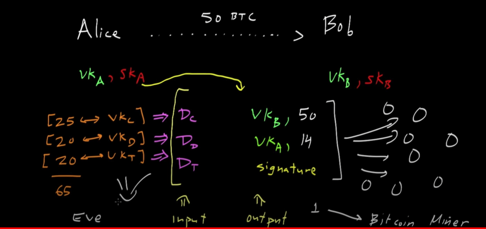
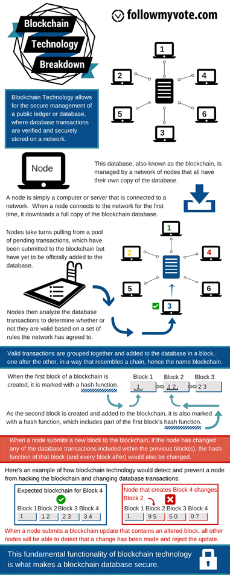

# How Bitcoin-Blockchain Works - Notes

- [How Bitcoin-Blockchain Works - Notes](#how-bitcoin-blockchain-works---notes)
  - [Helpful Resources](#helpful-resources)
  - [Azure Solution with Active Directory](#azure-solution-with-active-directory)
  - [Bitcoin](#bitcoin)
    - [Unspent Transaction Output (UTXO)](#unspent-transaction-output-utxo)
  - [Blockchain](#blockchain)
    - [What does each block have](#what-does-each-block-have)
    - [What is a permissionless blockchain?](#what-is-a-permissionless-blockchain)
      - [Consensus Algorithm](#consensus-algorithm)
    - [What is a permissions blockchain?](#what-is-a-permissioned-blockchain)
    - [What is a block](#what-is-a-block)
      - [Genesis Block](#genesis-block)
    - [Creating a new transaction](#creating-a-new-transaction)
  - [Khan Academy Notes](#khan-academy-notes)
    - [Bitcoin What is It](#bitcoin-what-is-it)
    - [Bitcoin: Overview](#bitcoin-overview)
    - [Bitcoin: Cryptographic Hash Functions](#bitcoin-cryptographic-hash-functions)
    - [Bitcoin: Digital Signatures](#bitcoin-digital-signatures)
    - [Bitcoin: Transaction records](#bitcoin-transaction-records)
    - [Bitcoin: Proof of Work](#bitcoin-proof-of-work)
    - [Bitcoin: Transaction Block Chains](#bitcoin-transaction-block-chains)
    - [Bitcoin: The Bitcoin Money Supply](#bitcoin-the-bitcoin-money-supply)
    - [Bitcoin: The security of transaction block chains](#bitcoin-the-security-of-transaction-block-chains)
  - [Using Blockchain for Voting](#using-blockchain-for-voting)
    - [How the Keys are Generated](#how-the-keys-are-generated)

## Helpful Resources

IBM Lecture: https://mediacenter.ibm.com/media/Blockchain%20Explained/1_e34h0ey8

The Bitcoin Protocol Explained: How it Actually Works: https://komodoplatform.com/en/academy/bitcoin-protocol/

Blockchain Learning Resources: https://github.com/mikeroyal/Blockchain-Guide

Demo of Azure Solution: https://learn.microsoft.com/en-us/shows/azure-friday/issue-and-accept-verifiable-credentials-using-azure-active-directory?culture=en-us&country=US

OpenID Connect: https://openid.net/connect/

Khan Academy Video Series: https://www.khanacademy.org/economics-finance-domain/core-finance/money-and-banking/bitcoin/v/bitcoin-what-is-it

Follow My Vote (Blockchain used for voting): https://github.com/FollowMyVote

Why Using Bitcoin/Blockchain for Voting is a Bad Idea: https://www.coindesk.com/tech/2020/11/16/new-mit-paper-roundly-rejects-blockchain-voting-as-solution-to-election-woes/

MIT Paper on Why Bitcoin/Blockchain is Bad for Voting: [link](images/PSNR20.pdf)

## Azure Solution with Active Directory

See https://learn.microsoft.com/en-us/shows/azure-friday/issue-and-accept-verifiable-credentials-using-azure-active-directory?culture=en-us&country=US

- Under the hood, when a 3rd party attempts to validate a credential it is using OpenID connect.
  - Microsoft created a client API where a single API call will allow you to validate user credentials.

The return URL shown above is what is encoded in the QR code the person scans. The way this will work with an app is that the app (like authenticator in this case) can register itself as the protocol handler so whenever someone scans something with their camera it will automatically open with that app.

## Bitcoin

### Unspent Transaction Output (UTXO)

See: https://komodoplatform.com/en/academy/bitcoin-protocol/

## Blockchain

### What does each block have

- A hash
- A list of transactions that have occurred on that block
- Previous block's hash

### What is a permissionless blockchain?

These are what is used by cryptocurrencies. Everyone can see all transactions that have ever taken place. You will see the transactions by each person's address. Any time it gets updated and new transactions are made you get a new block.

#### Consensus Algorithm

You have all these transactions coming in how do you decide which transactions will make up the next block. 

1. A client will first submit a transaction and that transaction will join a list of other transactions that have been made on the network.
2. A node will start picking up the transactions, look through all the previous transactions on the blockchain and know those are valid. It will kind of emulate a block and then start a proof of work algorithm.
   1. The proof of work algorithm is a complex crypto-hash algorithm everyone works together to solve. Once one node resolves it, it will broadcast the position of that next block to all the other nodes in the network.

### What is a permissioned blockchain?

There is an idea called pluggable consensus algorithms. You can use this when the nodes in the blockchain are trusted. In addition, the nodes may not be just users but entire organizations. Privacy here is important.

Scenario: You have a retailer who buys 100 pounds of something at $1000. Then you have a shipper who wants $100 for shipping. The shipper should know when the order was placed, for what, and how much they charged, but they wouldn't know how much the total original cost was.

Smart contracts: This allows you to do something like make sure the warehouse has enough goods at the manufacturer, the retailer has enough money to pay the shipper, and you can take automated action (like refunding money when goods aren't available) based on this information.

### What is a block

From: https://followmyvote.com/blockchain-technology/

The blockchain further requires that an audit trail of all changes to the database is preserved, which allows anyone to audit that the database is correct at any time. This audit trail is composed to the individual changes to the database, which are called transactions. A group of transactions which were all added by a single node on its turn is called a block. Each block contains a reference to the block which preceded it, which establishes an ordering of the blocks. This is the origin of the term “blockchain”: it is a chain of blocks, each one containing a link to the previous block and a list of new transactions since that previous block.

#### Genesis Block

An empty block that is the beginning of the block chain.

### Creating a new transaction

From: https://followmyvote.com/blockchain-technology/

The most obvious example of blockchain technology in use today is Bitcoin. Bitcoin is a digital currency system which uses a blockchain to keep track of ownership of the currency. Whenever someone wishes to spend their bitcoins, they create a transaction which states that they are sending a certain number of their bitcoins to someone else. Then they digitally sign this transaction to authorize it, and broadcast it to all of the nodes in the Bitcoin network. When the next node creates a block, it will check that the new transaction is valid, and include it in the new block, which is then propagated to all other nodes in the network, which adjust their databases to deduct the transferred bitcoins from the sender and credit them to the recipient.

## Khan Academy Notes

### Bitcoin What is It

- Bitcoin transactions can use a thick client or a 3rd party service.

### Bitcoin: Overview

- Transactions are tracked on the global ledger
- Transaction fees are used to motivated other nodes to validate the transaction
- To create the transaction, person 1 signs with private key and broadcasts the details of the transaction to other nodes
- How we avoid the double spending problem:
  - We use bitcoin miners. They take all the transactions we see, take those transactions and compile them into a transaction block. This is like the entire page of a ledger block. The miners will include in the block an additional transaction which gives themselves a reward for completing this mining task.
  - The miner will also include a proof of work (some sort of hash problem but he hasn't gotten to that)
  - The transaction block will have a hash of the block's transactions / the hash of the previous block. This is what creates the chain.
  - As soon as a node finishes creating the transaction block, it broadcasts it.
  - The nodes will only consider the longest block chain - that is to say, the node with the most work which has been accomplished

### Bitcoin: Cryptographic Hash Functions

- Properties of cryptographic hash functions
  - Computationally efficient
  - Hard to find hash collision (colision resistant)
  - Hide information about the original input
  - Output should be well distributed

### Bitcoin: Digital Signatures

- Private key may also be referred to as signing key (SK) and public key can be verification key (VK)
- Usually you will hash then sign the message

### Bitcoin: Transaction records

- A transaction is just one party's intent to transfer some of their bitcoins to another party
- You can verify that a party possesses the Bitcoins they say they possess by searching for transactions showing that the party in question received that quantity of bitcoins
- See [UTXO](#unspent-transaction-output-utxo) for a description of how transactions really work under the hood
  - The idea here is that for each UTXO, there is a message digest of those transaction records and anyone can check those message digests and that the target was indeed the recipient
- In the case of a new transaction, the sender will create new transactions and then sign all of them with the private key. This will also include the transaction fees. 
- If there is a double spend, remember that the order of transactions is included in the ledger which will prevent someone from committing a double spend to the ledger (because it would become obvious to the calculating node they have insufficient funds)

### Bitcoin: Proof of Work

- Other uses of Proof of Work: preventing DOS or SPAM
- In general, they begin with a challenge string (c)
  - In the case of SPAM it might be an e-mail message
- In response there is a response or proof response (p)
- In example of the challenge might be to combine the challenge string and the response string such that a hash output of the two has a fixed number of leading zeros and then the other bits are whatever you want. If you said you want 40 bits of leading zeros this would require effectively 2^40 consecutive heads coin flips. If you want to increase the difficulty, you can simply require more leading zeros effectively doubling the effort. Someone just has to find the proof string to prove they have done the work.

### Bitcoin: Transaction Block Chains

- Nodes (Bitcoin miners) will take all these transactions they have received that have not yet been registered in the block chain. The first thing they will do is collate all these transactions. 
- What they will do is take all the transactions they have collected and split them up into pairs. Then they will hash each pair, then take the hashes of the pairs, hash those, and so on and so forth until they have a single value. Ex:

- Then, they will combine that hash with the hash of the previous block in the blockchain. 

- Then, after the node has created the new blockchain including their new block, they will take all that and hash it into the challenge as mentioned in [Bitcoin: Proof of Work](#bitcoin-proof-of-work). Then, they must generate the proof, which when hashed will have some fixed number of leading zeros.

- The Bitcoin protocol is designed such that the average time to creating a new block is about every ten minutes
- The reward for miners is that in the first transaction block, they are allowed to insert a reward for themselves. This first transaction record's reward will change over time. These are called coinbase generation. This is how new coins are generated and placed into the system.

- In addition to the coinbase reward, you also get all the transaction fees.
- If there is a tie, then the chain with the most amount of work is selected

### Bitcoin: The Bitcoin Money Supply

- The bitcoin system is designed such that the maximum number of coins is 21,000,000 BTC
- The smallest possible bitcoin is .00000001 BTC called a Satoshi
- Bitcoin started around Jan 2009 and the first reward was 50 BTC
- After about 210,000 blocks the reward halves. This takes approximately 4 years.
- Around 2140 the entire Bitcoin supply will have been generated
- For every 2,016 blocks, the network estimates the amount of time it took to generate the blocks. It should take about two weeks. If it took far less time, than the protocol will make things harder and on the flip side it will make it easier
  - This works out to about every 10 minutes per block.
- It may seem like all nodes are simultaneously working on many of the same transactions. While this may be true, recall that each node inserts its own transaction to reward itself with the coinbase transaction and that transaction includes information unique to the node. Subsequently each node has a different challenge string.

### Bitcoin: The security of transaction block chains

- TLDR: It's a synopsis of the other sections. You would have to fork the chain, add your own new block, plus add other blocks to make their chain longer, such that they then have the chain with the most work. Effectively, you would need at least 51% of the compute power in the network

## Using Blockchain for Voting

From https://followmyvote.com/blockchain-technology/

Another application for blockchain technology is voting. By casting votes as transactions, we can create a blockchain which keeps track of the tallies of the votes. This way, everyone can agree on the final count because they can count the votes themselves, and because of the blockchain audit trail, they can verify that no votes were changed or removed, and no illegitimate votes were added.

From: https://followmyvote.com/cryptographically-secure-voting-2/

### How the Keys are Generated

From: https://followmyvote.com/elliptic-curve-cryptography/

At Follow My Vote, we use this technology to create votes. During the registration process, voters create two ECC key-pairs. The voter reveals her identity to a verifier, who certifies the first key-pair (the identity key-pair) as belonging to that voter, then the voter anonymously registers her second key-pair (the voting key-pair) as belonging to one of the identity keys, but the way this is done, no one can determine which identity key owns her voting key. She can then create transactions which state her votes on the contests in an election, and use her voting private key to sign those transactions. Once these are published, everyone participating in the Follow My Vote network can verify that the signature is valid and adjust the tally accordingly. This way the votes are public and anonymous, but each voter can verify that her vote was correctly recorded and counted. Furthermore, all participants can verify that none of the votes were tampered with by validating the signatures. In this way, Follow My Vote software performs transparent, end-to-end verifiable online elections without compromising on security or voter anonymity.