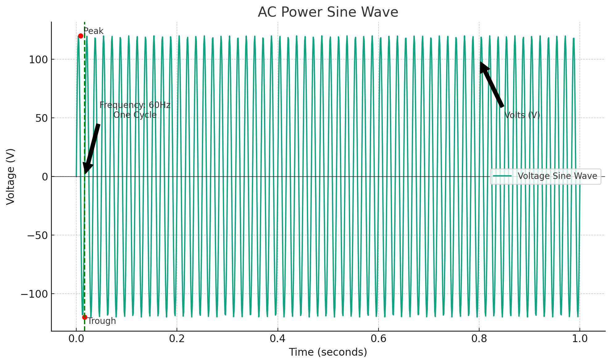
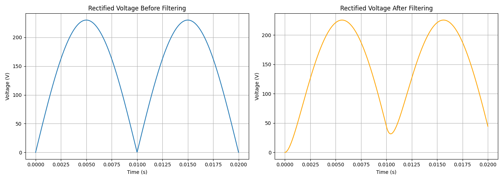
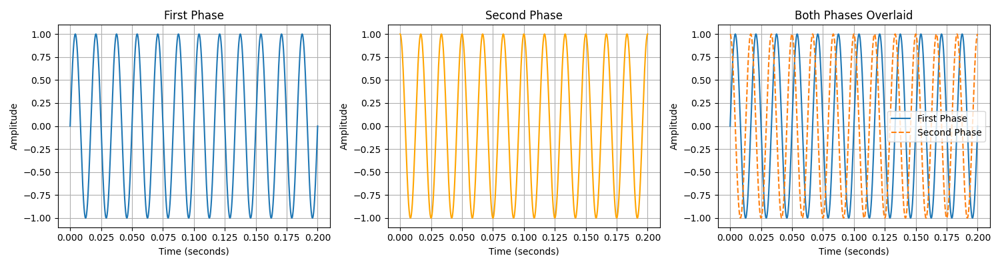
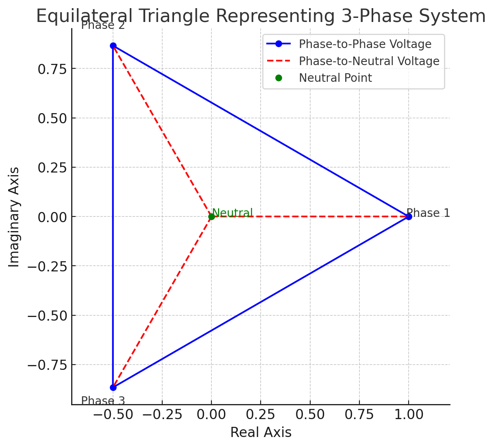
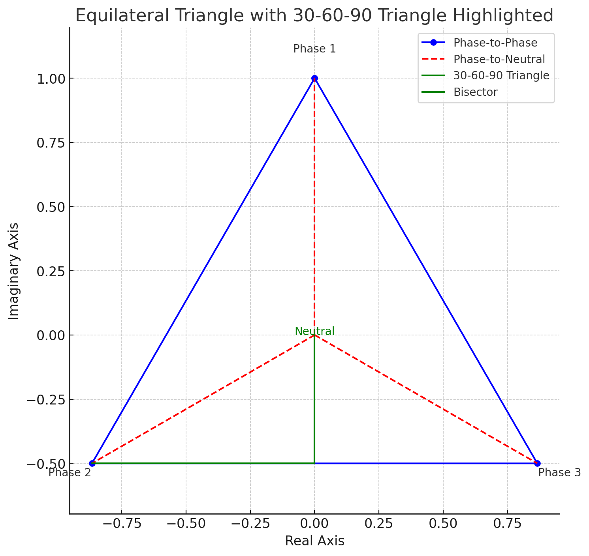

# How Does Power Work

- [How Does Power Work](#how-does-power-work)
  - [Basics of Electrical Power](#basics-of-electrical-power)
  - [Alternating Current (AC)](#alternating-current-ac)
  - [Where Does the Power Come From?](#where-does-the-power-come-from)
    - [How it Gets to the House](#how-it-gets-to-the-house)
    - [How Your Breaker Works](#how-your-breaker-works)
      - [Main Breaker](#main-breaker)
      - [Input Line](#input-line)
      - [Distribution of Power](#distribution-of-power)
        - [Separation into Circuits](#separation-into-circuits)
        - [Circuit Breakers](#circuit-breakers)
        - [240-Volt Circuits](#240-volt-circuits)
      - [Safety Mechanisms](#safety-mechanisms)
        - [Overload Protection](#overload-protection)
        - [Short Circuit Protection](#short-circuit-protection)
        - [Ground Fault Protection](#ground-fault-protection)
  - [Single-Phase Power](#single-phase-power)
  - [Understanding the Sine Wave](#understanding-the-sine-wave)
    - [Basics of AC Power and Sine Waves](#basics-of-ac-power-and-sine-waves)
    - [Hold On - Why Does Anything Work When Voltage is Zero?](#hold-on---why-does-anything-work-when-voltage-is-zero)
      - [Rectification](#rectification)
      - [Filtering](#filtering)
      - [Voltage Regulation](#voltage-regulation)
      - [Energy Storage](#energy-storage)
    - [How Does Voltage Relate to Amperage](#how-does-voltage-relate-to-amperage)
      - [Ohm's Law](#ohms-law)
      - [Why This Matters - Power Transmission and Amperage](#why-this-matters---power-transmission-and-amperage)
      - [Does Amperage Change During Transmission?](#does-amperage-change-during-transmission)
  - [Two-Phase Power](#two-phase-power)
    - [Sine Waves and Two-Phase Power](#sine-waves-and-two-phase-power)
    - [Two Phase Power Delivery](#two-phase-power-delivery)
  - [Three-Phase Power](#three-phase-power)
    - [What is the Wye (Y) Configuration?](#what-is-the-wye-y-configuration)
      - [Key Points of Wye Configuration:](#key-points-of-wye-configuration)
      - [480V 3 Phase Wye (480Y/277V)](#480v-3-phase-wye-480y277v)
        - [What Does it Mean to be Both 480V and 277V?](#what-does-it-mean-to-be-both-480v-and-277v)
    - [Ok, but why is it 480V and 277V? Where are those numbers coming from?](#ok-but-why-is-it-480v-and-277v-where-are-those-numbers-coming-from)
      - [Mathematical Representation](#mathematical-representation)

## Basics of Electrical Power

Electricity at its core involves the flow of electrons through a conductor. The power that's delivered to your home or office comes from an electrical grid, which is generated at power plants and distributed through a network of transmission lines. The voltage and current are two fundamental aspects of this power. Voltage is essentially the pressure that pushes electrons through a wire, while current is the rate at which these electrons flow.

## Alternating Current (AC)

Most power systems around the world use alternating current (AC), where the flow of electricity periodically reverses direction. AC power is represented by a sine wave, with its magnitude varying over time. The frequency of this sine wave varies by region (e.g., 60 Hz in the US and 50 Hz in Europe).

## Where Does the Power Come From?

### How it Gets to the House

1. **Power Generation**: Electricity is generated at power plants using various sources (coal, natural gas, hydro, wind, solar, etc.) and is initially produced at a relatively low voltage.
2. **Step-Up Transformer**: To transport this electricity efficiently over long distances to where it's needed, the voltage is increased using a step-up transformer at the power plant. This high voltage allows the electricity to travel long distances through transmission lines with minimal energy loss.
3. **Transmission Lines**: The electricity travels over high-voltage transmission lines that traverse the countryside. These lines can carry voltages ranging from 69kV (69,000 volts) up to 765kV or higher.
4. **Substation Step-Down Transformer**: When the electricity reaches a substation near your local area, step-down transformers reduce the high transmission voltage to a lower distribution voltage, more suitable for use in residential areas.
5. **Distribution Lines**: The lower voltage electricity is then sent through distribution lines, which are the poles and wires you see along streets and alleys. These distribution voltages are typically between 13.2kV and 34.5kV.
6. **Transformer Near Your House**: Finally, a distribution transformer located on a pole (pole-mounted) or on the ground in a green box (pad-mounted) near your home steps down the voltage one last time to the standard household voltage (in North America, typically 120/240 volts). This transformer serves a small number of homes or even just a single home, converting the electricity to a usable level for your appliances and devices.
7. **Service Drop**: From this transformer, a set of wires (service drop) runs to your house, connecting to your electric meter and then to your home's electrical panel (breaker box). This is where electricity is distributed through your home's wiring to outlets, lights, and appliances.

### How Your Breaker Works

#### Main Breaker

The electricity from the utility company enters your home through the meter and then goes to the main breaker in the breaker box. The main breaker serves as a disconnect switch to cut off power to the entire house and also protects the internal circuits from overloading by limiting the total amount of current that can flow into the panel.

#### Input Line

The input line, coming into the breaker box, is actually comprised of two hot wires and one neutral wire in a typical residential service in North America. Each hot wire carries 120 volts from the transformer, and together, they can supply 240 volts for high-demand appliances (like an electric dryer).

#### Distribution of Power

##### Separation into Circuits

Inside the breaker box, the two hot wires connect to a bus bar. Each circuit breaker snaps onto a bus bar to receive power. One bus bar is connected to one of the hot wires, and the other bus bar is connected to the second hot wire. The neutral wire is connected to a neutral bus bar. 

##### Circuit Breakers

Each circuit breaker is connected to one of the hot bus bars and controls a single circuit in your home. For a standard 120-volt circuit, the breaker connects to one of the hot bus bars and the circuit's neutral wire connects to the neutral bus bar. This setup creates a complete path for electricity to flow from the transformer, through the panel, to the outlets or fixtures, and back.

##### 240-Volt Circuits

For appliances requiring 240 volts, a double-pole breaker is used. This type of breaker spans and connects to both hot bus bars, thus utilizing both 120-volt lines to achieve 240 volts. The appliance will typically not use a neutral wire but will have a ground wire for safety.

#### Safety Mechanisms

##### Overload Protection

Circuit breakers are designed to trip and automatically cut off power when the current flowing through the circuit exceeds the breaker's rated capacity. This prevents overheating and reduces the risk of fire.

##### Short Circuit Protection

If a short circuit occurs (a direct connection between the hot and neutral wires without passing through a load), a sudden surge of current will flow. Circuit breakers are designed to detect this surge and trip quickly to cut off power and prevent damage.

##### Ground Fault Protection

Some breakers are designed with ground fault circuit interrupter (GFCI) protection, which shuts off electricity if there is a difference in current between the hot and neutral wires, indicating a leakage of current to the ground. This is particularly important in wet areas like bathrooms and kitchens. Here's how it works:

**Monitoring Current Flow**: A GFCI breaker (or outlet) continuously monitors the current flowing in the hot (live) and neutral wires of a circuit. Under normal conditions, the current flowing to an appliance through the hot wire should return through the neutral wire, meaning the current in both wires should be equal.
**Detecting Imbalance**: The GFCI device is designed to detect even slight differences (imbalances) between the outgoing and returning current. These differences can occur if electrical current is leaking somewhere along the circuit. Ex: through a person who is touching a faulty appliance or water that's come into contact with electricity.
**Response**: If the GFCI detects a current imbalance as small as 4 to 6 milliamps (a milliamp is one-thousandth of an ampere), it reacts quickly (within milliseconds) to shut off the power supply to that circuit.

## Single-Phase Power

Single-phase power is the simplest form of AC power and is commonly used in residential homes. It involves a single AC waveform, providing a straightforward means of delivering power. Electricity in this system is delivered through two wires: one live wire (carrying the current) and one neutral. The voltage in a single-phase system varies sinusoidally over time, but at any given moment, all points in the system see the same voltage phase angle (though the magnitude of the voltage may vary).

You may also be wondering about the ground. The ground is connected to the neutral wire. When everything works correctly then electricity flows through the device then back through the neutral wire completely ignoring the ground because the neutral wire has far less resistance. If there is an excess of power (electrons) that would otherwise "overload" the neutral wire, those electrons spill into the ground which goes, literally, into the earth. Because the earth is massive, that electricity is then dissipated.

## Understanding the Sine Wave

You hear power talked about a lot in the context of sine waves but what exactly does that mean?

### Basics of AC Power and Sine Waves

In an AC power system, the voltage changes from positive to negative in a cyclical manner. This is in contrast to direct current (DC), where the voltage remains constant over time. The reason AC power is depicted as a sine wave is because the voltage (and current) increases and decreases sinusoidally.

- **Peak and Trough**: The highest value of the sine wave represents the peak voltage, while the lowest value represents the trough, or negative peak voltage. The voltage smoothly transitions between these extremes, passing through zero volts twice per cycle.
- **Frequency**: The number of times the wave completes a full cycle (from zero to peak, back to zero, to negative peak, and back to zero again) in one second is its frequency, measured in hertz (Hz). In many parts of the world, the standard frequency is 60 Hz, meaning the cycle repeats 60 times per second.

See [code](./graph_of_voltage.py)

### Hold On - Why Does Anything Work When Voltage is Zero?

Let's take your computer for example. At some point it is receiving 0 volts - in fact this happens in the US 60 times a second so why doesn't your computer shut down? What I describe below all takes place inside your Power Supply Unit (PSU).

#### Rectification

The first stage in the power supply is rectification, which uses diodes to convert the incoming AC voltage to pulsating DC. Rectifiers use a bridge configuration to effectively flip the negative half-cycles of the AC waveform to positive, ensuring that all output voltage is of the same polarity (either all positive or all negative).

Ok, so now we have direct current just like you would have seen in your high school physics class, but the problem is it still has massive fluctuations in voltage as the AC power cycles.

#### Filtering

After rectification, capacitors are used to smooth out these fluctuations. They charge up when the voltage rises and discharge when it falls, effectively "filling in" the dips in the waveform. This process substantially smooths the DC output but may not entirely eliminate voltage variations.

See [code](./filtering.py)

#### Voltage Regulation

The filtered, but possibly still fluctuating, DC voltage is then passed through a voltage regulator stage. Voltage regulators ensure that the output voltage is constant and within the specifications required by the device, regardless of variations in input voltage or load on the power supply. Modern computers have very precise switching regulators that bring the voltage level to an extremely stable state which it then distributes on the power rails to the various components in your PC.

#### Energy Storage

The PSU also includes components like capacitors and, in some cases, inductors that store energy. These components can release energy when the input AC voltage is zero or near zero, ensuring that the device receives a constant power supply.

### How Does Voltage Relate to Amperage

The relationship between voltage and amperage (current) in an electrical system is described by Ohm's Law and the principles of power transmission.

#### Ohm's Law

Ohm's Law states that the current (I) flowing through a conductor between two points is directly proportional to the voltage (V) across the two points and inversely proportional to the resistance (R) of the conductor. The law is often expressed as:

$I = \frac{V}{R}$

This means that for a given resistance, if you increase the voltage, the current will increase proportionally, and vice versa. If you increase the resistance, the current will decrease.

#### Why This Matters - Power Transmission and Amperage

During power transmission from power plants to consumers, the goal is often to minimize energy loss. Energy loss in transmission lines is primarily due to resistance in the wires, and it's proportional to the square of the current flowing through them, as described by the formula for power loss due to resistance (Joule's Law):

$P_{loss} = I^2 R$

To minimize these losses, electrical power is transmitted at high voltages and correspondingly lower currents. High voltage allows for the same power to be transmitted with less current, which reduces the energy lost as heat in the transmission lines. This is why power is stepped up to high voltages using transformers before it is transmitted over long distances.

#### Does Amperage Change During Transmission?

The amperage can change during transmission for several reasons:

1. **Conversion to High Voltage**: When voltage is increased through a transformer (stepped up), the current is decreased proportionally to keep the power transmitted (P = V * I) constant, assuming no losses. This is due to the conservation of energy principle.
2. **Load Variations**: The current also changes based on the total demand (load) on the system. As more devices are turned on and draw power, the total current supplied by the power system increases.
3. **Transmission Losses and Efficiency**: Some variation is inevitable due to resistance in the lines, though modern power systems are designed to be highly efficient.

## Two-Phase Power

Two-phase electrical power is a bit of an historical anomaly and much less common today. It involves two AC electrical phases separated by 90 degrees. Essentially, two-phase power would use four wires: two live wires (each with its own separate sine wave offset by 90 degrees) and two neutral wires (or sometimes one neutral wire shared between them). This system allows for smoother operation of certain types of motors and can provide more constant power delivery. However, it's largely been replaced or overshadowed by three-phase power due to the latter's efficiency and simplicity in distribution.

### Sine Waves and Two-Phase Power

In a two-phase electrical system, there are two separate AC currents (or voltages) running over two separate lines, each represented by its own sine wave. These two sine waves are offset from each other by 90 degrees in phase. In terms of the wave's cycle, this means that when one wave is at its peak voltage, the other wave is at zero voltage and just starting to increase.

See [code](./power_phases.py)

The graph above demonstrates what this looks like. Two sine waves plotted on a graph over time. If one wave starts at zero and begins its upward curve towards a peak, the second wave starts one-quarter of the way through the first wave's cycle. This quarter-cycle offset (90 degrees out of 360 degrees in a full cycle) ensures that the two waves reach their peak values at different times.

### Two Phase Power Delivery

- **Smooth Power**: The advantage of having two (or more) phases offset in this way is that it allows for a more constant delivery of power. As one wave decreases from its peak (delivering less power), the other is increasing towards its peak (delivering more power). This overlap means that the total power delivered by the system tends to be more constant and less pulsed compared to a single-phase system where the power would dip to zero twice per cycle.

- **Application in Motors**: This smoother power delivery is particularly beneficial for running motors. In a two-phase system, the shifting magnetic fields created by the phase offset can produce a rotating magnetic field that more effectively turns the motor's rotor without the pauses in torque that would occur in a single-phase motor.

## Three-Phase Power

Three-phase power is the most common method of power transmission in the world for large businesses and industrial applications. It consists of three AC electrical phases, each running over a separate cable, each separated by 120 degrees. The fourth cable is neutral. There are three main advantages to three phase power:

1. **Efficiency**: Three-phase power transmission is more efficient than single-phase for distributing large amounts of electricity over long distances.
2. **Smooth Power Delivery**: The three overlapping waves ensure a more constant power delivery. Imagine in a single phase at some point the voltage is zero which is undesirable. You want it to be continuous.
3. **Reduced Wiring Costs**: Despite using three phases, the overall need for conductor material is less than that required to deliver the same amount of power in single-phase systems, due to the more efficient use of the electrical current.

The idea behind the sine wave is pretty much the same as it was with two phase except now there's a third wire in the mix so power is even more consistent.

### What is the Wye (Y) Configuration?

In a Wye (Y) configuration, the three phases are connected at a single neutral point, forming a Y shape. The neutral point allows for the connection of both phase-to-phase loads (between any two phases) and phase-to-neutral loads (between any one phase and neutral).

#### Key Points of Wye Configuration:

- **Three-Phase, Four-Wire System**: This configuration typically includes three hot wires (phases) and one neutral wire, making it a three-phase, four-wire system.
- **Voltage Measurements**:
  - **Phase-to-Phase Voltage**: Measured between any two phases.
  - **Phase-to-Neutral Voltage**: Measured between any one phase and the neutral.

#### 480V 3 Phase Wye (480Y/277V)

- **Phase-to-Phase Voltage**: In a 480V 3 Phase Wye system, the phase-to-phase voltage is 480 volts. This is the voltage measured between any two of the three phases.
- **Phase-to-Neutral Voltage**: The phase-to-neutral voltage for this system is 277 volts. This is calculated by dividing the phase-to-phase voltage by the square root of 3 (\(\sqrt{3}\) or approximately 1.732), which is the mathematical relationship between phase-to-phase and phase-to-neutral voltages in a Wye configuration. \(480V / \sqrt{3} = 277V\).
- **Applications**: The ability to provide 277V directly from any phase to neutral makes the 480V 3 Phase Wye system ideal for powering 277V single-phase lighting loads, which are common in commercial and industrial settings. This avoids the need for additional transformers to step down the voltage for lighting circuits.

##### What Does it Mean to be Both 480V and 277V?

In a 480Y/277V three-phase Wye system, you have both 480V and 277V available, but it depends on how you connect to the system:

- **480V**: This is the phase-to-phase voltage. If you connect a device across any two of the three phases, it will receive 480 volts. This higher voltage is typically used for powering heavy-duty industrial or commercial equipment that requires more power, such as large motors, HVAC systems, and machinery.
- **277V**: This is the phase-to-neutral voltage. If you connect a device between any one of the phases and the neutral wire, it will receive 277 volts. This voltage is commonly used for lighting in commercial buildings, as well as for some types of equipment designed to operate at this voltage.

Which one you get is determined by the type of outlet you use.

- **For 277V Applications**: Outlets providing 277V are connected phase-to-neutral.
- **For 480V Applications**: Outlets or connection points providing 480V are connected phase-to-phase. These are less common for general outlet use and more often used for direct wiring to high-powered equipment.

### Ok, but why is it 480V and 277V? Where are those numbers coming from?

The mathematical relationship between phase-to-phase and phase-to-neutral voltages in a Wye configuration stems from the geometry of a balanced three-phase system and the principles of alternating current (AC) electricity.

In a three-phase AC system, the three phases are ideally 120 electrical degrees apart. In a Wye configuration, each phase extends from a common neutral point to its respective phase terminal, creating a Y shape when drawn. This configuration allows for both phase-to-phase (line-to-line) and phase-to-neutral (line-to-neutral) connections.

The key to understanding the voltage relationship lies in the geometry of an equilateral triangle formed by the phase vectors in a three-phase system. When you draw the three phases as vectors (with each vector representing the magnitude and direction of the voltage) 120 degrees apart, they form an equilateral triangle if you're considering phase-to-phase voltages. I imagine that's pretty confusing to read if you're not doing geometry on the regular so here is a picture:

See [code](./3_phase_triangle.py)

All of the angles formed by the blue lines are 60 degrees. All of the angles formed by the red lines are 120 degrees. That's where the 120 is coming from.

The reason we divide the phase-to-phase voltage by the square root of 3 to find the phase-to-neutral voltage involves trigonometry. If you consider the geometry of the equilateral triangle formed by the phase vectors, the line from the center (neutral point) to any one corner of the triangle (a phase voltage) bisects the 120-degree angle, creating a 30-60-90 triangle. 

See [code](./3_phase_triangle_bisect.py)

The length of the line from the center to any corner (representing the phase-to-neutral voltage) is shorter than the line representing the phase-to-phase voltage, which is the length of one side of the equilateral triangle.

In a 30-60-90 triangle, the ratio of the length of the side opposite the 30-degree angle (which would represent our phase-to-neutral voltage) to the length of the hypotenuse (the phase-to-phase voltage) is 1 to the square root of 3. This is because in such a triangle, the sides are in a specific ratio: 1 (short side, or phase-to-neutral voltage), √3 (long side, or half the phase-to-phase voltage across the neutral point), and 2 (hypotenuse, or full phase-to-phase voltage). This is based on the Pythagorean Theorem if you remember that from school.

#### Mathematical Representation

So, the formula to calculate the phase-to-neutral voltage ($V_{LN}$) from the phase-to-phase voltage ($V_{LL}$) is:

$V_{LN} = \frac{V_{LL}}{\sqrt{3}}$

This formula reflects the intrinsic geometric relationship in the electrical system's design, allowing for the efficient calculation of voltages in a Wye-configured three-phase system. For a 480V phase-to-phase system, the phase-to-neutral voltage calculation would be:

$480V / \sqrt{3} \approx 277V$
