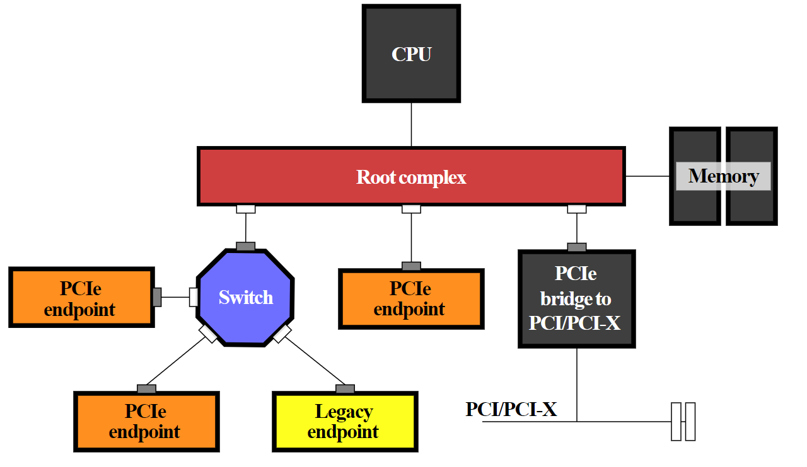

# How to Read lstopo and a PCIe Overview

The first time I looked at `lstopo`, I found the output rather overwhelming so I wrote this guide to break down what I was looking at.

## Subject Platform

Dell R840


### Package

The word package is synonymous with the word socket. In the R840's case there are four separate, physical, sockets.

### Caches (LXi, LXd, and L3)

This in particular confused me at first as the nomenclature is specific to your architecture (ex: Intel or AMD). Here you see three caches LXi, LXd, and L3. L<some_number>i refers to an [instruction cache](./images/18-notes.pdf), L<some_number>d refers to a [data cache](./images/18-notes.pdf), and L3 is a mixed cache including data and instructions. In the Intel architecture the first couple of levels may be dedicated to data or instruction caches but higher levels are mixed.

### Cores

It helps here to look at the output of `lscpu`

```
[root@r8402 ~]# lscpu
Architecture:        x86_64
CPU op-mode(s):      32-bit, 64-bit
Byte Order:          Little Endian
CPU(s):              80
On-line CPU(s) list: 0-79
Thread(s) per core:  2
Core(s) per socket:  10
Socket(s):           4
NUMA node(s):        4
Vendor ID:           GenuineIntel
BIOS Vendor ID:      Intel
CPU family:          6
Model:               85
Model name:          Intel(R) Xeon(R) Gold 5215 CPU @ 2.50GHz
BIOS Model name:     Intel(R) Xeon(R) Gold 5215 CPU @ 2.50GHz
Stepping:            7
CPU MHz:             2643.471
CPU max MHz:         3400.0000
CPU min MHz:         1000.0000
BogoMIPS:            5000.00
Virtualization:      VT-x
L1d cache:           32K
L1i cache:           32K
L2 cache:            1024K
L3 cache:            14080K
NUMA node0 CPU(s):   0,4,8,12,16,20,24,28,32,36,40,44,48,52,56,60,64,68,72,76
NUMA node1 CPU(s):   1,5,9,13,17,21,25,29,33,37,41,45,49,53,57,61,65,69,73,77
NUMA node2 CPU(s):   2,6,10,14,18,22,26,30,34,38,42,46,50,54,58,62,66,70,74,78
NUMA node3 CPU(s):   3,7,11,15,19,23,27,31,35,39,43,47,51,55,59,63,67,71,75,79
```

First we need to understand a bit about computer architecture. In modern servers, you have the physical processors, cores within those processors, and finally logical cores (due to HyperThreading in Intel architectures ar Simultaneous Multi-Threading [SMT] in AMD architectures). AS you can see from the output of `lscpu`, in my server, each processor has 10 cores and each of those cores, due to hyperthreading, has 20 logical cores (as indicated by the NUMA node field). What you are seeing in this part:


are the 10 cores in each proc. Notice that the numbers are in ascending order starting with package L#0 which has cores 0-9, then L#1 has 10-19, on up to 39 in package L#3. Also notice that the output omits some of the procs for space reasons and simply says "10x total" to indicate that there are actually 10 procs total.

You can see that each individual core:


Further has PU L#0 and PU L#1. These refer to the two aforementioned logacl cores created from hyperthreading. 

#### NUMA Nodes

Perhaps more confusing are the smaller numbers. In package L#0 we see P#0, P#4, P#36, P#40, P#44, and P#76 actually drawn. As other posts have mentioned, these correspond to the various [NUMA Nodes](https://en.wikipedia.org/wiki/Non-uniform_memory_access#Cache_coherent_NUMA_(ccNUMA)). As mentioned in Wikipedia, modern architectures use some sort of cache coherent NUMA (ccNUMA). The subject can be quite complicated but a simple explanation is this: we want memory access to be faster. The best way to do this is to literally put the memory closer to the processor. NUMA nodes do this by directly attaching processors to some part of memory. The smaller numbers indicate the logical cores created by HyperThreading. From the output of `lscpu` you can see that all the logical processes shown in package L#0:


are included in NUMA node 0. You may also notice at the top it says NUMANode L#0 P#0 (45GB). This refers to the fact that NUMA node 0 has direct access to 1/4 of the total memory or 45GB. We can confirm this by looking at `cat /proc/meminfo`:

```
[root@r8402 ~]# cat /proc/meminfo
MemTotal:       196207488 kB
MemFree:        191452708 kB
MemAvailable:   191700740 kB
...SNIP...
```

In our example, if a process is running on Core L#0, logical processor P#36, then it can directly access any of the 45GBs directly attached to package L#0. An important note: modern operating systems are NUMA aware and will do their absolute best when you spawn a process to make sure that the memory allocated for that process will be on the same NUMA node. However, let's say that there is some larger process and that multiple threads are sharing access to memory. In this case you may have a scenario where a process is running on logical processor P#5 on package L#1 in which case that process will have to reach out from physical package of L#1 through what's called the [QPI](https://en.wikipedia.org/wiki/Intel_QuickPath_Interconnect) bus, through package L#0, and then gain access to the memory local to package L#0. The [QPI bus](https://en.wikipedia.org/wiki/Intel_QuickPath_Interconnect) is part of the Intel architecture and it provides interconnects between all the physical packages for exactly this purpose. AMD uses something called XGMI. This gets us pretty in the weeds on computer architecture because this actually changes over time. For example, on Intel's newer Skylake processors it is no longer the QPI bus but [ULtra Path Interconnect](https://en.wikipedia.org/wiki/Intel_Ultra_Path_Interconnect) that serves this function so when you're working at this level you have to pay attention to exactly what processor you are using.

Fun fact: When looking at things like [the Technical Guide](https://i.dell.com/sites/csdocuments/Product_Docs/en/dell-emc-poweredge-r7525-technical-guide.pdf) for servers you have to account for this when looking at total PCIe lane availability. The AMD EPYC gen 2/3 processors both support up to 128 PCIe lanes per processor BUT this is a bit misleading. When you have servers like the Dell R7525 (or any other vendor's two socket AMD server like HP's DL385) the two procs are connected via XGMI however XGMI consumes 48 PCIe lanes *per processor* so when doing your calculus you actually only end up seeing 80 per processor for a total of 160.

### PCIe Background

The last part of the diagram we haven't touched on is PCIe. Not to be confused with NUMA, PCIe devices also have locality to processors. Each processor has a certain number of PCIe lanes attached directly to it. Just like memory, if you have a process running on, let's say, package L#3 and it is writing to NVMe drive nvme3n1 that process will write more quickly than a process running on package L#0 which must write across the QPI bus, through package L#3, and then to the drive.

To fully understand how to interpret the PCIe results, it helps to understand a few PCIe basics. This is lengthy but all the things mentioned will help you interpret a potential configuration you might see in lstopo.

#### PCIe Root Complex

All PCIe Express (PCIe) devices connect to the processor and memory through what is called the [PCIe root complex](https://en.wikipedia.org/wiki/Root_complex)



It is important to understand that PCIe devices can write directly to memory in modern architectures without ever touching the CPU. This is generically called Direct Memory Access (DMA). Each PCIe device has some region of memory assigned to it. This gets pretty deep - see [here](https://pcisig.com/sites/default/files/files/PCI_Express_Basics_Background.pdf) for an overview. 

In modern computer architectures, [there is more than one root complex in a system](https://codywu2010.wordpress.com/2015/11/29/how-modern-multi-processor-multi-root-complex-system-assigns-pci-bus-number/) (**NOTE** that link does a good job of explaining things but has references to older architectures with pieces that are no longer in existence [Ex: the platform controller hub (PCH) is no longer a thing]). There is a root complex for every processor on the system.

Now, where this gets confusing is a mixing of terminology. In an attempt to abstract the very architecture-specific nature of PCIe people use different terms like host bridge, root complex, and system on chip, etc. In modern architectures, from a physical perspective, there is no longer a physically separate thing for the root complex. Modern architectures have what is called system on chip (SoC) where all that stuff is built into the processor die (including the PCIe root complex).

#### [PCIe Switches](https://linuxhint.com/pcie-switch/#:~:text=PCIe%20switches%20are%20devices%20that,the%20CPU%20alone%20can%20handle.)

Another concept that can be confusing is that you generally have two different devices which attach to the root complex. Either a PCIe switch or a PCIe endpoint. PCIe works more or less just like a network does and like a network it has switches. Say for example that a manufacturer wants to cram more PCIe devices onto a server than the server actually has PCIe lanes. A real world example: when the new AMD Rome processors dropped, manufacturers rushed to get servers to market. There wasn't time to actually make new motherboards fully supporting all the features the Rome processor offered so they instead modified existing motherboards which lead to some sub-optimal designs which included oversubscribing PCIe (it was not a single vendor that did this - I've seen this across the board). Let's say you have a server that supports 24 NVMe drives on a single backplane but each side of the backplane only has two x8 cables. NVMe drives run at x4 speeds so if you have 12 drives per side of the backplane, you're looking at a total of 48 PCIe lanes required to not have oversubscription. However, you only have 16 lanes available to play with. What do you do? Put a PCIe switch in front of the drives. It works just like an oversubscribed network. So in this case the NVMe drives are oversubscribed at a rate of 48:16 or simplified, 3:1.

Another common use is bifurcation. Let's say you have one x16 lane but you want to use two x8 devices. You can bifurcate the lane to do just that - break a single x16 lane into two x8 lanes. This is where you might also hear the terminology "electrically x16". For example, a vendor might make a riser that allows two x8 devices but in reality, the electrical traces will each independently support x16. The BIOS will let you reconfigure the PCIe switch to instead operate at x16 speeds and you can ignore one of the riser slots.

There are a lot of other fancy uses for PCIe switches but those two are the most common. For example [NVLink](https://www.nvidia.com/en-us/data-center/nvlink/) will let graphics cards talk directly to each other.

#### PCIe Bridge

This term is also overused and confusing. In older architectures there's a lot about connecting to legacy PCI which isn't really a concern in 2022. In 2022 all a bridge does is connect a PCIe slot to the microprocessor responsible for controlling it. Generically, it is just a hardware connection between two different buses.

**[What is the PCIe bus](https://www.easytechjunkie.com/what-is-a-pcie-bus.htm)**: This term is also super confusing in 2022. Way back in the original PCI spec before PCIe was a thing there was a literal parallel bus. As in, you had a whole bunch of devices sharing a physical bus along with all the problems that brings (of which there are many). In PCIe devices aren't attached to this kind of bus. In fact, I find it a bit obnoxious that we even use the word bus (even though it is technically correct). When I see people use the word "bus" in terms of PCIe what they usually mean is the [serial connection](https://computer.howstuffworks.com/pci-express.htm) consisting of multiple bidirectional PCIe lanes connecting the PCIe device (endpoint) to the root complex or PCIe switch.

### Interpreting PCIe

As you might be able to guess, this is extremely device specific.

The numbers shown next to the wires (3.9, 1.2, etc) are the **unrounded** transfer speeds in [gigabytes per second](https://github.com/open-mpi/hwloc/issues/372). The various NVMe devices are fairly self explanatory. However, when it comes to networking, this is where it gets interesting. The network device shown is actually a Dell network daughter card (NDC) and all four interfaces shown in Package L#0 are actually the same network card. I confirmed this by cross referencing the xml output of lstopo with `ip a s`. See below picture


 It would seem that under the hood, for the NDC, Dell actually ran a x4 lane to the two SFP interfaces and a x2 lane for the copper interfaces. This makes sense because those ethernet interfaces are only 1Gb/s. The rest of the devices are as follows:
 
 - Bus 25:00:0 is a BOSS card
 - Bus 00:11.5 is the platform controller hub (PCH)
   - If you're curious why you don't see the iDRAC's ethernet interface, this is because all communication with the iDRAC, assuming you aren't using RMI, goes through the PCH.
 - Bus 03:00.0 is the VGA port
 - For the eagle eyed you may notice the PERC is absent - I have it disconnected right now. It would normally have shown up on package L#0.

#### Understanding PCIe Switches vs Functions

The last thing I thought was a bit hard to descipher without some cross reference 


## Research

### Translation Lookaside Buffer

See: https://en.wikipedia.org/wiki/Translation_lookaside_buffer

A translation lookaside buffer (TLB) is a memory cache that is used to reduce the time taken to  access a user memory location.[1] It is a part of the chip's memory-management unit (MMU). The TLB stores the recent translations of virtual memory to physical memory and can be called an address-translation cache. A TLB may reside between the CPU and the CPU cache, between CPU cache and the main memory or between the different levels of the multi-level cache. The majority of desktop, laptop, and server processors include one or more TLBs in the memory-management hardware, and it is nearly always present in any processor that utilizes paged or segmented virtual memory.

#### TLB Misses

See [18-notes.pdf](./images/18-notes.pdf)

### Data and Instruction Caches

See [18-notes.pdf](./images/18-notes.pdf)

### StackExchange Explanaton of `lstopo`

https://unix.stackexchange.com/a/113549/240147