# How to Set Up PGP with Mailvelope

- Install [mailvelope from here](https://mailvelope.com/en)
- Click on Mailvelope in the browser bar

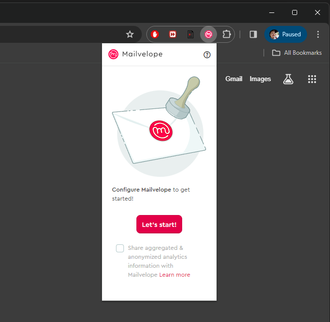

- Click Let's Start
- Click Generate Key

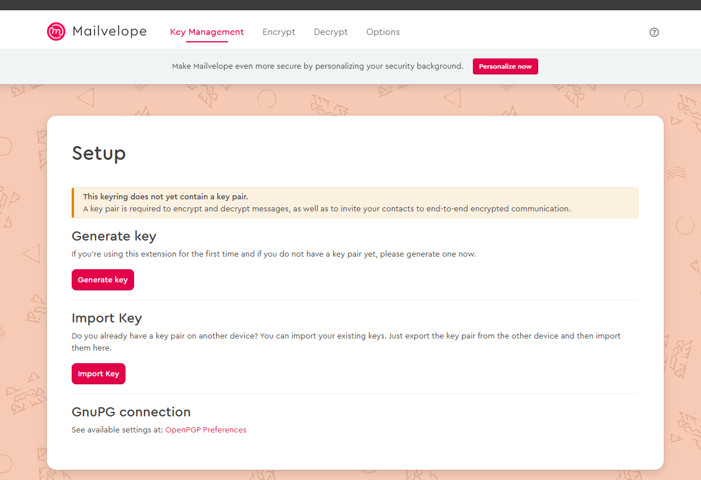

- Under advanced check that the algorithm is RSA and the key size is 4096 (that's the default)
- Fill out your info

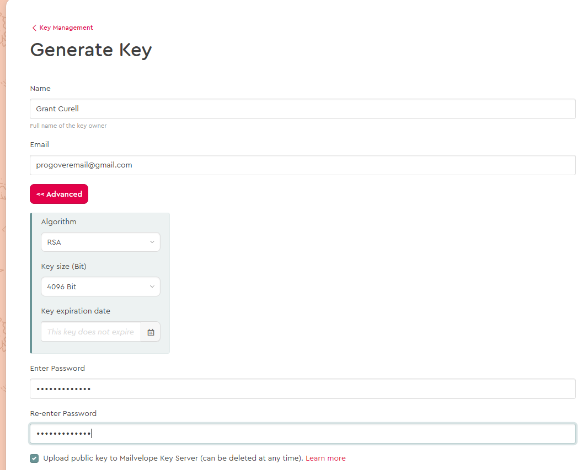

- Click generate
- You should now see something like this under Key Management

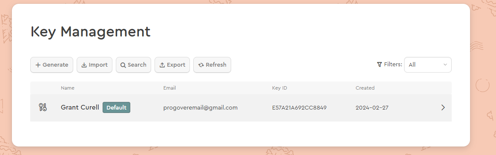

- To import someone else's key click import.
- Drag and drop the key into the window or browse to it

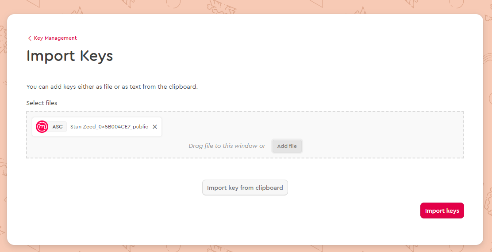

- Click Import Keys
- You should see that the key now has a single key symbol to the left of the name. This indicates it is a public key

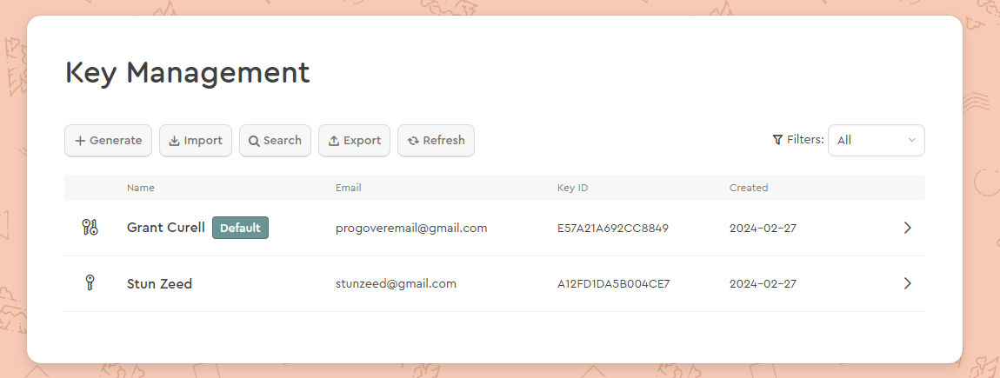

- Go back to your Gmail and verify your account with mailvelope

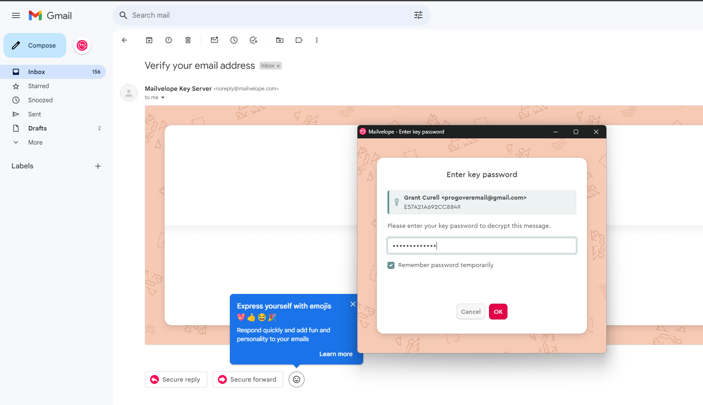

- After verifying you should be redirected to a screen like this:

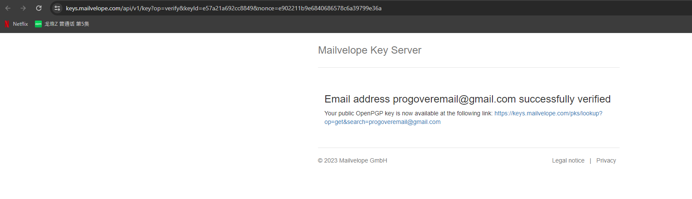

- You can give this weblink to other people so they have your public key and can verify or encrypt e-mails for you.
- Click this button

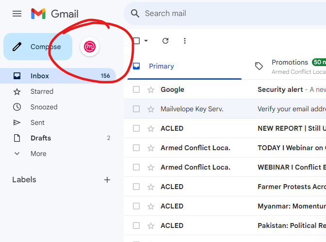

- That should redirect you to a screen like this. You need to authorize mailvelope to have access to your e-mail.

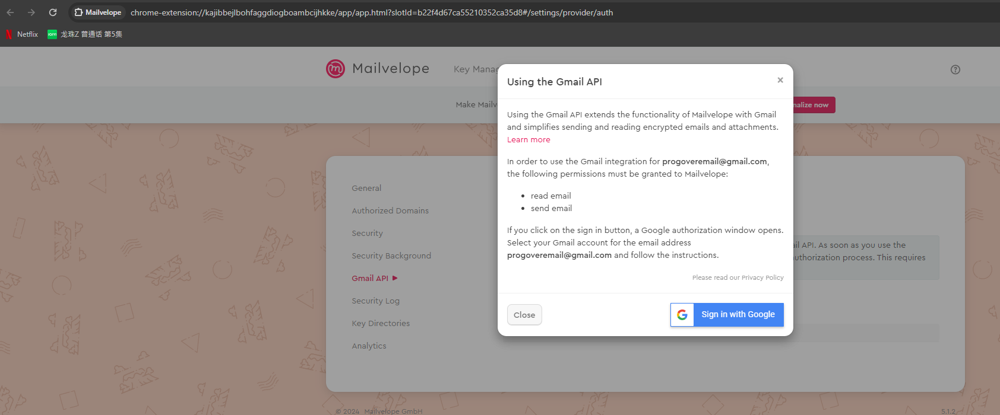

- Now when you compose an e-mail you can use the keys of other people:

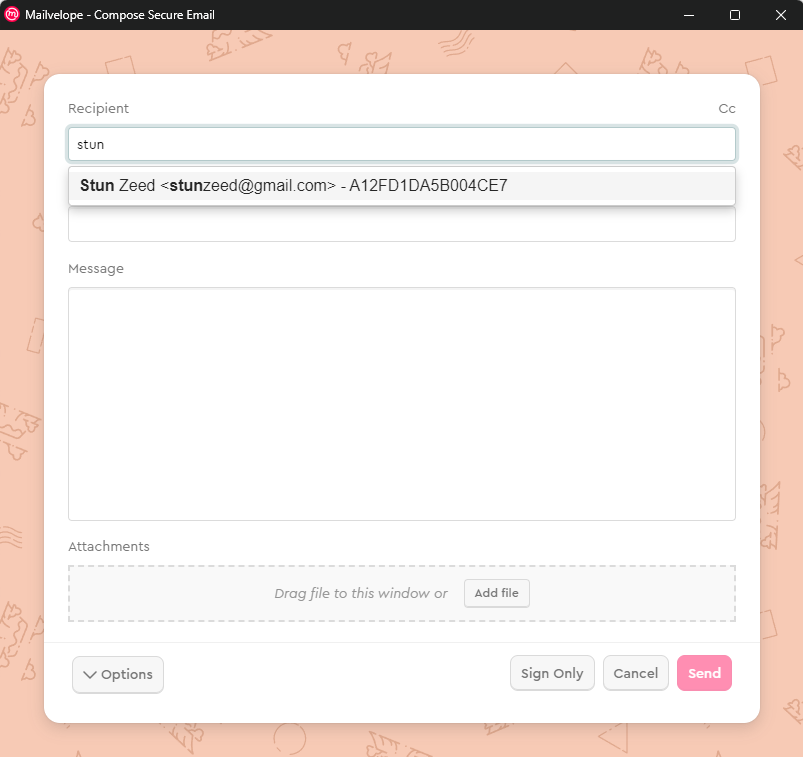