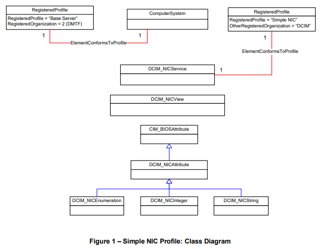
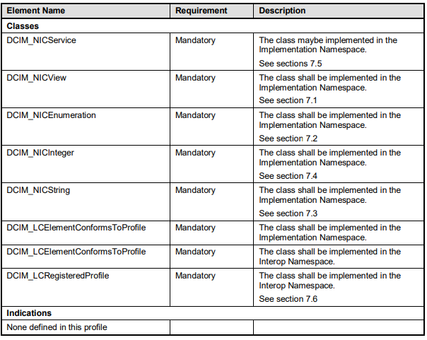

# IO Identities with LifeCycle Controller

## Sources

- [IO Identity Setup Using Lifecycle Controller](images/IO_IdentityWhitePaper.pdf)
- [Dell Simple NIC Profile](images/dell-simple_nic_profile.pdf)
- [Dell SystemInfo Profile](images/Dell_SystemInfo_Profile.pdf)

## Explanation

On a per card basis there is a way to set virtual attributes for all of the following:​
 
- Virtual MAC Address
- Virtual iSCSI
- MAC Address
- Virtual FIP MAC Address
- Virtual WWN
- Virtual WWPN 
 
When you create an identity pool in OME, it leverages this capability under the hood to make it happen. The way it works is Dell seems to provide an upper API capability described here: https://downloads.dell.com/manuals/common/dell-simple_nic_profile.pdf​ via the idrac with a thing called CIM (Common Information Model - see https://downloads.dell.com/solutions/general-solution-resources/White%20Papers/Dell_SystemInfo_Profile.pdf). The common information model is basically our standardized way of representing resources on the idrac. One of those resources is "Simple NIC profile":

 

​
You can see from the spec sheet that the following functions have to be implemented for any given NIC:

The DCIM_NICService class is the one that implements the SetAttributes method mentioned in the white paper. The white paper explores how this is done for each card, but the TLDR is that we really do have a card-specific API implementation for all our major vendors and that is how we are changing this stuff under the hood.