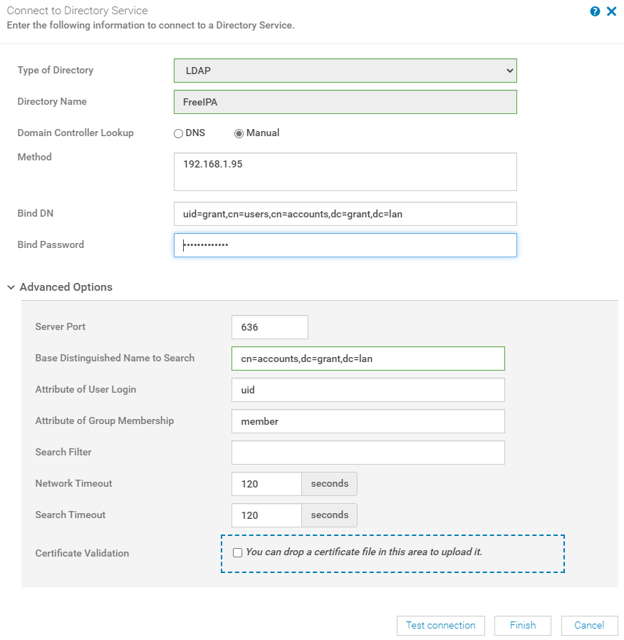

# Setting Up FreeIPA with OpenManage

## My Environment

### RHEL Version

      NAME="Red Hat Enterprise Linux"
      VERSION="8.2 (Ootpa)"
      ID="rhel"
      ID_LIKE="fedora"
      VERSION_ID="8.2"
      PLATFORM_ID="platform:el8"
      PRETTY_NAME="Red Hat Enterprise Linux 8.2 (Ootpa)"
      ANSI_COLOR="0;31"
      CPE_NAME="cpe:/o:redhat:enterprise_linux:8.2:GA"
      HOME_URL="https://www.redhat.com/"
      BUG_REPORT_URL="https://bugzilla.redhat.com/"

      REDHAT_BUGZILLA_PRODUCT="Red Hat Enterprise Linux 8"
      REDHAT_BUGZILLA_PRODUCT_VERSION=8.2
      REDHAT_SUPPORT_PRODUCT="Red Hat Enterprise Linux"
      REDHAT_SUPPORT_PRODUCT_VERSION="8.2"
      Red Hat Enterprise Linux release 8.2 (Ootpa)
      Red Hat Enterprise Linux release 8.2 (Ootpa)

### FreeIPA Version

      [root@centos ~]# ipa --version
      VERSION: 4.8.4, API_VERSION: 2.235

### OpenManage Version

      Version 3.4.1 (Build 24)

## Helpful Resources

[Dell Tutorial](https://www.youtube.com/watch?v=pOojNfNbQ80&ab_channel=DellEMCSupport)

[Logs Explained](https://access.redhat.com/documentation/en-us/red_hat_directory_server/10/html/configuration_command_and_file_reference/logs-reference)

[LDAP Result Codes](https://access.redhat.com/documentation/en-us/red_hat_directory_server/10/html/configuration_command_and_file_reference/LDAP_Result_Codes)

[Helpful Post on Bind DN](https://serverfault.com/questions/616698/in-ldap-what-exactly-is-a-bind-dn)

## Install Instructions

1. Install RHEL
2. Change hostname
      1.`hostname freeipa.grant.lan && hostnamectl set-hostname freeipa.grant.lan`
      2.Change in /etc/hostname
      3.Configure DNS to return for this hostname. Double check with `dig +short freeipa.grant.lan A && dig +short -x 192.168.1.95`
5. Follow [RHEL's instructions](https://access.redhat.com/documentation/en-us/red_hat_enterprise_linux/8/html-single/installing_identity_management/index)
      1.I used Chapter 5 for primary installation
6. 6. Run `kinit admin` - this allows you to use the command line tools otherwise they'll complain about kerberos.
7.  Log into FreeIPA server at `https://<your_hostname>`. In my case, Windows popped up a username and password prompt. That prompt didn't work - I had to exit it and then log into the webGUI.
8.  Go to Users and then directory services in OpenManage. I used the following:
    1.  Note: You can get the Bind DN by running `ldapsearch` from the command line.
9.  Create a new user and new group in the UI and assign the new user to the new group.
10. Install OpenManage
11. Go to Application Settings -> Directory Services

12.  Substitute with your values and then click test. I wasn't able to get this to work with the generic admin user. In the test screen I used that new user to connect to directory services

### Helpful Commands

To start the IPA service use `ipactl start|stop|restart`. You can check the status with `ipactl status`.

## Bug

1. I used the settings defined here:

2. When I went to import the users from a group I received the following:

The code in question:

Below was the value of `u` at runtime:

      [
      {
            "userTypeId":2,
            "objectGuid":null,
            "objectSid":null,
            "directoryServiceId":13483,
            "name":"grantgroup",
            "password":"",
            "userName":"grantgroup",
            "roleId":"10",
            "locked":false,
            "isBuiltin":false,
            "enabled":true
      }
      ]

Error in logs

      [ERROR] 2020-10-22 07:33:08.392 [ajp-bio-8009-exec-2] BaseController - com.dell.enterprise.exception.ui.ConsoleException: error.general_known_error_occurred
      com.dell.enterprise.exception.ui.ConsoleException: error.general_known_error_occurred
            at com.dell.enterprise.controller.console.ADController.importGroups(ADController.java:400) ~[UI.ADPlugin-0.0.1-SNAPSHOT.jar:?]
            at sun.reflect.GeneratedMethodAccessor824.invoke(Unknown Source) ~[?:?]
            at sun.reflect.DelegatingMethodAccessorImpl.invoke(DelegatingMethodAccessorImpl.java:43) ~[?:1.8.0_262]
            at java.lang.reflect.Method.invoke(Method.java:498) ~[?:1.8.0_262]
            at org.springframework.web.method.support.InvocableHandlerMethod.doInvoke(InvocableHandlerMethod.java:205) ~[spring-web-4.3.28.RELEASE.jar:4.3.28.RELEASE]
            at org.springframework.web.method.support.InvocableHandlerMethod.invokeForRequest(InvocableHandlerMethod.java:133) ~[spring-web-4.3.28.RELEASE.jar:4.3.28.RELEASE]
            at org.springframework.web.servlet.mvc.method.annotation.ServletInvocableHandlerMethod.invokeAndHandle(ServletInvocableHandlerMethod.java:97) ~[spring-webmvc-4.3.28.RELEASE.jar:4.3.28.RELEASE]
            at org.springframework.web.servlet.mvc.method.annotation.RequestMappingHandlerAdapter.invokeHandlerMethod(RequestMappingHandlerAdapter.java:854) ~[spring-webmvc-4.3.28.RELEASE.jar:4.3.28.RELEASE]
            at org.springframework.web.servlet.mvc.method.annotation.RequestMappingHandlerAdapter.handleInternal(RequestMappingHandlerAdapter.java:765) ~[spring-webmvc-4.3.28.RELEASE.jar:4.3.28.RELEASE]
            at org.springframework.web.servlet.mvc.method.AbstractHandlerMethodAdapter.handle(AbstractHandlerMethodAdapter.java:85) ~[spring-webmvc-4.3.28.RELEASE.jar:4.3.28.RELEASE]
            at org.springframework.web.servlet.DispatcherServlet.doDispatch(DispatcherServlet.java:967) [spring-webmvc-4.3.28.RELEASE.jar:4.3.28.RELEASE]
            at org.springframework.web.servlet.DispatcherServlet.doService(DispatcherServlet.java:901) [spring-webmvc-4.3.28.RELEASE.jar:4.3.28.RELEASE]
            at org.springframework.web.servlet.FrameworkServlet.processRequest(FrameworkServlet.java:970) [spring-webmvc-4.3.28.RELEASE.jar:4.3.28.RELEASE]
            at org.springframework.web.servlet.FrameworkServlet.doPost(FrameworkServlet.java:872) [spring-webmvc-4.3.28.RELEASE.jar:4.3.28.RELEASE]
            at javax.servlet.http.HttpServlet.service(HttpServlet.java:650) [tomcat-servlet-3.0-api.jar:?]
            at org.springframework.web.servlet.FrameworkServlet.service(FrameworkServlet.java:846) [spring-webmvc-4.3.28.RELEASE.jar:4.3.28.RELEASE]
            at javax.servlet.http.HttpServlet.service(HttpServlet.java:731) [tomcat-servlet-3.0-api.jar:?]
            at org.apache.catalina.core.ApplicationFilterChain.internalDoFilter(ApplicationFilterChain.java:303) [catalina.jar:7.0.76]
            at org.apache.catalina.core.ApplicationFilterChain.doFilter(ApplicationFilterChain.java:208) [catalina.jar:7.0.76]
            at org.apache.tomcat.websocket.server.WsFilter.doFilter(WsFilter.java:52) [tomcat7-websocket.jar:7.0.76]
            at org.apache.catalina.core.ApplicationFilterChain.internalDoFilter(ApplicationFilterChain.java:241) [catalina.jar:7.0.76]
            at org.apache.catalina.core.ApplicationFilterChain.doFilter(ApplicationFilterChain.java:208) [catalina.jar:7.0.76]
            at com.dell.enterprise.filter.ui.CacheControlFilter.doFilterInternal(CacheControlFilter.java:23) [classes/:?]
            at org.springframework.web.filter.OncePerRequestFilter.doFilter(OncePerRequestFilter.java:107) [spring-web-4.3.28.RELEASE.jar:4.3.28.RELEASE]
            at org.springframework.web.filter.DelegatingFilterProxy.invokeDelegate(DelegatingFilterProxy.java:347) [spring-web-4.3.28.RELEASE.jar:4.3.28.RELEASE]
            at org.springframework.web.filter.DelegatingFilterProxy.doFilter(DelegatingFilterProxy.java:263) [spring-web-4.3.28.RELEASE.jar:4.3.28.RELEASE]
            at org.apache.catalina.core.ApplicationFilterChain.internalDoFilter(ApplicationFilterChain.java:241) [catalina.jar:7.0.76]
            at org.apache.catalina.core.ApplicationFilterChain.doFilter(ApplicationFilterChain.java:208) [catalina.jar:7.0.76]
            at org.apache.catalina.filters.SetCharacterEncodingFilter.doFilter(SetCharacterEncodingFilter.java:108) [catalina.jar:7.0.76]
            at org.apache.catalina.core.ApplicationFilterChain.internalDoFilter(ApplicationFilterChain.java:241) [catalina.jar:7.0.76]
            at org.apache.catalina.core.ApplicationFilterChain.doFilter(ApplicationFilterChain.java:208) [catalina.jar:7.0.76]
            at org.apache.shiro.web.servlet.ProxiedFilterChain.doFilter(ProxiedFilterChain.java:61) [shiro-web-1.6.0.jar:1.6.0]
            at org.apache.shiro.web.servlet.AdviceFilter.executeChain(AdviceFilter.java:108) [shiro-web-1.6.0.jar:1.6.0]
            at org.apache.shiro.web.servlet.AdviceFilter.doFilterInternal(AdviceFilter.java:137) [shiro-web-1.6.0.jar:1.6.0]
            at org.apache.shiro.web.servlet.OncePerRequestFilter.doFilter(OncePerRequestFilter.java:125) [shiro-web-1.6.0.jar:1.6.0]
            at org.apache.shiro.web.servlet.ProxiedFilterChain.doFilter(ProxiedFilterChain.java:66) [shiro-web-1.6.0.jar:1.6.0]
            at org.apache.shiro.web.servlet.AdviceFilter.executeChain(AdviceFilter.java:108) [shiro-web-1.6.0.jar:1.6.0]
            at org.apache.shiro.web.servlet.AdviceFilter.doFilterInternal(AdviceFilter.java:137) [shiro-web-1.6.0.jar:1.6.0]
            at org.apache.shiro.web.servlet.OncePerRequestFilter.doFilter(OncePerRequestFilter.java:125) [shiro-web-1.6.0.jar:1.6.0]
            at org.apache.shiro.web.servlet.ProxiedFilterChain.doFilter(ProxiedFilterChain.java:66) [shiro-web-1.6.0.jar:1.6.0]
            at org.apache.shiro.web.servlet.AbstractShiroFilter.executeChain(AbstractShiroFilter.java:450) [shiro-web-1.6.0.jar:1.6.0]
            at org.apache.shiro.web.servlet.AbstractShiroFilter$1.call(AbstractShiroFilter.java:365) [shiro-web-1.6.0.jar:1.6.0]
            at org.apache.shiro.subject.support.SubjectCallable.doCall(SubjectCallable.java:90) [shiro-core-1.6.0.jar:1.6.0]
            at org.apache.shiro.subject.support.SubjectCallable.call(SubjectCallable.java:83) [shiro-core-1.6.0.jar:1.6.0]
            at org.apache.shiro.subject.support.DelegatingSubject.execute(DelegatingSubject.java:387) [shiro-core-1.6.0.jar:1.6.0]
            at org.apache.shiro.web.servlet.AbstractShiroFilter.doFilterInternal(AbstractShiroFilter.java:362) [shiro-web-1.6.0.jar:1.6.0]
            at org.apache.shiro.web.servlet.OncePerRequestFilter.doFilter(OncePerRequestFilter.java:125) [shiro-web-1.6.0.jar:1.6.0]
            at org.springframework.web.filter.DelegatingFilterProxy.invokeDelegate(DelegatingFilterProxy.java:347) [spring-web-4.3.28.RELEASE.jar:4.3.28.RELEASE]
            at org.springframework.web.filter.DelegatingFilterProxy.doFilter(DelegatingFilterProxy.java:263) [spring-web-4.3.28.RELEASE.jar:4.3.28.RELEASE]
            at org.apache.catalina.core.ApplicationFilterChain.internalDoFilter(ApplicationFilterChain.java:241) [catalina.jar:7.0.76]
            at org.apache.catalina.core.ApplicationFilterChain.doFilter(ApplicationFilterChain.java:208) [catalina.jar:7.0.76]
            at com.dell.enterprise.core.integration.lib.common.filter.RequestFilter.doFilter(RequestFilter.java:103) [common-0.0.1-SNAPSHOT.jar:?]
            at org.apache.catalina.core.ApplicationFilterChain.internalDoFilter(ApplicationFilterChain.java:241) [catalina.jar:7.0.76]
            at org.apache.catalina.core.ApplicationFilterChain.doFilter(ApplicationFilterChain.java:208) [catalina.jar:7.0.76]
            at org.apache.catalina.core.StandardWrapperValve.invoke(StandardWrapperValve.java:218) [catalina.jar:7.0.76]
            at org.apache.catalina.core.StandardContextValve.invoke(StandardContextValve.java:110) [catalina.jar:7.0.76]
            at org.apache.catalina.authenticator.AuthenticatorBase.invoke(AuthenticatorBase.java:498) [catalina.jar:7.0.76]
            at org.apache.catalina.core.StandardHostValve.invoke(StandardHostValve.java:169) [catalina.jar:7.0.76]
            at org.apache.catalina.valves.ErrorReportValve.invoke(ErrorReportValve.java:103) [catalina.jar:7.0.76]
            at org.apache.catalina.valves.AccessLogValve.invoke(AccessLogValve.java:962) [catalina.jar:7.0.76]
            at org.apache.catalina.core.StandardEngineValve.invoke(StandardEngineValve.java:116) [catalina.jar:7.0.76]
            at org.apache.catalina.connector.CoyoteAdapter.service(CoyoteAdapter.java:445) [catalina.jar:7.0.76]
            at org.apache.coyote.ajp.AjpProcessor.process(AjpProcessor.java:190) [tomcat-coyote.jar:7.0.76]
            at org.apache.coyote.AbstractProtocol$AbstractConnectionHandler.process(AbstractProtocol.java:637) [tomcat-coyote.jar:7.0.76]
            at org.apache.tomcat.util.net.JIoEndpoint$SocketProcessor.run(JIoEndpoint.java:316) [tomcat-coyote.jar:7.0.76]
            at java.util.concurrent.ThreadPoolExecutor.runWorker(ThreadPoolExecutor.java:1149) [?:1.8.0_262]
            at java.util.concurrent.ThreadPoolExecutor$Worker.run(ThreadPoolExecutor.java:624) [?:1.8.0_262]
            at org.apache.tomcat.util.threads.TaskThread$WrappingRunnable.run(TaskThread.java:61) [tomcat-coyote.jar:7.0.76]
            at java.lang.Thread.run(Thread.java:748) [?:1.8.0_262]

### Further Explanation

The URI endpoint is: https://192.168.1.93/core/api/Console/import-groups

This is the JSON returned from the call.

      {severity: "IGNORE", message: "error.general_known_error_occurred",…}
      debug: false
      details: {error: {code: "Base.1.0.GeneralError",…}}
      error: {code: "Base.1.0.GeneralError",…}
      @Message.ExtendedInfo: [{MessageId: "CGEN1004", RelatedProperties: [],…}]
      code: "Base.1.0.GeneralError"
      message: "A general error has occurred. See ExtendedInfo for more information."
      message: "error.general_known_error_occurred"
      severity: "IGNORE"
      timestamp: "2020-10-21T14:43:44.385-0500"

The errors occurs at: `M.send(y(u) ? null : u)`

See [here](https://developer.mozilla.org/en-US/docs/Web/JavaScript/Reference/Operators/Conditional_Operator#:~:text=The%20conditional%20(ternary)%20operator%20is,if%20the%20condition%20is%20falsy.) for a description of Javascript's ternary operator.

In this case it is saying if `y(u)` is true then the value is set to null, otherwise it is set to `u`. The `y` function is:

    function y(e) {
        return "undefined" == typeof e
    }

It is just a basic check to see if `u` is defined or not. M is an instance of [XMLHttpRequest](https://www.w3schools.com/xml/xml_http.asp). We can see `M` being called with open `M.open(i, s, !0)` where i is "POST" and `s` is "/core/api/Console/import-groups".

The problem occurs because `objectGuid` and `objectSid` are set to null. 

### Resolution

See [duplicate_bug.py](./duplicate_bug.py) for a replication of the problem. Replace the payload:

      {
            "userTypeId":2,
            "objectGuid":null,
            "objectSid":null,
            "directoryServiceId":13483,
            "name":"grantgroup",
            "password":"",
            "userName":"grantgroup",
            "roleId":"10",
            "locked":false,
            "isBuiltin":false,
            "enabled":true
      }

with the data from your instance. I grabbed this out of the javascript debugger. To fix the problem, you have to lookup the uid/gid (which correspond to objectSid and objectGuid respectively) on your LDAP server and replace the null values. I used `ldapsearch` to find mine:

      # grant, users, compat, grant.lan
      dn: uid=grant,cn=users,cn=compat,dc=grant,dc=lan
      objectClass: posixAccount
      objectClass: ipaOverrideTarget
      objectClass: top
      gecos: Grant Curell
      cn: Grant Curell
      uidNumber: 1314600001
      gidNumber: 1314600001
      loginShell: /bin/sh
      homeDirectory: /home/grant
      ipaAnchorUUID:: OklQQTpncmFudC5sYW46OWIzOTYwNDQtMTNhZS0xMWViLTllNzctMDA1MDU2Ym
      U4NGIw
      uid: grant

You can see the `uidNumber` and `gidNumber` fields. Change the payload out in [duplicate_bug.py](./duplicate_bug.py) and it will correctly import the group.

      test_payload = [
        {
              "userTypeId": 2,
              "objectGuid": 1314600001,
              "objectSid": 1314600001,
              "directoryServiceId": 13483,
              "name": "grantgroup",
              "password": "",
              "userName": "grant",
              "roleId": "10",
              "locked": False,
              "isBuiltin": False,
              "enabled": True
        }
      ]
