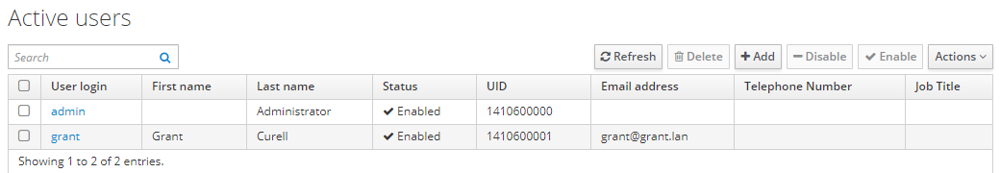
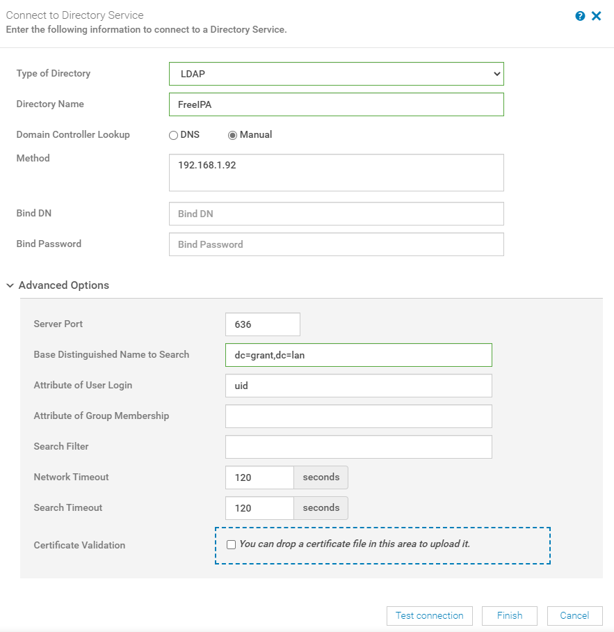
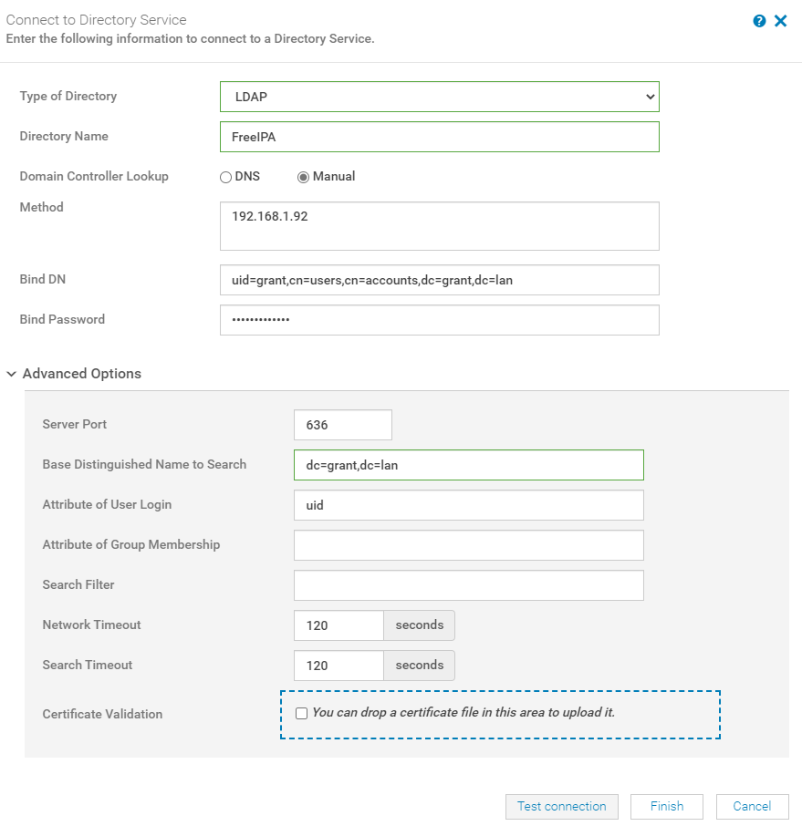
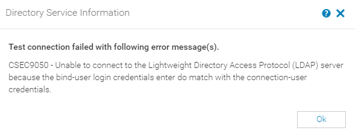
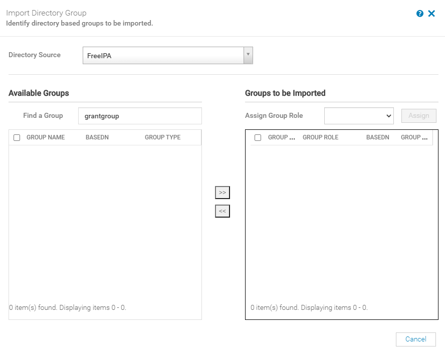

# Setting Up FreeIPA with OpenManage

Conclusion: Currently FreeIPA isn't supported or tested against OpenManage. See [the User's Guide](https://topics-cdn.dell.com/pdf/dell-openmanage-enterprise_users-guide15_en-us.pdf) page 137.

I'm going to try it with OpenLDAP

## My Environment

### CentOS Version

    CentOS Linux release 8.2.2004 (Core)
    NAME="CentOS Linux"
    VERSION="8 (Core)"
    ID="centos"
    ID_LIKE="rhel fedora"
    VERSION_ID="8"
    PLATFORM_ID="platform:el8"
    PRETTY_NAME="CentOS Linux 8 (Core)"
    ANSI_COLOR="0;31"
    CPE_NAME="cpe:/o:centos:centos:8"
    HOME_URL="https://www.centos.org/"
    BUG_REPORT_URL="https://bugs.centos.org/"

    CENTOS_MANTISBT_PROJECT="CentOS-8"
    CENTOS_MANTISBT_PROJECT_VERSION="8"
    REDHAT_SUPPORT_PRODUCT="centos"
    REDHAT_SUPPORT_PRODUCT_VERSION="8"

    CentOS Linux release 8.2.2004 (Core)
    CentOS Linux release 8.2.2004 (Core)

### FreeIPA Version

      [root@centos ~]# ipa --version
      VERSION: 4.8.4, API_VERSION: 2.235

### OpenManage Version

      Version 3.4.1 (Build 24)

## Helpful Resources

[Dell Tutorial](https://www.youtube.com/watch?v=pOojNfNbQ80&ab_channel=DellEMCSupport)

[Logs Explained](https://access.redhat.com/documentation/en-us/red_hat_directory_server/10/html/configuration_command_and_file_reference/logs-reference)

[LDAP Result Codes](https://access.redhat.com/documentation/en-us/red_hat_directory_server/10/html/configuration_command_and_file_reference/LDAP_Result_Codes)

[Helpful Post on Bind DN](https://serverfault.com/questions/616698/in-ldap-what-exactly-is-a-bind-dn)

## Install Instructions

1. Install CentOS8
   1. I installed CentOS minimal
   2. Make sure NTP is working correctly
2. Install OpenManage
3. Install the idm system module with `dnf install -y @idm:DL1 freeipa-server`
4. Configure your DNS server (`/etc/hosts` did not work for me) with a record for the hostname of your FreeIPA server. I added a record for `centos.grant.lan`.
5. Run `ipa-server-install`
   1. If you have any DNS failures edit the file `/tmp/ipa.system.records.tu5qyl09.db` (you may have to change the name) and add the record `centos.grant.lan 86400 IN A 192.168.1.92` (adjust accordingly). Afterwards run `ipa dns-update-system-records`
6. Run `kinit admin`
7. Open firewall ports

        firewall-cmd --add-port=80/tcp --permanent --zone=public
        firewall-cmd --add-port=443/tcp --permanent --zone=public
        firewall-cmd --add-port=389/tcp --permanent --zone=public
        firewall-cmd --add-port=636/tcp --permanent --zone=public
        firewall-cmd --add-port=88/tcp --permanent --zone=public
        firewall-cmd --add-port=464/tcp --permanent --zone=public
        firewall-cmd --add-port=88/udp --permanent --zone=public
        firewall-cmd --add-port=464/udp --permanent --zone=public
        firewall-cmd --add-port=123/udp --permanent --zone=public
        firewall-cmd --reload

8. Log into FreeIPA server at `https://centos.grant.lan`. In my case, Windows popped up a username and password prompt. That prompt didn't work - I had to exit it and then log into the webGUI.
9. Under `Active users` I added an admin user.

10. Go to Users and then directory services in OpenManage. I used the following:
    1.  Note: You can get the Bind DN by running `ldapsearch` from the command line.

### Helpful Commands

To start the IPA service use `ipactl start|stop|restart`. You can check the status with `ipactl status`.

## Testing

### Scenario 1

This got me a working test connection:

#### Output

      [15/Oct/2020:14:09:18.440103345 -0400] conn=107 fd=74 slot=74 SSL connection from 192.168.1.93 to 192.168.1.92
      [15/Oct/2020:14:09:18.484254084 -0400] conn=107 TLS1.2 128-bit AES-GCM
      [15/Oct/2020:14:09:18.484862509 -0400] conn=107 op=0 BIND dn="" method=128 version=3
      [15/Oct/2020:14:09:18.485048511 -0400] conn=107 op=0 RESULT err=0 tag=97 nentries=0 etime=0.044677059 dn=""
      [15/Oct/2020:14:09:18.485743204 -0400] conn=107 op=1 SRCH base="dc=grant,dc=lan" scope=2 filter="(uid=grant)" attrs=ALL
      [15/Oct/2020:14:09:18.487440884 -0400] conn=107 op=1 RESULT err=0 tag=101 nentries=1 etime=0.001795760
      [15/Oct/2020:14:09:18.488143502 -0400] conn=107 op=2 UNBIND
      [15/Oct/2020:14:09:18.488159848 -0400] conn=107 op=2 fd=74 closed - U1
      [15/Oct/2020:14:09:18.491313979 -0400] conn=108 fd=74 slot=74 SSL connection from 192.168.1.93 to 192.168.1.92
      [15/Oct/2020:14:09:18.536590087 -0400] conn=108 TLS1.2 128-bit AES-GCM
      [15/Oct/2020:14:09:18.537372005 -0400] conn=108 op=0 BIND dn="uid=grant,cn=users,cn=compat,dc=grant,dc=lan" method=128 version=3
      [15/Oct/2020:14:09:18.538144502 -0400] conn=108 op=0 RESULT err=0 tag=97 nentries=0 etime=0.046223517 dn="uid=grant,cn=users,cn=accounts,dc=grant,dc=lan"
      [15/Oct/2020:14:09:18.538536207 -0400] conn=108 op=1 UNBIND
      [15/Oct/2020:14:09:18.538566004 -0400] conn=108 op=1 fd=74 closed - U1
      [15/Oct/2020:14:09:28.961238173 -0400] conn=109 fd=74 slot=74 SSL connection from 192.168.1.93 to 192.168.1.92
      [15/Oct/2020:14:09:29.005228025 -0400] conn=109 TLS1.2 128-bit AES-GCM
      [15/Oct/2020:14:09:29.005755286 -0400] conn=109 op=0 BIND dn="" method=128 version=3
      [15/Oct/2020:14:09:29.005931161 -0400] conn=109 op=0 RESULT err=0 tag=97 nentries=0 etime=0.044397507 dn=""
      [15/Oct/2020:14:09:29.006898618 -0400] conn=109 op=1 SRCH base="dc=grant,dc=lan" scope=2 filter="(uid=grant)" attrs=ALL
      [15/Oct/2020:14:09:29.008536186 -0400] conn=109 op=1 RESULT err=0 tag=101 nentries=1 etime=0.001740822
      [15/Oct/2020:14:09:29.009182689 -0400] conn=109 op=2 UNBIND
      [15/Oct/2020:14:09:29.009196697 -0400] conn=109 op=2 fd=74 closed - U1
      [15/Oct/2020:14:09:29.012428320 -0400] conn=110 fd=74 slot=74 SSL connection from 192.168.1.93 to 192.168.1.92
      [15/Oct/2020:14:09:29.057469132 -0400] conn=110 TLS1.2 128-bit AES-GCM
      [15/Oct/2020:14:09:29.058084024 -0400] conn=110 op=0 BIND dn="uid=grant,cn=users,cn=compat,dc=grant,dc=lan" method=128 version=3
      [15/Oct/2020:14:09:29.058825635 -0400] conn=110 op=0 RESULT err=0 tag=97 nentries=0 etime=0.046016675 dn="uid=grant,cn=users,cn=accounts,dc=grant,dc=lan"
      [15/Oct/2020:14:09:29.059166870 -0400] conn=110 op=1 UNBIND
      [15/Oct/2020:14:09:29.059195118 -0400] conn=110 op=1 fd=74 closed - U1

### Scenario 2

When I added a Bind DN as shown in [this video](https://www.youtube.com/watch?v=pOojNfNbQ80&ab_channel=DellEMCSupport) I get a failure.

#### Error Message

#### Log Output

      [15/Oct/2020:14:12:07.504942397 -0400] conn=112 fd=74 slot=74 SSL connection from 192.168.1.93 to 192.168.1.92
      [15/Oct/2020:14:12:07.550456498 -0400] conn=112 TLS1.2 128-bit AES-GCM
      [15/Oct/2020:14:12:07.551077266 -0400] conn=112 op=0 BIND dn="uid=grant,cn=users,cn=accounts,dc=grant,dc=lan" method=128 version=3
      [15/Oct/2020:14:12:07.551767359 -0400] conn=112 op=0 RESULT err=0 tag=97 nentries=0 etime=0.046428458 dn="uid=grant,cn=users,cn=accounts,dc=grant,dc=lan"
      [15/Oct/2020:14:12:07.552283396 -0400] conn=112 op=1 SRCH base="dc=grant,dc=lan" scope=2 filter="(uid=grant)" attrs=ALL
      [15/Oct/2020:14:12:07.553922212 -0400] conn=112 op=1 RESULT err=0 tag=101 nentries=1 etime=0.001752227
      [15/Oct/2020:14:12:07.555518270 -0400] conn=112 op=2 UNBIND
      [15/Oct/2020:14:12:07.555534158 -0400] conn=112 op=2 fd=74 closed - U1

### Scenario 3 - Current Sticking Point

Using the settings from scenario 1, I continued. When trying to add a group though, no groups are displayed in available groups.

#### Output

      [15/Oct/2020:15:19:49.806462707 -0400] conn=169 fd=103 slot=103 SSL connection from 192.168.1.18 to 192.168.1.92
      [15/Oct/2020:15:19:49.856773316 -0400] conn=169 TLS1.2 128-bit AES-GCM
      [15/Oct/2020:15:19:49.858681446 -0400] conn=169 op=0 BIND dn="" method=128 version=3
      [15/Oct/2020:15:19:49.858906917 -0400] conn=169 op=0 RESULT err=0 tag=97 nentries=0 etime=0.051584941 dn=""
      [15/Oct/2020:15:19:49.864335125 -0400] conn=169 op=1 SRCH base="dc=grant,dc=lan" scope=2 filter="(uid=grant)" attrs=ALL
      [15/Oct/2020:15:19:49.866001831 -0400] conn=169 op=1 RESULT err=0 tag=101 nentries=1 etime=0.001790286
      [15/Oct/2020:15:19:49.867368889 -0400] conn=169 op=2 UNBIND
      [15/Oct/2020:15:19:49.867386461 -0400] conn=169 op=2 fd=103 closed - U1
      [15/Oct/2020:15:19:49.873375865 -0400] conn=170 fd=103 slot=103 SSL connection from 192.168.1.18 to 192.168.1.92
      [15/Oct/2020:15:19:49.925956643 -0400] conn=170 TLS1.2 128-bit AES-GCM
      [15/Oct/2020:15:19:49.928180447 -0400] conn=170 op=0 BIND dn="uid=grant,cn=users,cn=compat,dc=grant,dc=lan" method=128 version=3
      [15/Oct/2020:15:19:49.928993026 -0400] conn=170 op=0 RESULT err=0 tag=97 nentries=0 etime=0.053916831 dn="uid=grant,cn=users,cn=accounts,dc=grant,dc=lan"
      [15/Oct/2020:15:19:49.934942058 -0400] conn=170 op=1 SRCH base="dc=grant,dc=lan" scope=2 filter="(&(cn=grantgroup*)(uniqueMember=*))" attrs="cn entryuuid"
      [15/Oct/2020:15:19:49.935438340 -0400] conn=170 op=1 RESULT err=0 tag=101 nentries=0 etime=0.000639539
      [15/Oct/2020:15:19:49.936729725 -0400] conn=170 op=2 UNBIND
      [15/Oct/2020:15:19:49.936744908 -0400] conn=170 op=2 fd=103 closed - U1
