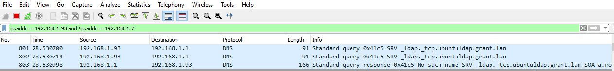
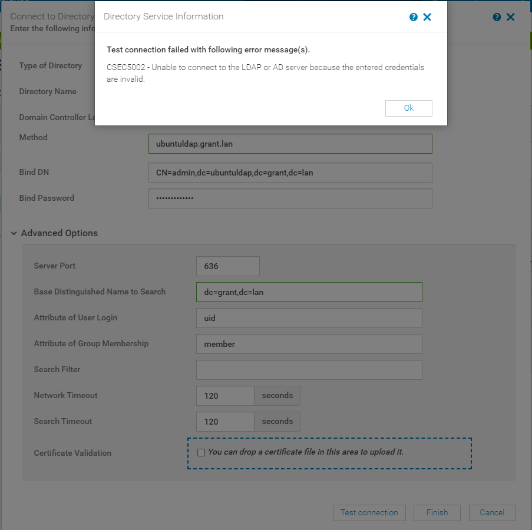

# Setting Up OpenLDAP with OpenManage

## My Environment

### OpenManage Version

      Version 3.5.0 (Build 60)

## Helpful Resources

[Dell Tutorial](https://www.youtube.com/watch?v=pOojNfNbQ80&ab_channel=DellEMCSupport)

[LDAP Result Codes](https://access.redhat.com/documentation/en-us/red_hat_directory_server/10/html/configuration_command_and_file_reference/LDAP_Result_Codes)

[Helpful Post on Bind DN](https://serverfault.com/questions/616698/in-ldap-what-exactly-is-a-bind-dn)

[OpenManage User's Guide](https://topics-cdn.dell.com/pdf/dell-openmanage-enterprise_users-guide15_en-us.pdf)

[Fix This base cannot be created with PLA in phpldapadmin](https://stackoverflow.com/questions/13921030/phpldapadmin-does-not-work-for-an-unknown-reason)

[Turnkey OpenLDAP](https://www.turnkeylinux.org/openldap)

## Instructions

1. Download OpenLDAP appliance from [here](https://www.turnkeylinux.org/download?file=turnkey-openldap-16.0-buster-amd64-vmdk.zip)
      1.Alternatively, you can build it yourself. [This tutorial](https://medium.com/@benjamin.dronen/installing-openldap-and-phpldapadmin-on-ubuntu-20-04-lts-7ef3ca40dc00 is helpful however you will have to add LDAPS for it to work with OpenManage Enterprise.
2. 

## Helpful Commands/Things

### Run slapd in Foreground

`sudo slapd -d 256 -d 128`

### View Database Configuration

The database configuration for OpenLDAP is stored at /etc/ldap/slapd.d

You can find a config your interested in with `grep -R <THING> *`. For example my user config was at `cn\=config/olcDatabase\=\{1\}mdb.ldif`.

### phpldapadmin Config Location

`/etc/phpldapadmin/config.php`

Line 300 has login stuff

### Use a SRV record for Discovery

If you use DNS for Domain Controller Lookup when setting up LDAP what it will do is use a SRV record lookup to find your LDAP server.

If you want discovery to happen this way, you just need to add the appropriate SRV record to your DNS server. I was using PFSense so I added the following in Custom options:

      server:
      local-data: "_ldap._tcp.ubuntuldap.grant.lan 3600 IN SRV 0 100 389 ubuntuldap.grant.lan"

## Potential Bug?

When testing LDAP on OpenManage I noticed it would issue the message "Unable to connect to the LDAP or AD server because the entered credentials are invalid." However, while watching Wireshark I noted this coincided with a failed DNS query.

This error message appears to be a erroneous.

