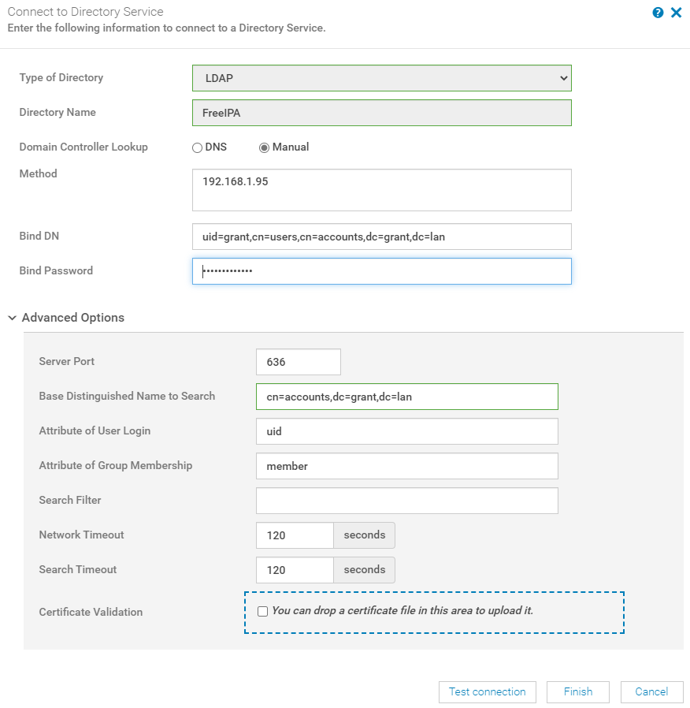

# LDAP with OpenManage

## My Environment

### RHEL Version

      NAME="Red Hat Enterprise Linux"
      VERSION="8.2 (Ootpa)"
      ID="rhel"
      ID_LIKE="fedora"
      VERSION_ID="8.2"
      PLATFORM_ID="platform:el8"
      PRETTY_NAME="Red Hat Enterprise Linux 8.2 (Ootpa)"
      ANSI_COLOR="0;31"
      CPE_NAME="cpe:/o:redhat:enterprise_linux:8.2:GA"
      HOME_URL="https://www.redhat.com/"
      BUG_REPORT_URL="https://bugzilla.redhat.com/"

      REDHAT_BUGZILLA_PRODUCT="Red Hat Enterprise Linux 8"
      REDHAT_BUGZILLA_PRODUCT_VERSION=8.2
      REDHAT_SUPPORT_PRODUCT="Red Hat Enterprise Linux"
      REDHAT_SUPPORT_PRODUCT_VERSION="8.2"
      Red Hat Enterprise Linux release 8.2 (Ootpa)
      Red Hat Enterprise Linux release 8.2 (Ootpa)

### FreeIPA Version

      [root@centos ~]# ipa --version
      VERSION: 4.8.4, API_VERSION: 2.235

### OpenManage Version

      Version 3.4.1 (Build 24)

## Helpful Resources

[Dell Tutorial](https://www.youtube.com/watch?v=pOojNfNbQ80&ab_channel=DellEMCSupport)

[Logs Explained](https://access.redhat.com/documentation/en-us/red_hat_directory_server/10/html/configuration_command_and_file_reference/logs-reference)

[LDAP Result Codes](https://access.redhat.com/documentation/en-us/red_hat_directory_server/10/html/configuration_command_and_file_reference/LDAP_Result_Codes)

[Helpful Post on Bind DN](https://serverfault.com/questions/616698/in-ldap-what-exactly-is-a-bind-dn)

## Install Instructions

1. Install RHEL
2. Change hostname
      1.`hostname freeipa.grant.lan && hostnamectl set-hostname freeipa.grant.lan`
      2.Change in /etc/hostname
      3.Configure DNS to return for this hostname. Double check with `dig +short freeipa.grant.lan A && dig +short -x 192.168.1.95`
5. Follow [RHEL's instructions](https://access.redhat.com/documentation/en-us/red_hat_enterprise_linux/8/html-single/installing_identity_management/index)
      1.I used Chapter 5 for primary installation
      2.Make sure you add the requested DNS entries at the end
6. Run `firewall-cmd --permanent --add-port={80/tcp,443/tcp,389/tcp,636/tcp,88/tcp,464/tcp,88/udp,464/udp,123/udp} && firewall-cmd --reload` to allow the appropriate ports
7. Run `kinit admin` - this allows you to use the command line tools otherwise they'll complain about kerberos.
8.  Log into FreeIPA server at `https://<your_hostname>`. In my case, Windows popped up a username and password prompt. That prompt didn't work - I had to exit it and then log into the webGUI.
    1.  Add a user other than administrator.
9.  Go to Users and then directory services in OpenManage. I used the following:
    1.  Note: You can get the Bind DN by running `ldapsearch` from the command line.
10. Create a new user and new group in the UI and assign the new user to the new group.
11. Install OpenManage
12. Go to Application Settings -> Directory Services

13.  Substitute with your values and then click test. I wasn't able to get this to work with the generic admin user. In the test screen I used that new user to connect to directory services

### Helpful Commands

To start the IPA service use `ipactl start|stop|restart`. You can check the status with `ipactl status`.

Test LDAP credentials: `ldapwhoami -vvv -h 192.168.1.95 -p 389 -D 'uid=grant,cn=users,cn=accounts,dc=grant,dc=lan' -x -w <PASSWORD>`

Dump the structure of FreeIPA: `ldapsearch -x -H ldap://localhost -b "cn=accounts,dc=grant,dc=lan" -D "uid=grant,cn=users,cn=accounts,dc=grant,dc=lan" -w <YOUR_USERS_PASSWORD> | less`
You can also use this to check to see if a user is a member of a group by changing the base path to search (-b). Change it to what you think the FQDN of the group is. The user in question should show up.

## Update FreeIPA Schema

Request received:

      [23/Oct/2020:07:12:13.558111497 -0400] conn=22 fd=101 slot=101 SSL connection from 192.168.1.93 to 192.168.1.95
      [23/Oct/2020:07:12:13.605452505 -0400] conn=22 TLS1.2 128-bit AES-GCM
      [23/Oct/2020:07:12:13.607423551 -0400] conn=22 op=0 BIND dn="uid=grant,cn=users,cn=accounts,dc=grant,dc=lan" method=128 version=3
      [23/Oct/2020:07:12:13.633734712 -0400] conn=22 op=0 RESULT err=0 tag=97 nentries=0 etime=0.075252172 dn="uid=grant,cn=users,cn=accounts,dc=grant,dc=lan"
      [23/Oct/2020:07:12:13.634444660 -0400] conn=22 op=1 SRCH base="cn=accounts,dc=grant,dc=lan" scope=2 filter="(uid=grant)" attrs=ALL
      [23/Oct/2020:07:12:13.636377426 -0400] conn=22 op=1 RESULT err=0 tag=101 nentries=1 etime=0.001994528
      [23/Oct/2020:07:12:13.637728783 -0400] conn=22 op=2 SRCH base="cn=accounts,dc=grant,dc=lan" scope=2 filter="(|(member=uid=grant,cn=users,cn=accounts,dc=grant,dc=lan)(member=grant))" attrs=ALL
      [23/Oct/2020:07:12:13.638251981 -0400] conn=22 op=2 RESULT err=0 tag=101 nentries=2 etime=0.000588138
      [23/Oct/2020:07:12:13.640124457 -0400] conn=23 fd=103 slot=103 SSL connection from 192.168.1.93 to 192.168.1.95
      [23/Oct/2020:07:12:13.684231843 -0400] conn=23 TLS1.2 128-bit AES-GCM
      [23/Oct/2020:07:12:13.685087831 -0400] conn=23 op=0 BIND dn="uid=grant,cn=users,cn=accounts,dc=grant,dc=lan" method=128 version=3
      [23/Oct/2020:07:12:13.685478906 -0400] conn=23 op=0 RESULT err=0 tag=97 nentries=0 etime=0.044995726 dn="uid=grant,cn=users,cn=accounts,dc=grant,dc=lan"
      [23/Oct/2020:07:12:13.686411703 -0400] conn=23 op=1 SRCH base="cn=accounts,dc=grant,dc=lan" scope=2 filter="(|(member=uid=grant,cn=users,cn=accounts,dc=grant,dc=lan)(member=grant))" attrs="entryuuid cn"
      [23/Oct/2020:07:12:13.686675968 -0400] conn=23 op=1 RESULT err=0 tag=101 nentries=2 etime=0.000324070
      [23/Oct/2020:07:12:13.687691917 -0400] conn=23 op=2 UNBIND
      [23/Oct/2020:07:12:13.687704782 -0400] conn=23 op=2 fd=103 closed - U1

      sed -i -e "s/NAME 'ipaUniqueID'/NAME ('ipaUniqueID' 'entryUUID')/" /etc/dirsrv/slapd-*/schema/60basev2.ldif 
      ipa-ldap-updater -u --schema-file=$(ls /etc/dirsrv/slapd-*/schema/60basev2.ldif) 

After making the above modification I now get:

      [23/Oct/2020:08:16:51.891366602 -0400] conn=30 fd=101 slot=101 SSL connection from 192.168.1.93 to 192.168.1.95
      [23/Oct/2020:08:16:51.938289338 -0400] conn=30 TLS1.2 128-bit AES-GCM
      [23/Oct/2020:08:16:51.939209205 -0400] conn=30 op=0 BIND dn="uid=grant,cn=users,cn=accounts,dc=grant,dc=lan" method=128 version=3
      [23/Oct/2020:08:16:51.965507560 -0400] conn=30 op=0 RESULT err=49 tag=97 nentries=0 etime=0.073775627 - Invalid credentials
      [23/Oct/2020:08:16:51.966077916 -0400] conn=30 op=-1 fd=101 closed - B1
      [23/Oct/2020:08:16:51.970300516 -0400] conn=31 fd=101 slot=101 SSL connection from 192.168.1.93 to 192.168.1.95
      [23/Oct/2020:08:16:52.015244484 -0400] conn=31 TLS1.2 128-bit AES-GCM
      [23/Oct/2020:08:16:52.015949382 -0400] conn=31 op=0 BIND dn="" method=128 version=3
      [23/Oct/2020:08:16:52.016032928 -0400] conn=31 op=0 RESULT err=0 tag=97 nentries=0 etime=0.045312604 dn=""
      [23/Oct/2020:08:16:52.017337373 -0400] conn=31 op=1 SRCH base="cn=accounts,dc=grant,dc=lan" scope=2 filter="(|(member=null)(member=grant))" attrs="ipaUniqueID cn"
      [23/Oct/2020:08:16:52.017436879 -0400] conn=31 op=1 RESULT err=0 tag=101 nentries=0 etime=0.000150394
      [23/Oct/2020:08:16:52.018338463 -0400] conn=31 op=2 UNBIND
      [23/Oct/2020:08:16:52.018350155 -0400] conn=31 op=2 fd=101 closed - U1
      [23/Oct/2020:08:20:26.725516663 -0400] conn=21 op=2 SRCH base="ou=sessions,ou=Security Domain,o=ipaca" scope=2 filter="(objectClass=securityDomainSessionEntry)" attrs="cn"
      [23/Oct/2020:08:20:26.725732986 -0400] conn=21 op=2 RESULT err=32 tag=101 nentries=0 etime=0.000316769