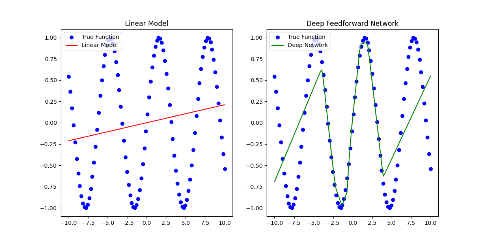

# LLMs Explained

- [LLMs Explained](#llms-explained)
  - [Overview](#overview)
  - [How Transformers Work](#how-transformers-work)
    - [1 - Input Sequence to Encoder Embeddings](#1---input-sequence-to-encoder-embeddings)
    - [1.5 Position Encoding](#15-position-encoding)
      - [Input Embedding: "You are welcome"](#input-embedding-you-are-welcome)
      - [Output Embedding: " de nada"](#output-embedding--de-nada)
      - [Adding Them Together](#adding-them-together)
    - [Encoder Stack Processing](#encoder-stack-processing)
      - [Self Attention](#self-attention)
        - [A Concrete Example](#a-concrete-example)
      - [Attention Heads and Multi Attention Heads](#attention-heads-and-multi-attention-heads)
      - [Layer Normalization](#layer-normalization)
      - [Feed Forward Neural Net](#feed-forward-neural-net)
    - [Prepare and Embed Target Sequence for Decoder](#prepare-and-embed-target-sequence-for-decoder)
    - [Decoder Stack Processing with Encoder Output](#decoder-stack-processing-with-encoder-output)
    - [Output Layer for Word Probabilities](#output-layer-for-word-probabilities)
    - [Loss Function and Back-Propagation](#loss-function-and-back-propagation)
  - [Generative Pre-Trained Transformer (GPT)](#generative-pre-trained-transformer-gpt)
    - [What's so different about GPT models?](#whats-so-different-about-gpt-models)
    - [Going Through an Example](#going-through-an-example)
      - [Input Representation:](#input-representation)
      - [Embedding and Positional Encoding:](#embedding-and-positional-encoding)
      - [Masked Self-Attention](#masked-self-attention)
      - [Feed Forward and Layer Norm](#feed-forward-and-layer-norm)
      - [Output](#output)
    - [Training](#training)
    - [GPT Time Complexity](#gpt-time-complexity)
  - [Retrieval Augmented Generation (RAG)](#retrieval-augmented-generation-rag)
    - [Nearest Neighbor Search](#nearest-neighbor-search)
      - [The General Idea](#the-general-idea)
      - [Algorithms for Nearest Neighbor Searches:](#algorithms-for-nearest-neighbor-searches)
  - [Supplemental Information](#supplemental-information)
    - [Word Embeddings](#word-embeddings)
    - [Weight Matrices](#weight-matrices)
    - [Softmax](#softmax)
    - [Matrix Multiplication](#matrix-multiplication)
      - [Calculating Y](#calculating-y)
    - [Calculate Attention Score](#calculate-attention-score)
    - [Calculate Multi-Attention Head Output](#calculate-multi-attention-head-output)
    - [Calculate Layer Normalization](#calculate-layer-normalization)
    - [Linear Regression Code](#linear-regression-code)
    - [Plot XOR](#plot-xor)
    - [XOR Example](#xor-example)
      - [Using Rectified Linear Units (ReLU)](#using-rectified-linear-units-relu)
    - [Math for FFN](#math-for-ffn)
    - [Decoder Attention Heads](#decoder-attention-heads)
    - [Calculate Encoder-Decoder Output](#calculate-encoder-decoder-output)
    - [What is Cross Entropy Loss](#what-is-cross-entropy-loss)
  - [Other Sources](#other-sources)


## Overview

The purpose of this whitepaper is to explain at a low level how LLMs work such that we can make informed decisions about their performance and architectural decisions. I had trouble finding a single source that walked through all the pieces at a sufficient level of detail so this is more a literature review that further explains the following:

- [GPT: Origin, Theory, Application, and Future](https://www.cis.upenn.edu/wp-content/uploads/2021/10/Tianzheng_Troy_Wang_CIS498EAS499_Submission.pdf#page=14)
- [The Deep Learning Book](https://www.deeplearningbook.org/)
- [Transformers Explained Visually](https://towardsdatascience.com/transformers-explained-visually-part-1-overview-of-functionality-95a6dd460452)
- [Google's Original Paper - Attention is All You Need](https://arxiv.org/abs/1706.03762)

## How Transformers Work

We start by covering how transformers work. Transformers are the core of an LLM model. Below we discover the traditional transformer architecture. GPT-style models do not use the encoders and have what is called a decoder only architecture, but it is difficult to understand that architecture without understanding where it comes from so for this section we cover how the encoder works as well as the decoder.

[This article series](https://towardsdatascience.com/transformers-explained-visually-part-1-overview-of-functionality-95a6dd460452) does a fantastic job of explaining the overarching LLM learning process but there were several parts I didn't immediately understand and moreover it did not provide concrete mathematical examples to illustrate the concepts. I go through and explain the pieces of the article which didn't make sense to me and I have added concrete examples to illustrate the process mathematically.

The below image is an overview model learning and inference process. There are some minor differences between the two processes which I will explain below but at this level they are the same. To illustrate how LLMs work, we will use the example of asking an LLM to translate, "You are welcome" to "De Nada".


[Image Source](https://towardsdatascience.com/transformers-explained-visually-part-1-overview-of-functionality-95a6dd460452)

These are the high level steps which must take place.

1. The input sequence is converted into Embeddings (with Position Encoding) and fed to the Encoder.
2. The stack of Encoders processes this and produces an encoded representation of the input sequence.
3. The target sequence is prepended with a start-of-sentence token, converted into Embeddings (with Position Encoding), and fed to the Decoder.
4. The stack of Decoders processes this along with the Encoder stack’s encoded representation to produce an encoded representation of the target sequence.
5. The Output layer converts it into word probabilities and the final output sequence.
6. The Transformer’s Loss function compares this output sequence with the target sequence from the training data. This loss is used to generate gradients to train the Transformer during back-propagation.

This overview was taken from [here](https://towardsdatascience.com/transformers-explained-visually-part-1-overview-of-functionality-95a6dd460452)

### 1 - Input Sequence to Encoder Embeddings

Let's assume you have a word embedding model that maps each word in the sentence "You are welcome" to a 4-dimensional vector. I use arbitrary numbers for demonstration.

1. **Tokenization**:
    - The sentence "You are welcome" is tokenized into `['You', 'are', 'welcome']`.

2. **[Word Embeddings](#word-embeddings)**:
    - See [Word Embeddings](#word-embeddings) for an explanation of how these work.
    - Assume the embedding model maps 'You' to $[0.1, 0.2, -0.1, 0.4]$.
    - 'are' is mapped to $[-0.3, 0.5, 0.1, -0.2]$.
    - 'welcome' is mapped to $[0.4, -0.3, 0.2, 0.1]$.

3. **Input Matrix \(X\)**:
    - The vectors are stacked to form the input matrix \(X\):

$$
X = \begin{pmatrix} 0.1 & 0.2 & -0.1 & 0.4 \\\ -0.3 & 0.5 & 0.1 & -0.2 \\\ 0.4 & -0.3 & 0.2 & 0.1 \end{pmatrix}
$$

This \(X\) matrix serves as the input to the neural network, and each row corresponds to the embedding of a word in the sentence "You are welcome". 

Now we need to do the same thing for the output embedding. In many sequence-to-sequence models like Transformers used for tasks like machine translation, a special start token (often denoted as `<s>`, `<start>`, or `[START]`) and sometimes an end token (e.g., `<e>`, `<end>`, or `[END]`) are added to sequences. These tokens provide signals for the beginning and end of sequences and help in the generation process.

1. **Tokenization with Start Token**:
    - The phrase "de nada" becomes `['<start>', 'de', 'nada']`.

2. **Word Embeddings**:
    - Assume our embedding model maps `<start>` to $[0.0, 0.0, 0.0, 0.0]$ (just as a placeholder; in practice, it would have a unique representation).
    - 'de' is mapped to $[-0.2, 0.4, 0.3, 0.1]$.
    - 'nada' is mapped to $[0.5, -0.1, -0.4, 0.3]$.

3. **Output Matrix \(Y\)** with the start token:
   
$$ Y = \begin{pmatrix} 0.0 & 0.0 & 0.0 & 0.0 \\\ -0.2 & 0.4 & 0.3 & 0.1 \\\ 0.5 & -0.1 & -0.4 & 0.3 \end{pmatrix} $$

The inclusion of the start token helps the model recognize the beginning of the output sequence. If there's an end token, it can similarly indicate the end of the sequence, especially useful in generation tasks. What I don't show here is a padding but in the actual models you would likely also have a pad. Ex: `['<start>', 'de', 'nada', '<pad>', '<pad>']` to make sure that the input sequences are the same size. This is a feature of the traditional transformer model but will not appear in the GPT-style models.

### 1.5 Position Encoding

In previous models (Recurrent Neural Networks [RNNs] typically), the position of words in a sentence and their mathematical importance were fixed by virtue of the fact that those models operated on each word sequentially. Transformers on the other hand process all words in a batch at the same time drastically reducing training/inference time. This presents a problem because word order matters. Ex: "The cat sat on the mat." is not the same as "The mat sat on the cat." It is important for us to include the position within the sentence as a value within our framework.

To remedy this, Transformers incorporate a mechanism called Position Encoding. This mechanism is designed to infuse the sequence with positional information, ensuring the model can distinguish between "cat sat on the mat" and "mat sat on the cat".

Just as there was an embedding layer for input and output there are also position encoding layers for both input and output. Importantly, the Position Encoding doesn't rely on the specific words in a sequence. Instead, it assigns a unique encoding to each possible position in the sequence. These encodings are predetermined and consistent across all sequences. These encodings are generated using the following formulas:

$$
PE_{(pos, 2i)} = \sin\left(\frac{pos}{10000^{2i/d_{\text{model}}}}\right)
$$
$$
PE_{(pos, 2i+1)} = \cos\left(\frac{pos}{10000^{2i/d_{\text{model}}}}\right)
$$

- where sin is used for even positions and cos is used for odd positions.
- $pos$: Position of the word in the sequence
- $d_{\text{model}}$: Dimensionality of the embeddings
- $i$: Index for the dimension ranging from 0 to $d_{\text{model}}/2 - 1$

The brilliance of this design lies in its ability to provide rich positional context without being tied to the content of the sequence. This ensures that no matter what words are present, the Transformer always understands their order. To continue our other examples:

Alright, let's compute the position encodings using the given equations for both input and output embeddings.

Given:
- $d_{\text{model}}$ is the dimension of the model, which in our case from the earlier examples is 4.
- The $pos$ variable represents the position of the word in the sequence.
- The $i$ variable ranges from 0 to $d_{\text{model}}/2-1$. Since $d_{\text{model}}$ is 4, $i$ will range from 0 to 1.

#### Input Embedding: "You are welcome"

For the input sequence, we have 3 words, so the positions are $pos = 0, 1, 2$.

Using the given equations:

For $pos = 0$:

$$
PE_{(0, 0)} = \sin\left(\frac{0}{10000^{2(0)/4}}\right) = 0\space,\space
PE_{(0, 1)} = \cos\left(\frac{0}{10000^{2(0+1)/4}}\right) = 1\space,\space
PE_{(0, 2)} = \sin\left(\frac{0}{10000^{2(1)/4}}\right) = 0\space,\space
PE_{(0, 3)} = \cos\left(\frac{0}{10000^{2(1+1)/4}}\right) = 1\space,\space
$$

To break that down further:

- $pos = 0$
- $d_{\text{model}} = 4$

- **For $PE_{(0,0)}$**
    Using the formula for even indices (2i):
$$i = 0$$
$$PE_{(0, 2(0))} = \sin\left(\frac{0}{10000^{2(0)/4}}\right)$$

Since $\sin(0)$ is 0, the value is 0.

- **For $PE_{(0,1)}$**
    Using the formula for odd indices (2i+1):
$$i = 0$$
$$PE_{(0, 2(0)+1)} = \cos\left(\frac{0}{10000^{2(0+1)/4}}\right)$$
    
Since $\cos(0)$ is 1, the value is 1.

- **For $PE_{(0,2)}$**
    Using the formula for even indices (2i):
$$i = 1$$
$$PE_{(0, 2(1))} = \sin\left(\frac{0}{10000^{2(1)/4}}\right)$$
    
Again, since $\sin(0)$ is 0, the value is 0.

- **For $PE_{(0,3)}$**
    Using the formula for odd indices (2i+1):
$$i = 1$$
$$PE_{(0, 2(1)+1)} = \cos\left(\frac{0}{10000^{2(1+1)/4}}\right)$$
    
Once more, since $\cos(0)$ is 1, the value is 1.

Following the same pattern for $pos = 1$ and $pos = 2$, we get:

$$ PE_{\text{input}} = \begin{pmatrix} 0 & 1 & 0 & 1 \\\ \sin\left(\frac{1}{10000^0}\right) & \cos\left(\frac{1}{10000^{0.5}}\right) & \sin\left(\frac{1}{10000^2}\right) & \cos\left(\frac{1}{10000^{2.5}}\right) \\\ \sin\left(\frac{2}{10000^0}\right) & \cos\left(\frac{2}{10000^{0.5}}\right) & \sin\left(\frac{2}{10000^2}\right) & \cos\left(\frac{2}{10000^{2.5}}\right) \end{pmatrix} = \begin{pmatrix} 0 & 1 & 0 & 1 \\\ 0.8415 & 0.99995 & 0.0001 & 1 \\\ 0.9093 & 0.9998 & 0.0002 & 1 \end{pmatrix} $$

#### Output Embedding: "<start> de nada"

For the output sequence, we also have 3 words/tokens. The positions again are $pos = 0, 1, 2$.

Using the equations similarly:

$$ PE_{\text{output}} = \begin{pmatrix} 0 & 1 & 0 & 1 \\\ \sin\left(\frac{1}{10000^0}\right) & \cos\left(\frac{1}{10000^{0.5}}\right) & \sin\left(\frac{1}{10000^2}\right) & \cos\left(\frac{1}{10000^{2.5}}\right) \\\ \sin\left(\frac{2}{10000^0}\right) & \cos\left(\frac{2}{10000^{0.5}}\right) & \sin\left(\frac{2}{10000^2}\right) & \cos\left(\frac{2}{10000^{2.5}}\right) \end{pmatrix} = \begin{pmatrix} 0 & 1 & 0 & 1 \\\ 0.8415 & 0.99995 & 0.0001 & 1 \\\ 0.9093 & 0.9998 & 0.0002 & 1 \end{pmatrix} $$

Finally, to incorporate these position encodings into our embeddings, you would simply add the corresponding position encoding to each row of the embedding matrices $X$ and $Y$.

#### Adding Them Together

Given:

$$ X = \begin{pmatrix} 0.1 & 0.2 & -0.1 & 0.4 \\\ -0.3 & 0.5 & 0.1 & -0.2 \\\ 0.4 & -0.3 & 0.2 & 0.1 \end{pmatrix} $$

$$ Y = \begin{pmatrix} 0.0 & 0.0 & 0.0 & 0.0 \\\ -0.2 & 0.4 & 0.3 & 0.1 \\\ 0.5 & -0.1 & -0.4 & 0.3 \end{pmatrix} $$

$$ PE_{\text{input/output}} = \begin{pmatrix} 0 & 1 & 0 & 1 \\\ 0.8415 & 0.99995 & 0.0001 & 1 \\\ 0.9093 & 0.9998 & 0.0002 & 1 \end{pmatrix} $$

$$ X + PE_{\text{input}} = \begin{pmatrix} 0.1 & 1.2 & -0.1 & 1.4 \\\ 0.5415 & 1.49995 & 0.1001 & 0.8 \\\ 1.3093 & 0.6998 & 0.2002 & 1.1 \end{pmatrix} $$

$$ Y + PE_{\text{output}} = \begin{pmatrix} 0.0 & 1.0 & 0.0 & 1.0 \\\ 0.6415 & 1.39995 & 0.3001 & 1.1 \\\ 1.4093 & 0.8998 & -0.3998 & 1.3 \end{pmatrix} $$

Adding position encodings to $Y$:

$$
Y + PE_{\text{output}} = \begin{pmatrix} 0.0 + 0 & 0.0 + 1 & 0.0 + 0 & 0.0 + 1 \\\ -0.2 + 0.8415 & 0.4 + 0.99995 & 0.3 + 0.0001 & 0.1 + 1 \\\ 0.5 + 0.9093 & -0.1 + 0.9998 & -0.4 + 0.0002 & 0.3 + 1 \end{pmatrix} = \begin{pmatrix} 0.0 & 1.0 & 0.0 & 1.0 \\\ 0.6415 & 1.39995 & 0.3001 & 1.1 \\\ 1.4093 & 0.8998 & -0.3998 & 1.3 \end{pmatrix}
$$

These new matrices incorporate both the embeddings and the position information, and they will be used as input to subsequent layers of the Transformer model. One more thing you should take from this is that the contents of the input are independent of the position embedding. The only thing that matters is the position of the word for the position embedding. What we now have is a matrix that contains information on both the relationships of the word and its position in the sentence.

This is visualized well in [this post](https://towardsdatascience.com/transformers-explained-visually-part-2-how-it-works-step-by-step-b49fa4a64f34)


It's worth noting in our example we are only showing a single line of text but in reality you would batch multiple sets of text together in the traditional transformer model. The shape of the matrix will remain unchanged until we reach the final output layer. The other bit of complexity you see in the figure above that we don't here is that realistically the word vector matrix describing the word's relationships would be multidimensional but here we used a basic, two dimensional, matrix.

Now we are ready to move onto encoding.

### Encoder Stack Processing

The encoding process looks like this at a high level as illustrated [here](https://towardsdatascience.com/transformers-explained-visually-part-2-how-it-works-step-by-step-b49fa4a64f34):


At a high level this is what each component does:

- **Self-Attention**: This mechanism allows the model to weigh the importance of different words in the sequence relative to each other. It outputs a matrix of the same size which is a combination of input vectors based on their attention scores.
- **Layer Norm**: After the self-attention mechanism, the output undergoes a layer normalization to stabilize the activations and assist with training.
- **Feed-forward**: The normalized output is passed through a feed-forward neural network. This is present in each transformer block and helps in further transformation of the data.
  - One of the things that wasn't immediately obvious to me was why this exists. It does a couple of things. First, this is where most of the "learning" happens. It is in the feedforward network that the complex relationships between different tokens (words) and general ideas are really stored. Each word is independently transformed by some linear transformation (IE: a matrix operation of some variety be it addition, subtraction, multiplication, division). Secondly, it introduces non-linearity. If you aren't heavy into math it may not be immediately obvious why you care about this. If you have a linear model its performance ends up being roughly the same as some sort of linear regression. That's fine for basic statistical analysis but that's what we have been doing for decades and is hardly going to do anything earth shattering for you. By making the model non-linear it allows it to create a function which more closely approximates complex relationships. Said in a non-mathy way, it is the juice that gets you the cider that is something as fantastic as ChatGPT. Third, it provides depth. What is depth is the question I first had immediately following this explanation. Imagine your model is evaluating pictures. The lowest level might learn rough outlines, maybe some colors or textures, but that's it. Maybe the picture is of a face and at the moderate levels of depth it starts to learn what an eye or a nose look like. Finally, at the deepest levels the model figures out who the picture is of or identifies whether the person is happy or sad.
- **Layer Norm**: Post feed-forward operation, another layer normalization is performed.

#### Self Attention


[Image source](https://towardsdatascience.com/transformers-explained-visually-part-3-multi-head-attention-deep-dive-1c1ff1024853)

The purpose of the self attention portion of the algorithm is explained fantastically in [this paper by Troy Wang](https://www.cis.upenn.edu/wp-content/uploads/2021/10/Tianzheng_Troy_Wang_CIS498EAS499_Submission.pdf#page=11).

> Self-attention is one of the key differentiating characteristics of the transformer model. It is a
> critical component that enables the Transformer to comprehend language contexts intelligently
> [VSP+17].
> The objective of attention can be clearly illustrated by a simple example. Given an input such as
> “Professor Marcus gave some really good advice to Troy, one of his students, because he has
> extensive experiences in the academia.” For a human reader, it is clear that the word “he” in the
> second half of the sentence refers to “Professor Marcus,” instead of his student. But for a computer
> program, it’s not so apparent. There are many such circumstances where grammatical ambiguities
> legally exist, such that rule-based and hard-coded logic would not be sufficient for effective
> language analysis and comprehension [VSP+17][Alammar18].
> This is where self-attention comes into play. When the model processes each token input, self-
> attention enables the model to associate the meaning of the current token with other tokens, such
> as associating “he” with “Professor Marcus” in our previous example, in order to gain better
> knowledge of this current input. In other words, the transformer model learns how to pay attention
> to the context thanks to the self-attention mechanism. It turns out that natural language has a lot of
> sequential dependencies, and thus the ability to incorporate information from previous words in
> the input sequence is critical to comprehending the input [VSP+17][Alammar18].

The actual math of this is a bit confusing so I found it was best to read it first from [our friend Troy Wang](https://www.cis.upenn.edu/wp-content/uploads/2021/10/Tianzheng_Troy_Wang_CIS498EAS499_Submission.pdf#page=11) and then I'll provide a more detailed explanation where I really break down what he is saying.

> Now, let's breakdown the process of computing self-attention. Before computing self-attention, each individual input token is first being converted into a vector using the embedding algorithm that we discussed earlier. Then, for each embedding, we calculate its query vector ($\mathbf{Q}$), key vector ($\mathbf{K}$), and value vector ($\mathbf{V}$) by multiplying the embedding vector with three pre-trained matrices $\mathbf{W_Q}$, $\mathbf{W_K}$, $\mathbf{W_V}$ intended for calculating the three matrices respectively. Notice that the three vectors all have the same dimension, and it does not have to be equal with the dimension of the embedding vectors. The dimensions of the three matrices are the same, and they are all length of the embedding vectors by the length of the ($\mathbf{Q}$), ($\mathbf{K}$), and ($\mathbf{V}$) vectors. Then, for each input embedding, we dot multiply its own $\mathbf{Q}$ vector with every other input embedding's $\mathbf{K}$ vector. At this point, for every input embedding, we have calculated a set of score corresponding to each and every embedding in the input sequence, including itself. Then for each of the embedding, we divide all its scores by the square root of the dimension of the key vectors for more stable gradients and pass the scores through the softmax function for normalization. After this, we multiply each $\mathbf{V}$ vector in the input sequence with its respective softmax score, and finally add up those weighted value vectors. This resulting sum vector is the self-attention of this particular input embedding \[VSP+17\] \[Alammar18\]\[IYA16\].
>
> Although we described the process in terms of vectors, in practice it is implemented by means of matrices. This is because the computation process for each vector independent and identical. We would stack our input embeddings as rows in an input matrix, multiply this matrix with learned weight matrices $W_Q$, $W_K$, $W_V$ and get $(Q)$, $(K)$, and $(V)$ vectors respectively, feed the three resulting matrices into the softmax function as:
>
> $$\text{Attention}(Q, K, V) = \text{softmax}\left(\frac{Q \times K^T}{\sqrt{d_k}}\right) \times V$$
>


[Image source](https://towardsdatascience.com/transformers-explained-visually-part-3-multi-head-attention-deep-dive-1c1ff1024853)

Ok, let's start with explaining what exactly are Q, K, and V because that wasn't immediately obvious to me when I read Wang's paper.

Of course! Let's dive deeper into the roles of the Query (Q), Key (K), and Value (V) matrices in the self-attention mechanism:

1. **Query (Q)**:
      - **Purpose**: The Query matrix is used to represent the current word or token we are focusing on. Think of it as asking a question: "Which words in the sequence are most relevant to this one?" 
      - **Function**: In the self-attention mechanism, the Q vector of a token is used to score how much other tokens should be attended to. By taking the dot product of Q with every K (explained below), we obtain a score that determines how much focus each token in the sequence should have in relation to the current token.
2. **Key (K)**:
      - **Purpose**: The Key matrix represents all the tokens that we will check our current token against to determine their level of similarity or relevance.
      - **Function**: The K vectors are matched against the Q vector to produce attention scores. The intuition is that if a Q vector has a high dot product with a K vector, then the corresponding tokens are relevant to each other. This score indicates the weight or level of attention the model should give to the token represented by that particular K when considering the token represented by Q.
3. **Value (V)**:
      - **Purpose**: The Value matrix represents the actual content of the tokens. While Q and K are used to determine the relationships and relevance among tokens, V provides the content we want to extract based on those relationships.
      - **Function**: Once we have our attention scores (from the Q-K dot products), these scores determine how much of each V vector we take into the final output. If a token is deemed highly relevant, its V vector contributes more to the final representation of the current token.

**An Analogy**:

Imagine you're a spy in a room with multiple people having conversations. You're eavesdropping on one person (the "query"), but you also want to gather context from what everyone else (the "keys") are saying to understand as much as you can.

- The **Q** (Query) is you asking: "Who in this room is relevant to what the target (query) is saying?"
- The **K** (Keys) are the topics each person in the room is talking about. By comparing your query to each topic (taking the dot product of Q and K), you determine who is talking about things most relevant to the person you're focusing on.
- The **V** (Values) are the actual words or content of what each person is saying. Once you've identified the most relevant people based on your query and keys, you take a weighted sum of their words (the V vectors) to get the complete context.

The self-attention mechanism uses this approach to weigh the importance of different tokens in a sequence relative to a particular token, resulting in a rich contextual representation for each token in the input.

Ok, now that we better understand Q, K, and V let's look at the total process from beginning to end and go through an example.

$$\text{Attention}(Q, K, V) = \text{softmax}\left(\frac{Q \times K^T}{\sqrt{d_k}}\right) \times V$$

1. **Calculating Q, K, and V**:
    - **What happens**: Each embedding vector gets transformed into three different vectors: Query (Q), Key (K), and Value (V).
    - **How it happens**: Multiply the embedding vector with three distinct pre-trained matrices ($W_Q$, $W_K$, and $W_V$).
    - **Why it matters**: These vectors serve distinct purposes. Q is used to fetch the attention score, K provides a set of keys to match against, and V serves as a pool of values to fetch from based on those scores.
    - **Relationship to equation**: This step produces the Q, K, and V vectors which are central elements in the equation.

2. **Dot Product between Q and K**:
    - **What happens**: Each Q vector is dot-multiplied with every K vector.
    - **How it happens**: This is simple vector multiplication between Q of a particular token and the K of every other token, resulting in a score.
    - **Why it matters**: This score represents how much attention should be paid to other tokens when encoding information about a particular token.
    - **Relationship to equation**: This step corresponds to the $Q \times K^T$ part of the equation.

3. **Scaling the Scores**:
    - **What happens**: The scores from the previous step are scaled down.
    - **How it happens**: Each score is divided by the square root of the dimension of the K vectors.
    - **Why it matters**: This step ensures stable gradients. Without this scaling, the gradients could be too small for effective learning, especially when the dimensionality (or depth) of the keys is large.
    - **Relationship to equation**: This step is represented by the division by $\sqrt{d_k}$ in the equation.

4. **Applying Softmax**:
    - **What happens**: The scores for each token are turned into a probability distribution using the softmax function.
    - **How it happens**: Softmax normalizes the scores so they're between 0 and 1 and sum up to 1.
    - **Why it matters**: This provides a clear set of attention "weights" for each token. The higher the softmax output, the more attention the model pays to the corresponding token.
    - **Relationship to equation**: This step is captured by the $\text{softmax}(\cdot)$ operation in the equation.

5. **Calculating Weighted Values**:
    - **What happens**: The V vectors are multiplied by the softmax scores.
    - **How it happens**: Each token's V vector is weighted by the token's respective softmax score from the previous step.
    - **Why it matters**: This step essentially picks out values from the V vectors proportional to the attention scores. Tokens deemed more relevant contribute more to the final output.
    - **Relationship to equation**: This step corresponds to the $\times V$ at the end of the equation, where the weighted values from the softmax operation are combined with V.

6. **Summing Weighted Values**:
    - **What happens**: The weighted V vectors are summed up.
    - **How it happens**: A simple vector summation.
    - **Why it matters**: The resulting vector is the final output for a particular token, which is a combination of features from other tokens based on the attention scores.
    - **Relationship to equation**: This summation is implied in the matrix multiplication in the equation. The result of the $\text{softmax}(\cdot) \times V$ operation is the summed attention output for each token.

7. **Matrix Computations in Practice**:
    - **What happens**: The operations described above, while explained using vectors, are in practice executed using matrices.
    - **How it happens**: Instead of processing tokens one-by-one, all tokens are processed simultaneously by stacking embeddings into a matrix and using matrix multiplication for efficiency.
    - **Why it matters**: Matrix operations are highly optimized and parallelizable, making the computations significantly faster, especially on hardware like GPUs.
    - **Relationship to equation**: The use of Q, K, and V in the equation reflects these matrix computations.

8. **The Attention Output**:
    - The equation one last time:

$$
\text{Attention}(Q, K, V) = \text{softmax}\left(\frac{Q \times K^T}{\sqrt{d_k}}\right) \times V
$$

  - This formula captures the essence of the self-attention mechanism. The product of Q and $K^T$ gives attention scores, which after scaling and softmax, are used to weigh the V values.

##### A Concrete Example

Given the above steps for calculating self-attention, let's break it down:
1. **Create Query (Q), Key (K), and Value (V) Matrices**: We obtain these by multiplying the input embeddings (with position encodings) with the weight matrices $W_Q$, $W_K$, and $W_V$ respectively. 

For the sake of this example, we will assume these weight matrices are:

$$
W_Q = \begin{pmatrix} 1 & 0 & 0 & 1 \\\\ 0 & 1 & 1 & 0 \\\\ 0 & 1 & 0 & 1 \\\\ 1 & 0 & 1 & 0 \end{pmatrix}
$$

$$
W_K = \begin{pmatrix} 0 & 1 & 1 & 0 \\\\ 1 & 0 & 0 & 1 \\\\ 1 & 0 & 1 & 0 \\\\ 0 & 1 & 0 & 1 \end{pmatrix}
$$

$$
W_V = \begin{pmatrix} 1 & 1 & 0 & 0 \\\\ 0 & 0 & 1 & 1 \\\\ 0 & 1 & 1 & 0 \\\\ 1 & 0 & 0 & 1 \end{pmatrix}
$$

2. **Compute Q, K, and V**: Multiply the input matrix $X$ with these weights:
  
$$
Q = X \times W_Q
$$

$$
K = X \times W_K
$$

$$
V = X \times W_V
$$

3. **Calculate Attention Scores**: This is done by multiplying $Q$ with $K^T$, then dividing by the square root of the dimension of the key vectors $d_k$. In our example, $d_k$ is 4.
  
$$
Score = \frac{Q \times K^T}{\sqrt{d_k}}
$$

4. **Apply Softmax to the Scores**: This will give each word's attention score.
  
$$
SoftmaxScore = \text{softmax}(Score)
$$
  
5. **Multiply Softmax Score with V**: This will give the weighted representation of the input with respect to other words in the sentence.
  
$$
AttentionOutput = SoftmaxScore \times V
$$

Let's calculate the matrices Q, K, V, Score, SoftmaxScore, and AttentionOutput:

To begin, we will compute the $Q$, $K$, and $V$ matrices.

Using:

$$ X + PE_{\text{input}} = \begin{pmatrix} 0.1 & 1.2 & -0.1 & 1.4 \\\ -0.3 + \sin\left(\frac{1}{10000^0}\right) & 0.5 + \cos\left(\frac{1}{10000^{0.5}}\right) & 0.1 + \sin\left(\frac{1}{10000^2}\right) & -0.2 + \cos\left(\frac{1}{10000^{2.5}}\right) \\\ 0.4 + \sin\left(\frac{2}{10000^0}\right) & -0.3 + \cos\left(\frac{2}{10000^{0.5}}\right) & 0.2 + \sin\left(\frac{2}{10000^2}\right) & 0.1 + \cos\left(\frac{2}{10000^{2.5}}\right) \end{pmatrix} $$

Given the weight matrices:

$$ W_Q = \begin{pmatrix} 1 & 0 & 0 & 1 \\\ 0 & 1 & 1 & 0 \\\ 0 & 1 & 0 & 1 \\\ 1 & 0 & 1 & 0 \end{pmatrix} $$
$$ W_K = \begin{pmatrix} 0 & 1 & 1 & 0 \\\ 1 & 0 & 0 & 1 \\\ 1 & 0 & 1 & 0 \\\ 0 & 1 & 0 & 1 \end{pmatrix} $$
$$ W_V = \begin{pmatrix} 1 & 1 & 0 & 0 \\\ 0 & 0 & 1 & 1 \\\ 0 & 1 & 1 & 0 \\\ 1 & 0 & 0 & 1 \end{pmatrix} $$

1. Compute $Q$:
  
$$
Q = (X + PE_{\text{input}}) \times W_Q
$$

2. Compute $K$:
  
$$
K = (X + PE_{\text{input}}) \times W_K
$$

3. Compute $V$:
  
$$
V = (X + PE_{\text{input}}) \times W_V
$$

Let's calculate these values:

First, let's compute the `Q` matrix using our input matrix \( X + PE_{\text{input}} \) and the \( W_Q \) matrix:

$$
Q = (X + PE_{\text{input}}) \times W_Q
$$

Given:

$$ X + PE_{\text{input}} = \begin{pmatrix} 0.1 & 1.2 & -0.1 & 1.4 \\\ -0.3 + \sin\left(\frac{1}{10000^0}\right) & 0.5 + \cos\left(\frac{1}{10000^{0.5}}\right) & 0.1 + \sin\left(\frac{1}{10000^2}\right) & -0.2 + \cos\left(\frac{1}{10000^{2.5}}\right) \\\ 0.4 + \sin\left(\frac{2}{10000^0}\right) & -0.3 + \cos\left(\frac{2}{10000^{0.5}}\right) & 0.2 + \sin\left(\frac{2}{10000^2}\right) & 0.1 + \cos\left(\frac{2}{10000^{2.5}}\right) \end{pmatrix} $$

$$ W_Q = \begin{pmatrix} 1 & 0 & 0 & 1 \\\ 0 & 1 & 1 & 0 \\\ 0 & 1 & 0 & 1 \\\ 1 & 0 & 1 & 0 \end{pmatrix} $$

When you multiply the above matrices, you get:

$$ Q = \begin{pmatrix} 1.5 & 1.1 & 2.6 & 0 \\\ 1.3415 & 1.6 & 2.3 & 0.6415 \\\ 2.4093 & 0.8998 & 1.7998 & 1.5093 \end{pmatrix} $$

If your matrix multiplication is rusty see [the matrix math behind this calculation](#matrix-multiplication).

We compute the $K$ matrix using our input matrix $X + PE_{\text{input}}$ and the $W_K$ matrix:

$$
K = (X + PE_{\text{input}}) \times W_K
$$

Given:

$$ X + PE_{\text{input}} = \begin{pmatrix} 0.1 & 1.2 & -0.1 & 1.4 \\\ -0.3 + \sin\left(\frac{1}{10000^0}\right) & 0.5 + \cos\left(\frac{1}{10000^{0.5}}\right) & 0.1 + \sin\left(\frac{1}{10000^2}\right) & -0.2 + \cos\left(\frac{1}{10000^{2.5}}\right) \\\ 0.4 + \sin\left(\frac{2}{10000^0}\right) & -0.3 + \cos\left(\frac{2}{10000^{0.5}}\right) & 0.2 + \sin\left(\frac{2}{10000^2}\right) & 0.1 + \cos\left(\frac{2}{10000^{2.5}}\right) \end{pmatrix} $$

$$ W_Q = \begin{pmatrix} 1 & 0 & 0 & 1 \\\ 0 & 1 & 1 & 0 \\\ 0 & 1 & 0 & 1 \\\ 1 & 0 & 1 & 0 \end{pmatrix} $$

When you multiply the above matrices, you get:

$$ Q = \begin{pmatrix} 1.5 & 1.1 & 2.6 & 0 \\\ 1.3415 & 1.6 & 2.3 & 0.6415 \\\ 2.4093 & 0.8998 & 1.7998 & 1.5093 \end{pmatrix} $$

Finally we do the math for $V$. $X + PE_{\text{input}}$ and the $W_V$ matrix:

$$
V = (X + PE_{\text{input}}) \times W_V
$$

Given:

$$ X + PE_{\text{input}} = \begin{pmatrix} 0.1 & 1.2 & -0.1 & 1.4 \\\ -0.3 + \sin\left(\frac{1}{10000^0}\right) & 0.5 + \cos\left(\frac{1}{10000^{0.5}}\right) & 0.1 + \sin\left(\frac{1}{10000^2}\right) & -0.2 + \cos\left(\frac{1}{10000^{2.5}}\right) \\\ 0.4 + \sin\left(\frac{2}{10000^0}\right) & -0.3 + \cos\left(\frac{2}{10000^{0.5}}\right) & 0.2 + \sin\left(\frac{2}{10000^2}\right) & 0.1 + \cos\left(\frac{2}{10000^{2.5}}\right) \end{pmatrix} $$

$$ W_V = \begin{pmatrix} 0 & 0 & 1 & 1 \\\ 1 & 1 & 0 & 0 \\\ 0 & 1 & 0 & 1 \\\ 1 & 0 & 1 & 0 \end{pmatrix} $$

Multiplying the matrices, we get:

$$ V = \begin{pmatrix} 1.5 & 0 & 1.1 & 2.6 \\\ 1.3415 & 0.6416 & 1.6001 & 2.3 \\\ 2.4093 & 1.5095 & 0.9 & 1.7998 \end{pmatrix} $$

We perform the [same calculations](#calculating-y) for $Y$. Here are the results:

$$ \text{Q} = \begin{pmatrix} 1 & 1 & 2 & 0 \\\ 1.7415 & 1.7001 & 2.5 & 0.9416 \\\ 2.7093 & 0.5 & 2.1998 & 1.0095 \end{pmatrix} $$
$$ \text{K} = \begin{pmatrix} 1 & 1 & 0 & 2 \\\ 1.7001 & 1.7415 & 0.9416 & 2.5 \\\ 0.5 & 2.7093 & 1.0095 & 2.1998 \end{pmatrix} $$
$$ \text{V} = \begin{pmatrix} 1 & 0 & 1 & 2 \\\ 1.7415 & 0.9416 & 1.7001 & 2.5 \\\ 2.7093 & 1.0095 & 0.5 & 2.1998 \end{pmatrix} $$

This gives us the $V$ matrix. With $Q$, $K$, and $V$ matrices in hand, you're ready to compute the attention scores and proceed with the self-attention mechanism.

Next we need to calculate the attention score with:

$$\text{Attention}(Q, K, V) = \text{softmax}\left(\frac{Q \times K^T}{\sqrt{d_k}}\right) \times V$$

I did this with [this python code](#calculate-attention-score):

$$ \text{Attention}(Q, K, V) = \begin{pmatrix} 2.11372594 & 1.21488963 & 1.06582258 & 1.96465889 \\\ 2.10729705 & 1.1957622 & 1.06288922 & 1.97442407 \\\ 1.82115196 & 0.90157546 & 1.21880742 & 2.13838393 \end{pmatrix} $$

It's worth mentioning that the result of this portion of the equation (before we multiply by $V$):

$$\text{softmax}\left(\frac{Q \times K^T}{\sqrt{d_k}}\right)$$

the result is:

$$\begin{pmatrix} 0.07057112 & 0.21671075 & 0.71271813 \\ 0.08861574 & 0.2073653 & 0.70401897 \\ 0.16858447 & 0.40724309 & 0.42417243 \end{pmatrix}$$

Notice how, as we expected with softmax, each row of the matrix adds to one. This is what is creating our probability distribution.

#### Attention Heads and Multi Attention Heads

I will not do all the math here as it is an exact repeat of what we have above, but the actual models will use multiple attention heads. Each attention head "pays attention" to different parts of the sentence. The goal being to avoid a few tokens (words) having an outsized impact on the output. We want to pay attention to the totality of the sentence.

Consider a sentence like "Jane, who recently graduated from Harvard, is starting her new job at Google." In this sentence, the words "Harvard" and "Google" are likely to have high attention scores because they are proper nouns and often important in text. 

- **Single-Head Attention**: If you're using single-head attention to find out where Jane is starting her job, the model might give high attention to both "Harvard" and "Google". This could be misleading because the word "Harvard" isn't relevant to the query about Jane's new job, even though it's generally an important token.
- **Multi-Head Attention**: In contrast, one head could focus on "Jane" and "job," while another head could focus on "Harvard" and "Google," and yet another head could focus on "recently graduated" and "starting." This way, the model can capture both the important context provided by "Harvard" and the fact that "Google" is where she is starting her new job, without letting the importance of "Harvard" overshadow the relevance of "Google" to the query.

Returning to [Troy Wang's paper](https://www.cis.upenn.edu/wp-content/uploads/2021/10/Tianzheng_Troy_Wang_CIS498EAS499_Submission.pdf#page=12):

> One problem of the self-attention layer is that by only using a single set of trained matrices \( Q, K, \) and \( V \), the self-attention could be dominated by just one or a few tokens, and thereby not being able to pay attention to multiple places that might be meaningful. Therefore, by using multi-heads, we aim to linearly combine the results of many independent self-attention computations, and thereby expand the self-attention layer's ability to focus on different positions \[VSP+17\] \[Alammar18\].
>
> More concretely, we use multiple sets of mutually independent \( (Q), (K), \) and \( (V) \) matrices, each being randomly initialized and independently trained. With multiple \( (Q), (K), \) and \( (V) \) matrices, we end up with multiple resulting vectors for every input token vector. Nonetheless, the feedforward neural network in the next step is designed to only accept one vector per word input. In order to combine those vectors, we concatenate them into a single vector and then multiply it with another weight vector which is trained simultaneously.
>
> Formally, this multi-head attention is defined as 
>
> $$
> MultiHead(Q, K, V) = Concat(head_1, ..., head_h) W_O
> $$
> 
> where $head_i = Attention(Q W_i^Q, K W_i^K, V W_i^V)$

What this would actually look like. Here we just make up some matrix and assume that it is the output from head 2; it would have been generated exactly as we did the output from the first head.

1. **Compute for Head 2**:  

First, let's assume the output of the second attention head (`head_2`) is:

$$ \text{Attention}_2(Q, K, V) = \begin{pmatrix} 1.5 & 0.8 & 1.2 & 2.0 \\\ 1.6 & 0.9 & 1.1 & 2.1 \\\ 1.4 & 0.7 & 1.3 & 1.9 \end{pmatrix} $$

2. **Concatenate Outputs**:  

Now, we concatenate the outputs of `head_1` and `head_2`:

$$ \text{Concat}(\text{Attention}_1, \text{Attention}_2) = \begin{pmatrix} 2.11372594 & 1.21488963 & 1.06582258 & 1.96465889 & 1.5 & 0.8 & 1.2 & 2.0 \\\ 2.10729705 & 1.1957622 & 1.06288922 & 1.97442407 & 1.6 & 0.9 & 1.1 & 2.1 \\\ 1.82115196 & 0.90157546 & 1.21880742 & 2.13838393 & 1.4 & 0.7 & 1.3 & 1.9 \end{pmatrix} $$

3. **Final Linear Projection**:  
   Finally, we multiply the concatenated matrix with a learned projection matrix $W_O$. For the sake of simplicity in this example, let's assume $W_O$ is an 8x4 matrix filled with 0.5. In a real-world scenario, this matrix would have learned values.

I generated random values for $W_O$ but in reality this would start random and the model would train these values over time.

$$ W_O = \begin{pmatrix} 0.37738326 & 0.83274845 & 0.37280978 & 0.14584743 \\\ 0.28706851 & 0.29072609 & 0.69116998 & 0.20106682 \\\ 0.26764653 & 0.12058646 & 0.82634382 & 0.60818759 \\\ 0.44329703 & 0.4425581 & 0.89811744 & 0.24551412 \\\ 0.9186323 & 0.40029736 & 0.17636762 & 0.06896409 \\\ 0.41921272 & 0.0495383 & 0.77792527 & 0.4354529 \\\ 0.14791365 & 0.66822966 & 0.48313699 & 0.94127396 \\\ 0.11604641 & 0.51794357 & 0.62942357 & 0.76420883 \end{pmatrix} $$


Multiply the two together:

The final multi-head attention output will be:

$$ \text{Concat}(\text{Attention}_1, \text{Attention}_2) = \begin{pmatrix} 2.11372594 & 1.21488963 & 1.06582258 & 1.96465889 & 1.5 & 0.8 & 1.2 & 2.0 \\\ 2.10729705 & 1.1957622 & 1.06288922 & 1.97442407 & 1.6 & 0.9 & 1.1 & 2.1 \\\ 1.82115196 & 0.90157546 & 1.21880742 & 2.13838393 & 1.4 & 0.7 & 1.3 & 1.9 \end{pmatrix} $$

I don't want to get too into the weeds on this, but it is worth making a brief note on why this is better than RNN. The short version is it's faster. For starters, all the calculations for each attention head can run in parallel completely independently.

The other great part is that the calculation is independent of input length. You could feed in 1000 words or 500 and the attention calculation runs at the same speed.


#### Layer Normalization

As the model trains itself, problems frequently arise. For example:

Without layer normalization, the model could suffer from issues related to the internal covariate shift. Here's a simple example:

Let's say we have a neural network for binary classification and a layer that takes two features $x_1$ and $x_2$ as input. Initially, $x_1$ and $x_2$ are both in the range of [0, 1].

1. **First Epoch**: The model learns some weights and biases based on $x_1$ and $x_2$.
2. **Second Epoch**: We add new features, or the features themselves change distribution, such that $x_1$ is now in the range of [0, 1000] while $x_2$ remains in [0, 1].

Without layer normalization, this change in feature scale will make the previously learned weights and biases less useful, and the model may need a lot of time to adjust to this new scale. It might even diverge and fail to train.

In contrast, if we use layer normalization, the inputs are rescaled to have zero mean and unit variance, making it easier for the model to adapt to the new data distribution. Layer normalization keeps the scales consistent, making training more stable.

After layer normalization is applied the results won't be restricted to a specific range like [0, 1] or [-1, 1] as in the case of some other normalization techniques. Instead, layer normalization will center the data around zero and will scale based on the standard deviation, but there's no hard constraint on the range of the output values.

However, after layer normalization, the mean of each row (or each example, in the context of a neural network) will be approximately 0, and the standard deviation will be approximately 1. The actual values can be positive or negative and can exceed the range of [-1, 1], depending on the original data and its distribution.

Layer normalization is applied to each data point within a given example, rather than across examples in the dataset (which is what batch normalization does). 

Given matrix $M$:

$$ M = \begin{pmatrix} 4.42554033 & 5.589241 & 6.99844643 & 4.79288192 \\\ 4.55176485 & 5.6122494 & 7.09923364 & 4.82144704 \\\ 4.21254506 & 5.31988824 & 6.84520426 & 4.79017392 \end{pmatrix} $$

The layer normalization for each row (example) in $M$ is calculated as:

$$
\text{LN}(x_i) = \gamma \times \frac{x_i - \mu}{\sqrt{\sigma^2 + \epsilon}} + \beta
$$

- $x_i$ is the input vector (a row in $M$ in our case).
- $\mu$ is the mean of $x_i$.
- $\sigma^2$ is the variance of $x_i$.
- $\gamma$ and $\beta$ are learnable parameters, which can be set to 1 and 0 respectively for simplification.
- $\epsilon$ is a small constant added for numerical stability (can be set to $1e-6$ or similar).

I don't show the breakdown of applying the formula here but what really matters is understanding what the formula does. See [this python code](#calculate-layer-normalization) for how I got the results.

$$ \text{LN}(x_i) = \begin{pmatrix} -1.03927142 & 0.13949668 & 1.56694829 & -0.66717355 \\\ -0.97825977 & 0.09190721 & 1.59246789 & -0.70611533 \\\ -1.10306273 & 0.02854757 & 1.58729045 & -0.51277529 \end{pmatrix} $$

The whole process from beginning to end:


[Image Source](https://towardsdatascience.com/transformers-explained-visually-part-3-multi-head-attention-deep-dive-1c1ff1024853)

#### Feed Forward Neural Net

Finally we reach the feed forward network - the piece at the heart of most AI models. So much of AI is based on these things I think it's worth spending a bit of time explaining how they work.

The book [Deep Learning (2017, MIT), by Ian Goodfellow, Yoshua Bengio, and Aaron Courville](https://www.deeplearningbook.org/contents/mlp.html) does a really good job of explaining this along with some common terms from deep learning so I will just quote it here.

> **Deep feedforward networks**, also often called **feedforward neural networks**, or **multilayer perceptrons (MLPs)**, are the quintessential deep learning models. The goal of a feedforward network is to approximate some function $f^*$. For example, for a classifier, $y = f^*(x)$ maps an input $x$ to a category $y$. A feedforward network defines a mapping $y = f(x; \theta)$ and learns the value of the parameters $\theta$ that result in the best function approximation.
>
> These models are called **feedforward** because information flows through the function being evaluated from $x$, through the intermediate computations used to define $f$, and finally to the output $y$. There are no feedback connections in which outputs of the model are fed back into itself. When feedforward neural networks are extended to include feedback connections, they are called **recurrent neural networks**, presented in chapter 10.
>
> **Feedforward networks** are of extreme importance to machine learning practitioners. They form the basis of many important commercial applications. For example, the convolutional networks used for object recognition from photos are a specialized kind of feedforward network. Feedforward networks are a conceptual stepping stone on the path to recurrent networks, which power many natural language applications.
>
> **Feedforward neural networks** are called **networks** because they are typically represented by composing together many different functions. The model is associated with a directed acyclic graph describing how the functions are composed together. For example, we might have three functions $f^{(1)}, f^{(2)},$ and $f^{(3)}$ connected in a chain, to form $f(x) = f^{(3)}(f^{(2)}(f^{(1)}(x)))$. These chain structures are the most commonly used structures of neural networks. In this case, $f^{(1)}$ is called the first layer of the network, $f^{(2)}$ is called the second layer, and so on. The overall length of the chain gives the depth of the model. It is from this terminology that the name "deep learning" arises. The final layer of a feedforward network is called the **output layer**. During neural network training, we drive $f(x)$ to match $f^*(x)$. The training data provides us with noisy, approximate examples of $f^*(x)$ evaluated at different training points. Each example $x$ is accompanied by a label $y \approx f^*(x)$. The training examples specify directly what the output layer must do at each point $x$; it must produce a value that is close to $y$. The behavior of the other layers is not directly specified by the training data. The learning algorithm must decide how to use those layers to produce the desired output, but the training data does not say what each individual layer should do. Instead, the learning algorithm must decide how to use these layers to best implement an approximation of $f^*$. Because the training data does not show the desired output for each of these layers, these layers are called **hidden layers**.
>
> Finally, these networks are called *neural* because they are loosely inspired by neuroscience. Each hidden layer of the network is typically vector-valued. The dimensionality of these hidden layers determines the **width** of the model. Each element of the vector may be interpreted as playing a role analogous to a neuron. Rather than thinking of the layer as representing a single vector-to-vector function, we can also think of the layer as consisting of many **units** that act in parallel, each representing a vector-to-scalar function. Each unit resembles a neuron in the sense that it receives input from many other units and computes its own activation value. The idea of using many layers of vector-valued representation is drawn from neuroscience. The choice of the functions $f^{(i)}(x)$ used to compute these representations is also loosely guided by neuroscientific observations about the functions that biological neurons compute. However, modern neural network research is guided by many mathematical and engineering disciplines, and the goal of neural networks is not to perfectly model the brain. It is best to think of feedforward networks as function approximation machines that are designed to achieve statistical generalization, occasionally drawing some insights from what we know about the brain, rather than as models of brain function.

You might be asking yourself what the difference between all this and a linear regression. The [Deep Learning book](https://www.deeplearningbook.org/contents/mlp.html) gets into this on page 165. I leave out this discussion and instead provide a simple picture below which displays some true function that we are trying to approximate and allows you to compare the two graphs:



I used [this code](#linear-regression-code) to generate the plot using tensor flow. What's cool about that plot is that it is a real machine learning problem and that is the real performance of the two models.

As the Deep Learning book points out, there isn't even a way to approximate something as simple as the XOR function with linear regression. Here is a [plot of what XOR](#plot-xor) looks like:


There is an example of [how an XOR model works](#xor-example).

Going back to the paper from [Troy Wang](https://www.cis.upenn.edu/wp-content/uploads/2021/10/Tianzheng_Troy_Wang_CIS498EAS499_Submission.pdf#page=14)

> Feed-Forward Neural Net feeds its output, an $n$ by 1 vector for each input token where $n$ is the dimension of the embedding, to the neural network layer. Each neural network layer consists of two pretrained matrices, the first one having dimension $n \times 4n$, and the second $4n \times n$. The input vector relayed from the self-attention layer is first multiplied with the first matrix in the neural network $W1$, resulting in a $(1 \times 4n)$ matrix, which is then multiplied with the second matrix $W2$, resulting in a $(1 \times n)$ matrix. This is equivalent to a vector with dimension $n$, which is uncoincidentally the same as the original input of the neural network. Note that the hyperparameter of 4 is rather arbitrary. The developers of the transformer model did not explain the reason for picking this particular hyperparameter [VSP+17].
>
> Below is the formal representation of the feed-forward neural network that we just discussed. Note that there is also a ReLU activation in between the two multiplications.
> 
> $FFN(x) = max(0, xW1 + b1) W2 + b2$
>
> This transformation is the same across different positions in the same layer, yet each layer has its own unique parameters [VSP+17].


Let's walk through what that means in terms of our case.

1. **Input Vector Dimension $(n \times 1)$**: 
    - In the Transformer model, for each token, the output from the self-attention layer is a vector of dimension $n$, which is fed into the FFNN layer.
    - In our [layer normalization](#layer-normalization) example, each row represents a token and the number of columns represents the dimensionality ($n=4$).

2. **First Matrix $(n \times 4n)$**: 
    - This expansion of dimensions by a factor of 4 is specific to the Transformer's FFNN layer. It's a design choice, and while there's no explicit reasoning in the original paper, it can be thought of as allowing the network more capacity to combine features before projecting them back to the original size.
    - In our example, we expanded to 6 dimensions just for demonstration. In the Transformer, it would be 16 (4 times 4).

3. **ReLU Activation**: 
    - After multiplying by the first matrix $W_1$ and adding the bias $b_1$, a ReLU (Rectified Linear Unit) activation function is applied element-wise. This introduces non-linearity, which is essential for the network to model complex patterns.
    - This was demonstrated in our example as well with the line `a1 = np.maximum(0, z1)`

4. **Second Matrix $(4n \times n)$**:
    - The activated output from the previous step is then multiplied by a second matrix $W_2$ to bring the dimension back to $n$.
    - In our example, this was done to bring it back to 4 dimensions. In the Transformer, it would bring it back to the original size of the embeddings.

5. **Result**: 
    - The output is again a vector with dimension $n$ for each input token, ready to be processed by subsequent layers or to produce final outputs.
    - This matches with the example where our final matrix $z2$ had rows with 4 dimensions, just like our original input.

6. **Layer-Wise Unique Parameters**:
    - The FFNN layers across positions share parameters, meaning every token goes through the same FFNN transformation within a single layer. However, each FFNN in different Transformer layers has its own set of parameters, allowing it to learn different transformations at different depths of the network.

So taking it to our example. Given we start with this output from the layer normalization:

$$ \text{LN}(x_i) = \begin{pmatrix} -1.03927142 & 0.13949668 & 1.56694829 & -0.66717355 \\\ -0.97825977 & 0.09190721 & 1.59246789 & -0.70611533 \\\ -1.10306273 & 0.02854757 & 1.58729045 & -0.51277529 \end{pmatrix} $$

Now, let's pass this through a simple FFNN. We will assume:

1. We project the data up to 6 dimensions (just for demonstration purposes) and then project it back to 4 dimensions.
2. We use a ReLU activation function between the two linear transformations.

Given this:

1. The weight matrices will be $W_1$ of size $[4 \times 6]$ and $W_2$ of size $[6 \times 4]$.
2. The bias vectors will be $b_1$ of size $[6]$ and $b_2$ of size $[4]$.

Let's randomly initialize these parameters for the demonstration:

$$W_1 = \begin{pmatrix} 0.1 & 0.2 & 0.3 & 0.4 & 0.5 & 0.6 \\\ 0.7 & 0.8 & 0.9 & 1.0 & 1.1 & 1.2 \\\ 1.3 & 1.4 & 1.5 & 1.6 & 1.7 & 1.8 \\\ 1.9 & 2.0 & 2.1 & 2.2 & 2.3 & 2.4 \end{pmatrix}$$

$$b_1 = \begin{pmatrix} 0.01 \\\ 0.02 \\\ 0.03 \\\ 0.04 \\\ 0.05 \\\ 0.06 \end{pmatrix}$$

$$W_2 = \begin{pmatrix} 0.1 & 0.7 & 1.3 & 1.9 \\\ 0.2 & 0.8 & 1.4 & 2.0 \\\ 0.3 & 0.9 & 1.5 & 2.1 \\\ 0.4 & 1.0 & 1.6 & 2.2 \\\ 0.5 & 1.1 & 1.7 & 2.3 \\\ 0.6 & 1.2 & 1.8 & 2.4 \end{pmatrix}$$

$$b_2 = \begin{pmatrix} 0.01 \\\ 0.02 \\\ 0.03 \\\ 0.04 \end{pmatrix}$$

Applying the FFNN:

1. First linear transformation: $z_1 = \text{LN}(x_i) \times W_1 + b_1$
2. Apply ReLU activation: $a_1 = \text{ReLU}(z_1)$
3. Second linear transformation: $z_2 = a_1 \times W_2 + b_2$
4. Final output $z_2$ will be of size [3x4] representing the transformed data.

When you [run this process through Python](#math-for-ffn) you get:

$$\text{FFN}(x)=\begin{pmatrix} 1.70355949 & 4.58680433 & 7.47004916 & 10.353294 \\\ 1.56070622 & 4.19905974 & 6.83741326 & 9.47576678 \\\ 2.19865128 & 5.93062489 & 9.66259851 & 13.39457212 \end{pmatrix}$$

Now we rerun layer normalization against that result using [exactly the same process as before](#layer-normalization) for the final output of our encoder.

$$\text{LN}(x_o) = \begin{pmatrix} -1.34164072 & -0.44721357 & 0.44721357 & 1.34164072 \\\ -1.34164071 & -0.44721357 & 0.44721357 & 1.34164071 \\\ -1.34164075 & -0.44721358 & 0.44721358 & 1.34164075 \end{pmatrix}$$

Our resulting columns are coincidentally the same because the FNN values are scalar multiples ($\times 3$) due to the way I arbitrarily set this up. This wouldn't happen in the scope of billions of variables.

### Prepare and Embed Target Sequence for Decoder

Recall, this is the overview of our decoder process.


[Source Image here](https://towardsdatascience.com/transformers-explained-visually-part-2-how-it-works-step-by-step-b49fa4a64f34)

From [this article](https://towardsdatascience.com/transformers-explained-visually-part-3-multi-head-attention-deep-dive-1c1ff1024853)

> Coming to the Decoder stack, the target sequence is fed to the Output Embedding and Position Encoding, which produces an encoded representation for each word in the target sequence that captures the meaning and position of each word. This is fed to all three parameters, Query, Key, and Value in the Self-Attention in the first Decoder which then also produces an encoded representation for each word in the target sequence, which now incorporates the attention scores for each word as well. After passing through the Layer Norm, this is fed to the Query parameter in the Encoder-Decoder Attention in the first Decoder

The first thing we have to do is take out [output embedding](#output-embedding--de-nada) and calculate [self attention](#self-attention) on it just as we did for the [input embedding](#input-embedding-you-are-welcome). Our output embedding was:

$$
Y + PE_{\text{output}} = \begin{pmatrix} 0.0 + 0 & 0.0 + 1 & 0.0 + 0 & 0.0 + 1 \\\ -0.2 + 0.8415 & 0.4 + 0.99995 & 0.3 + 0.0001 & 0.1 + 1 \\\ 0.5 + 0.9093 & -0.1 + 0.9998 & -0.4 + 0.0002 & 0.3 + 1 \end{pmatrix} = \begin{pmatrix} 0.0 & 1.0 & 0.0 & 1.0 \\\ 0.6415 & 1.39995 & 0.3001 & 1.1 \\\ 1.4093 & 0.8998 & -0.3998 & 1.3 \end{pmatrix}
$$

The math for the attention head on the decoder is the same as it was for [the input stack](#self-attention) so I do not show it here. The Python I used to generate the example is [here](#decoder-attention-heads). The result of the process is:

$$\text{Attention}_2(Q, K, V) = \begin{pmatrix} 2.82896639 & 2.49151229 & 3.27935978 & 3.36785616 \\\ 2.93697775 & 2.57919015 & 3.42996786 & 3.49210994 \\\ 2.95810782 & 2.60399936 & 3.43836135 & 3.51718943 \end{pmatrix}$$

Likewise, the math for layer normalization remains the same as it was [for the input](#calculate-layer-normalization). The result here is:

$$\text{LN}(x_o) = \begin{pmatrix} -0.46049196 & -1.4140849 & 0.81224991 & 1.06232694 \\\ -0.46121408 & -1.41736871 & 0.85625689 & 1.02232591 \\\ -0.46146504 & -1.41536061 & 0.83223948 & 1.04458616 \end{pmatrix}$$

**Attention Masking** One thing I don't describe here that [the article](https://towardsdatascience.com/transformers-explained-visually-part-2-how-it-works-step-by-step-b49fa4a64f34) does describe is attention masking. Recall how at [the beginning](#input-embedding-you-are-welcome) we had start padding? We *do not* want our model to pay attention to that start padding so we actually mask that out. We also mask out future characters in the decode process because remember, we've given the decoder exactly the right answer. We don't want it to look ahead at the answer and guess it exactly, we want it to try to guess it. So we also mask out future words at each stage of the process. I have done that [in the Python code](#decoder-attention-heads) but I haven't gone through the math here.

### Decoder Stack Processing with Encoder Output

The [same post](https://towardsdatascience.com/transformers-explained-visually-part-3-multi-head-attention-deep-dive-1c1ff1024853) describes the encoder-decoder attention block.

> The Encoder-Decoder Attention takes its input from two sources. Therefore, unlike the Encoder Self-Attention, which computes the interaction between each input word with other input words, and Decoder Self-Attention which computes the interaction between each target word with other target words, the Encoder-Decoder Attention computes the interaction between each target word with each input word.

So what does that look like:

1. **Compute the Queries (Q) from the Decoder's Output**:
   For the encoder-decoder attention, the queries are derived from the decoder, while the keys and values are derived from the encoder.

   Using the decoder's output $\text{LN}(x_o)$ and the decoder's weight matrix $W_Q$:

$$
Q = \text{LN}(x_o) \times W_Q
$$

2. **Compute the Keys (K) and Values (V) from the Encoder's Output**:
   Using the encoder's output and the encoder's weight matrices $W_K$ and $W_V$:

$$
K = \text{LN}(x_e) \times W_K
$$

$$
V = \text{LN}(x_e) \times W_V
$$

3. **Compute the Attention Scores**:
   This is done by multiplying the queries and keys, and then dividing by the square root of the depth of the keys (in this case, the number of columns in our matrices, which is 4):

$$
\text{Scores} = \frac{Q \times K^T}{\sqrt{4}}
$$

4. **Apply Masking**:
   As with before we need to mask out future words.

5. **Compute the Attention Weights**:

$$
\text{Attention Weights} = \text{Softmax}(\text{Scores})
$$

6. **Compute the Output of the Attention Mechanism**:
   This is done by multiplying the attention weights with the values:

$$
\text{Attention Output} = \text{Attention Weights} \times V
$$

Putting that [all into Python](#calculate-encoder-decoder-output) you get:

$$\begin{pmatrix} -1.7888543 & 1.7888543 & 0. & 0. \\\ -1.7888543 & 1.7888543 & 0. & 0. \\\ -1.7888543 & 1.7888543 & 0. & 0. \end{pmatrix}$$

Since this is a toy example the values are effectively nonsense.

### Output Layer for Word Probabilities

With this output you would then do the following:

To get from the output of Decoder-2 to the words "de nada", you would have to follow several steps, based on the provided diagram:

1. **Linear Transformation**: 
   The output of Decoder-2 is passed through a linear layer. This involves multiplying the output by a learned weight matrix. The purpose of this step is to transform the output dimensions to match the size of the vocabulary.

   Suppose your vocabulary has $V$ words. The weight matrix for the linear layer will have dimensions suitable to project the decoder's output into a shape like `(sequence_length, V)`, where `sequence_length` is the number of words/tokens in the output sequence.

   For simplicity, let's assume you have a small vocabulary of 10,000 words (including "de" and "nada"). The transformation will convert the 4-dimensional output of each sequence element into a 10,000-dimensional vector.

2. **Softmax Activation**:
   After the linear transformation, the output values are passed through a softmax function to convert them into probabilities. The softmax function ensures that the values are between 0 and 1 and that they sum to 1 across the vocabulary for each sequence position.

   This will give you a probability distribution over all words in the vocabulary for each position in the output sequence.

3. **Selecting the Word**:
   For each position in the output sequence, you would pick the word in the vocabulary with the highest probability. This is often done using an `argmax` function. 

   So, for the first position, if the word "de" has the highest probability, it's selected. For the second position, if "nada" has the highest probability, it's selected, and so on.

4. **Final Output**:
   Concatenate the chosen words together based on their sequence position to get the final output, which in this case would be "de nada".

In practice, especially during training, the process might involve more complexities like teacher forcing, beam search during inference, etc., to improve the quality of the translations. But the above steps are the basic ones to go from Decoder-2's output to the final translated words.

And that's it, our transformer output is complete!

### Loss Function and Back-Propagation

Ok, so we've talked through how we get output... but now how do we actually train? I struggled to decide how to write this because in reality this gets very complex. The [Deep Learning book](https://www.deeplearningbook.org/contents/ml.html) has an entire chapter dedicated to stochastic gradient descent. What I settled on is showing how we take the transformer output as described above and transform that to a probability distribution.

Let's first go through the process in broad terms.

1. **Cross-Entropy Loss Calculation**:
The transformer generates logits, which are the outputs of the model's final linear layer before applying the softmax function. These logits represent the unnormalized log probabilities of each word in the model's vocabulary. We then apply the softmax function to the logits to obtain a probability distribution over the vocabulary (predicted probabilities). Cross-entropy loss is then calculated between the predicted probabilities and the true distribution, which is typically represented as a one-hot encoded vector indicating the true next word in the sequence.

1. **Gradient Computation**:
To improve the model, we need to know how to adjust the parameters to reduce the loss. This is done by computing the gradient of the loss with respect to each parameter. In the context of a transformer, this means calculating the derivatives of the loss with respect to each element in the weight matrices and biases throughout the network. The gradients indicate the direction in which we should adjust our parameters to reduce the loss; a positive gradient suggests that increasing the parameter would increase the loss, while a negative gradient suggests that increasing the parameter would decrease the loss.

1. **Weight Update**:
Once we have the gradients, we use them to update the model’s weights. This is done by subtracting a fraction of the gradient from the current weights. This fraction is determined by the learning rate—a hyperparameter that controls how big a step we take during optimization.

1. **Backpropagation Through Time (BPTT)**:
Because transformers process sequences, we need to consider not just the immediate outputs but also how a change in weights affects the subsequent parts of the sequence. Backpropagation through time is a method of applying the chain rule to unroll the sequence and calculate the impact of weights on loss at each time step.

1. **Iteration and Convergence**:
This entire process is repeated for many iterations—each iteration is an opportunity to adjust the weights slightly to reduce the loss. Over many iterations, this process is designed to converge on a set of weights that minimizes the loss, making the model's predictions as accurate as possible.

1. **Regularization and Optimization Techniques**:
In practice, additional techniques such as dropout, layer normalization, and advanced optimizers like Adam or RMSprop are used to improve training stability, avoid overfitting, and ensure that the optimization process converges efficiently.

Each of these steps is carefully monitored using validation sets to ensure that the model is learning generalizable patterns and not just memorizing the training data.

Let's say our model's current task is to predict the word following "The cat sat on the ___."

For simplicity, imagine our model's vocabulary only consists of four words: {mat, hat, bat, rat}, each represented by a one-hot encoded vector:

- $\text{mat} = [1, 0, 0, 0]$
- $\text{hat} = [0, 1, 0, 0]$
- $\text{bat} = [0, 0, 1, 0]$
- $\text{rat} = [0, 0, 0, 1]$

The true next word in our training example is "mat", so the true probability distribution (one-hot encoded) for this example is:

$$ y = [1, 0, 0, 0] $$

Now, let's say our model predicts the probabilities for each word as follows:

$$\begin{pmatrix} \text{mat} & \text{hat} & \text{bat} & \text{rat} \\ 0.7 & 0.1 & 0.1 & 0.1 \end{pmatrix}$$

where .7 is the model's confidence that the next word is "mat".

The predicted probability distribution is:

$$ P = [0.7, 0.1, 0.1, 0.1] $$

We then calculate the cross-entropy loss for this single example as:

$$
L = -\sum_{i=1}^4 y_i \log(p_i) \\
L = -(1 \cdot \log(0.7) + 0 \cdot \log(0.1) + 0 \cdot \log(0.1) + 0 \cdot \log(0.1)) \\
L = -(\log(0.7)) \\
L \approx 0.357
$$

In this case, the loss is relatively low because the model's prediction was quite close to the true distribution, with a high probability assigned to the correct word "mat".

If the model were very wrong, say it predicted:

$$ P = [0.1, 0.1, 0.1, 0.7] $$

The cross-entropy loss would then be:

$$
L = -\sum_{i=1}^4 y_i \log(p_i) \\
L = -(1 \cdot \log(0.1) + 0 \cdot \log(0.1) + 0 \cdot \log(0.1) + 0 \cdot \log(0.7)) \\
L = -(\log(0.1)) \\
L \approx 2.303
$$

The loss is now much higher, reflecting the poor quality of the prediction. By backpropagating this loss and updating the model's weights accordingly, the model is trained to make better predictions over time.

Let's say we wanted to fix that that second scenario. How do we do that? We do it with gradient descent. A real description of gradient descent is too long to describe here. The aforementioned [deep learning book](https://www.deeplearningbook.org/contents/ml.html) has a lengthy discussion on it.

To compute the gradient of the cross-entropy loss with respect to the model's predictions (which are the inputs to the softmax function, the aforementioned logits), we need to differentiate the loss with respect to each logit for each class.

Given the true distribution $y = [1, 0, 0, 0]$ and the model's predicted probabilities $P = [0.1, 0.1, 0.1, 0.7]$, the loss $L$ for this incorrect prediction was calculated as approximately 2.303.

Now, we'll compute the gradient of $L$ with respect to the logits, which are the inputs to the softmax function that produced $P$.

If $Z$ are the logits and $P$ is obtained by applying the softmax function to $Z$, then for the softmax output for class $i$, we have:

$$P_i = \frac{e^{Z_i}}{\sum_{k=1}^{V} e^{Z_k}}$$

The gradient of the cross-entropy loss $L$ with respect to the logits $Z$ can be simplified to:

$$\frac{\partial L}{\partial Z_i} = P_i - y_i$$

The expression represents the partial derivative of the cross-entropy loss function $L$ with respect to the logit $Z_i$ for class $i$. 

Here's what's being differentiated:

1. **Loss Function $L$**:
   - The cross-entropy loss function measures the difference between the model's predicted probabilities for each class (given by the softmax function) and the actual distribution of the labels (typically a one-hot encoded vector in classification tasks). A single class here being a possible next word.

2. **Logits $Z$**:
   - The logits are the outputs of the model that are fed into the softmax function. They are the raw, unnormalized scores that the model believes each class deserves based on the input data.

When we differentiate $L$ with respect to $Z_i$, we are calculating how a small change in the logit $Z_i$ for any class $i$ will affect the overall loss $L$. This gradient is crucial because it provides the information needed to adjust the model parameters (weights and biases) during the training process to minimize the loss. This process is what allows the model to learn from data.

Given our predicted probabilities and the true labels, the gradient for each class would be:

- For the "mat" class (class 1): $\frac{\partial L}{\partial Z_{\text{mat}}} = P_{\text{mat}} - y_{\text{mat}} = 0.1 - 1 = -0.9$
- For the "hat" class (class 2): $\frac{\partial L}{\partial Z_{\text{hat}}} = P_{\text{hat}} - y_{\text{hat}} = 0.1 - 0 = 0.1$
- For the "bat" class (class 3): $\frac{\partial L}{\partial Z_{\text{bat}}} = P_{\text{bat}} - y_{\text{bat}} = 0.1 - 0 = 0.1$
- For the "rat" class (class 4): $\frac{\partial L}{\partial Z_{\text{rat}}} = P_{\text{rat}} - y_{\text{rat}} = 0.7 - 0 = 0.7$

These gradients tell us how much we need to adjust each logit to reduce the loss. A negative gradient for "mat" indicates that we need to increase the corresponding logit value to increase the probability of the correct class, while a positive gradient for the other classes indicates that we need to decrease those logit values to reduce their probabilities.

The gradient values indicate the direction and magnitude of change needed to reduce the loss with respect to each class's logit (unnormalized log probabilities before softmax).

- For the "mat" class (class 1): $\frac{\partial L}{\partial Z_{\text{mat}}} = -0.9$
  - The true class was "mat" (since $y_{\text{mat}} = 1$), but the model predicted a low probability (0.1). The negative gradient (-0.9) indicates the model should increase the logit for "mat" to increase its probability upon the next iteration.
  
- For the "hat" class (class 2): $\frac{\partial L}{\partial Z_{\text{hat}}} = 0.1$
  - The model incorrectly assigned a small probability to "hat", which wasn't the true class. The positive gradient suggests the model should decrease the logit for "hat" to reduce its probability next time.
  
- For the "bat" class (class 3): $\frac{\partial L}{\partial Z_{\text{bat}}} = 0.1$
  - Similar to "hat", "bat" is not the true class, and it also received a small probability. Again, the model should decrease the logit for "bat".
  
- For the "rat" class (class 4): $\frac{\partial L}{\partial Z_{\text{rat}}} = 0.7$
  - "Rat" is not the true class, but the model assigned it a high probability (0.7). The large positive gradient value indicates a strong need to decrease the logit for "rat" to correct this error.

In essence, the gradient tells you how to tweak the logits to reduce the loss in the next training step:
- **Negative gradients** imply an increase in the respective logit value is needed (to increase the probability of the true class).
- **Positive gradients** imply a decrease in the respective logit value is needed (to reduce the probability of incorrect classes).

So now we take that information and use it to update the weights:

**Gradient Descent Step**: The weights $W$ are updated by subtracting the product of the learning rate $\alpha$ and the gradient:

$$
W_i = W_i - \alpha \cdot \frac{\partial L}{\partial Z_i}
$$

where $W_i$ is the weight corresponding to class $i$ and the learning rate is a hyperparameter.

So for our example you would get:

$$
Z[0] = Z[0] - 0.1 \times (-0.9) \\
Z[1] = Z[1] - 0.1 \times 0.1 \\
Z[2] = Z[2] - 0.1 \times 0.1 \\
Z[3] = Z[3] - 0.1 \times 0.7
$$

Given a learning rate $\alpha = 0.1$, the updated probabilities after one iteration would be:

1. For the "mat" class, since the gradient was -0.9:  
   $P_{\text{mat}} = 0.1 + 0.1 \times 0.9 = 0.1 + 0.09 = 0.19$

2. For the "hat", "bat", and "rat" classes, since the gradients were 0.1 and 0.7 respectively:  
   $P_{\text{hat}} = P_{\text{bat}} = 0.1 - 0.1 \times 0.1 = 0.1 - 0.01 = 0.09$  
   $P_{\text{rat}} = 0.7 - 0.1 \times 0.7 = 0.7 - 0.07 = 0.63$

After the first update, the probabilities would be:
- $P_{\text{mat}} = 0.19$
- $P_{\text{hat}} = P_{\text{bat}} = 0.09$
- $P_{\text{rat}} = 0.63$

However, we need to re-normalize these probabilities because they won't sum up to 1 after the update. This is usually done by passing the updated weights $Z$ through a softmax function to get the new probabilities $P$. If we were working with the logits $Z$ directly, we would subtract the gradients scaled by the learning rate from the logits, and then apply the softmax to get the next set of probabilities.

Here is a Python script which performs the work:

```python
import numpy as np

# Define the initial weights
weights = np.array([0.1, 0.1, 0.1, 0.7])

# True class index
true_class = 0

# Define the learning rate
learning_rate = 0.01

# Number of iterations
iterations = 2000

# Apply gradient descent
for i in range(iterations):
    # Compute the probabilities using softmax
    # Softmax formula: P(class_i) = e^(Z_i) / sum(e^(Z_j) for j in classes)
    exp_weights = np.exp(weights)
    probabilities = exp_weights / np.sum(exp_weights)

    # Compute the gradient for each class
    # Gradient for true class: (P(class_i) - 1)
    # Gradient for other classes: P(class_i)
    gradients = probabilities.copy()
    gradients[true_class] -= 1

    # Update the weights with the gradients
    # Weight update formula: W_i = W_i - learning_rate * gradient_i
    weights -= learning_rate * gradients

    # Print the weights and probabilities at each 10th step
    if i % 10 == 0:
        print(f"Iteration {i}: Weights: {weights}")
        print(f"Iteration {i}: Probabilities: {probabilities}")

# Calculate final probabilities using the updated weights
final_probabilities = np.exp(weights) / np.sum(np.exp(weights))
print("\nFinal probabilities: ", final_probabilities)

```

Here is what the ouput looks like:

```
Iteration 0: Weights: [0.10792622 0.09792622 0.09792622 0.69622133]
Iteration 0: Probabilities: [0.20737772 0.20737772 0.20737772 0.37786684]
...SNIP...
Iteration 1990: Weights: [ 3.41207767 -0.86673008 -0.86673008 -0.6786175 ]
Iteration 1990: Probabilities: [0.95742224 0.0132765  0.0132765  0.01602477]

Final probabilities:  [0.95765298 0.01320591 0.01320591 0.0159352 ]
```

Now imagine that this is instead done over the totality of a language with a massive vocabulary instead of four words. That's what a real LLM is doing.

With all of that learned, we are finally ready to go to the main event - GPT.

## Generative Pre-Trained Transformer (GPT)

### What's so different about GPT models?

The most obvious problem with the above is the same problem everyone has... you have to have training data. Creating training data is tedious, error prone, and generally difficult.

So what makes GPT models special? They work on **unlabeled** text. You can point them at a huge corpus of text and they can train themselves. Even better, you can feed in labeled data to enhance a GPT model for domain-specific tasks. As [Troy Wang points out though](https://www.cis.upenn.edu/wp-content/uploads/2021/10/Tianzheng_Troy_Wang_CIS498EAS499_Submission.pdf#page=17)

> In fact, in the case of GPT3 (the third generation of GPT), its parameters and training corpus are so large, and its task-agnostic performance is so good, such that fine-tuning is no longer essential. Instead, providing a few examples in the input prompt, which is also called few-shots in-context learning, is sufficient for most tasks [BMR+20].

I'll also cite him again to describe the next big point:

> Another architectural difference between GPT and traditional transformers is that instead of
relying on both encoders and decoders, GPT gets rid of the encoders and instead derives its
performance from stacking many decoders. Additionally, the sheer scale of GPT models is
groundbreaking in itself. GPT models have exponentially more parameters and use exponentially
larger training sets than the original transformer model. The original version of GPT comes with
150 million parameters [RNS+18]. GPT2 has 1.5 billion parameters, while GPT3, the latest version
of the GPT series models, has a mind blowing 175 billion parameters [RWC+19] [BMR+20].

This is what the GPT model in contrast to what we saw in the original transformer.


[Source Image](https://www.cis.upenn.edu/wp-content/uploads/2021/10/Tianzheng_Troy_Wang_CIS498EAS499_Submission.pdf#page=18)

### Going Through an Example

#### Input Representation:

Suppose we have a sentence: "I love AI," which we tokenize as $["I", "love", "AI"]$. Here are our randomly selected embeddings:

$$ U = \{ \text{"I"}: [0.12, 0.87], \text{"love"}: [0.56, 0.32], \text{"AI"}: [0.74, 0.51] \} $$

For our positional encoding matrix \(W_p\), we use:

$$ W_p = \left[ 0.02, 0.04, 0.03, 0.07, 0.05, 0.09 \right] $$

#### Embedding and Positional Encoding:

Combining our embeddings with our positional encodings, we get:

$$ h_0 = U + W_p $$

For "I":

$$ h_0(\text{"I"}) = \left[ 0.14, 0.91 \right] $$

For "love":

$$ h_0(\text{"love"}) = \left[ 0.59, 0.39 \right] $$

For "AI":

$$ h_0(\text{"AI"}) = \left[ 0.79, 0.60 \right] $$

#### Masked Self-Attention

The math for the self attention mechanism remain the same as they were in [this section](#self-attention)

The difference is that the output of:

$$
Score = \frac{Q \times K^T}{\sqrt{d_k}}
$$

is multiplied by:

$$
\text{Mask} = \begin{pmatrix}
0 & -\infty & -\infty \\
0 & 0 & -\infty \\
0 & 0 & 0
\end{pmatrix}
$$

This has the effect of masking out future tokens so that the model is only able to use the information from previous tokens to predict the future tokens. Visually this appears as:


[Image Source](https://www.cis.upenn.edu/wp-content/uploads/2021/10/Tianzheng_Troy_Wang_CIS498EAS499_Submission.pdf#page=18)

Suppose for our masked self-attention, the attention weights (for the word "love") give 0.1 importance to the word "I" and 0.9 to itself. The word "AI" hasn't appeared yet, so it gets 0 importance.
Hence, the attention output for "love" will be:

$$ h_1(\text{"love"}) = 0.1 \times h_0(\text{"I"}) + 0.9 \times h_0(\text{"love"}) = \left[ 0.155, 0.458 \right] $$

#### Feed Forward and Layer Norm

Let's use a simplified feed-forward mechanism. Assuming a linear transformation with a weight matrix \(W\):

$$ W = \left[ 0.2, 0.3, 0.4, 0.5 \right] $$

The output for the word "love" will be:

$$ h_2(\text{"love"}) = h_1(\text{"love"}) \times W = \left[ 0.1753, 0.309 \right] $$

#### Output

This remains the same [as before](#output-layer-for-word-probabilities).

### Training

1. **Model Objective:** 
   The primary goal during pre-training is to maximize the likelihood of a particular token given its preceding tokens. For a model being trained, it tries to predict the next word in a sequence using the context provided by the preceding words.
2. **Context Window:** 
   For "I love AI," if we were to use a context window of two words, the model would be given "I love" and would try to predict "AI." 
3. **Tokenizing and Embeddings:** 
   The passage mentions breaking down input into embeddings. In the case of "I love AI," the words "I," "love," and "AI" are tokenized and then converted into dense vectors or embeddings. These embeddings capture semantic meanings and relationships between words.
4. **Maximizing Likelihood:** 
   As the formula $L_1(U) = \Sigma_i \log P(u_i|u_{i-k}, ..., u_{i-1})$ suggests, the model tries to maximize the probability (or likelihood) of observing the token $u_i$ given its previous k tokens. For our example "I love AI," if you feed "I love" into the model, it should assign a high probability to "AI" being the next word, assuming "I love AI" is a frequent phrase in the training data.
5. **Unsupervised Nature:** 
   The term "unsupervised" implies that there's no explicit label provided to the model for training. Instead, the model uses the context (preceding words) as input and tries to predict the next word. The correct answer (or "label") is just the next word in the sequence. So, the data itself provides both the input and the "label."

### GPT Time Complexity

1. Self-Attention Mechanism:
The self-attention mechanism calculates attention scores between each pair of tokens in the input. Thus, if you have an input sequence of length $n$, you'd need to compute scores for every pair, leading to $n^2$ pairwise computations.

2. Matrix Multiplication:
For each of the pairwise computations, we perform matrix multiplication with the Query, Key, and Value matrices. If $d$ represents the dimensionality of the embeddings (or the size of the model), then this matrix multiplication step has a time complexity of $O(d)$.

3. Aggregating Time Complexity:
Taking both of the above steps into account, the overall time complexity for the self-attention mechanism becomes $O(n^2 \times d)$.

4. Number of Layers:
GPT models, like all transformer-based models, consist of multiple layers (blocks). If $l$ is the number of layers, then the time complexity considering all layers becomes $O(l \times n^2 \times d)$.

5. Other Components:
Apart from the self-attention mechanism, there are feed-forward neural networks and layer normalization in each layer of the transformer. However, the operations associated with these components are linear with respect to the sequence length and do not significantly alter the quadratic nature of the transformer's time complexity.

The primary bottleneck in terms of time complexity for GPT models is the self-attention mechanism, which has a time complexity of the aforementioned $O(l \times n^2 \times d)$. The quadratic dependence on the sequence length $n$ means that as the input gets longer, the time taken for computation increases quadratically. This is one of the reasons why there's usually a limit on the maximum sequence length that transformer models can handle.

It's also worth noting that while the theoretical time complexity gives us an understanding of how computation grows with the size of input and model, in practice, optimizations, hardware accelerations, and efficient implementations will have a huge impact on the performance of the model.

To provide a rough order of magnitude, GPT3 has 175 layers and d is often set to a value like 1024 in a large model.

## Retrieval Augmented Generation (RAG)

RAG is a technique used to take an existing model and extend it with new information.

1. **Input Processing**:
   - **Question**: Take a question as input. For example, "What are the health benefits of green tea?"
   - **Embedding**: Convert this question into a vector using the same transformer model used for encoding the documents in the database.
2. **Retrieval Phase**:
   - [**Approximate Nearest Neighbor Search**](#nearest-neighbor-search): Using the embedded question, perform an ANN search in the database to retrieve the most relevant documents. Let's say we retrieve 'N' documents.
   - **Document Vectors**: These documents are represented by their respective embedding vectors, say $([D_1, D_2, ..., D_N])$.
3. **Combining Retrieved Knowledge with LLM**:
   - **Contextual Integration**: The LLM is provided with both the original question and the retrieved documents to generate an answer.
   - **Attention Mechanism**: The model uses a cross-attention mechanism between the question and each of the retrieved documents to understand the context better.
4. **Generating the Answer**:
   - **Sequence Generation**: The LLM generates the answer token by token. For each token:
     - It computes a probability distribution over the vocabulary.
     - The probability is conditioned on the input question and the retrieved documents.
     - The model chooses the token with the highest probability at each step.
   - **Example**: The model might start with "Green tea is known for its...", incorporating information from both the question and the content of the retrieved documents.

5. **Loss Calculation and Training**:
   - **Training**: During training, the model's parameters are adjusted to minimize the difference between the generated answer and the correct answer.
   - **Loss Function**: A common choice is the cross-entropy loss between the predicted and actual answers.
   - **Joint Training**: Both the retrieval component and the generation model are trained jointly to improve the coherence between retrieved documents and generated answers.

**Mathematical Representation**

- **Question Embedding**: \( Q = \text{Transformer}( \text{"What are the health benefits of green tea?"} ) \)
- **Document Retrieval**: \( [D_1, D_2, ..., D_N] = \text{ANN\_Search}(Q) \)
- **Generation Probability**: \( P(\text{word} | Q, D_1, D_2, ..., D_N) \)
- **Answer Generation**: \( \text{Answer} = \arg\max \prod P(\text{word}_i | \text{word}_{<i}, Q, D_1, D_2, ..., D_N) \)

### Nearest Neighbor Search

A nearest neighbor search (NNS) is an algorithm used to find the closest or most similar data points to a given query point in a dataset.

#### The General Idea

1. **Dataset**: Consider a dataset comprising a collection of points. These points could represent anything depending on the application - for instance, they could be vectors encoding the features of images, text, or any type of numerical data.
2. **Query Point**: You have a query point (or a search point), and you want to find the point(s) in your dataset that are closest to this query point.
3. **Distance Metric**: A distance metric is used to measure the closeness or similarity between points. Common metrics include Euclidean distance, Manhattan distance, cosine similarity, and others, depending on the nature of the data and the application.

#### Algorithms for Nearest Neighbor Searches:

What matters:

1. **Scalability**: ANN algorithms are designed to handle very large datasets efficiently, which is crucial for RAG models as they often involve searching through extensive collections of documents or embeddings.
2. **Speed**: Exact NNS can be computationally intensive and time-consuming, especially in high-dimensional spaces (like text embeddings). ANN provides a good balance between accuracy and computational efficiency.
3. **Dimensionality**: Text data, when converted into embeddings (vector representations), typically reside in high-dimensional space. ANN algorithms are more adept at handling the curse of dimensionality than exact NNS methods.

Common Algorithms

1. **Locality-Sensitive Hashing (LSH)**: LSH is a method of performing probabilistic dimension reduction of high-dimensional data. It hashes input items so that similar items map to the same “buckets” with high probability.
2. **Hierarchical Navigable Small World Graphs (HNSW)**: HNSW is known for its high efficiency and accuracy, especially in high-dimensional data. It builds a layered graph structure that allows for faster query times.
3. **Faiss (Facebook AI Similarity Search)**: Developed by Facebook AI, Faiss is a library for efficient similarity search and clustering of dense vectors. It contains implementations of several ANN algorithms and is optimized for use with GPUs.
4. **Annoy (Approximate Nearest Neighbors Oh Yeah)**: Annoy is a C++ library with Python bindings to search for points in space that are close to a given query point. It's particularly useful for large datasets and is used by Spotify for music recommendation.

Common problems and solutions:

1. **Curse of Dimensionality**: As the number of dimensions (features) of the data increases, finding the nearest neighbor becomes computationally intensive. This is because the volume of the space increases exponentially with each additional dimension, making the data points sparse.
2. **Approximate Nearest Neighbor (ANN)**: To counter the computational challenges, especially in high-dimensional spaces, approximate methods are used. These methods do not always guarantee the exact nearest neighbor but can find an approximation much faster.
3. **Indexing Structures**: Data structures like KD-trees, Ball trees, and Hash tables are used to optimize NNS, making searches faster than a brute-force search that compares the query point with every point in the dataset.
4. **Parallelization and Distributed Computing**: Leveraging multiple processors or distributed systems can significantly speed up nearest neighbor searches in large datasets.

## Supplemental Information

### Word Embeddings

The first question(s) I asked when I saw these matrices is, "Where do these values come from and what are they?" What followed soon after was, "Why do they exist?" Why they exist lends context to where do they come from and what are they.

*Why do they exist*

The article [Large language models, explained with a minimum of math and jargon](https://www.understandingai.org/p/large-language-models-explained-with) does a fantastic job of answering this in a non-mathematical way. The goal here is that we want to describe mathematically the relationship between some given word and other words because this will then allow us to more accurately predict what words should go in the answers our LLM produces. Words that are similar should have similar vector values. This concept was pioneered at Google in [a paper called Word2vec](https://en.wikipedia.org/wiki/Word2vec). You can see this visually at [this website](http://vectors.nlpl.eu/explore/embeddings/en/MOD_enwiki_upos_skipgram_300_2_2021/airplane_NOUN/). For example, I wanted to see what airplanes are likely to be related to airplanes:


The percentage similarity to "airplane":

- **aeroplane**: NOUN, 0.8153
- **aircraft**: NOUN, 0.7992
- **plane**: NOUN, 0.7429
- **airliner**: NOUN, 0.7398
- **helicopter**: NOUN, 0.7006
- **aircraave**: NOUN, 0.6568
- **biplane**: NOUN, 0.6540
- **airship**: NOUN, 0.6404
- **dc-3**: NOUN, 0.6297
- **seaplane**: NOUN, 0.6271


*Where do these values come from?*

The answer is it depends. There are three potential places these values may originate from at first:

1. Random Initialization: Here, the embeddings are initialized with small random values. These values then get adjusted during training to capture semantic meanings.
2. Pre-trained Embeddings: Instead of starting with random values, it's common to initialize the embeddings with vectors from pre-trained models like Word2Vec, GloVe, or FastText. These embeddings are trained on vast corpora and capture general language semantics. Depending on the task and the dataset, these pre-trained embeddings can either be kept static during training or be fine-tuned.
3. Training from Scratch: In some cases, especially when the domain-specific language is very different from general language (e.g., medical texts or legal documents), embeddings might be trained from scratch along with the rest of the model.

The values in the embedding are updated during the training phase. Most models today will start with one of the sets of values defined above so you aren't starting from scratch. That also gets you a much more accurate model much faster.

*What are they?*

Realistic answer? We don't really fully understand. We understand parts, but the simple answer is that the model learns values it "thinks" are sensible. There are entire papers written to explain just fractions of the relationships.

### Weight Matrices

The weight matrices $W_Q$, $W_K$, and $W_V$ are learned parameters in the self-attention mechanism of the transformer model. Here's a more detailed explanation:
1. **Initialization**: At the beginning of the training process, these matrices are usually initialized with small random values. This can be achieved through various initialization techniques, such as Xavier or He initialization.
2. **Training**: During the training process, the transformer model is fed with input data, and it tries to minimize the difference between its predictions and the actual output (this difference is often measured using a loss function like cross-entropy for classification tasks). As the model is trained using optimization algorithms like stochastic gradient descent (SGD) or its variants (e.g., Adam, RMSprop), these weight matrices get updated iteratively. The updates are done in a direction that reduces the loss.
3. **Role of Backpropagation**: The updating of these matrices is governed by backpropagation, a fundamental technique in training deep neural networks. Gradients are computed for the loss with respect to each element of these matrices, which indicates how much a small change in that element would affect the overall loss. These gradients are then used to adjust the matrices in the direction that minimizes the loss.
4. **Final Model**: After many iterations (epochs) of training, these matrices converge to values that allow the transformer model to effectively compute self-attention over the input data. In other words, through training, the model learns the best values for these matrices to perform the task at hand, whether it's language translation, text classification, or any other NLP task.

### Softmax

Let's say we have a neural network that is trying to classify an input into one of three categories. The final layer of the network produces a vector of logits (raw prediction scores) for each category:

$$
x = [2.0, 1.0, 0.2]
$$

Here:
- The first value (2.0) corresponds to the prediction score for Category A.
- The second value (1.0) is for Category B.
- The third value (0.2) is for Category C.

To interpret these scores as probabilities, we use the softmax function.

Applying softmax:

$$
\text{softmax}(x)_i = \frac{e^{x_i}}{{\sum e^{x_j}}}
$$

$$
\text{softmax}(x)_i = \frac{e^{x_i}}{{\sum e^{x_j}}}
$$

For each component:

$$
\text{softmax}(x)_A = \frac{e^{2.0}}{e^{2.0} + e^{1.0} + e^{0.2}}
$$
$$
\text{softmax}(x)_B = \frac{e^{1.0}}{e^{2.0} + e^{1.0} + e^{0.2}}
$$
$$
\text{softmax}(x)_C = \frac{e^{0.2}}{e^{2.0} + e^{1.0} + e^{0.2}}
$$

Computing these, we might get something like:

$$
\text{softmax}(x) = [0.65, 0.24, 0.11]
$$

The results are probabilities:
- Category A: 65%
- Category B: 24%
- Category C: 11%

The values sum up to 1, and the largest logit (2.0 for Category A) corresponds to the largest probability (65%).

**Why do we use softmax for self attention?**

1. **Normalization**: The raw logits can be any set of values, positive or negative. Softmax ensures that we get a proper probability distribution where values are between 0 and 1 and sum up to 1.
2. **Emphasizing Differences**: Even subtle differences in logits can be emphasized. In our example, the difference between 2.0 and 1.0 becomes a difference between 65% and 24% in probabilities.
3. **Self-attention mechanism**: In the context of Transformers and self-attention, softmax is applied to the scores (results of Q and K dot products) to determine the weight or attention each input should get. By turning these scores into probabilities, the model decides which parts of the input sequence are most relevant for each position, effectively weighting the contribution of each input's value (from the V matrix) when producing the output.

### Matrix Multiplication

Given:

$$
X + PE_{\text{input}} = 
\begin{pmatrix}
0.1 & 1.2 & -0.1 & 1.4 \\\\
-0.3 + \sin\left(\frac{1}{10000^0}\right) & 0.5 + \cos\left(\frac{1}{10000^{0.5}}\right) & 0.1 + \sin\left(\frac{1}{10000^2}\right) & -0.2 + \cos\left(\frac{1}{10000^{2.5}}\right) \\\\
0.4 + \sin\left(\frac{2}{10000^0}\right) & -0.3 + \cos\left(\frac{2}{10000^{0.5}}\right) & 0.2 + \sin\left(\frac{2}{10000^2}\right) & 0.1 + \cos\left(\frac{2}{10000^{2.5}}\right)
\end{pmatrix}
$$

$$
W_Q = 
\begin{pmatrix} 
1 & 0 & 0 & 1 \\\\ 
0 & 1 & 1 & 0 \\\\ 
0 & 1 & 0 & 1 \\\\ 
1 & 0 & 1 & 0 
\end{pmatrix} 
$$

1. First row of $Q$: Multiply each element of the first row of $(X + PE_{\text{input}})$ with the corresponding element of each column in $W_Q$, then sum them up.
  
$$ Q[1,1] = (0.1 \times 1) + (1.2 \times 0) + (-0.1 \times 0) + (1.4 \times 1) = 0.1 + 0 + 0 + 1.4 = 1.5 $$
$$ Q[1,2] = (0.1 \times 0) + (1.2 \times 1) + (-0.1 \times 1) + (1.4 \times 0) = 0 + 1.2 - 0.1 + 0 = 1.1 $$
$$ Q[1,3] = (0.1 \times 0) + (1.2 \times 1) + (-0.1 \times 0) + (1.4 \times 1) = 0 + 1.2 + 0 + 0 = 1.2 $$
$$ Q[1,4] = (0.1 \times 1) + (1.2 \times 0) + (-0.1 \times 1) + (1.4 \times 0) = 0.1 + 0 - 0.1 + 0 = 0 $$

2. Second row of $Q$
  
$$ Q[2,1] = (-0.3 + \sin\left(\frac{1}{10000^0}\right)) \times 1 + (0.5 + \cos\left(\frac{1}{10000^{0.5}}\right)) \times 0 + (0.1 + \sin\left(\frac{1}{10000^2}\right)) \times 0 + (-0.2 + \cos\left(\frac{1}{10000^{2.5}}\right)) \times 1 $$
$$ Q[2,2] = (-0.3 + \sin\left(\frac{1}{10000^0}\right)) \times 0 + (0.5 + \cos\left(\frac{1}{10000^{0.5}}\right)) \times 1 + (0.1 + \sin\left(\frac{1}{10000^2}\right)) \times 1 + (-0.2 + \cos\left(\frac{1}{10000^{2.5}}\right)) \times 0 $$
$$ Q[2,3] = (-0.3 + \sin\left(\frac{1}{10000^0}\right)) \times 0 + (0.5 + \cos\left(\frac{1}{10000^{0.5}}\right)) \times 1 + (0.1 + \sin\left(\frac{1}{10000^2}\right)) \times 0 + (-0.2 + \cos\left(\frac{1}{10000^{2.5}}\right)) \times 1 $$
$$ Q[2,4] = (-0.3 + \sin\left(\frac{1}{10000^0}\right)) \times 1 + (0.5 + \cos\left(\frac{1}{10000^{0.5}}\right)) \times 0 + (0.1 + \sin\left(\frac{1}{10000^2}\right)) \times 1 + (-0.2 + \cos\left(\frac{1}{10000^{2.5}}\right)) \times 0 $$

3. Third row of $Q$
  
$$ Q[3,1] = (0.4 + \sin\left(\frac{2}{10000^0}\right)) \times 1 + (-0.3 + \cos\left(\frac{2}{10000^{0.5}}\right)) \times 0 + (0.2 + \sin\left(\frac{2}{10000^2}\right)) \times 0 + (0.1 + \cos\left(\frac{2}{10000^{2.5}}\right)) \times 1 $$
$$ Q[3,2] = (0.4 + \sin\left(\frac{2}{10000^0}\right)) \times 0 + (-0.3 + \cos\left(\frac{2}{10000^{0.5}}\right)) \times 1 + (0.2 + \sin\left(\frac{2}{10000^2}\right)) \times 1 + (0.1 + \cos\left(\frac{2}{10000^{2.5}}\right)) \times 0 $$
$$ Q[3,3] = (0.4 + \sin\left(\frac{2}{10000^0}\right)) \times 0 + (-0.3 + \cos\left(\frac{2}{10000^{0.5}}\right)) \times 1 + (0.2 + \sin\left(\frac{2}{10000^2}\right)) \times 0 + (0.1 + \cos\left(\frac{2}{10000^{2.5}}\right)) \times 1 $$
$$ Q[3,4] = (0.4 + \sin\left(\frac{2}{10000^0}\right)) \times 1 + (-0.3 + \cos\left(\frac{2}{10000^{0.5}}\right)) \times 0 + (0.2 + \sin\left(\frac{2}{10000^2}\right)) \times 1 + (0.1 + \cos\left(\frac{2}{10000^{2.5}}\right)) \times 0 $$

Plug that into some Python:

```python
import numpy as np

X_PE_input = np.array([
    [0.1, 1.2, -0.1, 1.4],
    [-0.3 + np.sin(1), 0.5 + np.cos(1/10000**0.5), 0.1 + np.sin(1/10000**2), -0.2 + np.cos(1/10000**2.5)],
    [0.4 + np.sin(2), -0.3 + np.cos(2/10000**0.5), 0.2 + np.sin(2/10000**2), 0.1 + np.cos(2/10000**2.5)]
])

W_Q = np.array([
    [1, 0, 0, 1],
    [0, 1, 1, 0],
    [0, 1, 0, 1],
    [1, 0, 1, 0]
])

Q = X_PE_input.dot(W_Q)

print(Q)
```

that will get you:

```
[[1.5        1.1        2.6        0.        ]
 [1.34147098 1.59995001 2.29995    0.64147099]
 [2.40929743 0.89980003 1.79980001 1.50929745]]
```

Printed nicely out to four decimal places:

$$
\begin{pmatrix}
1.5 & 1.1 & 2.6 & 0 \\\\
1.3415 & 1.6 & 2.3 & 0.6415 \\\\
2.4093 & 0.8998 & 1.7998 & 1.5093
\end{pmatrix}
$$

You can get all three matrices with:

```python
import numpy as np

# Input matrix
X = np.array([
    [0.1, 1.2, -0.1, 1.4],
    [0.5415, 1.49995, 0.1001, 0.8],
    [1.3093, 0.6998, 0.2002, 1.1]
])

# Weight matrices
W_Q = np.array([
    [1, 0, 0, 1],
    [0, 1, 1, 0],
    [0, 1, 0, 1],
    [1, 0, 1, 0]
])

W_K = np.array([
    [0, 1, 1, 0],
    [1, 0, 0, 1],
    [1, 0, 1, 0],
    [0, 1, 0, 1]
])

W_V = np.array([
    [1, 1, 0, 0],
    [0, 0, 1, 1],
    [0, 1, 1, 0],
    [1, 0, 0, 1]
])

# Matrix multiplication
Q = np.dot(X, W_Q)
K = np.dot(X, W_K)
V = np.dot(X, W_V)

print("Q:")
print(Q)
print("\nK:")
print(K)
print("\nV:")
print(V)
```

Output

```
Q:
[[1.5     1.1     2.6     0.     ]
 [1.3415  1.60005 2.29995 0.6416 ]
 [2.4093  0.9     1.7998  1.5095 ]]

K:
[[1.1     1.5     0.      2.6    ]
 [1.60005 1.3415  0.6416  2.29995]
 [0.9     2.4093  1.5095  1.7998 ]]

V:
[[1.5     0.      1.1     2.6    ]
 [1.3415  0.6416  1.60005 2.29995]
 [2.4093  1.5095  0.9     1.7998 ]]
>
```

#### Calculating Y

Calculate for $Y$:

```python

import numpy as np

# Input matrix X
X = np.array([
    [0.0, 1.0, 0.0, 1.0],
    [0.6415, 1.39995, 0.3001, 1.1],
    [1.4093, 0.8998, -0.3998, 1.3]
])

# Weight matrices W_Q, W_K, W_V
W_Q = np.array([
    [1, 0, 0, 1],
    [0, 1, 1, 0],
    [0, 1, 0, 1],
    [1, 0, 1, 0]
])

W_K = np.array([
    [0, 1, 1, 0],
    [1, 0, 0, 1],
    [1, 0, 1, 0],
    [0, 1, 0, 1]
])

W_V = np.array([
    [1, 1, 0, 0],
    [0, 0, 1, 1],
    [0, 1, 1, 0],
    [1, 0, 0, 1]
])

# Calculate Q, K, V matrices
Q = np.dot(X, W_Q)
K = np.dot(X, W_K)
V = np.dot(X, W_V)

print("Q matrix:")
print(Q)

print("K matrix:")
print(K)

print("V matrix:")
print(V)

```

Output:

```
Q matrix:
[[1.      1.      2.      0.     ]
 [1.7415  1.70005 2.49995 0.9416 ]
 [2.7093  0.5     2.1998  1.0095 ]]
K matrix:
[[1.      1.      0.      2.     ]
 [1.70005 1.7415  0.9416  2.49995]
 [0.5     2.7093  1.0095  2.1998 ]]
V matrix:
[[1.      0.      1.      2.     ]
 [1.7415  0.9416  1.70005 2.49995]
 [2.7093  1.0095  0.5     2.1998 ]]
```

### Calculate Attention Score

```python
import numpy as np
from scipy.special import softmax


def attention(Q, K, V):
    d_k = Q.shape[-1]
    matmul_qk = np.dot(Q, K.T)

    # Scale the matrix multiplication
    scaled_attention_logits = matmul_qk / np.sqrt(d_k)

    # Apply softmax
    attention_weights = softmax(scaled_attention_logits, axis=-1)

    # Multiply by the Value matrix
    output = np.dot(attention_weights, V)

    return output


# Given matrices
Q = np.array([[1.5, 1.1, 2.6, 0.],
              [1.3415, 1.60005, 2.29995, 0.6416],
              [2.4093, 0.9, 1.7998, 1.5095]])

K = np.array([[1.1, 1.5, 0., 2.6],
              [1.60005, 1.3415, 0.6416, 2.29995],
              [0.9, 2.4093, 1.5095, 1.7998]])

V = np.array([[1.5, 0., 1.1, 2.6],
              [1.3415, 0.6416, 1.60005, 2.29995],
              [2.4093, 1.5095, 0.9, 1.7998]])

result = attention(Q, K, V)
print("Attention(Q, K, V) = ")
print(result)

```

Output:

```
Attention(Q, K, V) = 
[[2.11372594 1.21488963 1.06582258 1.96465889]
 [2.10729705 1.1957622  1.06288922 1.97442407]
 [1.82115196 0.90157546 1.21880742 2.13838393]]
```

### Calculate Multi-Attention Head Output

```python
import numpy as np

# Given attention outputs
Attention1 = np.array([
    [2.11372594, 1.21488963, 1.06582258, 1.96465889],
    [2.10729705, 1.1957622, 1.06288922, 1.97442407],
    [1.82115196, 0.90157546, 1.21880742, 2.13838393]
])

Attention2 = np.array([
    [1.5, 0.8, 1.2, 2.0],
    [1.6, 0.9, 1.1, 2.1],
    [1.4, 0.7, 1.3, 1.9]
])

# Concatenate the attention outputs
concat_attention = np.concatenate([Attention1, Attention2], axis=1)

# Given W_O matrix
W_O = np.array([
    [0.37738326, 0.83274845, 0.37280978, 0.14584743],
    [0.28706851, 0.29072609, 0.69116998, 0.20106682],
    [0.26764653, 0.12058646, 0.82634382, 0.60818759],
    [0.44329703, 0.4425581,  0.89811744, 0.24551412],
    [0.9186323,  0.40029736, 0.17636762, 0.06896409],
    [0.41921272, 0.0495383,  0.77792527, 0.4354529 ],
    [0.14791365, 0.66822966, 0.48313699, 0.94127396],
    [0.11604641, 0.51794357, 0.62942357, 0.76420883]
])

# Multiply concatenated output with W_O
multihead_output = concat_attention.dot(W_O)

print(multihead_output)

```

Output:

```
[[4.42554033 5.589241   6.99844643 4.79288192]
 [4.55176485 5.6122494  7.09923364 4.82144704]
 [4.21254506 5.31988824 6.84520426 4.79017392]]
```

### Calculate Layer Normalization

```python
import numpy as np

# Define matrix M
M = np.array([
    [4.42554033, 5.589241, 6.99844643, 4.79288192],
    [4.55176485, 5.6122494, 7.09923364, 4.82144704],
    [4.21254506, 5.31988824, 6.84520426, 4.79017392]
])

# Initialize epsilon for numerical stability
epsilon = 1e-6

# Calculate mean and variance for each row
mean = np.mean(M, axis=1, keepdims=True)
variance = np.var(M, axis=1, keepdims=True)

# Compute layer normalization
LN_M = (M - mean) / np.sqrt(variance + epsilon)

print(LN_M)

```

Output:

```
[[-1.03927142  0.13949668  1.56694829 -0.66717355]
 [-0.97825977  0.09190721  1.59246789 -0.70611533]
 [-1.10306273  0.02854757  1.58729045 -0.51277529]]
```

### Linear Regression Code

```python
import numpy as np
import matplotlib.pyplot as plt
from sklearn.linear_model import LinearRegression
import tensorflow as tf

# Generate data
X = np.linspace(-10, 10, 100).reshape(-1, 1)
y = np.sin(X)

# Create and train the linear model
linear_model = LinearRegression()
linear_model.fit(X, y)

# Predict with linear model
y_linear_pred = linear_model.predict(X)

# Create and train the neural network model
nn_model = tf.keras.Sequential([
    tf.keras.layers.Dense(10, input_shape=(1,), activation='relu'),
    tf.keras.layers.Dense(10, activation='relu'),
    tf.keras.layers.Dense(1)
])

nn_model.compile(optimizer='adam', loss='mean_squared_error')
nn_model.fit(X, y, epochs=1000, verbose=0)

# Predict with neural network model
y_nn_pred = nn_model.predict(X)

# Plotting
fig, axs = plt.subplots(1, 2, figsize=(12, 6))

# Linear model plot
axs[0].scatter(X, y, label='True Function', color='blue')
axs[0].plot(X, y_linear_pred, label='Linear Model', color='red')
axs[0].legend()
axs[0].set_title('Linear Model')

# Deep Feedforward Network plot
axs[1].scatter(X, y, label='True Function', color='blue')
axs[1].plot(X, y_nn_pred, label='Deep Network', color='green')
axs[1].legend()
axs[1].set_title('Deep Feedforward Network')

plt.show()

```

Output:


### Plot XOR


```python
import matplotlib.pyplot as plt

def plot_xor():
    # Coordinates for the points
    x = [0, 1, 0, 1]
    y = [0, 0, 1, 1]
    
    # XOR values for the points
    colors = [0, 1, 1, 0]
    
    # Plot the points
    plt.scatter(x, y, c=colors, s=100, cmap="gray", edgecolors="black", linewidth=1.5)
    
    # Set axis labels and title
    plt.xlabel("$x_1$")
    plt.ylabel("$x_2$")
    plt.title("Original $x$ space")
    
    # Adjust axis limits
    plt.xlim(-0.1, 1.1)
    plt.ylim(-0.1, 1.1)
    
    # Show grid
    plt.grid(True, which='both', linestyle='--', linewidth=0.5)
    
    # Set equal aspect ratio
    plt.gca().set_aspect('equal', adjustable='box')
    
    plt.show()

plot_xor()
```

Output:


### XOR Example

**1. Dataset for XOR:**

| $x_1$ | $x_2$ | XOR |
|-------|-------|-----|
| 0     | 0     | 0   |
| 0     | 1     | 1   |
| 1     | 0     | 1   |
| 1     | 1     | 0   |

**2. Architecture:**
- A 2-layer feedforward network
- Input layer has 2 neurons (for $x_1$ and $x_2$)
- Hidden layer has 2 neurons
- Output layer has 1 neuron

**3. Forward Pass:**

Suppose we have the following weights and biases:

For the hidden layer:

$$
W = \begin{bmatrix} 20 & 20 \\ -20 & -20 \end{bmatrix}
$$

$$
c = \begin{bmatrix} -10 \\ 30 \end{bmatrix}
$$

For the output layer:

$$
w = \begin{bmatrix} 20 \\ 20 \end{bmatrix}
$$

$$
b = -30
$$

We'll use the sigmoid function as our non-linearity:

$$
\sigma(z) = \frac{1}{1 + e^{-z}}
$$

**4. Computing for each Input:**

For input $x = [0, 0]$:

Hidden layer outputs:

$$
h_1 = \sigma(0 \times 20 + 0 \times 20 - 10) = \sigma(-10) \approx 0
$$

$$
h_2 = \sigma(0 \times -20 + 0 \times -20 + 30) = \sigma(30) \approx 1
$$

Output layer:

$$
y = \sigma(0 \times 20 + 1 \times 20 - 30) = \sigma(-10) \approx 0
$$

This matches the XOR output for [0, 0], which is 0.

Similar computations for the other inputs will provide the respective XOR outputs, illustrating that the network can represent the XOR function.

The hidden layer effectively captures the regions of the input space where the XOR function is 1, and the output layer then combines these regions to produce the final XOR result.

#### Using Rectified Linear Units (ReLU)

ReLU is the most common activation function for deep learning so I figured I'd rewrite the example to use it just to compare and contrast.

**1. Dataset for XOR remains the same:**

| $x_1$ | $x_2$ | XOR |
|-------|-------|-----|
| 0     | 0     | 0   |
| 0     | 1     | 1   |
| 1     | 0     | 1   |
| 1     | 1     | 0   |

**2. Architecture:**
- A 2-layer feedforward network
- Input layer has 2 neurons (for $x_1$ and $x_2$)
- Hidden layer has 2 neurons
- Output layer has 1 neuron

**ReLU Function:**

$$
\text{ReLU}(z) = \max(0, z)
$$

**3. Forward Pass:**

To ensure that the ReLU activations work for the XOR problem, we will need to choose weights and biases that divide the space in a way that can be combined to represent the XOR function.

For the hidden layer:

$$
W = \begin{bmatrix} 1 & -1 \\ -1 & 1 \end{bmatrix}
$$

$$
c = \begin{bmatrix} 0 \\ 0 \end{bmatrix}
$$

For the output layer:

$$
w = \begin{bmatrix} 1 \\ 1 \end{bmatrix}
$$

$$
b = -0.5
$$

**4. Computing for each Input:**

For input $x = [0, 0]$:

Hidden layer outputs:

$$
h_1 = \text{ReLU}(0 \times 1 + 0 \times -1 + 0) = 0
$$

$$
h_2 = \text{ReLU}(0 \times -1 + 0 \times 1 + 0) = 0
$$

Output layer:

$$
y = \text{ReLU}(0 \times 1 + 0 \times 1 - 0.5) = 0
$$

This matches the XOR output for [0, 0], which is 0.

For the input $x = [0, 1]$:

Hidden layer outputs:

$$
h_1 = \text{ReLU}(0 \times 1 + 1 \times -1 + 0) = 0
$$

$$
h_2 = \text{ReLU}(0 \times -1 + 1 \times 1 + 0) = 1
$$

Output layer:

$$
y = \text{ReLU}(0 \times 1 + 1 \times 1 - 0.5) = 0.5
$$

For XOR, we can threshold the output at $0.5$, such that $y \geq 0.5$ outputs 1, else outputs 0. Following this thresholding, the output is 1, matching the XOR for [0, 1].

Similarly, you can compute the outputs for the other inputs $[1, 0]$ and $[1, 1]$, and they will match the expected XOR outputs with threshold at 0.5.

A quick Python program to prove this out:

```python
import numpy as np


def relu(z):
    return max(0, z)


def forward_pass(x):
    # Hidden Layer
    W = np.array([[1, -1], [-1, 1]])
    c = np.array([0, 0])
    h = np.vectorize(relu)(np.dot(x, W) + c)

    # Output Layer
    w = np.array([1, 1])
    b = -0.5
    y = relu(np.dot(h, w) + b)

    # Thresholding at 0.5 for XOR
    if y >= 0.5:
        return 1
    else:
        return 0


inputs = [[0, 0], [0, 1], [1, 0], [1, 1]]
outputs = []

for x in inputs:
    outputs.append(forward_pass(x))

print("Inputs:", inputs)
print("Outputs:", outputs)

```

Outputs:

```
Inputs: [[0, 0], [0, 1], [1, 0], [1, 1]]
Outputs: [0, 1, 1, 0]
```

### Math for FFN

```python
import numpy as np

# Layer Normalized Data
LN_xi = np.array([
    [-1.03927142, 0.13949668, 1.56694829, -0.66717355],
    [-0.97825977, 0.09190721, 1.59246789, -0.70611533],
    [-1.10306273, 0.02854757, 1.58729045, -0.51277529]
])

# Parameters
W1 = np.array([
    [0.1, 0.2, 0.3, 0.4, 0.5, 0.6],
    [0.7, 0.8, 0.9, 1.0, 1.1, 1.2],
    [1.3, 1.4, 1.5, 1.6, 1.7, 1.8],
    [1.9, 2.0, 2.1, 2.2, 2.3, 2.4]
])

b1 = np.array([0.01, 0.02, 0.03, 0.04, 0.05, 0.06])

W2 = np.array([
    [0.1, 0.7, 1.3, 1.9],
    [0.2, 0.8, 1.4, 2.0],
    [0.3, 0.9, 1.5, 2.1],
    [0.4, 1.0, 1.6, 2.2],
    [0.5, 1.1, 1.7, 2.3],
    [0.6, 1.2, 1.8, 2.4]
])

b2 = np.array([0.01, 0.02, 0.03, 0.04])

# First linear transformation
z1 = np.dot(LN_xi, W1) + b1

# Apply ReLU activation
a1 = np.maximum(0, z1)

# Second linear transformation
z2 = np.dot(a1, W2) + b2

print(z2)
```

If you want to see the first row, first column calculated separately:

```python
import numpy as np

# Layer Normalized Data for the first row
LN_xi_row1 = np.array([-1.03927142, 0.13949668, 1.56694829, -0.66717355])

# Parameters
W1 = np.array([
    [0.1, 0.2, 0.3, 0.4, 0.5, 0.6],
    [0.7, 0.8, 0.9, 1.0, 1.1, 1.2],
    [1.3, 1.4, 1.5, 1.6, 1.7, 1.8],
    [1.9, 2.0, 2.1, 2.2, 2.3, 2.4]
])

b1 = np.array([0.01, 0.02, 0.03, 0.04, 0.05, 0.06])

W2_col1 = np.array([0.1, 0.2, 0.3, 0.4, 0.5, 0.6])

b2_col1 = 0.01

# First linear transformation for the first row
z1_row1 = np.dot(LN_xi_row1, W1) + b1

# Apply ReLU activation for the first row
a1_row1 = np.maximum(0, z1_row1)

# Second linear transformation for the first column
z2_row1_col1 = np.dot(a1_row1, W2_col1) + b2_col1

print(z2_row1_col1)

```

### Decoder Attention Heads

I used this code to generate the results for the decoder attention heads.

```python
import numpy as np

# Define the position encoding matrix for the output
PE_output = np.array([[0.0, 1.0, 0.0, 1.0],
                      [0.6415, 1.39995, 0.3001, 1.1],
                      [1.4093, 0.8998, -0.3998, 1.3]])

# Generate random matrices for weights
np.random.seed(42)  # Setting seed for reproducibility
d_model = 4  # The dimensionality of the input and output
d_k = d_model
d_v = d_model

W_q = np.random.rand(d_model, d_k)
W_k = np.random.rand(d_model, d_k)
W_v = np.random.rand(d_model, d_v)
W_o = np.random.rand(d_k, d_model)

# Compute Q, K, V matrices
Q = PE_output @ W_q
K = PE_output @ W_k
V = PE_output @ W_v

# Compute the attention weights
attention_weights = np.exp(Q @ K.T) / np.sum(np.exp(Q @ K.T), axis=-1, keepdims=True)

# Compute the output of the self-attention mechanism
output = attention_weights @ V

# Project the output back to the original dimensionality
output = output @ W_o

# Layer Normalization
mean = np.mean(output, axis=-1, keepdims=True)
std = np.std(output, axis=-1, keepdims=True)
eps = 1e-6
normalized_output = (output - mean) / (std + eps)

print("Self Attention Output:")
print(output)

print("\nLayer Normalized Output:")
print(normalized_output)
```

Output:

```
Self Attention Output:
[[2.82896639 2.49151229 3.27935978 3.36785616]
 [2.93697775 2.57919015 3.42996786 3.49210994]
 [2.95810782 2.60399936 3.43836135 3.51718943]]

Layer Normalized Output:
[[-0.46049196 -1.4140849   0.81224991  1.06232694]
 [-0.46121408 -1.41736871  0.85625689  1.02232591]
 [-0.46146504 -1.41536061  0.83223948  1.04458616]]
```

### Calculate Encoder-Decoder Output

```python
import numpy as np

# Encoder Output
Encoder_Output = np.array([
    [-1.34164072, -0.44721357, 0.44721357, 1.34164072],
    [-1.34164071, -0.44721357, 0.44721357, 1.34164071],
    [-1.34164075, -0.44721358, 0.44721358, 1.34164075]
])

# Decoder Output
Decoder_Output = np.array([
    [-0.46049196, -1.4140849, 0.81224991, 1.06232694],
    [-0.46121408, -1.41736871, 0.85625689, 1.02232591],
    [-0.46146504, -1.41536061, 0.83223948, 1.04458616]
])

# Encoder Weights
W_Q_enc = np.array([
    [1, 0, 0, 1],
    [0, 1, 1, 0],
    [0, 1, 0, 1],
    [1, 0, 1, 0]
])
W_K_enc = np.array([
    [0, 1, 1, 0],
    [1, 0, 0, 1],
    [1, 0, 1, 0],
    [0, 1, 0, 1]
])
W_V_enc = np.array([
    [1, 1, 0, 0],
    [0, 0, 1, 1],
    [0, 1, 1, 0],
    [1, 0, 0, 1]
])

# Decoder Weights
W_Q_dec = np.array([
    [1, 0, 0, 1],
    [0, 1, 1, 0],
    [0, 1, 0, 1],
    [1, 0, 1, 0]
])

# Compute Queries, Keys, and Values for Encoder
Q_enc = Encoder_Output.dot(W_Q_enc.T)
K_enc = Encoder_Output.dot(W_K_enc.T)
V_enc = Encoder_Output.dot(W_V_enc.T)

# Compute Queries for Decoder
Q_dec = Decoder_Output.dot(W_Q_dec.T)

# Attention Scores
Scores = Q_dec.dot(K_enc.T) / np.sqrt(3)

def softmax(x):
    e_x = np.exp(x - np.max(x))
    return e_x / e_x.sum(axis=-1, keepdims=True)

# Compute attention weights
Attention_Weights = softmax(Scores)

# Compute Weighted sum of Values
Attention_Output = Attention_Weights.dot(V_enc)

print("Attention Weights:")
print(Attention_Weights)
print("\nAttention Output:")
print(Attention_Output)

```

Output:

```
Attention Weights:
[[0.33333333 0.33333333 0.33333334]
 [0.33333333 0.33333333 0.33333334]
 [0.33333333 0.33333333 0.33333334]]

Attention Output:
[[-1.7888543  1.7888543  0.         0.       ]
 [-1.7888543  1.7888543  0.         0.       ]
 [-1.7888543  1.7888543  0.         0.       ]]
```

### What is Cross Entropy Loss

Cross-entropy loss in the context of LLMs such as transformers is a measure of the difference between the model's predicted probability distribution over the vocabulary and the true distribution, typically represented as a one-hot encoded vector for the actual next token in the sequence.

For a single prediction, it's calculated as:

$$ L = -\sum_{i=1}^V y_i \log(p_i) $$

where $V$ is the size of the vocabulary, $y_i$ is the one-hot encoding of the true token (1 for the true token and 0 for all others), and $p_i$ is the predicted probability of the $i$-th token.

**Why Do We Use It?**

1. **Comparing Probability Distributions**: Cross-entropy is inherently a measure for comparing two probability distributions, making it well-suited for tasks where the output is a set of probabilities—such as predicting the next token in a sequence.

2. **Gradient Optimization**: It enables efficient training of neural networks through gradient-based optimization techniques. In LLMs, the gradients can be efficiently computed for backpropagation to adjust the model's parameters.

3. **Logarithmic Scaling**: This feature of cross-entropy provides a natural and strong gradient signal for learning, which is especially important for models dealing with a large output space, such as the vocabularies in LLMs.

4. **Direct Feedback for Probability Prediction**: Cross-entropy directly penalizes the model based on how divergent its probability predictions are from the actual distribution, which in the case of LLMs is crucial for generating coherent text sequences.

5. **Information Theoretic Interpretation**: It stems from information theory, where it measures the number of extra bits needed due to the inefficiency of assuming the predicted distribution instead of the true distribution.

In training LLMs, cross-entropy loss is pivotal in guiding the model to adjust its internal parameters. By minimizing this loss, a model learns to increase the probability it assigns to the actual next token and decrease the probabilities of all other tokens, thus aligning the predicted distribution closer to the true distribution, token by token. This is key to generating text that closely follows the human language patterns.


You can verify this yourself with this Python code:

```python
import numpy as np

# True label
y_true = np.array([1, 0, 0, 0])  # The correct word is 'mat'

# Predictions
predictions_1 = np.array([0.7, 0.1, 0.1, 0.1])  # Model's prediction is good
predictions_2 = np.array([0.1, 0.1, 0.1, 0.7])  # Model's prediction is poor

# Function to calculate cross-entropy loss
def cross_entropy(y_true, predictions):
    return -np.sum(y_true * np.log(predictions))

# Calculate loss
loss_1 = cross_entropy(y_true, predictions_1)
loss_2 = cross_entropy(y_true, predictions_2)

print(f"Loss for first prediction: {loss_1:.3f}")
print(f"Loss for second prediction: {loss_2:.3f}")

```

Output:

```
Loss for first prediction: 0.357
Loss for second prediction: 2.303
```

## Other Sources

- [Retrieval-Augmented Generation for Knowledge Intensive NLP Tasks](https://arxiv.org/pdf/2005.11401.pdf)
- [Nvidia - AI Chatbot with Retrieval Augmented Generation](https://docs.nvidia.com/ai-enterprise/workflows-generative-ai/0.1.0/technical-brief.html)