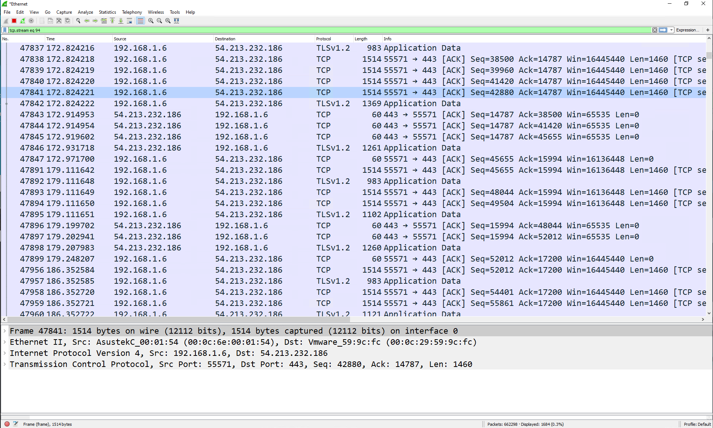
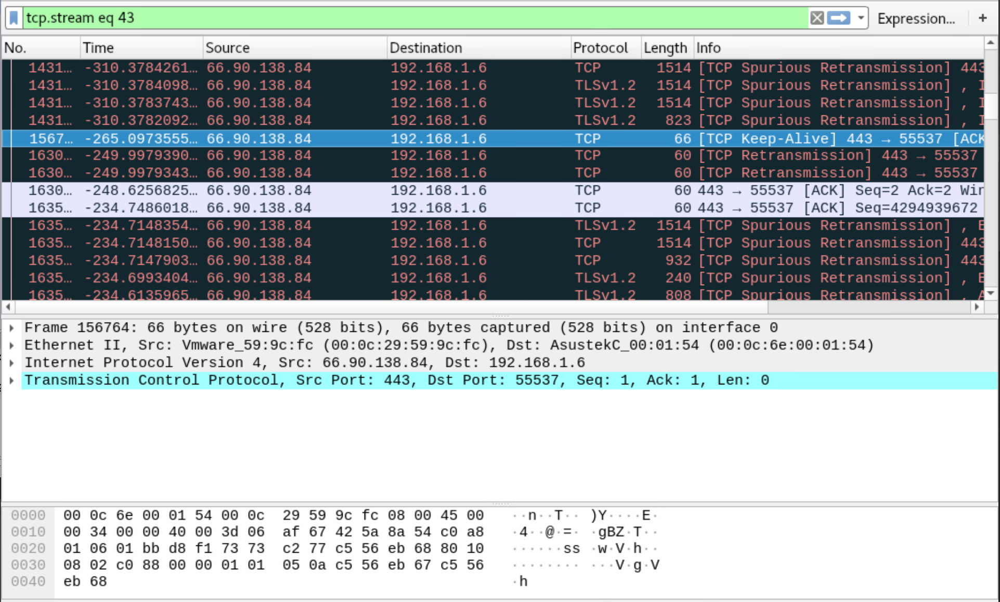

# Dell OS10 Load Balancing with LAG Config

In this test case the goal is to create a simple load balancer using a reverse
LAG port. The idea is to have one input port which is then mirrored to a logical
LAG port and at the other end of the LAG port is a number of security sensors.

This test case was a duplicate of test 1 except with 1 port unplugged to see
how it affected the algorithm.

# Helpful Links

[ONIE Network Install Process Overview](https://opencomputeproject.github.io/onie/user-guide/index.html#installing-over-the-network)

[Dell OS10 Manual](https://topics-cdn.dell.com/pdf/networking-s5148f-on_connectivity-guide4_en-us.pdf)

# My Configuration

## General Configuration

- ONIE host is running RHEL 8
- I am using a Dell S4112F-ON for testing
- OS10 10.5.0.2
- PFSense running DNS and DHCP as services

## RHEL Release Info

    NAME="Red Hat Enterprise Linux"
    VERSION="8.0 (Ootpa)"
    ID="rhel"
    ID_LIKE="fedora"
    VERSION_ID="8.0"
    PLATFORM_ID="platform:el8"
    PRETTY_NAME="Red Hat Enterprise Linux 8.0 (Ootpa)"
    ANSI_COLOR="0;31"
    CPE_NAME="cpe:/o:redhat:enterprise_linux:8.0:GA"
    HOME_URL="https://www.redhat.com/"
    BUG_REPORT_URL="https://bugzilla.redhat.com/"

    REDHAT_BUGZILLA_PRODUCT="Red Hat Enterprise Linux 8"
    REDHAT_BUGZILLA_PRODUCT_VERSION=8.0
    REDHAT_SUPPORT_PRODUCT="Red Hat Enterprise Linux"
    REDHAT_SUPPORT_PRODUCT_VERSION="8.0"
    Red Hat Enterprise Linux release 8.0 (Ootpa)
    Red Hat Enterprise Linux release 8.0 (Ootpa)

## OS 10 Version

    OS10# show version
    Dell EMC Networking OS10 Enterprise
    Copyright (c) 1999-2019 by Dell Inc. All Rights Reserved.
    OS Version: 10.5.0.2
    Build Version: 10.5.0.2.468
    Build Time: 2019-10-19T00:29:00+0000
    System Type: S4112F-ON
    Architecture: x86_64
    Up Time: 00:03:39

# Setup ONIE Prerequisites

See [ONIE Install Setup](/README.md#how-to-configure-onie) for instructions.

# Configure Management Interface

See [Configure Management Interface on Dell OS10](/README.md#configure-managment-interface-on-dell-os10)

# Configure Device for LAG

## Physical Configuration

- 1, 1Gb/s copper SFP (Ethernet 1/1/1) for input
- 1, 1Gb/s copper SFPs (Ethernet 1/1/5) and 1, 1Gb/s, fiber SFP (Ethernet 1/1/12) for output

**MAJOR DIFFERENCE WITH TEST 1**: In this test Ethernet 1/1/9 was disconnected.
I actually did this by accident originally. I discovered VMWare autonegotiates to
10Gb/s and if you leave the interface at 1Gb/s the interface will not come up.

## Configuration - Same as Test 1 Except with Ethernet 1/1/9 Unplugged

    OS10(config)# do show ip interface brief
    Interface Name            IP-Address          OK       Method       Status     Protocol
    =========================================================================================
    Ethernet 1/1/1             unassigned          YES      unset        up          up
    Ethernet 1/1/2             unassigned          NO       unset        up          down
    Ethernet 1/1/3             unassigned          NO       unset        up          down
    Ethernet 1/1/4             unassigned          NO       unset        up          down
    Ethernet 1/1/5             unassigned          YES      unset        up          up
    Ethernet 1/1/6             unassigned          NO       unset        up          down
    Ethernet 1/1/7             unassigned          NO       unset        up          down
    Ethernet 1/1/8             unassigned          NO       unset        up          down
    Ethernet 1/1/9             unassigned          NO       unset        up          down
    Ethernet 1/1/10            unassigned          NO       unset        up          down
    Ethernet 1/1/11            unassigned          NO       unset        up          down
    Ethernet 1/1/12            unassigned          YES      unset        up          up
    Ethernet 1/1/13            unassigned          NO       unset        up          down
    Ethernet 1/1/14            unassigned          NO       unset        up          down
    Ethernet 1/1/15            unassigned          NO       unset        up          down
    Management 1/1/1           192.168.1.20/24     YES      manual       up          up
    Vlan 1                     unassigned          YES      unset        up          up
    Port-channel 1             unassigned          YES      unset        up          up
    OS10(config)# do show running-configuration
    ! Version 10.5.0.2
    ! Last configuration change at Nov  01 01:09:30 2019
    !
    ip vrf default
    !
    interface breakout 1/1/13 map 100g-1x
    interface breakout 1/1/14 map 100g-1x
    interface breakout 1/1/15 map 100g-1x
    iscsi enable
    iscsi target port 860
    iscsi target port 3260
    system-user linuxadmin password $6$5DdOHYg5$JCE1vMSmkQOrbh31U74PIPv7lyOgRmba1IxhkYibppMXs1KM4Y.gbTPcxyMP/PHUkMc5rdk/ZLv9Sfv3ALtB61
    username admin password $6$q9QBeYjZ$jfxzVqGhkxX3smxJSH9DDz7/3OJc6m5wjF8nnLD7/VKx8SloIhp4NoGZs0I/UNwh8WVuxwfd9q4pWIgNs5BKH. role sysadmin priv-lvl 15
    aaa authentication login default local
    aaa authentication login console local
    !
    class-map type application class-iscsi
    !
    policy-map type application policy-iscsi
    !
    interface vlan1
    no shutdown
    !
    interface port-channel1
    no shutdown
    switchport access vlan 1
    !
    interface mgmt1/1/1
    no shutdown
    no ip address dhcp
    ip address 192.168.1.20/24
    ipv6 address autoconfig
    !
    interface ethernet1/1/1
    no shutdown
    switchport access vlan 1
    flowcontrol receive on
    !
    interface ethernet1/1/2
    no shutdown
    switchport access vlan 1
    flowcontrol receive on
    !
    interface ethernet1/1/3
    no shutdown
    switchport access vlan 1
    flowcontrol receive on
    !
    interface ethernet1/1/4
    no shutdown
    switchport access vlan 1
    flowcontrol receive on
    !
    interface ethernet1/1/5
    no shutdown
    channel-group 1
    no switchport
    speed 1000
    flowcontrol receive on
    !
    interface ethernet1/1/6
    no shutdown
    switchport access vlan 1
    flowcontrol receive on
    !
    interface ethernet1/1/7
    no shutdown
    switchport access vlan 1
    flowcontrol receive on
    !
    interface ethernet1/1/8
    no shutdown
    switchport access vlan 1
    flowcontrol receive on
    !
    interface ethernet1/1/9
    no shutdown
    channel-group 1
    no switchport
    speed 1000
    flowcontrol receive on
    !
    interface ethernet1/1/10
    no shutdown
    switchport access vlan 1
    flowcontrol receive on
    !
    interface ethernet1/1/11
    no shutdown
    switchport access vlan 1
    flowcontrol receive on
    !
    interface ethernet1/1/12
    no shutdown
    channel-group 1
    no switchport
    speed 1000
    flowcontrol receive on
    !
    interface ethernet1/1/13
    no shutdown
    switchport access vlan 1
    flowcontrol receive on
    !
    interface ethernet1/1/14
    no shutdown
    switchport access vlan 1
    flowcontrol receive on
    !
    interface ethernet1/1/15
    no shutdown
    switchport access vlan 1
    flowcontrol receive on
    !
    monitor session 1
    destination interface port-channel1
    source interface ethernet1/1/1
    no shut
    !
    snmp-server contact "Contact Support"
    !
    telemetry

# Findings

~~I noticed in this configuration traffic appears to balance correctly. Will need
to sit down and think on the math.~~

I am no longer convinced these results are valid. See test case 3. After further
examination it looks like on the surface it is working when in reality it may not
be.

Interface 1/1/9 was down because ESXi was set to 10Gb/s and I had set the speed on
9 manually to 1Gb/s causing it to go down.

## Host 1

## Host 2
