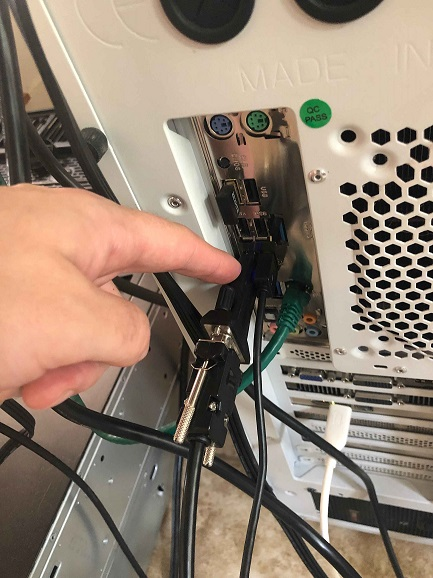
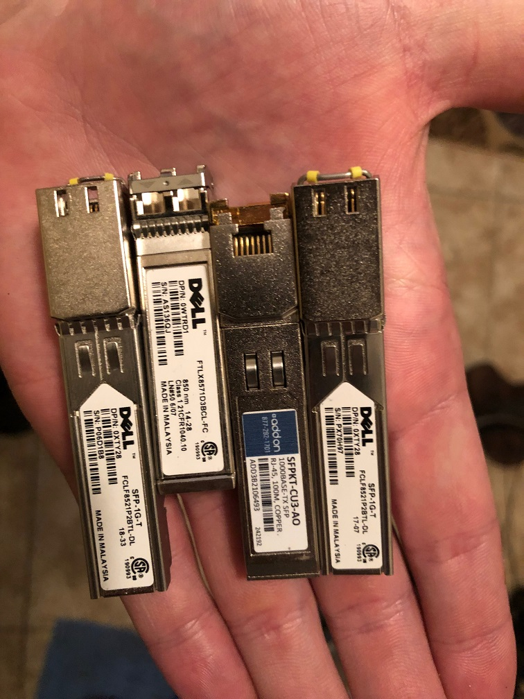
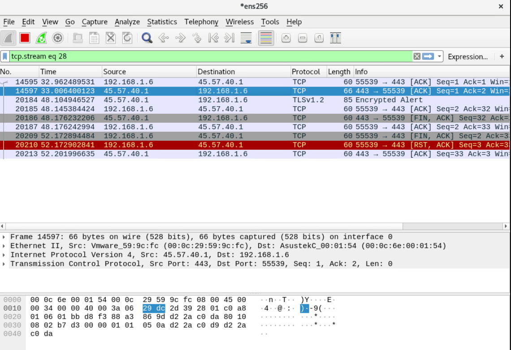

# Load Balancing on Mellanox Switches

In this test case the goal is to create a simple load balancer using a reverse
LAG port. The idea is to have one input port which is then mirrored to a logical
LAG port and at the other end of the LAG port is a number of security sensors.

# Version Info

        mellanox.lan [standalone: master] # show version
        Product name:      Onyx
        Product release:   3.8.2004
        Build ID:          #1-dev
        Build date:        2019-09-23 14:19:47
        Target arch:       x86_64
        Target hw:         x86_64
        Built by:          jenkins@7ae5fd122b61
        Version summary:   X86_64 3.8.2004 2019-09-23 14:19:47 x86_64

        Product model:     x86onie
        Host ID:           B8599FD560BE
        System serial num: MT1940T00588
        System UUID:       5f4c5ed2-e60b-11e9-8000-b8599f7f6f40

        Uptime:            17h 27m 36.480s
        CPU load averages: 3.17 / 3.17 / 3.11
        Number of CPUs:    4
        System memory:     2738 MB used / 5065 MB free / 7803 MB total
        Swap:              0 MB used / 0 MB free / 0 MB total

# Connect to the Console Port and Management Ethernet Port

Plug in both the management Ethernet cable and the serial cable. The console port is
the bottom port and the ethernet management port is the top port.

I had to plug the console cable into a specific USB slot on the server. It didn't
work in the first one I tried. See picture below.

This likely has nothing to do with the Mellanox switch itself, but as a note for
those that come after you may want to try different USB ports if you find you
aren't getting output on the first one you try and are confident you have the correct
settings.

I used the following console configuration:

        Baud Rate: 115200
        Data Bits: 8
        Stop Bits: 1
        Parity: None
        Flow Control: None

# Update to Latest Version of MLNX-OS

1. I pulled updates [here](https://mymellanox.force.com/support/SupportProductItem?id=a2v50000000JhmwAAC)
2. The system uses a web server target for updates. I had Apache running on a RHEL 8 box.
3. Download the update file and then upload it to your web server's root directory.
4. On the switch itself (over a console port) do the following:

        switch > enable
        switch # configure terminal
        switch (config) # show images

        # Delete the old image if it exists. It will be under
        # "Images available to be installed"

        switch (config) # image delete <old_image>
5. Download the new image from your web server with 

        mellanox.lan [standalone: master] # image fetch http://rhel8.lan/onyx-X86_64-3.8.2004.img
        100.0%  [################################################################################################################################################################################################################################################################]

6. Next install the updated OS with:

        mellanox.lan [standalone: master] # image install onyx-X86_64-3.8.2004.img location 2 progress track verify check-sig
        Step 1 of 4: Verify Image
        100.0%  [#################################################################]
        Step 2 of 4: Uncompress Image
        100.0%  [#################################################################]
        Step 3 of 4: Create Filesystems
        100.0%  [#################################################################]
        Step 4 of 4: Extract Image
        98.6%  [################################################################ ]
        100.0%  [#################################################################]

7. Now set the switch to load from the new operating system and reload:

        mellanox.lan [standalone: master] # image boot next
        mellanox.lan [standalone: master] # reload

# Physical Configuration

I used the following port configuration:

- 1, 1Gb/s copper SFP (Eth1/1) for input
- 2, 1Gb/s copper SFPs (Ethernet 1/1/5/Ethernet 1/1/9) and 1, 1Gb/s, fiber SFP (Ethernet 1/1/12) for output

I used the following optics:

Connect the input port to port 1.

I connected my output ports in the following way:

# Bringing the Interfaces Up

Mellanox does not perform testing with 3rd party NICs. During testing we found that
autonegotiation of speed will not work on standard Dell SFPs. Use the below command
on each interface to set the speed manually:

        mellanox.lan [standalone: master] (config interface ethernet 1/1) # speed 1G

# Configure the LAG

## Initial Configuration

        mellanox.lan [standalone: master] (config) # port-channel load-balance ethernet source-destination-mac source-destination-ip source-destination-port symmetric
        mellanox.lan [standalone: master] (config) # interface port-channel 1
        mellanox.lan [standalone: master] (config interface port-channel 1) # switchport mode hybrid
        mellanox.lan [standalone: master] (config interface port-channel 1) # description load balance group
        mellanox.lan [standalone: master] (config interface port-channel 1) # no shut
        mellanox.lan [standalone: master] (config interface port-channel 1) # mtu 9000 force
        mellanox.lan [standalone: master] (config interface port-channel 1) # exit
        mellanox.lan [standalone: master] (config) # interface ethernet 1/5 switchport mode hybrid
        mellanox.lan [standalone: master] (config) # interface ethernet 1/9 switchport mode hybrid
        mellanox.lan [standalone: master] (config) # interface ethernet 1/12 switchport mode hybrid
        mellanox.lan [standalone: master] (config) # interface ethernet 1/1 switchport mode hybrid
        mellanox.lan [standalone: master] (config) # interface ethernet 1/1 mtu 9000 force
        mellanox.lan [standalone: master] (config) # interface ethernet 1/5 mtu 9000 force
        mellanox.lan [standalone: master] (config) # interface ethernet 1/9 mtu 9000 force
        mellanox.lan [standalone: master] (config) # interface ethernet 1/12 mtu 9000 force
        mellanox.lan [standalone: master] (config) # interface ethernet 1/5 channel-group 1 mode on
        mellanox.lan [standalone: master] (config) # interface ethernet 1/9 channel-group 1 mode on
        mellanox.lan [standalone: master] (config) # interface ethernet 1/12 channel-group 1 mode on

## Problem Using Port Mirroring

Originally my plan was to use a mirror port to send all the traffic from port 1
to our LAG interface. In contrast to OS10, MLNX-OS will not allow you to do this.
The problem is that MLNX-OS will not allow you to create a mirror session from
interface 1 to the LAG port which prevents this configuration from working. Moreover
you cannot access the Linux command line to use a utility like tc to perform the
config either.

## Configure OpenFlow

Instead of using port mirroring to send the traffic from interface one we can instead
use a static OpenFlow configuration to redirect the traffic.

        mellanox.lan [standalone: master] (config) # interface ethernet 1/1 openflow mode hybrid
        mellanox.lan [standalone: master] (config) # interface port-channel 1 openflow mode hybrid
        mellanox.lan [standalone: master] (config) # openflow add-flows 1000 priority=50,in_port=Eth1/1,actions=output:Po1

# Findings

The Mellanox SN2010 works correctly and will appropriately load balance full
sessions across each member of the LAG. See below for screenshots.

## Host 1

## Host 2

## Host 3
