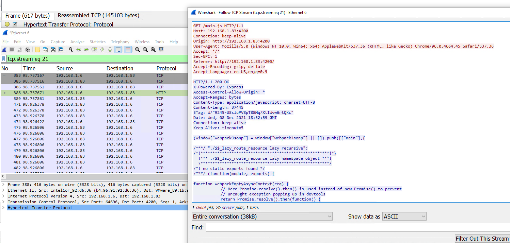

# Load Balancing with LAG on 5112F-ON

- [Load Balancing with LAG on 5112F-ON](#load-balancing-with-lag-on-5112f-on)
  - [Version/Hardware Information](#versionhardware-information)
  - [The Test Environment](#the-test-environment)
  - [Configure Devices](#configure-devices)
    - [Configure 5212F-ON](#configure-5212f-on)
    - [Configure RHEL 8](#configure-rhel-8)
  - [Test Results](#test-results)

## Version/Hardware Information

**Note** This requires at least 10.5.3.0 and is only supported on switches with the Trident proc

```
OS10(config)# do show version
Dell EMC Networking OS10 Enterprise
Copyright (c) 1999-2021 by Dell Inc. All Rights Reserved.
OS Version: 10.5.3.0
Build Version: 10.5.3.0.44
Build Time: 2021-10-06T23:03:55+0000
System Type: S5212F-ON
Architecture: x86_64
Up Time: 00:03:27
```

## The Test Environment

I used a RHEL box to generate traffic inbound to the switch on port ethernet 1/1/5:1 which I then expected to load balance across ports ethernet 1/1/1:1 and 1/1/4:1. I used source and dest IP and source and dest port as the criteria for load balancing. Traffic was captured with a single laptop which was directly connected to the two independent receiving interfaces. A single Wireshark monitor session was established for each of the individual interfaces to ensure that they received independent, mutually-exclusive, session load balancing.

The traffic was a session I generated by using a laptop that was serving as a virtual web gateway along with being used as an end user device.

## Configure Devices

### Configure 5212F-ON

```
configure terminal
load-balancing ip-selection source-ip destination-ip l4-destination-port l4-source-port
port-group  1/1/1
mode eth 10g-4x
interface port-channel 1
no shutdown
no switchport
exit
interface ethernet 1/1/1:1
no shut
channel-group 1
speed 1000
exit
interface ethernet 1/1/4:1
no shut
channel-group 1
speed 1000
exit
monitor session 1
destination interface port-channel 1
source interface ethernet 1/1/5:1
no shut
exit
```

### Configure RHEL 8

```
sudo dnf install -y https://dl.fedoraproject.org/pub/epel/epel-release-latest-8.noarch.rpm
sudo subscription-manager repos --enable codeready-builder-for-rhel-8-x86_64-rpms
dnf group install "Development Tools"
dnf install -y libpcap-devel
make
make install
/usr/local/bin/tcpreplay -i ens32 test.pcap
```

## Test Results

The test succeeded. This was verified by checking that the sessions seen by two separate streams were mutually exclusive. At no point did we see effects as described in [4112F-ON Test Case 4](../Load%20Balance%20Testing%20on%204112F-ON/OS10/Test%20Case%204/README.md) where a single session was sent down two separate lanes. Moreover, by checking the individual sessions you can see the bidirectional flow:

