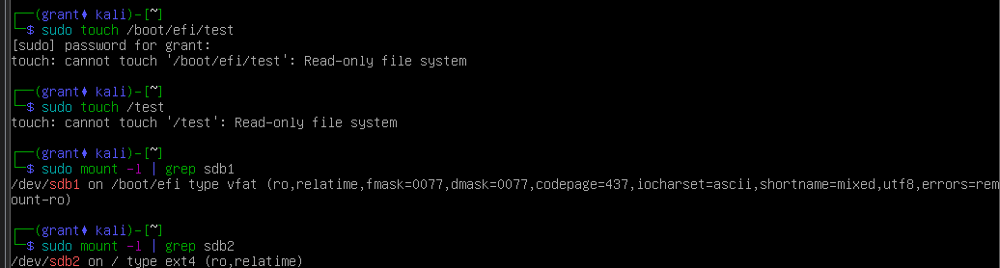

# Make USB Read Only

**Note**: These instructions are for a UEFI bootable device with an ext4 filesystem

1. Boot up a separate Linux machine and plug in the USB device you would like to make readonly
2. Run `sudo fdisk -l` to list the available partitions
   1. Confirm you have not built the device with a swap partition

```
grant@telemetrytest:/media$ sudo fdisk -l
...SNIP..

Disk /dev/sdb: 57.29 GiB, 61505273856 bytes, 120127488 sectors
Disk model: Ultra
Units: sectors of 1 * 512 = 512 bytes
Sector size (logical/physical): 512 bytes / 512 bytes
I/O size (minimum/optimal): 512 bytes / 512 bytes
Disklabel type: gpt
Disk identifier: C02A7A30-1742-47CE-9DFB-5B3AB96C958C

Device         Start       End   Sectors  Size Type
/dev/sdb1       2048   1050623   1048576  512M EFI System
/dev/sdb2    1050624 118126591 117075968 55.8G Linux filesystem
```

3. The first thing we need to do is get the uuid for the EFI partition. Run `sudo blkid /dev/<YOUR_EFI_PARTITION>`, in my case `/dev/sdb1`

```
grant@telemetrytest:/media$ sudo blkid /dev/sdb1
/dev/sdb1: UUID="CD68-8FEA" TYPE="vfat" PARTUUID="d27eda17-c6df-4115-80f3-bd86b56882ac"
```

4. Next, we need to edit the base filesystem's fstab to make sure that when this filesystem loads, it will load as readonly. Mount your ext4 filesystem with `sudo mount /dev/<YOUR_PARTITION> <YOUR_MOUNT_POINT>`. Ex: `sudo mount /dev/sdb2 /media`.
5. Next, we need to edit fstab. `sudo vim /media/etc/fstab`

```
# /etc/fstab: static file system information.
#
# Use 'blkid' to print the universally unique identifier for a
# device; this may be used with UUID= as a more robust way to name devices
# that works even if disks are added and removed. See fstab(5).
#
# systemd generates mount units based on this file, see systemd.mount(5).
# Please run 'systemctl daemon-reload' after making changes here.
#
# <file system> <mount point>   <type>  <options>       <dump>  <pass>
# / was on /dev/sdb2 during installation
UUID=6634741f-250a-47b7-96b9-379e517d4591 /               ext4    errors=remount-ro 0       1
# /boot/efi was on /dev/sdb1 during installation
UUID=CD68-8FEA  /boot/efi       vfat    umask=0077      0       1
# swap was on /dev/sdb3 during installation
UUID=4391d5d0-08cb-4fbe-81a8-0a67fe00758c none            swap    sw              0       0
/dev/sr0        /media/cdrom0   udf,iso9660 user,noauto     0       0
```

6. Look for the mount point `/boot/efi` and confirm that its UUID matches what you saw earlier. Change the options from `UUID=CD68-8FEA  /boot/efi       vfat    umask=0077      0       1` to `UUID=CD68-8FEA  /boot/efi       vfat    umask=0077,ro      0       1`
7. Next we need to set the primary ext4 partition as read-only. Run `sudo umount <YOUR_MOUNT>`. Ex: `sudo umount /media`
8. Set the ext4 filesystem as read only with `sudo tune2fs -O read-only /dev/<YOUR_PARTITION>`. Ex: `sudo tune2fs -O read-only /dev/sdb2` 
9. Disconnect the USB drive, boot from it, and confirm read-only behavior.

