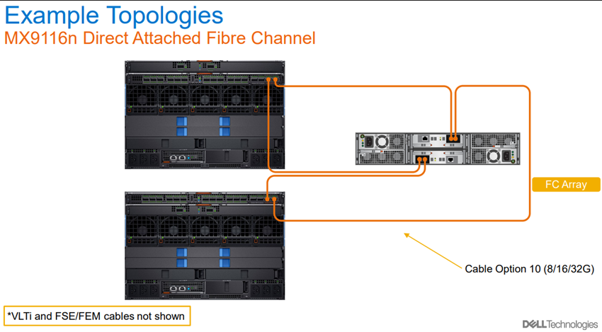
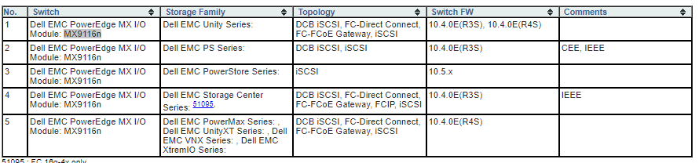

# Migrating Storage Volumes to PowerStore

In my scenario I wanted to migrate storage from a Compellent attached with FC to a PowerStore attached to an MX7000 with an M9116n.

Note: This is only relevant for older devices in a FC or iSCSI configuration. For NAS you would use any NAS migration technique (rsync, DobiMigrate, etc)

- [Migrating Storage Volumes to PowerStore](#migrating-storage-volumes-to-powerstore)
  - [MX7000 FC Topology](#mx7000-fc-topology)
  - [Migrating from an Old Device](#migrating-from-an-old-device)
  - [Other Useful Resources](#other-useful-resources)
    - [PowerStore Educational Videos](#powerstore-educational-videos)
    - [Operating Systems Compatible with Multipath Drivers](#operating-systems-compatible-with-multipath-drivers)
    - [Requirements for Non-Disruptive Migration](#requirements-for-non-disruptive-migration)
    - [M9116n Compatibility Matrix](#m9116n-compatibility-matrix)

## MX7000 FC Topology 

## Migrating from an Old Device

[This video](https://www.youtube.com/watch?v=yFNwTnQDfZc) describes how the migration from an old device (like a Compellent) to a PowerStore works.

In general, on all effected devices, you must install a host plugin which comes with a multipath driver. Before the migration is complete, the host driver will direct all reads/writes to the old device and post migration you will use a cutover option which causes the reads/writes to be redirected to the PowerStore. There is an iSCSI connection between the PowerStore and the compellent which has a synchronization feature that will keep any updates made against the Compellent (or other older device) synced to the in progress copy to the PowerStore

## Other Useful Resources

### PowerStore Educational Videos

https://www.dell.com/support/kbdoc/en-us/000130110/powerstore-info-hub-product-documentation-videos

### Operating Systems Compatible with Multipath Drivers

https://www.dell.com/support/kbdoc/en-us/000105896/powerstore-supported-host-os-for-non-disruptive-migration-of-storage-resources?lang=en

### Requirements for Non-Disruptive Migration

https://www.dell.com/support/manuals/en-us/powerstore-1000t/pwrstr-import/additional-resources?guid=guid-f5b0a9d3-2eae-447c-b4c3-40e0927ac5f4&lang=en-us

### M9116n Compatibility Matrix

