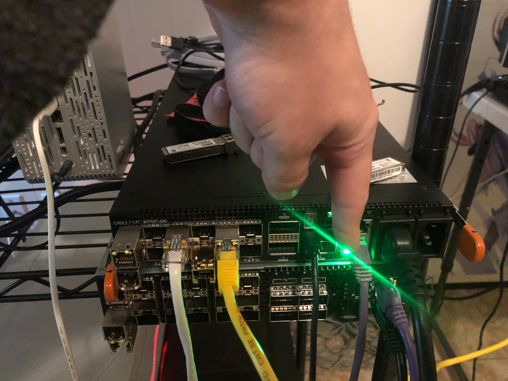

# Multiple Span on 4112F-ON with OS10

In this test case I am testing to see if we can configure a Dell 4112F-ON with
OS10 to create a one to many port configuration using SPAN.

# Helpful Links

[ONIE Network Install Process Overview](https://opencomputeproject.github.io/onie/user-guide/index.html#installing-over-the-network)

# My Configuration

## General Configuration

- ONIE host is running RHEL 8
- I am using a Dell S4112F-ON for testing
- OS10 version 10.5.0.2
- PFSense running DNS and DHCP as services

## RHEL Release Info

    NAME="Red Hat Enterprise Linux"
    VERSION="8.0 (Ootpa)"
    ID="rhel"
    ID_LIKE="fedora"
    VERSION_ID="8.0"
    PLATFORM_ID="platform:el8"
    PRETTY_NAME="Red Hat Enterprise Linux 8.0 (Ootpa)"
    ANSI_COLOR="0;31"
    CPE_NAME="cpe:/o:redhat:enterprise_linux:8.0:GA"
    HOME_URL="https://www.redhat.com/"
    BUG_REPORT_URL="https://bugzilla.redhat.com/"

    REDHAT_BUGZILLA_PRODUCT="Red Hat Enterprise Linux 8"
    REDHAT_BUGZILLA_PRODUCT_VERSION=8.0
    REDHAT_SUPPORT_PRODUCT="Red Hat Enterprise Linux"
    REDHAT_SUPPORT_PRODUCT_VERSION="8.0"
    Red Hat Enterprise Linux release 8.0 (Ootpa)
    Red Hat Enterprise Linux release 8.0 (Ootpa)

## OS10 Version

    Dell EMC Networking OS10 Enterprise
    Copyright (c) 1999-2019 by Dell Inc. All Rights Reserved.
    OS Version: 10.5.0.2
    Build Version: 10.5.0.2.468
    Build Time: 2019-10-19T00:29:00+0000
    System Type: S4112F-ON
    Architecture: x86_64
    Up Time: 00:13:11

# Setup ONIE Prerequisites

See [ONIE Install Setup](/README.md#how-to-configure-onie) for instructions.

# Configure Device as TAP

## Physical Configuration

For this configuration to work, we will use the management interface as the input
interface for the tap. See image below. You will need to move your network cable
over from your usual network to your traffic generator.

# Problem

The way this worked on OPX was to use the Linux kernel module called TC. The net_sched
module which supports ingress packet manipulation is not available on OS10. It could
be reinstalled, but I didn't explore this option. Currently I don't have a working
config on OS10.

# Test with Mirror Ports

It looks like OS10 only supports one destination port on a port mirror. See
the below.

    OS10(conf-mon-local-1)# do show monitor session 1
    S.Id  Source              Destination         Dir   Mode  Source IP        Dest IP          DSCP  TTL  Gre-Protocol   State     Reason
    ---------------------------------------------------------------------------------------------------------------------------------------
    1     ethernet1/1/3                           both  port  N/A              N/A              N/A   N/A  N/A            false     Destination is not configured
    OS10(conf-mon-local-1)# destination interface ethernet 1/1/7
    OS10(conf-mon-local-1)# destination interface ethernet 1/1/8
    % Error: Configuration mismatch.
    OS10(conf-mon-local-1)# no destination interface ethernet 1/1/7
    OS10(conf-mon-local-1)# destination interface ethernet 1/1/8
    OS10(conf-mon-local-1)#