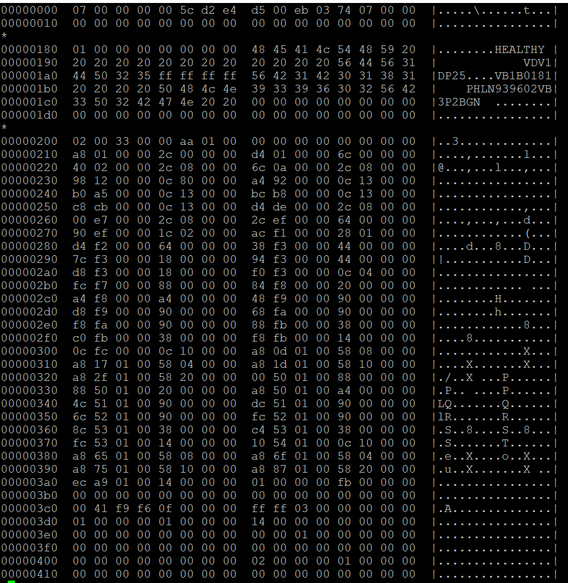

# Notes on NVMe Log Pages

- [Notes on NVMe Log Pages](#notes-on-nvme-log-pages)
  - [Quick Overview](#quick-overview)
  - [My Test Drive](#my-test-drive)
  - [Get Log Page Identifiers](#get-log-page-identifiers)
  - [Error Information (01h)](#error-information-01h)
    - [Sample Output](#sample-output)
  - [SMART / Health Information (02h)](#smart--health-information-02h)
    - [Sample Output](#sample-output-1)
  - [Firmware Slot Information (03h)](#firmware-slot-information-03h)
    - [Sample Output](#sample-output-2)
  - [Changed Namespace List (04h)](#changed-namespace-list-04h)
  - [Commands Supported and Effects (05h)](#commands-supported-and-effects-05h)
    - [Sample Output](#sample-output-3)
  - [Device Self-test (06h)](#device-self-test-06h)
  - [Telemetry Host-Initiated (07h)](#telemetry-host-initiated-07h)
    - [Notes on Telemetry](#notes-on-telemetry)
    - [Sample Output](#sample-output-4)
  - [Telemetry Controller-Initiated (08h)](#telemetry-controller-initiated-08h)
    - [Notes on Telemetry](#notes-on-telemetry-1)
    - [Sample Output](#sample-output-5)
  - [Endurance Group Information (09h)](#endurance-group-information-09h)
  - [Predictable Latency Per NVM Set (0Ah)](#predictable-latency-per-nvm-set-0ah)
  - [Predictable Latency Event Aggregate Log Page (0Bh)](#predictable-latency-event-aggregate-log-page-0bh)
  - [Asymmetric Namespace Access (0Ch)](#asymmetric-namespace-access-0ch)
  - [Persistent Event Log (0Dh)](#persistent-event-log-0dh)
  - [Endurance Group Event Aggregate (0Fh)](#endurance-group-event-aggregate-0fh)
  - [Media Unit Status (10h)](#media-unit-status-10h)
  - [Supported Capacity Configuration List (11h)](#supported-capacity-configuration-list-11h)
  - [Feature Identifiers Supported and Effects (12h)](#feature-identifiers-supported-and-effects-12h)
  - [NVMe-MI Commands Supported and Effects (13h)](#nvme-mi-commands-supported-and-effects-13h)
  - [Command and Feature Lockdown (14h)](#command-and-feature-lockdown-14h)
  - [Boot Partition (15h)](#boot-partition-15h)
  - [Rotational Media Information Log (16h)](#rotational-media-information-log-16h)
  - [Discovery Log Page (70h)](#discovery-log-page-70h)
    - [Command Syntax](#command-syntax)
  - [Reservation Notification (80h)](#reservation-notification-80h)
  - [Sanitize Status (81h)](#sanitize-status-81h)
    - [Command Syntax](#command-syntax-1)
  - [Other NVMe CLI Commands](#other-nvme-cli-commands)
    - [List All NVMe Drives](#list-all-nvme-drives)

## Quick Overview

See [this excel document](nvme_log_pages.xlsx)

## My Test Drive

```
[root@r8402 ~]# nvme id-ctrl /dev/nvme0n1
NVME Identify Controller:
vid       : 0x8086
ssvid     : 0x1028
sn        : PHLN939602VB3P2BGN
mn        : Dell Express Flash NVMe P4610 3.2TB SFF
fr        : VDV1DP25
rab       : 0
ieee      : 5cd2e4
cmic      : 0
mdts      : 5
cntlid    : 0
ver       : 0x10200
rtd3r     : 0x989680
rtd3e     : 0xe4e1c0
oaes      : 0x200
ctratt    : 0
rrls      : 0
cntrltype : 0
fguid     :
crdt1     : 0
crdt2     : 0
crdt3     : 0
oacs      : 0x6
acl       : 3
aerl      : 3
frmw      : 0x18
lpa       : 0xe
elpe      : 63
npss      : 0
avscc     : 0
apsta     : 0
wctemp    : 343
cctemp    : 349
mtfa      : 0
hmpre     : 0
hmmin     : 0
tnvmcap   : 3200631791616
unvmcap   : 0
rpmbs     : 0
edstt     : 0
dsto      : 0
fwug      : 0
kas       : 0
hctma     : 0
mntmt     : 0
mxtmt     : 0
sanicap   : 0
hmminds   : 0
hmmaxd    : 0
nsetidmax : 0
endgidmax : 0
anatt     : 0
anacap    : 0
anagrpmax : 0
nanagrpid : 0
pels      : 0
sqes      : 0x66
cqes      : 0x44
maxcmd    : 0
nn        : 1
oncs      : 0x6
fuses     : 0
fna       : 0x4
vwc       : 0
awun      : 0
awupf     : 0
icsvscc     : 0
nwpc      : 0
acwu      : 0
sgls      : 0
mnan      : 0
subnqn    :
ioccsz    : 0
iorcsz    : 0
icdoff    : 0
fcatt     : 0
msdbd     : 0
ofcs      : 0
ps    0 : mp:25.00W operational enlat:0 exlat:0 rrt:0 rrl:0
          rwt:0 rwl:0 idle_power:- active_power:-
```

## Get Log Page Identifiers


[NVMe Express Base Specification](images/NVMe-NVM-Express-2.0a-2021.07.26-Ratified.pdf)

## Error Information (01h)

This log page is used to describe extended error information for a command that completed with error or report an error that is not specific to a particular command. Extended error information is provided when the More (M) bit is set to ‘1’ in the Status Field for the completion queue entry associated with the command that completed with error or as part of an asynchronous event with an Error status type. This log page is global to the controller. This error log may return the last n errors. If host software specifies a data transfer of the size of n error logs, then the error logs for the most recent n errors are returned. The ordering of the entries is based on the time when the error occurred, with the most recent error being returned as the first log entry. Each entry in the log page returned is defined in Figure 206. The log page is a set of 64-byte entries; the maximum number of entries supported is indicated in the ELPE field in the Identify Controller data structure (refer to Figure 275). If the log page is full when a new entry is generated, the controller should insert the new entry into the log and discard the oldest entry. The controller should clear this log page by removing all entries on power cycle and Controller Level Reset.

See [page 178](images/NVMe-NVM-Express-2.0a-2021.07.26-Ratified.pdf) for a description.

### Sample Output

```
[root@r8402 ~]# nvme error-log /dev/nvme0n1
Error Log Entries for device:nvme0n1 entries:64
.................
 Entry[ 0]
.................
error_count     : 0
sqid            : 0
cmdid           : 0
status_field    : 0(SUCCESS: The command completed successfully)
phase_tag       : 0
parm_err_loc    : 0
lba             : 0
nsid            : 0
vs              : 0
trtype          : The transport type is not indicated or the error is not transport related.
cs              : 0
trtype_spec_info: 0
.................

...SNIP...

 Entry[63]
.................
error_count     : 0
sqid            : 0
cmdid           : 0
status_field    : 0(SUCCESS: The command completed successfully)
phase_tag       : 0
parm_err_loc    : 0
lba             : 0
nsid            : 0
vs              : 0
trtype          : The transport type is not indicated or the error is not transport related.
cs              : 0
trtype_spec_info: 0
.................
```

## SMART / Health Information (02h)

This log page is used to provide SMART and general health information. The information provided is over the life of the controller and is retained across power cycles. To request the controller log page, the namespace identifier specified is FFFFFFFFh or 0h. For compatibility with implementations compliant with NVM Express Base Specification revision 1.4 and earlier, hosts should use a namespace identifier of FFFFFFFFh to request the controller log page. The controller may also support requesting the log page on a per namespace basis, as indicated by bit 0 of the LPA field in the Identify Controller data structure in Figure 275.

See [page 180](./images/NVMe-NVM-Express-2.0a-2021.07.26-Ratified.pdf) for a description.

### Sample Output

```
[root@r8402 ~]# nvme smart-log /dev/nvme0n1
Smart Log for NVME device:nvme0n1 namespace-id:ffffffff
critical_warning                        : 0
temperature                             : 26 C
available_spare                         : 100%
available_spare_threshold               : 10%
percentage_used                         : 0%
endurance group critical warning summary: 0
data_units_read                         : 4,002,753
data_units_written                      : 255,875,492
host_read_commands                      : 45,714,473
host_write_commands                     : 1,620,770,593
controller_busy_time                    : 372
power_cycles                            : 150
power_on_hours                          : 5,219
unsafe_shutdowns                        : 99
media_errors                            : 0
num_err_log_entries                     : 0
Warning Temperature Time                : 0
Critical Composite Temperature Time     : 0
Thermal Management T1 Trans Count       : 0
Thermal Management T2 Trans Count       : 0
Thermal Management T1 Total Time        : 0
Thermal Management T2 Total Time        : 0
```

## Firmware Slot Information (03h)

This log page is used to describe the firmware revision stored in each firmware slot supported. The firmware revision is indicated as an ASCII string. The log page also indicates the active slot number. The log page returned is defined in Figure 209

### Sample Output

```
[root@r8402 ~]# nvme fw-log /dev/nvme0n1
Firmware Log for device:nvme0n1
afi  : 0x1
frs1 : 0x3532504431564456 (VDV1DP25)
frs2 : 0x3532504431564456 (VDV1DP25)
```

**NOTE** AFI stands for active firmware version.

## Changed Namespace List (04h)

**NOTE** This command is not currently supported because the drive currently only has one namespace.

This log page is used to describe namespaces attached to the controller that have:

1. changed information in their Identify Namespace data structures (refer to in Figure 146) since the
last time the log page was read;
2. been added; and
3. been deleted.

The log page contains a Namespace List with up to 1,024 entries. If more than 1,024 namespaces have changed attributes since the last time the log page was read, the first entry in the log page shall be set to FFFFFFFFh and the remainder of the list shall be zero filled.

See [page 184](./images/NVMe-NVM-Express-2.0a-2021.07.26-Ratified.pdf) for a description.

## Commands Supported and Effects (05h)

This log page is used to describe the commands that the controller supports and the effects of those commands on the state of the NVM subsystem. The log page is 4,096 bytes in size. There is one Commands Supported and Effects data structure per Admin command and one Commands Supported and Effects data structure per I/O command based on:

1. the I/O Command Set selected in CC.CSS, if CC.CSS is not set to 110b; and
2. the Command Set Identifier field in CDW 14, if CC.CSS is set to 110b.

See [page 185](images/NVMe-NVM-Express-2.0a-2021.07.26-Ratified.pdf) for a description.

### Sample Output

```
[root@r8402 ~]# nvme effects-log /dev/nvme0n1
Admin Command Set
ACS0     [Delete I/O Submission Queue     ] 00000001
ACS1     [Create I/O Submission Queue     ] 00020001
ACS2     [Get Log Page                    ] 00000001
ACS4     [Delete I/O Completion Queue     ] 00000001
ACS5     [Create I/O Completion Queue     ] 00020001
ACS6     [Identify                        ] 00000001
ACS8     [Abort                           ] 00000001
ACS9     [Set Features                    ] 0000001d
ACS10    [Get Features                    ] 00000001
ACS12    [Asynchronous Event Request      ] 00000001
ACS16    [Firmware Commit                 ] 00000011
ACS17    [Firmware Image Download         ] 00000001
ACS128   [Format NVM                      ] 0002001f
ACS200   [Unknown                         ] 00000001
ACS210   [Unknown                         ] 00000001
ACS225   [Unknown                         ] 0002000f
ACS226   [Unknown                         ] 0002000f

NVM Command Set
IOCS0    [Flush                           ] 00000003
IOCS1    [Write                           ] 00000003
IOCS2    [Read                            ] 00000001
IOCS4    [Write Uncorrectable             ] 00000003
IOCS9    [Dataset Management              ] 00000003
```

## Device Self-test (06h)

**NOTE**: This command is not currently supported. TODO

This log page is used to indicate: 

1. the status of any device self-test operation in progress and the percentage complete of that operation; and 
2. the results of the last 20 device self-test operations. 

The Self-test Result Data Structure contained in the Newest Self-test Result Data Structure field is always the result of the last completed or aborted self-test operation. The next Self-test Result Data Structure field in the Device Self-test log page contains the results of the second newest self-test operation and so on. If fewer than 20 self-test operations have completed or been aborted, then the Device Self-test Status field shall be set to Fh in the unused Self-test Result Data Structure fields and all other fields in that Self-test Result Data Structure are ignored.

See [page 187](./images/NVMe-NVM-Express-2.0a-2021.07.26-Ratified.pdf) for additional information.

## Telemetry Host-Initiated (07h)

This log consists of a header describing the log and zero or more Telemetry Data Blocks (refer to section 8.24). All Telemetry Data Blocks are 512 bytes in size. The controller shall initiate a capture of the controller’s internal controller state to this log if the controller processes a Get Log Page command for this log with the Create Telemetry Host-Initiated Data bit set to ‘1’ in the Log Specific field. If the host specifies a Log Page Offset Lower value that is not a multiple of 512 bytes in the Get Log Page command for this log, then the controller shall return an error with a status code set to Invalid Field in Command. This log page is global to the controller or global to the NVM subsystem.

See [page 189](./images/NVMe-NVM-Express-2.0a-2021.07.26-Ratified.pdf) for additional information.

### Notes on Telemetry

See [page 422](./images/NVMe-NVM-Express-2.0a-2021.07.26-Ratified.pdf) for additional details.

Telemetry enables manufacturers to collect internal data logs to improve the functionality and reliability of products. The telemetry data collection may be initiated by the host or by the controller. The data is returned in the Telemetry Host-Initiated log page or the Telemetry Controller-Initiated log page (refer to section 5.16.1.8 and 5.16.1.9). The data captured is vendor specific. The telemetry feature defines the mechanism to collect the vendor specific data. The controller indicates support for the telemetry log pages and for the Data Area 4 size in the Log Page Attributes (LPA) field in the Identify Controller data structure (refer to Figure 275).

### Sample Output

```
nvme telemetry-log --output-file /root/test.log --host-generate=1 /dev/nvme0n1
```


## Telemetry Controller-Initiated (08h)

Telemetry enables manufacturers to collect internal data logs to improve the functionality and reliability of products. The telemetry data collection may be initiated by the host or by the controller. The data is returned in the Telemetry Host-Initiated log page or the Telemetry Controller-Initiated log page (refer to section 5.16.1.8 and 5.16.1.9). The data captured is vendor specific. The telemetry feature defines the mechanism to collect the vendor specific data. The controller indicates support for the telemetry log pages and for the Data Area 4 size in the Log Page Attributes (LPA) field in the Identify Controller data structure (refer to Figure 275).

See [page 191](./images/NVMe-NVM-Express-2.0a-2021.07.26-Ratified.pdf) for additional information.

### Notes on Telemetry

See [Notes on Telemetry](#notes-on-telemetry)

### Sample Output

```
nvme telemetry-log --output-file /root/test.log --host-generate=0 /dev/nvme0n1
```



## Endurance Group Information (09h)

**NOTE** This command is not currently supported because there is only one endurance group (endgidmax=0)

This log page is used to provide endurance information based on the Endurance Group (refer to section 3.2.3). An Endurance Group contains capacity that may be allocated to zero or more NVM Sets. Capacity that has not been allocated to an NVM Set is unallocated Endurance Group capacity. The information provided is over the life of the Endurance Group. The Endurance Group Identifier is specified in the Log Specific Identifier field in Command Dword 11 of the Get Log Page command. The log page is 512 bytes in size.

See [page 193](./images/NVMe-NVM-Express-2.0a-2021.07.26-Ratified.pdf) for additional information.

## Predictable Latency Per NVM Set (0Ah)

**NOTE** This log is not supported because the drives only support one NVM Set.

This log page may be used to determine the current window for the specified NVM Set when Predictable Latency Mode is enabled and any events that have occurred for the specified NVM Set. There is one log page for each NVM Set when Predictable Latency Mode is supported. Command Dword 11 (refer to Figure 198) specifies the NVM Set for which the log page is to be returned. The log page is 512 bytes in size. The log page indicates typical values and reliable estimates for attributes associated with the Deterministic Window and the Non-Deterministic Window of the specified NVM Set. The Typical, Maximum, and Minimum values are static and worst-case values over the lifetime of the NVM subsystem. After the controller successfully completes a read of this log page with Retain Asynchronous Event bit cleared to ‘0’, then reported events are cleared to ‘0’ for the specified NVM Set and the field corresponding to the specified NVM Set is cleared to ‘0’ in the Predictable Latency Event Aggregate log page. Coordination between two or more hosts is beyond the scope of this specification.

See [page 195](./images/NVMe-NVM-Express-2.0a-2021.07.26-Ratified.pdf) for additional information.

## Predictable Latency Event Aggregate Log Page (0Bh)

**NOTE**

This log page indicates if a Predictable Latency Event (refer to section 8.16) has occurred for a particular NVM Set. If a Predictable Latency Event has occurred, the details of the particular event are included in the Predictable Latency Per NVM Set log page for that NVM Set. An asynchronous event is generated when an entry for an NVM Set is newly added to this log page. This log page shall not contain an entry (i.e., an NVM Set Identifier) that is cleared to 0h. If there is an enabled Predictable Latency Event pending for an NVM Set, then the Predictable Latency Event Aggregate log page includes an entry for that NVM Set. The log page is an ordered list by NVM Set Identifier. For example, if Predictable Latency Events are pending for NVM Set 27, 13, and 17, then the log page shall have entries in numerical order of 13, 17, and 27. A particular NVM Set is removed from this log page after the Get Log Page is completed successfully with the Retain Asynchronous Event bit cleared to ‘0’ for the Predictable Latency Per NVM Set log page for that NVM Set.

See [page 196](images/NVMe-NVM-Express-2.0a-2021.07.26-Ratified.pdf) for details.

## Asymmetric Namespace Access (0Ch)

**NOTE** This log is not supported because there is only one namespace on the drive.

This log consists of a header describing the log and descriptors containing the asymmetric namespace access information for ANA Groups (refer to section 8.1.2) that contain namespaces that are attached to the controller processing the command. If ANA Reporting (refer to section 8.1) is supported, this log page is supported. ANA Group Descriptors shall be returned in ascending ANA Group Identifier order. If the Index Offset Supported bit is cleared to ‘0’ in the LID Support and Effects data structure for this log page (refer to Figure 204), then: 

- if the RGO bit is cleared to ‘0’ in Command Dword 10, then the LPOL field in Command Dword 12 and the LPOU field in Command Dword 13 of the Get Log Page command should be cleared to 0h. 

If the Index Offset Supported bit is set to ‘1’ in the LID Supported and Effects data structure for this log page (refer to Figure 204), then:

- the entry data structure that is indexed is an ANA Group Descriptor (e.g., specifying an index offset of 2 returns this log page starting at the offset of ANA Group Descriptor 1).

If the host performs multiple Get Log Page commands to read the ANA log page (e.g., using the LPOL field or the LPOU field), the host should re-read the header of the log page and ensure that the Change Count field in the Asymmetric Namespace Access log matches the original value read. If it does not match, then the data captured is not consistent and the ANA log page should be re-read.

See [page 197](images/NVMe-NVM-Express-2.0a-2021.07.26-Ratified.pdf) for details.

## Persistent Event Log (0Dh)

**NOTE** TODO

The Persistent Event Log page contains information about significant events not specific to a particular command. The information in this log page shall be retained across power cycles and resets. NVM subsystems should be designed for minimal loss of event information upon power failure. This log consists of a header describing the log and zero or more Persistent Events (refer to section 5.16.1.14.1). This log page is global to the NVM subsystem. A sanitize operation may alter this log page (e.g., remove or modify events to prevent derivation of user data from log page information, refer to section 8.20). The events removed from this log page by a sanitize operation are unspecified. Persistent Event Log events specified in this section should be reported in an order such that more recent events are generally reported earlier in the log data than older events. The method by which the NVM subsystem determines the order in which events occurred is vendor specific. The number of events supported is vendor specific. The supported maximum size for the Persistent Event Log is indicated in the PELS field of the Identify Controller data structure (refer to Figure 275). The number of events supported and the supported maximum size should be large enough that the number of events or the size of the Persistent Event Log data does not reach the maximum supported size over the usable life of the NVM subsystem. The controller shall log all supported events at each event occurrence unless the controller determines that the same event is occurring at a frequency that exceeds a vendor specific threshold for the frequency of event creation. If the same event is occurring at a frequency that exceeds a vendor specific threshold then the vendor may suppress further entries for the same event. A controller may indicate if events have been suppressed in vendor specific event data.

See [page 199](images/NVMe-NVM-Express-2.0a-2021.07.26-Ratified.pdf) for details.

## Endurance Group Event Aggregate (0Fh)

**NOTE** This is not supported because endurance groups are not in use.

This log page indicates if an Endurance Group Event (refer to section 3.2.3) has occurred for a particular Endurance Group. If an Endurance Group Event has occurred, the details of the particular event are included in the Endurance Group Information log page for that Endurance Group. An asynchronous event is generated when an entry for an Endurance Group is newly added to this log page. If there is an enabled Endurance Group Event pending for an Endurance Group, then the Endurance Group Event Aggregate log page includes an entry for that Endurance Group. The log page is an ordered list by Endurance Group Identifier. For example, if Endurance Group Events are pending for Endurance Group 2, 1, and 7, then the log page shall have entries in numerical order of 1, 2, and 7. A particular Endurance Group entry is removed from this log page after the Get Log Page is completed successfully with the Retain Asynchronous Event bit cleared to ‘0’ for the Endurance Group Information log page for that Endurance Group. The log page size is limited by the Endurance Group Identifier Maximum value reported in the Identify Controller data structure (refer to Figure 275). If the host reads beyond the end of the log page, zeroes are returned. The log page is defined in Figure 247.

See [page 220](images/NVMe-NVM-Express-2.0a-2021.07.26-Ratified.pdf) for details.

## Media Unit Status (10h)

**NOTE** This page is not supported because it is used for NVM sets which are not in use.

This log page is used to describe the configuration and wear of Media Units (refer to section 8.3). The log page contains one Media Unit Status Descriptor for each Media Unit accessible by the specified domain. Each Media Unit Status Descriptor (refer to Figure 249) indicates the configuration of the Media Unit (e.g., to which Endurance Group the Media Unit is assigned, to which NVM Set the Media Unit is assigned, to which Channels the Media Unit is attached) and indications of wear (e.g., the Available Spare field and the Percentage Used field). The indications of wear change as the Media Unit is written and read. If the NVM subsystem supports multiple domains, then the controller reports the Media Unit Status log page for the domain specified in the Log Specific Identifier field (refer to Figure 198), if accessible. If the information is not accessible, then the log page is not available (refer to section 8.1.4). If the Log Specific Identifier field is cleared to 0h, then the specified domain is the domain containing the controller that is processing the command. Media Unit Identifier values (refer to Figure 249) begin with 0h and increase sequentially. If the NVM subsystem supports multiple domains, then the Media Unit Identifier values are unique within the specified domain. If the NVM subsystem does not support multiple domains, then the Media Unit Identifier values are unique within the NVM subsystem. Media Unit Status Descriptors are listed in ascending order by Media Unit Identifier.

See [page 220](images/NVMe-NVM-Express-2.0a-2021.07.26-Ratified.pdf) for details.

## Supported Capacity Configuration List (11h)

**NOTE** This log page is not available because the drives do not currently support multiple endurance groups.

This log page is used to provide a list of Supported Capacity Configuration Descriptors (refer to Figure 250). Each entry in the list defines a different configuration of Endurance Groups supported by the specified domain. If the NVM subsystem supports multiple domains, then the controller reports the Supported Capacity Configuration List log page for the domain specified in the Log Specific Identifier field (refer to Figure 198), if accessible. If the information is not accessible, then the log page is not available (refer to section 8.1.3). If the Log Specific Identifier field is cleared to 0h, then the specified domain is the domain containing the controller that is processing the command. If the NVM subsystem supports multiple domains, then Capacity Configuration Identifier values are unique within the specified domain. If the NVM subsystem does not support multiple domains, then Capacity Configuration Identifier values are unique within the NVM subsystem. Capacity Configuration Descriptors are listed in ascending order by Capacity Configuration Identifier, and each Capacity Configuration Identifier shall appear only once.

For details see [page 222](images/NVMe-NVM-Express-2.0a-2021.07.26-Ratified.pdf)

## Feature Identifiers Supported and Effects (12h)

**NOTE** TODO

An NVM subsystem may support several interfaces for submitting a Get Log Page command such as an Admin Submission Queue, PCIe VDM Management Endpoint, or SMBus/I2C Management Endpoint (refer the NVM Express Management Interface Specification for details on Management Endpoints) and may have zero or more instances of each of those interfaces. The feature identifiers (FIDs) supported on each instance of each interface may be different. This log page describes the FIDs that are supported on the interface to which the Get Log Page command was submitted and the effects of those features on the state of the NVM subsystem. The log page is defined in Figure 255. Each Feature Identifier’s effects are described in a FID Supported and Effects data structure defined in Figure 256. The features that the controller supports are dependent on the I/O Command Set that is based on: 
- the I/O Command Set selected in CC.CSS, if CC.CSS is not set to 110b; and 
- the Command Set Identifier (CSI) field in CDW 14, if CC.CSS is set to 110b.

For details see [page 225](images/NVMe-NVM-Express-2.0a-2021.07.26-Ratified.pdf)

## NVMe-MI Commands Supported and Effects (13h)

This log page describes the Management Interface Command Set commands (refer to the [NVMe Management Interface Specification](https://nvmexpress.org/developers/nvme-mi-specification/)) that the controller supports using the NVMe-MI Send and NVMe-MI Receive commands and the effects of those Management Interface Command Set commands on the state of the NVM subsystem. The log page is defined in Figure 257.

See [page 227](images/NVMe-NVM-Express-2.0a-2021.07.26-Ratified.pdf) for details.

## Command and Feature Lockdown (14h)

**NOTE** This command is not supported. It is used for preventing certain commands for security purposes. It is not relevant to performance testing.

This log page is used to indicate which commands and Set Features Feature Identifiers are supported to be prohibited from execution using the Command and Feature Lockdown capability (refer to section 8.4) and which commands are currently prohibited if received on an NVM Express controller Admin Submission Queue or received out-of-band on a Management Endpoint (refer to the NVM Express Management Interface Specification). This log page uses the Log Specific Field field (refer to Figure 259) and may use the UUID Index field in the Get Log Page command to specify the scope and content of the list returned in the Command and Feature Identifier List field of this log page. The UUID Index field may be used if the Scope field is set to 2h, allowing returning of vendor specific Set Features Feature Identifier lockdown information.

See [page 228](images/NVMe-NVM-Express-2.0a-2021.07.26-Ratified.pdf) for details.

## Boot Partition (15h)

**NOTE** This command is not supported and does not have any relevance to drive performance. It allows you to see the boot partition of the drive.

The Boot Partition Log page provides read only access to the Boot Partition (refer to section 8.2) accessible by this controller through the BPRSEL register (refer to section 3.1.3.14). This log consists of a header describing the Boot Partition and Boot Partition data as defined by Figure 262. The Boot Partition Identifier bit in the Log Specific Field field determines the Boot Partition. A host reading this log page has no effects on the BPINFO (refer to section 3.1.3.13), BPRSEL, and BPMBL (refer to section 3.1.3.15) registers.

See [page 230](images/NVMe-NVM-Express-2.0a-2021.07.26-Ratified.pdf) for details.

## Rotational Media Information Log (16h)

**NOTE** This is specific to multiple endurance groups so it is not supported (since there is only one)

This log page provides rotational media information (refer to section 8.20) for Endurance Groups that store data on rotational media. The information provided is retained across power cycles and resets. The Endurance Group Identifier is specified in the Log Specific Identifier field in Command Dword 11 of the Get Log Page command. If the NVM subsystem does not contain any Endurance Groups that store data on rotational media, then the Rotational Media Information Log should not be supported.

See [page 231](images/NVMe-NVM-Express-2.0a-2021.07.26-Ratified.pdf) for details.

## Discovery Log Page (70h)

**NOTE** This log page is not supported. It is specific to NVMe-over-Fabrics (ex: RDMA)

The Discovery Log Page shall only be supported by Discovery controllers. The Discovery Log Page shall not be supported by controllers that expose namespaces for NVMe over PCIe or NVMe over Fabrics. The Discovery Log Page provides an inventory of NVM subsystems with which a host may attempt to form an association. The Discovery Log Page may be specific to the host requesting the log. The Discovery Log Page is persistent across power cycles. The Log Page Offset may be used to retrieve specific records. The number of records is returned in the header of the log page. The format for a Discovery Log Page Entry is defined in Figure 264. The format for the Discovery Log Page is defined in Figure 265. A single Get Log Page command used to read the Discovery Log Page shall be atomic. If the host reads the Discovery Log Page using multiple Get Log Page commands the host should ensure that there has not been a change in the contents of the data. The host should read the Discovery Log Page contents in order (i.e., with increasing Log Page Offset values) and then re-read the Generation Counter after the entire log page is transferred. If the Generation Counter does not match the original value read, the host should discard the log page read as the entries may be inconsistent. If the log page contents change during this command sequence, the controller may return a status code of Discover Restart. Every record indicates via the SUBTYPE field if that record is referring to another Discovery Service or if the record indicates an NVM subsystem composed of controllers that may expose namespaces. A referral to another Discovery Service (i.e., SUBTYPE 01h) is a mechanism to find additional Discovery subsystems. An NVM subsystem entry (i.e., SUBTYPE 02h) is a mechanism to find NVM subsystems that contain controllers that may expose namespaces. Referrals shall not be deeper than eight levels. If an NVM subsystem supports the dynamic controller model, then all entries for that NVM subsystem shall have the Controller ID field set to FFFFh. For a particular NVM subsystem port and NVMe Transport address in an NVM subsystem, there shall be no more than one entry with the Controller ID field set to: 
- FFFFh if that NVM subsystem supports the dynamic controller model; or 
- FFFEh if that NVM subsystem supports the static controller model.

See [page 232](images/NVMe-NVM-Express-2.0a-2021.07.26-Ratified.pdf) for details.

### Command Syntax

This log uses the `nvme-discover` command.

## Reservation Notification (80h)

**NOTE** TODO

The Reservation Notification log page reports one log page from a time ordered queue of Reservation Notification log pages, if available. A new Reservation Notification log page is created and added to the end of the queue of reservation notifications whenever an unmasked reservation notification occurs on any namespace that is attached to the controller. The Get Log Page command: 

- returns a data buffer containing a log page corresponding to the oldest log page in the reservation notification queue (i.e., the log page containing the lowest Log Page Count field; accounting for wrapping); and 
- removes that Reservation Notification log page from the queue.

If there are no available Reservation Notification log page entries when a Get Log Page command is issued, then an empty log page (i.e., all fields in the log page cleared to 0h) shall be returned. If the controller is unable to store a reservation notification in the Reservation Notification log page due to the size of the queue, that reservation notification is lost. If a reservation notification is lost, then the controller shall increment the Log Page Count field of the last reservation notification in the queue (i.e., the Log Page Count field in the last reservation notification in the queue shall contain the value associated with the most recent reservation notification that has been lost).

See [page 234](images/NVMe-NVM-Express-2.0a-2021.07.26-Ratified.pdf) for details.

## Sanitize Status (81h)

**NOTE** This log is not supported but has no bearing on drive performance.

The Sanitize Status log page is used to report sanitize operation time estimates and information about the most recent sanitize operation (refer to section 8.20). The Get Log Page command returns a data buffer containing a log page formatted as defined in Figure 267. This log page shall be retained across power cycles and resets. This log page shall contain valid data whenever CSTS.RDY is set to ‘1’. If the Sanitize Capabilities (SANICAP) field in the Identify Controller data structure is not cleared to 0h (i.e., the Sanitize command is supported), then this log page shall be supported. If the Sanitize Capabilities field in the Identify Controller data structure is cleared to 0h, then this log page is reserved.

See [page 235](images/NVMe-NVM-Express-2.0a-2021.07.26-Ratified.pdf) for details.

### Command Syntax

This log uses the `nvme-resv-notif-log` command.

## Other NVMe CLI Commands

### List All NVMe Drives

`nvme list`

Lists all the NVMe SSDs attached: name, serial number, size, LBA format, and serial