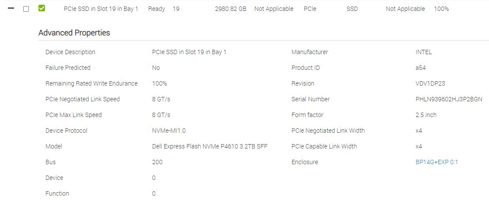

# NVMe Performance Testing

## Helpful Resources

[How fast are your disks? Find out the open source way, with fio (arstechnica)](https://arstechnica.com/gadgets/2020/02/how-fast-are-your-disks-find-out-the-open-source-way-with-fio/)
## Configuration

### Drives

### OS

    [root@r8402 ~]# cat /etc/*-release
    NAME="Red Hat Enterprise Linux"
    VERSION="8.2 (Ootpa)"
    ID="rhel"
    ID_LIKE="fedora"
    VERSION_ID="8.2"
    PLATFORM_ID="platform:el8"
    PRETTY_NAME="Red Hat Enterprise Linux 8.2 (Ootpa)"
    ANSI_COLOR="0;31"
    CPE_NAME="cpe:/o:redhat:enterprise_linux:8.2:GA"
    HOME_URL="https://www.redhat.com/"
    BUG_REPORT_URL="https://bugzilla.redhat.com/"

    REDHAT_BUGZILLA_PRODUCT="Red Hat Enterprise Linux 8"
    REDHAT_BUGZILLA_PRODUCT_VERSION=8.2
    REDHAT_SUPPORT_PRODUCT="Red Hat Enterprise Linux"
    REDHAT_SUPPORT_PRODUCT_VERSION="8.2"
    Red Hat Enterprise Linux release 8.2 (Ootpa)
    Red Hat Enterprise Linux release 8.2 (Ootpa)

## Tests

### Test 1

#### Config

    pvcreate /dev/nvme2n1
    pvcreate /dev/nvme1n1
    pvcreate /dev/nvme0n1
    pvcreate /dev/nvme3n1
    vgcreate data /dev/nvme3n1 /dev/nvme2n1 /dev/nvme1n1 /dev/nvme0n1
    lvcreate -l 100%FREE -i4 -I128 -n data data
    mkfs.ext4 -F -b 4096 -E discard,stride=16,stripe-width=256 /dev/mapper/data-data
    mkdir /data
    mount -o rw,auto,discard /dev/mapper/data-data /data

    fio --randrepeat=1 --ioengine=libaio --direct=1 --gtod_reduce=1 --name=test --filename=test --bs=64k --iodepth=32 --size=50G --readwrite=randrw --rwmixread=60

#### Results

    Test: (g=0): rw=randrw, bs=(R) 64.0KiB-64.0KiB, (W) 64.0KiB-64.0KiB, (T) 64.0KiB-64.0KiB, ioengine=libaio, iodepth=32
    fio-3.7
    Starting 1 process
    Test: Laying out IO file (1 file / 51200MiB)
    Jobs: 1 (f=1): [m(1)][100.0%][r=217MiB/s,w=148MiB/s][r=3476,w=2371 IOPS][eta 00m:00s]
    Test: (groupid=0, jobs=1): err= 0: pid=3290: Mon Sep 14 11:17:39 2020
    read: IOPS=3639, BW=227MiB/s (239MB/s)(29.0GiB/134968msec)
    bw (  KiB/s): min=211328, max=261504, per=99.99%, avg=232911.32, stdev=8921.48, samples=269
    iops        : min= 3302, max= 4086, avg=3639.22, stdev=139.41, samples=269
    write: IOPS=2429, BW=152MiB/s (159MB/s)(20.0GiB/134968msec)
    bw (  KiB/s): min=140800, max=169856, per=100.00%, avg=155506.13, stdev=5852.42, samples=269
    iops        : min= 2200, max= 2654, avg=2429.77, stdev=91.43, samples=269
    cpu          : usr=2.19%, sys=8.61%, ctx=98853, majf=0, minf=13
    IO depths    : 1=0.1%, 2=0.1%, 4=0.1%, 8=0.1%, 16=0.1%, 32=100.0%, >=64=0.0%
        submit    : 0=0.0%, 4=100.0%, 8=0.0%, 16=0.0%, 32=0.0%, 64=0.0%, >=64=0.0%
        complete  : 0=0.0%, 4=100.0%, 8=0.0%, 16=0.0%, 32=0.1%, 64=0.0%, >=64=0.0%
        issued rwts: total=491242,327958,0,0 short=0,0,0,0 dropped=0,0,0,0
        latency   : target=0, window=0, percentile=100.00%, depth=32

    Run status group 0 (all jobs):
    READ: bw=227MiB/s (239MB/s), 227MiB/s-227MiB/s (239MB/s-239MB/s), io=29.0GiB (32.2GB), run=134968-134968msec
    WRITE: bw=152MiB/s (159MB/s), 152MiB/s-152MiB/s (159MB/s-159MB/s), io=20.0GiB (21.5GB), run=134968-134968msec

    Disk stats (read/write):
        dm-0: ios=490775/327707, merge=0/0, ticks=3019139/1204501, in_queue=4223640, util=68.01%, aggrios=491243/328000, aggrmerge=1/11, aggrticks=3031345/1210547, aggrin_queue=3827355, aggrutil=67.98%
    sda: ios=491243/328000, merge=1/11, ticks=3031345/1210547, in_queue=3827355, util=67.98%