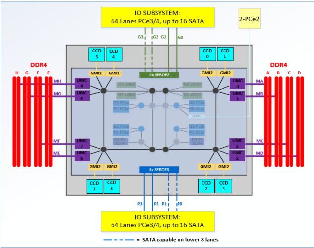
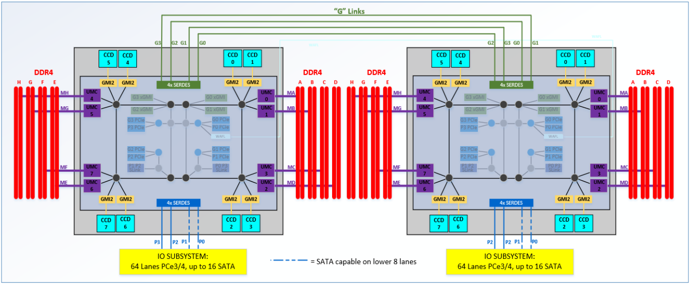
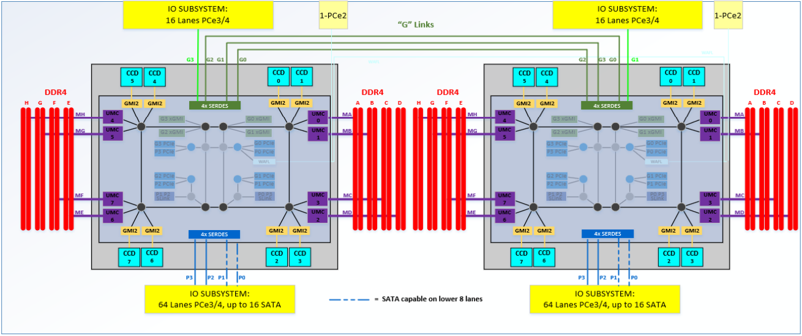
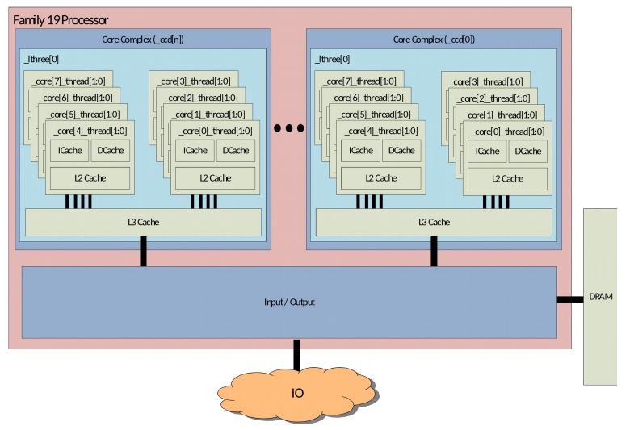
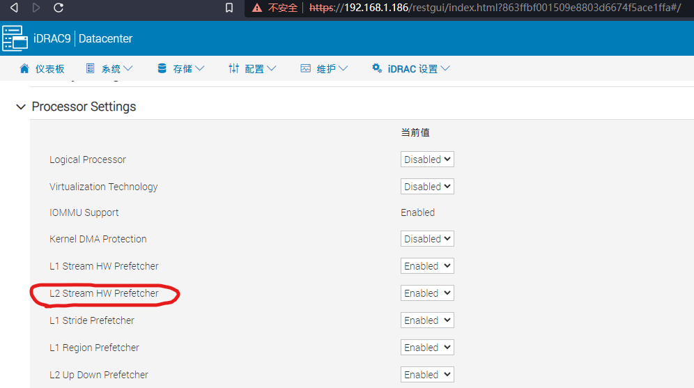
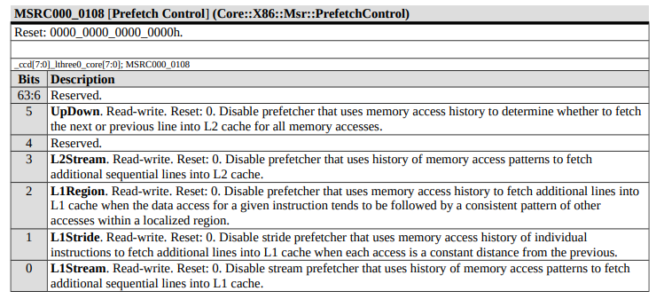

# Notes on AMD Processor

- [Notes on AMD Processor](#notes-on-amd-processor)
  - [Pictures of Physical Package](#pictures-of-physical-package)
  - [Notes from Processor Programming Reference](#notes-from-processor-programming-reference)
    - [I/O Diagram](#io-diagram)
      - [One Socket I/O](#one-socket-io)
      - [Two Socket I/O with 4 XGMI Links](#two-socket-io-with-4-xgmi-links)
    - [Two Socket I/O with 3 XGMI Links](#two-socket-io-with-3-xgmi-links)
    - [Core Complex (CCX) Diagram](#core-complex-ccx-diagram)
    - [How is the iDRAC connected?](#how-is-the-idrac-connected)
    - [Measuring Performance - Effective Frequency](#measuring-performance---effective-frequency)
    - [System Management Unit](#system-management-unit)
  - [How to Change Processor Settings](#how-to-change-processor-settings)
    - [Run Commands on the Processor](#run-commands-on-the-processor)

## Pictures of Physical Package

[Link](https://qr.ae/pru3MB)

## Notes from Processor Programming Reference

See [here](https://www.amd.com/system/files/TechDocs/55898_B1_pub_0.50.zip) for source.

### I/O Diagram

#### One Socket I/O

[See page 32](./images/ppr_B1_pub_1.pdf#page=32)

#### Two Socket I/O with 4 XGMI Links

[See page 34](images/ppr_B1_pub_1.pdf#page=34)

### Two Socket I/O with 3 XGMI Links

[See page 35](images/ppr_B1_pub_1.pdf#page=35)

### Core Complex (CCX) Diagram

[See page 36](images/ppr_B1_pub_1.pdf#page=36)

### How is the iDRAC connected?

See [page 30](./images/ppr_B1_pub_1.pdf#page=30)

Each IOD (I/O die) has:

Four instances of NorthBridge IO (NBIO), each of which includes:

- Two 8x16 PCIe® Gen4 controllers.
- One instance includes a 2x2 PCIe® Gen 2 controller, which can be used to attach a Baseband Management Controller (BMC)

### Measuring Performance - Effective Frequency

When using something like iDRAC telemetry it can poll the effective frequency via the effective frequency interface.

- See [page 47](images/ppr_B1_pub_1.pdf#page=47)
- [Review on C vs P States](https://learn.microsoft.com/en-us/previous-versions/windows/desktop/xperf/p-states-and-c-states)

> The effective frequency interface allows software to discern the average, or effective, frequency of a given core over a configurable window of time. This provides software a measure of actual performance rather than forcing software to assume the current frequency of the core is the frequency of the last P-state requested

### System Management Unit

There is a system management unit for each proc [integrated onto the I/O die](./images/ppr_B1_pub_1.pdf#page=30).

## How to Change Processor Settings

There are three ways to change settings on the processor:

- [AMD Host System Management Port (HSMP)](https://github.com/amd/amd_hsmp)
- [Epyc System Management Interface (E-SMI) Library](https://developer.amd.com/e-sms/e-smi-in-band-library/)
  - Technically, this rides on top of the HSMP but it is a separate userspace library
- Run Commands Directly on the Processor

### Run Commands on the Processor

Let's say you want to disable the L2 Stream HW Prefetcher.

This can be accomplished with the [write MSR (Model Specific Register) Command](https://learn.microsoft.com/en-us/windows-hardware/drivers/debugger/wrmsr--write-msr-). [Model Specific Registers (MSRs)](https://en.wikipedia.org/wiki/Model-specific_register) are:

> any of various control registers in the x86 instruction set used for debugging, program execution tracing, computer performance monitoring, and toggling certain CPU features.

There is a good lecture available on the subject available [here](https://www.cs.usfca.edu/~cruse/cs630f06/lesson27.ppt).

If you want to control prefetch you would select the appropriate register and then bitmask 1 to bit 3 as described here:

