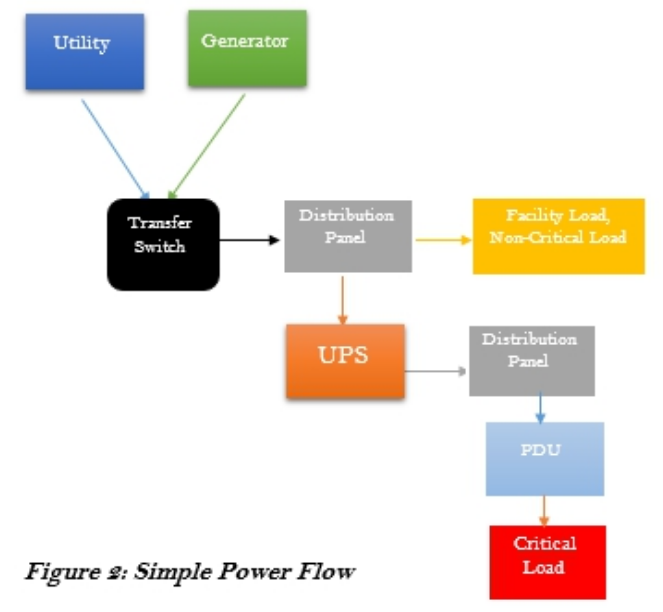
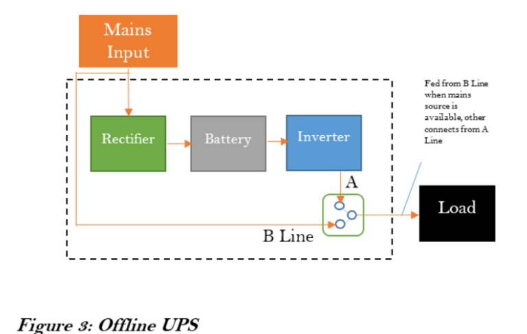
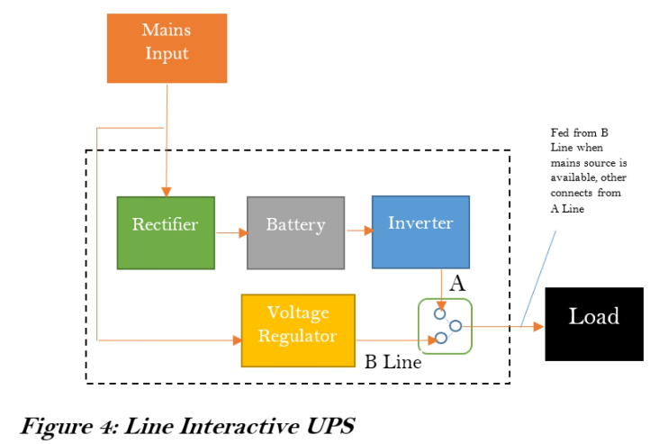
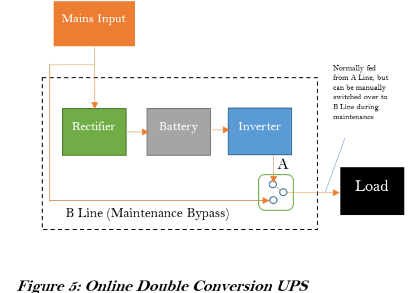
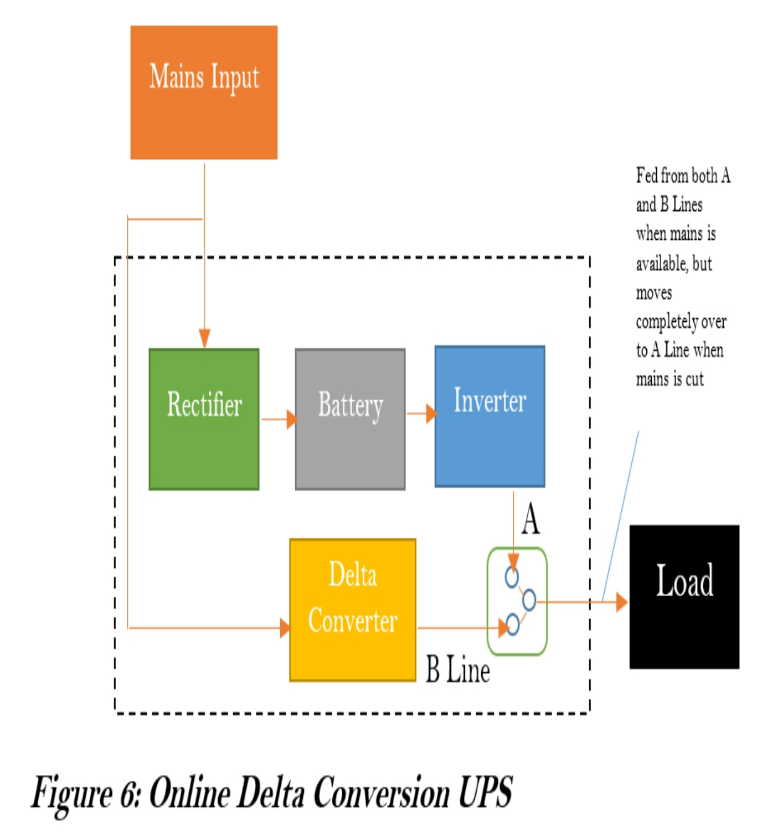
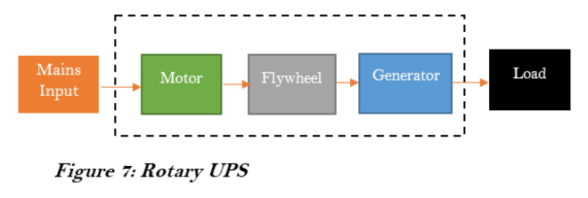
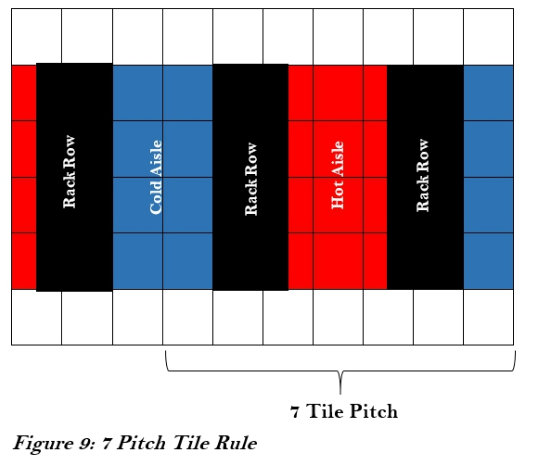

# Notes on Building a Datacenter from Scratch
- [Notes on Building a Datacenter from Scratch](#notes-on-building-a-datacenter-from-scratch)
  - [Power](#power)
    - [Rough Flow of Power](#rough-flow-of-power)
      - [Details on UPS](#details-on-ups)
        - [Offline UPS](#offline-ups)
        - [Line Interactive](#line-interactive)
        - [Online Double conversion UPS\*\*](#online-double-conversion-ups)
        - [Online Delta conversion UPS\*\*](#online-delta-conversion-ups)
        - [Rotary UPS Systems](#rotary-ups-systems)
  - [Cooling](#cooling)
    - [Cooling Types](#cooling-types)
      - [Room Cooling](#room-cooling)
      - [Row Cooling](#row-cooling)
      - [Rack Cooling](#rack-cooling)
    - [Notes on Physics](#notes-on-physics)
      - [Heat Removal Techniques](#heat-removal-techniques)
      - [Humidity](#humidity)
    - [Cooling Strategies](#cooling-strategies)
      - [Aisle Arrangement](#aisle-arrangement)
      - [Sealed Rooms](#sealed-rooms)
      - [Airflow Management](#airflow-management)
    - [CRAC vs CRAH](#crac-vs-crah)

## Power

- Typically, the total power supplied to the Data Center should be two times or more than the total power required by the IT equipment (including future Loads). The other half will be consumed by the cooling and other facilities.
- Power is usually measured in Watts (W). Each piece of IT equipment has a specific Wattage, or Power Rating, specifying the amount of Power it consumes. The total sum of Power Ratings of all IT equipment running in the Data Center gives the total IT Load of the Data Center.
  - IT Load, or Critical Load, is the total Power consumed by all critical IT equipment in the Data Center.
  - Most manufacturer specified power requirements for IT equipment are usually over-stated. Actual consumption typically does not exceed 70% of stated value. A good practice is to de-rate stated values by 60 – 70% before computing total IT Load
  - Industry best practice is to allocate 4 -5 kW per rack. (TODO - still current in 2022?)

### Rough Flow of Power

- Utility Supply
- Generators
- Transfer Switches
- Distribution Panels
- Uninterruptible Power Supply (UPS)
- PDU

**Utility Supply** is the power supply to the Data Center sourced from the public distribution grid. It is controlled by the government or public power distribution companies and is not considered a reliable source for powering the Data Center. They are however utilized to minimize the costs of providing power to the Data Center.

**Generators** are machines used to generate electrical Power. They convert mechanical energy, usually from motors, to the electrical energy used to power the Data Center. They are the primary source of Power to the Data Center, since they are completely in the control of the Data Center Operators.

**Transfer Switches** are electrical switches used to transfer electric Load from one power source to the other. The transfer could be from one utility line to another, from engine-generators to utility and vice versa, or between two generators. The transfer could be manually activated. It could also be automatic when Automatic Transfer Switches (ATS) or Static Transfer Switches (STS) are used.

**Distribution Panel** as the name implies is an enclosure wherein a single electrical power feed is divided into separate subsidiary circuits for feeding multiple distinct Loads. The circuits may all be of equal or differing capacities. Each circuit or power feed is protected by a circuit breaker or an electrical fuse to prevent the end electrical Loads from over-drawing power beyond specified limits

**UPS means Uninterruptible Power Supply**. The UPS is an electrical device that provides continuous power to a Load even when the mains power source is unavailable. It works by storing electrical energy in backup devices, such as batteries, from input power. The UPS then supplies the Load with the stored energy almost instantaneously when the input power is cut off. Another important function of the UPS is to clean out and stabilize the power from the mains supply. The power from the mains supply can be subject to fluctuations in form, voltage, and frequency owing to interference or generation conditions. The UPS has the ability to correct some of these anomalies.

**PDU** means Power Distribution Unit. The PDU distributes power to the individual pieces of equipment. The PDUs come in various sizes and forms, with some being rack-mountable while others occupy Data Center whitespace.

#### Details on UPS

There are two types of UPS Systems: Static UPS and Rotary UPS

Static UPS Systems are so named because they have no moving parts throughout the power flow. They typically store electricity in the form of chemical energy in batteries. This UPS system has three main components:
 
- The rectifier, which converts AC from the mains into DC
- The storage medium, which stores the converted DC. The most common form for storing electrical energy is through batteries[8]
- The inverter, which converts stored DC to AC for supply to the electrical load

##### Offline UPS

Here, the Load is powered directly from the mains when the mains input is present. The UPS switches the Load over to the battery when the mains input goes off. There is a noticeable time lag during the switching process. More so, the irregularities (if any) in the mains power are carried over to the Load. These make this configuration not conducive for sensitive critical Load.

##### Line Interactive

This configuration is similar to the Offline system. However, a voltage regulator is introduced after the mains just before the Load. The Voltage Regulator corrects some of the irregularities, but cannot correct frequency. There is still a noticeable time lag during the switching process. Critical Load is not to be powered with this system.

##### Online Double conversion UPS**

This configuration completely isolates the Load from the mains input. The Load is always fed from the DC Power. The AC power from the mains is converted to DC to keep the batteries charged. The inverter then converts the DC back to AC to supply the Load. This ensures that the supply to the Load is always clean and continuous, making it suitable to critical Data Center Loads. A bypass is included so that the Load can be switched manually switched over to the mains supply temporarily during maintenance operations. One drawback however is that this configuration is not very efficient due to losses accrued during the conversion processes.

##### Online Delta conversion UPS**

This is a variation of the Line Interactive system. It uses a Delta Converter in place of the Voltage Regulator. The Delta Conversion UPS allows a portion of the Load to be fed from the main, while the rest is fed from the Inverter. This allows the stabilization of the output voltage. It also ensures that there is no switching time lag if the main’s input is cut, as the Inverter can seamlessly assume the rest of the Load

##### Rotary UPS Systems

Rotary UPS Systems are so named because they store electrical energy in the form of kinetic energy.

The incoming main’s supply drives a motor which in turn spins an electro-mechanical flywheel at a very high rate. The flywheel drives an electrical generator to provide power to the Load, while at the same time storing Kinetic Energy. Once power failure occurs, the Kinetic Energy in the flywheel is released to drive the generator, so that it continues to power the Load, providing a ride-through period within which the backup generator can be started.

Some variations add batteries to the flywheel for energy storage. Another variation incorporates a Diesel Generator into the Rotary UPS System. Once the power outage exceeds a few seconds, the Diesel Generator is started to provide the input power. This precludes the need for an external backup generator. This system is known as a Diesel Rotary UPS (DRUPS) system.

There has been an [ongoing argument](images/DBOY-78KRZE_R2_EN.pdf) about which UPS system is best suited for Data Center functions. While Static UPS systems dominate the existing Data Center deployments, there is still much benefit a Rotary UPS system can offer. Manufacturers of both systems continue to advance arguments supporting their chosen lines.

Rotary UPS systems are usually manufactured for higher power ranges (200kW and above). DRUPS systems are generally not found in capacities lower than 500kW.

Rotary systems provide little ride-through time (about 15 seconds) compared to Static systems, which can backup power for up to 30 minutes. Also, Rotary systems require vigorous maintenance regimes, unlike Static systems, which most times just need routine cleaning.

On the other hand, Rotary systems allow for massive savings in expensive Data Center space. They also have a considerable lifespan compared to Static UPS system components.

In all cases, the choice of which UPS system to utilize will depend on what system suits the Business objective better.

## Cooling

### Cooling Types

#### Room Cooling

In this approach, cooling is provided for the room as a whole. This method can be suitable for small data centers, but decidedly become more cumbersome as the data center density increases. This is because the air conditioners have to constantly stir and mix the air in the room to prevent hot-spots and bring it to a common regular temperature.

#### Row Cooling

In this approach, cooling is provided on a row by row basis. This allows each row to run different load densities, so that differing cooling intensities can be applied as required.

Hot-spot and cooling irregularities can be easily managed by proper layout and equipment placement.

#### Rack Cooling

In this approach, cooling is provided on a rack by rack basis. Specific air-conditioning units are dedicated to specific racks. This approach allows for maximum densities to be deployed per rack. However, this advantage can only be realized in data centers with fully loaded racks, otherwise, there would be too much cooling capacity, and air-conditioning losses alone can exceed total IT load.

### Notes on Physics

#### Heat Removal Techniques

From Physics, we learn that heat can only flow in one direction – from hot to cold. We also learn heat can be transferred either by Conduction, Convection, or Radiation.

Conduction is the transfer of heat through a solid material, known as a conductor. Convection is the transfer of heat through the movement of a liquid or gas. Radiation is the transfer of heat by means of electromagnetic waves, emitted due to the temperature difference between two objects.

Convection is the method used to transfer heat away from the data center. This transfer is done through a process known as the Refrigeration Cycle.

The Refrigeration Cycle is a cycle of Evaporation, Compression, Condensation, and Expansion of a fluid or gas. This fluid or gas is known as the Refrigerant. The Refrigeration Cycle effectively transfers heat away from the data center into the external environment.

Through the different stages of the refrigeration cycle, the refrigerant’s physical state oscillates between liquid and gas.

Evaporation will absorb heat from the data center environment and turn the refrigerant into a gas. This heat in the gaseous refrigerant is channeled to the compressor

Compression will apply pressure to the gaseous refrigerant, making it absorb much more heat thereby causing its internal temperature to rise. This hot gaseous refrigerant is channeled to the condenser in the next phase of eliminating data center heat.

Condensation will pass heat from the high-temperature high-pressure gas to the outside air. As heat flows from the hot region to the cold region, outside air is directed to the condensation coil. The refrigerant flowing through the coil then transfers heat to the outside air, which is then channeled out to the outdoor environment. The refrigerant then becomes a hot, high-pressure liquid.

Expansion will reduce the pressure in the refrigerant thereby reducing the temperature. This ends the cycle with the refrigerant returning to a cold liquid. The cycle is then restarted.

Another method of removing heat from the data center is via Chilled Water Systems. This method, while more efficient and cost-effective than direct expansion systems using the refrigeration cycle, is much more complex. It utilizes fans and cooling coils to remove heat from the data center via chilled water.

#### Humidity

Like temperature, humidity[12] is also an important environmental factor in the data center. Regulating humidity is critical. Too low humidity levels affect the incidence of static electricity, which is an electric charge at rest. This electric charge can lead to an Electrostatic Discharge (ESD), which could cause significant damage to IT equipment. Too high humidity can cause water condensation on IT equipment, which could lead to water dropping on the chips in equipment, resulting in a current short-circuit.

In measuring humidity, the terms Relative Humidity, Dew Point, and Saturation are used.

Relative humidity is the amount of water vapor in the air as a percentage of the maximum amount of water vapor the air can hold at a given temperature. It follows that relative humidity can vary as the air temperature changes. e.g. at a higher temperature, air will expand causing it to be able to hold more water, thus relative humidity becomes lower. The reverse is the case at lower temperatures. ASHRAE recommends maximum relative humidity levels of 60%.

Dew point is the exact temperature where relative humidity becomes 100%. At this point, the water vapor leaves the air and appears as liquid water droplets on any object in the data center. ASHRAE recommends a maximum of 15.50C dew point. The air is said to be “saturated” at this temperature.

Humidity in the data center is regulated using Precision Cooling units, which regulate temperature and water vapor levels in the environment. Humidification/Dehumidification systems are used. These produce/reduce water vapor in the atmosphere to the desired quantities.

In addition to humidity regulation equipment, the following practices should be followed to restrict fluctuation in humidity levels:

- Reduce the frequency of entry/exit into/from the data center. Constant opening of data center entrances can lead to infiltration of warmer air from outside, which could destabilize the environment
- Seal perimeter infiltrations and entrance points that lead to uncontrolled environments
- Seal doorways to guard against air and vapor leaks
- Paint perimeter walls to prevent the penetration of moisture
- Avoid unnecessary openings

### Cooling Strategies

#### Aisle Arrangement

As discussed in an earlier section, it is advantageous to provide cooling on a row-by-row basis. Taking this further, many standard bodies, including TIA and ASHRAE, recommend arranging racks and cabinets in a hot-aisle/cold-aisle alignment.

In this arrangement, the racks in each row are arranged such that the front and backs of adjacent rows face each other. This leads to a repeatable sequence after every 7 tiles, known as the 7 pitch tile rule.

When cold air is channeled to the front of the racks in this arrangement, the aisle between racks’ fronts facing each other is distinctly cold (cold aisle), while that at racks’ backs is distinctly hot (hot aisle).

The cooling unit is placed at the hot aisle. Proper distance should be maintained between the air cooling unit and the equipment, typically between 2.5m (8ft) and 10m (32ft).

#### Sealed Rooms

The data center should be completely sealed to prevent the escape of cold air to the external environment. This could progressively worsen the energy situation as more and more energy is consumed to adequately cool the server room space only for the cold air to escape to other areas

#### Airflow Management

Open spaces in the cabinets should be minimized as much as possible. This can be done by placing blanking plates in unused rack unit spaces, blocking of cabinet sides, and making use of perforated front and back doors.

**In-Row Units** - Can be used to cool by sucking in the hot air in the hot aisle.

### CRAC vs CRAH

CRAH is an acronym for Computer Room Air Handler, while CRAC is an acronym for Computer Room Air Conditioner.

CRAHs are indoor cooling units that do not have their own compressors. They are typically components of a Chilled Water-based cooling system.

CRACs on the other hand have their own self-contained compressor. They are a staple of Direct Expansion based cooling systems.
