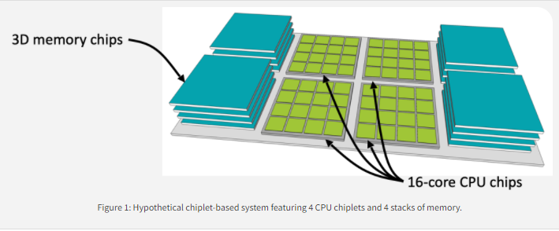

# Chiplet-Based Systems

[Return to HPC Notes README.md](./README.md)

## What is the problem

- Moore's Low is slowing
- Manufacturing costs are rising
- You could make larger chips to increase performance but:
  - They are more expensive to make
  - Verification costs are higher
  - Manufacturing defects in densely packed logic reduce wafer yield
- You could create specialized chips but it is difficult to make a financial case for that

## What are chiplet-based systems

Chiplet-based systems propose the integration of multiple discrete chips within the same package via an integration technology such as a multi-chip module or silicon interposer. Ex:

From: https://www.sigarch.org/chiplet-based-systems/

### Why chiplets

#### Cost

Previously, chiplets weren't considered practical because you introduce multiple parts plus having to contend with on-dye communication between them. However, now the smaller chips have sufficiently cheap manufacturing costs (compared to larger) that this is a viable alternative.

#### Flexibility

If you want to move from mobile, to desktop, to server this may be a matter of just increasing the number of chiplets. It is also possible that if we develop the proper standards that we could have a future system where we have general interconnects which would allow multiple different vendor chiplets to work together. Ex: [Common Heterogeneous Integration and IP Reuse Strategies (CHIPS)](https://www.darpa.mil/program/common-heterogeneous-integration-and-ip-reuse-strategies)

## Questions

### What is process technology?

A process technology is the process of creating a single chip. In this case, you could use older process technologies to create the chiplets and then put them together.