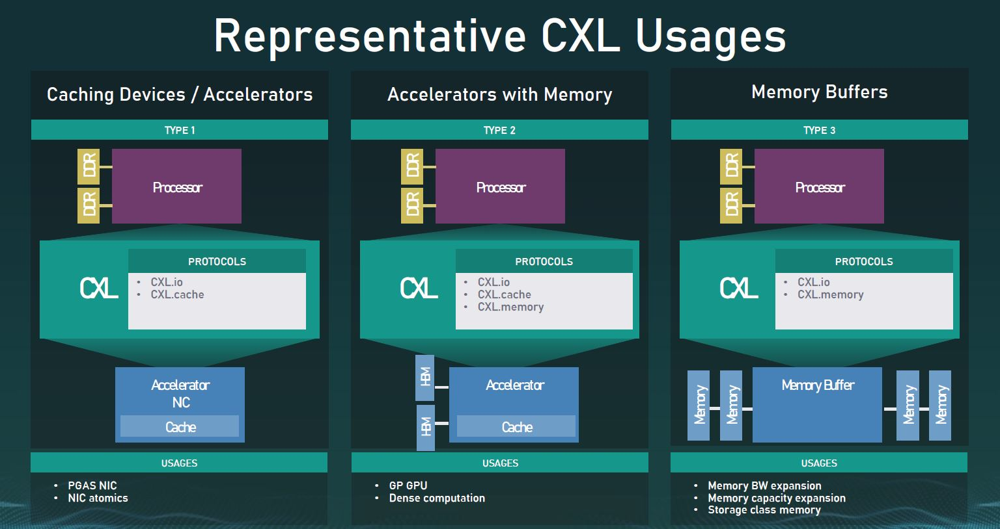
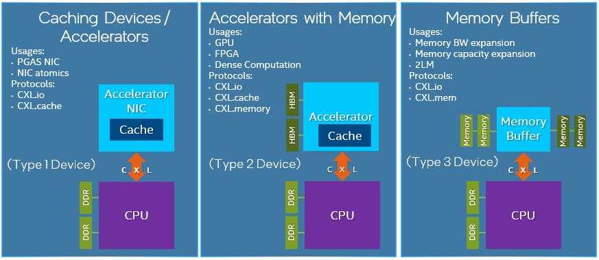

# Compute Express Link (CXL)

- [Compute Express Link (CXL)](#compute-express-link-cxl)
  - [Useful Resources](#useful-resources)
  - [Examples of Vendor Interconnects](#examples-of-vendor-interconnects)
    - [More Specific Interconnects](#more-specific-interconnects)
  - [What is the Purpose of CXL?](#what-is-the-purpose-of-cxl)
  - [Protocols](#protocols)
  - [Devices](#devices)
  - [Memory Pooling](#memory-pooling)
  - [Switching](#switching)

## Useful Resources

Interesting article on roadmap: https://www.nextplatform.com/2021/09/07/the-cxl-roadmap-opens-up-the-memory-hierarchy/
Deep Dive: https://www.nextplatform.com/2019/09/18/eating-the-interconnect-alphabet-soup-with-intels-cxl/

## Examples of Vendor Interconnects

- Intel's Compute Express Link (CXL)
- IBM's Coherent Accelerator Interface (CAPI)
- Xilinx's Cache Coherence Interconnect for Accelerators (CCIX)
- AMD's Infinity Fabric

### More Specific Interconnects

- Nvidia's NVLink
- IBM's OpenCAPI
- HPE's Gen-Z: It can be used to hook anything from DRAM to flash to accelerators in meshes with any manner of CPU.

## What is the Purpose of CXL?

The primary purpose is to disaggregate I/O and memory and to effectively virtualize the motherboard to make the following malleable across clusters of components:
- Compute, memory, and I/O
- Computational offload to devices such as GPU and FPGA accelerators
- Memory buffers and other kinds of devices such as SmartNICs

CXL is a set of sub-protocols that ride on the PCI-Express bus on a single link

## Protocols

- CXL.io: This protocol is functionally equivalent to the PCIe 5.0 protocol and utilizes the broad industry adoption and familiarity of PCIe. It is effectively the PCIe transaction layer reformatted to allow two sub-protocols to co-exist side by side. CXL.io is used to discover devices in systems, manage interrupts, give access to registers, handle initialization, and deal with signaling errors.
  - CXL.cache: This sub-protocol, which is designed for more specific applications, enables accelerators to efficiently access and cache host memory for optimized performance. It allows an accelerator to access the CPU's DRAM.
  - CXL.memory: This protocol enables a host, such as a processor, to access device-attached memory using load/store commands.

It is not expected that all three protocols are used in all configurations. There are three basic usage templates which represent the three usages expected:

From https://www.servethehome.com/compute-express-link-cxl-2-0-specification-released-the-big-one/cxl-1-0-and-1-1-usages/

## Devices

**High Level**
- Type 1 Device - Coherently access host memory. Ex: PGAS NIC / NIC atomics
- Type 2 Device - Can coherently access host memory and allow the host to access device memory. Ex: An accelerator with attached memory and optional coherent cache. GPU/dense computation
- Type 3 Device - Can access and manage attached device memory. Ex: memory expanders or buffers
- 

**Detailed**
- Type 1 Devices: Accelerators such as smart NICs typically lack local memory. However, they can leverage the CXL.io protocol and CXL.cache to communicate with the host processors DDR memory.
- Type 2 Devices: GPUs, ASICs, and FPGAs are all equipped with DDR or HBM memory and can use the CXL.memory protocol, along with the CXL.io and CXL.cache, to make the host processor�s memory locally available to the accelerator�and the accelerator�s memory locally available to the CPU. They are also co-located in the same cache coherent domain and help boost heterogeneous workloads.
- Type 3 Devices: The CXL.io and CXL.memory protocols can be leveraged for memory expansion and pooling. For example, a buffer attached to the CXL bus could be used to enable DRAM capacity expansion, augmenting memory bandwidth, or adding persistent memory without the loss of DRAM slots. In real world terms, this means the high-speed, low-latency storage devices that would have previously displaced DRAM can instead complement it with CXL-enabled devices. These could include non-volatile technologies in various form factors such as add-in cards, U.2, and EDSFF.

## Memory Pooling

CXL 2.0 supports switching to enable memory pooling. With a CXL 2.0 switch, a host can access one or more devices from the pool. Although the hosts must be CXL 2.0-enabled to leverage this capability, the memory devices can be a mix of CXL 1.0, 1.1, and 2.0-enabled hardware. At 1.0/1.1, a device is limited to behaving as a single logical device accessible by only one host at a time. However, a 2.0 level device can be partitioned as multiple logical devices, allowing up to 16 hosts to simultaneously access different portions of the memory.

As an example, a host 1 (H1) can use half the memory in device 1 (D1) and a quarter of the memory in device 2 (D2) to finely match the memory requirements of its workload to the available capacity in the memory pool. The remaining capacity in devices D1 and D2 can be used by one or more of the other hosts up to a maximum of 16. Devices D3 and D4, CXL 1.0 and 1.1-enabled respectively, can be used by only one host at a time.

## Switching

By moving to a CXL 2.0 direct-connect architecture, data centers can achieve the performance benefits of main memory expansion�and the efficiency and total cost of ownership (TCO) benefits of pooled memory. Assuming all hosts and devices are CXL 2.0-enabled, �switching is incorporated into the memory devices via a crossbar in the CXL memory pooling chip. This keeps latency low but requires a more powerful chip since it is now responsible for the control plane functionality performed by the switch. With low-latency direct connections, attached memory devices can employ DDR DRAM to provide expansion of host main memory. This can be done on a very flexible basis, as a host is able to access all�or portions of�the capacity of as many devices as needed to tackle a specific workload.