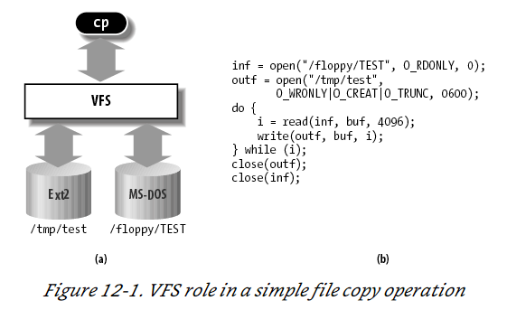
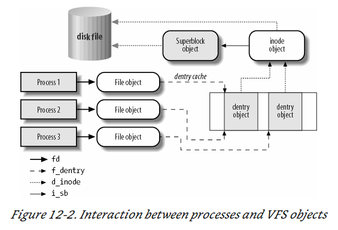
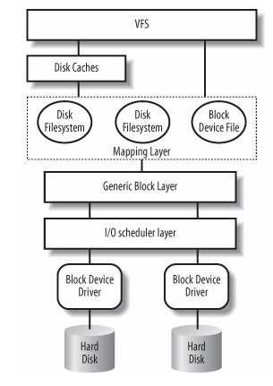
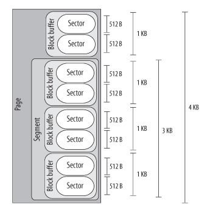

# Notes on mdraid Performance Testing

- [Notes on mdraid Performance Testing](#notes-on-mdraid-performance-testing)
  - [Helpful Resources](#helpful-resources)
  - [Helpful Commands](#helpful-commands)
    - [Check I/O Scheduler](#check-io-scheduler)
    - [Check Available CPU Governors](#check-available-cpu-governors)
  - [RAW IO vs Direct IO](#raw-io-vs-direct-io)
  - [My Notes](#my-notes)
    - [What are NUMAs per socket?](#what-are-numas-per-socket)
    - [What is rq_affinity](#what-is-rq_affinity)
  - [Configuration](#configuration)
  - [My Hardware](#my-hardware)
  - [My Configuration](#my-configuration)
    - [FIO Command](#fio-command)
      - [libaio](#libaio)
      - [I/O Depth](#io-depth)
      - [Direct](#direct)
      - [Ramp Time](#ramp-time)
      - [Time Based](#time-based)
      - [readwrite (rw)](#readwrite-rw)
      - [Name](#name)
      - [numjobs](#numjobs)
      - [Blocksize](#blocksize)
      - [NUMA Memory Policy](#numa-memory-policy)
      - [NUMA CPU Nodes](#numa-cpu-nodes)
    - [Raw I/O Testing](#raw-io-testing)
  - [Research](#research)
  - [P-states and C-States](#p-states-and-c-states)
    - [Power performance states (ACPI P states)](#power-performance-states-acpi-p-states)
    - [Processor idle sleep states (ACPI C states)](#processor-idle-sleep-states-acpi-c-states)
    - [I/O Models](#io-models)
      - [Blocking I/O](#blocking-io)
      - [Nonblocking I/O](#nonblocking-io)
      - [I/O Multiplexing Model](#io-multiplexing-model)
      - [Signal Driven I/O Model](#signal-driven-io-model)
      - [Asynchronous I/O Model](#asynchronous-io-model)
    - [What is aqu-sz](#what-is-aqu-sz)
  - [From Understanding the Linux Kernel](#from-understanding-the-linux-kernel)
    - [How does VFS Work?](#how-does-vfs-work)
      - [The superblock object](#the-superblock-object)
      - [The inode object](#the-inode-object)
      - [The file object](#the-file-object)
      - [The dentry object](#the-dentry-object)
    - [Block Devices Handling](#block-devices-handling)
    - [Block Device Sizes](#block-device-sizes)
      - [Sectors](#sectors)
      - [Blocks](#blocks)
      - [Segments](#segments)
    - [Generic Block layer](#generic-block-layer)
  - [My Questions](#my-questions)


## Helpful Resources

https://www.amd.com/system/files/TechDocs/56163-PUB.pdf

https://www.computerworld.com/article/2785965/raw-disk-i-o.html

https://www.cloudbees.com/blog/linux-io-scheduler-tuning

https://wiki.ubuntu.com/Kernel/Reference/IOSchedulers

http://developer.amd.com/wp-content/resources/56420.pdf

https://infohub.delltechnologies.com/l/cpu-best-practices-3/poweredge-numa-nodes-per-socket-1#:~:text=AMD%20servers%20provide%20the%20ability,bank%20into%20two%20equal%20parts.

## Helpful Commands

### Check I/O Scheduler

```bash
# cat /sys/block/sda/queue/scheduler
noop [deadline] cfq
```

### Check Available CPU Governors

```bash
cpupower frequency-info --governors
analyzing CPU 0:
  available cpufreq governors: performance powersave
```


## RAW IO vs Direct IO

Raw I/O is issued directly to disk offsets, bypassing the file system altogether. It has been used by some applications, especially databases, that can manage and cache their own data better than the file system cache. A drawback is more complexity in the software. From Oracle’s official website, input/output (I/O) to a raw partition offers approximately a 5% to 10% performance improvement over I/O to a partition with a file system on it.

Direct I/O allows applications to use a file system but bypass the file system cache, for example, by using the O_DIRECT open(2) flag on Linux. This is similar to synchronous writes (but without the guarantees that O_SYNC offers), and it works for reads as well. It isn’t as direct as raw device I/O, since mapping of file offsets to disk offsets must still be performed by file system code, and I/O may also be resized to match the size used by the file system for on-disk layout (its record size) or it may error (EINVAL).

## My Notes

### What are NUMAs per socket?

[What are NUMAs per socket](https://hpcadvisorycouncil.atlassian.net/wiki/spaces/HPCWORKS/pages/1280442391/AMD+2nd+Gen+EPYC+CPU+Tuning+Guide+for+InfiniBand+HPC#:~:text=There%20is%20a%20new%20feature,use%20its%20assigned%20memory%20controllers.)

### What is rq_affinity

https://access.redhat.com/documentation/en-us/red_hat_enterprise_linux/7/html/performance_tuning_guide/sect-red_hat_enterprise_linux-performance_tuning_guide-storage_and_file_systems-configuration_tools

By default, I/O completions can be processed on a different processor than the processor that issued the I/O request. Set rq_affinity to 1 to disable this ability and perform completions only on the processor that issued the I/O request. This can improve the effectiveness of processor data caching.


## Configuration

Initial driver: /lib/modules/4.18.0-305.el8.x86_64/kernel/drivers/md/raid456.ko.xz

I think this has been changed?

mdraid looks like it has two stripes 12 NVMe drives in one and 12 in the other all in RAID5.

They are all numa aligned by some program called map_numa.sh.

Must check drive

## My Hardware

Dell R840
12 Intel P4610
NVMe drives are only attached to processors three and four in the split backplane configuartion.
## My Configuration

1. I checked firmware rev with `nvme list` to make sure that all drives were the same. If not need to update
   1. TODO still need to do
2. Set the CPU governor to performance. You can check the governors with `cpupower frequency-info --governors` and then set it with `cpupower frequency-set --governor performance`. You can check the current governor with `cat /sys/devices/system/cpu/cpu0/cpufreq/scaling_governor` (substitute the CPU number accordingly)
3. 

### FIO Command

#### libaio

Linux native asynchronous I/O. Note that Linux may only support queued behavior with non-buffered I/O (set direct=1 or buffered=0). This engine defines engine specific options.

#### I/O Depth

Number of I/O units to keep in flight against the file. Note that increasing iodepth beyond 1 will not affect synchronous ioengines (except for small degrees when verify_async is in use). Even async engines may impose OS restrictions causing the desired depth not to be achieved. This may happen on Linux when using libaio and not setting direct=1, since buffered I/O is not async on that OS. Keep an eye on the I/O depth distribution in the fio output to verify that the achieved depth is as expected. Default: 1.

#### Direct

If value is true, use non-buffered I/O. This is usually O_DIRECT. Note that OpenBSD and ZFS on Solaris don’t support direct I/O. On Windows the synchronous ioengines don’t support direct I/O. Default: false.

#### Ramp Time

If set, fio will run the specified workload for this amount of time before logging any performance numbers. Useful for letting performance settle before logging results, thus minimizing the runtime required for stable results. Note that the ramp_time is considered lead in time for a job, thus it will increase the total runtime if a special timeout or runtime is specified. When the unit is omitted, the value is given in seconds.

#### Time Based

If set, fio will run for the duration of the runtime specified even if the file(s) are completely read or written. It will simply loop over the same workload as many times as the runtime allows.

#### readwrite (rw)

Type of I/O pattern. Fio defaults to read if the option is not specified. For the mixed I/O types, the default is to split them 50/50. For certain types of I/O the result may still be skewed a bit, since the speed may be different.

It is possible to specify the number of I/Os to do before getting a new offset by appending :<nr> to the end of the string given. For a random read, it would look like rw=randread:8 for passing in an offset modifier with a value of 8. If the suffix is used with a sequential I/O pattern, then the <nr> value specified will be added to the generated offset for each I/O turning sequential I/O into sequential I/O with holes. For instance, using rw=write:4k will skip 4k for every write. Also see the rw_sequencer option.

#### Name

ASCII name of the job. This may be used to override the name printed by fio for this job. Otherwise the job name is used. On the command line this parameter has the special purpose of also signaling the start of a new job.

#### numjobs

Create the specified number of clones of this job. Each clone of job is spawned as an independent thread or process. May be used to setup a larger number of threads/processes doing the same thing. Each thread is reported separately; to see statistics for all clones as a whole, use group_reporting in conjunction with new_group. See --max-jobs. Default: 1.

#### Blocksize

The block size in bytes used for I/O units. Default: 4096. A single value applies to reads, writes, and trims. Comma-separated values may be specified for reads, writes, and trims. A value not terminated in a comma applies to subsequent types.

#### NUMA Memory Policy

Set this job’s memory policy and corresponding NUMA nodes. Format of the arguments:

```
<mode>[:<nodelist>]
```

mode is one of the following memory policies: default, prefer, bind, interleave or local. For default and local memory policies, no node needs to be specified. For prefer, only one node is allowed. For bind and interleave the nodelist may be as follows: a comma delimited list of numbers, A-B ranges, or all.

#### NUMA CPU Nodes

Set this job running on specified NUMA nodes’ CPUs. The arguments allow comma delimited list of cpu numbers, A-B ranges, or all. Note, to enable NUMA options support, fio must be built on a system with libnuma-dev(el) installed.

### Raw I/O Testing

## Research

## P-states and C-States

These are defined in the ACPI specification.

### Power performance states (ACPI P states)

P-states provide a way to scale the frequency and voltage at which the processor runs so as to reduce the power consumption of the CPU. The number of available P-states can be different for each model of CPU, even those from the same family.

### Processor idle sleep states (ACPI C states)

C-states are states when the CPU has reduced or turned off selected functions. Different processors support different numbers of C-states in which various parts of the CPU are turned off. To better understand the C-states that are supported and exposed, contact the CPU vendor. Generally, higher C-states turn off more parts of the CPU, which significantly reduce power consumption. Processors may have deeper C-states that are not exposed to the operating system.

### I/O Models

#### Blocking I/O

In networking, there is a call to recvfrom which will then lead to a system call into the kernel which will block until data is available.

#### Nonblocking I/O

Assuming UDP a call is made to recvfrom and if ther is no data available the kernel sends back EWOULDBLOCK saying no data is available and this is repeated until a datagram is available. This is polling.

#### I/O Multiplexing Model

With I/O multiplexing you call select which will block until data is available and then when data is available it ill return that there is return readable. After this you can call recvfrom. The difference is select can read from multiple potential sockets.

#### Signal Driven I/O Model

In this model we register a signal handler using the sigaction system call. This will listen for the SIGIO signal. When data is ready our SIGIO handler will be called at which point we have two options. We can call recvfrom from the handler and then pass that data to the main thread OR we can alert the main thread that data is waiting and let it handle it.

#### Asynchronous I/O Model

This is the same as signal driven I/O except the thread notifies us when the data has been copied from kernel space to user space. We call aio_read and pass the kernel the fdescriptor, buffer pointer, buffer size (the same three arguments for read), file offset (similar to lseek), and how to notify us when the entire operation is complete. When the copy is complete our signal handler is notified.

### What is aqu-sz

The average queue length of the requests that were issued to the device.

## From Understanding the Linux Kernel

### How does VFS Work?

The idea behind the Virtual Filesystem is to put a wide range of information in the kernel to represent many different types of filesystems ; there is a field or function to support each operation provided by all real filesystems supported by Linux. For each read, write, or other function called, the kernel substitutes the actual function that supports a native Linux filesystem, the NTFS filesystem, or whatever other filesystem the file is on.

Bovet, Daniel P.. Understanding the Linux Kernel (Kindle Locations 14260-14263). O'Reilly Media. Kindle Edition. 



`$ cp /floppy/ TEST /tmp/`

test where /floppy is the mount point of an MS-DOS diskette and /tmp is a normal Second Extended Filesystem (Ext2) directory. The VFS is an abstraction layer between the application program and the filesystem implementations (see Figure 12-1( a)). Therefore, the cp program is not required to know the filesystem types of /floppy/ TEST and /tmp/ test. Instead, cp interacts with the VFS by means of generic system calls known to anyone who has done Unix programming (see the section "File-Handling System Calls" in Chapter 1); the code executed by cp is shown in Figure 12-1( b).

More essentially, the Linux kernel cannot hardcode a particular function to handle an operation such as read( ) or ioctl( ) . Instead, it must use a pointer for each operation; the pointer is made to point to the proper function for the particular filesystem being accessed. Let’s illustrate this concept by showing how the read( ) shown in Figure 12-1 would be translated by the kernel into a call specific to the MS-DOS filesystem. The application’s call to read( ) makes the kernel invoke the corresponding sys_read( ) service routine, like every other system call. The file is represented by a file data structure in kernel memory, as we’ll see later in this chapter. This data structure contains a field called f_op that contains pointers to functions specific to MS-DOS files, including a function that reads a file. sys_read( ) finds the pointer to this function and invokes it. Thus, the application’s read( ) is turned into the rather indirect call: 

```
file-> f_op-> read(...);
```

One can think of the common file model as object-oriented, where an object is a software construct that defines both a data structure and the methods that operate on it. For reasons of efficiency, Linux is not coded in an object-oriented language such as C ++. Objects are therefore implemented as plain C data structures with some fields pointing to functions that correspond to the object’s methods. The common file model consists of the following object types: 

#### The superblock object

Stores information concerning a mounted filesystem. For disk-based filesystems, this object usually corresponds to a filesystem control block stored on disk.

#### The inode object

Stores general information about a specific file. For disk-based filesystems, this object usually corresponds to a file control block stored on disk. Each inode object is associated with an inode number, which uniquely identifies the file within the filesystem. 

#### The file object 

Stores information about the interaction between an open file and a process. This information exists only in kernel memory during the period when a process has the file open. 

#### The dentry object

Stores information about the linking of a directory entry (that is, a particular name of the file) with the corresponding file. Each disk-based filesystem stores this information in its own particular way on disk.

The picture below illustrates with a simple example how processes interact with files. Three different processes have opened the same file, two of them using the same hard link. In this case, each of the three processes uses its own file object, while only two dentry objects are required — one for each hard link. Both dentry objects refer to the same inode object, which identifies the superblock object and, together with the latter, the common disk file.




### Block Devices Handling

We will follow the path of a call to `read()` through the kernel.

1. The service routine of the `read( )` system call activates a suitable VFS function, passing to it a file descriptor and an offset inside the file. The Virtual Filesystem is the upper layer of the block device handling architecture, and it provides a common file model adopted by all filesystems supported by Linux.



2. The VFS function determines if the requested data is already available and, if necessary, how to perform the read operation. Sometimes there is no need to access the data on disk, because the kernel keeps in RAM the data most recently read from — or written to — a block device. TODO - investigate pacge cache in chapter 15 and how VFS talks to the cache in chapter 16.
3. Let’s assume that the kernel must read the data from the block device, thus it must determine the physical location of that data. To do this, the kernel relies on the mapping layer , which typically executes two steps: 
   1. It determines the block size of the filesystem including the file and computes the extent of the requested data in terms of file block numbers . Essentially, the file is seen as split in many blocks, and the kernel determines the numbers (indices relative to the beginning of file) of the blocks containing the requested data.
   2. Next, the mapping layer invokes a filesystem-specific function that accesses the file’s disk inode and determines the position of the requested data on disk in terms of logical block numbers. Essentially, the disk is seen as split in blocks, and the kernel determines the numbers (indices relative to the beginning of the disk or partition) corresponding to the blocks storing the requested data. Because a file may be stored in nonadjacent blocks on disk, a data structure stored in the disk inode maps each file block number to a logical block number.[*]
      1. However, if the read access was done on a [raw block device](https://tldp.org/HOWTO/SCSI-2.4-HOWTO/rawdev.html) file, the mapping layer does not invoke a filesystem-specific method; rather, it translates the offset in the block device file to a position inside the disk — or disk partition — corresponding to the device file.
4. The kernel can now issue the read operation on the block device. It makes use of the generic block layer , which starts the I/ O operations that transfer the requested data. In general, each I/ O operation involves a group of blocks that are adjacent on disk. Because the requested data is not necessarily adjacent on disk, the generic block layer might start several I/ O operations. Each I/ O operation is represented by a “block I/ O” (in short, “bio”) structure, which collects all information needed by the lower components to satisfy the request. The generic block layer hides the peculiarities of each hardware block device, thus offering an abstract view of the block devices. Because almost all block devices are disks, the generic block layer also provides some general data structures that describe “disks” and “disk partitions.”
5. Below the generic block layer, the “I/ O scheduler " sorts the pending I/ O data transfer requests according to predefined kernel policies. The purpose of the scheduler is to group requests of data that lie near each other on the physical medium.
6. Finally, the block device drivers take care of the actual data transfer by sending suitable commands to the hardware interfaces of the disk controllers.

### Block Device Sizes

There are many kernel components that are concerned with data stored in block devices; each of them manages the disk data using chunks of different length: 

- The controllers of the hardware block devices transfer data in chunks of fixed length called “sectors.” Therefore, the I/ O scheduler and the block device drivers must manage sectors of data. 
- The Virtual Filesystem, the mapping layer, and the filesystems group the disk data in logical units called “blocks.” A block corresponds to the minimal disk storage unit inside a filesystem. 
- Block device drivers should be able to cope with “segments” of data: each segment is a memory page — or a portion of a memory page — including chunks of data that are physically adjacent on disk. 
- The disk caches work on “pages” of disk data, each of which fits in a page frame. 
- The generic block layer glues together all the upper and lower components, thus it knows about sectors , blocks, segments, and pages of data.

Even if there are many different chunks of data, they usually share the same physical RAM cells. For instance, Figure 14-2 shows the layout of a 4,096-byte page. The upper kernel components see the page as composed of four block buffers of 1,024 bytes each. The last three blocks of the page are being transferred by the block device driver, thus they are inserted in a segment covering the last 3,072 bytes of the page. The hard disk controller considers the segment as composed of six 512-byte sectors.



#### Sectors

To achieve acceptable performance, hard disks and similar devices transfer several adjacent bytes at once. Each data transfer operation for a block device acts on a group of adjacent bytes called a sector. In the following discussion, we say that groups of bytes are adjacent when they are recorded on the disk surface in such a manner that a single seek operation can access them. Although the physical geometry of a disk is usually very complicated, the hard disk controller accepts commands that refer to the disk as a large array of sectors. In most disk devices, the size of a sector is 512 bytes, although there are devices that use larger sectors (1,024 and 2,048 bytes). Notice that the sector should be considered as the basic unit of data transfer; it is never possible to transfer less than one sector, although most disk devices are capable of transferring several adjacent sectors at once. In Linux, the size of a sector is conventionally set to 512 bytes; if a block device uses larger sectors, the corresponding low-level block device driver will do the necessary conversions. Thus, a group of data stored in a block device is identified on disk by its position — the index of the first 512-byte sector — and its length as number of 512-byte sectors. Sector indices are stored in 32- or 64-bit variables of type sector_t.

#### Blocks

While the sector is the basic unit of data transfer for the hardware devices, the block is the basic unit of data transfer for the VFS and, consequently, for the filesystems. For example, when the kernel accesses the contents of a file, it must first read from disk a block containing the disk inode of the file (see the section "Inode Objects" in Chapter 12). This block on disk corresponds to one or more adjacent sectors, which are looked at by the VFS as a single data unit. In Linux, the block size must be a power of 2 and cannot be larger than a page frame. Moreover, it must be a multiple of the sector size, because each block must include an integral number of sectors. Therefore, on 80 × 86 architecture, the permitted block sizes are 512, 1,024, 2,048, and 4,096 bytes. The block size is not specific to a block device. When creating a disk-based filesystem, the administrator may select the proper block size. Thus, several partitions on the same disk might make use of different block sizes. Furthermore, each read or write operation issued on a block device file is a “raw” access that bypasses the disk-based filesystem; the kernel executes it by using blocks of largest size (4,096 bytes). Each block requires its own block buffer, which is a RAM memory area used by the kernel to store the block’s content. When the kernel reads a block from disk, it fills the corresponding block buffer with the values obtained from the hardware device; similarly, when the kernel writes a block on disk, it updates the corresponding group of adjacent bytes on the hardware device with the actual values of the associated block buffer. The size of a block buffer always matches the size of the corresponding block. Each buffer has a “buffer head” descriptor of type buffer_head. This descriptor contains all the information needed by the kernel to know how to handle the buffer; thus, before operating on each buffer, the kernel checks its buffer head. We will give a detailed explanation of all fields of the buffer head in Chapter 15; in the present chapter, however, we will only consider a few fields: b_page, b_data, b_blocknr, and b_bdev. The b_page field stores the page descriptor address of the page frame that includes the block buffer. If the page frame is in high memory, the b_data field stores the offset of the block buffer inside the page; otherwise, it stores the starting linear address of the block buffer itself. The b_blocknr field stores the logical block number (i.e., the index of the block inside the disk partition). Finally, the b_bdev field identifies the block device that is using the buffer head

#### Segments

We know that each disk I/ O operation consists of transferring the contents of some adjacent sectors from — or to — some RAM locations. In almost all cases, the data transfer is directly performed by the disk controller with a DMA operation (see the section "Direct Memory Access (DMA)" in Chapter 13). The block device driver simply triggers the data transfer by sending suitable commands to the disk controller; once the data transfer is finished, the controller raises an interrupt to notify the block device driver. The data transferred by a single DMA operation must belong to sectors that are adjacent on disk. This is a physical constraint: a disk controller that allows DMA transfers to non-adjacent sectors would have a poor transfer rate, because moving a read/ write head on the disk surface is quite a slow operation. Older disk controllers support “simple” DMA operations only: in each such operation, data is transferred from or to memory cells that are physically contiguous in RAM. Recent disk controllers, however, may also support the so-called scatter-gather DMA transfers : in each such operation, the data can be transferred from or to several noncontiguous memory areas. For each scatter-gather DMA transfer, the block device driver must send to the disk controller:

- The initial disk sector number and the total number of sectors to be transferred
- A list of descriptors of memory areas, each of which consists of an address and a length.

The disk controller takes care of the whole data transfer; for instance, in a read operation the controller fetches the data from the adjacent disk sectors and scatters it into the various memory areas. To make use of scatter-gather DMA operations, block device drivers must handle the data in units called segments . A segment is simply a memory page — or a portion of a memory page — that includes the data of some adjacent disk sectors. Thus, a scatter-gather DMA operation may involve several segments at once. Notice that a block device driver does not need to know about blocks, block sizes, and block buffers. Thus, even if a segment is seen by the higher levels as a page composed of several block buffers, the block device driver does not care about it. As we’ll see, the generic block layer can merge different segments if the corresponding page frames happen to be contiguous in RAM and the corresponding chunks of disk data are adjacent on disk. The larger memory area resulting from this merge operation is called physical segment. Yet another merge operation is allowed on architectures that handle the mapping between bus addresses and physical addresses through a dedicated bus circuitry (the IO-MMU; see the section "Direct Memory Access (DMA)" in Chapter 13). The memory area resulting from this kind of merge operation is called hardware segment . Because we will focus on the 80 × 86 architecture, which has no such dynamic mapping between bus addresses and physical addresses, we will assume in the rest of this chapter that hardware segments always coincide with physical segments .

TODO - need to go read about how DMA works

### Generic Block layer


## My Questions

- When running FIO, to what extent is disk caching engaged?
- 