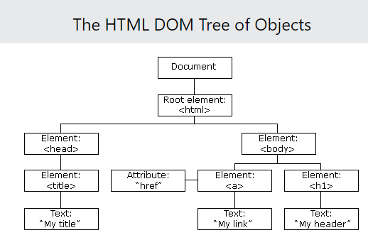

# Notes on nodejs

## Required Javascript

### Arrow expressions

Let’s take a look at the code below. You will see two different functions defined. The first is anonymous (function is not named), and the second is named. When using an arrow expression, we do not use the function declaration. To define an arrow expression you simply use: () => { }. You can pass arguments to an arrow expression between the parenthesis (()).

```javascript
// Defining an anonymous arrow expression that simply logs a string to the console.
console.log(() => console.log('Shhh, Im anonymous'));
 
// Defining a named function by creating an arrow expression and saving it to a const variable helloWorld. 
const helloWorld = (name) => {
  console.log(`Welcome ${name} to Codecademy, this is an arrow expression.`)
};
 
// Calling the helloWorld() function.
helloWorld('Codey'); //Output: Welcome Codey to Codecademy, this is an Arrow Function Expression.
```

### Promises

A Promise is a JavaScript object that represents the eventual outcome of an asynchronous operation. A Promise has three different outcomes: pending (the result is undefined and the expression is waiting for a result), fulfilled (the promise has been completed successfully and returned a value), and rejected (the promise did not successfully complete, the result is an error object).

In the code below a new Promise is being defined and is passed a function that takes two arguments, a fulfilled condition, and a rejected condition. We then log the returned value of the Promise to the console and chain a .catch() method to handle errors.

```javascript
// Creating a new Promise and saving it to the testLuck variable. Two arguments are being passed, one for when the promise resolves, and one for if the promise gets rejected.
const testLuck = new Promise((resolve, reject) => {
  if (Math.random() < 0.5) { 
    resolve('Lucky winner!')
  } else {
    reject(new Error('Unlucky!'))
  }
});
 
testLuck.then(message => {
  console.log(message) // Log the resolved value of the Promise
}).catch(error => {
  console.error(error) // Log the rejected error of the Promise
});
```

#### Resolve and Reject

The Promise constructor method takes a function parameter called the executor function which runs automatically when the constructor is called. The executor function generally starts an asynchronous operation and dictates how the promise should be settled.

The executor function has two function parameters, usually referred to as the resolve() and reject() functions. The resolve() and reject() functions aren’t defined by the programmer. When the Promise constructor runs, JavaScript will pass its own resolve() and reject() functions into the executor function.

- resolve is a function with one argument. Under the hood, if invoked, resolve() will change the promise’s status from pending to fulfilled, and the promise’s resolved value will be set to the argument passed into resolve().
- reject is a function that takes a reason or error as an argument. Under the hood, if invoked, reject() will change the promise’s status from pending to rejected, and the promise’s rejection reason will be set to the argument passed into reject().

### Async/Await

The async...await syntax allows developers to easily implement Promise-based code. The keyword async used in conjunction with a function declaration creates an async function that returns a Promise. Async functions allow us to use the keyword await to block the event loop until a given Promise resolves or rejects. The await keyword also allows us to assign the resolved value of a Promise to a variable.

Let’s take a look at the code below. In the code below an asynchronous arrow expression is defined with the async keyword. In the function body we are creating a new Promise which passes a function that is executed after 5 seconds, we await the Promise to resolve and save the value returned to finalResult, and the output of the Promise is logged to the console.

```javascript
// Creating a new promise that runs the function in the setTimeout after 5 seconds. 
const newPromise = new Promise((resolve, reject) => {
  setTimeout(() => resolve("All done!"), 5000);
});
 
// Creating an asynchronous function using an arrow expression and saving it to a the variable asyncFunction. 
const asyncFunction = async () => {
  // Awaiting the promise to resolve and saving the result to the variable finalResult.
  const finalResult = await newPromise;
 
  // Logging the result of the promise to the console
  console.log(finalResult); // Output: All done!
}
 
asyncFunction();
```

### setInterval() and setTimeout()

In addition to utilizing the async...await syntax, we can also use the setInterval() and setTimeout() functions. In the example code of the previous section, we created a setTimeout() instance in the Promise constructor.

The setInterval() function executes a code block at a specified interval, in milliseconds. The setInterval() function requires two arguments: the name of the function (the code block that will be executed), and the number of milliseconds (how often the function will be executed). Optionally, we can pass additional arguments which will be supplied as parameters for the function that will be executed by setInterval(). The setInterval() function will continue to execute until the clearInterval() function is called or the node process is exited. In the code block below, the setInterval() function in the showAlert() function will display an alert box every 5000 milliseconds.

```javascript
// Defining a function that instantiates setInterval
const showAlert = () => {
  // Calling setInterval() and passing a function that shows an alert every 5 seconds.
  setInterval(() => {
    alert('I show every 5 seconds!')
  }, 5000);
};
 
// Calling the newInterval() function that calls the setInterval
showAlert();
```

The setTimeout() function executes a code block after a specified amount of time (in milliseconds) and is only executed once. The setTimeout() function accepts the same arguments as the setInterval() function. Using the clearTimeout() function will prevent the function specified from being executed. In the code block below, a function named showTimeout() is declared as an arrow expression. The setTimeout() function is then defined and displays an alert box after 5 seconds.

```javascript
// Defining a function that calls setTimeout
const showTimeout = () => {
  // Calling setTimeout() that passes a function that shows an alert after 5 seconds.
  setTimeout(() => {
    alert('I only show once after 5 seconds!');
  }, 5000);
};
 
// Calling the showTimeout() function
showTimeout();
```

## Node

### The Node REPL (read-eval-print loop)

REPL is an abbreviation for read–eval–print loop. It’s a program that loops, or repeatedly cycles, through three different states: a read state where the program reads input from a user, the eval state where the program evaluates the user’s input, and the print state where the program prints out its evaluation to a console. Then it loops through these states again.

It's just the equivalent of typing `python` except for javascript. Type `node` to get to it.

To see global vars see `Object.keys(global)`. You can add to it with `global.cat = 'thing'`. Print with `console.log(global.cat)`

If you’re familiar with running JavaScript on the browser, you’ve likely encountered the Window object. Here’s one major way that Node differs: try to access the Window object (this will throw an error). The Window object is the JavaScript object in the browser that holds the DOM, since we don’t have a DOM here, there’s no Window object.

### Running a Program with Node

`node program`

### Core Modules

Include a module:

```javascript
// Require in the 'events' core module:
const events = require('events');
```

Some core modules are actually used inside other core modules. For instance, the util module can be used in the console module to format messages. We’ll cover these two modules in this lesson, as well as two other commonly used core modules: process and os.

See all builtin modules: `require('module').builtinModules`

### Console Module

Since console is a global module, its methods can be accessed from anywhere, and the require() function is not necessary.

- .log() - prints messages to the terminal
- .assert() - prints a message to the terminal if the value is falsey
  - `console.assert(petsArray.length > 5);`
- .table() - prints out a table in the terminal from an object or array

### The Process Module

Node has a global process object with useful methods and information about the current process. The console.log() method is a “thin wrapper” on the .stdout.write() method of the process object. 

The process.env property is an object which stores and controls information about the environment in which the process is currently running. For example, the process.env object contains a PWD property which holds a string with the directory in which the current process is located. It can be useful to have some if/else logic in a program depending on the current environment— a web application in a development phase might perform different tasks than when it’s live to users. We could store this information on the process.env. One convention is to add a property to process.env with the key NODE_ENV and a value of either production or development.

```javascript
if (process.env.NODE_ENV === 'development'){
  console.log('Testing! Testing! Does everything work?');
}
```

The process.memoryUsage() returns information on the CPU demands of the current process. It returns a property that looks similar to this:

```javascript
{ rss: 26247168,
  heapTotal: 5767168,
  heapUsed: 3573032,
  external: 8772 }
```

`process.argv` holds an array of command line values provided when the current process was initiated.

### The OS Module

`const os = require('os');`

- os.type() — to return the computer’s operating system.
- os.arch() — to return the operating system CPU architecture.
- os.networkInterfaces() — to return information about the network interfaces of the computer, such as IP and MAC address.
- os.homedir() — to return the current user’s home directory.
- os.hostname() — to return the hostname of the operating system.
- os.uptime() — to return the system uptime, in seconds.

Create an empty object `const object = {};`

**Instantiate a dictionary:**

```javascript
const os = require('os');
const server = {type: os.type(), architecture: os.arch(), uptime: os.uptime()};

console.table(server)
```

### The Util Module

Developers sometimes classify outlier functions used to maintain code and debug certain aspects of a program’s functionality as utility functions. Utility functions don’t necessarily create new functionality in a program, but you can think of them as internal tools used to maintain and debug your code. The Node.js util core module contains methods specifically designed for these purposes.

`const util = require('util');`

**Get the type of an object**: 

```javascript
const util = require('util');
 
const today = new Date();
const earthDay = 'April 22, 2022';
 
console.log(util.types.isDate(today));
console.log(util.types.isDate(earthDay));
```

**Turn callback functions into promises**: 

Another important util method is .promisify(), which turns callback functions into promises. As you know, asynchronous programming is essential to Node.js. In the beginning, this asynchrony was achieved using error-first callback functions, which are still very prevalent in the Node ecosystem today. But since promises are often preferred over callbacks and especially nested callbacks, Node offers a way to turn these into promises. Let’s take a look:

```javascript
function getUser (id, callback) {
  return setTimeout(() => {
    if (id === 5) {
      callback(null, { nickname: 'Teddy' })
    } else {
      callback(new Error('User not found'))
    }
  }, 1000)
}
 
function callback (error, user) {
  if (error) {
    console.error(error.message)
    process.exit(1)
  }
 
  console.log(`User found! Their nickname is: ${user.nickname}`)
}
 
getUser(1, callback) // -> `User not found`
getUser(5, callback) // -> `User found! Their nickname is: Teddy`
```

You can convert the above to:

```javascript
const getUserPromise = util.promisify(getUser);
 
getUserPromise(id)
  .then((user) => {
      console.log(`User found! Their nickname is: ${user.nickname}`);
  })
  .catch((error) => {
      console.log('User not found', error);
  });
 
getUser(1) // -> `User not found`
getUser(5) // -> `User found! Their nickname is: Teddy`
```

We declare a getUserPromise variable that stores the getUser method turned into a promise using the .promisify() method. With that in place, we’re able to use getUserPromise with .then() and .catch() methods (or we could also use the async...await syntax here) to resolve the promise returned or catch any errors.

### NPM

#### Create a new app

`npm init`

Add `-y` to answer yes to everything.

This will generate a package.json file:

```json
{
  "name": "my-project",
  "version": "1.0.0",
  "description": "a basic project",
  "main": "index.js",
  "scripts": {
    "test": "echo \"Error: no test specified\" && exit 1"
  },
  "author": "Super Coder",
  "license": "ISC",
  "dependencies": {
    "express": "^4.17.1"
  },
}
```

#### nodemon

Automatically restart a program when a file changes.

`npm install nodemon`

The `npm i <package name>` command installs a package locally in a folder called node_modules/ which is created in the project directory that you ran the command from. In addition, the newly installed package will be added to the package.json file.

#### Package Scope

While most dependencies play a direct role in the functionality of your application, development dependencies are used for the purpose of making development easier or more efficient.

In fact, the nodemon package is actually better suited as a development dependency since it makes developers’ lives easier but makes no changes to the app itself. To install nodemon as a development dependency, we can add the --save-dev flag, or its alias, -D.

`npm install nodemon --save-dev`

Development dependencies are listed in the "devDependencies" field of the package.json file. This indicates that the package is being used specifically for development and will not be included in a production release of the project.

```json
{
  "name": "my-project",
  "version": "1.0.0",
  "description": "a basic project",
  "main": "index.js",
  "scripts": {
    "test": "echo \"Error: no test specified\" && exit 1"
  },
  "author": "",
  "license": "ISC",
  "dependencies": {
    "express": "^4.17.1"
  },
  "devDependencies": {
    "nodemon": "^2.0.13"
  }
}
```

##### Global Packages

Typically, packages installed this way will be used in the command-line rather than imported into a project’s code. One such example is the http-server package which allows you to spin up a zero-configuration server from anywhere in the command-line.

To install a package globally, use the -g flag with the installation command:

`npm install http-server -g`

http-server is a good package to install globally since it is a general command-line utility and its purpose is not linked to any specific functionality within an app.

Unlike local package dependencies or development dependencies, packages installed globally will not be listed in a projects package.json file and they will be stored in a separate global node_modules/ folder.

#### Installing a Custom Package

If you want to give someone else your package you can provide the package.json file and then they can install with `npm i`. Add `--production` to leave out the dev dependencies.

### Modules

There are multiple ways of implementing modules depending on the runtime environment in which your code is executed. In JavaScript, there are two runtime environments and each has a preferred module implementation:

- The Node runtime environment and the module.exports and require() syntax.
- The browser’s runtime environment and the ES6 import/export syntax.

#### Exporting

```javascript
/* converters.js */
function celsiusToFahrenheit(celsius) {
  return celsius * (9/5) + 32;
}
 
module.exports.celsiusToFahrenheit = celsiusToFahrenheit;
 
module.exports.fahrenheitToCelsius = function(fahrenheit) {
  return (fahrenheit - 32) * (5/9);
};
```

- At the top of the new file, converters.js, the function celsiusToFahrenheit() is declared.
- On the next line of code, the first approach for exporting a function from a module is shown. In this case, the already-defined function celsiusToFahrenheit() is assigned to module.exports.celsiusToFahrenheit.
- Below, an alternative approach for exporting a function from a module is shown. In this second case, a new function expression is declared and assigned to module.exports.fahrenheitToCelsius. This new method is designed to convert Fahrenheit values back to Celsius.
- Both approaches successfully store a function within the module.exports object.

module.exports is an object that is built-in to the Node.js runtime environment. Other files can now import this object, and make use of these two functions, with another feature that is built-in to the Node.js runtime environment: the require() function.

#### Require

The require() function accepts a string as an argument. That string provides the file path to the module you would like to import.

Let’s update water-limits.js such that it uses require() to import the .celsiusToFahrenheit() method from the module.exports object within converters.js:

```javascript
/* water-limits.js */
const converters = require('./converters.js');
 
const freezingPointC = 0;
const boilingPointC = 100;
 
const freezingPointF = converters.celsiusToFahrenheit(freezingPointC);
const boilingPointF = converters.celsiusToFahrenheit(boilingPointC);
 
console.log(`The freezing point of water in Fahrenheit is ${freezingPointF}`);
console.log(`The boiling point of water in Fahrenheit is ${boilingPointF}`);
```

#### Using Object Destructuring to be more Selective With require()

In many cases, modules will export a large number of functions but only one or two of them are needed. You can use object destructuring to extract only the needed functions.

Let’s update celsius-to-fahrenheit.js and only extract the .celsiusToFahrenheit() method, leaving .fahrenheitToCelsius() behind:

```javascript
/* celsius-to-fahrenheit.js */
const { celsiusToFahrenheit } = require('./converters.js');
 
const celsiusInput = process.argv[2]; 
const fahrenheitValue = celsiusToFahrenheit(celsiusInput);
 
console.log(`${celsiusInput} degrees Celsius = ${fahrenheitValue} degrees Fahrenheit`);
```

Notice that the first line used to be `const converters = require('./converters.js');` and now it is specifying the exported function.

### The Events Module

Node provides an EventEmitter class which we can access by requiring in the events core module:

```javascript
// Require in the 'events' core module
let events = require('events');
 
// Create an instance of the EventEmitter class
let myEmitter = new events.EventEmitter();
```

Each event emitter instance has an .on() method which assigns a listener callback function to a named event. The .on() method takes as its first argument the name of the event as a string and, as its second argument, the listener callback function.

Each event emitter instance also has an .emit() method which announces a named event has occurred. The .emit() method takes as its first argument the name of the event as a string and, as its second argument, the data that should be passed

```javascript
let newUserListener = (data) => {
  console.log(`We have a new user: ${data}.`);
};
 
// Assign the newUserListener function as the listener callback for 'new user' events
myEmitter.on('new user', newUserListener)
 
// Emit a 'new user' event
myEmitter.emit('new user', 'Lily Pad') //newUserListener will be invoked with 'Lily Pad'
```

**Note** There is no link between the variable `data` in the constructer for the event emitter and the `new user` name.

### User Input and Output

Notice that for user input and output for something like stdin what you're really doing is registering a callback and then calling it on user input. Ex:

```javascript
process.stdin.on('data', (userInput) => {
  let input = userInput.toString()
  console.log(input)
});
```

Notice the `on` and then here we're just defining an anonymous function.

### The Error Module

The Node environment’s error module has all the standard JavaScript errors such as EvalError, SyntaxError, RangeError, ReferenceError, TypeError, and URIError as well as the JavaScript Error class for creating new error instances. Within our own code, we can generate errors and throw them, and, with synchronous code in Node, we can use error handling techniques such as try...catch statements. Note that the error module is within the global scope—there is no need to import the module with the require() statement.

Many asynchronous Node APIs use error-first callback functions—callback functions which have an error as the first expected argument and the data as the second argument. If the asynchronous task results in an error, it will be passed in as the first argument to the callback function. If no error was thrown, the first argument will be undefined.

```javascript
const errorFirstCallback = (err, data)  => {
  if (err) {
    console.log(`There WAS an error: ${err}`);
  } else {
    // err was falsy
    console.log(`There was NO error. Event data: ${data}`);
  }
}  
```

#### Why Error First Callbacks

You need this because if you try something like:

```javascript
const api = require('./api.js');

// Not an error-first callback
let callbackFunc = (data) => {
   console.log(`Something went right. Data: ${data}\n`);
};
  
try {
  api.naiveErrorProneAsyncFunction('problematic input', callbackFunc);
} catch(err) {
  console.log(`Something went wrong. ${err}\n`);
}
```

then the try-catch won't work because the error is thrown in the context of the separate thread spawned asynchronously and subsequently never caught because Javascript is a garbage programming language.

### The Buffer Module

In Node.js, the Buffer module is used to handle binary data. The Buffer module is within the global scope, which means that Buffer objects can be accessed anywhere in the environment without importing the module with require().

A Buffer object represents a fixed amount of memory that can’t be resized. Buffer objects are similar to an array of integers where each element in the array represents a byte of data. The buffer object will have a range of integers from 0 to 255 inclusive.

The Buffer module provides a variety of methods to handle the binary data such as .alloc(), .toString(), .from(), and .concat().

The .alloc() method creates a new Buffer object with the size specified as the first parameter. .alloc() accepts three arguments:

Size: Required. The size of the buffer
Fill: Optional. A value to fill the buffer with. Default is 0.
Encoding: Optional. Default is UTF-8.

```javascript
const buffer = Buffer.alloc(5);
console.log(buffer); // Ouput: [0, 0, 0, 0, 0]
The .toString() method translates the Buffer object into a human-readable string. It accepts three optional arguments:
```

Encoding: Default is UTF-8.
Start: The byte offset to begin translating in the Buffer object. Default is 0.
End: The byte offset to end translating in the Buffer object. Default is the length of the buffer. The start and end of the buffer are similar to the start and end of an array, where the first element is 0 and increments upwards.

```javascript
const buffer = Buffer.alloc(5, 'a');
console.log(buffer.toString()); // Output: aaaaa
The .from() method is provided to create a new Buffer object from the specified string, array, or buffer. The method accepts two arguments:
```

Object: Required. An object to fill the buffer with.
Encoding: Optional. Default is UTF-8.

```javascript
const buffer = Buffer.from('hello');
console.log(buffer); // Output: [104, 101, 108, 108, 111]
```

The .concat() method joins all buffer objects passed in an array into one Buffer object. .concat() comes in handy because a Buffer object can’t be resized. This method accepts two arguments:

Array: Required. An array containing Buffer objects.
Length: Optional. Specifies the length of the concatenated buffer.

```javascript
const buffer1 = Buffer.from('hello'); // Output: [104, 101, 108, 108, 111]
const buffer2 = Buffer.from('world'); // Output:[119, 111, 114, 108, 100]
const array = [buffer1, buffer2];
const bufferConcat = Buffer.concat(array);
 
console.log(bufferConcat); // Output: [104, 101, 108, 108, 111, 119, 111, 114, 108, 100]
```

### Readable Streams

```javascript
const readline = require('readline');
const fs = require('fs');

const myInterface = readline.createInterface({
  input: fs.createReadStream('shoppingList.txt')
});
 
const printData = (data) => {
  console.log(`Item: ${data}`);
};

myInterface.on('line', printData);
```

#### Further explanation

One of the simplest uses of streams is reading and writing to files line-by-line. To read files line-by-line, we can use the .createInterface() method from the readline core module. .createInterface() returns an EventEmitter set up to emit 'line' events:

```javascript
const readline = require('readline');
const fs = require('fs');
 
const myInterface = readline.createInterface({
  input: fs.createReadStream('text.txt')
});
 
myInterface.on('line', (fileLine) => {
  console.log(`The line read: ${fileLine}`);
});
```
 
Let’s walk through the above code:

- We require in the readline and fs core modules.
- We assign to myInterface the returned value from invoking readline.createInterface() with an object containing our designated input.
- We set our input to fs.createReadStream('text.txt') which will create a stream from the text.txt file.
- Next we assign a listener callback to execute when line events are emitted. A 'line' event will be emitted after each line from the file is read.
- Our listener callback will log to the console 'The line read: [fileLine]', where [fileLine] is the line just read.

### Writable Streams

```javascript
const readline = require('readline');
const fs = require('fs');

const myInterface = readline.createInterface({
  input: fs.createReadStream('shoppingList.txt')
});

const fileStream = fs.createWriteStream('shoppingResults.txt');

let transformData = (line) => {
  fileStream.write(`They were out of: ${line}\n`);
};

myInterface.on('line', transformData);
```

### Timers Modules

You may already be familiar with some timer functions such as, setTimeout() and setInterval(). Timer functions in Node.js behave similarly to how they work in front-end JavaScript programs, but the difference is that they are added to the Node.js event loop. This means that the timer functions are scheduled and put into a queue. This queue is processed at every iteration of the event loop. If a timer function is executed outside of a module, the behavior will be random (non-deterministic).

The setImmediate() function is often compared with the setTimeout() function. When setImmediate() is called, it executes the specified callback function after the current (poll phase) is completed. The method accepts two parameters: the callback function (required) and arguments for the callback function (optional). If you instantiate multiple setImmediate() functions, they will be queued for execution in the order that they were created.

## Knex.js

### How does exports.up and exports.down work

http://perkframework.com/v1/guides/database-migrations-knex.html

### Seed Files

A seed file allows you to add data into your database without having to manually add it. This is most frequently used for database initialization or loading demo data.

## Babel

What is Babel: https://babeljs.io/docs/en/

## ReactJS

### Importing React Required Code

`import React from 'react';`

This creates an object named React which contains methods necessary to use the React library.

`import ReactDOM from 'react-dom';`

The methods imported from 'react-dom' are meant for interacting with the DOM. You are already familiar with one of them: ReactDOM.render().

The methods imported from 'react' don’t deal with the DOM at all. They don’t engage directly with anything that isn’t part of React.

To clarify: the DOM is used in React applications, but it isn’t part of React. After all, the DOM is also used in countless non-React applications. Methods imported from 'react' are only for pure React purposes, such as creating components or writing JSX elements.

### Components

#### Create a Component Class

we can use a JavaScript class to define a new React component. We can also define components with JavaScript functions, but we’ll focus on class components first.

All class components will have some methods and properties in common (more on this later). Rather than rewriting those same properties over and over again every time, we extend the Component class from the React library. This way, we can use code that we import from the React library, without having to write it over and over again ourselves.

After we define our class component, we can use it to render as many instances of that component as we want.

What is React.Component, and how do you use it to make a component class?

React.Component is a JavaScript class. To create your own component class, you must subclass React.Component. You can do this by using the syntax class YourComponentNameGoesHere extends React.Component {}.

```javascript
import React from 'react';
import ReactDOM from 'react-dom';
 
class MyComponentClass extends React.Component {
  render() {
    return <h1>Hello world</h1>;
  }
}
 
ReactDOM.render(
    <MyComponentClass />, 
    document.getElementById('app')
);
```

On line 4, you know that you are declaring a new component class, which is like a factory for building React components. You know that React.Component is a class, which you must subclass in order to create a component class of your own. You also know that React.Component is a property on the object which was returned by import React from 'react' on line 1.

#### The Render Function

A render method is a property whose name is render, and whose value is a function. The term “render method” can refer to the entire property, or to just the function part.

```javascript
class ComponentFactory extends React.Component {
  render() {
    return <h1>Hello world</h1>;
  }
}
```

#### Create a Component Instance

To make a React component, you write a JSX element. Instead of naming your JSX element something like h1 or div like you’ve done before, give it the same name as a component class. Voilà, there’s your component instance! JSX elements can be either HTML-like, or component instances. JSX uses capitalization to distinguish between the two! That is the React-specific reason why component class names must begin with capital letters. In a JSX element, that capitalized first letter says, “I will be a component instance and not an HTML tag.”

Whenever you make a component, that component inherits all of the methods of its component class. MyComponentClass has one method: MyComponentClass.render(). Therefore, <MyComponentClass /> also has a method named render.

In order to render a component, that component needs to have a method named render. Your component has this! It inherited a method named render from MyComponentClass.

To call a component’s render method, you pass that component to ReactDOM.render(). Notice your component, being passed as ReactDOM.render()‘s first argument:

```javascript
ReactDOM.render(
  <MyComponentClass />,
  document.getElementById('app')
);
```

ReactDOM.render() will tell <MyComponentClass /> to call its render method.

<MyComponentClass /> will call its render method, which will return the JSX element <h1>Hello world</h1>. ReactDOM.render() will then take that resulting JSX element, and add it to the virtual DOM. This will make “Hello world” appear on the screen.

#### Use This in a Class

```javascript
class IceCreamGuy extends React.Component {
  get food() {
    return 'ice cream';
  }
 
  render() {
    return <h1>I like {this.food}.</h1>;
  }
}
```

#### Render Components with Components

```javascript
class OMG extends React.Component {
  render() {
    return <h1>Whooaa!</h1>;
  }
}
 
class Crazy extends React.Component {
  render() {
    return <OMG />;
  }
}
```

#### Importing Files and Exporting Functionality

##### Importing

The second important difference involves the contents of the string at the end of the statement: 'react' vs './NavBar.js'.

If you use an import statement, and the string at the end begins with either a dot or a slash, then import will treat that string as a filepath. import will follow that filepath, and import the file that it finds.

If your filepath doesn’t have a file extension, then “.js” is assumed. So the above example could be shortened:

`import { NavBar } from './NavBar';`

One final, important note:
None of this behavior is specific to React! Module systems of independent, importable files are a very popular way to organize code. [React’s specific module system comes from ES6.](https://hacks.mozilla.org/2015/08/es6-in-depth-modules/)

##### Exporting

This is called a named export.

`export class NavBar extends React.Component {`

#### Component Props

A component’s props is an object. It holds information about that component. You can pass information to a prop via an attribute.

```javascript
import React from 'react';
import ReactDOM from 'react-dom';

class Greeting extends React.Component {
  render() {
    return <h1>Hi there, {this.props.firstName}!</h1>;
  }
}

ReactDOM.render(
  <Greeting firstName='Grant' />, 
  document.getElementById('app')
);
```

#### Event Handler

```javascript
import React from 'react';
import ReactDOM from 'react-dom';
import { Button } from './Button';

class Talker extends React.Component {
  talk() {
    let speech = '';
    for (let i = 0; i < 10000; i++) {
      speech += 'blah ';
    }
    alert(speech);
  }
  
  render() {
    return <Button talk={this.talk}/>;
  }
}

ReactDOM.render(
  <Talker />,
  document.getElementById('app')
);

// ****************************************
// In Button.js

import React from 'react';

export class Button extends React.Component {
  render() {
    return (
      <button onClick={this.props.talk}>
        Click me!
      </button>
    );
  }
}
```

#### handleEvent, onEvent, and this.props.onEvent

When you pass an event handler as a prop, as you just did, there are two names that you have to choose.

Both naming choices occur in the parent component class - that is, in the component class that defines the event handler and passes it.

The first name that you have to choose is the name of the event handler itself.

Look at Talker.js, lines 6 through 12. This is our event handler. We chose to name it talk.

The second name that you have to choose is the name of the prop that you will use to pass the event handler. This is the same thing as your attribute name.

For our prop name, we also chose talk, as shown on line 15:

`return <Button talk={this.talk} />;`

These two names can be whatever you want. However, there is a naming convention that they often follow. You don’t have to follow this convention, but you should understand it when you see it.

Here’s how the naming convention works: first, think about what type of event you are listening for. In our example, the event type was “click.”

If you are listening for a “click” event, then you name your event handler handleClick. If you are listening for a “keyPress” event, then you name your event handler handleKeyPress:

```javascript
class MyClass extends React.Component {
  handleHover() {
    alert('I am an event handler.');
    alert('I will be called in response to "hover" events.');
  }
}
```

Your prop name should be the word on, plus your event type. If you are listening for a “click” event, then you name your prop onClick. If you are listening for a “keyPress” event, then you name your prop onKeyPress:

```javascript
class MyClass extends React.Component {
  handleHover() {
    alert('I am an event handler.');
    alert('I will listen for a "hover" event.');
  }
 
  render() {
    return <Child onHover={this.handleHover} />;
  }
}
```

#### this.props.children

Every component’s props object has a property named children.

this.props.children will return everything in between a component’s opening and closing JSX tags. For example:

```javascript

// List.js
import React from 'react';

export class List extends React.Component {
  render() {
    let titleText = `Favorite ${this.props.type}`;
    if (this.props.children instanceof Array) {
    	titleText += 's';
    }
    return (
      <div>
        <h1>{titleText}</h1>
        <ul>{this.props.children}</ul>
      </div>
    );
  }
}

// App.js
import React from 'react';
import ReactDOM from 'react-dom';
import { List } from './List';

class App extends React.Component {
  render() {
    return (
      <div>
        <List type='Living Musician'>
          <li>Sachiko M</li>
          <li>Harvey Sid Fisher</li>
        </List>
        <List type='Living Cat Musician'>
          <li>Nora the Piano Cat</li>
        </List>
      </div>
    );
  }
}

ReactDOM.render(
  <App />, 
  document.getElementById('app')
);
```

This will print:

```
Favorite Living Musicians
Sachiko M
Harvey Sid Fisher
Favorite Living Cat Musician
Nora the Piano Cat
```

Because in List.js, between the `<ul></ul>` you have `{this.props.children}` which grabs all the elements between `<List></List>` in the App class.

#### Default Properties

Used if nothing is passed into the property.

```javascript
import React from 'react';
import ReactDOM from 'react-dom';

class Button extends React.Component {
  render() {
    return (
      <button>
        {this.props.text}
      </button>
    );
  }
}

// defaultProps goes here:
Button.defaultProps = {text:  "I am a button"};

ReactDOM.render(
  <Button />, 
  document.getElementById('app')
);
```

#### Use an Event Listener in a Component

### JSX

JSX is a syntax extension for JavaScript. It was written to be used with React. JSX code looks a lot like HTML.

What does “syntax extension” mean?

In this case, it means that JSX is not valid JavaScript. Web browsers can’t read it!

If a JavaScript file contains JSX code, then that file will have to be compiled. That means that before the file reaches a web browser, a JSX compiler will translate any JSX into regular JavaScript.

#### JSX Elements

A basic unit of JSX is called a JSX element.

Here’s an example of a JSX element:

```html
<h1>Hello world</h1>
```

#### JSX Elements And Their Surroundings

JSX elements are treated as JavaScript expressions. They can go anywhere that JavaScript expressions can go.

That means that a JSX element can be saved in a variable, passed to a function, stored in an object or array…you name it.

Here’s an example of a JSX element being saved in a variable:

```html
const navBar = <nav>I am a nav bar</nav>;

const myTeam = {
  center: <li>Benzo Walli</li>,
  powerForward: <li>Rasha Loa</li>,
  smallForward: <li>Tayshaun Dasmoto</li>,
  shootingGuard: <li>Colmar Cumberbatch</li>,
  pointGuard: <li>Femi Billon</li>
};
```

#### Attributes In JSX

JSX elements can have attributes, just like HTML elements can.

A JSX attribute is written using HTML-like syntax: a name, followed by an equals sign, followed by a value. The value should be wrapped in quotes, like this:

```javascript
my-attribute-name="my-attribute-value"

<a href='http://www.example.com'>Welcome to the Web</a>;
 
const title = <h1 id='title'>Introduction to React.js: Part I</h1>; 

const panda = ;
```

#### Nested JSX

If a JSX expression takes up more than one line, then you must wrap the multi-line JSX expression in parentheses. This looks strange at first, but you get used to it:

```javascript
const theExample = (
  <a href="https://www.example.com">
    <h1>
      Click me!
    </h1>
  </a>
)
```

#### JSX Outer Elements

There’s a rule that we haven’t mentioned: a JSX expression must have exactly one outermost element.

In other words, this code will work:

```javascript
const paragraphs = (
  <div id="i-am-the-outermost-element">
    <p>I am a paragraph.</p>
    <p>I, too, am a paragraph.</p>
  </div>
);

// But this code will not work:

const paragraphs = (
  <p>I am a paragraph.</p> 
  <p>I, too, am a paragraph.</p>
);
```

#### Rendering JSX

The following code will render a JSX expression:

```javascript
ReactDOM.render(<h1>Hello world</h1>, document.getElementById('app'));
```

#### ReactDOM.render()

ReactDOM is the name of a JavaScript library. This library contains several React-specific methods, all of which deal with the DOM in some way or another.

When a web page is loaded, the browser creates a Document Object Model of the page.

The HTML DOM model is constructed as a tree of Objects:



ReactDOM.render() is the most common way to render JSX. It takes a JSX expression, creates a corresponding tree of DOM nodes, and adds that tree to the DOM. That is the way to make a JSX expression appear onscreen.

In the code `ReactDOM.render(<h1>Render me!</h1>, document.getElementById('app'));` the expression `<h1>Render me!</h1>`  is what you want rendered. The second argument `document.getElementById('app')` indicates where you want to append the first argument in the DOM. Ex: if you had the following HTML:

```html
<!DOCTYPE html>
<html lang="en">
<head>
	<meta charset="utf-8">
	<link rel="stylesheet" href="/styles.css">
	<title>Learn ReactJS</title>
</head>

<body>
  <main id="app"></main>
	<script src="https://content.codecademy.com/courses/React/react-course-bundle.min.js"></script>
  <script src="/app.compiled.js"></script>
</body>

</html>
```

The element with the ID would be selected and the DOM added to it.

One special thing about ReactDOM.render() is that it only updates DOM elements that have changed.

That means that if you render the exact same thing twice in a row, the second render will do nothing.

##### Passing a Variable to ReactDOM.render()

ReactDOM.render()‘s first argument should evaluate to a JSX expression, it doesn’t have to literally be a JSX expression.

The first argument could also be a variable, so long as that variable evaluates to a JSX expression.

#### class vs className

```html
<h1 class="big">Hey</h1>
```

In JSX, you can’t use the word class! You have to use className instead:

```html
<h1 className="big">Hey</h1>
```

#### Self-Closing Tags

With self closing tags you MUST include the slash in JSX. Ex: `<br />`. The trailing / isn't optional.

#### Javascript in JSX

Te render Javascript in JSX, you have to use curly braces. Ex:

```javascript
import React from 'react';
import ReactDOM from 'react-dom';

// Write code here:
ReactDOM.render(
  <h1>{2 + 3}</h1>,
  document.getElementById('app')
);
```

#### Variables in JSX

When you inject JavaScript into JSX, that JavaScript is part of the same environment as the rest of the JavaScript in your file.

That means that you can access variables while inside of a JSX expression, even if those variables were declared on the outside.

You can set HTML attributes with curly braces like this:

```html
// Use a variable to set the `height` and `width` attributes:
 
const sideLength = "200px";
 
const panda = (
  
);
```

#### Event Listeners in JSX

JSX elements can have event listeners, just like HTML elements can. Programming in React means constantly working with event listeners.

You create an event listener by giving a JSX element a special attribute. Here’s an example:

``

An event listener attribute’s name should be something like onClick or onMouseOver: the word on, plus the type of event that you’re listening for. You can see a list of valid event names [here](https://reactjs.org/docs/events.html#supported-events).

An event listener attribute’s value should be a function. The above example would only work if myFunc were a valid function that had been defined elsewhere:

```javascript
function myFunc() {
  alert('Make myFunc the pFunc... omg that was horrible i am so sorry');
}
 

```

#### JSX Conditionals

This code will break:

```html
(
  <h1>
    {
      if (purchase.complete) {
        'Thank you for placing an order!'
      }
    }
  </h1>
)
```

The reason why has to do with the way that JSX is compiled. You don’t need to understand the mechanics of it for now, but if you’re interested then you can learn more in the [React documentation](https://reactjs.org/docs/jsx-in-depth.html).

How can you write a conditional, if you can’t inject an if statement into JSX?

Well, one option is to write an if statement, and not inject it into JSX.

Look at if.js. Follow the if statement, all the way from line 6 down to line 18.

if.js works, because the words if and else are not injected in between JSX tags. The if statement is on the outside, and no JavaScript injection is necessary.

```javascript
import React from 'react';
import ReactDOM from 'react-dom';

let message;

if (user.age >= drinkingAge) {
  message = (
    <h1>
      Hey, check out this alcoholic beverage!
    </h1>
  );
} else {
  message = (
    <h1>
      Hey, check out these earrings I got at Claire's!
    </h1>
  );
}

ReactDOM.render(
  message, 
  document.getElementById('app')
);
```

##### Ternary Operator

Recall how it works: you write x ? y : z, where x, y, and z are all JavaScript expressions. When your code is executed, x is evaluated as either “truthy” or “falsy.” If x is truthy, then the entire ternary operator returns y. If x is falsy, then the entire ternary operator returns z. [Here’s](http://stackoverflow.com/questions/6259982/how-to-use-the-ternary-operator-in-javascript) a nice explanation if you need a refresher.

```javascript
const headline = (
  <h1>
    { age >= drinkingAge ? 'Buy Drink' : 'Do Teen Stuff' }
  </h1>
);
```

##### &&

&& works best in conditionals that will sometimes do an action, but other times do nothing at all.

Here’s an example:

```javascript
const tasty = (
  <ul>
    <li>Applesauce</li>
    { !baby && <li>Pizza</li> }
    { age > 15 && <li>Brussels Sprouts</li> }
    { age > 20 && <li>Oysters</li> }
    { age > 25 && <li>Grappa</li> }
  </ul>
);
```

If the expression on the left of the && evaluates as true, then the JSX on the right of the && will be rendered. If the first expression is false, however, then the JSX to the right of the && will be ignored and not rendered.

#### .map in JSX

If you want to create a list of JSX elements, then .map() is often your best bet. It can look odd at first:

```javascript
const strings = ['Home', 'Shop', 'About Me'];
 
const listItems = strings.map(string => <li>{string}</li>);
 
<ul>{listItems}</ul>
```

In the above example, we start out with an array of strings. We call .map() on this array of strings, and the .map() call returns a new array of <li>s.

If you want the index you can do: `const listItems = strings.map((string, i) => <li>{string}</li>);`

#### List Keys

When you make a list in JSX, sometimes your list will need to include something called keys:

```javascript
<ul>
  <li key="li-01">Example1</li>
  <li key="li-02">Example2</li>
  <li key="li-03">Example3</li>
</ul>
```

A key is a JSX attribute. The attribute’s name is key. The attribute’s value should be something unique, similar to an id attribute.

keys don’t do anything that you can see! React uses them internally to keep track of lists. If you don’t use keys when you’re supposed to, React might accidentally scramble your list-items into the wrong order.

Not all lists need to have keys. A list needs keys if either of the following are true:

The list-items have memory from one render to the next. For instance, when a to-do list renders, each item must “remember” whether it was checked off. The items shouldn’t get amnesia when they render.

A list’s order might be shuffled. For instance, a list of search results might be shuffled from one render to the next.

```javascript
import React from 'react';
import ReactDOM from 'react-dom';

const people = ['Rowe', 'Prevost', 'Gare'];

const peopleLis = people.map((person, i) =>
  // expression goes here:
  <li key={'person_' + i}>{person}</li>
);

// ReactDOM.render goes here:
ReactDOM.render(<ul>{peopleLis}</ul>, document.getElementById('app'))
```

#### React Create Element

You can write React code without using JSX at all!

The majority of React programmers do use JSX, and we will use it for the remainder of this tutorial, but you should understand that it is possible to write React code without it.

The following JSX expression:

`const h1 = <h1>Hello world</h1>;`

can be rewritten without JSX, like this:

```javascript
const h1 = React.createElement(
  "h1",
  null,
  "Hello world"
);
```

When a JSX element is compiled, the compiler transforms the JSX element into the method that you see above: React.createElement(). Every JSX element is secretly a call to React.createElement().

