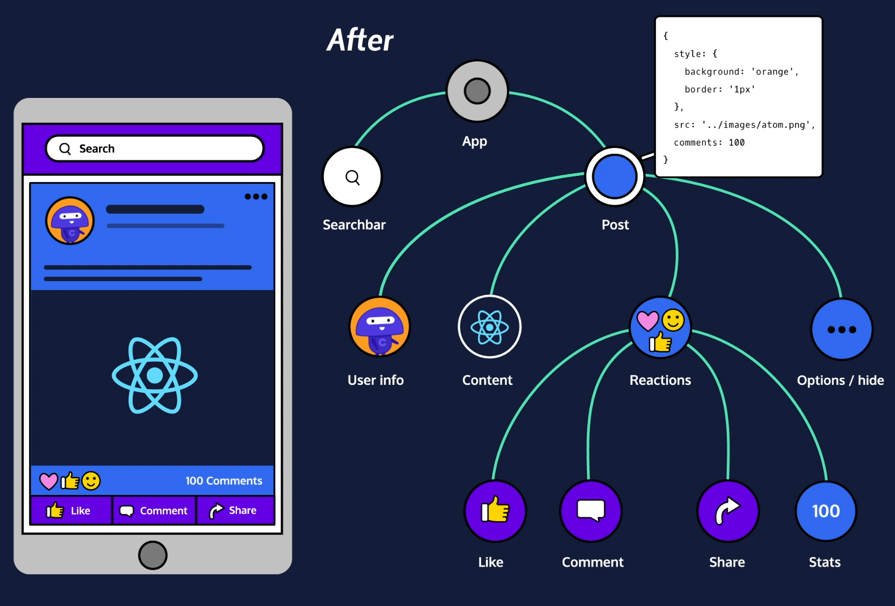
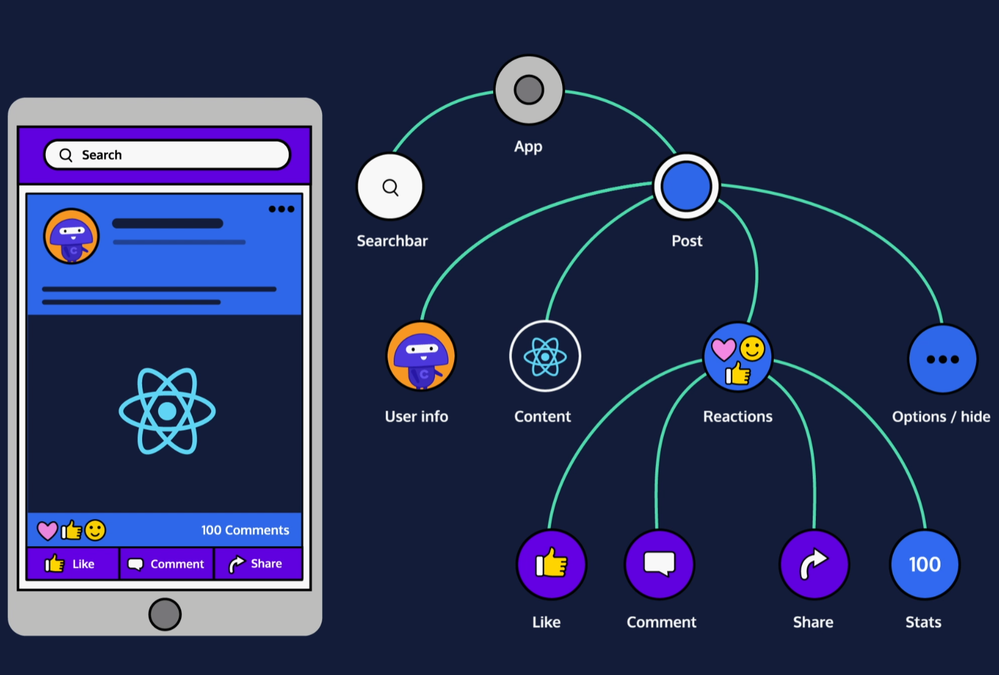
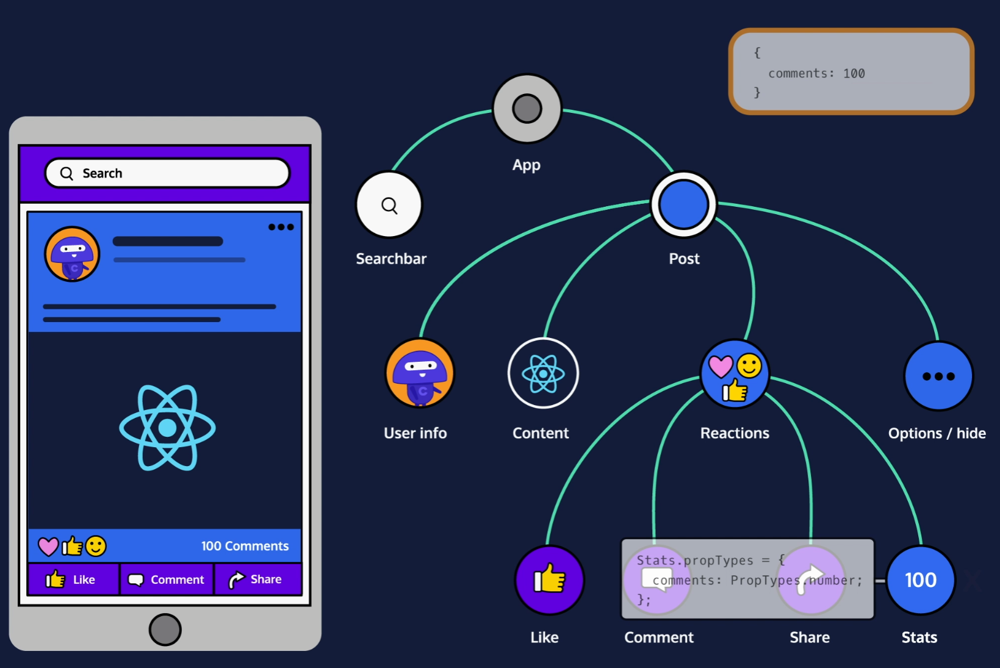
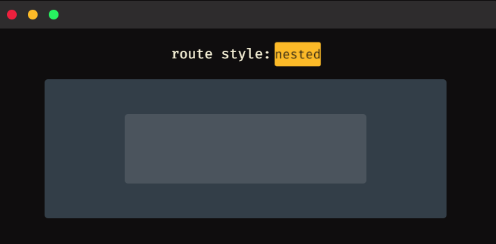

# Notes on nodejs

- [Notes on nodejs](#notes-on-nodejs)
  - [Required Javascript](#required-javascript)
    - [Arrow expressions](#arrow-expressions)
    - [Promises](#promises)
      - [Resolve and Reject](#resolve-and-reject)
    - [Async/Await](#asyncawait)
    - [setInterval() and setTimeout()](#setinterval-and-settimeout)
  - [Node](#node)
    - [The Node REPL (read-eval-print loop)](#the-node-repl-read-eval-print-loop)
    - [Running a Program with Node](#running-a-program-with-node)
    - [Core Modules](#core-modules)
    - [Console Module](#console-module)
    - [The Process Module](#the-process-module)
    - [The OS Module](#the-os-module)
    - [The Util Module](#the-util-module)
    - [NPM](#npm)
      - [Create a new app](#create-a-new-app)
      - [nodemon](#nodemon)
      - [Package Scope](#package-scope)
        - [Global Packages](#global-packages)
      - [Installing a Custom Package](#installing-a-custom-package)
    - [Modules](#modules)
      - [Exporting](#exporting)
      - [Require](#require)
      - [Using Object Destructuring to be more Selective With require()](#using-object-destructuring-to-be-more-selective-with-require)
    - [The Events Module](#the-events-module)
    - [User Input and Output](#user-input-and-output)
    - [The Error Module](#the-error-module)
      - [Why Error First Callbacks](#why-error-first-callbacks)
    - [The Buffer Module](#the-buffer-module)
    - [Readable Streams](#readable-streams)
      - [Further explanation](#further-explanation)
    - [Writable Streams](#writable-streams)
    - [Timers Modules](#timers-modules)
    - [HTTP Server](#http-server)
    - [The URL Module](#the-url-module)
    - [Routing](#routing)
      - [Longer Example](#longer-example)
    - [Returning a Status Code](#returning-a-status-code)
  - [Express](#express)
    - [Request Object Properties](#request-object-properties)
    - [Request Object Methods](#request-object-methods)
    - [Response Object](#response-object)
  - [Knex.js](#knexjs)
    - [How does exports.up and exports.down work](#how-does-exportsup-and-exportsdown-work)
    - [Seed Files](#seed-files)
  - [Babel](#babel)
  - [ReactJS](#reactjs)
    - [Importing React Required Code](#importing-react-required-code)
    - [Components](#components)
      - [Create a Component Class](#create-a-component-class)
      - [The Render Function](#the-render-function)
      - [Create a Component Instance](#create-a-component-instance)
      - [Use This in a Class](#use-this-in-a-class)
      - [Render Components with Components](#render-components-with-components)
      - [Importing Files and Exporting Functionality](#importing-files-and-exporting-functionality)
        - [Importing](#importing)
        - [Exporting](#exporting-1)
      - [Component Props](#component-props)
      - [Event Handler](#event-handler)
      - [handleEvent, onEvent, and this.props.onEvent](#handleevent-onevent-and-thispropsonevent)
      - [this.props.children](#thispropschildren)
      - [Default Properties](#default-properties)
      - [Component State](#component-state)
        - [this.setState from Another Function](#thissetstate-from-another-function)
      - [Component Lifecycle](#component-lifecycle)
      - [componentDidMount](#componentdidmount)
      - [componentWillUnmount](#componentwillunmount)
    - [componentDidUpdate](#componentdidupdate)
      - [Stateless Functional Components](#stateless-functional-components)
      - [Function Component Props](#function-component-props)
    - [React Hooks](#react-hooks)
        - [Comparison Class vs Function](#comparison-class-vs-function)
      - [Update Function Component State](#update-function-component-state)
      - [Initialize State](#initialize-state)
      - [Use State Setter Outside of JSX](#use-state-setter-outside-of-jsx)
        - [Longer Example](#longer-example-1)
      - [Set From Previous State](#set-from-previous-state)
      - [Arrays in State](#arrays-in-state)
      - [Objects in State](#objects-in-state)
        - [Longer Example](#longer-example-2)
      - [Separate Hooks for Separate States](#separate-hooks-for-separate-states)
        - [Comparison](#comparison)
    - [The Effect Hook - useEffect](#the-effect-hook---useeffect)
      - [React Hooks and Component Lifecycle Equivalent](#react-hooks-and-component-lifecycle-equivalent)
        - [componentWillMount for react functional component?](#componentwillmount-for-react-functional-component)
      - [Function Component Effects](#function-component-effects)
      - [Clean Up Effects](#clean-up-effects)
      - [Control When Effects are Called](#control-when-effects-are-called)
      - [Fetch Data from a Server](#fetch-data-from-a-server)
      - [Rules of Hooks](#rules-of-hooks)
      - [Separate Hooks for Separate Effects](#separate-hooks-for-separate-effects)
    - [Stateless Components from Stateful Components](#stateless-components-from-stateful-components)
      - [Build a Stateful Component Class](#build-a-stateful-component-class)
      - [Don't Update props](#dont-update-props)
      - [Child Components Update Their Parents' State](#child-components-update-their-parents-state)
        - [More Complex Example](#more-complex-example)
      - [Child Components Update Sibling Components](#child-components-update-sibling-components)
      - [One Sibling to Display, Another to Change](#one-sibling-to-display-another-to-change)
    - [Style](#style)
      - [Inline Styles](#inline-styles)
      - [Make a Style Object Variable](#make-a-style-object-variable)
      - [Share Styles Across Multiple Components](#share-styles-across-multiple-components)
    - [Separate Container Components from Presentational Components](#separate-container-components-from-presentational-components)
      - [Create a Container Component](#create-a-container-component)
      - [Create a Presentational Component](#create-a-presentational-component)
    - [propTypes](#proptypes)
      - [Apply PropTypes](#apply-proptypes)
      - [PropTypes in Function Components](#proptypes-in-function-components)
    - [React Forms](#react-forms)
      - [Input on Change](#input-on-change)
      - [Control vs Uncontrolled](#control-vs-uncontrolled)
      - [Update an Input's Value](#update-an-inputs-value)
      - [Set the Input's Initial State](#set-the-inputs-initial-state)
    - [Dynamically Rendering Different Components without Switch: the Capitalized Reference Technique](#dynamically-rendering-different-components-without-switch-the-capitalized-reference-technique)
    - [React Router](#react-router)
      - [BrowserRouter](#browserrouter)
      - [Route](#route)
      - [Routes](#routes)
      - [Links](#links)
      - [URL Parameters](#url-parameters)
      - [Nested Routes](#nested-routes)
      - [Pass props to Router Components](#pass-props-to-router-components)
    - [Good Practices for Calling APIs from ReactJS](#good-practices-for-calling-apis-from-reactjs)
    - [JSX](#jsx)
      - [JSX Elements](#jsx-elements)
      - [JSX Elements And Their Surroundings](#jsx-elements-and-their-surroundings)
      - [Attributes In JSX](#attributes-in-jsx)
      - [Nested JSX](#nested-jsx)
      - [JSX Outer Elements](#jsx-outer-elements)
      - [Rendering JSX](#rendering-jsx)
      - [ReactDOM.render()](#reactdomrender)
        - [Passing a Variable to ReactDOM.render()](#passing-a-variable-to-reactdomrender)
      - [class vs className](#class-vs-classname)
      - [Self-Closing Tags](#self-closing-tags)
      - [Javascript in JSX](#javascript-in-jsx)
      - [Variables in JSX](#variables-in-jsx)
      - [Event Listeners in JSX](#event-listeners-in-jsx)
      - [JSX Conditionals](#jsx-conditionals)
        - [Ternary Operator](#ternary-operator)
        - [&&](#)
      - [.map in JSX](#map-in-jsx)
      - [List Keys](#list-keys)
      - [React Create Element](#react-create-element)

## Required Javascript

### Arrow expressions

Let’s take a look at the code below. You will see two different functions defined. The first is anonymous (function is not named), and the second is named. When using an arrow expression, we do not use the function declaration. To define an arrow expression you simply use: () => { }. You can pass arguments to an arrow expression between the parenthesis (()).

```javascript
// Defining an anonymous arrow expression that simply logs a string to the console.
console.log(() => console.log('Shhh, Im anonymous'));
 
// Defining a named function by creating an arrow expression and saving it to a const variable helloWorld. 
const helloWorld = (name) => {
  console.log(`Welcome ${name} to Codecademy, this is an arrow expression.`)
};
 
// Calling the helloWorld() function.
helloWorld('Codey'); //Output: Welcome Codey to Codecademy, this is an Arrow Function Expression.
```

### Promises

A Promise is a JavaScript object that represents the eventual outcome of an asynchronous operation. A Promise has three different outcomes: pending (the result is undefined and the expression is waiting for a result), fulfilled (the promise has been completed successfully and returned a value), and rejected (the promise did not successfully complete, the result is an error object).

In the code below a new Promise is being defined and is passed a function that takes two arguments, a fulfilled condition, and a rejected condition. We then log the returned value of the Promise to the console and chain a .catch() method to handle errors.

```javascript
// Creating a new Promise and saving it to the testLuck variable. Two arguments are being passed, one for when the promise resolves, and one for if the promise gets rejected.
const testLuck = new Promise((resolve, reject) => {
  if (Math.random() < 0.5) { 
    resolve('Lucky winner!')
  } else {
    reject(new Error('Unlucky!'))
  }
});
 
testLuck.then(message => {
  console.log(message) // Log the resolved value of the Promise
}).catch(error => {
  console.error(error) // Log the rejected error of the Promise
});
```

#### Resolve and Reject

The Promise constructor method takes a function parameter called the executor function which runs automatically when the constructor is called. The executor function generally starts an asynchronous operation and dictates how the promise should be settled.

The executor function has two function parameters, usually referred to as the resolve() and reject() functions. The resolve() and reject() functions aren’t defined by the programmer. When the Promise constructor runs, JavaScript will pass its own resolve() and reject() functions into the executor function.

- resolve is a function with one argument. Under the hood, if invoked, resolve() will change the promise’s status from pending to fulfilled, and the promise’s resolved value will be set to the argument passed into resolve().
- reject is a function that takes a reason or error as an argument. Under the hood, if invoked, reject() will change the promise’s status from pending to rejected, and the promise’s rejection reason will be set to the argument passed into reject().

### Async/Await

The async...await syntax allows developers to easily implement Promise-based code. The keyword async used in conjunction with a function declaration creates an async function that returns a Promise. Async functions allow us to use the keyword await to block the event loop until a given Promise resolves or rejects. The await keyword also allows us to assign the resolved value of a Promise to a variable.

Let’s take a look at the code below. In the code below an asynchronous arrow expression is defined with the async keyword. In the function body we are creating a new Promise which passes a function that is executed after 5 seconds, we await the Promise to resolve and save the value returned to finalResult, and the output of the Promise is logged to the console.

```javascript
// Creating a new promise that runs the function in the setTimeout after 5 seconds. 
const newPromise = new Promise((resolve, reject) => {
  setTimeout(() => resolve("All done!"), 5000);
});
 
// Creating an asynchronous function using an arrow expression and saving it to a the variable asyncFunction. 
const asyncFunction = async () => {
  // Awaiting the promise to resolve and saving the result to the variable finalResult.
  const finalResult = await newPromise;
 
  // Logging the result of the promise to the console
  console.log(finalResult); // Output: All done!
}
 
asyncFunction();
```

### setInterval() and setTimeout()

In addition to utilizing the async...await syntax, we can also use the setInterval() and setTimeout() functions. In the example code of the previous section, we created a setTimeout() instance in the Promise constructor.

The setInterval() function executes a code block at a specified interval, in milliseconds. The setInterval() function requires two arguments: the name of the function (the code block that will be executed), and the number of milliseconds (how often the function will be executed). Optionally, we can pass additional arguments which will be supplied as parameters for the function that will be executed by setInterval(). The setInterval() function will continue to execute until the clearInterval() function is called or the node process is exited. In the code block below, the setInterval() function in the showAlert() function will display an alert box every 5000 milliseconds.

```javascript
// Defining a function that instantiates setInterval
const showAlert = () => {
  // Calling setInterval() and passing a function that shows an alert every 5 seconds.
  setInterval(() => {
    alert('I show every 5 seconds!')
  }, 5000);
};
 
// Calling the newInterval() function that calls the setInterval
showAlert();
```

The setTimeout() function executes a code block after a specified amount of time (in milliseconds) and is only executed once. The setTimeout() function accepts the same arguments as the setInterval() function. Using the clearTimeout() function will prevent the function specified from being executed. In the code block below, a function named showTimeout() is declared as an arrow expression. The setTimeout() function is then defined and displays an alert box after 5 seconds.

```javascript
// Defining a function that calls setTimeout
const showTimeout = () => {
  // Calling setTimeout() that passes a function that shows an alert after 5 seconds.
  setTimeout(() => {
    alert('I only show once after 5 seconds!');
  }, 5000);
};
 
// Calling the showTimeout() function
showTimeout();
```

## Node

### The Node REPL (read-eval-print loop)

REPL is an abbreviation for read–eval–print loop. It’s a program that loops, or repeatedly cycles, through three different states: a read state where the program reads input from a user, the eval state where the program evaluates the user’s input, and the print state where the program prints out its evaluation to a console. Then it loops through these states again.

It's just the equivalent of typing `python` except for javascript. Type `node` to get to it.

To see global vars see `Object.keys(global)`. You can add to it with `global.cat = 'thing'`. Print with `console.log(global.cat)`

If you’re familiar with running JavaScript on the browser, you’ve likely encountered the Window object. Here’s one major way that Node differs: try to access the Window object (this will throw an error). The Window object is the JavaScript object in the browser that holds the DOM, since we don’t have a DOM here, there’s no Window object.

### Running a Program with Node

`node program`

### Core Modules

Include a module:

```javascript
// Require in the 'events' core module:
const events = require('events');
```

Some core modules are actually used inside other core modules. For instance, the util module can be used in the console module to format messages. We’ll cover these two modules in this lesson, as well as two other commonly used core modules: process and os.

See all builtin modules: `require('module').builtinModules`

### Console Module

Since console is a global module, its methods can be accessed from anywhere, and the require() function is not necessary.

- .log() - prints messages to the terminal
- .assert() - prints a message to the terminal if the value is falsey
  - `console.assert(petsArray.length > 5);`
- .table() - prints out a table in the terminal from an object or array

### The Process Module

Node has a global process object with useful methods and information about the current process. The console.log() method is a "thin wrapper" on the .stdout.write() method of the process object. 

The process.env property is an object which stores and controls information about the environment in which the process is currently running. For example, the process.env object contains a PWD property which holds a string with the directory in which the current process is located. It can be useful to have some if/else logic in a program depending on the current environment— a web application in a development phase might perform different tasks than when it’s live to users. We could store this information on the process.env. One convention is to add a property to process.env with the key NODE_ENV and a value of either production or development.

```javascript
if (process.env.NODE_ENV === 'development'){
  console.log('Testing! Testing! Does everything work?');
}
```

The process.memoryUsage() returns information on the CPU demands of the current process. It returns a property that looks similar to this:

```javascript
{ rss: 26247168,
  heapTotal: 5767168,
  heapUsed: 3573032,
  external: 8772 }
```

`process.argv` holds an array of command line values provided when the current process was initiated.

### The OS Module

`const os = require('os');`

- os.type() — to return the computer’s operating system.
- os.arch() — to return the operating system CPU architecture.
- os.networkInterfaces() — to return information about the network interfaces of the computer, such as IP and MAC address.
- os.homedir() — to return the current user’s home directory.
- os.hostname() — to return the hostname of the operating system.
- os.uptime() — to return the system uptime, in seconds.

Create an empty object `const object = {};`

**Instantiate a dictionary:**

```javascript
const os = require('os');
const server = {type: os.type(), architecture: os.arch(), uptime: os.uptime()};

console.table(server)
```

### The Util Module

Developers sometimes classify outlier functions used to maintain code and debug certain aspects of a program’s functionality as utility functions. Utility functions don’t necessarily create new functionality in a program, but you can think of them as internal tools used to maintain and debug your code. The Node.js util core module contains methods specifically designed for these purposes.

`const util = require('util');`

**Get the type of an object**: 

```javascript
const util = require('util');
 
const today = new Date();
const earthDay = 'April 22, 2022';
 
console.log(util.types.isDate(today));
console.log(util.types.isDate(earthDay));
```

**Turn callback functions into promises**: 

Another important util method is .promisify(), which turns callback functions into promises. As you know, asynchronous programming is essential to Node.js. In the beginning, this asynchrony was achieved using error-first callback functions, which are still very prevalent in the Node ecosystem today. But since promises are often preferred over callbacks and especially nested callbacks, Node offers a way to turn these into promises. Let’s take a look:

```javascript
function getUser (id, callback) {
  return setTimeout(() => {
    if (id === 5) {
      callback(null, { nickname: 'Teddy' })
    } else {
      callback(new Error('User not found'))
    }
  }, 1000)
}
 
function callback (error, user) {
  if (error) {
    console.error(error.message)
    process.exit(1)
  }
 
  console.log(`User found! Their nickname is: ${user.nickname}`)
}
 
getUser(1, callback) // -> `User not found`
getUser(5, callback) // -> `User found! Their nickname is: Teddy`
```

You can convert the above to:

```javascript
const getUserPromise = util.promisify(getUser);
 
getUserPromise(id)
  .then((user) => {
      console.log(`User found! Their nickname is: ${user.nickname}`);
  })
  .catch((error) => {
      console.log('User not found', error);
  });
 
getUser(1) // -> `User not found`
getUser(5) // -> `User found! Their nickname is: Teddy`
```

We declare a getUserPromise variable that stores the getUser method turned into a promise using the .promisify() method. With that in place, we’re able to use getUserPromise with .then() and .catch() methods (or we could also use the async...await syntax here) to resolve the promise returned or catch any errors.

### NPM

#### Create a new app

`npm init`

Add `-y` to answer yes to everything.

This will generate a package.json file:

```json
{
  "name": "my-project",
  "version": "1.0.0",
  "description": "a basic project",
  "main": "index.js",
  "scripts": {
    "test": "echo \"Error: no test specified\" && exit 1"
  },
  "author": "Super Coder",
  "license": "ISC",
  "dependencies": {
    "express": "^4.17.1"
  },
}
```

#### nodemon

Automatically restart a program when a file changes.

`npm install nodemon`

The `npm i <package name>` command installs a package locally in a folder called node_modules/ which is created in the project directory that you ran the command from. In addition, the newly installed package will be added to the package.json file.

#### Package Scope

While most dependencies play a direct role in the functionality of your application, development dependencies are used for the purpose of making development easier or more efficient.

In fact, the nodemon package is actually better suited as a development dependency since it makes developers’ lives easier but makes no changes to the app itself. To install nodemon as a development dependency, we can add the --save-dev flag, or its alias, -D.

`npm install nodemon --save-dev`

Development dependencies are listed in the "devDependencies" field of the package.json file. This indicates that the package is being used specifically for development and will not be included in a production release of the project.

```json
{
  "name": "my-project",
  "version": "1.0.0",
  "description": "a basic project",
  "main": "index.js",
  "scripts": {
    "test": "echo \"Error: no test specified\" && exit 1"
  },
  "author": "",
  "license": "ISC",
  "dependencies": {
    "express": "^4.17.1"
  },
  "devDependencies": {
    "nodemon": "^2.0.13"
  }
}
```

##### Global Packages

Typically, packages installed this way will be used in the command-line rather than imported into a project’s code. One such example is the http-server package which allows you to spin up a zero-configuration server from anywhere in the command-line.

To install a package globally, use the -g flag with the installation command:

`npm install http-server -g`

http-server is a good package to install globally since it is a general command-line utility and its purpose is not linked to any specific functionality within an app.

Unlike local package dependencies or development dependencies, packages installed globally will not be listed in a projects package.json file and they will be stored in a separate global node_modules/ folder.

#### Installing a Custom Package

If you want to give someone else your package you can provide the package.json file and then they can install with `npm i`. Add `--production` to leave out the dev dependencies.

### Modules

There are multiple ways of implementing modules depending on the runtime environment in which your code is executed. In JavaScript, there are two runtime environments and each has a preferred module implementation:

- The Node runtime environment and the module.exports and require() syntax.
- The browser’s runtime environment and the ES6 import/export syntax.

#### Exporting

```javascript
/* converters.js */
function celsiusToFahrenheit(celsius) {
  return celsius * (9/5) + 32;
}
 
module.exports.celsiusToFahrenheit = celsiusToFahrenheit;
 
module.exports.fahrenheitToCelsius = function(fahrenheit) {
  return (fahrenheit - 32) * (5/9);
};
```

- At the top of the new file, converters.js, the function celsiusToFahrenheit() is declared.
- On the next line of code, the first approach for exporting a function from a module is shown. In this case, the already-defined function celsiusToFahrenheit() is assigned to module.exports.celsiusToFahrenheit.
- Below, an alternative approach for exporting a function from a module is shown. In this second case, a new function expression is declared and assigned to module.exports.fahrenheitToCelsius. This new method is designed to convert Fahrenheit values back to Celsius.
- Both approaches successfully store a function within the module.exports object.

module.exports is an object that is built-in to the Node.js runtime environment. Other files can now import this object, and make use of these two functions, with another feature that is built-in to the Node.js runtime environment: the require() function.

#### Require

The require() function accepts a string as an argument. That string provides the file path to the module you would like to import.

Let’s update water-limits.js such that it uses require() to import the .celsiusToFahrenheit() method from the module.exports object within converters.js:

```javascript
/* water-limits.js */
const converters = require('./converters.js');
 
const freezingPointC = 0;
const boilingPointC = 100;
 
const freezingPointF = converters.celsiusToFahrenheit(freezingPointC);
const boilingPointF = converters.celsiusToFahrenheit(boilingPointC);
 
console.log(`The freezing point of water in Fahrenheit is ${freezingPointF}`);
console.log(`The boiling point of water in Fahrenheit is ${boilingPointF}`);
```

#### Using Object Destructuring to be more Selective With require()

In many cases, modules will export a large number of functions but only one or two of them are needed. You can use object destructuring to extract only the needed functions.

Let’s update celsius-to-fahrenheit.js and only extract the .celsiusToFahrenheit() method, leaving .fahrenheitToCelsius() behind:

```javascript
/* celsius-to-fahrenheit.js */
const { celsiusToFahrenheit } = require('./converters.js');
 
const celsiusInput = process.argv[2]; 
const fahrenheitValue = celsiusToFahrenheit(celsiusInput);
 
console.log(`${celsiusInput} degrees Celsius = ${fahrenheitValue} degrees Fahrenheit`);
```

Notice that the first line used to be `const converters = require('./converters.js');` and now it is specifying the exported function.

### The Events Module

Node provides an EventEmitter class which we can access by requiring in the events core module:

```javascript
// Require in the 'events' core module
let events = require('events');
 
// Create an instance of the EventEmitter class
let myEmitter = new events.EventEmitter();
```

Each event emitter instance has an .on() method which assigns a listener callback function to a named event. The .on() method takes as its first argument the name of the event as a string and, as its second argument, the listener callback function.

Each event emitter instance also has an .emit() method which announces a named event has occurred. The .emit() method takes as its first argument the name of the event as a string and, as its second argument, the data that should be passed

```javascript
let newUserListener = (data) => {
  console.log(`We have a new user: ${data}.`);
};
 
// Assign the newUserListener function as the listener callback for 'new user' events
myEmitter.on('new user', newUserListener)
 
// Emit a 'new user' event
myEmitter.emit('new user', 'Lily Pad') //newUserListener will be invoked with 'Lily Pad'
```

**Note** There is no link between the variable `data` in the constructer for the event emitter and the `new user` name.

### User Input and Output

Notice that for user input and output for something like stdin what you're really doing is registering a callback and then calling it on user input. Ex:

```javascript
process.stdin.on('data', (userInput) => {
  let input = userInput.toString()
  console.log(input)
});
```

Notice the `on` and then here we're just defining an anonymous function.

### The Error Module

The Node environment’s error module has all the standard JavaScript errors such as EvalError, SyntaxError, RangeError, ReferenceError, TypeError, and URIError as well as the JavaScript Error class for creating new error instances. Within our own code, we can generate errors and throw them, and, with synchronous code in Node, we can use error handling techniques such as try...catch statements. Note that the error module is within the global scope—there is no need to import the module with the require() statement.

Many asynchronous Node APIs use error-first callback functions—callback functions which have an error as the first expected argument and the data as the second argument. If the asynchronous task results in an error, it will be passed in as the first argument to the callback function. If no error was thrown, the first argument will be undefined.

```javascript
const errorFirstCallback = (err, data)  => {
  if (err) {
    console.log(`There WAS an error: ${err}`);
  } else {
    // err was falsy
    console.log(`There was NO error. Event data: ${data}`);
  }
}  
```

#### Why Error First Callbacks

You need this because if you try something like:

```javascript
const api = require('./api.js');

// Not an error-first callback
let callbackFunc = (data) => {
   console.log(`Something went right. Data: ${data}\n`);
};
  
try {
  api.naiveErrorProneAsyncFunction('problematic input', callbackFunc);
} catch(err) {
  console.log(`Something went wrong. ${err}\n`);
}
```

then the try-catch won't work because the error is thrown in the context of the separate thread spawned asynchronously and subsequently never caught because Javascript is a garbage programming language.

### The Buffer Module

In Node.js, the Buffer module is used to handle binary data. The Buffer module is within the global scope, which means that Buffer objects can be accessed anywhere in the environment without importing the module with require().

A Buffer object represents a fixed amount of memory that can’t be resized. Buffer objects are similar to an array of integers where each element in the array represents a byte of data. The buffer object will have a range of integers from 0 to 255 inclusive.

The Buffer module provides a variety of methods to handle the binary data such as .alloc(), .toString(), .from(), and .concat().

The .alloc() method creates a new Buffer object with the size specified as the first parameter. .alloc() accepts three arguments:

Size: Required. The size of the buffer
Fill: Optional. A value to fill the buffer with. Default is 0.
Encoding: Optional. Default is UTF-8.

```javascript
const buffer = Buffer.alloc(5);
console.log(buffer); // Ouput: [0, 0, 0, 0, 0]
The .toString() method translates the Buffer object into a human-readable string. It accepts three optional arguments:
```

Encoding: Default is UTF-8.
Start: The byte offset to begin translating in the Buffer object. Default is 0.
End: The byte offset to end translating in the Buffer object. Default is the length of the buffer. The start and end of the buffer are similar to the start and end of an array, where the first element is 0 and increments upwards.

```javascript
const buffer = Buffer.alloc(5, 'a');
console.log(buffer.toString()); // Output: aaaaa
The .from() method is provided to create a new Buffer object from the specified string, array, or buffer. The method accepts two arguments:
```

Object: Required. An object to fill the buffer with.
Encoding: Optional. Default is UTF-8.

```javascript
const buffer = Buffer.from('hello');
console.log(buffer); // Output: [104, 101, 108, 108, 111]
```

The .concat() method joins all buffer objects passed in an array into one Buffer object. .concat() comes in handy because a Buffer object can’t be resized. This method accepts two arguments:

Array: Required. An array containing Buffer objects.
Length: Optional. Specifies the length of the concatenated buffer.

```javascript
const buffer1 = Buffer.from('hello'); // Output: [104, 101, 108, 108, 111]
const buffer2 = Buffer.from('world'); // Output:[119, 111, 114, 108, 100]
const array = [buffer1, buffer2];
const bufferConcat = Buffer.concat(array);
 
console.log(bufferConcat); // Output: [104, 101, 108, 108, 111, 119, 111, 114, 108, 100]
```

### Readable Streams

```javascript
const readline = require('readline');
const fs = require('fs');

const myInterface = readline.createInterface({
  input: fs.createReadStream('shoppingList.txt')
});
 
const printData = (data) => {
  console.log(`Item: ${data}`);
};

myInterface.on('line', printData);
```

#### Further explanation

One of the simplest uses of streams is reading and writing to files line-by-line. To read files line-by-line, we can use the .createInterface() method from the readline core module. .createInterface() returns an EventEmitter set up to emit 'line' events:

```javascript
const readline = require('readline');
const fs = require('fs');
 
const myInterface = readline.createInterface({
  input: fs.createReadStream('text.txt')
});
 
myInterface.on('line', (fileLine) => {
  console.log(`The line read: ${fileLine}`);
});
```
 
Let’s walk through the above code:

- We require in the readline and fs core modules.
- We assign to myInterface the returned value from invoking readline.createInterface() with an object containing our designated input.
- We set our input to fs.createReadStream('text.txt') which will create a stream from the text.txt file.
- Next we assign a listener callback to execute when line events are emitted. A 'line' event will be emitted after each line from the file is read.
- Our listener callback will log to the console 'The line read: [fileLine]', where [fileLine] is the line just read.

### Writable Streams

```javascript
const readline = require('readline');
const fs = require('fs');

const myInterface = readline.createInterface({
  input: fs.createReadStream('shoppingList.txt')
});

const fileStream = fs.createWriteStream('shoppingResults.txt');

let transformData = (line) => {
  fileStream.write(`They were out of: ${line}\n`);
};

myInterface.on('line', transformData);
```

### Timers Modules

You may already be familiar with some timer functions such as, setTimeout() and setInterval(). Timer functions in Node.js behave similarly to how they work in front-end JavaScript programs, but the difference is that they are added to the Node.js event loop. This means that the timer functions are scheduled and put into a queue. This queue is processed at every iteration of the event loop. If a timer function is executed outside of a module, the behavior will be random (non-deterministic).

The setImmediate() function is often compared with the setTimeout() function. When setImmediate() is called, it executes the specified callback function after the current (poll phase) is completed. The method accepts two parameters: the callback function (required) and arguments for the callback function (optional). If you instantiate multiple setImmediate() functions, they will be queued for execution in the order that they were created.

### HTTP Server


To process HTTP requests in JavaScript and Node.js, we can use the built-in http module. This core module is key in leveraging Node.js networking and is extremely useful in creating HTTP servers and processing HTTP requests.

The http module comes with various methods that are useful when engaging with HTTP network requests. One of the most commonly used methods within the http module is the .createServer() method. This method is responsible for doing exactly what its namesake implies; it creates an HTTP server. To implement this method to create a server, the following code can be used:

```javascript
const server = http.createServer((req, res) => {
  res.end('Server is running!');
});
 
server.listen(8080, () => {
  const { address, port } = server.address();
  console.log(`Server is listening on: http://${address}:${port}`);
})
```

The .createServer() method takes a single argument in the form of a callback function. This callback function has two primary arguments; the request (commonly written as req) and the response (commonly written as res).

The req object contains all of the information about an HTTP request ingested by the server. It exposes information such as the HTTP method (GET, POST, etc.), the pathname, headers, body, and so on. The res object contains methods and properties pertaining to the generation of a response by the HTTP server. This object contains methods such as .setHeader() (sets HTTP headers on the response), .statusCode (set the status code of the response), and .end() (dispatches the response to the client who made the request). In the example above, we use the .end() method to send the string ‘Server is Running!’ to the client, which will display on the web page.

Once the .createServer() method has instantiated the server, it must begin listening for connections. This final step is accomplished by the .listen() method on the server instance. This method takes a port number as the first argument, which tells the server to listen for connections at the given port number. In our example above, the server has been set to listen on port 8080. Additionally, the .listen() method takes an optional callback function as a second argument, allowing it to carry out a task after the server has successfully started.

Using this simple .createServer() method, in conjunction with the callback, provides the ability to process HTTP requests dynamically and dispatch responses back to their callers.

### The URL Module

Typically, an HTTP server will require information from the request URL to accurately process a request. This request URL is located on the url property contained within the req object itself. To parse the different parts of this URL easily, Node.js provides the built-in url module. The core of the url module revolves around the URL class. A new URL object can be instantiated using the URL class as follows:

```javascript
const url = new URL('https://www.example.com/p/a/t/h?query=string');
Once instantiated, different parts of the URL can be accessed and modified via various properties, which include:
```

- hostname: Gets and sets the host name portion of the URL.
- pathname: Gets and sets the path portion of the URL.
- searchParams: Gets the search parameter object representing the query parameters contained within the URL. Returns an instance of the URLSearchParams class.

You might recognize the URL and URLSearchParams classes if you are familiar with browser-based JavaScript. It’s because they are actually the same thing! These classes are defined by the WHATWG URL specification. Both the browser and Node.js implement this API, which means developers can have a similar developer experience working with both client and server-side JavaScript.

Using these properties, one can break the URL down into easily usable parts for processing the request.

```javascript
const host = url.hostname; // example.com
const pathname = url.pathname; // /p/a/t/h
const searchParams = url.searchParams; // {query: 'string'}
```

While the url module can be used to deconstruct a URL into its constituent parts, it can also be used to construct a URL. Constructing a URL via this method relies on most of the same properties listed above to set values on the URL instead of retrieving them. This can be done by setting each of these values equal to a value for the newly constructed URL. Once all parts of the URL have been added, the composed URL can be obtained using the .toString() method.

```javascript
const createdUrl = new URL('https://www.example.com');
createdUrl.pathname = '/p/a/t/h';
createdUrl.search = '?query=string';
 
createUrl.toString(); // Creates https://www.example.com/p/a/t/h?query=string
```

### Routing

To process and respond to requests appropriately, servers need to do more than look at a request and dispatch a response. Internally, a server needs to maintain a way to handle each request based on specific criteria such as method, pathname, etc. The process of handling requests in specific ways based on the information provided within the request is known as routing.

The method is one important piece of information that can be used to route requests. Since each HTTP request contains a method such as GET and POST, it is a great way to discern different classes of requests based on the action intended for the server to carry out. Thus, all GET requests could be routed to a specific function for handling, while all POST requests are routed to another function to be handled. This also allows for the logical co-location of processing code with the specific verb to be handled.

```javascript
const server = http.createServer((req, res) => {
  const { method } = req;
 
  switch(method) {
    case 'GET':
      return handleGetRequest(req, res);
    case 'POST':
      return handlePostRequest(req, res);
    case 'DELETE':
      return handleDeleteRequest(req, res);
    case 'PUT':
      return handlePutRequest(req, res);
    default:
      throw new Error(`Unsupported request method: ${method}`);
  }
})
```

In the above example, the HTTP method property is destructured from the req object and used to conditionally invoke a handler function built specifically for handling those types of requests. This is great at first glance, but it should soon become apparent that the routing is not specific enough. After all, how will one GET request be distinguished from another?

We can distinguish one request from another of the same method through the use of the pathname. The pathname allows the server to understand what resource is being targeted. Let’s take a look at the handleGetRequest handler function.

```javascript
function handleGetRequest(req, res) {
  const { pathname } = new URL(req.url);
  let data = {};
 
  if (pathname === '/projects') {
    data = await getProjects();
    res.setHeader('Content-Type', 'application/json');
    return res.end(JSON.stringify(data));
  }
 
  res.statusCode = 404;
  return res.end('Requested resource does not exist');
 
}
```

Within the handleGetRequest() function, the pathname is being checked to match a known resource, '/projects'. If the pathname matches, the resource data is fetched and then subsequently dispatched from the server as a successful response. Otherwise, the .statusCode property is set to 404, indicating that the resource is not found, and a corresponding error message is dispatched. This pattern can be extrapolated to any number of conditional resource matches, allowing the server to handle many different types of requests to different resources.

#### Longer Example

```javascript
const http = require('http');

// Handle get request
const handleGetRequest = (req, res) => {
  const pathname = req.url;

  if (pathname === '/users') {
    res.end(JSON.stringify([]));
  }
}

// Creates server instance
const server = http.createServer((req, res) => {
  const { method } = req;
 
  switch(method) {
    case 'GET':
      return handleGetRequest(req, res);
    default:
      throw new Error(`Unsupported request method: ${method}`);
  }
});

// Starts server listening on specified port
server.listen(4001, () => {
  const { address, port } = server.address();
  console.log(`Server is listening on: http://${address}:${port}`);
});
```

### Returning a Status Code

```javascript
const http = require('http');

const handleGetRequest = (req, res) => {
  res.statusCode = 200;
  return res.end(JSON.stringify({ data: [] }));
}

const handlePostRequest = (req, res) => {
  res.statusCode = 500;
  return res.end("Unable to create record");
}

// Creates server instance
const server = http.createServer((req, res) => {
  const { method } = req;
 
  switch(method) {
    case 'GET':
      return handleGetRequest(req, res);
    case 'POST':
      return handlePostRequest(req, res);
    default:
      throw new Error(`Unsupported request method: ${method}`);
  }
});

// Starts server listening on specified port
server.listen(4001, () => {
  const { address, port } = server.address();
  console.log(`Server is listening on: http://${address}:${port}`);
});
```


## Express

### Request Object Properties

| Index | Properties        | Description                                                                                                                                                                                                   |
|-------|-------------------|---------------------------------------------------------------------------------------------------------------------------------------------------------------------------------------------------------------|
| 1.    | req.app           | This is used to hold a reference to the instance of the express application that is using the middleware.                                                                                                     |
| 2.    | req.baseurl       | It specifies the URL path on which a router instance was mounted.                                                                                                                                             |
| 3.    | req.body          | It contains key-value pairs of data submitted in the request body. By default, it is undefined, and is populated when you use body-parsing middleware such as body-parser.                                    |
| 4.    | req.cookies       | When we use cookie-parser middleware, this property is an object that contains cookies sent by the request.                                                                                                   |
| 5.    | req.fresh         | It specifies that the request is "fresh." it is the opposite of req.stale.                                                                                                                                    |
| 6.    | req.hostname      | It contains the hostname from the "host" http header.                                                                                                                                                         |
| 7.    | req.ip            | It specifies the remote IP address of the request.                                                                                                                                                            |
| 8.    | req.ips           | When the trust proxy setting is true, this property contains an array of IP addresses specified in the ?x-forwarded-for? request header.                                                                      |
| 9.    | req.originalurl   | This property is much like req.url; however, it retains the original request URL, allowing you to rewrite req.url freely for internal routing purposes.                                                       |
| 10.   | req.params        | An object containing properties mapped to the named route ?parameters?. For example, if you have the route /user/:name, then the "name" property is available as req.params.name. This object defaults to {}. |
| 11.   | req.path          | It contains the path part of the request URL.                                                                                                                                                                 |
| 12.   | req.protocol      | The request protocol string, "http" or "https" when requested with TLS.                                                                                                                                       |
| 13.   | req.query         | An object containing a property for each query string parameter in the route.                                                                                                                                 |
| 14.   | req.route         | The currently-matched route, a string.                                                                                                                                                                        |
| 15.   | req.secure        | A Boolean that is true if a TLS connection is established.                                                                                                                                                    |
| 16.   | req.signedcookies | When using cookie-parser middleware, this property contains signed cookies sent by the request, unsigned and ready for use.                                                                                   |
| 17.   | req.stale         | It indicates whether the request is "stale," and is the opposite of req.fresh.                                                                                                                                |
| 18.   | req.subdomains    |  It represents an array of subdomains in the domain name of the request.                                                                                                                                      |
| 19.   | req.xhr           | A Boolean value that is true if the request's "x-requested-with" header field is "xmlhttprequest", indicating that the request was issued by a client library such as jQuery                                  |

### Request Object Methods

- `req.accepts` 

This method is used to check whether the specified content types are acceptable, based on the request's Accept HTTP header field.

```javascript
req.accepts('html');  
//=>?html?  
req.accepts('text/html');  
// => ?text/html?  
```

- `req.get(field)`

This method returns the specified HTTP request header field.

```javascript
req.get('Content-Type');  
// => "text/plain"  
req.get('content-type');  
// => "text/plain"  
req.get('Something');  
// => undefined  
```

- `req.is(type)`

```javascript
// With Content-Type: text/html; charset=utf-8  
req.is('html');  
req.is('text/html');  
req.is('text/*');  
// => true  
```

- `req.param(name [,defaultValue])`

This method is used to fetch the value of param name when present.

```javascript
// ?name=sasha  
req.param('name')  
// => "sasha"  
// POST name=sasha  
req.param('name')  
// => "sasha"  
// /user/sasha for /user/:name   
req.param('name')  
// => "sasha"  
```

### Response Object


## Knex.js

### How does exports.up and exports.down work

http://perkframework.com/v1/guides/database-migrations-knex.html

### Seed Files

A seed file allows you to add data into your database without having to manually add it. This is most frequently used for database initialization or loading demo data.

## Babel

What is Babel: https://babeljs.io/docs/en/

## ReactJS

### Importing React Required Code

`import React from 'react';`

This creates an object named React which contains methods necessary to use the React library.

`import ReactDOM from 'react-dom';`

The methods imported from 'react-dom' are meant for interacting with the DOM. You are already familiar with one of them: ReactDOM.render().

The methods imported from 'react' don’t deal with the DOM at all. They don’t engage directly with anything that isn’t part of React.

To clarify: the DOM is used in React applications, but it isn’t part of React. After all, the DOM is also used in countless non-React applications. Methods imported from 'react' are only for pure React purposes, such as creating components or writing JSX elements.

### Components

#### Create a Component Class

we can use a JavaScript class to define a new React component. We can also define components with JavaScript functions, but we’ll focus on class components first.

All class components will have some methods and properties in common (more on this later). Rather than rewriting those same properties over and over again every time, we extend the Component class from the React library. This way, we can use code that we import from the React library, without having to write it over and over again ourselves.

After we define our class component, we can use it to render as many instances of that component as we want.

What is React.Component, and how do you use it to make a component class?

React.Component is a JavaScript class. To create your own component class, you must subclass React.Component. You can do this by using the syntax class YourComponentNameGoesHere extends React.Component {}.

```javascript
import React from 'react';
import ReactDOM from 'react-dom';
 
class MyComponentClass extends React.Component {
  render() {
    return <h1>Hello world</h1>;
  }
}
 
ReactDOM.render(
    <MyComponentClass />, 
    document.getElementById('app')
);
```

On line 4, you know that you are declaring a new component class, which is like a factory for building React components. You know that React.Component is a class, which you must subclass in order to create a component class of your own. You also know that React.Component is a property on the object which was returned by import React from 'react' on line 1.

#### The Render Function

A render method is a property whose name is render, and whose value is a function. The term "render method" can refer to the entire property, or to just the function part.

```javascript
class ComponentFactory extends React.Component {
  render() {
    return <h1>Hello world</h1>;
  }
}
```

#### Create a Component Instance

To make a React component, you write a JSX element. Instead of naming your JSX element something like h1 or div like you’ve done before, give it the same name as a component class. Voilà, there’s your component instance! JSX elements can be either HTML-like, or component instances. JSX uses capitalization to distinguish between the two! That is the React-specific reason why component class names must begin with capital letters. In a JSX element, that capitalized first letter says, "I will be a component instance and not an HTML tag."

Whenever you make a component, that component inherits all of the methods of its component class. MyComponentClass has one method: MyComponentClass.render(). Therefore, <MyComponentClass /> also has a method named render.

In order to render a component, that component needs to have a method named render. Your component has this! It inherited a method named render from MyComponentClass.

To call a component’s render method, you pass that component to ReactDOM.render(). Notice your component, being passed as ReactDOM.render()‘s first argument:

```javascript
ReactDOM.render(
  <MyComponentClass />,
  document.getElementById('app')
);
```

ReactDOM.render() will tell <MyComponentClass /> to call its render method.

<MyComponentClass /> will call its render method, which will return the JSX element <h1>Hello world</h1>. ReactDOM.render() will then take that resulting JSX element, and add it to the virtual DOM. This will make "Hello world" appear on the screen.

#### Use This in a Class

```javascript
class IceCreamGuy extends React.Component {
  get food() {
    return 'ice cream';
  }
 
  render() {
    return <h1>I like {this.food}.</h1>;
  }
}
```

#### Render Components with Components

```javascript
class OMG extends React.Component {
  render() {
    return <h1>Whooaa!</h1>;
  }
}
 
class Crazy extends React.Component {
  render() {
    return <OMG />;
  }
}
```

#### Importing Files and Exporting Functionality

##### Importing

The second important difference involves the contents of the string at the end of the statement: 'react' vs './NavBar.js'.

If you use an import statement, and the string at the end begins with either a dot or a slash, then import will treat that string as a filepath. import will follow that filepath, and import the file that it finds.

If your filepath doesn’t have a file extension, then ".js" is assumed. So the above example could be shortened:

`import { NavBar } from './NavBar';`

One final, important note:
None of this behavior is specific to React! Module systems of independent, importable files are a very popular way to organize code. [React’s specific module system comes from ES6.](https://hacks.mozilla.org/2015/08/es6-in-depth-modules/)

##### Exporting

This is called a named export.

`export class NavBar extends React.Component {`

#### Component Props

A component’s props is an object. It holds information about that component. You can pass information to a prop via an attribute.

```javascript
import React from 'react';
import ReactDOM from 'react-dom';

class Greeting extends React.Component {
  render() {
    return <h1>Hi there, {this.props.firstName}!</h1>;
  }
}

ReactDOM.render(
  <Greeting firstName='Grant' />, 
  document.getElementById('app')
);
```

#### Event Handler

```javascript
import React from 'react';
import ReactDOM from 'react-dom';
import { Button } from './Button';

class Talker extends React.Component {
  talk() {
    let speech = '';
    for (let i = 0; i < 10000; i++) {
      speech += 'blah ';
    }
    alert(speech);
  }
  
  render() {
    return <Button talk={this.talk}/>;


ReactDOM.render(
  <Talker />,
  document.getElementById('app')
);

// ****************************************
// In Button.js

import React from 'react';

export class Button extends React.Component {
  render() {
    return (
      // TODO - why is it `this` here?
      <button onClick={this.props.talk}>
        Click me!
      </button>
    );
  }
}
```

#### handleEvent, onEvent, and this.props.onEvent

When you pass an event handler as a prop, as you just did, there are two names that you have to choose.

Both naming choices occur in the parent component class - that is, in the component class that defines the event handler and passes it.

The first name that you have to choose is the name of the event handler itself.

Look at Talker.js, lines 6 through 12. This is our event handler. We chose to name it talk.

The second name that you have to choose is the name of the prop that you will use to pass the event handler. This is the same thing as your attribute name.

For our prop name, we also chose talk, as shown on line 15:

`return <Button talk={this.talk} />;`

These two names can be whatever you want. However, there is a naming convention that they often follow. You don’t have to follow this convention, but you should understand it when you see it.

Here’s how the naming convention works: first, think about what type of event you are listening for. In our example, the event type was "click."

If you are listening for a "click" event, then you name your event handler handleClick. If you are listening for a "keyPress" event, then you name your event handler handleKeyPress:

```javascript
class MyClass extends React.Component {
  handleHover() {
    alert('I am an event handler.');
    alert('I will be called in response to "hover" events.');
  }
}
```

Your prop name should be the word on, plus your event type. If you are listening for a "click" event, then you name your prop onClick. If you are listening for a "keyPress" event, then you name your prop onKeyPress:

```javascript
class MyClass extends React.Component {
  handleHover() {
    alert('I am an event handler.');
    alert('I will listen for a "hover" event.');
  }
 
  render() {
    return <Child onHover={this.handleHover} />;
  }
}
```

#### this.props.children

Every component’s props object has a property named children.

this.props.children will return everything in between a component’s opening and closing JSX tags. For example:

```javascript

// List.js
import React from 'react';

export class List extends React.Component {
  render() {
    let titleText = `Favorite ${this.props.type}`;
    if (this.props.children instanceof Array) {
      // Add an s to make it plural if there is more than one
    	titleText += 's';
    }
    return (
      <div>
        <h1>{titleText}</h1>
        <ul>{this.props.children}</ul>
      </div>
    );
  }
}

// App.js
import React from 'react';
import ReactDOM from 'react-dom';
import { List } from './List';

class App extends React.Component {
  render() {
    return (
      <div>
        <List type='Living Musician'>
          <li>Sachiko M</li>
          <li>Harvey Sid Fisher</li>
        </List>
        <List type='Living Cat Musician'>
          <li>Nora the Piano Cat</li>
        </List>
      </div>
    );
  }
}

ReactDOM.render(
  <App />, 
  document.getElementById('app')
);
```

This will print:

```
Favorite Living Musicians
Sachiko M
Harvey Sid Fisher
Favorite Living Cat Musician
Nora the Piano Cat
```

Because in List.js, between the `<ul></ul>` you have `{this.props.children}` which grabs all the elements between `<List></List>` in the App class.

#### Default Properties

Used if nothing is passed into the property.

```javascript
import React from 'react';
import ReactDOM from 'react-dom';

class Button extends React.Component {
  render() {
    return (
      <button>
        {this.props.text}
      </button>
    );
  }
}

// defaultProps goes here:
Button.defaultProps = {text:  "I am a button"};

ReactDOM.render(
  <Button />, 
  document.getElementById('app')
);
```

#### Component State

A React component can access dynamic information in two ways: props and state.

Unlike props, a component’s state is not passed in from the outside. A component decides its own state.

To make a component have state, give the component a state property. This property should be declared inside of a constructor method, like this:

```javascript
class Example extends React.Component {
  constructor(props) {
    super(props);
    this.state = { mood: 'decent' };
  }
 
  render() {
    return <div></div>;
  }
}
 
<Example />

// Access the state outside with this.state.mood
// You can set the state with this.setState({mood: "the mood"})
```

What is [super(props)](https://www.geeksforgeeks.org/what-is-the-use-of-superprops/)
Also: https://overreacted.io/why-do-we-write-super-props/

##### this.setState from Another Function

You'll use a wrapper function to call this.setState from another function. Like this:

```javascript
class Example extends React.Component {
  constructor(props) {
    super(props);
    this.state = { weather: 'sunny' };
    this.makeSomeFog = this.makeSomeFog.bind(this);
  }
 
  makeSomeFog() {
    this.setState({
      weather: 'foggy'
    });
  }
}
```

The line `this.makeSomeFog = this.makeSomeFog.bind(this);` is necessary because makeSomeFog()'s body contains the word this. It has to do with the way event handlers are bound in Javascript. If you use this without the line `this.makeSomeFog = this.makeSomeFog.bind(this);` with an event handler the this word will be lost so we have to bind it... because Javascript. If the function isn't used by an event handler  then it won't matter.

Full example

```javascript
import React from 'react';
import ReactDOM from 'react-dom';

const green = '#39D1B4';
const yellow = '#FFD712';

class Toggle extends React.Component {
  constructor(props) {
    super(props);
    this.state = {color: green};
      this.changeColor = this.changeColor.bind(this);
  }

  changeColor() {
    if(this.state.color === yellow) {
      this.setState({color: green});
    } else {
      this.setState({color: yellow});
    }
  }

  render() {
    return (
      <div style={{background: this.state.color}}>
        <h1>
          <button onClick={this.changeColor}>
            Change color
          </button>
        </h1>
      </div>
    );
  }
}

ReactDOM.render(<Toggle />, document.getElementById('app'));
```

**NOTE**: Anytime you call `this.setState` it automatically calls render as soon as the state has changed. This is why you don't have to call render again.

#### Component Lifecycle

We’ve seen that React components can be highly dynamic. They get created, rendered, added to the DOM, updated, and removed. All of these steps are part of a component’s lifecycle.

The component lifecycle has three high-level parts:

1. Mounting, when the component is being initialized and put into the DOM for the first time
2. Updating, when the component updates as a result of changed state or changed props
3. Unmounting, when the component is being removed from the DOM
Every React component you’ve ever interacted with does the first step at a minimum. If a component never mounted, you’d never see it!

Most interesting components are updated at some point. A purely static component—like, for example, a logo—might not ever update. But if a component’s state changes, it updates. Or if different props are passed to a component, it updates.

Finally, a component is unmounted when it’s removed from the DOM. For example, if you have a button that hides a component, chances are that component will be unmounted. If your app has multiple screens, it’s likely that each screen (and all of its child components) will be unmounted. If a component is "alive" for the entire lifetime of your app (say, a top-level <App /> component or a persistent navigation bar), it won’t be unmounted. But most components can get unmounted one way or another!

It’s worth noting that each component instance has its own lifecycle. For example, if you have 3 buttons on a page, then there are 3 component instances, each with its own lifecycle. However, once a component instance is unmounted, that’s it—it will never be re-mounted, or updated again, or unmounted.

React components have several methods, called lifecycle methods, that are called at different parts of a component’s lifecycle. This is how you, the programmer, deal with the lifecycle of a component.

You may not have known it, but you’ve already used two of the most common lifecycle methods: constructor() and render()! constructor() is the first method called during the mounting phase. render() is called later during the mounting phase, to render the component for the first time, and during the updating phase, to re-render the component.

Notice that lifecycle methods don’t necessarily correspond one-to-one with part of the lifecycle. constructor() only executes during the mounting phase, but render() executes during both the mounting and updating phase.

#### componentDidMount

Say you want a component to update itself at a setInterval. You don't want to put it in the constructor because that would violate the single responsibility rule but you also don't want it in render because then it would be called on update AND on mounting. That's what componentDidMount is for.

componentDidMount() is the final method called during the mounting phase. The order is:

- The constructor
- render()
- componentDidMount()

In other words, it’s called after the component is rendered. 

(Another method, getDerivedStateFromProps(), is called between the constructor and render(), but it is very rarely used and usually isn’t the best way to achieve your goals. We won’t be talking about it in this lesson.)

```javascript
import React from 'react';
import ReactDOM from 'react-dom';

class Clock extends React.Component {
  constructor(props) {
    super(props);
    this.state = { date: new Date() };
  }
  render() {
    return <div>{this.state.date.toLocaleTimeString()}</div>;
  }
  componentDidMount() {
    const oneSecond = 1000;
    setInterval(() => {
      this.setState({ date: new Date() });
    }, oneSecond);
  }
}

ReactDOM.render(<Clock />, document.getElementById('app'));
```

#### componentWillUnmount

In the case of our interval above, the problem is now that timer will never stop. If we want to remove it. We want to use `clearInterval()` to clean it up. We can call this during `componentWillUnmount`

```javascript
import React from 'react';

export class Clock extends React.Component {
  constructor(props) {
    super(props);
    this.state = { date: new Date() };
  }
  render() {
    return <div>{this.state.date.toLocaleTimeString()}</div>;
  }
  componentDidMount() {
    const oneSecond = 1000;
    this.intervalID = setInterval(() => {
      this.setState({ date: new Date() });
    }, oneSecond);
  }

  componentWillUnmount() {
    clearInterval(this.intervalID);
  }

}
```

### componentDidUpdate

When a component updates many things happen but there are two primary methods - render and componentDidUpdate. 

```javascript
import React from 'react';

export class Clock extends React.Component {
  constructor(props) {
    super(props);
    this.state = { date: new Date() };
  }
  render() {
    return (
      <div>
        {this.props.isPrecise
          ? this.state.date.toISOString()
          : this.state.date.toLocaleTimeString()}
      </div>
    );
  }
  startInterval() {
    let delay;
    if (this.props.isPrecise) {
      delay = 100;
    } else {
      delay = 1000;
    }
    this.intervalID = setInterval(() => {
      this.setState({ date: new Date() });
    }, delay);
  }
  componentDidMount() {
    this.startInterval();
  }
  componentDidUpdate(prevProps) {
    if (this.props.isPrecise === prevProps.isPrecise) {
      return;
    }
    clearInterval(this.intervalID);
    this.startInterval();
  }
  componentWillUnmount() {
    clearInterval(this.intervalID);
  }
}
```

#### Stateless Functional Components

We used to use classes for components but now we use functions.

```javascript

// Original class-based way of writing components

import React from 'react';
import ReactDOM from 'react-dom';

export class Friend extends React.Component {
  render() {
    return ;
  }
};

ReactDOM.render(
	<Friend />,
	document.getElementById('app')
);

// Function Version

import React from 'react';
import ReactDOM from 'react-dom';

export const Friend = () => {
    return ;
}

ReactDOM.render(
	<Friend />,
	document.getElementById('app')
);
```

#### Function Component Props

```javascript
export function YesNoQuestion (props) {
  return (
    <div>
      <p>{props.prompt}</p>
      <input value="Yes" />
      <input value="No" />
    </div>
  );
}
 
ReactDOM.render(
  <YesNoQuestion prompt="Have you eaten an apple today?" />,
  document.getElementById('app');
);
```

### React Hooks

With Hooks, we can use simple function components to do lots of the fancy things that we could only do with class components in the past.

React Hooks, plainly put, are functions that let us manage the internal state of components and handle post-rendering side effects directly from our function components. Hooks don’t work inside classes — they let us use fancy React features without classes. Keep in mind that function components and React Hooks do not replace class components. They are completely optional; just a new tool that we can take advantage of.

Note: If you’re familiar with lifecycle methods of class components, you could say that Hooks let us "hook into" state and lifecycle features directly from our function components.

React offers a number of built-in Hooks. A few of these include useState(), useEffect(), useContext(), useReducer(), and useRef(). [See the full list in the docs](https://reactjs.org/docs/hooks-reference.html).

- With React, we feed static and dynamic data models to JSX to render a view to the screen
- Use Hooks to “hook into” internal component state for managing dynamic data in function components
- We employ the State Hook by using the code below:
  - currentState to reference the current value of state
  - stateSetter to reference a function used to update the value of this state
  - the initialState argument to initialize the value of state for the component’s first render `const [currentState, stateSetter] = useState( initialState );`
- Call state setters in event handlers
- Define simple event handlers inline with our JSX event listeners and define complex event handlers outside of our JSX
- Use a state setter callback function when our next value depends on our previous value
- Use arrays and objects to organize and manage related data that tends to change together
- Use the spread syntax on collections of dynamic data to copy the previous state into the next state like so: setArrayState((prev) => [ ...prev ]) and setObjectState((prev) => ({ ...prev }))
- Split state into multiple, simpler variables instead of throwing it all into one state object

##### Comparison Class vs Function

**Class**

```javascript
import React, { Component } from "react";
import NewTask from "../Presentational/NewTask";
import TasksList from "../Presentational/TasksList";

export default class AppClass extends Component {
  constructor(props) {
    super(props);
    this.state = {
      newTask: {},
      allTasks: []
    };
    this.handleChange = this.handleChange.bind(this);
    this.handleSubmit = this.handleSubmit.bind(this);
    this.handleDelete = this.handleDelete.bind(this);
  }

  handleChange({ target }){
    const { name, value } = target;
    this.setState((prevState) => ({
      ...prevState,
      newTask: {
        ...prevState.newTask,
        [name]: value,
        id: Date.now()
      }
    }));
  }

  handleSubmit(event){
    event.preventDefault();
    if (!this.state.newTask.title) return;
    this.setState((prevState) => ({
      allTasks: [prevState.newTask, ...prevState.allTasks],
      newTask: {}
    }));
  }

  handleDelete(taskIdToRemove){
    this.setState((prevState) => ({
      ...prevState,
      allTasks: prevState.allTasks.filter((task) => task.id !== taskIdToRemove)
    }));
  }

  render() {
    return (
      <main>
        <h1>Tasks</h1>
        <NewTask
          newTask={this.state.newTask}
          handleChange={this.handleChange}
          handleSubmit={this.handleSubmit}
        />
        <TasksList
          allTasks={this.state.allTasks}
          handleDelete={this.handleDelete}
        />
      </main>
    );
  }
}
```

**Function**

```javascript
import React, { useState } from "react";
import NewTask from "../Presentational/NewTask";
import TasksList from "../Presentational/TasksList";

export default function AppFunction() {
  const [newTask, setNewTask] = useState({});
  const handleChange = ({ target }) => {
    const { name, value } = target;
    setNewTask((prev) => ({ ...prev, id: Date.now(), [name]: value }));
  };

  const [allTasks, setAllTasks] = useState([]);
  const handleSubmit = (event) => {
    event.preventDefault();
    if (!newTask.title) return;
    setAllTasks((prev) => [newTask, ...prev]);
    setNewTask({});
  };
  const handleDelete = (taskIdToRemove) => {
    setAllTasks((prev) => prev.filter(
      (task) => task.id !== taskIdToRemove
    ));
  };

  return (
    <main>
      <h1>Tasks</h1>
      <NewTask
        newTask={newTask}
        handleChange={handleChange}
        handleSubmit={handleSubmit}
      />
      <TasksList allTasks={allTasks} handleDelete={handleDelete} />
    </main>
  );
}
```

#### Update Function Component State

Let’s get started with the State Hook, the most common Hook used for building React components. The State Hook is a named export from the React library, so we import it like this:

`import React, { useState } from 'react';`

useState() is a JavaScript function defined in the React library. When we call this function, it returns an array with two values:

- current state - the current value of this state
- state setter - a function that we can use to update the value of this state

Because React returns these two values in an array, we can assign them to local variables, naming them whatever we like. For example:

`const [toggle, setToggle] = useState();`

```javascript
import React, { useState } from "react";
 
function Toggle() {
  const [toggle, setToggle] = useState();
 
  return (
    <div>
      <p>The toggle is {toggle}</p>
      <button onClick={() => setToggle("On")}>On</button>
      <button onClick={() => setToggle("Off")}>Off</button>
    </div>
  );
}
```

Notice how the state setter function, setToggle(), is called by our onClick event listeners. To update the value of toggle and re-render this component with the new value, all we need to do is call the setToggle() function with the next state value as an argument.

No need to worry about binding functions to class instances, working with constructors, or dealing with the this keyword. With the State Hook, updating state is as simple as calling a state setter function.

Calling the state setter signals to React that the component needs to re-render, so the whole function defining the component is called again. The magic of useState() is that it allows React to keep track of the current value of state from one render to the next!

More complex example:

```javascript
import React, { useState } from 'react';

export default function ColorPicker() {
  const [color, setColor] = useState();

 const divStyle = {backgroundColor: color};

  return (
    <div style={divStyle}>
      <p>The color is {color}</p>
      <button onClick={() => setColor('Aquamarine')}>
        Aquamarine
      </button>
      <button onClick={() => setColor('BlueViolet')}>
        BlueViolet
      </button>
      <button onClick={() => setColor('Chartreuse')}>
        Chartreuse
      </button>
      <button onClick={() => setColor('CornflowerBlue')}>
        CornflowerBlue
      </button>
    </div>
  );
}

```

#### Initialize State

You can set a state at the beginning with: `const [color, setColor] = useState("Tomato");`. 

There are three ways in which this code affects our component:

1. During the first render, the initial state argument is used.
2. When the state setter is called, React ignores the initial state argument and uses the new value.
3. When the component re-renders for any other reason, React continues to use the same value from the previous render.

#### Use State Setter Outside of JSX

https://www.codecademy.com/courses/react-101/lessons/the-state-hook/exercises/use-state-setter-outside-of-jsx

Let’s see how to manage the changing value of a string as a user types into a text input field:

```javascript
import React, { useState } from 'react';
 
export default function EmailTextInput() {
  const [email, setEmail] = useState('');
  const handleChange = (event) => {
    const updatedEmail = event.target.value;
    setEmail(updatedEmail);
  }
 
  return (
    // Here value={email} will set the value to the current
    // value in e-mail in the event hook
    <input value={email} onChange={handleChange} />
  );
}
```

Let’s break down how this code works!

- The square brackets on the left side of the assignment operator signal array destructuring
- The local variable named email is assigned the current state value at index 0 from the array returned by useState()
- The local variable named setEmail() is assigned a reference to the state setter function at index 1 from the array returned by useState()
- It’s convention to name this variable using the current state variable (email) with "set" prepended

The JSX input tag has an event listener called onChange. This event listener calls an event handler each time the user types something in this element. In the example above, our event handler is defined inside of the definition for our function component, but outside of our JSX. Earlier in this lesson, we wrote our event handlers right in our JSX. Those inline event handlers work perfectly fine, but when we want to do something more interesting than just calling the state setter with a static value, it’s a good idea to separate that logic from everything else going on in our JSX. This separation of concerns makes our code easier to read, test, and modify.

You can change:

```javascript
const updatedEmail = event.target.value;
setEmail(updatedEmail);

// to this
const handleChange = ({target}) => setEmail(target.value);
```

##### Longer Example

```javascript
import React, { useState } from "react";

// regex to match numbers between 1 and 10 digits long
const validPhoneNumber = /^\d{1,10}$/;

export default function PhoneNumber() {
  const [phone, setPhone] = useState('');
  
   const handleChange = ({ target })=> {
     const newPhone = target.value;
     const isValid = validPhoneNumber.test(newPhone);
     if (isValid) {
       setPhone(newPhone);
     }
     // just ignore the event, when new value is invalid
    };

  return (
    <div className='phone'>
      <label for='phone-input'>Phone: </label>
      <input value={phone} onChange={handleChange} id='phone-input' />
    </div>
  );
}
```

#### Set From Previous State

Often, the next value of our state is calculated using the current state. In this case, it is best practice to update state with a callback function. If we do not, we risk capturing outdated, or “stale”, state values.

```javascript
import React, { useState } from 'react';
 
export default function Counter() {
  const [count, setCount] = useState(0);
 
  const increment = () => setCount(prevCount => prevCount + 1);
 
  return (
    <div>
      <p>Wow, you've clicked that button: {count} times</p>
      <button onClick={increment}>Click here!</button>
    </div>
  );
}
```

When the button is pressed, the increment() event handler is called. Inside of this function, we use our setCount() state setter in a new way! Because the next value of count depends on the previous value of count, we pass a callback function as the argument for setCount() instead of a value (as we’ve done in previous exercises).

`setCount(prevCount => prevCount + 1)`

When our state setter calls the callback function, this state setter callback function takes our previous count as an argument. The value returned by this state setter callback function is used as the next value of count (in this case prevCount + 1). Note: We can just call setCount(count +1) and it would work the same in this example… but for reasons that are out of scope for this lesson, it is safer to use the callback method. 

#### Arrays in State

```javascript
import React, { useState } from "react";
import ItemList from "./ItemList";
import { produce, pantryItems } from "./storeItems";

export default function GroceryCart() {
  // declare and initialize state 
  const [cart, setCart] = useState([]);

  // addItem is the event handler and will receive the item that
  // gets clicked
  const addItem = (item) => {

    // setCart is the state setter
    // and it will tell the component to update its state.
    // Via the magic that is the totality of Javascript, it
    // will magically receive the previous state to this function
    // We then use spread syntax to expand the previous array
    // and add it with the item.
    setCart((prev) => {
      return [item, ...prev];
    });
   };

  // This removes the item at some set index.
  const removeItem = (targetIndex) => {
     setCart((prev) => {
      return prev.filter((item, index) => index !== targetIndex);
    });
  };

  return (
    <div>
      <h1>Grocery Cart</h1>
      <ul>
        {cart.map((item, index) => (
          <li onClick={() => removeItem(index)} key={index}>
            {item}
          </li>
        ))}
      </ul>
      <h2>Produce</h2>
      <ItemList items={produce} onItemClick={addItem} />
      <h2>Pantry Items</h2>
      <ItemList items={pantryItems} onItemClick={addItem} />
    </div>
  );
}
```

#### Objects in State

```javascript
export default function Login() {
  const [formState, setFormState] = useState({});
 
  const handleChange = ({ target }) => {
    const { name, value } = target;
    setFormState((prev) => ({
      ...prev,
      [name]: value
    }));
  };
 
  return (
    <form>
      <input
        value={formState.firstName}
        onChange={handleChange}
        name="firstName"
        type="text"
      />
      <input
        value={formState.password}
        onChange={handleChange}
        type="password"
        name="password"
      />
    </form>
  );
}
```

A few things to notice:

- We use a state setter callback function to update state based on the previous value
The spread syntax is the same for objects as for arrays: { ...oldObject, newKey: newValue }
- We reuse our event handler across multiple inputs by using the input tag’s name attribute to identify which input the change event came from
- Once again, when updating the state with setFormState() inside a function component, we do not modify the same object. We must copy over the values from the previous object when setting the next value of state. Thankfully, the spread syntax makes this super easy to do!

Anytime one of the input values is updated, the handleChange() function will be called. Inside of this event handler, we use object destructuring to unpack the target property from our event object, then we use object destructuring again to unpack the name and value properties from the target object.

Inside of our state setter callback function, we wrap our curly brackets in parentheses like so: setFormState((prev) => ({ ...prev })). This tells JavaScript that our curly brackets refer to a new object to be returned. We use ..., the spread operator, to fill in the corresponding fields from our previous state. Finally, we overwrite the appropriate key with its updated value. Did you notice the square brackets around the name? This Computed Property Name allows us to use the string value stored by the name variable as a property key!

##### Longer Example

```javascript
import React, { useState } from "react";

export default function EditProfile() {
  const [profile, setProfile] = useState({});

  const handleChange = ({ target }) => {
    const {name, value } = target;
    setProfile((prevProfile) => ({
      ...prevProfile,
      [name]: value
    }));
  };

  const handleSubmit = (event) => {
    event.preventDefault();
    alert(JSON.stringify(profile, '', 2));
  };

  return (
    <form onSubmit={handleSubmit}>
      <input
        value={profile.firstName || ''}
        name="firstName"
        type="text"
        placeholder="First Name"
        onChange={handleChange}
      />
      <input
        value={profile.lastName || ''}
        type="text"
        name="lastName"
        placeholder="Last Name"
        onChange={handleChange}
      />
      <input
        value={profile.bday || ''}
        type="date"
        name="bday"
        onChange={handleChange}
      />
      <input
        value={profile.password || ''}
        type="password"
        name="password"
        placeholder="Password"
        onChange={handleChange}
      />
      <button type="submit">Submit</button>
    </form>
    
  );
}
```

#### Separate Hooks for Separate States

While there are times when it can be helpful to store related data in a data collection like an array or object, it can also be helpful to separate data that changes separately into completely different state variables. Managing dynamic data is much easier when we keep our data models as simple as possible.

For example, if we had a single object that held state for a subject you are studying at school, it might look something like this:

```javascript
function Subject() {
  const [state, setState] = useState({
    currentGrade: 'B',
    classmates: ['Hasan', 'Sam', 'Emma'],
    classDetails: {topic: 'Math', teacher: 'Ms. Barry', room: 201};
    exams: [{unit: 1, score: 91}, {unit: 2, score: 88}]);
  });
```


This would work, but think about how messy it could get to copy over all the other values when we need to update something in this big state object. For example, to update the grade on an exam, we would need an event handler that did something like this:

```javascript
// Get the previous state in and pass that to something that is going to return a new object {}
setState((prev) => ({
  // Expand the previous state to grab everything
 ...prev,
 // You want the previous state, except with exams you're going to grab just exams and then map
 // that to a new function where you'll extract just the exam you want and change the score
  exams: prev.exams.map((exam) => {
    if( exam.unit === updatedExam.unit ){
      return { 
        ...exam,
        score: updatedExam.score
      };
    } else {
      return exam;
    }
  }),
}));
```

Yikes! Complex code like this is likely to cause bugs! Luckily, there is another option… We can make more than one call to the State Hook. In fact, we can make as many calls to useState() as we want! It’s best to split state into multiple state variables based on which values tend to change together. We can rewrite the previous example as follows…

```javascript
function Subject() {
  const [currentGrade, setGrade] = useState('B');
  const [classmates, setClassmates] = useState(['Hasan', 'Sam', 'Emma']);
  const [classDetails, setClassDetails] = useState({topic: 'Math', teacher: 'Ms. Barry', room: 201});
  const [exams, setExams] = useState([{unit: 1, score: 91}, {unit: 2, score: 88}]);
  // ...
}
```

See https://reactjs.org/docs/hooks-state.html#tip-using-multiple-state-variables

##### Comparison

```javascript
function Musical() {
   const [state, setState] = useState({
    title: "Best Musical Ever",
    actors: ["George Wilson", "Tim Hughes", "Larry Clements"],
    locations: {
      Chicago: {
        dates: ["1/1", "2/2"], 
        address: "chicago theater"}, 
      SanFrancisco: {
        dates: ["5/2"], 
        address: "sf theater"
      }
    }
  })
 }

function MusicalRefactored() {
  const [title, setTitle] = useState("Best Musical Ever");
  const [actors, setActors] = useState(["George Wilson", "Tim Hughes", "Larry Clements"]);
  const [locations, setLocations] = useState({
    Chicago: {
      dates: ["1/1", "2/2"], 
      address: "chicago theater"}, 
    SanFrancisco: {
      dates: ["5/2"], 
      address: "sf theater"
    }
  });
}
```

### The Effect Hook - useEffect

Before Hooks, function components were only used to accept data in the form of props and return some JSX to be rendered. However, as we learned in the last lesson, the State Hook allows us to manage dynamic data, in the form of component state, within our function components.

In this lesson, we’ll use the Effect Hook to run some JavaScript code after each render, such as:

- fetching data from a backend service
- subscribing to a stream of data
- managing timers and intervals
- reading from and making changes to the DOM

**Why after each render?**

Most interesting components will re-render multiple times throughout their lifetime and these key moments present the perfect opportunity to execute these “side effects”.

There are three key moments when the Effect Hook can be utilized:

- When the component is first added, or mounted, to the DOM and renders
- When the state or props change, causing the component to re-render
- When the component is removed, or unmounted, from the DOM.

#### React Hooks and Component Lifecycle Equivalent

https://stackoverflow.com/a/53254018/4427375

##### componentWillMount for react functional component?

https://stackoverflow.com/questions/62091146/componentwillmount-for-react-functional-component

#### Function Component Effects

```javascript
import React, { useState, useEffect } from 'react';
 
function PageTitle() {
  const [name, setName] = useState('');
 
  useEffect(() => {
    document.title = `Hi, ${name}`;
  });
 
  return (
    <div>
      <p>Use the input field below to rename this page!</p>
      <input onChange={({target}) => setName(target.value)} value={name} type='text' />
    </div>
  );
}
```

In our effect, we assign the value of the name variable to the document.title within a string. For more on this syntax, have a look at this explanation of the document’s title property.

Notice how we use the current state inside of our effect. Even though our effect is called after the component renders, we still have access to the variables in the scope of our function component! When React renders our component, it will update the DOM as usual, and then run our effect after the DOM has been updated. This happens for every render, including the first and last one.

#### Clean Up Effects

```javascript
useEffect(()=>{
  document.addEventListener('keydown', handleKeyPress);
  return () => {
    document.removeEventListener('keydown', handleKeyPress);
  };
})
```

If our effect didn’t return a cleanup function, then a new event listener would be added to the DOM’s document object every time that our component re-renders. Not only would this cause bugs, but it could cause our application performance to diminish and maybe even crash!

Because effects run after every render and not just once, React calls our cleanup function before each re-render and before unmounting to clean up each effect call.

If our effect returns a function, then the useEffect() Hook always treats that as a cleanup function. React will call this cleanup function before the component re-renders or unmounts. Since this cleanup function is optional, it is our responsibility to return a cleanup function from our effect when our effect code could create memory leaks.

```javascript
import React, { useState, useEffect } from 'react';

export default function Counter() {
  const [clickCount, setClickCount] = useState(0);

  const increment = () => setClickCount((prev) => prev + 1);

  useEffect(() => {
    document.addEventListener('mousedown', increment);
    return () => {
      document.removeEventListener('mousedown', increment);
    };
  });

  return (
      <h1>Document Clicks: {clickCount}</h1>
  );
}
```

#### Control When Effects are Called

It is common, when defining function components, to run an effect only when the component mounts (renders the first time), but not when the component re-renders. The Effect Hook makes this very easy for us to do! If we want to only call our effect after the first render, we pass an empty array to useEffect() as the second argument. This second argument is called the dependency array.

The dependency array is used to tell the useEffect() method when to call our effect and when to skip it. Our effect is always called after the first render but only called again if something in our dependency array has changed values between renders

```javascript
useEffect(() => {
  alert("component rendered for the first time");
  return () => {
    alert("component is being removed from the DOM");
  };
}, []); 
```

#### Fetch Data from a Server

Since the effect hook is called after every render we want to be extra careful when we are fetching data from a server as this will quickly sabotage the performance of our app.

When the data that our components need to render doesn’t change, we can pass an empty dependency array, so that the data is fetched after the first render. When the response is received from the server, we can use a state setter from the State Hook to store the data from the server’s response in our local component state for future renders. Using the State Hook and the Effect Hook together in this way is a powerful pattern that saves our components from unnecessarily fetching new data after every render!

An empty dependency array signals to the Effect Hook that our effect never needs to be re-run, that it doesn’t depend on anything. Specifying zero dependencies means that the result of running that effect won’t change and calling our effect once is enough.

A dependency array that is not empty signals to the Effect Hook that it can skip calling our effect after re-renders unless the value of one of the variables in our dependency array has changed. If the value of a dependency has changed, then the Effect Hook will call our effect again!

Here’s a nice example from the official React docs:

```javascript
useEffect(() => {
  document.title = `You clicked ${count} times`;
}, [count]); // Only re-run the effect if the value stored by count changes
```

#### Rules of Hooks

There are two main rules to keep in mind when using Hooks:

- only call Hooks at the top level
- only call Hooks from React functions

As we have been practicing with the State Hook and the Effect Hook, we’ve been following these rules with ease, but it is helpful to keep these two rules in mind as you take your new understanding of Hooks out into the wild and begin using more Hooks in your React applications.

When React builds the Virtual DOM, the library calls the functions that define our components over and over again as the user interacts with the user interface. React keeps track of the data and functions that we are managing with Hooks based on their order in the function component’s definition. For this reason, we always call our Hooks at the top level; we never call hooks inside of loops, conditions, or nested functions.

Instead of confusing React with code like this:

```javascript
if (userName !== '') {
  useEffect(() => {
    localStorage.setItem('savedUserName', userName);
  });
}
```

We can accomplish the same goal, while consistently calling our Hook every time:

```javascript
useEffect(() => {
  if (userName !== '') {
    localStorage.setItem('savedUserName', userName);
  }
});
```

Secondly, Hooks can only be used in React Functions. We cannot use Hooks in class components and we cannot use Hooks in regular JavaScript functions. We’ve been working with useState() and useEffect() in function components, and this is the most common use. The only other place where Hooks can be used is within custom hooks. Custom Hooks are incredibly useful for organizing and reusing stateful logic between function components. For more on this topic, head to the React Docs.

#### Separate Hooks for Separate Effects

When multiple values are closely related and change at the same time, it can make sense to group these values in a collection like an object or array. Packaging data together can also add complexity to the code responsible for managing that data. Therefore, it is a good idea to separate concerns by managing different data with different Hooks.

Compare the complexity here, where data is bundled up into a single object:

```javascript
// Handle both position and menuItems with one useEffect hook.
const [data, setData] = useState({ position: { x: 0, y: 0 } });
useEffect(() => {
  get('/menu').then((response) => {
    setData((prev) => ({ ...prev, menuItems: response.data }));
  });
  const handleMove = (event) =>
    setData((prev) => ({
      ...prev,
      position: { x: event.clientX, y: event.clientY }
    }));
  window.addEventListener('mousemove', handleMove);
  return () => window.removeEventListener('mousemove', handleMove);
}, []);
```

To the simplicity here, where we have separated concerns:

```javascript
// Handle menuItems with one useEffect hook.
const [menuItems, setMenuItems] = useState(null);
useEffect(() => {
  get('/menu').then((response) => setMenuItems(response.data));
}, []);
 
// Handle position with a separate useEffect hook.
const [position, setPosition] = useState({ x: 0, y: 0 });
useEffect(() => {
  const handleMove = (event) =>
    setPosition({ x: event.clientX, y: event.clientY });
  window.addEventListener('mousemove', handleMove);
  return () => window.removeEventListener('mousemove', handleMove);
}, []);
```

### Stateless Components from Stateful Components



Instead of having one, very complicated, stateful, component, we have one stateful component (App) at the top level with many stateless components in a hierarchy. The stateful component will pass its state down to the stateless components.

#### Build a Stateful Component Class

Example of passing a parent's state into a stateless child

```javascript

// PARENT

import React from 'react';
import ReactDOM from 'react-dom';
import { Child } from './Child';


class Parent extends React.Component {

  constructor(props) {
    super(props);
    this.state = { name: 'Frarthur' };
  }

  render() {
    return <Child name={this.state.name}/>;
  }
}

ReactDOM.render(<Parent />, document.getElementById('app'));

// CHILD

import React from 'react';
import ReactDOM from 'react-dom';

// We have to export this since it will be rendered by
// another component
export class Child extends React.Component {
  render() {
    return <h1>Hey, my name is {this.props.name}!</h1>;
  }
}
```

This will print: Hey, my name is Frarthur!

#### Don't Update props

A React component should use props to store information that can be changed, but can only be changed by a different component.

A React component should use state to store information that the component itself can change.

```javascript

// BAD

import React from 'react';

class Bad extends React.Component {
  render() {
    this.props.message = 'yo'; // NOOOOOOOOOOOOOO!!!
    return <h1>{this.props.message}</h1>;
  }
}
```

#### Child Components Update Their Parents' State

How does a stateless, child component update the state of the parent component? Here’s how that works:

**1**

The parent component class defines a method that calls this.setState().

For an example, look in Step1.js at the .handleClick() method.

```javascript
import React from 'react';
import ReactDOM from 'react-dom';
import { ChildClass } from './ChildClass';

class ParentClass extends React.Component {
  constructor(props) {
    super(props);

    this.state = { totalClicks: 0 };
  }

  handleClick() {
    const total = this.state.totalClicks;

    // calling handleClick will 
    // result in a state change:
    this.setState(
      { totalClicks: total + 1 }
    );
  }
}
```

**2**

The parent component binds the newly-defined method to the current instance of the component in its constructor. This ensures that when we pass the method to the child component, it will still update the parent component.

For an example, look in Step2.js at the end of the constructor() method.

An explanation of [how this/bind work](https://developer.mozilla.org/en-US/docs/Web/JavaScript/Reference/Operators/this)
How bind works: https://stackoverflow.com/a/10115970/4427375

[What is the global object](https://javascript.info/global-object)

Once the parent has defined a method that updates its state and bound to it, the parent then passes that method down to a child.

Look in Step2.js, at the prop on line 28.

```javascript
import React from 'react';
import ReactDOM from 'react-dom';
import { ChildClass } from './ChildClass';

class ParentClass extends React.Component {
  constructor(props) {
    super(props);

    this.state = { totalClicks: 0 };

    this.handleClick = this.handleClick.bind(this);
  }

  handleClick() {
    const total = this.state.totalClicks;

    // calling handleClick will 
    // result in a state change:
    this.setState(
      { totalClicks: total + 1 }
    );
  }

  // The stateful component class passes down
  // handleClick to a stateless component class:
  render() {
    return (
      <ChildClass onClick={this.handleClick} />
    );
  }
}
```

**3**

The child receives the passed-down function, and uses it as an event handler.

Look in Step3.js. When a user clicks on the <button></button>, a click event will fire. This will make the passed-down function get called, which will update the parent’s state.

```javascript
import React from 'react';
import ReactDOM from 'react-dom';

export class ChildClass extends React.Component {
  render() {
    return (
      // The stateless component class uses
      // the passed-down handleClick function,
      // accessed here as this.props.onClick,
      // as an event handler:
      <button onClick={this.props.onClick}>
        Click Me!
      </button>
    );
  }
}
```

##### More Complex Example

**WARNING** this violates the rule that components should only do one thing!

We fix this in [One Sibling to Display, Another to Change](#one-sibling-to-display-another-to-change)

```javascript

// CHILD

import React from 'react';

export class Child extends React.Component {

  constructor(props) {
    super(props);
    this.handleChange = this.handleChange.bind(this);
  }

  handleChange(e) {
    const name = e.target.value;
    this.props.onChange(name);
  }

  render() {
    return (
      <div>
        <h1>
          Hey my name is {this.props.name}!
        </h1>
        <select id="great-names" onChange={this.handleChange}>
          <option value="Frarthur">
            Frarthur
          </option>

          <option value="Gromulus">
            Gromulus
          </option>

          <option value="Thinkpiece">
            Thinkpiece
          </option>
        </select>
      </div>
    );
  }
}

// PARENT
import React from 'react';
import ReactDOM from 'react-dom';
import { Child } from './Child';

class Parent extends React.Component {
  constructor(props) {
    super(props);

    this.state = { name: 'Frarthur' };
    
    this.changeName = this.changeName.bind(this);
  }
  
  changeName(newName) {
    this.setState({
      name: newName
    });
  }

  render() {
    return <Child name={this.state.name} onChange={this.changeName} />
  }
}

ReactDOM.render(
	<Parent />,
	document.getElementById('app')
);
```

#### Child Components Update Sibling Components



1. The Reactions component passes an event handler to the Like component.
2. When Like is clicked, the handler is called, which causes the parent Reactions component to send a new prop to Stats.
3. The Stats component updates with the new information.

#### One Sibling to Display, Another to Change

You will have one stateless component display information, and a different stateless component offer the ability to change that information.

- A stateful component class defines a function that calls this.setState. (Parent.js, lines 15-19)
- The stateful component passes that function down to a stateless component. (Parent.js, line 24)
- That stateless component class defines a function that calls the passed-down function, and that can take an event object as an argument. (Child.js, lines 10-13)
- The stateless component class uses this new function as an event handler. (Child.js, line 20)
- When an event is detected, the parent’s state updates. (A user selects a new dropdown menu item)
- The stateful component class passes down its state, distinct from the ability to change its state, to a different stateless component. (Parent.js, line 25)
- That stateless component class receives the state and displays it. (Sibling.js, lines 5-10)
- An instance of the stateful component class is rendered. One stateless child component displays the state, and a different stateless child component displays a way to change the state. (Parent.js, lines 23-26)

```javascript

// PARENT

import React from 'react';
import ReactDOM from 'react-dom';
import { Child } from './Child';
import { Sibling } from './Sibling';

class Parent extends React.Component {
  constructor(props) {
    super(props);

    this.state = { name: 'Frarthur' };

    this.changeName = this.changeName.bind(this);
  }

  changeName(newName) {
    this.setState({
      name: newName
    });
  }

  render() {
    return (
      <div>
        <Child  
          onChange={this.changeName} />
        <Sibling name={this.state.name}/>
      </div>
    );
  }
}

ReactDOM.render(
  <Parent />,
  document.getElementById('app')
);


// CHILD

import React from 'react';

export class Child extends React.Component {
  constructor(props) {
    super(props);

    this.handleChange = this.handleChange.bind(this);
  }

  handleChange(e) {
    const name = e.target.value;
    this.props.onChange(name);
  }

  render() {
    return (
      <div>
        <select
          id="great-names"
          onChange={this.handleChange}>

          <option value="Frarthur">Frarthur</option>
          <option value="Gromulus">Gromulus</option>
          <option value="Thinkpiece">Thinkpiece</option>
        </select>
      </div>
    );
  }
}


// SIBLING

import React from 'react';

export class Sibling extends React.Component {
  render() {
    const name = this.props.name;
    return (
      <div>
        <h1>Hey, my name is {name}!</h1>
        <h2>Don't you think {name} is the prettiest name ever?</h2>
        <h2>Sure am glad that my parents picked {name}!</h2>
      </div>
    );
  }
}
```

### Style

#### Inline Styles

An inline style is a style that’s written as an attribute, like this: `<h1 style={{ color: 'red' }}>Hello world</h1>`

Notice the double curly braces. What are those for?

The outer curly braces inject JavaScript into JSX. They say, “everything between us should be read as JavaScript, not JSX.”

The inner curly braces create a JavaScript object literal. They make this a valid JavaScript object: `{ color: 'red' }`

If you inject an object literal into JSX, and your entire injection is only that object literal, then you will end up with double curly braces. There’s nothing unusual about how they work, but they look funny and can be confusing.

#### Make a Style Object Variable

Notice that here we define the style at the top level as a variable and then pass it in. In React style variable names are written camelCase.

**NOTE**: The styles in ReactJS use numbers and the px is implied.

```javascript
import React from 'react';
import ReactDOM from 'react-dom';

const styles = {
  background: 'lightblue',
  color: 'darkred'
  marginTop: 100,
  fontSize: 50
};

const styleMe = <h1 style={styles}>Please style me! I am so bland!</h1>;

ReactDOM.render(
	styleMe, 
	document.getElementById('app')
);
```

#### Share Styles Across Multiple Components

```javascript

// STYLES.JS

const fontFamily = 'Comic Sans MS, Lucida Handwriting, cursive';
const background = 'pink url("https://content.codecademy.com/programs/react/images/welcome-to-my-homepage.gif") fixed';
const fontSize = '4em';
const padding = '45px 0';
const color = 'green';

export const styles = {
  fontFamily: fontFamily,
  background: background,
  fontSize: fontSize,
  padding: padding,
  color: color
};

// ATTENTIONGRABBER.JS

import React from 'react';
import { styles } from './styles';

const h1Style = {
  color: styles.color,
  fontSize: styles.fontSize,
  fontFamily: styles.fontFamily,
  padding: styles.padding,
  margin: 0,
};

export class AttentionGrabber extends React.Component {
	render() {
		return <h1 style={h1Style}>WELCOME TO MY HOMEPAGE!</h1>;
	}
}

// HOME.JS

import React from 'react';
import ReactDOM from 'react-dom';
import { AttentionGrabber } from './AttentionGrabber';
import { styles } from './styles';

const divStyle = {
  background: styles.background,
  height: '100%' 
};

export class Home extends React.Component {
  render() {
    return (
      <div style={divStyle}>
        <AttentionGrabber />
        <footer>THANK YOU FOR VISITING MY HOMEPAGE!</footer>
      </div>
    );
  }
}

ReactDOM.render(
	<Home />, 
	document.getElementById('app')
);
```

### Separate Container Components from Presentational Components

As you continue building your React application, you will soon realize that one component has too many responsibilities, but how do you know when you have reached that point?

Separating container components from presentational components helps to answer that question. It shows you when it might be a good time to divide a component into smaller components. It also shows you how to perform that division.

`<GuineaPigs />`‘s job is to render a photo carousel of guinea pigs. It does this perfectly well! And yet, it has a problem: it does too much stuff. How might we divide this into a container component and a presentational component?

```javascript
import React from 'react';
import ReactDOM from 'react-dom';

const GUINEAPATHS = [
  'https://content.codecademy.com/courses/React/react_photo-guineapig-1.jpg',
  'https://content.codecademy.com/courses/React/react_photo-guineapig-2.jpg',
  'https://content.codecademy.com/courses/React/react_photo-guineapig-3.jpg',
  'https://content.codecademy.com/courses/React/react_photo-guineapig-4.jpg'
];

export class GuineaPigs extends React.Component {
  constructor(props) {
    super(props);

    this.state = { currentGP: 0 };

    this.interval = null;

    this.nextGP = this.nextGP.bind(this);
  }

  nextGP() {
    let current = this.state.currentGP;
    let next = ++current % GUINEAPATHS.length;
    this.setState({ currentGP: next });
  }

  componentDidMount() {
    this.interval = setInterval(this.nextGP, 5000);
  }

  componentWillUnmount() {
    clearInterval(this.interval);
  }

  render() {
    let src = GUINEAPATHS[this.state.currentGP];
    return (
      <div>
        <h1>Cute Guinea Pigs</h1>
        
      </div>
    );
  }
}

ReactDOM.render(
  <GuineaPigs />, 
  document.getElementById('app')
);
```

#### Create a Container Component

Separating container components from presentational components is a popular React programming pattern. It is a special application of the concepts learned in the Stateless Components From Stateful Components module.

If a component has to have state, make calculations based on props, or manage any other complex logic, then that component shouldn’t also have to render HTML-like JSX.

The functional part of a component (state, calculations, etc.) can be separated into a container component.

GuineaPigs.js contains a lot of logic! It has to select the correct guinea pig to render, wait for the right amount of time before rendering, render an image, select the next correct guinea pig, and so on.

Let’s separate the logic from the GuineaPigs component into a container component.

#### Create a Presentational Component

The presentational component’s only job is to contain HTML-like JSX. It should be an exported component and will not render itself because a presentational component will always get rendered by a container component.

As a separate example, say we have Presentational and Container components. Presentational.js must export the component class (or function, when applicable):

`export class Presentational extends Component {`

Container.js must import that component:

`import { Presentational } from 'Presentational.js';`

```javascript

// GuineaPigs.js

import React from 'react';

export class GuineaPigs extends React.Component {
  render() {
    let src = this.props.src;
    return (
      <div>
        <h1>Cute Guinea Pigs</h1>
        
      </div>
    );
  }
}


// GuineaPigsContainer.js


import React from 'react';
import ReactDOM from 'react-dom';
import { GuineaPigs } from '../components/GuineaPigs';

const GUINEAPATHS = [
  'https://content.codecademy.com/courses/React/react_photo-guineapig-1.jpg',
  'https://content.codecademy.com/courses/React/react_photo-guineapig-2.jpg',
  'https://content.codecademy.com/courses/React/react_photo-guineapig-3.jpg',
  'https://content.codecademy.com/courses/React/react_photo-guineapig-4.jpg'
];

class GuineaPigsContainer extends React.Component {
  constructor(props) {
    super(props);

    this.state = { currentGP: 0 };

    this.interval = null;

    this.nextGP = this.nextGP.bind(this);
  }

  nextGP() {
    let current = this.state.currentGP;
    let next = ++current % GUINEAPATHS.length;
    this.setState({ currentGP: next });
  }

  componentDidMount() {
    this.interval = setInterval(this.nextGP, 5000);
  }

  componentWillUnmount() {
    clearInterval(this.interval);
  }

  render() { 
    const src = GUINEAPATHS[this.state.currentGP]; 
    return <GuineaPigs src={src} />;
  }
}

ReactDOM.render(
  <GuineaPigsContainer />, 
  document.getElementById('app')
);
```

### propTypes

propTypes are useful for two reasons. The first reason is prop validation.

Validation can ensure that your props are doing what they’re supposed to be doing. If props are missing, or if they’re present but they aren’t what you’re expecting, then a warning will print in the console.

This is useful, but reason #2 is arguably more useful: documentation.

Documenting props makes it easier to glance at a file and quickly understand the component class inside. When you have a lot of files, and you will, this can be a huge benefit.



#### Apply PropTypes

The name of each property in propTypes should be the name of an expected prop. In our case, MessageDisplayer expects a prop named message, so our property’s name is message.

The value of each property in propTypes should fit this pattern:

PropTypes.expected_data_type_goes_here

```javascript
import React from 'react';
import PropTypes from 'prop-types';

export class BestSeller extends React.Component {
  render() {
    return (
      <li>
        Title: <span>
          {this.props.title}
        </span><br />
        
        Author: <span>
          {this.props.author}
        </span><br />
        
        Weeks: <span>
          {this.props.weeksOnList}
        </span>
      </li>
    );
  }
}

BestSeller.propTypes = {
  title: PropTypes.string.isRequired,
  author: PropTypes.string.isRequired,
  weeksOnList: PropTypes.number.isRequired
};
```

#### PropTypes in Function Components

```javascript
// Normal way to display a prop:
export class MyComponentClass extends React.Component {
  render() {
    return <h1>{this.props.title}</h1>;
  }
}

// Functional component way to display a prop:
export const MyComponentClass = (props) => {
  return <h1>{props.title}</h1>;
}

// Normal way to display a prop using a variable:
export class MyComponentClass extends React.component {
  render() {
  	let title = this.props.title;
    return <h1>{title}</h1>;
  }
}

// Functional component way to display a prop using a variable:
export const MyComponentClass = (props) => {
	let title = props.title;
  return <h1>{title}</h1>;
}
```

### React Forms

Think about how forms work in a typical, non-React environment. A user types some data into a form’s input fields, and the server doesn’t know about it. The server remains clueless until the user hits a “submit” button, which sends all of the form’s data over to the server simultaneously.

In React, as in many other JavaScript environments, this is not the best way of doing things.

The problem is the period of time during which a form thinks that a user has typed one thing, but the server thinks that the user has typed a different thing. What if, during that time, a third part of the website needs to know what a user has typed? It could ask the form or the server and get two different answers. In a complex JavaScript app with many moving, interdependent parts, this kind of conflict can easily lead to problems.

In a React form, you want the server to know about every new character or deletion, as soon as it happens. That way, your screen will always be in sync with the rest of your application.

#### Input on Change

A traditional form doesn’t update the server until a user hits “submit.” But you want to update the server any time a user enters or deletes any character.

```javascript
import React from 'react';

export class Example extends React.Component {
	constructor(props) {
		super(props);

		this.state = { userInput: '' };

		this.handleChange = this.handleChange.bind(this);
	}

	handleChange(e) {
	  this.setState({
	    userInput: e.target.value
	  });
	}

	render() {
	  return (
	    <input 
	      onChange={this.handleChange} 
	      type="text" />
	  );
	}
}

```

#### Control vs Uncontrolled

There are two terms that will probably come up when you talk about React forms: controlled component and uncontrolled component. Like automatic binding, controlled vs uncontrolled components is a topic that you should be familiar with, but don’t need to understand deeply at this point.

An uncontrolled component is a component that maintains its own internal state. A controlled component is a component that does not maintain any internal state. Since a controlled component has no state, it must be controlled by someone else.

Think of a typical `<input type='text' />` element. It appears onscreen as a text box. If you need to know what text is currently in the box, then you can ask the `<input />`, possibly with some code like this:

```javascript
let input = document.querySelector('input[type="text"]');
 
let typedText = input.value; // input.value will be equal to whatever text is currently in the text box.
```

The important thing here is that the `<input />` keeps track of its own text. You can ask it what its text is at any time, and it will be able to tell you.

The fact that `<input />` keeps track of information makes it an uncontrolled component. It maintains its own internal state, by remembering data about itself.

A controlled component, on the other hand, has no memory. If you ask it for information about itself, then it will have to get that information through props. Most React components are controlled.

In React, when you give an `<input />` a value attribute, then something strange happens: the `<input />` BECOMES controlled. It stops using its internal storage. This is a more ‘React’ way of doing things.

#### Update an Input's Value

When a user types or deletes in the `<input />`, then that will trigger a change event, which will call handleUserInput. That’s good!

handleUserInput will set this.state.userInput equal to whatever text is currently in the input field. That’s also good!

There’s only one problem: you can set this.state.userInput to whatever you want, but `<input />` won’t care. You need to somehow make the `<input />`‘s text responsive to this.state.userInput.

Easy enough! You can control an `<input />`‘s text by setting its value attribute.

#### Set the Input's Initial State

Good! Any time that someone types or deletes in `<input />`, the .handleUserInput() method will update this.state.userInput with the `<input />`‘s text.

Since you’re using this.setState, that means that Input needs an initial state! What should this.state‘s initial value be?

Well, this.state.userInput will be displayed in the `<input />`. What should the initial text in the `<input />` be, when a user first visits the page?

The initial text should be blank! Otherwise it would look like someone had already typed something.

### Dynamically Rendering Different Components without Switch: the Capitalized Reference Technique

See: https://j5bot.medium.com/react-dynamically-rendering-different-components-without-switch-the-capitalized-reference-e668d89e460b

### React Router

https://ui.dev/react-router-tutorial

#### BrowserRouter

Naturally, in order to do its thing, React Router needs to be both aware and in control of your app's location. The way it does this is with its BrowserRouter component.

Under the hood, BrowserRouter uses both the [history](https://github.com/ReactTraining/history) library as well as [React Context](https://ui.dev/react-context). The history library helps React Router keep track of the browsing history of the application using the browser's built-in history stack, and React Context helps make history available wherever React Router needs it.

There's not much to BrowserRouter, you just need to make sure that if you're using React Router on the web, you wrap your app inside of the BrowserRouter

```javascript
import ReactDOM from 'react-dom'
import * as React from 'react'
import { BrowserRouter } from 'react-router-dom'
import App from './App`

ReactDOM.render(
  <BrowserRouter>
    <App />
  </BrowserRouter>
, document.getElementById('app))
```

#### Route

Put simply, Route allows you to map your app's location to different React components. For example, say we wanted to render a Dashboard component whenever a user navigated to the /dashboard path. To do so, we'd render a Route that looked like this.

```javascript
<Route path="/dashboard" element={<Dashboard />} />
```

The mental model I use for Route is that it always has to render something – either its element prop if the path matches the app's current location or null, if it doesn't.

You can render as many Routes as you'd like.

```javascript
<Route path="/" element={<Home />} />
<Route path="/about" element={<About />} />
<Route path="/settings" element={<Settings />} />
```

You can even render nested routes, which we'll talk about later on in this post.

With our Route elements in this configuration, it's possible for multiple routes to match on a single URL. You might want to do that sometimes, but most often you want React Router to only render the route that matches best. Fortunately, we can easily do that with Routes.

#### Routes

You can think of Routes as the metaphorical conductor of your routes. Whenever you have one or more Routes, you'll most likely want to wrap them in a Routes.

```javascript
import { Routes, Route } from "react-router-dom";

function App() {
  return (
    <Routes>
      <Route path="/" element={<Home />} />
      <Route path="/about" element={<About />} />
      <Route path="/settings" element={<Settings />} />
      <Route path="*" element={<NotFound />} />
    </Routes>
  );
}
```

The reason for this is because it's Routes job is to understand all of its children Route elements, and intelligently choose which ones are the best to render.

Though it's not shown in the simple example above, once we start adding more complex Routes to our application, Routes will start to do more work like enabling intelligent rendering and relative paths. We'll see these scenarios in a bit.

Next up, linking between pages.

#### Links

Now that you know how to map the app's location to certain React components using Routes and Route, the next step is being able to navigate between them. This is the purpose of the Link component.

To tell Link what path to take the user to when clicked, you pass it a to prop.

```javascript
<nav>
  <Link to="/">Home</Link>
  <Link to="/about">About</Link>
  <Link to="/settings">Settings</Link>
</nav>
```

If you need more control over Link, you can also pass to as an object. Doing so allows you to add a query string via the search property or pass along any data to the new route via state.

```javascript
<nav>
  <Link to="/">Home</Link>
  <Link to="/about">About</Link>
  <Link
    to={{
      pathname: "/settings",
      search: "?sort=date",
      state: { fromHome: true },
    }}
  >
    Settings
  </Link>
</nav>
```

#### URL Parameters

Like function parameters allow you to declare placeholders when you define a function, URL Parameters allow you to declare placeholders for portions of a URL.

Take Wikipedia for example. When you visit a topic on Wikipedia, you'll notice that the URL pattern is always the same, wikipedia.com/wiki/{topicId}.

Instead of defining a route for every topic on the site, they can declare one route with a placeholder for the topic's id. The way you tell React Router that a certain portion of the URL is a placeholder (or URL Parameter), is by using a : in the Route's path prop.

`<Route path="/wiki/:topicId" element={<Article />} />`

Now whenever anyone visits a URL that matches the /wiki/:topicId pattern (/wiki/javascript, /wiki/Brendan_Eich, /wiki/anything) , the Article component is rendered.

Now the question becomes, how do you access the dynamic portion of the URL – in this case, topicId – in the component that's rendered?

As of v5.1, React Router comes with a useParams Hook that returns an object with a mapping between the URL parameter(s) and its value.

```javascript
import * as React from 'react'
import { useParams } from 'react-router-dom'
import { getArticle } from '../utils'

function Article () {
  const [article, setArticle] = React.useState(null)
  const { topicId } = useParams()

  React.useEffect(() => {
    getArticle(topicId)
      .then(setUser)
  }, [topicId])

  return (
    ...
  )
}
```

#### Nested Routes

Nested Routes allow the parent Route to act as a wrapper and control the rendering of a child Route.



A real-life example of this UI could look similar to Twitter's /messages route. When you go to /messages, you see all of your previous conversations on the left side of the screen. Then, when you go to /messages/:id, you still see all your messages, but you also see your chat history for :id.

Let's look at how we could implement this sort of nested routes pattern with React Router. We'll start off with some basic Routes.

```javascript
// App.js
function App() {
  return (
    <Routes>
      <Route path="/" element={<Home />} />
      <Route path="/messages" element={<Messages />} />
      <Route path="/settings" element={<Settings />} />
    </Routes>
  );
}
```

Now, if we want Messages to be in control of rendering a child Routes, what's stopping us from just rendering another Routes component inside Messages? Something like this:

```javascript
function Messages() {
  return (
    <Container>
      <Conversations />

      <Routes>
        <Route path=":id" element={<Chat />} />
      </Routes>
    </Container>
  );
}
```

Now when the user navigates to /messages, React Router renders the Messages component. From there, Messages shows all our conversations via the Conversations component and then renders another Routes with a Route that maps /messages/:id to the Chat component.

**Relative Routes**

Notice that we don't have to include the full /messages/:id path in the nested Route. This is because Routes is intelligent and by leaving off the leading /, it assumes we want this path to be relative to the parent's location, /messages.

Looks good, but there's one subtle issue. Can you spot it?

Messages only gets rendered when the user is at /messages. When they visit a URL that matches the /messages/:id pattern, Messages no longer matches and therefore, our nested Routes never gets rendered.

To fix this, naturally, we need a way to tell React Router that we want to render Messages both when the user is at /messages or any other location that matches the /messages/* pattern.

Wait. What if we just update our path to be /messages/*?

```javascript
// App.js
function App() {
  return (
    <Routes>
      <Route path="/" element={<Home />} />
      <Route path="/messages/*" element={<Messages />} />
      <Route path="/settings" element={<Settings />} />
    </Routes>
  );
}
```

Much to our delight, that'll work. By appending a /* to the end of our /messages path, we're essentially telling React Router that Messages has a nested Routes component and our parent path should match for /messages as well as any other location that matches the /messages/* pattern. Exactly what we wanted.

At this point, we've looked at how you can create nested routes by appending /* to our Route's path and rendering, literally, a nested Routes component. This works when you want your child Route in control of rendering the nested Routes, but what if we wanted our App component to contain all the information it needed to create our nested routes rather than having to do it inside of Messages?

Because this is a common preference, React Router supports this way of creating nested routes as well. Here's what it looks like.

```javascript
function App() {
  return (
    <Routes>
      <Route path="/" element={<Home />} />
      <Route path="/messages" element={<Messages />}>
        <Route path=":id" element={<Chats />} />
      </Route>
      <Route path="/settings" element={<Settings />} />
    </Routes>
  );
}
```

You declaratively nest the child Route as a children of the parent Route. Like before, the child Route is now relative to the parent, so you don't need to include the parent (/messages) path.

Now, the last thing you need to do is tell React Router where in the parent Route (Messages) should it render the child Route (Chats).

To do this, you use React Router's Outlet component.

```javascript
import { Outlet } from "react-router-dom";

function Messages() {
  return (
    <Container>
      <Conversations />

      <Outlet />
    </Container>
  );
}
```

If the app's location matches the nested Route's path, this Outlet component will render the Route's element. So based on our Routes above, if we were at /messages, the Outlet component would render null, but if we were at /messages/1, it would render the <Chats /> component.

#### Pass props to Router Components

In previous versions of React Router (v4), this was non-trivial since React Router was in charge of creating the React element.

However, with React Router v6, since you're in charge of creating the element, you just pass a prop to the component as you normally would.

`<Route path="/dashboard" element={<Dashboard authed={true} />} />`

### Good Practices for Calling APIs from ReactJS

https://medium.com/weekly-webtips/patterns-for-doing-api-calls-in-reactjs-8fd9a42ac7d4

### JSX

JSX is a syntax extension for JavaScript. It was written to be used with React. JSX code looks a lot like HTML.

What does "syntax extension" mean?

In this case, it means that JSX is not valid JavaScript. Web browsers can’t read it!

If a JavaScript file contains JSX code, then that file will have to be compiled. That means that before the file reaches a web browser, a JSX compiler will translate any JSX into regular JavaScript.

#### JSX Elements

A basic unit of JSX is called a JSX element.

Here’s an example of a JSX element:

```html
<h1>Hello world</h1>
```

#### JSX Elements And Their Surroundings

JSX elements are treated as JavaScript expressions. They can go anywhere that JavaScript expressions can go.

That means that a JSX element can be saved in a variable, passed to a function, stored in an object or array…you name it.

Here’s an example of a JSX element being saved in a variable:

```html
const navBar = <nav>I am a nav bar</nav>;

const myTeam = {
  center: <li>Benzo Walli</li>,
  powerForward: <li>Rasha Loa</li>,
  smallForward: <li>Tayshaun Dasmoto</li>,
  shootingGuard: <li>Colmar Cumberbatch</li>,
  pointGuard: <li>Femi Billon</li>
};
```

#### Attributes In JSX

JSX elements can have attributes, just like HTML elements can.

A JSX attribute is written using HTML-like syntax: a name, followed by an equals sign, followed by a value. The value should be wrapped in quotes, like this:

```javascript
my-attribute-name="my-attribute-value"

<a href='http://www.example.com'>Welcome to the Web</a>;
 
const title = <h1 id='title'>Introduction to React.js: Part I</h1>; 

const panda = ;
```

#### Nested JSX

If a JSX expression takes up more than one line, then you must wrap the multi-line JSX expression in parentheses. This looks strange at first, but you get used to it:

```javascript
const theExample = (
  <a href="https://www.example.com">
    <h1>
      Click me!
    </h1>
  </a>
)
```

#### JSX Outer Elements

There’s a rule that we haven’t mentioned: a JSX expression must have exactly one outermost element.

In other words, this code will work:

```javascript
const paragraphs = (
  <div id="i-am-the-outermost-element">
    <p>I am a paragraph.</p>
    <p>I, too, am a paragraph.</p>
  </div>
);

// But this code will not work:

const paragraphs = (
  <p>I am a paragraph.</p> 
  <p>I, too, am a paragraph.</p>
);
```

#### Rendering JSX

The following code will render a JSX expression:

```javascript
ReactDOM.render(<h1>Hello world</h1>, document.getElementById('app'));
```

#### ReactDOM.render()

ReactDOM is the name of a JavaScript library. This library contains several React-specific methods, all of which deal with the DOM in some way or another.

When a web page is loaded, the browser creates a Document Object Model of the page.

The HTML DOM model is constructed as a tree of Objects:


ReactDOM.render() is the most common way to render JSX. It takes a JSX expression, creates a corresponding tree of DOM nodes, and adds that tree to the DOM. That is the way to make a JSX expression appear onscreen.

In the code `ReactDOM.render(<h1>Render me!</h1>, document.getElementById('app'));` the expression `<h1>Render me!</h1>`  is what you want rendered. The second argument `document.getElementById('app')` indicates where you want to append the first argument in the DOM. Ex: if you had the following HTML:

```html
<!DOCTYPE html>
<html lang="en">
<head>
	<meta charset="utf-8">
	<link rel="stylesheet" href="/styles.css">
	<title>Learn ReactJS</title>
</head>

<body>
  <main id="app"></main>
	<script src="https://content.codecademy.com/courses/React/react-course-bundle.min.js"></script>
  <script src="/app.compiled.js"></script>
</body>

</html>
```

The element with the ID would be selected and the DOM added to it.

One special thing about ReactDOM.render() is that it only updates DOM elements that have changed.

That means that if you render the exact same thing twice in a row, the second render will do nothing.

##### Passing a Variable to ReactDOM.render()

ReactDOM.render()‘s first argument should evaluate to a JSX expression, it doesn’t have to literally be a JSX expression.

The first argument could also be a variable, so long as that variable evaluates to a JSX expression.

#### class vs className

```html
<h1 class="big">Hey</h1>
```

In JSX, you can’t use the word class! You have to use className instead:

```html
<h1 className="big">Hey</h1>
```

#### Self-Closing Tags

With self closing tags you MUST include the slash in JSX. Ex: `<br />`. The trailing / isn't optional.

#### Javascript in JSX

Te render Javascript in JSX, you have to use curly braces. Ex:

```javascript
import React from 'react';
import ReactDOM from 'react-dom';

// Write code here:
ReactDOM.render(
  <h1>{2 + 3}</h1>,
  document.getElementById('app')
);
```

#### Variables in JSX

When you inject JavaScript into JSX, that JavaScript is part of the same environment as the rest of the JavaScript in your file.

That means that you can access variables while inside of a JSX expression, even if those variables were declared on the outside.

You can set HTML attributes with curly braces like this:

```html
// Use a variable to set the `height` and `width` attributes:
 
const sideLength = "200px";
 
const panda = (
  
);
```

#### Event Listeners in JSX

JSX elements can have event listeners, just like HTML elements can. Programming in React means constantly working with event listeners.

You create an event listener by giving a JSX element a special attribute. Here’s an example:

``

An event listener attribute’s name should be something like onClick or onMouseOver: the word on, plus the type of event that you’re listening for. You can see a list of valid event names [here](https://reactjs.org/docs/events.html#supported-events).

An event listener attribute’s value should be a function. The above example would only work if myFunc were a valid function that had been defined elsewhere:

```javascript
function myFunc() {
  alert('Make myFunc the pFunc... omg that was horrible i am so sorry');
}
 

```

#### JSX Conditionals

This code will break:

```html
(
  <h1>
    {
      if (purchase.complete) {
        'Thank you for placing an order!'
      }
    }
  </h1>
)
```

The reason why has to do with the way that JSX is compiled. You don’t need to understand the mechanics of it for now, but if you’re interested then you can learn more in the [React documentation](https://reactjs.org/docs/jsx-in-depth.html).

How can you write a conditional, if you can’t inject an if statement into JSX?

Well, one option is to write an if statement, and not inject it into JSX.

Look at if.js. Follow the if statement, all the way from line 6 down to line 18.

if.js works, because the words if and else are not injected in between JSX tags. The if statement is on the outside, and no JavaScript injection is necessary.

```javascript
import React from 'react';
import ReactDOM from 'react-dom';

let message;

if (user.age >= drinkingAge) {
  message = (
    <h1>
      Hey, check out this alcoholic beverage!
    </h1>
  );
} else {
  message = (
    <h1>
      Hey, check out these earrings I got at Claire's!
    </h1>
  );
}

ReactDOM.render(
  message, 
  document.getElementById('app')
);
```

##### Ternary Operator

Recall how it works: you write x ? y : z, where x, y, and z are all JavaScript expressions. When your code is executed, x is evaluated as either "truthy" or "falsy." If x is truthy, then the entire ternary operator returns y. If x is falsy, then the entire ternary operator returns z. [Here’s](http://stackoverflow.com/questions/6259982/how-to-use-the-ternary-operator-in-javascript) a nice explanation if you need a refresher.

```javascript
const headline = (
  <h1>
    { age >= drinkingAge ? 'Buy Drink' : 'Do Teen Stuff' }
  </h1>
);
```

##### &&

&& works best in conditionals that will sometimes do an action, but other times do nothing at all.

Here’s an example:

```javascript
const tasty = (
  <ul>
    <li>Applesauce</li>
    { !baby && <li>Pizza</li> }
    { age > 15 && <li>Brussels Sprouts</li> }
    { age > 20 && <li>Oysters</li> }
    { age > 25 && <li>Grappa</li> }
  </ul>
);
```

If the expression on the left of the && evaluates as true, then the JSX on the right of the && will be rendered. If the first expression is false, however, then the JSX to the right of the && will be ignored and not rendered.

#### .map in JSX

If you want to create a list of JSX elements, then .map() is often your best bet. It can look odd at first:

```javascript
const strings = ['Home', 'Shop', 'About Me'];
 
const listItems = strings.map(string => <li>{string}</li>);
 
<ul>{listItems}</ul>
```

In the above example, we start out with an array of strings. We call .map() on this array of strings, and the .map() call returns a new array of <li>s.

If you want the index you can do: `const listItems = strings.map((string, i) => <li>{string}</li>);`

#### List Keys

When you make a list in JSX, sometimes your list will need to include something called keys:

```javascript
<ul>
  <li key="li-01">Example1</li>
  <li key="li-02">Example2</li>
  <li key="li-03">Example3</li>
</ul>
```

A key is a JSX attribute. The attribute’s name is key. The attribute’s value should be something unique, similar to an id attribute.

keys don’t do anything that you can see! React uses them internally to keep track of lists. If you don’t use keys when you’re supposed to, React might accidentally scramble your list-items into the wrong order.

Not all lists need to have keys. A list needs keys if either of the following are true:

The list-items have memory from one render to the next. For instance, when a to-do list renders, each item must "remember" whether it was checked off. The items shouldn’t get amnesia when they render.

A list’s order might be shuffled. For instance, a list of search results might be shuffled from one render to the next.

```javascript
import React from 'react';
import ReactDOM from 'react-dom';

const people = ['Rowe', 'Prevost', 'Gare'];

const peopleLis = people.map((person, i) =>
  // expression goes here:
  <li key={'person_' + i}>{person}</li>
);

// ReactDOM.render goes here:
ReactDOM.render(<ul>{peopleLis}</ul>, document.getElementById('app'))
```

#### React Create Element

You can write React code without using JSX at all!

The majority of React programmers do use JSX, and we will use it for the remainder of this tutorial, but you should understand that it is possible to write React code without it.

The following JSX expression:

`const h1 = <h1>Hello world</h1>;`

can be rewritten without JSX, like this:

```javascript
const h1 = React.createElement(
  "h1",
  null,
  "Hello world"
);
```

When a JSX element is compiled, the compiler transforms the JSX element into the method that you see above: React.createElement(). Every JSX element is secretly a call to React.createElement().

