# Nvidia GRID Notes

- [Nvidia GRID Notes](#nvidia-grid-notes)
  - [Useful Resources](#useful-resources)
  - [GPUs which Support vGPU Creation on VMWare](#gpus-which-support-vgpu-creation-on-vmware)
  - [vGPU Architecture Diagram](#vgpu-architecture-diagram)
    - [How does SR-IOV work?](#how-does-sr-iov-work)
    - [Multi-Instance GPU](#multi-instance-gpu)
  - [Nvidia Professional Technologies](#nvidia-professional-technologies)
  - [How Does GRID Manager Integrate with the Hypervisor](#how-does-grid-manager-integrate-with-the-hypervisor)
    - [Where do profiles fit in the stack?](#where-do-profiles-fit-in-the-stack)
      - [What is a Profile](#what-is-a-profile)
  - [Selecting a GPU](#selecting-a-gpu)
    - [Two General Types of Users](#two-general-types-of-users)
    - [Which Type of GPU?](#which-type-of-gpu)
      - [Dell GPUs and Upgrade Path](#dell-gpus-and-upgrade-path)
      - [Nvidia GPUs](#nvidia-gpus)
      - [GPUs for Power Users](#gpus-for-power-users)
  - [Desktop Hosting Models](#desktop-hosting-models)
  - [vGPU License Decision Tree](#vgpu-license-decision-tree)

## Useful Resources

[Nvidia vGPU Validated Solutions](https://www.nvidia.com/en-us/data-center/resources/vgpu-certified-servers/)

[Nvidia Product Support Matrix for Operating Systems](https://docs.nvidia.com/grid/13.0/product-support-matrix/index.html)

[Add an NVIDIA GRID vGPU to a Virtual Machine](https://docs.vmware.com/en/VMware-vSphere/6.7/com.vmware.vsphere.vm_admin.doc/GUID-C597DC2A-FE28-4243-8F40-9F8061C7A663.html)

[Introduction to Nvidia Virtual GPU - Part 1 - Intro, Which GPU & License?](https://www.youtube.com/watch?v=NiXtswuE1MI)

[NVIDIA Virtual GPU Software Packaging,
Pricing, and Licensing Guide](https://www.nvidia.com/content/dam/en-zz/Solutions/design-visualization/solutions/resources/documents1/Virtual-GPU-Packaging-and-Licensing-Guide.pdf)

## GPUs which Support vGPU Creation on VMWare

Here are all the GPUs which support creating vGPU instances on VMWare: https://docs.nvidia.com/grid/13.0/grid-vgpu-release-notes-vmware-vsphere/index.html#hardware-configuration

## vGPU Architecture Diagram

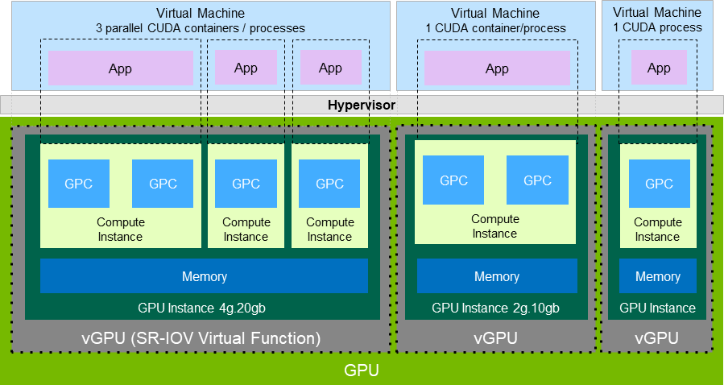

vGPU is exposed via [SR-IOV](https://docs.microsoft.com/en-us/windows-hardware/drivers/network/overview-of-single-root-i-o-virtualization--sr-iov-). SR-IOV is an extension of the PCIe specification. It allows you to take one physical entity like a GPU or NIC and split it up into multiple virtual devices.

### How does SR-IOV work?

In the case of SR-IOV, things are split into a Physical Function (PF) and a PCIe Virtual Function (VF) which represent the physical device and a virtual instance of that device which exposes some subset of the physical resources respectively. Usually a PCIe device has a single Requester ID (RID) which allows it to communicate over PCIe. This functions more or less like an IP address. However, with SR-IOV each physical function and virtual function gets its own RID. This allows the I/O Memory Management Unit (IOMMU) to differentiate between the different VFs.

Note: The IOMMU connects any device with DMA capability (ex: NIC/GPU) to main memory directly instead of routing it through the CPU.

This system allows the hypervisor to deliver IO from the VF directly to a VM without going through any software switching in the hypervisor.

### Multi-Instance GPU

Nvidia calls this segmentation of the GPU Multi-Instance GPU (MIG). MIG enables a physical GPU to be securely partitioned into multiple separate GPU instances, providing multiple users with separate GPU resources to accelerate their applications.

## Nvidia Professional Technologies

This is from [Introduction to NVIDIA Virtual GPU - Part 1 - Intro, Which GPU & License?](https://www.youtube.com/watch?v=NiXtswuE1MI)

While a bit out of date it does a good job of showing where what technologies fit and what licenses are relevant.

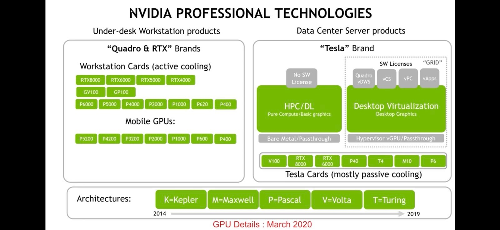

## How Does GRID Manager Integrate with the Hypervisor

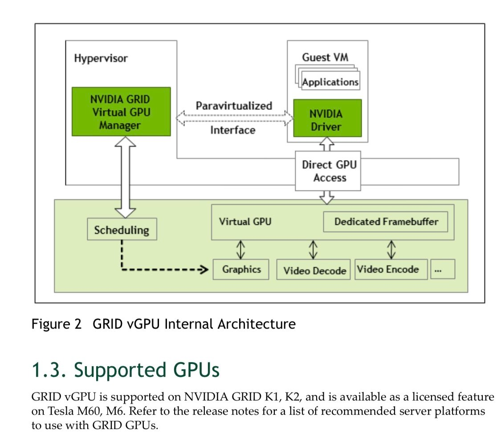

Each vGPU in a VM gets a time slice on the actual GPU along with its own dedicated memory (the frame buffer). You’ll have the aforementioned GPU manager that’s part of the hypervisor and then each VM will run a standard Nvidia driver. Nvidia says that doing full PCIe passthrough vs giving the same resources via a vGPU is a negligible performance difference - a couple of percentage points max. Nvidia maintains a compatibility matrix on their website with what platforms and card combinations are available

### Where do profiles fit in the stack?

This images is helpful because it shows where GPU profiles fit in the stack.

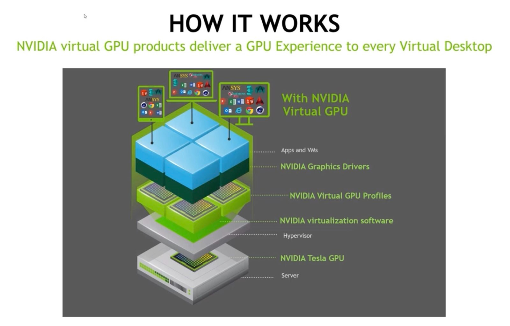

#### What is a Profile

Profiles are the means by which we define how much resources and the types of capabilities a vGPU has.

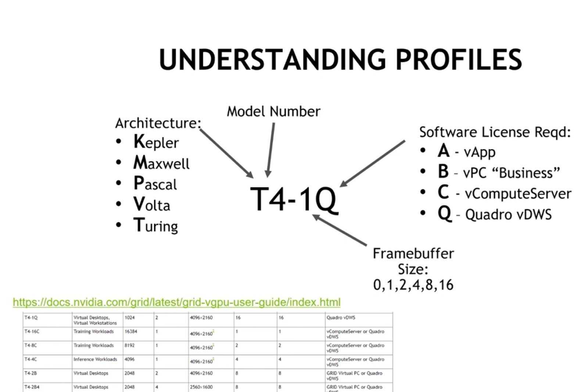

## Selecting a GPU

### Two General Types of Users

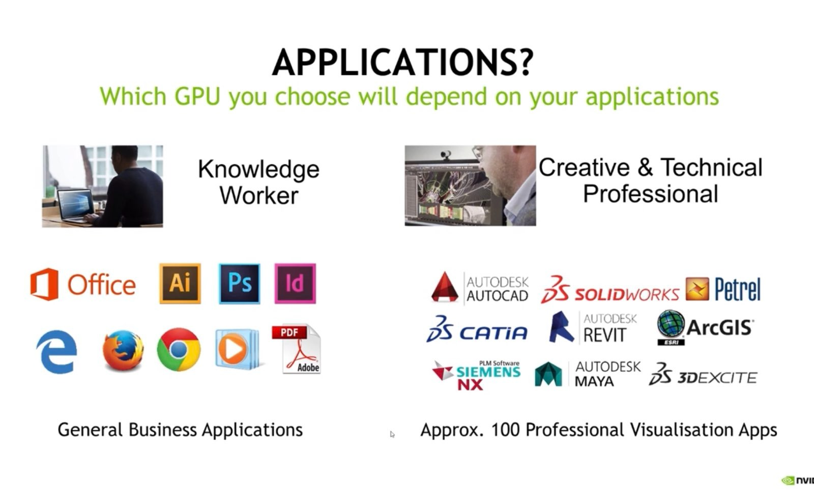

### Which Type of GPU?

#### Dell GPUs and Upgrade Path

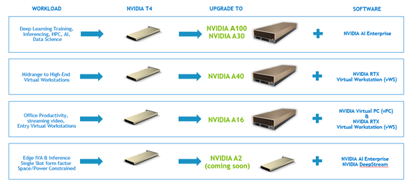
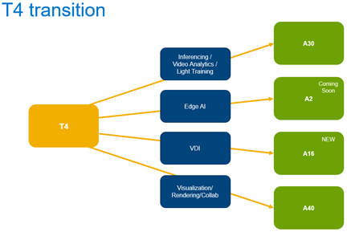

#### Nvidia GPUs

**NOTE**: These are from the aforementioned YouTube lecture which is a bit out of date but I thought it was helpful to see it broken out.

#### GPUs for Power Users

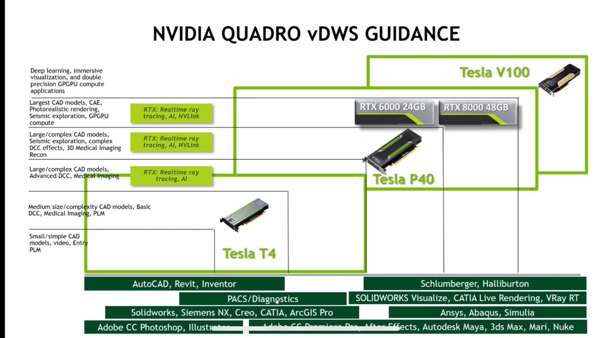

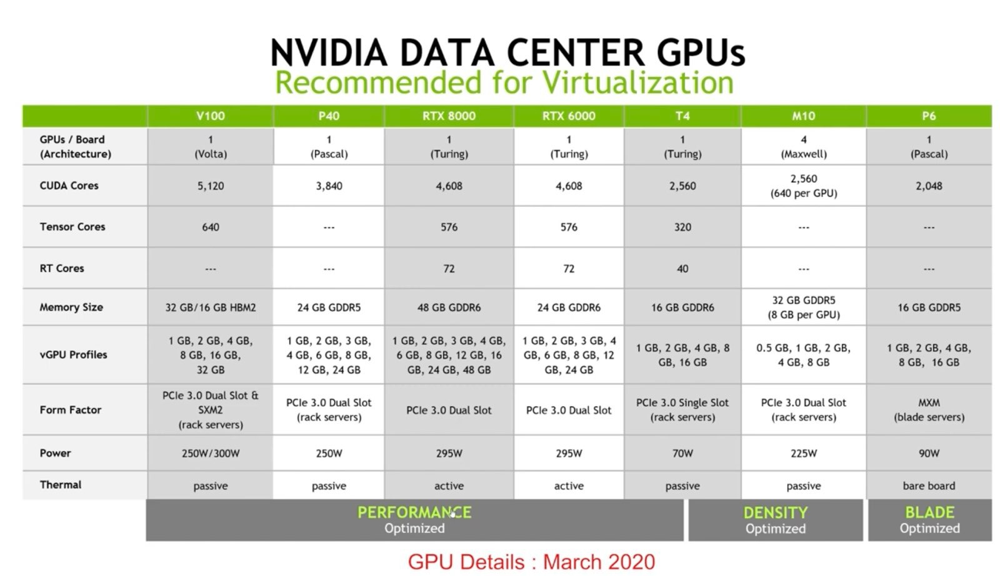

## Desktop Hosting Models

There are two general ways to present virtual desktops

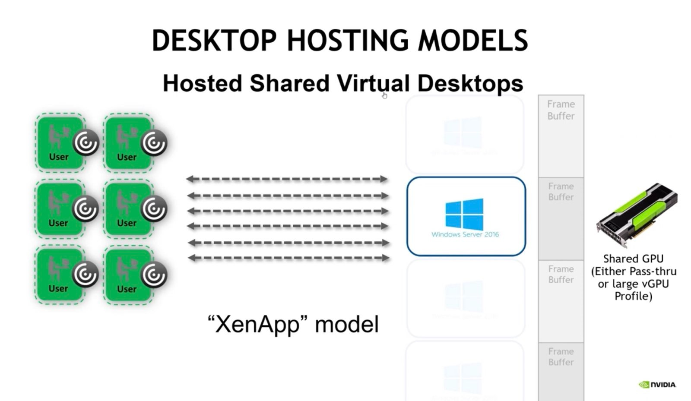

XenApp you have one instance of Windows Server and multiple people using it. You generally need a large frame buffer for this.

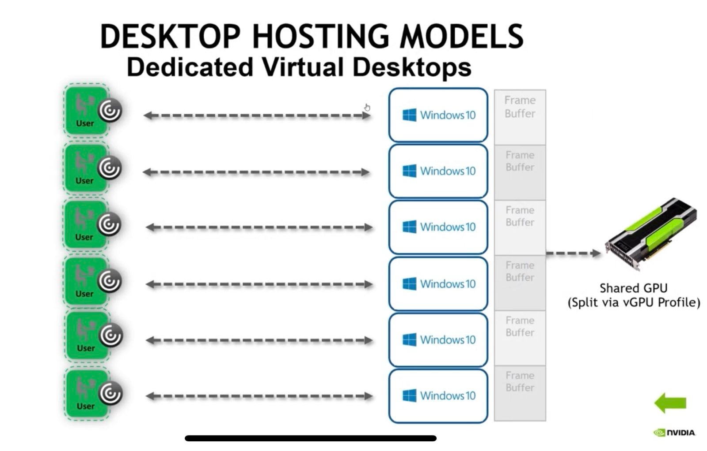

Everyone else uses this model where you have multiple desktops running simultaneously. Licensing: There’s an Nvidia license server that runs and as you create virtual desktops it will consume licenses. Which license depends on what you’re doing and the type of physical GPU.

## vGPU License Decision Tree

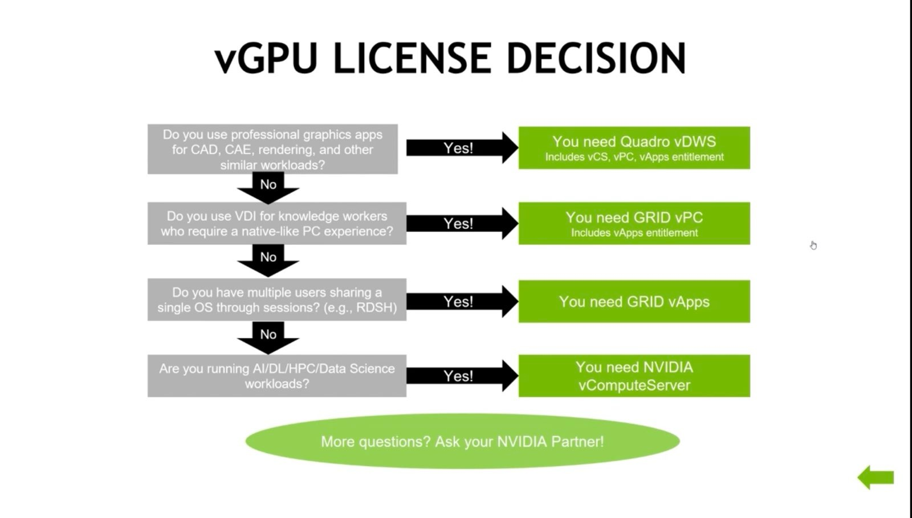

