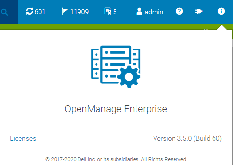
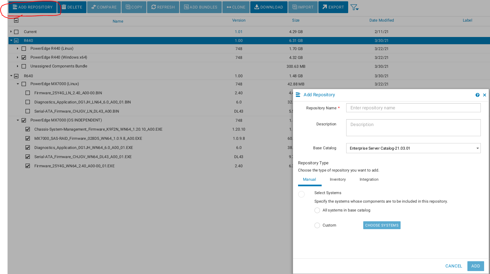
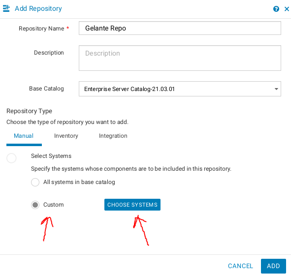
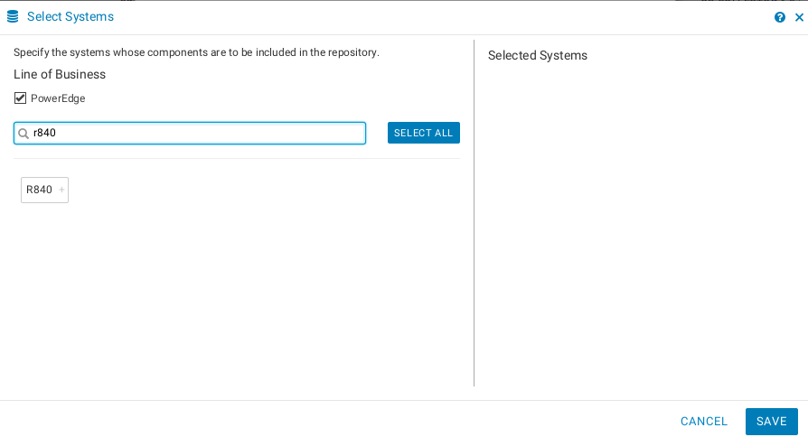
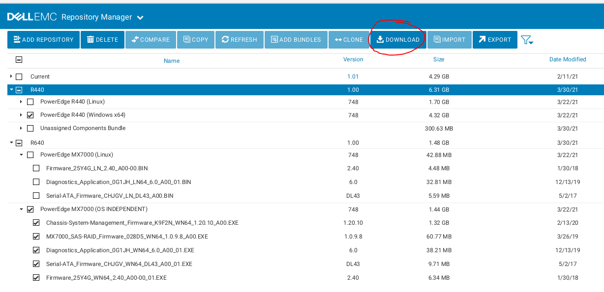
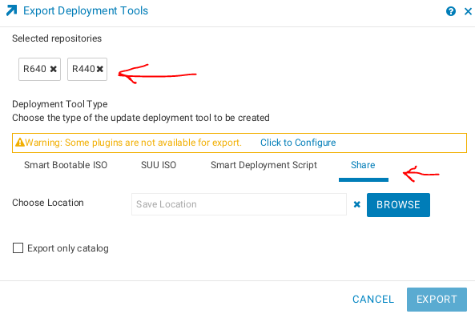
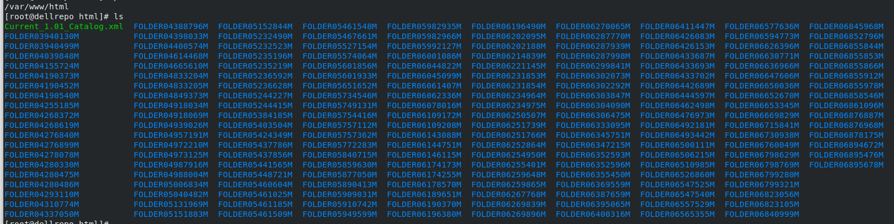
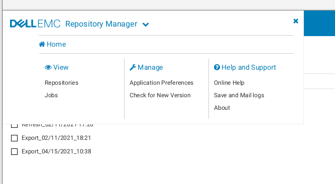
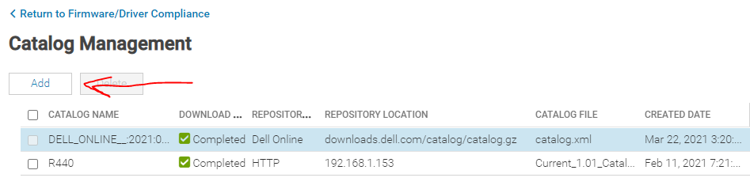
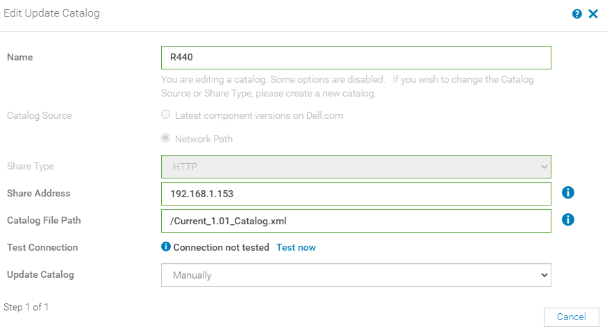

# Offline Updates with OpenManage Enterprise

## Versions
### My Operating System

    [root@dellrepo html]# cat /etc/*-release
    CentOS Linux release 8.3.2011
    NAME="CentOS Linux"
    VERSION="8"
    ID="centos"
    ID_LIKE="rhel fedora"
    VERSION_ID="8"
    PLATFORM_ID="platform:el8"
    PRETTY_NAME="CentOS Linux 8"
    ANSI_COLOR="0;31"
    CPE_NAME="cpe:/o:centos:centos:8"
    HOME_URL="https://centos.org/"
    BUG_REPORT_URL="https://bugs.centos.org/"
    CENTOS_MANTISBT_PROJECT="CentOS-8"
    CENTOS_MANTISBT_PROJECT_VERSION="8"
    CentOS Linux release 8.3.2011
    CentOS Linux release 8.3.2011

### OME Version

## Instructions

1. Download [Dell Repository Manager](https://www.dell.com/support/driver/us/en/19/DriversDetails?driverid=v8ym0)
   1. Run it with `/opt/dell/dellemcrepositorymanager/drm.sh`
      1. NOTE: Running it with root does not work! You will get an error: GUI interface is not supported by this operating system.
   2. Click add repository

   3. Select the systems for which you want to download updates under select systems

   4. Make sure you select Windows-64 as one of the types which will be available

1. `chmod +x <binary name>` then run with `./<binary_name>`.
2. I chose to distribute the repository using HTTP with Apache
   1. `dnf install httpd`
   2. `sudo systemctl start --now httpd`
3. Next you have to synchronize the repository by clicking download. I downloaded my files to `/opt/dell/catalogs/fc640`

4. You then have to go open the Dell EMC Repository Manager -> Export -> Export. You will need to select which repositories you want to export and then you will want to select share and a save location.
   1. **WARNING** You have to download the Windows 64 bit versions of the updates for it to work! Even if you are using Linux the idrac only accepts the Windows EXE files.

5. The export will generate a catalog file when you export. This is what OME will need to reference when you add the catalog. I have included a [copy of mine](Current_1.01_Catalog.xml) so you can see what it looks like.
6. You can see the progress of the export in the jobs manager:

7. Now go to OME catalog management and hit add (Firmware compliance -> catalog Management -> Add)

6. Configure your repository
   1. Share Address: <YOUR_REPO_IP> (nothing else)
   2. Catalog File Path: /catalog.xml (cannot have anything else)
      1. NOTE: The catalog my have a different name depending on how you exported it!

7. Go back to Firmware Compliance -> Create Baseline
   1. Select your local catalog
   2. Give it a name
   3. Add the hosts you discovered
8. Here is what it looks like in action https://youtu.be/p7pxMX-UAJw

## Example With Subfolder

I wanted to confirm an old bug had been cleared out so I also ran it using a subfolder. See https://www.youtube.com/watch?v=iKuCgkBAzu0 to see a BIOS upgrade from start to finish.

**Note**: In all instances the `baseLocation` field for me was empty.