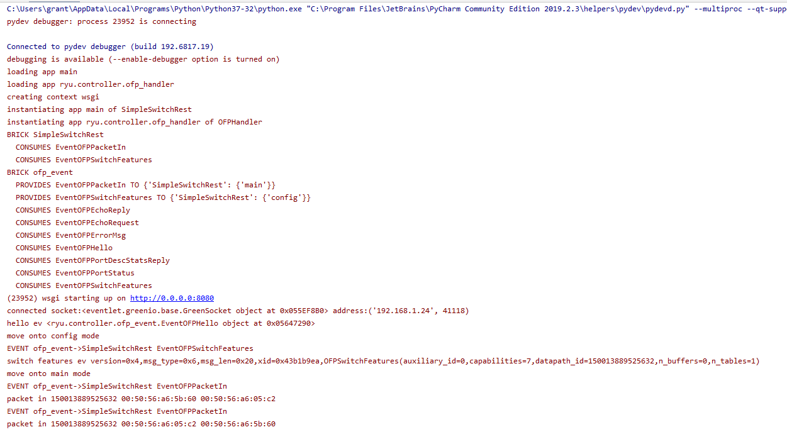
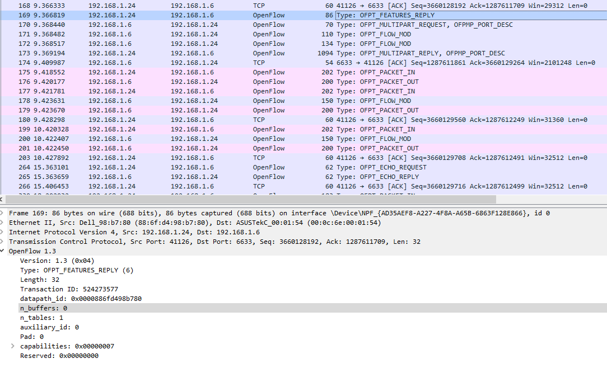
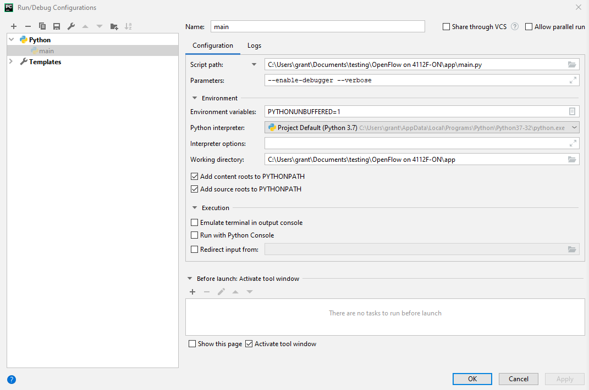

# Bug in Ryu datapath_id

## Overview

### Problem

Ryu incorrectly truncates datapath_id from 16 characters to 15.

I found the problem while testing [this Ryu example](https://osrg.github.io/ryu-book/en/html/rest_api.html#implementing-simpleswitchrest13-class).

## Proof of Concept

Running the code in debug mode produces the below:

You can see that the switch ID 150013889525632 which is only 15 characters instead
of the required 16. 

To confirm that the problem was not with what the switch was sending I captured
the response in Wireshark.

You can see the switch correctly adheres to the 64bit datapath_id requirement.

### Detailed Troubleshooting

I found the problem when none of the routes ran when browsing to the address:

    http://127.0.0.1:8080/simpleswitch/mactable/150013889525632

I eventually realized it is because of the following line:

    @route('/simpleswitch', url, methods=['PUT'], requirements={'dpid': dpid_lib.DPID_PATTERN})

DPID_PATTERN's definition is as follows:

    _DPID_LEN = 16
    _DPID_FMT = '%0{0}x'.format(_DPID_LEN)
    DPID_PATTERN = r'[0-9a-f]{%d}' % _DPID_LEN

You can see this more directly by looking at the regex as it is used in the WSGI
call produced from the above line.

As you can see from *{16}* the switch ID Ryu produces does not match because it
is a character short. You can fix the problem by using the URL:

    http://127.0.0.1:8080/simpleswitch/mactable/0150013889525632

However, that then causes other code to fail because it is is looking for the
original switch ID of 150013889525632.

## Reproducing

### My Configuration

- Controller is running on Windows in PyCharm
- Controller: Ryu
- Switch: 4112F-ON

#### Switch Version Info

    Dell EMC Networking OS10 Enterprise
    Copyright (c) 1999-2020 by Dell Inc. All Rights Reserved.
    OS Version: 10.5.1.0
    Build Version: 10.5.1.0.124
    Build Time: 2020-02-12T09:05:20+0000
    System Type: S4112F-ON
    Architecture: x86_64
    Up Time: 4 days 09:16:43

### Setup

#### Enable OpenFlow on the Switch

On the switch run:

    OS10# configure terminal
    OS10(config)# openflow
    OS10(config-openflow)# mode openflow-only
    Configurations not relevant to openflow mode will be removed from the startup-configuration and system will be rebooted. Do you want to proceed? [confirm yes/no]:yes

#### Configure OpenFlow

    OS10# configure terminal
    OS10(config)# openflow
    OS10(config-openflow)# switch of-switch-1
    OS10(config-openflow-switch)# controller ipv4 <YOUR_CONTROLLER_IP> port 6633
    OS10(config-openflow-switch)# no shutdown

See [the switch config](./switch_configuration) for details.

### Run the Code

Run `pip install ryu` to install Ryu and its dependencies.

I have included [my Ryu app](./main.py) as it currently was when I found the bug 
in the file `main.py`.

I used PyCharm to perform debugging which required me to adjust the debug configuration
to the below:

This will allow you to use PyCharm's debugger.

Alternatively, you can delete everything after line 358 in main.py and use `ryu-manager`
to run the application.

To run the code there is an application called `ryu-manager`. To run the code 
you have to run `ryu-manager main.py`.
