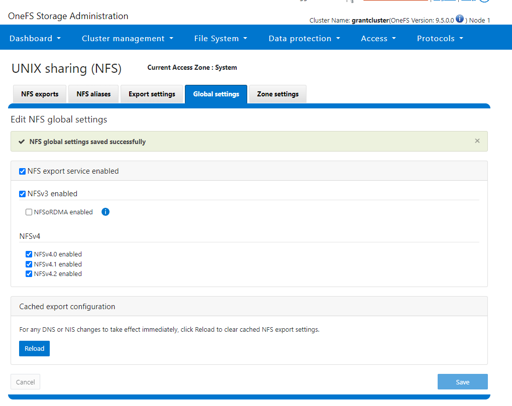
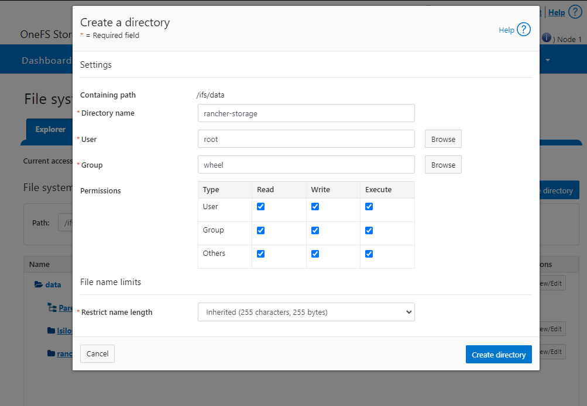
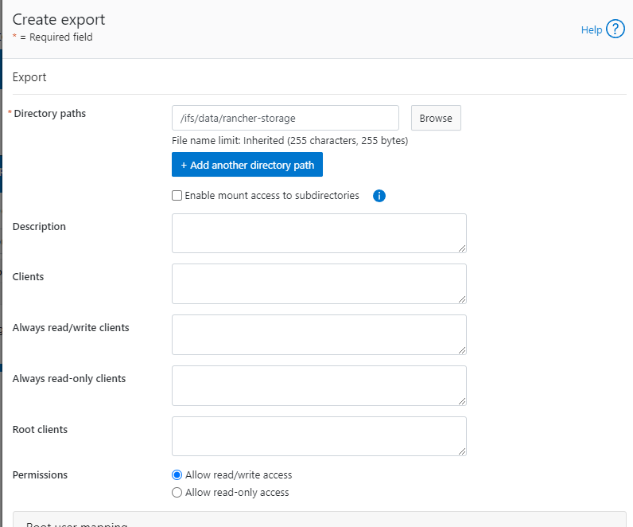

# PowerScale - Configure with Kubernetes (Incomplete)

RKE2 advertises itself as an automatic K8s installer. That is... sort of true based on my experience. It is certainly simpler than what I had to do 7 years ago, but significant assembly by someone who knows kubernetes and networking was still required.

## My IPs


## Install RKE2 on Server

I recommend just making life easy and doing an `su -` and just doing everything as root.

Note: after heavy experimentation to include writing the below code that does [this](https://stackoverflow.com/a/60736109/4427375) I still found flannel choked with firewalld on so ultimately I just ran `systemctl disable --now firewalld`. See [Troubleshooting Flannel Issues](#troubleshooting-flannel-issues). Since it's a lab I decided the juice wasn't worth the squeeze because I think the problem is in the internal masquerade rules. The firewall rules I tried are in [firewall ports I tried](#firewalld-ports-i-tried)

```bash
curl -sfL https://get.rke2.io | sudo sh -
sudo systemectl disable --now firewalld
sudo systemctl enable rke2-server.service
sudo systemctl start rke2-server.service
cd /var/lib/rancher/rke2/bin
echo 'export KUBECONFIG=/etc/rancher/rke2/rke2.yaml' >> ~/.bashrc
echo 'export PATH=$PATH:/var/lib/rancher/rke2/bin' >> ~/.bashrc
source ~/.bashrc
```

The rke2 server process listens on port 9345 for new nodes to register. The Kubernetes API is still served on port 6443, as normal.

## Set Up a K8s Node

```bash
sudo curl -sfL https://get.rke2.io | sudo INSTALL_RKE2_TYPE="agent" sh -
systemctl disable --now firewalld
sudo systemctl enable rke2-agent.service
mkdir -p /etc/rancher/rke2/
echo 'export PATH=$PATH:/var/lib/rancher/rke2/bin' >> ~/.bashrc
source ~/.bashrc
vim /etc/rancher/rke2/config.yaml
```

Note: If you don't update bashrc and source it, none of the `kubectl` commands will run correctly because RKE2 uses a custom API port (6443) whereas the Kubernetes default is 8080.

Next you have to populate the config file with your server's token info. You get the token by logging into the server and running:

```bash
[root@k8s-server tmp]# cat /var/lib/rancher/rke2/server/node-token
K1016508dd12aa27c24f9898fdebd534a7f2dc5b8cd719d1f6cf131edb799247d0e::server:ede9908e983065b06dfabcd9ba45d7ab
```

Then you put that token in the aforementioned config file:

```
server: https://k8s-server.lan:9345
token: K1016508dd12aa27c24f9898fdebd534a7f2dc5b8cd719d1f6cf131edb799247d0e::server:ede9908e983065b06dfabcd9ba45d7ab
```

After you do this and save it I **strongly** suggest running `shutdown -r now` and giving things a reboot. I noticed on my setup, for some reason, flannel failed to come up. You can check if this is the case by running `ip a s`. You should see:

```bash
[grant@k8s-agent1 ~]$ ip a s
1: lo: <LOOPBACK,UP,LOWER_UP> mtu 65536 qdisc noqueue state UNKNOWN group default qlen 1000
    link/loopback 00:00:00:00:00:00 brd 00:00:00:00:00:00
    inet 127.0.0.1/8 scope host lo
       valid_lft forever preferred_lft forever
    inet6 ::1/128 scope host
       valid_lft forever preferred_lft forever
2: ens33: <BROADCAST,MULTICAST,UP,LOWER_UP> mtu 1500 qdisc mq state UP group default qlen 1000
    link/ether 00:50:56:8a:b2:8c brd ff:ff:ff:ff:ff:ff
    altname enp2s1
    inet 10.10.25.136/24 brd 10.10.25.255 scope global noprefixroute ens33
       valid_lft forever preferred_lft forever
    inet6 fe80::250:56ff:fe8a:b28c/64 scope link noprefixroute
       valid_lft forever preferred_lft forever
3: calia304d00df8c@if3: <BROADCAST,MULTICAST,UP,LOWER_UP> mtu 1450 qdisc noqueue state UP group default qlen 1000
    link/ether ee:ee:ee:ee:ee:ee brd ff:ff:ff:ff:ff:ff link-netns cni-fef0629e-72af-acbf-9e2e-27a43f48407e
    inet6 fe80::ecee:eeff:feee:eeee/64 scope link
       valid_lft forever preferred_lft forever
4: calib76b9de74c6@if3: <BROADCAST,MULTICAST,UP,LOWER_UP> mtu 1450 qdisc noqueue state UP group default qlen 1000
    link/ether ee:ee:ee:ee:ee:ee brd ff:ff:ff:ff:ff:ff link-netns cni-60486c79-4e9c-14fd-be02-c8243d382b4a
    inet6 fe80::ecee:eeff:feee:eeee/64 scope link
       valid_lft forever preferred_lft forever
5: cali4fbea555e83@if3: <BROADCAST,MULTICAST,UP,LOWER_UP> mtu 1450 qdisc noqueue state UP group default qlen 1000
    link/ether ee:ee:ee:ee:ee:ee brd ff:ff:ff:ff:ff:ff link-netns cni-5c1b74d4-961c-6f3c-950b-4c910cf5c8d6
    inet6 fe80::ecee:eeff:feee:eeee/64 scope link
       valid_lft forever preferred_lft forever
6: flannel.1: <BROADCAST,MULTICAST,UP,LOWER_UP> mtu 1450 qdisc noqueue state UNKNOWN group default
    link/ether 12:6d:b8:f6:c8:66 brd ff:ff:ff:ff:ff:ff
    inet 10.42.1.0/32 scope global flannel.1
       valid_lft forever preferred_lft forever
    inet6 fe80::106d:b8ff:fef6:c866/64 scope link
       valid_lft forever preferred_lft forever
9: calid194e3ad4a3@if3: <BROADCAST,MULTICAST,UP,LOWER_UP> mtu 1450 qdisc noqueue state UP group default qlen 1000
    link/ether ee:ee:ee:ee:ee:ee brd ff:ff:ff:ff:ff:ff link-netns cni-5f9c0ded-120d-b035-fe1d-6eab65c96d11
    inet6 fe80::ecee:eeff:feee:eeee/64 scope link
       valid_lft forever preferred_lft forever
10: calia758d43a129@if3: <BROADCAST,MULTICAST,UP,LOWER_UP> mtu 1450 qdisc noqueue state UP group default qlen 1000
    link/ether ee:ee:ee:ee:ee:ee brd ff:ff:ff:ff:ff:ff link-netns cni-97f784af-18ec-46df-ce3f-6607efa71a7f
    inet6 fe80::ecee:eeff:feee:eeee/64 scope link
       valid_lft forever preferred_lft forever
11: calie1439757d80@if3: <BROADCAST,MULTICAST,UP,LOWER_UP> mtu 1450 qdisc noqueue state UP group default qlen 1000
    link/ether ee:ee:ee:ee:ee:ee brd ff:ff:ff:ff:ff:ff link-netns cni-a65f26af-89c4-e98c-1248-64b0f4a6cef8
    inet6 fe80::ecee:eeff:feee:eeee/64 scope link
       valid_lft forever preferred_lft forever
```

Notice that `flannel.1` is present along with the calico interfaces. If you **don't** see that, try the reboot.

After the server setup I noticed it took quite some time to come up. You can track progress with `journalctl -u rke2-server -f`. My logs looked like this:

```
Nov 29 14:21:37 k8s-server.lan rke2[1016]: time="2023-11-29T14:21:37-05:00" level=info msg="Pod for kube-apiserver not synced (waiting for termination of old pod sandbox), retrying"
Nov 29 14:21:38 k8s-server.lan rke2[1016]: time="2023-11-29T14:21:38-05:00" level=info msg="Waiting to retrieve kube-proxy configuration; server is not ready: https://127.0.0.1:9345/v1-rke2/readyz: 500 Internal Server Error"
Nov 29 14:21:43 k8s-server.lan rke2[1016]: time="2023-11-29T14:21:43-05:00" level=info msg="Waiting to retrieve kube-proxy configuration; server is not ready: https://127.0.0.1:9345/v1-rke2/readyz: 500 Internal Server Error"
Nov 29 14:21:48 k8s-server.lan rke2[1016]: time="2023-11-29T14:21:48-05:00" level=info msg="Waiting to retrieve kube-proxy configuration; server is not ready: https://127.0.0.1:9345/v1-rke2/readyz: 500 Internal Server Error"
Nov 29 14:21:53 k8s-server.lan rke2[1016]: time="2023-11-29T14:21:53-05:00" level=info msg="Waiting to retrieve kube-proxy configuration; server is not ready: https://127.0.0.1:9345/v1-rke2/readyz: 500 Internal Server Error"
Nov 29 14:21:57 k8s-server.lan rke2[1016]: time="2023-11-29T14:21:57-05:00" level=info msg="Pod for etcd is synced"
Nov 29 14:21:57 k8s-server.lan rke2[1016]: time="2023-11-29T14:21:57-05:00" level=info msg="Pod for kube-apiserver not synced (waiting for termination of old pod sandbox), retrying"
Nov 29 14:21:58 k8s-server.lan rke2[1016]: time="2023-11-29T14:21:58-05:00" level=info msg="Waiting to retrieve kube-proxy configuration; server is not ready: https://127.0.0.1:9345/v1-rke2/readyz: 500 Internal Server Error"
Nov 29 14:22:03 k8s-server.lan rke2[1016]: time="2023-11-29T14:22:03-05:00" level=info msg="Waiting to retrieve kube-proxy configuration; server is not ready: https://127.0.0.1:9345/v1-rke2/readyz: 500 Internal Server Error"
Nov 29 14:22:08 k8s-server.lan rke2[1016]: time="2023-11-29T14:22:08-05:00" level=info msg="Waiting to retrieve kube-proxy configuration; server is not ready: https://127.0.0.1:9345/v1-rke2/readyz: 500 Internal Server Error"
Nov 29 14:22:13 k8s-server.lan rke2[1016]: time="2023-11-29T14:22:13-05:00" level=info msg="Waiting to retrieve kube-proxy configuration; server is not ready: https://127.0.0.1:9345/v1-rke2/readyz: 500 Internal Server Error"
Nov 29 14:22:17 k8s-server.lan rke2[1016]: time="2023-11-29T14:22:17-05:00" level=info msg="Pod for etcd is synced"
Nov 29 14:22:17 k8s-server.lan rke2[1016]: time="2023-11-29T14:22:17-05:00" level=info msg="Pod for kube-apiserver is synced"
Nov 29 14:22:17 k8s-server.lan rke2[1016]: time="2023-11-29T14:22:17-05:00" level=info msg="ETCD server is now running"
Nov 29 14:22:17 k8s-server.lan rke2[1016]: time="2023-11-29T14:22:17-05:00" level=info msg="rke2 is up and running"
Nov 29 14:22:17 k8s-server.lan systemd[1]: Started Rancher Kubernetes Engine v2 (server).
Nov 29 14:22:17 k8s-server.lan rke2[1016]: time="2023-11-29T14:22:17-05:00" level=info msg="Failed to get existing traefik HelmChart" error="helmcharts.helm.cattle.io \"traefik\" not found"
Nov 29 14:22:17 k8s-server.lan rke2[1016]: time="2023-11-29T14:22:17-05:00" level=info msg="Reconciling ETCDSnapshotFile resources"
Nov 29 14:22:17 k8s-server.lan rke2[1016]: time="2023-11-29T14:22:17-05:00" level=info msg="Tunnel server egress proxy mode: agent"
Nov 29 14:22:17 k8s-server.lan rke2[1016]: time="2023-11-29T14:22:17-05:00" level=info msg="Starting managed etcd node metadata controller"
Nov 29 14:22:17 k8s-server.lan rke2[1016]: time="2023-11-29T14:22:17-05:00" level=info msg="Reconciliation of ETCDSnapshotFile resources complete"
Nov 29 14:22:17 k8s-server.lan rke2[1016]: time="2023-11-29T14:22:17-05:00" level=info msg="Starting k3s.cattle.io/v1, Kind=Addon controller"
```

You can see you get constant 500 errors until it eventually fixes itself. When everything has settled down make sure that you see nodes:

```bash
[root@k8s-server bin]# kubectl get nodes
NAME             STATUS   ROLES                       AGE   VERSION
k8s-agent1.lan   Ready    <none>                      11m   v1.26.10+rke2r2
k8s-server.lan   Ready    control-plane,etcd,master   60m   v1.26.10+rke2r2
```

## Install Helm

On the server:

```bash
cd /tmp
wget https://get.helm.sh/helm-v3.13.2-linux-amd64.tar.gz # Update version as needed
tar xzf helm-v3.13.2-linux-amd64.tar.gz
sudo mv linux-amd64/helm /usr/local/bin/helm
helm version
```

## Install Cert Manager

On the server:

```bash
helm repo add jetstack https://charts.jetstack.io
helm repo update
helm install \
  cert-manager jetstack/cert-manager \
  --namespace cert-manager \
  --create-namespace \
  --version v1.13.2 \
  --set installCRDs=true
```

## Install Rancher

On the server:

```bash
helm repo add rancher-stable https://releases.rancher.com/server-charts/stable
kubectl create namespace cattle-system
helm install rancher rancher-stable/rancher --namespace cattle-system --set hostname=k8s-server.lan --set bootstrapPassword=PASSWORD --set ingress.tls.source=rancher # YOU HAVE TO UPDATE THIS
echo https://k8s-server.lan/dashboard/?setup=$(kubectl get secret --namespace cattle-system bootstrap-secret -o go-template='{{.data.bootstrapPassword|base64decode}}')
```

## Install a Load Balancer for Bare Metal (metallb)

```bash
kubectl create namespace metallb-system
kubectl apply -f https://raw.githubusercontent.com/metallb/metallb/v0.13.12/config/manifests/metallb-native.yaml
```

Run `vim metallb.yaml` and create a file with these contents:

```
---
apiVersion: metallb.io/v1beta1
kind: IPAddressPool
metadata:
  name: nat
  namespace: metallb-system
spec:
  addresses:
    - 10.10.25.140-10.10.25.149
---
apiVersion: metallb.io/v1beta1
kind: L2Advertisement
metadata:
  name: empty
  namespace: metallb-system
```

After you create the file run `kubectl apply -f metallb.yaml`

Now we need to make sure Rancher uses metallb:

**WARNING:** you need to change the hostname to your hostname
**WARNING:** make sure Rancher is healthy before continuing!

```bash
helm upgrade rancher rancher-stable/rancher --namespace cattle-system --set hostname=k8s-server.lan --set rancher.service.type=LoadBalancer
kubectl patch svc rancher -n cattle-system -p '{"spec": {"type": "LoadBalancer"}}'
```

## PowerScale

### Setting Up the PowerScale

See [PowerScale Setup](../PowerScale%20Setup/README.md).

### Install the CSI Driver

I started by following [this tutorial](https://www.youtube.com/watch?v=pwpEnZ2mwVE)

- Enable NFSv4



- Create a directory



- Create NFS export



- Move these files onto your system

- [secret.yaml](./secret.yml)
- [empty-secret.yaml](./empy-secret.yaml)
- [my-isilon-settings.yaml](./my-isilon-settings.yaml)
- [isilon.yml](./isilon.yml)
- [test-pvc.yaml](./test-pvc.yaml)
- [test-pod.yaml](./test-pod.yaml)

- Do the following

```bash
sudo dnf install -y git && git clone -b v2.8.0 https://github.com/dell/csi-powerscale.git
cd csi-powerscale/
wget -O my-isilon-settings.yaml https://raw.githubusercontent.com/dell/helm-charts/csi-isilon-2.8.0/charts/csi-isilon/values.yaml
kubectl create namespace isilon
kubectl create -f empty-secret.yml
kubectl create secret generic isilon-creds -n isilon --from-file=config=secret.yaml
```

- On the Isilon you have to run `isi_gconfig -t web-config auth_basic=true` because I was lazy and I used basic auth and not session based auth.
- Next deploy the storage class with `kubectl apply -f samples/storageclass/isilon.yml`
- Check it worked with `kubectl get storageclass` and `kubectl describe storageclass isilon`
- Build a test pvc with `kubectl apply -f test-pvc.yaml` (this should run against the test-pvc file you transferred). Make sure it bound with `kubectl get pvc test-pvc`
- On all servers run `dnf install -y nfs-utils`. **IF YOU DO NOT DO THIS YOU WILL SEE AN ERROR ABOUT LOCKS**. The package is `nfs-common` on Debian-based systems.


## Troubleshooting 

### Flannel Issues


My rancher install failed with no output from the installer. You can manually pull the logs by examining the rancher pod with `kubectl logs -n cattle-system rancher-64cf6ddd96-2x2ms`

This got me:

```
2023/11/29 21:04:33 [ERROR] [updateClusterHealth] Failed to update cluster [local]: Internal error occurred: failed calling webhook "rancher.cattle.io.clusters.management.cattle.io": failed to call webhook: Post "https://rancher-webhook.cattle-system.svc:443/v1/webhook/mutation/clusters.management.cattle.io?timeout=10s": context deadline exceeded
2023/11/29 21:04:33 [ERROR] Failed to connect to peer wss://10.42.0.8/v3/connect [local ID=10.42.1.20]: dial tcp 10.42.0.8:443: connect: no route to host
2023/11/29 21:04:34 [ERROR] Failed to connect to peer wss://10.42.1.21/v3/connect [local ID=10.42.1.20]: dial tcp 10.42.1.21:443: connect: no route to host
2023/11/29 21:04:38 [ERROR] Failed to connect to peer wss://10.42.0.8/v3/connect [local ID=10.42.1.20]: dial tcp 10.42.0.8:443: connect: no route to host
2023/11/29 21:04:39 [ERROR] Failed to connect to peer wss://10.42.1.21/v3/connect [local ID=10.42.1.20]: dial tcp 10.42.1.21:443: connect: no route to host
2023/11/29 21:04:43 [ERROR] Failed to connect to peer wss://10.42.0.8/v3/connect [local ID=10.42.1.20]: dial tcp 10.42.0.8:443: connect: no route to host
2023/11/29 21:04:44 [ERROR] Failed to connect to peer wss://10.42.1.21/v3/connect [local ID=10.42.1.20]: dial tcp 10.42.1.21:443: connect: no route to host
```

on repeat. 10.42.1.21 is an internal flannel address so the next step is to figure out who owns it with `kubectl get pods --all-namespaces -o wide`:

```
[root@k8s-server ~]# kubectl get pods --all-namespaces -o wide
NAMESPACE                         NAME                                                    READY   STATUS      RESTARTS       AGE    IP             NODE             NOMINATED NODE   READINESS GATES
cattle-fleet-system               fleet-controller-56968b86b6-tctjr                       1/1     Running     0              44m    10.42.1.24     k8s-agent1.lan   <none>           <none>
cattle-fleet-system               gitjob-7d68454468-bk7fh                                 1/1     Running     0              44m    10.42.1.25     k8s-agent1.lan   <none>           <none>
cattle-provisioning-capi-system   capi-controller-manager-6f87d6bd74-v489n                1/1     Running     0              41m    10.42.1.30     k8s-agent1.lan   <none>           <none>
cattle-system                     helm-operation-64xf7                                    0/2     Completed   0              42m    10.42.1.29     k8s-agent1.lan   <none>           <none>
cattle-system                     helm-operation-h88vn                                    1/2     Error       0              41m    10.42.1.34     k8s-agent1.lan   <none>           <none>
cattle-system                     helm-operation-jndl9                                    1/2     Error       0              41m    10.42.1.33     k8s-agent1.lan   <none>           <none>
cattle-system                     helm-operation-k757h                                    0/2     Completed   0              44m    10.42.1.23     k8s-agent1.lan   <none>           <none>
cattle-system                     helm-operation-ldnkm                                    0/2     Completed   0              45m    10.42.1.22     k8s-agent1.lan   <none>           <none>
cattle-system                     helm-operation-sv5ts                                    0/2     Completed   0              43m    10.42.1.28     k8s-agent1.lan   <none>           <none>
cattle-system                     helm-operation-thct7                                    0/2     Completed   0              43m    10.42.1.27     k8s-agent1.lan   <none>           <none>
cattle-system                     rancher-64cf6ddd96-2x2ms                                1/1     Running     1 (45m ago)    46m    10.42.1.20     k8s-agent1.lan   <none>           <none>
cattle-system                     rancher-64cf6ddd96-drrzr                                1/1     Running     0              46m    10.42.0.8      k8s-server.lan   <none>           <none>
cattle-system                     rancher-64cf6ddd96-qq64g                                1/1     Running     0              46m    10.42.1.21     k8s-agent1.lan   <none>           <none>
cattle-system                     rancher-webhook-58d68fb97d-b5sn8                        1/1     Running     0              41m    10.42.1.32     k8s-agent1.lan   <none>           <none>
cert-manager                      cert-manager-startupapicheck-fvp9t                      0/1     Completed   1              52m    10.42.1.19     k8s-agent1.lan   <none>           <none>
kube-system                       cloud-controller-manager-k8s-server.lan                 1/1     Running     3 (105m ago)   139m   10.10.25.135   k8s-server.lan   <none>           <none>
kube-system                       etcd-k8s-server.lan                                     1/1     Running     1              139m   10.10.25.135   k8s-server.lan   <none>           <none>
kube-system                       helm-install-rke2-canal-k8b4d                           0/1     Completed   0              139m   10.10.25.135   k8s-server.lan   <none>           <none>
kube-system                       helm-install-rke2-coredns-f59dz                         0/1     Completed   0              139m   10.10.25.135   k8s-server.lan   <none>           <none>
kube-system                       helm-install-rke2-ingress-nginx-gpt7q                   0/1     Completed   0              139m   10.42.0.2      k8s-server.lan   <none>           <none>
kube-system                       helm-install-rke2-metrics-server-q9jwf                  0/1     Completed   0              139m   10.42.0.6      k8s-server.lan   <none>           <none>
kube-system                       helm-install-rke2-snapshot-controller-6pqpg             0/1     Completed   2              139m   10.42.0.4      k8s-server.lan   <none>           <none>
kube-system                       helm-install-rke2-snapshot-controller-crd-k6klp         0/1     Completed   0              139m   10.42.0.10     k8s-server.lan   <none>           <none>
kube-system                       helm-install-rke2-snapshot-validation-webhook-hrv5n     0/1     Completed   0              139m   10.42.0.3      k8s-server.lan   <none>           <none>
kube-system                       kube-apiserver-k8s-server.lan                           1/1     Running     1              139m   10.10.25.135   k8s-server.lan   <none>           <none>
kube-system                       kube-controller-manager-k8s-server.lan                  1/1     Running     2 (105m ago)   139m   10.10.25.135   k8s-server.lan   <none>           <none>
kube-system                       kube-proxy-k8s-agent1.lan                               1/1     Running     0              90m    10.10.25.136   k8s-agent1.lan   <none>           <none>
kube-system                       kube-proxy-k8s-server.lan                               1/1     Running     2 (104m ago)   103m   10.10.25.135   k8s-server.lan   <none>           <none>
kube-system                       kube-scheduler-k8s-server.lan                           1/1     Running     1 (105m ago)   139m   10.10.25.135   k8s-server.lan   <none>           <none>
kube-system                       rke2-canal-7p5hz                                        2/2     Running     2 (105m ago)   139m   10.10.25.135   k8s-server.lan   <none>           <none>
kube-system                       rke2-canal-9wg57                                        2/2     Running     0              90m    10.10.25.136   k8s-agent1.lan   <none>           <none>
kube-system                       rke2-coredns-rke2-coredns-565dfc7d75-n96xs              1/1     Running     0              90m    10.42.1.2      k8s-agent1.lan   <none>           <none>
kube-system                       rke2-coredns-rke2-coredns-565dfc7d75-xv92q              1/1     Running     1 (105m ago)   139m   10.42.0.3      k8s-server.lan   <none>           <none>
kube-system                       rke2-coredns-rke2-coredns-autoscaler-6c48c95bf9-mh279   1/1     Running     1 (105m ago)   139m   10.42.0.2      k8s-server.lan   <none>           <none>
kube-system                       rke2-ingress-nginx-controller-89d4c                     1/1     Running     0              89m    10.42.1.3      k8s-agent1.lan   <none>           <none>
kube-system                       rke2-ingress-nginx-controller-zctxb                     1/1     Running     1 (105m ago)   139m   10.42.0.5      k8s-server.lan   <none>           <none>
kube-system                       rke2-metrics-server-c9c78bd66-ndcxs                     1/1     Running     1 (105m ago)   139m   10.42.0.4      k8s-server.lan   <none>           <none>
kube-system                       rke2-snapshot-controller-6f7bbb497d-xfk9x               1/1     Running     1 (105m ago)   139m   10.42.0.6      k8s-server.lan   <none>           <none>
kube-system                       rke2-snapshot-validation-webhook-65b5675d5c-sfqb2       1/1     Running     1 (105m ago)   139m   10.42.0.7      k8s-server.lan   <none>           <none>

```

We can see that 10.42.0.8 and 10.42.1.21 are the two rancher containers which confirms for us that as per usual, flannel is not able to complete even its most basic of functions (VXLAN) successfully and its up to us to fix it.

```
cattle-system                     rancher-64cf6ddd96-drrzr                                1/1     Running     0              46m    10.42.0.8      k8s-server.lan   <none>           <none>
cattle-system                     rancher-64cf6ddd96-qq64g                                1/1     Running     0              46m    10.42.1.21     k8s-agent1.lan   <none>           <none>
```

We can get shells in these containers with `kubectl exec -it -n cattle-system rancher-64cf6ddd96-drrzr -- /bin/bash`. I fished around in here and found nothing. Ultimately I tcpdumped the flannel network and discovered that we were missing some other specific ports it needed:

```
[root@k8s-agent1 ~]# tcpdump -i flannel.1
dropped privs to tcpdump
tcpdump: verbose output suppressed, use -v[v]... for full protocol decode
listening on flannel.1, link-type EN10MB (Ethernet), snapshot length 262144 bytes
16:17:38.793476 IP 10.42.0.0.58822 > 10.42.1.32.tungsten-https: Flags [S], seq 3219974389, win 64860, options [mss 1410,sackOK,TS val 2506628321 ecr 0,nop,wscale 7], length 0
16:17:38.793509 IP k8s-agent1.lan > 10.42.0.0: ICMP host 10.42.1.32 unreachable - admin prohibited filter, length 68
16:17:39.143985 IP 10.42.0.0.41502 > 10.42.1.32.tungsten-https: Flags [S], seq 1965118956, win 64860, options [mss 1410,sackOK,TS val 2506628671 ecr 0,nop,wscale 7], length 0
16:17:39.144008 IP k8s-agent1.lan > 10.42.0.0: ICMP host 10.42.1.32 unreachable - admin prohibited filter, length 68
16:17:39.847986 IP 10.42.0.0.58822 > 10.42.1.32.tungsten-https: Flags [S], seq 3219974389, win 64860, options [mss 1410,sackOK,TS val 2506629375 ecr 0,nop,wscale 7], length 0
16:17:39.848008 IP k8s-agent1.lan > 10.42.0.0: ICMP host 10.42.1.32 unreachable - admin prohibited filter, length 68
16:17:40.679004 IP 10.42.0.0.47680 > 10.42.1.32.tungsten-https: Flags [S], seq 1291962979, win 64860, options [mss 1410,sackOK,TS val 2506630206 ecr 0,nop,wscale 7], length 0
16:17:40.679028 IP k8s-agent1.lan > 10.42.0.0: ICMP host 10.42.1.32 unreachable - admin prohibited filter, length 68
16:17:41.894997 IP 10.42.0.0.58822 > 10.42.1.32.tungsten-https: Flags [S], seq 3219974389, win 64860, options [mss 1410,sackOK,TS val 2506631422 ecr 0,nop,wscale 7], length 0
16:17:41.895024 IP k8s-agent1.lan > 10.42.0.0: ICMP host 10.42.1.32 unreachable - admin prohibited filter, length 68
16:17:42.727005 IP 10.42.0.0.54136 > 10.42.1.32.tungsten-https: Flags [S], seq 1383176303, win 64860, options [mss 1410,sackOK
```

Ultimately even after opening the ports I wasn't able to get it to work so I disabled firewalld altogether.

##### Firewalld Ports I tried


Firewall rules I tried on server:

```bash
# Kubernetes API Server
firewall-cmd --permanent --add-port=6443/tcp
# RKE2 Server
firewall-cmd --permanent --add-port=9345/tcp
# etcd server client API
firewall-cmd --permanent --add-port=2379/tcp
firewall-cmd --permanent --add-port=2380/tcp
# HTTPS
firewall-cmd --permanent --add-port=443/tcp
# NodePort Services
firewall-cmd --permanent --add-port=30000-32767/tcp
# Kubelet API
firewall-cmd --permanent --add-port=10250/tcp
# kube-scheduler
firewall-cmd --permanent --add-port=10251/tcp
# kube-controller-manager
firewall-cmd --permanent --add-port=10252/tcp
# Flannel
firewall-cmd --permanent --add-port=8285/udp
firewall-cmd --permanent --add-port=8472/udp
# Additional ports required for Kubernetes
firewall-cmd --permanent --add-port=10255/tcp # Read-only Kubelet API
firewall-cmd --permanent --add-port=30000-32767/tcp # NodePort Services range
firewall-cmd --permanent --add-port=6783/tcp # Flannel
firewall-cmd --permanent --add-port=6783/udp # Flannel
firewall-cmd --permanent --add-port=6784/udp # Flannel
firewall-cmd --add-masquerade --permanent
firewall-cmd --reload
systemctl restart firewalld
```

Firewall rules I tried on agent:

Firewall rules I've tried

```bash
# Kubelet API and Flannel ports
firewall-cmd --permanent --add-port=10250/tcp
firewall-cmd --permanent --add-port=8285/udp
firewall-cmd --permanent --add-port=8472/udp
# NodePort Services
firewall-cmd --permanent --add-port=30000-32767/tcp
# Additional ports required for Kubernetes
firewall-cmd --permanent --add-port=10255/tcp # Read-only Kubelet API
firewall-cmd --permanent --add-port=6783/tcp # Flannel
firewall-cmd --permanent --add-port=6783/udp # Flannel
firewall-cmd --permanent --add-port=6784/udp # Flannel
firewall-cmd --add-masquerade --permanent
firewall-cmd --reload
systemctl restart firewalld
```

### Getting Kubernetes Status

**Get Node status**

```bash
kubectl get nodes
```

**Get Detailed Node Status**

```bash
kubectl describe nodes
```

**Check all pods status**

```bash
kubectl get pods --all-namespaces
```

**Check specific pod status**

```bash
kubectl get pods -n cert-manager
```

**Get detailed info for a specific pod**

```bash
kubectl describe pod -n cert-manager cert-manager-6f799f7ff8-xx68n
```

**Get the logs from a specific pod**

```bash
kubectl logs -n kube-system rke2-ingress-nginx-controller-89d4c
```

**Check to see if metallb is giving a service an external IP address**

```bash
kubectl get svc -n cattle-system
```

**Check metellb config**

```bash
kubectl get configmap -n metallb-system config -o yaml
```

**Check the metallb speaker output to see if there was an error giving out an IP address**

```bash
kubectl logs -l component=controller -n metallb-system
```

**Edit a config file inside of K8s**

```bash
kubectl edit configmap config -n metallb-system
```

**Restart metallb after a config change**

```bash
kubectl rollout restart daemonset -n metallb-system speaker
kubectl rollout restart deployment -n metallb-system controller
```

**Restart a target service**

Sometimes this helps get an IP unstuck from pending

```bash
kubectl rollout restart deployment rancher -n cattle-system
```