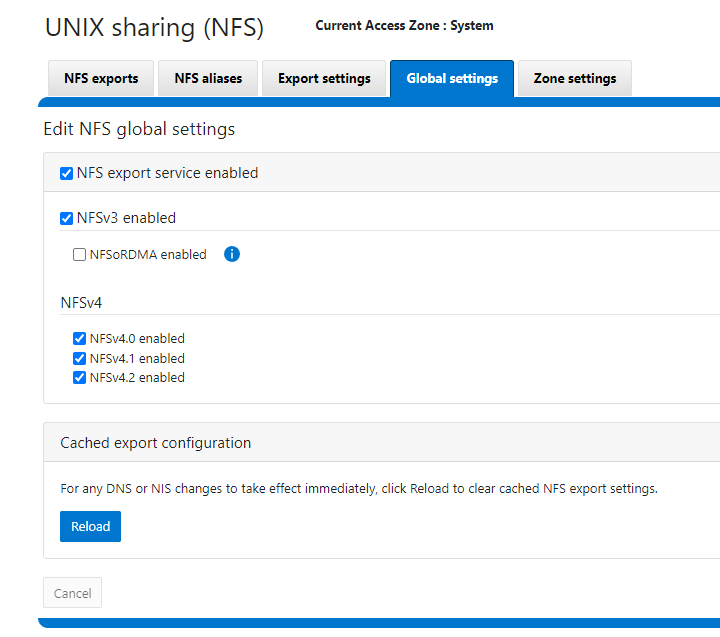

# Powerscale CSI Bug

- [Powerscale CSI Bug](#powerscale-csi-bug)
  - [Problem Description](#problem-description)
    - [Permanent Fix](#permanent-fix)
  - [Details](#details)
  - [Isilon Server Config](#isilon-server-config)
  - [K8s Config](#k8s-config)

## Problem Description

Customer reporting that when they attempt to write to an NFS mount via CSI driver inside a container they immediately receive access denied. We are unsure of root cause but Dell staff were able to reproduce and when working with the developers determined the fix action is to use IP addresses in the NFS export:


### Permanent Fix

Instead of manually updating each export users can enable `ignoreUnresolvableHosts` in their [values.yml](https://github.com/dell/helm-charts/blob/c48cfd6bcd8390d3671e032672016407c5142f94/charts/csi-isilon/values.yaml#L342) file during installation. By doing this the CSI driver will always use IP addresses fixing the issue until we completely a root cause analysis.

## Details

- Confirm PVC is built

```bash
[root@k8s-server tmp]# kubectl get pvc
NAME       STATUS   VOLUME           CAPACITY   ACCESS MODES   STORAGECLASS   AGE
test-pvc   Bound    k8s-5b6cb091d0   1Gi        RWO            isilon         4h4m
```

- Create a test pod which outputs anything to NFS mount:

```bash
[root@k8s-server tmp]# cat test-pod.yaml
apiVersion: v1
kind: Pod
metadata:
  name: test-pod
spec:
  containers:
  - name: test-container
    image: busybox
    command: ["/bin/sh", "-ec", "while :; do echo $(date) >> /mnt/data/out.txt; sleep 5; done"]
    volumeMounts:
    - name: test-volume
      mountPath: /mnt/data
  volumes:
  - name: test-volume
    persistentVolumeClaim:
      claimName: test-pvc
[root@k8s-server tmp]# kubectl apply -f test-pod.yaml
pod/test-pod created
```

- Check test pod - confirm access denied

```bash
[root@k8s-server tmp]# kubectl describe test-pod
error: the server doesn't have a resource type "test-pod"
[root@k8s-server tmp]# kubectl describe pod test-pod
Name:             test-pod
Namespace:        default
Priority:         0
Service Account:  default
Node:             k8s-agent1.lan/10.10.25.136
Start Time:       Tue, 05 Dec 2023 21:26:11 -0500
Labels:           <none>
Annotations:      <none>
Status:           Pending
IP:
IPs:              <none>
Containers:
  test-container:
    Container ID:
    Image:         busybox
    Image ID:
    Port:          <none>
    Host Port:     <none>
    Command:
      /bin/sh
      -ec
      while :; do echo $(date) >> /mnt/data/out.txt; sleep 5; done
    State:          Waiting
      Reason:       ContainerCreating
    Ready:          False
    Restart Count:  0
    Environment:    <none>
    Mounts:
      /mnt/data from test-volume (rw)
      /var/run/secrets/kubernetes.io/serviceaccount from kube-api-access-2n2rn (ro)
Conditions:
  Type              Status
  Initialized       True
  Ready             False
  ContainersReady   False
  PodScheduled      True
Volumes:
  test-volume:
    Type:       PersistentVolumeClaim (a reference to a PersistentVolumeClaim in the same namespace)
    ClaimName:  test-pvc
    ReadOnly:   false
  kube-api-access-2n2rn:
    Type:                    Projected (a volume that contains injected data from multiple sources)
    TokenExpirationSeconds:  3607
    ConfigMapName:           kube-root-ca.crt
    ConfigMapOptional:       <nil>
    DownwardAPI:             true
QoS Class:                   BestEffort
Node-Selectors:              <none>
Tolerations:                 node.kubernetes.io/not-ready:NoExecute op=Exists for 300s
                             node.kubernetes.io/unreachable:NoExecute op=Exists for 300s
Events:
  Type     Reason                  Age   From                     Message
  ----     ------                  ----  ----                     -------
  Normal   Scheduled               19s   default-scheduler        Successfully assigned default/test-pod to k8s-agent1.lan
  Normal   SuccessfulAttachVolume  19s   attachdetach-controller  AttachVolume.Attach succeeded for volume "k8s-5b6cb091d0"
  Warning  FailedMount             2s    kubelet                  MountVolume.SetUp failed for volume "k8s-5b6cb091d0" : rpc error: code = Unknown desc = mount failed: exit status 32
mounting arguments: -t nfs -o rw 10.10.25.80:/ifs/data/rancher-storage/k8s-5b6cb091d0 /var/lib/kubelet/pods/e1bb5844-f482-4dfa-b4b0-0aa8225a316b/volumes/kubernetes.io~csi/k8s-5b6cb091d0/mount
output: mount.nfs: access denied by server while mounting 10.10.25.80:/ifs/data/rancher-storage/k8s-5b6cb091d0
```

## Isilon Server Config

- Permissions for the mounted PVC folder


- NFS Zone Settings


- Global NFS Settings



## K8s Config

Exactly how I built the K8s cluster is available [here](./README.md)
