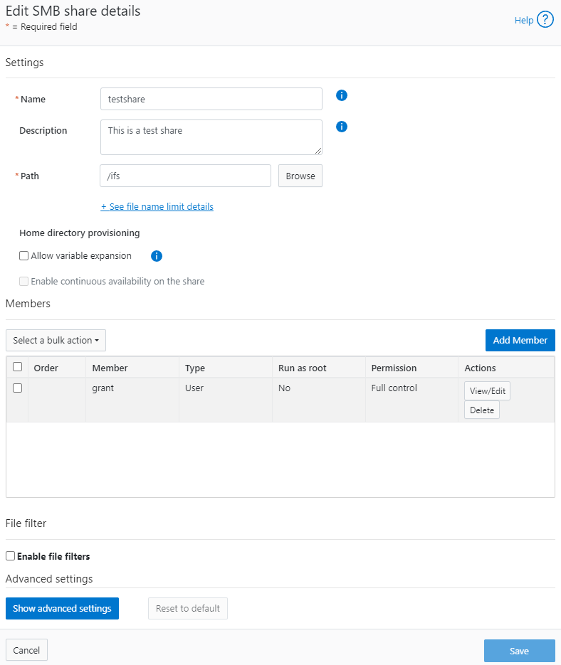
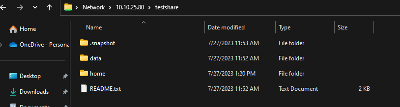
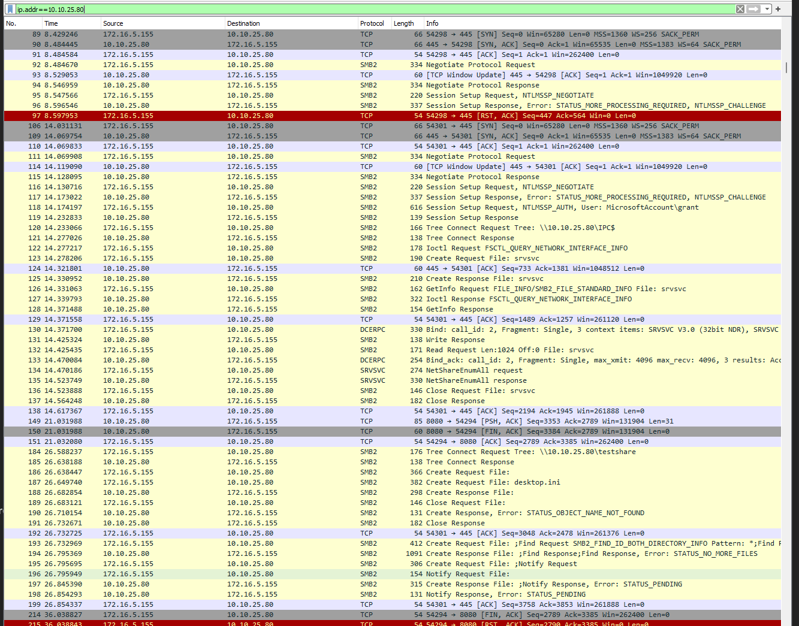
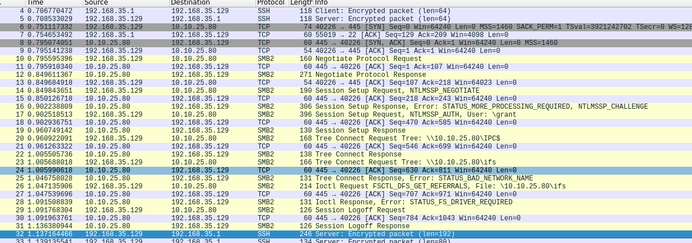
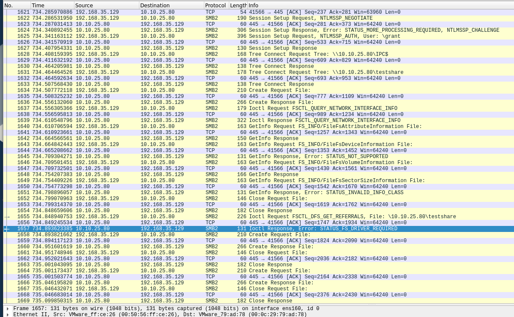
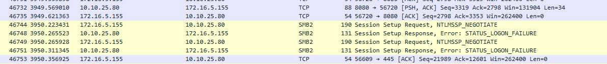
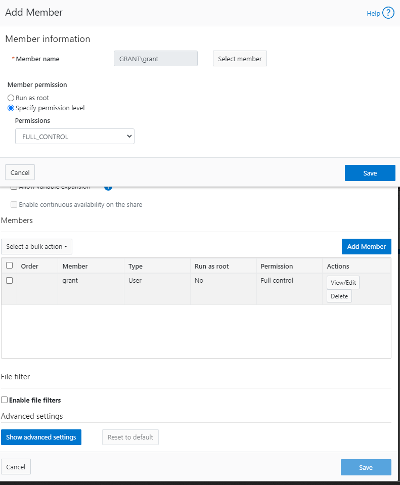
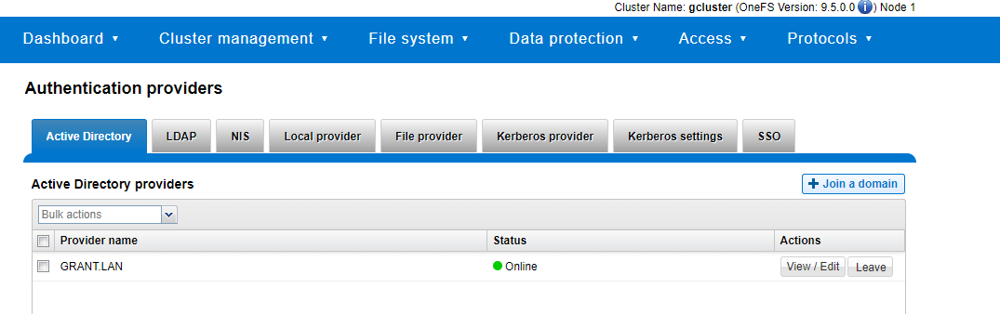
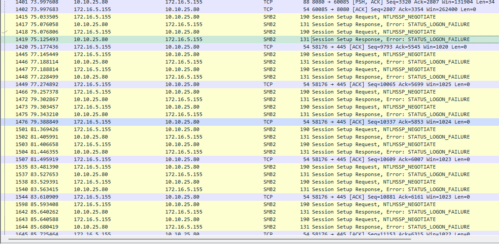

# PowerScale Setup

- [PowerScale Setup](#powerscale-setup)
  - [Testing](#testing)
    - [Test 1 - Generic Share](#test-1---generic-share)
      - [Against Windows 11](#against-windows-11)
      - [Against Rocky Linux 9](#against-rocky-linux-9)
    - [Test 2 - Add FIPS](#test-2---add-fips)
      - [Add FIPS](#add-fips)
      - [Test Against Windows 11](#test-against-windows-11)
      - [Set Up Active Directory](#set-up-active-directory)
      - [Test Against Rocky Linux 9](#test-against-rocky-linux-9)
  - [How Kerberos Works in This Scenario](#how-kerberos-works-in-this-scenario)
    - [What is a Service Principal](#what-is-a-service-principal)
    - [Debugging](#debugging)


## Testing

### Test 1 - Generic Share

- Created a system user grant on the local OS, set up a share, and gave that user privileges.



#### Against Windows 11

- I was able to access that without issue



- Default communication happened with SMBv2



#### Against Rocky Linux 9

- Ran command `sudo mount.cifs //10.10.25.80/ifs ~/share -o vers=2.0,username=grant,password='somepassword'` which gave `mount error(2): No such file or directory`
- Received: 



- I think the "STATUS_FS_DRIVER_REQUIRED" may be misleading because I have the CIFS module:

```
[root@acas ~]# lsmod | grep cif
cifs                 2355200  0
cifs_arc4              16384  1 cifs
rdma_cm               139264  1 cifs
ib_core               450560  4 rdma_cm,cifs,iw_cm,ib_cm
cifs_md4               16384  1 cifs
dns_resolver           16384  1 cifs
```

- The problem was I was providing the share path not the share name - like a genius. `sudo mount -t cifs //10.10.25.80/testshare /root/share -o username=grant,password='somepassword'` works.



### Test 2 - Add FIPS

#### Add FIPS

Working from [this procedure](https://infohub.delltechnologies.com/l/dell-powerscale-onefs-security-considerations/configuration-3608)

- Check if FIPS is already active

```
gcluster-1# isi security settings view
       FIPS Mode Enabled: No
      USB Ports Disabled: No
Restricted shell Enabled: No
```

- Make sure nodes are healthy

```
gcluster-1# isi status
Cluster Name: gcluster
Cluster Health:     [ ATTN]
Data Reduction:     1.00 : 1
Storage Efficiency: 0.31 : 1
Cluster Storage:  HDD                 SSD Storage
Size:             168.1G (234.9G Raw) 0 (0 Raw)
VHS Size:         66.8G
Used:             327.9M (< 1%)       0 (n/a)
Avail:            167.8G (> 99%)      0 (n/a)

                   Health Ext  Throughput (bps)  HDD Storage      SSD Storage
ID |IP Address     |DASR |C/N|  In   Out  Total| Used / Size     |Used / Size
---+---------------+-----+---+-----+-----+-----+-----------------+-----------------
  1|10.10.25.80    |-A-- | C |27.1k| 2.1M| 2.1M| 126M/56.0G(< 1%)|(No Storage SSDs)
  2|10.10.25.81    |-A-- | C |    0|67.1k|67.1k| 109M/56.0G(< 1%)|(No Storage SSDs)
  3|10.10.25.82    |-A-- | C |    0| 270k| 270k|93.1M/56.0G(< 1%)|(No Storage SSDs)
---+---------------+-----+---+-----+-----+-----+-----------------+-----------------
Cluster Totals:              |27.1k| 2.4M| 2.4M| 328M/ 168G(< 1%)|(No Storage SSDs)

     Health Fields: D = Down, A = Attention, S = Smartfailed, R = Read-Only
           External Network Fields: C = Connected, N = Not Connected

Critical Events:
Time            LNN  Event
--------------- ---- -------------------------------------------------------
07/27 12:04:21  1    One or more drives (location(s) Bay  7, Bay  8, Bay ...
07/27 12:30:35  3    Missing COMMITTED image in secure catalog
07/27 12:30:56  2    One or more drives (location(s) Bay  7, Bay  8, Bay ...
07/27 12:35:35  3    One or more drives (location(s) Bay  7, Bay  8, Bay ...


Cluster Job Status:

No running jobs.

No paused or waiting jobs.

No failed jobs.

Recent job results:
Time            Job                        Event
--------------- -------------------------- ------------------------------
07/27 12:29:37  MultiScan[3]               Succeeded
07/27 12:22:42  MultiScan[2]               Succeeded
07/27 11:58:30  DomainTag[1]               Succeeded
```

- Turn on FIPS

```
gcluster-1# isi security settings modify --fips-mode-enabled=true
gcluster-1# isi security settings view
       FIPS Mode Enabled: Yes
      USB Ports Disabled: No
Restricted shell Enabled: No
```

#### Test Against Windows 11

- It nows fails:



- This tracks since it's clear from the `NTLMSSP_NEGOTIATE` flag that it is using NTLM which the docs say is disabled.

> Note: Updating the password hash also implicitly disables the NTLM support for SMB access that is used when shares are accessed through IP.

- The instructions also tell you to explicitly make the hash type SHA512 which also issues the warning regarding NTLM:

```
gcluster-1# isi auth file modify System --password-hash-type=SHA512
NTLM support and authentication for all file protocols has been disabled for this provider due to change of password hash type.
gcluster-1# isi auth local modify System --password-hash-type=SHA512
```

- It also seems that without manual intervention the SSH key/cipher settings are more permissive than they should be:

```
gcluster-1# isi ssh settings view
                   Banner: /etc/motd
  CA Signature Algorithms: ecdsa-sha2-nistp256,ecdsa-sha2-nistp384,ecdsa-sha2-nistp521,ssh-ed25519,rsa-sha2-512,rsa-sha2-256,ssh-rsa
                  Ciphers: aes256-ctr
      Host Key Algorithms: +ssh-dss,ssh-dss-cert-v01@openssh.com
            Ignore Rhosts: Yes
           Kex Algorithms: ecdh-sha2-nistp256,ecdh-sha2-nistp384,ecdh-sha2-nistp521,diffie-hellman-group14-sha256,diffie-hellman-group-exchange-sha256
         Login Grace Time: 2m
                Log Level: INFO
                     Macs: hmac-sha2-256
           Max Auth Tries: 3
             Max Sessions: -
             Max Startups:
   Permit Empty Passwords: No
        Permit Root Login: Yes
                     Port: 22
               Print Motd: Yes
Pubkey Accepted Key Types: +ssh-dss,ssh-dss-cert-v01@openssh.com,ssh-rsa
             Strict Modes: No
                Subsystem: sftp /usr/local/libexec/sftp-server
          Syslog Facility: AUTH
           Tcp Keep Alive: No
   Auth Settings Template: any
```

- You have to follow [this guide](https://infohub.delltechnologies.com/l/dell-powerscale-onefs-security-considerations/appendix-a-ssh-key-exchange-ciphers-algorithms-and-tags) to fix them

```
gcluster-1# isi ssh settings modify --kex-algorithms 'diffie-hellman-group16-sha512,diffie-hellman-group16-sha512,ecdh-sha2-nistp384'
gcluster-1# isi ssh settings modify --ciphers 'aes256-ctr,aes256-gcm@openssh.com'
gcluster-1# isi ssh settings modify --host-key-algorithms 'ecdsa-sha2-nistp384'
gcluster-1#
gcluster-1# isi_for_array 'yes | /usr/local/bin/ssh-keygen -t ecdsa -f /etc/ssh/ssh_host_ecdsa_key -b 384 -N ""'
gcluster-3: Generating public/private ecdsa key pair.
gcluster-3: /etc/ssh/ssh_host_ecdsa_key already exists.
gcluster-3: Overwrite (y/n)? Your identification has been saved in /etc/ssh/ssh_host_ecdsa_key
gcluster-3: Your public key has been saved in /etc/ssh/ssh_host_ecdsa_key.pub
gcluster-3: The key fingerprint is:
gcluster-3: SHA256:D6AMW5qyjg0jk61DRU2ed67zxOtqydWEU0xxzsnV+4Y root@gcluster-3
gcluster-3: The key's randomart image is:
gcluster-3: +---[ECDSA 384]---+
gcluster-3: |    o.    oo.. ..|
gcluster-3: |   ....    o= o .|
gcluster-3: |  o .o.. .o  =  .|
gcluster-3: |   O ...oo .   . |
gcluster-3: |. = o   S.+    ..|
gcluster-3: | *      o+ .  E o|
gcluster-3: |O .   .ooo.    . |
gcluster-3: |=*     ++ .      |
gcluster-3: |oo.   ..o+       |
gcluster-3: +----[SHA256]-----+
gcluster-2: Generating public/private ecdsa key pair.
gcluster-2: /etc/ssh/ssh_host_ecdsa_key already exists.
gcluster-1: Generating public/private ecdsa key pair.
gcluster-1: /etc/ssh/ssh_host_ecdsa_key already exists.
gcluster-2: Overwrite (y/n)? Your identification has been saved in /etc/ssh/ssh_host_ecdsa_key
gcluster-2: Your public key has been saved in /etc/ssh/ssh_host_ecdsa_key.pub
gcluster-2: The key fingerprint is:
gcluster-2: SHA256:mv24dik4vJVvGbHhOorynFlNa8N6Ol2kiRGwoMrWuCs root@gcluster-2
gcluster-2: The key's randomart image is:
gcluster-2: +---[ECDSA 384]---+
gcluster-2: |  . ..           |
gcluster-2: | . . ..          |
gcluster-2: |.   .  .         |
gcluster-2: |o o   .   +      |
gcluster-2: |.+ .   oS= +     |
gcluster-2: |. .   .Boo=      |
gcluster-2: | .   .+oXo +     |
gcluster-2: |E o. ==+B==      |
gcluster-2: |.. o* =Oo*o      |
gcluster-2: +----[SHA256]-----+
gcluster-1: Overwrite (y/n)? Your identification has been saved in /etc/ssh/ssh_host_ecdsa_key
gcluster-1: Your public key has been saved in /etc/ssh/ssh_host_ecdsa_key.pub
gcluster-1: The key fingerprint is:
gcluster-1: SHA256:ahrGrkc/YE1Ii4+YCxJgwFraGmiG2cb6M3yaY/AwMNA root@gcluster-1
gcluster-1: The key's randomart image is:
gcluster-1: +---[ECDSA 384]---+
gcluster-1: |+.               |
gcluster-1: |ooE .            |
gcluster-1: |BB o o           |
gcluster-1: |@o* o .          |
gcluster-1: |+X o o  S        |
gcluster-1: |@ ..= ..         |
gcluster-1: |oO o+oo          |
gcluster-1: |. O+o+o          |
gcluster-1: | .+Oo  .         |
gcluster-1: +----[SHA256]-----+
gcluster-1#
gcluster-1# isi ssh settings modify --pubkey-accepted-key-types 'ssh-rsa'
gcluster-1# isi ssh settings modify --macs 'hmac-sha2-256,hmac-sha2-512,hmac-sha2-512-etm@openssh.com,hmac-sha2-256-etm@openssh.com'
gcluster-1# isi ssh settings view
                   Banner: /etc/motd
  CA Signature Algorithms: ecdsa-sha2-nistp256,ecdsa-sha2-nistp384,ecdsa-sha2-nistp521,ssh-ed25519,rsa-sha2-512,rsa-sha2-256,ssh-rsa
                  Ciphers: aes256-ctr,aes256-gcm@openssh.com
      Host Key Algorithms: ecdsa-sha2-nistp384
            Ignore Rhosts: Yes
           Kex Algorithms: diffie-hellman-group16-sha512,diffie-hellman-group16-sha512,ecdh-sha2-nistp384
         Login Grace Time: 2m
                Log Level: INFO
                     Macs: hmac-sha2-256,hmac-sha2-512,hmac-sha2-512-etm@openssh.com,hmac-sha2-256-etm@openssh.com
           Max Auth Tries: 3
             Max Sessions: -
             Max Startups:
   Permit Empty Passwords: No
        Permit Root Login: Yes
                     Port: 22
               Print Motd: Yes
Pubkey Accepted Key Types: ssh-rsa
             Strict Modes: No
                Subsystem: sftp /usr/local/libexec/sftp-server
          Syslog Facility: AUTH
           Tcp Keep Alive: No
   Auth Settings Template: any
```

- From the guide on having to disable FIPS mode:

> PowerScale clusters running OneFS 9.4.0.0 with FIPS mode enabled may upgrade to OneFS 9.5.0.0 or later. After upgrading to OneFS Release 9.5.0.0 or later and committing the upgrade, re-enable FIPS mode. Disabling FIPS mode before upgrading is not required.

- I noticed that turning on FIPS immediately broke the admin user for the web ui
- At this point I [set up active directory](#set-up-active-directory)
- I added domain admins to the admins roles for system and security for powerscale
- I added my grant domain user to the SMB share:



- 
- At this point I swapped over to Linux.

#### Set Up Active Directory

- I already had an active directory server to test against



- I was not able to join with `isi auth ads create --name=win-6c2vli4n0lo.grant.lan --user=administrator --groupnet=groupnet0`
- *DO NOT* select the RFC2309 option

#### Test Against Rocky Linux 9

- Join the domain

```
# Install required packages
sudo dnf install -y realmd sssd oddjob oddjob-mkhomedir adcli samba-common

# Discover and join the Active Directory domain
sudo realm discover grant.lan
sudo realm join -U administrator grant.lan

# Allow domain users to log in
sudo authselect select sssd --force

# Enable home directory creation for domain users
sudo systemctl enable oddjobd
sudo systemctl start oddjobd

# Verify the domain membership and users
realm list
```

- Ensure domain join successful:

```
[root@acas ~]# realm list
grant.lan
  type: kerberos
  realm-name: GRANT.LAN
  domain-name: grant.lan
  configured: kerberos-member
  server-software: active-directory
  client-software: sssd
  required-package: oddjob
  required-package: oddjob-mkhomedir
  required-package: sssd
  required-package: adcli
  required-package: samba-common-tools
  login-formats: %U@grant.lan
  login-policy: allow-realm-logins
```

- Run the mount:

```
[root@acas ~]# sudo mount -t cifs //10.10.25.80/testshare /mnt/testshare -o username=administrator,domain=grant.lan,password=somepassword
mount error(13): Permission denied
Refer to the mount.cifs(8) manual page (e.g. man mount.cifs) and kernel log messages (dmesg)
```



- Attempt to setting `sec=krb5` returns bug-looking results:

```
[root@acas ~]# sudo mount -t cifs //10.10.25.80/testshare /mnt/testshare -o username=administrator,domain=grant.lan,sec=krb5
mount error(0): Success
Refer to the mount.cifs(8) manual page (e.g. man mount.cifs) and kernel log messages (dmesg)
```

when you inspect `dmseg` you see:

```
[86217.278254] CIFS: VFS: \\10.10.25.80 Send error in SessSetup = -13
[86228.682870] CIFS: Attempting to mount \\10.10.25.80\testshare
[86228.816520] CIFS: VFS: Verify user has a krb5 ticket and keyutils is installed
[86228.816530] CIFS: VFS: \\10.10.25.80 Send error in SessSetup = -126
[86228.816564] CIFS: VFS: cifs_mount failed w/return code = -126
```

## How Kerberos Works in This Scenario

Overview: https://www.freecodecamp.org/news/how-does-kerberos-work-authentication-protocol/

Synopsis: the Active Directory user `administrator@grant.lan` logged into the Rocky 9 client (`acas.lan`) wants to mount a CIFS share on the Dell PowerScale (`gcluster-1`) that requires Active Directory Kerberos authentication.

1. TGT Acquisition with kinit:
   - Before attempting to mount the CIFS share, the user `administrator@grant.lan` on the Rocky 9 client (`acas.lan`) must obtain a Ticket Granting Ticket (TGT) from the Key Distribution Center (KDC).
   - To get the TGT, the user runs the `kinit` command and provides their password when prompted:
     ```
     bash-5.1$ kinit administrator@grant.lan
     Password for administrator@grant.lan:
     ```

2. TGT Request to KDC:
   - With the TGT in hand, the Rocky 9 client (`acas.lan`) can now initiate the request to mount the CIFS share on the Dell PowerScale (`gcluster-1`) using the `mount` command.

3. CIFS Share Mount:
   - The user `administrator@grant.lan` runs the `mount` command with the required options to mount the CIFS share on the Dell PowerScale:
     ```
     bash-5.1$ sudo mount -t cifs //10.10.25.80/testshare /mnt/testshare -o username=administrator@grant.lan,domain=GRANT.LAN,sec=krb5
     ```

4. TGT Usage and Service Principal:
   - The `mount` command uses the TGT acquired earlier to authenticate and obtain the Service Ticket from the KDC for accessing the CIFS service on `gcluster-1`.
   - The Service Ticket is generated for the service principal associated with the CIFS service on `gcluster-1`. In this case, the service principal is `CIFS/gcluster-1.grant.lan@GRANT.LAN`.

5. Service Ticket Response:
   - The KDC (`dc.grant.lan`) validates the TGT and generates a Service Ticket for the CIFS service (`CIFS/gcluster-1.grant.lan`) on the Dell PowerScale.

6. Mounting the CIFS Share:
   - With the Service Ticket, the Rocky 9 client (`acas.lan`) successfully mounts the CIFS share on the Dell PowerScale (`gcluster-1`) at the specified mount point.

The user acquires a TGT using `kinit`, and then the `mount` command leverages the TGT to request and obtain the Service Ticket for the CIFS share from the KDC. The Service Ticket is then used for mounting the CIFS share on the Dell PowerScale, allowing the user to access the share securely without re-entering their password during the session.


8. Mounting the CIFS Share:
   - The Rocky 9 client (`acas.lan`) receives the Service Ticket and sends it, along with the request to mount the CIFS share, to the Dell PowerScale (`gcluster-1`).
   - The Dell PowerScale (`gcluster-1`) decrypts the Service Ticket using the session key shared with the client and validates the user's identity and permissions to access the CIFS share.
   - If everything checks out, the CIFS share is successfully mounted on the Rocky 9 client (`acas.lan`).

9. Session Key for Secure Communication:
   - The client (`acas.lan`) and the CIFS service on the Dell PowerScale (`gcluster-1`) now have a shared session key for secure communication during the CIFS session.

Throughout this process, the client, KDC, and CIFS service use symmetric encryption and shared secret keys to securely exchange credentials and generate tickets. Once the user is authenticated with a TGT, they can access the CIFS share without having to re-enter their password during the session. This provides a secure and seamless single sign-on (SSO) experience for the user.

### What is a Service Principal

A service principal is a unique identity within a Kerberos-based authentication system that represents a specific network service or application. In a Kerberos authentication environment, each network service (e.g., web server, email server, file server) is assigned its own service principal, which is used to authenticate and authorize clients to access the service securely.

Service principals are created and managed by the Key Distribution Center (KDC) in the Kerberos realm. The KDC issues a set of cryptographic keys to each service principal, which are used for secure communication between the client and the service.

When a client wants to access a network service that requires Kerberos authentication, it requests a Ticket Granting Ticket (TGT) from the KDC by authenticating with its own principal (typically associated with a user). The TGT allows the client to request Service Tickets for specific service principals. The client then presents the Service Ticket to the service principal as proof of its identity, and the service principal validates the ticket and grants access to the requested service.

Service principals are essential for securing communication in a Kerberos environment because they allow clients and services to establish trust and verify each other's identities. Each service principal has a unique name and is associated with a specific network service, ensuring that only authorized clients can access the corresponding service.

For example, if you have a web server named "example.com," it would have its own service principal called "HTTP/example.com@REALM" (where REALM is the Kerberos realm name). Clients authenticating to the web server would obtain Service Tickets for this specific service principal to gain access to the web server's resources securely.

### Debugging

- This command does not cause any traffic to the DC so it's not talking to it:

bash-5.1$ kvno cifs/10.10.25.80
kvno: Server not found in Kerberos database while getting credentials for cifs/10.10.25.80@GRANT.LAN
