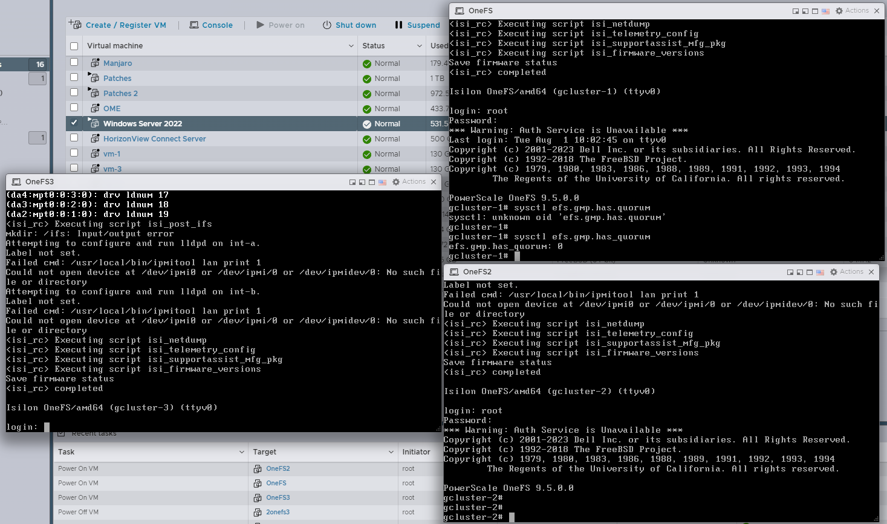

# PowerScale Troubleshooting

In my scenario I needed to resurrect a lab cluster I had not used in some time. It had FIPS enabled and had previously used Active Directory for authentication. After turning everything on I noticed the system didn't have a quorum and I wasn't able to hit it via SSH.




## Rebuild

I factory reset the nodes to save time with `isi_reformat_node`

## Initial Setup

These are the settings I used for my build. Since I was building this in a lab I told it to use the internal IP addresses for external as well instead of making them separate sets.

| Configuration Item      | Value                |
|-------------------------|--------------------------|
| Cluster name            | grantcluster             |
| Encoding                | utf-8                    |
| int-a netmask           | 255.255.255.0            |
| int-a IP ranges         | { 10.10.25.80-10.10.25.89 } |
| int-a IP range          | { 10.10.25.80-10.10.25.89 } |
| int-a gateway           | 10.10.25.1               |
| SmartConnect zone name  | onefs                    |
| DNS servers             | { 10.10.25.120 }         |
| Search domains          | { grant.lan, lan }       |

After I joined the nodes together I confirmed they had a quorum:

```bash
grantcluster-1# sysctl efs.gmp.has_quorum
efs.gmp.has_quorum: 1
grantcluster-1# sysctl efs.gmp.has_super_block_quorum
efs.gmp.has_super_block_quorum: 1
```

1 indicates success whereas 0 indicates that there is no quorum. Super Blocks are described [here](#super-block-quorum).

## Code Test

```python
from pprint import pprint
import requests
import base64
import json

import urllib3

urllib3.disable_warnings(urllib3.exceptions.InsecureRequestWarning)

def print_response(response):
    """
    Helper function to print the response details.
    """
    print(f"Status Code: {response.status_code}")
    try:
        pprint(response.json())
    except json.JSONDecodeError:
        print(response.text)

def basic_authentication(ip_address, username, password):
    """
    Authenticate using HTTP Basic Authentication and return True if successful.
    """
    base_url = f"https://{ip_address}:8080"  # Adjust the port if necessary
    auth_header = base64.b64encode(f"{username}:{password}".encode()).decode()
    headers = {"Authorization": f"Basic {auth_header}"}
    try:
        response = requests.get(f"{base_url}/platform/14/protocols/smb/shares", headers=headers, verify=False)
        print("Basic Authentication Response:")
        print_response(response)
        return response.status_code == 200
    except Exception as e:
        print(f"Error during Basic Authentication: {e}")
        return False

def get_session_details(ip_address, session_cookies):
    """
    Retrieve and print details about the current session.
    """
    base_url = f"https://{ip_address}:8080"
    session_url = f"{base_url}/session/1/session"
    try:
        response = requests.get(session_url, cookies=session_cookies, verify=False)
        print("Session Details Response:")
        print_response(response)
    except Exception as e:
        print(f"Error retrieving session details: {e}")

def session_cookie_authentication(ip_address, username, password):
    """
    Authenticate using Session Cookie and return the session cookies if successful.
    """
    base_url = f"https://{ip_address}:8080"
    session_url = f"{base_url}/session/1/session"
    credentials = {"username": username, "password": password, "services": ["platform", "namespace"]}
    headers = {"Content-Type": "application/json", "Referer": base_url}

    try:
        response = requests.post(session_url, headers=headers, json=credentials, verify=False)
        print("Session Cookie Authentication Response:")
        print_response(response)
        if response.status_code == 201 and 'isisessid' in response.cookies:
            return response.cookies
        else:
            return None
    except Exception as e:
        print(f"Error during Session Cookie Authentication: {e}")
        return None

def csrf_protected_authentication(ip_address, username, password):
    """
    Authenticate using CSRF protected mechanism.
    """
    session_cookies = session_cookie_authentication(ip_address, username, password)
    if session_cookies:
        # Assuming CSRF token is part of the session response or cookies
        csrf_token = session_cookies.get('csrf_token', '')
        headers = {"X-CSRF-Token": csrf_token, "Referer": f"https://{ip_address}:8080"}
        # Valid endpoint for CSRF token validation
        csrf_protected_endpoint = f"https://{ip_address}:8080/platform/14/auth/id"
        try:
            response = requests.get(csrf_protected_endpoint, headers=headers, cookies=session_cookies, verify=False)
            print("CSRF Protected Authentication Response:")
            print_response(response)
            return response.status_code == 200
        except Exception as e:
            print(f"Error during CSRF Protected Authentication: {e}")
            return False
    else:
        return False

# Example usage
ip_address = "10.10.25.80"  # Replace with the actual IP address of the PowerScale
username = "root"
password = "I.am.ghost.47"

# Test Basic Authentication
basic_auth_result = basic_authentication(ip_address, username, password)

print("--------------------------------------------------------------------------------")

# Test Session Cookie Authentication
session_cookies = session_cookie_authentication(ip_address, username, password)
if session_cookies:
    get_session_details(ip_address, session_cookies)

print("--------------------------------------------------------------------------------")

# Test CSRF Protected Authentication
csrf_auth_result = csrf_protected_authentication(ip_address, username, password)

```

```
C:\Users\grant\AppData\Local\Programs\Python\Python310\python.exe "C:\Users\grant\Documents\code\grantcurell.github.io\docs\PowerScale Troubleshooting\authentication_test.py" 
Basic Authentication Response:
Status Code: 401
<!DOCTYPE HTML PUBLIC "-//IETF//DTD HTML 2.0//EN">
<html>
<head>
<title>401 Unauthorized to access PAPI.</title>
</head>
<script type="text/javascript">
        var regex = new RegExp(/http:\/\/([^:]+):([^/]+)/),
            match = regex.exec(window.location.href);

        if (match !== null) {
           window.location = 'https://' + match[1] + ':' + match[2];
        }
 </script>
<body>
<h1>Unauthorized to access PAPI.</h1>
<p>Please contact Administrator.</p>
</body>
</html>

--------------------------------------------------------------------------------
Session Cookie Authentication Response:
Status Code: 201
{'services': ['platform', 'namespace'],
 'timeout_absolute': 14400,
 'timeout_inactive': 900,
 'username': 'root'}
Session Details Response:
Status Code: 200
{'services': ['platform', 'namespace'],
 'timeout_absolute': 14399,
 'timeout_inactive': 899,
 'username': 'root'}
--------------------------------------------------------------------------------
Session Cookie Authentication Response:
Status Code: 201
{'services': ['platform', 'namespace'],
 'timeout_absolute': 14400,
 'timeout_inactive': 900,
 'username': 'root'}
CSRF Protected Authentication Response:
Status Code: 401
<!DOCTYPE HTML PUBLIC "-//IETF//DTD HTML 2.0//EN">
<html>
<head>
<title>401 Unauthorized to access PAPI.</title>
</head>
<script type="text/javascript">
        var regex = new RegExp(/http:\/\/([^:]+):([^/]+)/),
            match = regex.exec(window.location.href);

        if (match !== null) {
           window.location = 'https://' + match[1] + ':' + match[2];
        }
 </script>
<body>
<h1>Unauthorized to access PAPI.</h1>
<p>Please contact Administrator.</p>
</body>
</html>


Process finished with exit code 0

```

## Concepts

### Super Block Quorum

Referred to as `efs.gmp.has_super_block_quorum`, is a property that ensures the file system's integrity by requiring more than half of the nodes in the cluster to be available and in agreement over the internal network. This quorum prevents data conflicts, such as conflicting versions of the same file if two groups of nodes become unsynchronized. If a node is unreachable, OneFS will separate it from the cluster, known as splitting. Operations can continue as long as a quorum of nodes remains connected. If the split nodes can reconnect and re-synchronize, they rejoin the majority group in a process known as merging. The superblock quorum status can be checked by connecting to a node via SSH and running the `sysctl efs.gmp.has_super_block_quorum` command-line tool as root.
